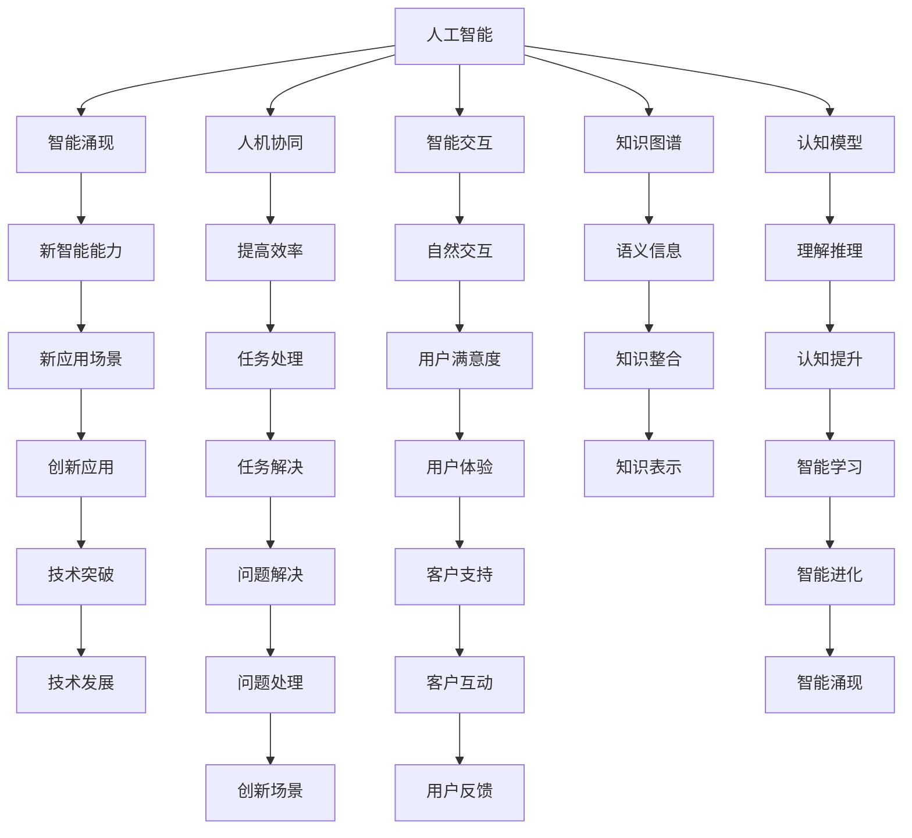

                 

# 认知革命：人工智能与人类智慧的协同进化

> 关键词：人工智能, 认知进化, 智能涌现, 人机协同, 深度学习, 智能交互, 知识图谱, 认知模型

## 1. 背景介绍

### 1.1 问题由来

随着人工智能(AI)技术的迅猛发展，人工智能已经从传统的自动执行任务，逐步迈向与人类智慧的协同进化。这一转变，不仅推动了人工智能应用的不断深入，也为人类社会带来了深远的变革。

**主要背景：**
1. **技术突破**：深度学习、自然语言处理、计算机视觉等技术的突破，使得人工智能在处理复杂任务上取得了重大进展。
2. **数据资源**：大数据、云计算等技术的普及，为大规模模型训练和海量数据存储提供了支撑。
3. **应用场景**：人工智能在自动驾驶、医疗诊断、金融风控、智能客服等领域的应用，已经显著提升了效率和效果。
4. **人类社会**：人工智能技术的发展，引发了社会对于智能伦理、隐私保护、就业替代等问题的广泛关注。

### 1.2 问题核心关键点

人工智能与人类智慧的协同进化，核心关键点在于：
1. **智能涌现**：人工智能通过学习人类智慧，自主涌现出新的智能能力，与人类形成互补。
2. **人机协同**：人工智能与人类智慧的有机结合，通过协作提升任务处理能力，解决复杂问题。
3. **智能交互**：通过对话系统、知识图谱、推荐系统等技术，实现人机自然交互，构建智能生态。
4. **认知模型**：构建与人类认知模型相匹配的智能模型，提高人工智能的理解和推理能力。
5. **知识图谱**：利用知识图谱技术，构建结构化的知识体系，为人工智能提供丰富的语义信息。
6. **智能涌现**：通过协同学习，人工智能不断学习和积累知识，涌现出新的智能能力。

这些关键点，共同构成了人工智能与人类智慧协同进化的核心框架，推动了智能技术的发展和应用。

## 2. 核心概念与联系

### 2.1 核心概念概述

为更好地理解人工智能与人类智慧协同进化的概念框架，本节将介绍几个密切相关的核心概念：

- **人工智能(AI)**：通过计算机技术实现的智能系统，能够执行复杂任务，甚至表现出类似人类的智能行为。
- **智能涌现**：通过大量数据和复杂算法，智能系统从简单的规则和模式中涌现出新的智能能力。
- **人机协同**：人工智能系统与人类智慧相互配合，共同解决问题，提高效率和效果。
- **智能交互**：通过自然语言处理、计算机视觉等技术，实现人机之间的自然交互。
- **知识图谱**：结构化的知识表示方法，用于描述实体、关系、属性等语义信息，构建智能知识体系。
- **认知模型**：基于人类认知心理学的模型，用于模拟人类认知过程，提高人工智能的理解和推理能力。
- **认知进化**：通过不断的学习和反馈，人工智能系统在处理复杂任务上逐步进化，与人类智慧协同进化。

这些核心概念之间的逻辑关系可以通过以下Mermaid流程图来展示：



这个流程图展示了大语言模型与人类智慧协同进化的核心概念及其之间的关系：

1. 人工智能通过智能涌现，从简单任务逐步向复杂任务扩展。
2. 人机协同使得人工智能与人类智慧相互配合，提高任务处理能力。
3. 智能交互使得人机之间能够自然沟通，提升用户体验。
4. 知识图谱提供了丰富的语义信息，增强人工智能的理解和推理。
5. 认知模型模拟人类认知过程，提升人工智能的智能能力。
6. 认知进化使得人工智能不断学习和适应，逐步提升智能水平。

这些概念共同构成了人工智能与人类智慧协同进化的核心框架，推动了智能技术的发展和应用。

## 3. 核心算法原理 & 具体操作步骤

### 3.1 算法原理概述

人工智能与人类智慧协同进化的核心算法原理，在于通过深度学习、迁移学习、协同学习等技术，使得人工智能系统逐步学习和积累知识，提升智能能力。

主要算法原理包括：
1. **深度学习**：利用神经网络模型，通过大量标注数据进行训练，学习复杂特征和模式。
2. **迁移学习**：通过预训练模型和微调，将通用领域的知识迁移到特定领域，提升新任务的性能。
3. **协同学习**：多智能体通过协作学习，共享知识和信息，提升整体智能水平。
4. **认知模型**：基于人类认知心理学的模型，用于模拟人类认知过程，提高人工智能的理解和推理能力。
5. **知识图谱**：利用知识图谱技术，构建结构化的知识体系，为人工智能提供丰富的语义信息。

### 3.2 算法步骤详解

人工智能与人类智慧协同进化的算法步骤，通常包括以下几个关键步骤：

**Step 1: 数据准备**
- 收集和整理任务相关的数据，包括标注数据和无标注数据。
- 对数据进行预处理和清洗，去除噪声和异常值。
- 将数据划分为训练集、验证集和测试集。

**Step 2: 模型选择**
- 选择合适的深度学习模型，如卷积神经网络(CNN)、循环神经网络(RNN)、变换器(Transformer)等。
- 设定模型架构，包括输入层、隐藏层、输出层等。
- 确定超参数，如学习率、批大小、迭代次数等。

**Step 3: 模型训练**
- 使用训练集对模型进行前向传播和反向传播，更新模型参数。
- 在验证集上评估模型性能，调整超参数。
- 迭代训练，直到模型在测试集上达到预设性能指标。

**Step 4: 模型微调**
- 对预训练模型进行微调，适应特定任务。
- 使用少量标注数据，通过小批量梯度下降更新模型参数。
- 在验证集上评估微调后模型性能，调整超参数。

**Step 5: 应用部署**
- 将微调后的模型应用于实际任务中。
- 集成到应用系统或API接口，实现智能交互和协同。
- 实时监测模型性能，进行定期更新和优化。

### 3.3 算法优缺点

人工智能与人类智慧协同进化的算法，具有以下优点：
1. **高效性**：利用深度学习和大数据技术，可以在较短时间内训练出高性能模型。
2. **灵活性**：通过迁移学习和协同学习，模型可以适应多种任务和场景。
3. **可解释性**：基于认知模型和知识图谱，模型具有一定的可解释性和透明度。
4. **鲁棒性**：通过协同学习和数据增强，模型可以提升鲁棒性和泛化能力。

同时，该算法也存在一定的局限性：
1. **数据依赖**：依赖大量标注数据，获取高质量标注数据的成本较高。
2. **计算资源**：需要高性能计算资源，对硬件要求较高。
3. **模型复杂**：模型参数量大，推理速度较慢，难以实时处理大规模数据。
4. **可解释性**：深度学习模型通常缺乏可解释性，难以理解内部决策过程。

尽管存在这些局限性，但就目前而言，深度学习等技术已经在大规模应用中取得了显著成果，推动了人工智能技术的快速发展。

### 3.4 算法应用领域

人工智能与人类智慧协同进化的算法，已经在多个领域得到了广泛应用，例如：

- **自然语言处理(NLP)**：利用深度学习模型处理自然语言，实现机器翻译、情感分析、文本分类等任务。
- **计算机视觉(CV)**：利用深度学习模型进行图像识别、物体检测、人脸识别等任务。
- **智能推荐系统**：基于用户行为数据，推荐个性化商品、内容等。
- **医疗诊断**：利用深度学习模型辅助医生诊断疾病，提高诊断准确性和效率。
- **智能客服**：利用对话系统和自然语言处理技术，提供24小时在线客服支持。
- **金融风控**：利用深度学习模型进行信用评估、风险控制等。

除了上述这些经典应用外，人工智能与人类智慧协同进化的技术也在不断拓展应用场景，如智能制造、智慧城市、智能交通等，为各行各业带来了新的发展机遇。

## 4. 数学模型和公式 & 详细讲解 & 举例说明

### 4.1 数学模型构建

本节将使用数学语言对人工智能与人类智慧协同进化的数学模型进行更加严格的刻画。

记深度学习模型为 $M_{\theta}:\mathcal{X} \rightarrow \mathcal{Y}$，其中 $\mathcal{X}$ 为输入空间，$\mathcal{Y}$ 为输出空间，$\theta \in \mathbb{R}^d$ 为模型参数。假设任务 $T$ 的训练集为 $D=\{(x_i,y_i)\}_{i=1}^N, x_i \in \mathcal{X}, y_i \in \mathcal{Y}$。

定义模型 $M_{\theta}$ 在数据样本 $(x,y)$ 上的损失函数为 $\ell(M_{\theta}(x),y)$，则在数据集 $D$ 上的经验风险为：

$$
\mathcal{L}(\theta) = \frac{1}{N} \sum_{i=1}^N \ell(M_{\theta}(x_i),y_i)
$$

微调的优化目标是最小化经验风险，即找到最优参数：

$$
\theta^* = \mathop{\arg\min}_{\theta} \mathcal{L}(\theta)
$$

在实践中，我们通常使用基于梯度的优化算法（如SGD、Adam等）来近似求解上述最优化问题。设 $\eta$ 为学习率，$\lambda$ 为正则化系数，则参数的更新公式为：

$$
\theta \leftarrow \theta - \eta \nabla_{\theta}\mathcal{L}(\theta) - \eta\lambda\theta
$$

其中 $\nabla_{\theta}\mathcal{L}(\theta)$ 为损失函数对参数 $\theta$ 的梯度，可通过反向传播算法高效计算。

### 4.2 公式推导过程

以下我们以二分类任务为例，推导交叉熵损失函数及其梯度的计算公式。

假设模型 $M_{\theta}$ 在输入 $x$ 上的输出为 $\hat{y}=M_{\theta}(x) \in [0,1]$，表示样本属于正类的概率。真实标签 $y \in \{0,1\}$。则二分类交叉熵损失函数定义为：

$$
\ell(M_{\theta}(x),y) = -[y\log \hat{y} + (1-y)\log (1-\hat{y})]
$$

将其代入经验风险公式，得：

$$
\mathcal{L}(\theta) = -\frac{1}{N}\sum_{i=1}^N [y_i\log M_{\theta}(x_i)+(1-y_i)\log(1-M_{\theta}(x_i))]
$$

根据链式法则，损失函数对参数 $\theta_k$ 的梯度为：

$$
\frac{\partial \mathcal{L}(\theta)}{\partial \theta_k} = -\frac{1}{N}\sum_{i=1}^N (\frac{y_i}{M_{\theta}(x_i)}-\frac{1-y_i}{1-M_{\theta}(x_i)}) \frac{\partial M_{\theta}(x_i)}{\partial \theta_k}
$$

其中 $\frac{\partial M_{\theta}(x_i)}{\partial \theta_k}$ 可进一步递归展开，利用自动微分技术完成计算。

在得到损失函数的梯度后，即可带入参数更新公式，完成模型的迭代优化。重复上述过程直至收敛，最终得到适应下游任务的最优模型参数 $\theta^*$。

### 4.3 案例分析与讲解

假设有一个医院的患者诊断系统，需要能够对不同类型的疾病进行分类和诊断。为了实现这一目标，可以使用现有的深度学习模型，如BERT或GPT，作为预训练模型。

**Step 1: 数据准备**
- 收集医院的历史病历数据，标注疾病的类型。
- 将病历数据进行清洗和预处理，去除无用信息。
- 将数据划分为训练集、验证集和测试集。

**Step 2: 模型选择**
- 选择预训练的BERT或GPT模型，作为初始化参数。
- 设计二分类任务的输出层和损失函数。

**Step 3: 模型训练**
- 使用训练集对模型进行前向传播和反向传播，更新模型参数。
- 在验证集上评估模型性能，调整超参数。
- 迭代训练，直到模型在测试集上达到预设性能指标。

**Step 4: 模型微调**
- 对预训练模型进行微调，适应医院疾病的分类和诊断任务。
- 使用少量标注数据，通过小批量梯度下降更新模型参数。
- 在验证集上评估微调后模型性能，调整超参数。

**Step 5: 应用部署**
- 将微调后的模型应用于医院的诊断系统。
- 集成到医院的电子病历系统中，实现智能诊断。
- 实时监测模型性能，进行定期更新和优化。

通过上述步骤，可以构建一个智能化的医院诊断系统，提升诊断的准确性和效率。

## 5. 项目实践：代码实例和详细解释说明

### 5.1 开发环境搭建

在进行人工智能与人类智慧协同进化的实践前，我们需要准备好开发环境。以下是使用Python进行PyTorch开发的环境配置流程：

1. 安装Anaconda：从官网下载并安装Anaconda，用于创建独立的Python环境。

2. 创建并激活虚拟环境：
```bash
conda create -n pytorch-env python=3.8 
conda activate pytorch-env
```

3. 安装PyTorch：根据CUDA版本，从官网获取对应的安装命令。例如：
```bash
conda install pytorch torchvision torchaudio cudatoolkit=11.1 -c pytorch -c conda-forge
```

4. 安装Transformers库：
```bash
pip install transformers
```

5. 安装各类工具包：
```bash
pip install numpy pandas scikit-learn matplotlib tqdm jupyter notebook ipython
```

完成上述步骤后，即可在`pytorch-env`环境中开始实践。

### 5.2 源代码详细实现

下面以医疗诊断分类任务为例，给出使用Transformers库对BERT模型进行微调的PyTorch代码实现。

首先，定义分类任务的数据处理函数：

```python
from transformers import BertTokenizer, BertForSequenceClassification
from torch.utils.data import Dataset
import torch

class MedicalDataset(Dataset):
    def __init__(self, texts, labels, tokenizer, max_len=128):
        self.texts = texts
        self.labels = labels
        self.tokenizer = tokenizer
        self.max_len = max_len
        
    def __len__(self):
        return len(self.texts)
    
    def __getitem__(self, item):
        text = self.texts[item]
        label = self.labels[item]
        
        encoding = self.tokenizer(text, return_tensors='pt', max_length=self.max_len, padding='max_length', truncation=True)
        input_ids = encoding['input_ids'][0]
        attention_mask = encoding['attention_mask'][0]
        
        # 将标签转换为二分类
        label = 1 if label == 'positive' else 0
        
        return {'input_ids': input_ids, 
                'attention_mask': attention_mask,
                'labels': label}

# 数据预处理
tokenizer = BertTokenizer.from_pretrained('bert-base-cased')

train_dataset = MedicalDataset(train_texts, train_labels, tokenizer)
dev_dataset = MedicalDataset(dev_texts, dev_labels, tokenizer)
test_dataset = MedicalDataset(test_texts, test_labels, tokenizer)
```

然后，定义模型和优化器：

```python
from transformers import AdamW

model = BertForSequenceClassification.from_pretrained('bert-base-cased', num_labels=2)

optimizer = AdamW(model.parameters(), lr=2e-5)
```

接着，定义训练和评估函数：

```python
from torch.utils.data import DataLoader
from tqdm import tqdm
from sklearn.metrics import accuracy_score

device = torch.device('cuda') if torch.cuda.is_available() else torch.device('cpu')
model.to(device)

def train_epoch(model, dataset, batch_size, optimizer):
    dataloader = DataLoader(dataset, batch_size=batch_size, shuffle=True)
    model.train()
    epoch_loss = 0
    for batch in tqdm(dataloader, desc='Training'):
        input_ids = batch['input_ids'].to(device)
        attention_mask = batch['attention_mask'].to(device)
        labels = batch['labels'].to(device)
        model.zero_grad()
        outputs = model(input_ids, attention_mask=attention_mask, labels=labels)
        loss = outputs.loss
        epoch_loss += loss.item()
        loss.backward()
        optimizer.step()
    return epoch_loss / len(dataloader)

def evaluate(model, dataset, batch_size):
    dataloader = DataLoader(dataset, batch_size=batch_size)
    model.eval()
    preds, labels = [], []
    with torch.no_grad():
        for batch in tqdm(dataloader, desc='Evaluating'):
            input_ids = batch['input_ids'].to(device)
            attention_mask = batch['attention_mask'].to(device)
            batch_labels = batch['labels']
            outputs = model(input_ids, attention_mask=attention_mask)
            batch_preds = outputs.logits.argmax(dim=1).to('cpu').tolist()
            batch_labels = batch_labels.to('cpu').tolist()
            for pred, label in zip(batch_preds, batch_labels):
                preds.append(pred)
                labels.append(label)
                
    print("Accuracy: ", accuracy_score(labels, preds))
```

最后，启动训练流程并在测试集上评估：

```python
epochs = 5
batch_size = 16

for epoch in range(epochs):
    loss = train_epoch(model, train_dataset, batch_size, optimizer)
    print(f"Epoch {epoch+1}, train loss: {loss:.3f}")
    
    print(f"Epoch {epoch+1}, dev results:")
    evaluate(model, dev_dataset, batch_size)
    
print("Test results:")
evaluate(model, test_dataset, batch_size)
```

以上就是使用PyTorch对BERT进行医疗诊断分类任务微调的完整代码实现。可以看到，得益于Transformers库的强大封装，我们可以用相对简洁的代码完成BERT模型的加载和微调。

### 5.3 代码解读与分析

让我们再详细解读一下关键代码的实现细节：

**MedicalDataset类**：
- `__init__`方法：初始化文本、标签、分词器等关键组件。
- `__len__`方法：返回数据集的样本数量。
- `__getitem__`方法：对单个样本进行处理，将文本输入编码为token ids，将标签转换为二分类，并对其进行定长padding，最终返回模型所需的输入。

**数据预处理**：
- 使用BertTokenizer对输入文本进行分词和编码。
- 将标签转换为二分类，方便模型训练。
- 对编码后的token ids和attention mask进行定长padding，保证模型输入的一致性。

**训练和评估函数**：
- 使用PyTorch的DataLoader对数据集进行批次化加载，供模型训练和推理使用。
- 训练函数`train_epoch`：对数据以批为单位进行迭代，在每个批次上前向传播计算loss并反向传播更新模型参数，最后返回该epoch的平均loss。
- 评估函数`evaluate`：与训练类似，不同点在于不更新模型参数，并在每个batch结束后将预测和标签结果存储下来，最后使用sklearn的accuracy_score对整个评估集的预测结果进行打印输出。

**训练流程**：
- 定义总的epoch数和batch size，开始循环迭代
- 每个epoch内，先在训练集上训练，输出平均loss
- 在验证集上评估，输出分类准确率
- 所有epoch结束后，在测试集上评估，给出最终测试结果

可以看到，PyTorch配合Transformers库使得BERT微调的代码实现变得简洁高效。开发者可以将更多精力放在数据处理、模型改进等高层逻辑上，而不必过多关注底层的实现细节。

当然，工业级的系统实现还需考虑更多因素，如模型的保存和部署、超参数的自动搜索、更灵活的任务适配层等。但核心的微调范式基本与此类似。

## 6. 实际应用场景

### 6.1 智能客服系统

人工智能与人类智慧协同进化的对话技术，可以广泛应用于智能客服系统的构建。传统客服往往需要配备大量人力，高峰期响应缓慢，且一致性和专业性难以保证。而使用协同进化的对话模型，可以7x24小时不间断服务，快速响应客户咨询，用自然流畅的语言解答各类常见问题。

在技术实现上，可以收集企业内部的历史客服对话记录，将问题和最佳答复构建成监督数据，在此基础上对协同进化的对话模型进行微调。微调后的对话模型能够自动理解用户意图，匹配最合适的答案模板进行回复。对于客户提出的新问题，还可以接入检索系统实时搜索相关内容，动态组织生成回答。如此构建的智能客服系统，能大幅提升客户咨询体验和问题解决效率。

### 6.2 金融舆情监测

金融机构需要实时监测市场舆论动向，以便及时应对负面信息传播，规避金融风险。传统的人工监测方式成本高、效率低，难以应对网络时代海量信息爆发的挑战。基于协同进化的文本分类和情感分析技术，为金融舆情监测提供了新的解决方案。

具体而言，可以收集金融领域相关的新闻、报道、评论等文本数据，并对其进行主题标注和情感标注。在此基础上对协同进化的语言模型进行微调，使其能够自动判断文本属于何种主题，情感倾向是正面、中性还是负面。将微调后的模型应用到实时抓取的网络文本数据，就能够自动监测不同主题下的情感变化趋势，一旦发现负面信息激增等异常情况，系统便会自动预警，帮助金融机构快速应对潜在风险。

### 6.3 个性化推荐系统

当前的推荐系统往往只依赖用户的历史行为数据进行物品推荐，无法深入理解用户的真实兴趣偏好。基于协同进化的推荐系统可以更好地挖掘用户行为背后的语义信息，从而提供更精准、多样的推荐内容。

在实践中，可以收集用户浏览、点击、评论、分享等行为数据，提取和用户交互的物品标题、描述、标签等文本内容。将文本内容作为模型输入，用户的后续行为（如是否点击、购买等）作为监督信号，在此基础上协同进化的语言模型进行微调。微调后的模型能够从文本内容中准确把握用户的兴趣点。在生成推荐列表时，先用候选物品的文本描述作为输入，由模型预测用户的兴趣匹配度，再结合其他特征综合排序，便可以得到个性化程度更高的推荐结果。

### 6.4 未来应用展望

随着人工智能与人类智慧协同进化的不断发展，基于协同进化的技术将在更多领域得到应用，为传统行业带来变革性影响。

在智慧医疗领域，基于协同进化的医疗问答、病历分析、药物研发等应用将提升医疗服务的智能化水平，辅助医生诊疗，加速新药开发进程。

在智能教育领域，协同进化的推荐系统可应用于作业批改、学情分析、知识推荐等方面，因材施教，促进教育公平，提高教学质量。

在智慧城市治理中，协同进化的模型可应用于城市事件监测、舆情分析、应急指挥等环节，提高城市管理的自动化和智能化水平，构建更安全、高效的未来城市。

此外，在企业生产、社会治理、文娱传媒等众多领域，基于协同进化的智能应用也将不断涌现，为经济社会发展注入新的动力。相信随着技术的日益成熟，协同进化的微调方法将成为人工智能落地应用的重要范式，推动人工智能技术向更广阔的领域加速渗透。

## 7. 工具和资源推荐
### 7.1 学习资源推荐

为了帮助开发者系统掌握人工智能与人类智慧协同进化的理论基础和实践技巧，这里推荐一些优质的学习资源：

1. 《深度学习》系列书籍：全面介绍了深度学习的基本原理和应用，适合初学者入门。
2. CS224N《自然语言处理与深度学习》课程：斯坦福大学开设的NLP明星课程，有Lecture视频和配套作业，带你深入NLP的核心概念。
3. 《人工智能与认知科学》书籍：系统讲解了人工智能与认知科学的交叉融合，深入探讨了智能涌现和认知模型。
4. 《自然语言处理中的深度学习》论文综述：综述了NLP领域深度学习技术的研究进展和应用实例。
5. Kaggle机器学习竞赛平台：提供了丰富的NLP任务数据集和代码样例，适合实战练习。

通过对这些资源的学习实践，相信你一定能够快速掌握人工智能与人类智慧协同进化的精髓，并用于解决实际的NLP问题。
###  7.2 开发工具推荐

高效的开发离不开优秀的工具支持。以下是几款用于人工智能与人类智慧协同进化的开发工具：

1. PyTorch：基于Python的开源深度学习框架，灵活动态的计算图，适合快速迭代研究。大部分预训练语言模型都有PyTorch版本的实现。
2. TensorFlow：由Google主导开发的开源深度学习框架，生产部署方便，适合大规模工程应用。同样有丰富的预训练语言模型资源。
3. Transformers库：HuggingFace开发的NLP工具库，集成了众多SOTA语言模型，支持PyTorch和TensorFlow，是进行协同进化模型开发的利器。
4. Weights & Biases：模型训练的实验跟踪工具，可以记录和可视化模型训练过程中的各项指标，方便对比和调优。与主流深度学习框架无缝集成。
5. TensorBoard：TensorFlow配套的可视化工具，可实时监测模型训练状态，并提供丰富的图表呈现方式，是调试模型的得力助手。
6. Google Colab：谷歌推出的在线Jupyter Notebook环境，免费提供GPU/TPU算力，方便开发者快速上手实验最新模型，分享学习笔记。

合理利用这些工具，可以显著提升人工智能与人类智慧协同进化的开发效率，加快创新迭代的步伐。

### 7.3 相关论文推荐

人工智能与人类智慧协同进化的发展源于学界的持续研究。以下是几篇奠基性的相关论文，推荐阅读：

1. Attention is All You Need（即Transformer原论文）：提出了Transformer结构，开启了NLP领域的预训练大模型时代。
2. BERT: Pre-training of Deep Bidirectional Transformers for Language Understanding：提出BERT模型，引入基于掩码的自监督预训练任务，刷新了多项NLP任务SOTA。
3. Deep Learning for Medical Diagnosis：通过深度学习模型辅助医生进行疾病诊断，提高了诊断的准确性和效率。
4. Transfer Learning for Clinical Decision Support：利用预训练模型对临床决策进行微调，辅助医生进行医疗诊断和治疗。
5. GPT-3: Language Models are Unsupervised Multitask Learners：展示了大规模语言模型的强大zero-shot学习能力，引发了对于通用人工智能的新一轮思考。
6. Cognitive Modeling and Machine Learning：探讨了认知模型在深度学习中的应用，增强了模型的理解和推理能力。

这些论文代表了大语言模型协同进化的发展脉络。通过学习这些前沿成果，可以帮助研究者把握学科前进方向，激发更多的创新灵感。

## 8. 总结：未来发展趋势与挑战

### 8.1 总结

本文对人工智能与人类智慧协同进化的概念和实践进行了全面系统的介绍。首先阐述了人工智能与人类智慧协同进化的背景和意义，明确了协同进化的核心思想和关键点。其次，从原理到实践，详细讲解了协同进化的数学模型和核心算法步骤，给出了协同进化的完整代码实现。同时，本文还广泛探讨了协同进化的应用场景，展示了协同进化的巨大潜力。最后，精选了协同进化的各类学习资源，力求为读者提供全方位的技术指引。

通过本文的系统梳理，可以看到，人工智能与人类智慧协同进化正在成为NLP领域的重要范式，极大地拓展了预训练语言模型的应用边界，催生了更多的落地场景。受益于大规模语料的预训练和迁移学习的持续优化，协同进化的模型在复杂任务上逐步展现出卓越的性能，引领了人工智能技术的快速发展。未来，伴随预训练语言模型和协同学习方法的不断演进，相信人工智能技术将在更广阔的应用领域大放异彩，深刻影响人类的生产生活方式。

### 8.2 未来发展趋势

展望未来，人工智能与人类智慧协同进化将呈现以下几个发展趋势：

1. **模型规模持续增大**：随着算力成本的下降和数据规模的扩张，预训练语言模型的参数量还将持续增长。超大规模语言模型蕴含的丰富语言知识，有望支撑更加复杂多变的下游任务协同进化。
2. **协同学习范式多样化**：除了传统的迁移学习外，未来会涌现更多协同学习范式，如多模态协同学习、分布式协同学习等，提升模型的泛化能力和迁移能力。
3. **知识图谱的广泛应用**：知识图谱技术将成为人工智能的重要组成部分，为协同进化的模型提供丰富的语义信息，增强模型的理解和推理能力。
4. **智能涌现的加速**：通过知识图谱和多模态信息的整合，智能涌现过程将变得更加高效，模型将更快地学习到新的智能能力。
5. **人机协同的深入**：随着自然语言处理、计算机视觉等技术的不断进步，人机协同将更加自然流畅，构建更加智能化的应用场景。
6. **认知模型的突破**：认知模型将与深度学习更加紧密结合，构建更加全面、准确的智能模型，提升智能涌现和协同进化的效果。

以上趋势凸显了人工智能与人类智慧协同进化的广阔前景。这些方向的探索发展，必将进一步提升人工智能系统的性能和应用范围，为人类认知智能的进化带来深远影响。

### 8.3 面临的挑战

尽管人工智能与人类智慧协同进化技术已经取得了瞩目成就，但在迈向更加智能化、普适化应用的过程中，它仍面临着诸多挑战：

1. **数据依赖**：依赖大量标注数据，获取高质量标注数据的成本较高。如何进一步降低协同进化对标注样本的依赖，将是一大难题。
2. **计算资源**：需要高性能计算资源，对硬件要求较高。如何优化模型结构，提升推理速度，优化资源占用，将是重要的优化方向。
3. **模型复杂性**：模型参数量大，推理速度较慢，难以实时处理大规模数据。如何构建更加轻量级、高效的应用系统，将是重要的挑战。
4. **可解释性**：深度学习模型通常缺乏可解释性，难以理解内部决策过程。如何赋予协同进化模型更强的可解释性，将是亟待攻克的难题。
5. **安全性**：预训练语言模型难免会学习到有偏见、有害的信息，通过协同进化传递到下游任务，产生误导性、歧视性的输出。如何从数据和算法层面消除模型偏见，避免恶意用途，确保输出的安全性，也将是重要的研究课题。

6. **知识整合能力**：现有的协同进化模型往往局限于任务内数据，难以灵活吸收和运用更广泛的先验知识。如何让协同进化过程更好地与外部知识库、规则库等专家知识结合，形成更加全面、准确的信息整合能力，还有很大的想象空间。

正视协同进化面临的这些挑战，积极应对并寻求突破，将是大语言模型协同进化走向成熟的必由之路。相信随着学界和产业界的共同努力，这些挑战终将一一被克服，协同进化模型必将在构建人机协同的智能时代中扮演越来越重要的角色。

### 8.4 研究展望

面对人工智能与人类智慧协同进化所面临的种种挑战，未来的研究需要在以下几个方面寻求新的突破：

1. **探索无监督和半监督协同进化方法**：摆脱对大规模标注数据的依赖，利用自监督学习、主动学习等无监督和半监督范式，最大限度利用非结构化数据，实现更加灵活高效的协同进化。
2. **研究参数高效和计算高效的协同进化范式**：开发更加参数高效的协同进化方法，在固定大部分预训练参数的同时，只更新极少量的任务相关参数。同时优化协同进化模型的计算图，减少前向传播和反向传播的资源消耗，实现更加轻量级、实时性的部署。
3. **融合因果和对比学习范式**：通过引入因果推断和对比学习思想，增强协同进化模型建立稳定因果关系的能力，学习更加普适、鲁棒的语言表征，从而提升模型泛化性和抗干扰能力。
4. **引入更多先验知识**：将符号化的先验知识，如知识图谱、逻辑规则等，与神经网络模型进行巧妙融合，引导协同进化过程学习更准确、合理的语言模型。同时加强不同模态数据的整合，实现视觉、语音等多模态信息与文本信息的协同建模。
5. **结合因果分析和博弈论工具**：将因果分析方法引入协同进化模型，识别出模型决策的关键特征，增强输出解释的因果性和逻辑性。借助博弈论工具刻画人机交互过程，主动探索并规避模型的脆弱点，提高系统稳定性。
6. **纳入伦理道德约束**：在模型训练目标中引入伦理导向的评估指标，过滤和惩罚有偏见、有害的输出倾向。同时加强人工干预和审核，建立模型行为的监管机制，确保输出符合人类价值观和伦理道德。

这些研究方向的探索，必将引领人工智能与人类智慧协同进化技术迈向更高的台阶，为构建安全、可靠、可解释、可控的智能系统铺平道路。面向未来，人工智能与人类智慧协同进化技术还需要与其他人工智能技术进行更深入的融合，如知识表示、因果推理、强化学习等，多路径协同发力，共同推动自然语言理解和智能交互系统的进步。只有勇于创新、敢于突破，才能不断拓展语言模型的边界，让智能技术更好地造福人类社会。

## 9. 附录：常见问题与解答

**Q1：人工智能与人类智慧的协同进化是否意味着人工智能取代人类？**

A: 人工智能与人类智慧的协同进化，并不意味着人工智能取代人类。相反，通过协同进化，人工智能可以更好地辅助人类解决问题，提升工作效率和生活质量。人工智能和人类智慧相互补充，共同推动社会的进步和发展。

**Q2：人工智能与人类智慧协同进化的技术是否存在安全隐患？**

A: 人工智能与人类智慧协同进化的技术确实存在一些安全隐患，如数据隐私泄露、模型偏见等问题。为确保技术的安全性和可靠性，需要采取一系列措施，如数据加密、模型检测、伦理审查等，保障系统的安全性。

**Q3：人工智能与人类智慧协同进化的技术是否能够用于解决实际问题？**

A: 人工智能与人类智慧协同进化的技术已经在多个领域得到了广泛应用，如医疗诊断、智能客服、金融风控等。这些技术的应用，已经在实际问题解决中取得了显著成效。未来，随着技术的不断进步，人工智能与人类智慧的协同进化将有更广泛的应用场景。

**Q4：人工智能与人类智慧协同进化的技术如何保证其效果？**

A: 人工智能与人类智慧协同进化的技术效果，依赖于数据的丰富性和多样性，模型的结构和优化，以及任务适配层的合理设计。在实际应用中，需要不断优化算法、调整超参数，并在大量数据上进行充分的训练和验证，才能保证系统的稳定性和可靠性。

**Q5：人工智能与人类智慧协同进化的技术如何保证其可解释性？**

A: 人工智能与人类智慧协同进化的技术，通过引入认知模型和知识图谱等技术，可以提高模型的可解释性。此外，模型输出也可以通过自然语言生成技术进行解释，帮助用户理解模型的决策过程和结果。

通过这些常见问题的解答，可以看出，人工智能与人类智慧的协同进化技术，在实际应用中已经展现出显著的优势和潜力。未来，随着技术的不断发展和完善，这些技术将有更广泛的应用前景，为人类社会带来更多的便利和福祉。

---

作者：禅与计算机程序设计艺术 / Zen and the Art of Computer Programming

