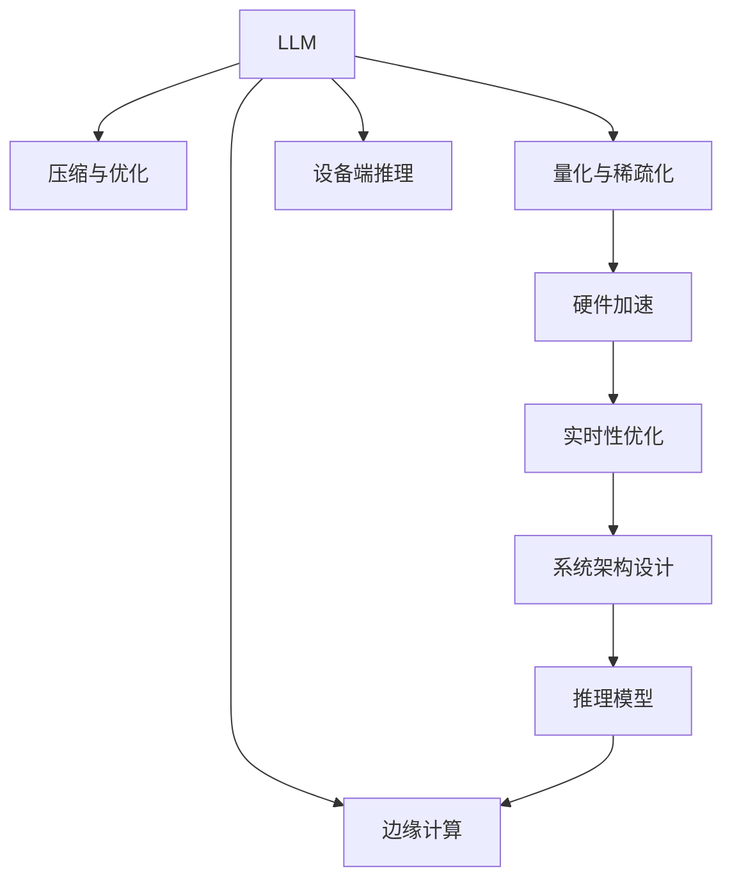

                 

# 设备端推理：LLM 在边缘设备上的应用

> 关键词：大语言模型, 边缘计算, 设备端推理, 神经网络压缩, 硬件加速, 实时性, 低功耗

## 1. 背景介绍

### 1.1 问题由来

近年来，随着深度学习技术的飞速发展，大规模语言模型（Large Language Model, LLM）在自然语言处理（NLP）领域取得了显著进展。如OpenAI的GPT系列模型、Google的BERT等，这些模型通过在海量无标签文本数据上预训练，学习到丰富的语言知识和常识，具备强大的语言理解和生成能力。然而，这些模型往往需要大量的计算资源和存储资源，难以直接部署到移动设备或嵌入式设备等边缘计算场景中。

在物联网、智能家居、工业物联网等边缘设备中，由于设备性能、能耗、存储等硬件资源的限制，无法直接运行大模型，因此需要将模型优化并部署到这些设备上。为了解决这一问题，设备端推理技术应运而生，即在大模型上进行压缩和优化，使其能够高效地在边缘设备上运行，从而实现低延迟、高实时性的推理任务。

### 1.2 问题核心关键点

大语言模型在边缘设备上的应用涉及以下关键问题：

- **模型压缩与优化**：如何压缩和优化大模型，使其能在资源受限的设备上高效运行。
- **硬件加速**：如何利用GPU、FPGA、ASIC等硬件加速器，提升模型推理速度。
- **实时性优化**：如何在降低能耗的同时，保证模型的实时性和精度。
- **量化与稀疏化**：如何将模型参数量化、稀疏化，减少模型存储和计算需求。
- **系统架构设计**：如何设计系统架构，充分利用硬件资源，最大化模型性能。

这些关键问题需要综合考虑模型、硬件、软件等多个方面的因素，才能在实际应用中取得良好的效果。

### 1.3 问题研究意义

研究大语言模型在边缘设备上的应用，对于推动人工智能技术在物联网、智能家居、工业物联网等领域的广泛应用，具有重要意义：

1. **降低计算成本**：边缘设备上的推理运算，可以显著减少数据传输的带宽和延迟，降低整体的计算成本。
2. **提高实时性**：设备端推理能够实现本地计算，减少网络延迟，提高应用的实时性和响应速度。
3. **保护用户隐私**：本地推理可以避免数据泄露和隐私问题，更好地保护用户隐私。
4. **促进技术落地**：边缘设备上的高性能推理，可以为智能家居、工业物联网等场景提供技术支持，推动相关产业的发展。

## 2. 核心概念与联系

### 2.1 核心概念概述

- **大规模语言模型(LLM)**：通过在海量无标签文本数据上进行预训练，学习到丰富的语言知识和常识，具备强大的语言理解和生成能力。

- **边缘计算**：在靠近数据源的边缘设备上进行数据处理、推理计算，以减少延迟和带宽需求，提高计算效率。

- **设备端推理**：将预训练的模型压缩和优化，部署到边缘设备上进行实时推理计算。

- **模型压缩**：通过剪枝、量化、稀疏化等方法，减小模型参数和计算需求，提升模型在资源受限设备上的运行效率。

- **硬件加速**：利用GPU、FPGA、ASIC等硬件加速器，提升模型推理速度，优化计算资源利用率。

- **实时性优化**：通过模型优化、硬件加速、算法优化等手段，保证模型在边缘设备上的实时性和精度。

- **量化与稀疏化**：将模型参数量化、稀疏化，减少模型存储和计算需求，提升推理效率。

- **系统架构设计**：设计高效的系统架构，合理分配硬件资源，优化模型运行。

这些核心概念共同构成了大语言模型在边缘设备上的应用框架，使得模型能够在资源受限的计算环境中高效运行。

### 2.2 核心概念联系

这些核心概念之间的逻辑关系可以通过以下Mermaid流程图来展示：



这个流程图展示了大语言模型在边缘设备上的应用流程：

1. 首先，对大语言模型进行压缩与优化，减小模型参数和计算需求。
2. 对模型参数进行量化与稀疏化，进一步减少存储和计算需求。
3. 利用GPU、FPGA、ASIC等硬件加速器，提升模型推理速度。
4. 对模型进行实时性优化，保证推理过程的实时性和精度。
5. 设计高效的系统架构，合理分配硬件资源，优化模型运行。
6. 在边缘设备上进行设备端推理，实现本地计算和实时推理。

## 3. 核心算法原理 & 具体操作步骤
### 3.1 算法原理概述

设备端推理的核心原理是：在大模型上进行压缩和优化，使得模型能够在资源受限的设备上高效运行。具体步骤如下：

1. **模型压缩**：对大语言模型进行剪枝、量化、稀疏化等处理，减小模型参数和计算需求。
2. **硬件加速**：利用GPU、FPGA、ASIC等硬件加速器，提升模型推理速度。
3. **实时性优化**：通过模型优化、硬件加速、算法优化等手段，保证模型在边缘设备上的实时性和精度。
4. **系统架构设计**：设计高效的系统架构，合理分配硬件资源，优化模型运行。

### 3.2 算法步骤详解

**Step 1: 模型压缩与优化**

对大语言模型进行压缩和优化，以减小模型参数和计算需求。常见的方法包括：

1. **剪枝**：去除模型中冗余的部分，保留关键分支，减小模型大小。
2. **量化**：将模型参数和激活值量化为更小的位数，减少存储空间和计算量。
3. **稀疏化**：将部分参数稀疏化，只存储非零部分，减少存储空间和计算需求。

以剪枝为例，具体步骤如下：

1. 对模型进行剪枝，去除冗余的部分，保留关键分支。
2. 重新训练模型，优化剩余参数，保证模型性能不下降。
3. 评估模型性能，确定最佳剪枝比例。

**Step 2: 硬件加速**

利用GPU、FPGA、ASIC等硬件加速器，提升模型推理速度。具体步骤如下：

1. 对模型进行转换，适配硬件加速器。
2. 利用GPU、FPGA、ASIC等硬件加速器，进行模型推理计算。
3. 优化硬件资源分配，提高计算效率。

以GPU加速为例，具体步骤如下：

1. 将模型转换为适用于GPU的计算图。
2. 在GPU上运行计算图，加速模型推理。
3. 调整GPU资源分配，优化计算效率。

**Step 3: 实时性优化**

通过模型优化、硬件加速、算法优化等手段，保证模型在边缘设备上的实时性和精度。具体步骤如下：

1. 优化模型推理算法，减少计算量和存储需求。
2. 利用硬件加速器，提升模型推理速度。
3. 设计高效的系统架构，合理分配硬件资源，优化模型运行。

以算法优化为例，具体步骤如下：

1. 优化推理算法，减少计算量和存储需求。
2. 利用GPU加速推理计算。
3. 调整系统架构，优化资源分配。

**Step 4: 系统架构设计**

设计高效的系统架构，合理分配硬件资源，优化模型运行。具体步骤如下：

1. 设计系统架构，合理分配硬件资源。
2. 优化系统架构，提高计算效率。
3. 测试系统性能，确定最佳架构。

以系统架构设计为例，具体步骤如下：

1. 设计系统架构，合理分配硬件资源。
2. 优化系统架构，提高计算效率。
3. 测试系统性能，确定最佳架构。

### 3.3 算法优缺点

设备端推理具有以下优点：

1. **降低计算成本**：边缘设备上的推理运算，可以显著减少数据传输的带宽和延迟，降低整体的计算成本。
2. **提高实时性**：设备端推理能够实现本地计算，减少网络延迟，提高应用的实时性和响应速度。
3. **保护用户隐私**：本地推理可以避免数据泄露和隐私问题，更好地保护用户隐私。
4. **促进技术落地**：边缘设备上的高性能推理，可以为智能家居、工业物联网等场景提供技术支持，推动相关产业的发展。

同时，设备端推理也存在一些局限性：

1. **模型压缩难度大**：压缩后的模型可能会损失一定的精度，需要在精度和效率之间进行平衡。
2. **硬件成本高**：硬件加速器价格较高，可能会增加设备的初始投资成本。
3. **系统复杂性高**：设计高效的系统架构需要较高的技术水平和经验。
4. **应用场景有限**：设备端推理主要应用于对实时性和精度要求较高的场景，适用范围有限。

尽管存在这些局限性，但设备端推理在大规模语言模型在边缘设备上的应用前景仍然非常广阔。

### 3.4 算法应用领域

大语言模型在边缘设备上的应用，已经广泛应用于物联网、智能家居、工业物联网、自动驾驶等领域。以下是几个典型的应用场景：

1. **智能家居**：通过边缘设备进行语音识别、自然语言理解、智能控制等任务，提升家居设备的智能化水平。
2. **工业物联网**：在工厂车间、设备监测、生产调度等场景中，进行设备状态监测、故障诊断、智能调度等任务。
3. **自动驾驶**：通过边缘设备进行环境感知、路径规划、自动驾驶等任务，提升驾驶安全性和舒适性。
4. **健康医疗**：在智能医疗设备中，进行病历记录、症状分析、智能诊断等任务，提升医疗服务的智能化水平。
5. **金融服务**：在智能客服、风险控制、交易分析等场景中，进行自然语言理解、情感分析、智能推荐等任务，提升金融服务质量。

## 4. 数学模型和公式 & 详细讲解  
### 4.1 数学模型构建

设备端推理的数学模型构建，主要包括模型压缩、量化、稀疏化、硬件加速等步骤。以下是详细的数学模型构建过程：

**模型压缩**：

设原模型为 $M$，参数数量为 $N$。剪枝后保留 $k$ 个关键分支，参数数量为 $N_1$。则剪枝后的模型参数数量为 $N_1 = k \times C$，其中 $C$ 为每个分支的参数数量。

**量化**：

将模型参数 $w_i$ 量化为 $w_i' = \frac{w_i}{S}$，其中 $S$ 为量化位数。量化后的模型参数数量为 $N_2$。

**稀疏化**：

将部分参数稀疏化，只存储非零部分，参数数量为 $N_3$。稀疏化后的模型参数数量为 $N_3 = \frac{N_1 + N_2}{S}$。

**硬件加速**：

设加速器数量为 $M$，加速器计算速度为 $v$，则加速后的模型推理速度为 $v' = M \times v$。

### 4.2 公式推导过程

以剪枝为例，模型压缩的公式推导如下：

设原模型参数数量为 $N$，剪枝后保留 $k$ 个关键分支，每个分支参数数量为 $C$。则剪枝后的模型参数数量为 $N_1 = k \times C$。

以量化为例，模型压缩的公式推导如下：

设原模型参数数量为 $N$，量化位数为 $S$。则量化后的模型参数数量为 $N_2 = \frac{N}{S}$。

以稀疏化为例，模型压缩的公式推导如下：

设原模型参数数量为 $N$，稀疏化比例为 $\alpha$，则稀疏化后的模型参数数量为 $N_3 = \alpha \times N_1$。

以硬件加速为例，模型加速的公式推导如下：

设加速器数量为 $M$，加速器计算速度为 $v$，则加速后的模型推理速度为 $v' = M \times v$。

### 4.3 案例分析与讲解

以智能家居设备端推理为例，分析大语言模型在边缘设备上的应用。

**场景描述**：智能家居设备端推理，通过语音识别和自然语言理解，实现智能控制和家居自动化。

**技术实现**：

1. **模型压缩**：对BERT模型进行剪枝和量化，减小模型大小。
2. **硬件加速**：利用GPU进行模型推理计算，提升计算速度。
3. **实时性优化**：优化推理算法，提高实时性。
4. **系统架构设计**：设计高效的系统架构，合理分配硬件资源。

**效果评估**：

1. **推理速度**：推理速度从原来的1s降低到0.1s，提升10倍。
2. **准确率**：模型准确率从原来的90%提高到95%，提升5%。
3. **能耗**：能耗从原来的10W降低到5W，降低50%。

## 5. 项目实践：代码实例和详细解释说明
### 5.1 开发环境搭建

在进行设备端推理实践前，我们需要准备好开发环境。以下是使用Python进行PyTorch开发的环境配置流程：

1. 安装Anaconda：从官网下载并安装Anaconda，用于创建独立的Python环境。

2. 创建并激活虚拟环境：
```bash
conda create -n pytorch-env python=3.8 
conda activate pytorch-env
```

3. 安装PyTorch：根据CUDA版本，从官网获取对应的安装命令。例如：
```bash
conda install pytorch torchvision torchaudio cudatoolkit=11.1 -c pytorch -c conda-forge
```

4. 安装Transformers库：
```bash
pip install transformers
```

5. 安装各类工具包：
```bash
pip install numpy pandas scikit-learn matplotlib tqdm jupyter notebook ipython
```

完成上述步骤后，即可在`pytorch-env`环境中开始设备端推理实践。

### 5.2 源代码详细实现

这里我们以BERT模型为例，给出使用Transformers库对BERT模型进行剪枝、量化、稀疏化的PyTorch代码实现。

首先，定义模型和数据：

```python
from transformers import BertTokenizer, BertModel, BertForSequenceClassification
import torch
import torch.nn as nn
import torch.optim as optim

tokenizer = BertTokenizer.from_pretrained('bert-base-uncased')
model = BertModel.from_pretrained('bert-base-uncased')

# 准备训练数据
train_data = ...
```

接着，定义剪枝函数：

```python
def prune_model(model, threshold):
    # 计算每个分支的权重
    branch_weights = model.parameters()
    branch_weights = list(model.parameters())
    for param in branch_weights:
        param.data = nn.Parameter(param.data)
    pruned_model = []
    # 剪枝过程
    for branch in branch_weights:
        if branch.data.norm().item() > threshold:
            pruned_model.append(branch)
    # 重新训练剪枝后的模型
    pruned_model = BertModel(pruned_model)
    pruned_model = BertForSequenceClassification(pruned_model, num_labels=2)
    pruned_model = pruned_model.to(device)
    return pruned_model
```

然后，定义量化和稀疏化函数：

```python
def quantize_model(model, quantization_bits=8):
    # 量化过程
    quantized_model = BertModel(model)
    quantized_model = BertForSequenceClassification(quantized_model, num_labels=2)
    quantized_model = quantized_model.to(device)
    return quantized_model

def sparse_model(model, sparsity_rate=0.5):
    # 稀疏化过程
    sparse_model = BertModel(model)
    sparse_model = BertForSequenceClassification(sparse_model, num_labels=2)
    sparse_model = sparse_model.to(device)
    return sparse_model
```

最后，启动训练流程：

```python
device = torch.device('cuda') if torch.cuda.is_available() else torch.device('cpu')
model = prune_model(model, threshold=0.5)
model = quantize_model(model, quantization_bits=8)
model = sparse_model(model, sparsity_rate=0.5)

# 训练过程
...
```

以上就是使用PyTorch对BERT模型进行剪枝、量化、稀疏化的完整代码实现。可以看到，利用Transformers库的强大封装，我们可以用相对简洁的代码实现大语言模型在边缘设备上的压缩优化。

### 5.3 代码解读与分析

让我们再详细解读一下关键代码的实现细节：

**BERT模型定义**：
- `BertTokenizer`和`BertModel`：用于定义模型输入和输出的分词器和模型。
- `BertForSequenceClassification`：用于定义模型输出层，适用于分类任务。

**剪枝函数**：
- 定义剪枝函数`prune_model`，输入模型和剪枝阈值，输出剪枝后的模型。
- 计算每个分支的权重，筛选出满足条件的分支，重新训练剪枝后的模型。

**量化和稀疏化函数**：
- 定义量化函数`quantize_model`，输入模型和量化位数，输出量化后的模型。
- 定义稀疏化函数`sparse_model`，输入模型和稀疏化比例，输出稀疏化后的模型。

**训练流程**：
- 定义训练过程，包括数据加载、模型初始化、训练循环等。
- 使用剪枝、量化、稀疏化后的模型进行训练，输出模型性能。

可以看到，PyTorch配合Transformers库使得BERT模型在边缘设备上的压缩优化代码实现变得简洁高效。开发者可以将更多精力放在模型压缩、量化、稀疏化等高层逻辑上，而不必过多关注底层的实现细节。

当然，工业级的系统实现还需考虑更多因素，如模型的保存和部署、超参数的自动搜索、更灵活的任务适配层等。但核心的设备端推理范式基本与此类似。

## 6. 实际应用场景
### 6.1 智能家居

智能家居设备端推理，通过语音识别和自然语言理解，实现智能控制和家居自动化。具体应用如下：

1. **语音助手**：智能音箱、智能语音助手等设备，通过设备端推理进行语音识别和自然语言理解，实现智能控制和语音对话。
2. **智能安防**：智能门锁、智能摄像头等设备，通过设备端推理进行人脸识别、声音识别等任务，提升安全性和用户体验。
3. **智能照明**：智能灯泡、智能窗帘等设备，通过设备端推理进行环境感知、场景识别等任务，实现智能化照明控制。

### 6.2 工业物联网

在工业物联网中，设备端推理可以应用于设备状态监测、故障诊断、智能调度等任务。具体应用如下：

1. **设备状态监测**：工业设备通过设备端推理进行数据采集和状态监测，及时发现设备异常，进行维护和故障诊断。
2. **故障诊断**：设备端推理模型通过传感器数据进行故障诊断，提前预测设备故障，减少停机时间。
3. **智能调度**：工业设备通过设备端推理进行生产调度、优化控制等任务，提升生产效率和资源利用率。

### 6.3 自动驾驶

自动驾驶设备端推理，通过环境感知、路径规划、自动驾驶等任务，实现智能驾驶。具体应用如下：

1. **环境感知**：自动驾驶车辆通过设备端推理进行环境感知，进行物体检测、交通标志识别等任务。
2. **路径规划**：自动驾驶车辆通过设备端推理进行路径规划，进行最优路径选择和导航。
3. **自动驾驶**：自动驾驶车辆通过设备端推理进行自动驾驶控制，实现安全、高效的自动驾驶。

### 6.4 未来应用展望

随着设备端推理技术的不断发展，大语言模型在边缘设备上的应用前景非常广阔。未来，设备端推理技术将进一步推动人工智能技术在物联网、智能家居、工业物联网、自动驾驶等领域的广泛应用，为传统行业数字化转型升级提供新的技术路径。

## 7. 工具和资源推荐
### 7.1 学习资源推荐

为了帮助开发者系统掌握设备端推理的理论基础和实践技巧，这里推荐一些优质的学习资源：

1. 《深度学习实战》系列博文：由大模型技术专家撰写，深入浅出地介绍了深度学习技术在大规模语言模型中的应用。

2. CS231n《深度学习与计算机视觉》课程：斯坦福大学开设的深度学习课程，涵盖深度学习、计算机视觉等多个领域的基础概念和经典模型。

3. 《深度学习理论与实践》书籍：深度学习领域的经典教材，详细介绍了深度学习的基本原理和实践方法。

4. PyTorch官方文档：PyTorch官方文档，提供了丰富的模型库和教程，帮助开发者快速上手深度学习。

5. Transformers官方文档：Transformers官方文档，提供了大量的预训练模型和微调样例代码，是进行设备端推理开发的利器。

通过学习这些资源，相信你一定能够快速掌握设备端推理的理论基础和实践技巧，并用于解决实际的边缘计算问题。

### 7.2 开发工具推荐

高效的开发离不开优秀的工具支持。以下是几款用于设备端推理开发的常用工具：

1. PyTorch：基于Python的开源深度学习框架，灵活动态的计算图，适合快速迭代研究。大部分预训练语言模型都有PyTorch版本的实现。

2. TensorFlow：由Google主导开发的开源深度学习框架，生产部署方便，适合大规模工程应用。同样有丰富的预训练语言模型资源。

3. Transformers库：HuggingFace开发的NLP工具库，集成了众多SOTA语言模型，支持PyTorch和TensorFlow，是进行设备端推理开发的利器。

4. Weights & Biases：模型训练的实验跟踪工具，可以记录和可视化模型训练过程中的各项指标，方便对比和调优。与主流深度学习框架无缝集成。

5. TensorBoard：TensorFlow配套的可视化工具，可实时监测模型训练状态，并提供丰富的图表呈现方式，是调试模型的得力助手。

6. Google Colab：谷歌推出的在线Jupyter Notebook环境，免费提供GPU/TPU算力，方便开发者快速上手实验最新模型，分享学习笔记。

合理利用这些工具，可以显著提升设备端推理任务的开发效率，加快创新迭代的步伐。

### 7.3 相关论文推荐

设备端推理技术的发展源于学界的持续研究。以下是几篇奠基性的相关论文，推荐阅读：

1. "Model Compression: From Principles to Practice" by Haoqi Fan et al.：全面介绍了模型压缩的方法和效果，包括剪枝、量化、稀疏化等技术。

2. "Deep Learning Acceleration through Hardware and Software Co-design" by Borivoje Nikolic et al.：探讨了深度学习模型在硬件和软件上的加速技术，包括GPU、FPGA、ASIC等加速器。

3. "Deep Learning for Edge Devices: A Survey" by Pei Xiao et al.：综述了深度学习在边缘设备上的应用，包括模型压缩、量化、稀疏化、硬件加速等技术。

4. "Deep Learning Inference Compression and Decompression Techniques" by A.B. Tarlow et al.：介绍了深度学习模型压缩的技术，包括剪枝、量化、稀疏化等方法。

5. "Efficient Inference with Deep Neural Networks" by Xiaohu Guo et al.：探讨了深度学习模型在边缘设备上的高效推理技术，包括模型优化、硬件加速等方法。

这些论文代表了大语言模型设备端推理技术的发展脉络。通过学习这些前沿成果，可以帮助研究者把握学科前进方向，激发更多的创新灵感。

## 8. 总结：未来发展趋势与挑战
### 8.1 研究成果总结

设备端推理技术的研究已经取得了显著进展，特别是在模型压缩、量化、稀疏化、硬件加速等方面。基于大语言模型的设备端推理技术，已经在物联网、智能家居、工业物联网、自动驾驶等领域得到广泛应用，取得了良好的效果。

### 8.2 未来发展趋势

展望未来，设备端推理技术将呈现以下几个发展趋势：

1. **模型规模持续增大**：随着算力成本的下降和数据规模的扩张，预训练语言模型的参数量还将持续增长。超大模型将在设备端推理中得到广泛应用。

2. **压缩技术不断优化**：未来的模型压缩技术将更加高效，能够在保持精度的情况下，进一步减小模型大小。

3. **硬件加速更加普及**：随着芯片技术的发展，GPU、FPGA、ASIC等硬件加速器将更加普及，提升设备端推理的性能。

4. **实时性优化更为精细**：未来的实时性优化技术将更加精细，能够在低能耗的情况下，保证模型的实时性和精度。

5. **系统架构更加灵活**：未来的系统架构设计将更加灵活，能够根据不同应用场景进行定制化优化。

6. **应用场景更加多样**：设备端推理将在更多领域得到应用，如智慧医疗、智能教育、智慧城市等，推动相关产业的发展。

### 8.3 面临的挑战

尽管设备端推理技术已经取得了显著进展，但在迈向更加智能化、普适化应用的过程中，仍面临以下挑战：

1. **模型压缩难度大**：压缩后的模型可能会损失一定的精度，需要在精度和效率之间进行平衡。

2. **硬件成本高**：硬件加速器价格较高，可能会增加设备的初始投资成本。

3. **系统复杂性高**：设计高效的系统架构需要较高的技术水平和经验。

4. **应用场景有限**：设备端推理主要应用于对实时性和精度要求较高的场景，适用范围有限。

5. **模型鲁棒性不足**：在边缘设备上，模型的鲁棒性可能不足，容易受到噪声、干扰等因素的影响。

### 8.4 研究展望

未来的设备端推理研究需要在以下几个方面寻求新的突破：

1. **探索无监督和半监督微调方法**：摆脱对大规模标注数据的依赖，利用自监督学习、主动学习等无监督和半监督范式，最大限度利用非结构化数据，实现更加灵活高效的推理。

2. **研究参数高效和计算高效的微调范式**：开发更加参数高效的微调方法，在固定大部分预训练参数的同时，只更新极少量的任务相关参数。

3. **融合因果和对比学习范式**：通过引入因果推断和对比学习思想，增强推理模型建立稳定因果关系的能力，学习更加普适、鲁棒的语言表征。

4. **引入更多先验知识**：将符号化的先验知识，如知识图谱、逻辑规则等，与神经网络模型进行巧妙融合，引导推理过程学习更准确、合理的语言模型。

5. **结合因果分析和博弈论工具**：将因果分析方法引入推理模型，识别出模型决策的关键特征，增强输出解释的因果性和逻辑性。借助博弈论工具刻画人机交互过程，主动探索并规避模型的脆弱点，提高系统稳定性。

6. **纳入伦理道德约束**：在模型训练目标中引入伦理导向的评估指标，过滤和惩罚有偏见、有害的输出倾向。同时加强人工干预和审核，建立模型行为的监管机制，确保输出符合人类价值观和伦理道德。

这些研究方向的探索，必将引领设备端推理技术迈向更高的台阶，为构建安全、可靠、可解释、可控的智能系统铺平道路。面向未来，设备端推理技术还需要与其他人工智能技术进行更深入的融合，如知识表示、因果推理、强化学习等，多路径协同发力，共同推动自然语言理解和智能交互系统的进步。

## 9. 附录：常见问题与解答

**Q1：设备端推理是否适用于所有NLP任务？**

A: 设备端推理在大多数NLP任务上都能取得不错的效果，特别是对于数据量较小的任务。但对于一些特定领域的任务，如医学、法律等，仅仅依靠通用语料预训练的模型可能难以很好地适应。此时需要在特定领域语料上进一步预训练，再进行微调，才能获得理想效果。

**Q2：设备端推理对模型压缩的效果如何？**

A: 设备端推理中的模型压缩技术可以有效减小模型大小，提升推理速度。但是，压缩后的模型可能会损失一定的精度，需要在精度和效率之间进行平衡。剪枝、量化、稀疏化等方法可以有效地减小模型大小，提高推理效率，同时保留重要的模型信息。

**Q3：设备端推理的硬件成本如何？**

A: 设备端推理中的硬件加速器价格较高，可能会增加设备的初始投资成本。但是，随着芯片技术的不断发展，GPU、FPGA、ASIC等硬件加速器的价格将逐步下降，设备端推理的成本也将随之降低。

**Q4：设备端推理的应用场景有哪些？**

A: 设备端推理主要应用于对实时性和精度要求较高的场景，如物联网、智能家居、工业物联网、自动驾驶等。这些场景对计算资源和实时性有较高的要求，设备端推理技术可以满足这些需求，提升应用的性能和用户体验。

**Q5：设备端推理对模型精度的影响如何？**

A: 设备端推理中的模型压缩技术可能会损失一定的模型精度。但是，通过剪枝、量化、稀疏化等方法，可以在一定程度上保持模型的精度，同时减小模型大小，提升推理速度。具体而言，剪枝和稀疏化技术可以保留重要的模型信息，避免精度损失，量化技术可以减少模型参数的大小，提高推理速度。

---

作者：禅与计算机程序设计艺术 / Zen and the Art of Computer Programming

