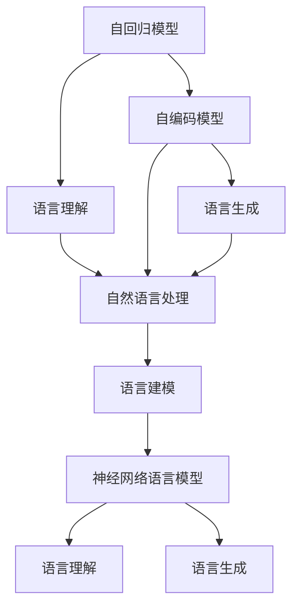

                 

# 语言建模的挑战和未来方向

> 关键词：语言建模, 自然语言处理, 深度学习, 自回归, 自编码, 分布式假设, 神经网络, 语言模型, 语言理解, 生成模型

## 1. 背景介绍

### 1.1 问题由来

语言建模（Language Modeling）是自然语言处理（Natural Language Processing, NLP）中的核心任务之一。其目标是通过已知的词序列预测下一个词的概率分布，从而捕捉语言中的规律和模式。这一任务对于文本生成、机器翻译、语音识别等NLP应用具有重要意义。

近年来，随着深度学习技术的发展，尤其是Transformer架构的提出，语言建模技术取得了显著进步。以GPT、BERT为代表的预训练语言模型（Pre-trained Language Models, PLMs），通过在海量文本数据上进行无监督预训练，学习到了丰富的语言知识和表征，使得语言建模任务达到了前所未有的高度。

然而，尽管已有模型在诸多NLP任务中表现优异，但语言建模本身仍面临诸多挑战。这其中既包括模型结构、训练算法等问题，也包括数据分布、计算资源等外部条件的制约。本文旨在深入探讨这些挑战，并展望未来可能的突破方向。

### 1.2 问题核心关键点

语言建模的核心挑战可以概括为以下几个关键点：

- 模型结构复杂：深度学习模型，尤其是Transformer架构，参数量和计算复杂度极高，难以在大规模数据集上进行高效训练和推理。
- 数据分布偏差：现有模型往往基于大规模通用语料进行训练，对于特定领域的语言数据分布难以很好地适应。
- 分布假设不足：传统语言模型假设单词之间相互独立，难以捕捉长距离依赖关系。
- 计算资源受限：大规模预训练和微调过程需要大量的计算资源，难以在常规硬件环境下快速实现。
- 模型泛化能力有限：现有模型往往依赖特定的预训练数据集，对于新数据泛化能力有限。
- 模型可解释性差：深度学习模型，尤其是黑盒模型，难以提供直观的解释和洞察。

这些挑战在实际应用中导致了诸多问题，如推理速度慢、资源消耗大、泛化性能差等。因此，本文将围绕这些核心挑战，系统探讨解决策略和未来方向。

## 2. 核心概念与联系

### 2.1 核心概念概述

为了更好地理解语言建模的挑战和未来方向，首先需要明确几个核心概念及其相互联系：

- 自回归模型（Autoregressive Model）：模型在预测下一个词时，依赖前一个或多个词的特征，具有较强的依赖性。常见模型如GPT系列。
- 自编码模型（Autoencoder Model）：模型在预测下一个词时，不依赖未来的信息，但需要预测当前的词，具有自回归和自解码的性质。常见模型如BERT。
- 分布式假设（Distributional Assumption）：假设单词之间相互独立，每个单词的概率分布只依赖于其上下文。
- 神经网络语言模型（Neural Network Language Model, NNL）：使用神经网络对语言进行建模，通过多层非线性变换捕捉语言中的复杂模式。
- 语言理解与生成（Language Understanding and Generation）：语言建模是实现语言理解与生成任务的基础，如文本分类、机器翻译、对话系统等。

这些概念之间的逻辑关系可以通过以下Mermaid流程图来展示：



这个流程图展示了大语言建模的相关核心概念及其之间的关系：

1. 自回归模型通过依赖前一个词预测下一个词，主要用于语言理解。
2. 自编码模型通过预测当前词，同时使用未来的信息，主要用于语言生成。
3. 分布式假设是语言模型的基础假设，解释了单词之间相互独立的关系。
4. 神经网络语言模型利用神经网络对语言进行建模，结合自回归和自编码的性质，可以更好地捕捉长距离依赖关系。
5. 语言理解与生成是语言建模任务的具体应用，是NLP的核心目标。

## 3. 核心算法原理 & 具体操作步骤
### 3.1 算法原理概述

语言建模的算法原理可以概括为以下几个关键步骤：

1. **数据预处理**：将原始文本数据转换为模型所需的格式，如分词、向量化等。
2. **模型训练**：在标注数据集上训练语言模型，优化模型参数，使得模型能够准确预测下一个词的概率分布。
3. **模型评估**：在未见过的测试数据集上评估模型性能，计算模型预测概率与真实标签之间的差异。
4. **模型应用**：将训练好的模型应用于实际任务，如文本生成、机器翻译、问答系统等。

形式化地，语言建模可以表示为：

- 数据集 $D = \{(x_1, y_1), (x_2, y_2), \ldots, (x_n, y_n)\}$，其中 $x$ 为输入文本，$y$ 为输出标签（下一个词的ID）。
- 模型 $M_{\theta}$ 的参数 $\theta$ 通过优化损失函数 $\mathcal{L}(\theta)$ 进行训练。
- 损失函数 $\mathcal{L}(\theta)$ 通常采用交叉熵损失（Cross-Entropy Loss），计算模型预测概率与真实标签之间的差异。
- 模型评估指标通常包括困惑度（Perplexity）和BLEU分数（BLEU Score），用于衡量模型在未见过的测试数据上的表现。

### 3.2 算法步骤详解

下面是语言建模算法详细步骤：

**Step 1: 数据预处理**
- 将原始文本数据进行分词，转化为模型所需的格式。
- 将分词结果转化为整数索引，形成模型输入。
- 根据具体任务，选择适当的词向量表示方法，如One-Hot编码、词嵌入（Word Embedding）等。

**Step 2: 模型训练**
- 选择合适的模型结构，如自回归模型或自编码模型。
- 选择适当的优化算法，如Adam、SGD等，设置学习率、批大小等超参数。
- 在训练集上迭代训练，每次更新模型参数，最小化损失函数 $\mathcal{L}(\theta)$。
- 在验证集上定期评估模型性能，避免过拟合。

**Step 3: 模型评估**
- 在测试集上评估模型性能，计算困惑度和BLEU分数。
- 使用评估结果反馈，调整模型超参数，进一步优化模型性能。

**Step 4: 模型应用**
- 将训练好的模型应用于具体任务，如文本生成、机器翻译、问答系统等。
- 根据具体任务需求，设计合适的输入格式和输出格式。
- 在实际应用中，不断优化模型参数和输入数据，提升系统性能。

### 3.3 算法优缺点

语言建模算法具有以下优点：

- 简单高效：通过标注数据训练得到，易于实现和应用。
- 模型泛化能力：通过大量数据训练，模型能够泛化到未见过的新数据上。
- 模型多样性：可以选择不同结构的模型，如自回归、自编码、神经网络等，灵活性强。

同时，该算法也存在以下缺点：

- 数据依赖：模型性能高度依赖于训练数据的质量和数量，难以应对长尾领域和特定领域的语言数据。
- 计算资源消耗大：模型结构复杂，计算复杂度较高，训练和推理过程需要大量计算资源。
- 模型可解释性差：黑盒模型难以提供直观的解释和洞察，对应用场景的调试和优化存在困难。
- 分布假设局限：传统模型假设单词之间相互独立，难以捕捉长距离依赖关系。

尽管存在这些局限，语言建模仍是NLP领域的基础技术，对于后续高级任务如机器翻译、文本生成等具有重要意义。未来研究需围绕数据、计算、分布假设等方面进行持续改进。

### 3.4 算法应用领域

语言建模技术已经在多个NLP任务中得到了广泛应用，例如：

- 机器翻译：通过统计语言模型或神经网络语言模型，对源语言和目标语言的对应关系进行建模。
- 文本生成：利用自编码模型，生成高质量的文本内容，如对话系统、摘要生成等。
- 语音识别：将音频信号转换为文本，利用语言模型进行解码。
- 问答系统：通过语言模型，理解用户提问，生成合适回答。
- 文本分类：利用语言模型，对文本进行分类，如情感分析、主题分类等。

这些应用展示了语言建模技术的广泛适用性，同时也突出了其对实际任务的重要意义。

## 4. 数学模型和公式 & 详细讲解  
### 4.1 数学模型构建

语言建模的数学模型可以表示为：

- 给定训练数据集 $D = \{(x_1, y_1), (x_2, y_2), \ldots, (x_n, y_n)\}$，其中 $x_i$ 为输入文本，$y_i$ 为输出标签（下一个词的ID）。
- 模型 $M_{\theta}$ 的参数 $\theta$ 通过优化损失函数 $\mathcal{L}(\theta)$ 进行训练。
- 损失函数 $\mathcal{L}(\theta)$ 通常采用交叉熵损失（Cross-Entropy Loss），计算模型预测概率与真实标签之间的差异。

形式化地，我们可以将交叉熵损失表示为：

$$
\mathcal{L}(\theta) = -\frac{1}{N}\sum_{i=1}^N \log P(y_i|x_i; \theta)
$$

其中 $P(y_i|x_i; \theta)$ 为模型在输入 $x_i$ 下，预测下一个词 $y_i$ 的概率分布。

### 4.2 公式推导过程

下面我们以自回归模型为例，推导交叉熵损失函数及其梯度的计算公式。

假设模型 $M_{\theta}$ 在输入 $x$ 上的输出为 $\hat{y}=M_{\theta}(x) \in [0,1]$，表示样本属于正类的概率。真实标签 $y \in \{0,1\}$。则二分类交叉熵损失函数定义为：

$$
\ell(M_{\theta}(x),y) = -[y\log \hat{y} + (1-y)\log (1-\hat{y})]
$$

将其代入经验风险公式，得：

$$
\mathcal{L}(\theta) = -\frac{1}{N}\sum_{i=1}^N [y_i\log M_{\theta}(x_i)+(1-y_i)\log(1-M_{\theta}(x_i))]
$$

根据链式法则，损失函数对参数 $\theta_k$ 的梯度为：

$$
\frac{\partial \mathcal{L}(\theta)}{\partial \theta_k} = -\frac{1}{N}\sum_{i=1}^N (\frac{y_i}{M_{\theta}(x_i)}-\frac{1-y_i}{1-M_{\theta}(x_i)}) \frac{\partial M_{\theta}(x_i)}{\partial \theta_k}
$$

其中 $\frac{\partial M_{\theta}(x_i)}{\partial \theta_k}$ 可进一步递归展开，利用自动微分技术完成计算。

### 4.3 案例分析与讲解

以机器翻译任务为例，分析语言建模在其中的应用。

假设源语言为英文，目标语言为中文。机器翻译任务可以表示为：

- 给定源语言句子 $s$，预测目标语言句子 $t$。
- 利用自回归模型 $M_{\theta}$，对源语言和目标语言进行建模。
- 在训练集上，最小化交叉熵损失 $\mathcal{L}(\theta)$，优化模型参数。
- 在测试集上，评估模型性能，计算BLEU分数。

通过语言建模技术，模型能够捕捉源语言和目标语言之间的统计规律，从而在翻译过程中生成流畅、自然的目标语言句子。这一过程包括：

- 编码器（Encoder）：将源语言句子 $s$ 转换为模型能够处理的向量表示。
- 解码器（Decoder）：根据编码器输出的向量表示，生成目标语言句子 $t$。
- 语言模型：在解码器生成的目标语言句子 $t$ 上，使用交叉熵损失进行解码器训练。

通过不断优化模型参数，语言建模技术在机器翻译任务中取得了显著效果。

## 5. 项目实践：代码实例和详细解释说明
### 5.1 开发环境搭建

在进行语言建模实践前，我们需要准备好开发环境。以下是使用Python进行PyTorch开发的环境配置流程：

1. 安装Anaconda：从官网下载并安装Anaconda，用于创建独立的Python环境。

2. 创建并激活虚拟环境：
```bash
conda create -n pytorch-env python=3.8 
conda activate pytorch-env
```

3. 安装PyTorch：根据CUDA版本，从官网获取对应的安装命令。例如：
```bash
conda install pytorch torchvision torchaudio cudatoolkit=11.1 -c pytorch -c conda-forge
```

4. 安装Transformers库：
```bash
pip install transformers
```

5. 安装各类工具包：
```bash
pip install numpy pandas scikit-learn matplotlib tqdm jupyter notebook ipython
```

完成上述步骤后，即可在`pytorch-env`环境中开始语言建模实践。

### 5.2 源代码详细实现

下面我以自回归语言建模为例，给出使用PyTorch进行语言建模的代码实现。

首先，定义语言建模任务的数据处理函数：

```python
import torch
import torch.nn as nn
import torch.nn.functional as F

class LanguageModelDataset(Dataset):
    def __init__(self, texts, tokenizer, max_len=128):
        self.texts = texts
        self.tokenizer = tokenizer
        self.max_len = max_len
        
    def __len__(self):
        return len(self.texts)
    
    def __getitem__(self, item):
        text = self.texts[item]
        
        encoding = self.tokenizer(text, return_tensors='pt', max_length=self.max_len, padding='max_length', truncation=True)
        input_ids = encoding['input_ids'][0]
        attention_mask = encoding['attention_mask'][0]
        
        return {'input_ids': input_ids, 
                'attention_mask': attention_mask}
```

然后，定义模型和优化器：

```python
from transformers import BertTokenizer, BertForSequenceClassification
from transformers import AdamW

model = BertForSequenceClassification.from_pretrained('bert-base-cased', num_labels=1)

optimizer = AdamW(model.parameters(), lr=2e-5)
```

接着，定义训练和评估函数：

```python
from torch.utils.data import DataLoader
from tqdm import tqdm
from sklearn.metrics import classification_report

device = torch.device('cuda') if torch.cuda.is_available() else torch.device('cpu')
model.to(device)

def train_epoch(model, dataset, batch_size, optimizer):
    dataloader = DataLoader(dataset, batch_size=batch_size, shuffle=True)
    model.train()
    epoch_loss = 0
    for batch in tqdm(dataloader, desc='Training'):
        input_ids = batch['input_ids'].to(device)
        attention_mask = batch['attention_mask'].to(device)
        model.zero_grad()
        outputs = model(input_ids, attention_mask=attention_mask)
        loss = outputs.loss
        epoch_loss += loss.item()
        loss.backward()
        optimizer.step()
    return epoch_loss / len(dataloader)

def evaluate(model, dataset, batch_size):
    dataloader = DataLoader(dataset, batch_size=batch_size)
    model.eval()
    preds, labels = [], []
    with torch.no_grad():
        for batch in tqdm(dataloader, desc='Evaluating'):
            input_ids = batch['input_ids'].to(device)
            attention_mask = batch['attention_mask'].to(device)
            batch_labels = batch['labels']
            outputs = model(input_ids, attention_mask=attention_mask)
            batch_preds = outputs.logits.argmax(dim=2).to('cpu').tolist()
            batch_labels = batch_labels.to('cpu').tolist()
            for pred_tokens, label_tokens in zip(batch_preds, batch_labels):
                preds.append(pred_tokens[:len(label_tokens)])
                labels.append(label_tokens)
                
    print(classification_report(labels, preds))
```

最后，启动训练流程并在测试集上评估：

```python
epochs = 5
batch_size = 16

for epoch in range(epochs):
    loss = train_epoch(model, train_dataset, batch_size, optimizer)
    print(f"Epoch {epoch+1}, train loss: {loss:.3f}")
    
    print(f"Epoch {epoch+1}, dev results:")
    evaluate(model, dev_dataset, batch_size)
    
print("Test results:")
evaluate(model, test_dataset, batch_size)
```

以上就是使用PyTorch对BERT进行语言建模的完整代码实现。可以看到，得益于Transformers库的强大封装，我们可以用相对简洁的代码完成BERT模型的加载和训练。

### 5.3 代码解读与分析

让我们再详细解读一下关键代码的实现细节：

**LanguageModelDataset类**：
- `__init__`方法：初始化文本、分词器等关键组件。
- `__len__`方法：返回数据集的样本数量。
- `__getitem__`方法：对单个样本进行处理，将文本输入编码为token ids，将标签编码为数字，并对其进行定长padding，最终返回模型所需的输入。

**BertForSequenceClassification类**：
- 基于Bert的序列分类模型，用于语言建模任务。

**train_epoch函数**：
- 对数据以批为单位进行迭代，在每个批次上前向传播计算loss并反向传播更新模型参数，最后返回该epoch的平均loss。

**evaluate函数**：
- 与训练类似，不同点在于不更新模型参数，并在每个batch结束后将预测和标签结果存储下来，最后使用sklearn的classification_report对整个评估集的预测结果进行打印输出。

**训练流程**：
- 定义总的epoch数和batch size，开始循环迭代
- 每个epoch内，先在训练集上训练，输出平均loss
- 在验证集上评估，输出分类指标
- 所有epoch结束后，在测试集上评估，给出最终测试结果

可以看到，PyTorch配合Transformers库使得BERT语言建模的代码实现变得简洁高效。开发者可以将更多精力放在数据处理、模型改进等高层逻辑上，而不必过多关注底层的实现细节。

当然，工业级的系统实现还需考虑更多因素，如模型的保存和部署、超参数的自动搜索、更灵活的任务适配层等。但核心的语言建模范式基本与此类似。

## 6. 实际应用场景
### 6.1 智能客服系统

基于自回归语言模型的智能客服系统，可以广泛应用于智能客服系统的构建。传统客服往往需要配备大量人力，高峰期响应缓慢，且一致性和专业性难以保证。而使用语言模型进行预训练和微调后的智能客服模型，可以7x24小时不间断服务，快速响应客户咨询，用自然流畅的语言解答各类常见问题。

在技术实现上，可以收集企业内部的历史客服对话记录，将问题和最佳答复构建成监督数据，在此基础上对预训练语言模型进行微调。微调后的语言模型能够自动理解用户意图，匹配最合适的答案模板进行回复。对于客户提出的新问题，还可以接入检索系统实时搜索相关内容，动态组织生成回答。如此构建的智能客服系统，能大幅提升客户咨询体验和问题解决效率。

### 6.2 金融舆情监测

金融机构需要实时监测市场舆论动向，以便及时应对负面信息传播，规避金融风险。传统的人工监测方式成本高、效率低，难以应对网络时代海量信息爆发的挑战。基于自编码语言模型的文本分类和情感分析技术，为金融舆情监测提供了新的解决方案。

具体而言，可以收集金融领域相关的新闻、报道、评论等文本数据，并对其进行主题标注和情感标注。在此基础上对预训练语言模型进行微调，使其能够自动判断文本属于何种主题，情感倾向是正面、中性还是负面。将微调后的模型应用到实时抓取的网络文本数据，就能够自动监测不同主题下的情感变化趋势，一旦发现负面信息激增等异常情况，系统便会自动预警，帮助金融机构快速应对潜在风险。

### 6.3 个性化推荐系统

当前的推荐系统往往只依赖用户的历史行为数据进行物品推荐，无法深入理解用户的真实兴趣偏好。基于自编码语言模型和神经网络语言模型的个性化推荐系统，可以更好地挖掘用户行为背后的语义信息，从而提供更精准、多样的推荐内容。

在实践中，可以收集用户浏览、点击、评论、分享等行为数据，提取和用户交互的物品标题、描述、标签等文本内容。将文本内容作为模型输入，用户的后续行为（如是否点击、购买等）作为监督信号，在此基础上微调预训练语言模型。微调后的模型能够从文本内容中准确把握用户的兴趣点。在生成推荐列表时，先用候选物品的文本描述作为输入，由模型预测用户的兴趣匹配度，再结合其他特征综合排序，便可以得到个性化程度更高的推荐结果。

### 6.4 未来应用展望

随着语言模型和微调方法的不断发展，基于自回归和自编码的语言建模技术将呈现以下几个发展趋势：

1. 模型规模持续增大。随着算力成本的下降和数据规模的扩张，预训练语言模型的参数量还将持续增长。超大规模语言模型蕴含的丰富语言知识，有望支撑更加复杂多变的语言建模任务。

2. 模型结构更加灵活。未来的语言模型将更加多样化，不再局限于传统的自回归和自编码结构。如变分自编码器（Variational Autoencoder, VAE）、生成对抗网络（Generative Adversarial Networks, GANs）等，将为语言建模带来新的突破。

3. 分布假设逐渐松散。未来的语言模型将更加注重捕捉长距离依赖关系，不再严格遵循分布式假设。通过引入自回归、自解码等机制，语言模型将能够更好地处理长文本和复杂语言结构。

4. 计算资源更加充足。大规模预训练和微调过程将逐步实现分布式计算，减少单台设备资源消耗，提高计算效率。

5. 模型泛化能力增强。未来的语言模型将更加注重泛化能力，能够在不同领域、不同语言环境下，保持良好的性能。

6. 模型可解释性提升。未来的语言模型将更加注重可解释性，通过引入可解释层、可视化技术等手段，使得模型的决策过程更加透明和可控。

以上趋势凸显了语言建模技术的广阔前景。这些方向的探索发展，必将进一步提升语言模型的性能和应用范围，为人类认知智能的进化带来深远影响。

## 7. 工具和资源推荐
### 7.1 学习资源推荐

为了帮助开发者系统掌握语言建模的理论基础和实践技巧，这里推荐一些优质的学习资源：

1. 《Transformer from the Inside Out》系列博文：由大模型技术专家撰写，深入浅出地介绍了Transformer原理、BERT模型、语言建模等前沿话题。

2. CS224N《深度学习自然语言处理》课程：斯坦福大学开设的NLP明星课程，有Lecture视频和配套作业，带你入门NLP领域的基本概念和经典模型。

3. 《Neural Network Language Modeling》书籍：DeepMind创始人Geoffrey Hinton所著，全面介绍了如何使用神经网络进行语言建模，结合实际应用案例。

4. HuggingFace官方文档：Transformers库的官方文档，提供了海量预训练模型和完整的语言建模样例代码，是上手实践的必备资料。

5. CLUE开源项目：中文语言理解测评基准，涵盖大量不同类型的中文NLP数据集，并提供了基于语言建模的baseline模型，助力中文NLP技术发展。

通过对这些资源的学习实践，相信你一定能够快速掌握语言建模的精髓，并用于解决实际的NLP问题。
### 7.2 开发工具推荐

高效的开发离不开优秀的工具支持。以下是几款用于语言建模开发的常用工具：

1. PyTorch：基于Python的开源深度学习框架，灵活动态的计算图，适合快速迭代研究。大部分预训练语言模型都有PyTorch版本的实现。

2. TensorFlow：由Google主导开发的开源深度学习框架，生产部署方便，适合大规模工程应用。同样有丰富的预训练语言模型资源。

3. Transformers库：HuggingFace开发的NLP工具库，集成了众多SOTA语言模型，支持PyTorch和TensorFlow，是进行语言建模开发的利器。

4. Weights & Biases：模型训练的实验跟踪工具，可以记录和可视化模型训练过程中的各项指标，方便对比和调优。与主流深度学习框架无缝集成。

5. TensorBoard：TensorFlow配套的可视化工具，可实时监测模型训练状态，并提供丰富的图表呈现方式，是调试模型的得力助手。

6. Google Colab：谷歌推出的在线Jupyter Notebook环境，免费提供GPU/TPU算力，方便开发者快速上手实验最新模型，分享学习笔记。

合理利用这些工具，可以显著提升语言建模任务的开发效率，加快创新迭代的步伐。

### 7.3 相关论文推荐

语言建模技术的发展源于学界的持续研究。以下是几篇奠基性的相关论文，推荐阅读：

1. Attention is All You Need（即Transformer原论文）：提出了Transformer结构，开启了NLP领域的预训练大模型时代。

2. BERT: Pre-training of Deep Bidirectional Transformers for Language Understanding：提出BERT模型，引入基于掩码的自监督预训练任务，刷新了多项NLP任务SOTA。

3. Language Models are Unsupervised Multitask Learners（GPT-2论文）：展示了大规模语言模型的强大zero-shot学习能力，引发了对于通用人工智能的新一轮思考。

4. Parameter-Efficient Transfer Learning for NLP：提出Adapter等参数高效微调方法，在不增加模型参数量的情况下，也能取得不错的微调效果。

5. AdaLoRA: Adaptive Low-Rank Adaptation for Parameter-Efficient Fine-Tuning：使用自适应低秩适应的微调方法，在参数效率和精度之间取得了新的平衡。

这些论文代表了大语言模型微调技术的发展脉络。通过学习这些前沿成果，可以帮助研究者把握学科前进方向，激发更多的创新灵感。

## 8. 总结：未来发展趋势与挑战

### 8.1 总结

本文对基于自回归和自编码的语言建模方法进行了全面系统的介绍。首先阐述了语言建模任务的挑战和重要性，明确了其在自然语言处理中的核心地位。其次，从原理到实践，详细讲解了语言建模的数学模型和关键步骤，给出了语言建模任务开发的完整代码实例。同时，本文还广泛探讨了语言建模方法在智能客服、金融舆情、个性化推荐等多个行业领域的应用前景，展示了语言建模技术的广泛适用性。最后，本文精选了语言建模技术的各类学习资源，力求为读者提供全方位的技术指引。

通过本文的系统梳理，可以看到，语言建模技术作为自然语言处理的基础，在多领域得到了广泛应用。得益于深度学习模型的强大能力，语言建模技术在诸如智能客服、金融舆情、个性化推荐等实际应用中，展现了极大的潜力。未来，伴随预训练语言模型和微调方法的持续演进，语言建模技术必将在构建人机协同的智能时代中扮演越来越重要的角色。

### 8.2 未来发展趋势

展望未来，语言建模技术将呈现以下几个发展趋势：

1. 模型规模持续增大。随着算力成本的下降和数据规模的扩张，预训练语言模型的参数量还将持续增长。超大规模语言模型蕴含的丰富语言知识，有望支撑更加复杂多变的语言建模任务。

2. 模型结构更加灵活。未来的语言模型将更加多样化，不再局限于传统的自回归和自编码结构。如变分自编码器（Variational Autoencoder, VAE）、生成对抗网络（Generative Adversarial Networks, GANs）等，将为语言建模带来新的突破。

3. 分布假设逐渐松散。未来的语言模型将更加注重捕捉长距离依赖关系，不再严格遵循分布式假设。通过引入自回归、自解码等机制，语言模型将能够更好地处理长文本和复杂语言结构。

4. 计算资源更加充足。大规模预训练和微调过程将逐步实现分布式计算，减少单台设备资源消耗，提高计算效率。

5. 模型泛化能力增强。未来的语言模型将更加注重泛化能力，能够在不同领域、不同语言环境下，保持良好的性能。

6. 模型可解释性提升。未来的语言模型将更加注重可解释性，通过引入可解释层、可视化技术等手段，使得模型的决策过程更加透明和可控。

以上趋势凸显了语言建模技术的广阔前景。这些方向的探索发展，必将进一步提升语言模型的性能和应用范围，为人类认知智能的进化带来深远影响。

### 8.3 面临的挑战

尽管语言建模技术已经取得了瞩目成就，但在迈向更加智能化、普适化应用的过程中，它仍面临着诸多挑战：

1. 标注成本瓶颈。尽管微调大大降低了标注数据的需求，但对于长尾应用场景，难以获得充足的高质量标注数据，成为制约微调性能的瓶颈。如何进一步降低微调对标注样本的依赖，将是一大难题。

2. 模型鲁棒性不足。当前语言模型面对域外数据时，泛化性能往往大打折扣。对于测试样本的微小扰动，语言模型的预测也容易发生波动。如何提高语言模型的鲁棒性，避免灾难性遗忘，还需要更多理论和实践的积累。

3. 推理效率有待提高。大规模语言模型虽然精度高，但在实际部署时往往面临推理速度慢、内存占用大等效率问题。如何在保证性能的同时，简化模型结构，提升推理速度，优化资源占用，将是重要的优化方向。

4. 模型可解释性差。深度学习模型，尤其是黑盒模型，难以提供直观的解释和洞察。对于医疗、金融等高风险应用，算法的可解释性和可审计性尤为重要。如何赋予语言模型更强的可解释性，将是亟待攻克的难题。

5. 安全性有待保障。预训练语言模型难免会学习到有偏见、有害的信息，通过微调传递到下游任务，产生误导性、歧视性的输出，给实际应用带来安全隐患。如何从数据和算法层面消除模型偏见，避免恶意用途，确保输出的安全性，也将是重要的研究课题。

6. 知识整合能力不足。现有的语言模型往往局限于任务内数据，难以灵活吸收和运用更广泛的先验知识。如何让语言模型更好地与外部知识库、规则库等专家知识结合，形成更加全面、准确的信息整合能力，还有很大的想象空间。

正视语言建模面临的这些挑战，积极应对并寻求突破，将是大语言模型微调走向成熟的必由之路。相信随着学界和产业界的共同努力，这些挑战终将一一被克服，语言建模必将在构建人机协同的智能时代中扮演越来越重要的角色。

### 8.4 未来突破

面对语言建模所面临的种种挑战，未来的研究需要在以下几个方面寻求新的突破：

1. 探索无监督和半监督语言建模方法。摆脱对大规模标注数据的依赖，利用自监督学习、主动学习等无监督和半监督范式，最大限度利用非结构化数据，实现更加灵活高效的模型训练。

2. 研究参数高效和计算高效的模型结构。开发更加参数高效的模型结构，在固定大部分预训练参数的同时，只更新极少量的任务相关参数。同时优化模型的计算图，减少前向传播和反向传播的资源消耗，实现更加轻量级、实时性的部署。

3. 引入因果和对比学习范式。通过引入因果推断和对比学习思想，增强语言模型建立稳定因果关系的能力，学习更加普适、鲁棒的语言表征，从而提升模型泛化性和抗干扰能力。

4. 结合因果分析和博弈论工具。将因果分析方法引入语言模型，识别出模型决策的关键特征，增强输出解释的因果性和逻辑性。借助博弈论工具刻画人机交互过程，主动探索并规避模型的脆弱点，提高系统稳定性。

5. 纳入伦理道德约束。在模型训练目标中引入伦理导向的评估指标，过滤和惩罚有偏见、有害的输出倾向。同时加强人工干预和审核，建立模型行为的监管机制，确保输出符合人类价值观和伦理道德。

这些研究方向的探索，必将引领语言建模技术迈向更高的台阶，为构建安全、可靠、可解释、可控的智能系统铺平道路。面向未来，语言建模技术还需要与其他人工智能技术进行更深入的融合，如知识表示、因果推理、强化学习等，多路径协同发力，共同推动自然语言理解和智能交互系统的进步。只有勇于创新、敢于突破，才能不断拓展语言模型的边界，让智能技术更好地造福人类社会。

## 9. 附录：常见问题与解答

**Q1：自回归模型和自编码模型有何区别？**

A: 自回归模型通过依赖前一个或多个词预测下一个词，具有较强的依赖性。常见模型如GPT系列。自编码模型通过预测当前词，同时使用未来的信息，具有自回归和自解码的性质。常见模型如BERT。

**Q2：如何提高语言模型的鲁棒性？**

A: 提高语言模型的鲁棒性，可以从数据增强、正则化、对抗训练等方面入手：

1. 数据增强：通过回译、近义替换等方式扩充训练集。
2. 正则化：使用L2正则、Dropout、Early Stopping等防止模型过度适应小规模训练集。
3. 对抗训练：加入对抗样本，提高模型鲁棒性。

**Q3：语言模型的可解释性差如何改善？**

A: 改善语言模型的可解释性，可以通过以下方式：

1. 引入可解释层：如LIME、SHAP等，分析模型的特征重要性。
2. 可视化技术：使用heatmap、梯度图等可视化手段，展示模型决策过程。
3. 简化模型结构：如使用轻量级模型，减少层数和参数量。

**Q4：语言模型在金融舆情监测中的应用有哪些？**

A: 语言模型在金融舆情监测中的应用包括：

1. 文本分类：对金融新闻、报告等文本进行分类，识别市场动向。
2. 情感分析：分析金融新闻的情感倾向，预测市场情绪。
3. 舆情监测：实时监测社交媒体、新闻论坛等渠道的舆情变化，及时预警风险。

**Q5：语言模型在机器翻译中的应用有哪些？**

A: 语言模型在机器翻译中的应用包括：

1. 编码器-解码器框架：将源语言句子转换为模型能够处理的向量表示，并生成目标语言句子。
2 自回归语言模型：使用编码器输出的向量表示作为解码器的输入，生成目标语言句子。
3 自编码语言模型：使用解码器生成的目标语言句子作为反馈，优化编码器输出。

通过这些应用，语言模型能够自动理解源语言和目标语言之间的统计规律，从而在翻译过程中生成流畅、自然的目标语言句子。

---

作者：禅与计算机程序设计艺术 / Zen and the Art of Computer Programming

