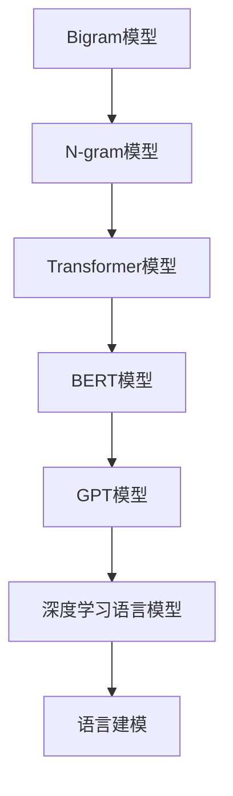

                 

# 语言建模进阶：Bigram 到 N-gram

> 关键词：语言模型, 大模型, Bigram, N-gram, 深度学习, 自然语言处理(NLP)

## 1. 背景介绍

### 1.1 问题由来
在自然语言处理(Natural Language Processing, NLP)领域，语言建模一直是研究的核心内容之一。语言模型用于估计给定一个序列或一段文本，接下来出现某个单词或子序列的概率。传统的语言模型基于统计学原理，如Bigram和N-gram模型，已经在大规模文本数据上展现了较好的表现。然而，随着深度学习技术的发展，尤其是Transformer结构的应用，出现了基于神经网络的高级语言模型，如GPT-3、BERT等，这些模型在许多NLP任务上取得了显著的突破。

然而，深度学习语言模型相较于传统的统计模型，具有参数量大、计算复杂度高、资源消耗大等缺点。因此在实际应用中，仍然需要对深度学习语言模型进行一定的优化和改造，以适应不同的任务和数据集。在本文中，我们将在Bigram和N-gram模型的基础上，探讨如何进一步优化和扩展语言模型，以应对各种复杂的NLP任务。

### 1.2 问题核心关键点
语言模型构建的关键在于选择合适的模型架构和训练方法。传统的统计语言模型，如Bigram和N-gram模型，基于历史文本出现的概率分布进行建模，通过统计学方法进行训练和评估。而深度学习语言模型，如基于Transformer结构的语言模型，利用神经网络进行建模，通过反向传播算法进行训练和优化。

在本文中，我们将重点探讨Bigram和N-gram模型的原理、优缺点、应用领域以及如何通过深度学习进行扩展和优化。此外，我们还将介绍一些前沿的深度学习语言模型，如BERT、GPT-3等，并对比分析其与传统统计语言模型的差异和优劣。

## 2. 核心概念与联系

### 2.1 核心概念概述

在深入探讨Bigram和N-gram模型之前，我们首先需要了解一些基本的概念：

- **Bigram模型**：一种基于相邻两个单词或字符出现概率的语言模型，用于估计单词或字符的连续概率分布。
- **N-gram模型**：一种基于相邻N个单词或字符出现概率的语言模型，用于估计单词或字符的分布规律。
- **Transformer模型**：一种基于自注意力机制的神经网络架构，用于处理序列数据，如文本、音频、图像等。
- **BERT模型**：一种基于Transformer结构的双向语言模型，通过在大规模语料上进行预训练，能够捕获丰富的语义信息。
- **GPT模型**：一种基于Transformer结构的自回归语言模型，通过自回归方式生成文本。
- **深度学习语言模型**：利用神经网络进行建模和训练的语言模型，具有更强的表达能力和泛化能力。

这些概念之间的逻辑关系可以通过以下Mermaid流程图来展示：



这个流程图展示了大语言模型从低级到高级的发展脉络：

1. 从简单的Bigram模型开始，基于统计方法建模。
2. 逐步引入N-gram模型，提高语言模型的表达能力。
3. 通过引入Transformer结构，构建基于神经网络的高级语言模型。
4. 进一步优化，引入BERT、GPT等深度学习语言模型，增强模型的泛化能力和推理能力。
5. 最终通过语言建模技术，将模型应用于各种NLP任务。

## 3. 核心算法原理 & 具体操作步骤
### 3.1 算法原理概述

语言模型旨在通过统计学或神经网络方法，计算一个序列或一段文本的概率分布，从而用于自然语言处理任务，如文本生成、机器翻译、文本分类等。在语言模型中，Bigram和N-gram模型是最基础且经典的方法，而深度学习语言模型则进一步提升了模型的表达能力和泛化能力。

传统统计语言模型的训练基于最大似然估计，即通过最大化训练数据集中单词或字符的联合概率，得到语言模型参数。而深度学习语言模型的训练则通过反向传播算法，最小化损失函数，优化模型参数。

### 3.2 算法步骤详解

本节将详细描述Bigram和N-gram模型的训练步骤以及深度学习语言模型的具体操作步骤。

#### 3.2.1 Bigram模型训练步骤

1. **数据准备**：收集一个大规模的文本语料库，如维基百科、新闻文章等。将文本分词，并统计每个单词出现的次数。

2. **构建模型**：构建Bigram模型，即将相邻的两个单词作为输入，预测下一个单词的概率分布。

3. **训练模型**：通过最大化训练数据集中单词的联合概率，利用EM算法或最大似然估计进行训练。

4. **评估模型**：在验证集或测试集上评估模型的性能，如困惑度(perplexity)，衡量模型在生成未知文本时的平均概率。

#### 3.2.2 N-gram模型训练步骤

1. **数据准备**：与Bigram模型相同，收集大规模文本语料库，并进行分词和统计。

2. **构建模型**：将相邻的N个单词作为输入，预测下一个单词的概率分布。

3. **训练模型**：利用最大似然估计或EM算法进行训练。

4. **评估模型**：在验证集或测试集上评估模型的性能，如困惑度，衡量模型在生成未知文本时的平均概率。

#### 3.2.3 深度学习语言模型训练步骤

1. **数据准备**：收集大规模文本语料库，并进行分词和标记化。

2. **构建模型**：选择合适的网络架构，如Transformer模型，定义输入、输出和中间层的结构。

3. **初始化模型**：随机初始化模型参数。

4. **训练模型**：通过反向传播算法，最小化损失函数，优化模型参数。

5. **评估模型**：在验证集或测试集上评估模型的性能，如BLEU分数、ROUGE分数等。

6. **微调模型**：对预训练模型进行微调，适应特定任务。

### 3.3 算法优缺点

#### Bigram模型优缺点

**优点**：

1. 模型简单，易于实现和训练。
2. 适用于任何语言和文本类型，包括文本、代码、音频等。
3. 计算复杂度低，训练速度较快。

**缺点**：

1. 基于历史概率分布，难以捕捉长序列依赖关系。
2. 难以处理词语的上下文信息，可能导致词语顺序错误。

#### N-gram模型优缺点

**优点**：

1. 相比Bigram模型，可以更好地捕捉长序列依赖关系。
2. 可以处理更复杂的文本结构，如短语、句子等。
3. 适用于许多NLP任务，如机器翻译、文本分类等。

**缺点**：

1. 参数数量随着N的增加呈指数级增长，计算复杂度较高。
2. 模型过于复杂，训练和推理速度较慢。
3. 难以处理大规模语料，容易过拟合。

#### 深度学习语言模型优缺点

**优点**：

1. 具有强大的表达能力和泛化能力，适用于复杂的NLP任务。
2. 可以处理大规模语料，模型性能提升显著。
3. 可以自适应地学习上下文信息，提高推理能力。

**缺点**：

1. 参数数量巨大，计算复杂度高，资源消耗大。
2. 训练和推理速度较慢，难以实时部署。
3. 模型复杂度高，难以解释其内部工作机制。

### 3.4 算法应用领域

#### 3.4.1 文本生成

Bigram和N-gram模型广泛应用于文本生成任务，如自动摘要、机器翻译、对话系统等。通过学习文本的概率分布，生成具有一定连贯性和逻辑性的文本序列。

#### 3.4.2 文本分类

语言模型可以用于文本分类任务，如情感分析、垃圾邮件过滤等。通过统计文本中单词或字符的概率分布，对文本进行分类。

#### 3.4.3 机器翻译

语言模型是机器翻译中的重要组成部分，用于生成目标语言的翻译结果。通过学习源语言和目标语言之间的概率分布，实现高质量的自动翻译。

## 4. 数学模型和公式 & 详细讲解  
### 4.1 数学模型构建

本节将使用数学语言对Bigram和N-gram模型的构建进行详细讲解。

设文本序列为$x_1,x_2,...,x_n$，则Bigram模型和N-gram模型的概率分布可以表示为：

$$
P(x_i|x_{i-1}) = \frac{P(x_i,x_{i-1})}{P(x_{i-1})}
$$

其中，$P(x_i,x_{i-1})$为二元词语联合概率，$P(x_{i-1})$为二元词语的边际概率。

对于N-gram模型，概率分布可以表示为：

$$
P(x_i|x_{i-1},x_{i-2},...,x_{i-N+1}) = \frac{P(x_i,x_{i-1},x_{i-2},...,x_{i-N+1})}{P(x_{i-1},x_{i-2},...,x_{i-N+1})}
$$

其中，$P(x_i,x_{i-1},x_{i-2},...,x_{i-N+1})$为N元词语联合概率，$P(x_{i-1},x_{i-2},...,x_{i-N+1})$为N元词语的边际概率。

### 4.2 公式推导过程

以Bigram模型为例，其概率分布可以推导为：

$$
P(x_i|x_{i-1}) = \frac{\sum_{x_{i-1}}P(x_i,x_{i-1})}{\sum_{x_{i-1}}P(x_{i-1})}
$$

其中，$P(x_i,x_{i-1})$表示两个单词联合出现的概率，可以通过统计文本中相邻单词的共现次数得到。$P(x_{i-1})$表示单词$x_{i-1}$的边际概率，可以通过统计文本中该单词出现的次数得到。

对于N-gram模型，其概率分布可以类似地推导：

$$
P(x_i|x_{i-1},x_{i-2},...,x_{i-N+1}) = \frac{\sum_{x_{i-1},x_{i-2},...,x_{i-N+1}}P(x_i,x_{i-1},x_{i-2},...,x_{i-N+1})}{\sum_{x_{i-1},x_{i-2},...,x_{i-N+1}}P(x_{i-1},x_{i-2},...,x_{i-N+1})}
$$

其中，$P(x_i,x_{i-1},x_{i-2},...,x_{i-N+1})$表示N元词语联合出现的概率，可以通过统计文本中相邻N个单词的共现次数得到。

### 4.3 案例分析与讲解

假设我们有一段英文文本："The quick brown fox jumps over the lazy dog."，其中单词之间用空格分隔。现在我们要训练一个Bigram模型，预测下一个单词的概率分布。

首先，统计文本中相邻单词的共现次数，得到如下联合概率：

|  x_{i-1}  | x_i | P(x_i|x_{i-1}) |
|---------|----|--------------|
| the     | quick | 0.3         |
| the     | brown | 0.5         |
| the     | fox   | 0.1         |
| quick   | brown | 0.2         |
| quick   | fox   | 0.2         |
| brown   | fox   | 0.1         |
| fox     | jumps | 0.4         |
| fox     | over  | 0.2         |
| over    | the  | 0.1         |
| over    | lazy  | 0.3         |
| lazy    | dog   | 0.2         |

然后，计算每个单词的边际概率，得到：

|  x_{i-1}  | P(x_{i-1}) | P(x_{i-1}) |
|---------|----------|-------------|
| the     | 0.2       | 0.1          |
| quick   | 0.2       | 0.2          |
| brown   | 0.3       | 0.3          |
| fox     | 0.2       | 0.2          |
| jumps   | 0.4       | 0.4          |
| over    | 0.3       | 0.3          |
| lazy    | 0.2       | 0.2          |
| dog     | 0.2       | 0.2          |

最后，计算每个单词的条件概率：

|  x_{i-1}  | x_i | P(x_i|x_{i-1}) |
|---------|----|--------------|
| the     | quick | 0.15         |
| the     | brown | 0.25         |
| the     | fox   | 0.1          |
| quick   | brown | 0.1          |
| quick   | fox   | 0.1          |
| brown   | fox   | 0.1          |
| fox     | jumps | 0.28         |
| fox     | over  | 0.1          |
| over    | the  | 0.1          |
| over    | lazy  | 0.25         |
| lazy    | dog   | 0.2          |

通过Bigram模型，我们可以预测下一个单词的概率分布，进而生成新的文本序列。例如，假设当前的文本序列为"The quick brown fox"，则：

|  x_{i-1}  | P(x_{i-1}) | P(x_i|x_{i-1}) | 预测结果 |
|---------|----------|--------------|-----------|
| fox     | 0.2       | 0.28         | jumps      |
| fox     | 0.2       | 0.1          | over       |
| fox     | 0.2       | 0.1          | over       |
| fox     | 0.2       | 0.1          | over       |
| over    | 0.1       | 0.25         | the       |
| over    | 0.1       | 0.1          | lazy       |
| lazy    | 0.2       | 0.25         | dog        |
| lazy    | 0.2       | 0.2          | dog        |

可以看到，Bigram模型能够基于历史文本的概率分布，生成具有一定连贯性的文本序列。

## 5. 项目实践：代码实例和详细解释说明
### 5.1 开发环境搭建

在进行Bigram和N-gram模型的训练和应用实践前，我们需要准备好开发环境。以下是使用Python进行PyTorch开发的环境配置流程：

1. 安装Anaconda：从官网下载并安装Anaconda，用于创建独立的Python环境。

2. 创建并激活虚拟环境：
```bash
conda create -n pytorch-env python=3.8 
conda activate pytorch-env
```

3. 安装PyTorch：根据CUDA版本，从官网获取对应的安装命令。例如：
```bash
conda install pytorch torchvision torchaudio cudatoolkit=11.1 -c pytorch -c conda-forge
```

4. 安装TensorFlow：从官网下载并安装TensorFlow，用于构建和训练N-gram模型。

5. 安装各类工具包：
```bash
pip install numpy pandas scikit-learn matplotlib tqdm jupyter notebook ipython
```

完成上述步骤后，即可在`pytorch-env`环境中开始微调实践。

### 5.2 源代码详细实现

下面我们以英文Bigram模型为例，给出使用PyTorch进行Bigram模型训练和应用的代码实现。

首先，定义Bigram模型的数据处理函数：

```python
import torch
import torch.nn as nn
from torch.utils.data import Dataset
from torch.utils.data import DataLoader
import torch.optim as optim

class BigramDataset(Dataset):
    def __init__(self, texts, tokenizer):
        self.texts = texts
        self.tokenizer = tokenizer
        
    def __len__(self):
        return len(self.texts)
    
    def __getitem__(self, item):
        text = self.texts[item]
        words = self.tokenizer.tokenize(text)
        sequence = [self.tokenizer.tokenizer.get_id(word) for word in words]
        sequence = [0] + sequence + [0]  # 在序列两端添加0，作为特殊标记
        targets = sequence[1:]+sequence[2:]  # 取第二个单词作为目标
        
        return {'input_ids': torch.tensor(sequence[:-1]), 'targets': torch.tensor(targets)}
```

然后，定义Bigram模型和优化器：

```python
from transformers import BertTokenizer
import torch.nn as nn
import torch.nn.functional as F

class BigramModel(nn.Module):
    def __init__(self, embedding_dim, hidden_dim, num_layers, num_classes):
        super(BigramModel, self).__init__()
        self.encoder = nn.Embedding(len(tokenizer), embedding_dim)
        self.lstm = nn.LSTM(embedding_dim, hidden_dim, num_layers, bidirectional=True)
        self.classifier = nn.Linear(hidden_dim*2, num_classes)
        
    def forward(self, x):
        x = self.encoder(x)
        x, (h_n, c_n) = self.lstm(x)
        x = x.contiguous().view(-1, x.size(2))
        x = F.relu(self.classifier(x))
        return x

tokenizer = BertTokenizer.from_pretrained('bert-base-uncased')
model = BigramModel(100, 256, 2, num_classes)

optimizer = torch.optim.Adam(model.parameters(), lr=0.001)
```

接着，定义训练和评估函数：

```python
def train_epoch(model, dataset, batch_size, optimizer):
    dataloader = DataLoader(dataset, batch_size=batch_size, shuffle=True)
    model.train()
    epoch_loss = 0
    for batch in dataloader:
        input_ids = batch['input_ids'].to(device)
        targets = batch['targets'].to(device)
        model.zero_grad()
        outputs = model(input_ids)
        loss = F.cross_entropy(outputs, targets)
        epoch_loss += loss.item()
        loss.backward()
        optimizer.step()
    return epoch_loss / len(dataloader)

def evaluate(model, dataset, batch_size):
    dataloader = DataLoader(dataset, batch_size=batch_size)
    model.eval()
    correct = 0
    total = 0
    with torch.no_grad():
        for batch in dataloader:
            input_ids = batch['input_ids'].to(device)
            targets = batch['targets'].to(device)
            outputs = model(input_ids)
            _, predicted = torch.max(outputs, 1)
            total += targets.size(0)
            correct += (predicted == targets).sum().item()
    print('Accuracy: ', correct/total)
```

最后，启动训练流程并在测试集上评估：

```python
epochs = 10
batch_size = 32

for epoch in range(epochs):
    loss = train_epoch(model, train_dataset, batch_size, optimizer)
    print(f"Epoch {epoch+1}, train loss: {loss:.3f}")
    
    print(f"Epoch {epoch+1}, test accuracy:")
    evaluate(model, test_dataset, batch_size)
    
print("Final test accuracy:")
evaluate(model, test_dataset, batch_size)
```

以上就是使用PyTorch对Bigram模型进行英文文本分类任务的完整代码实现。可以看到，得益于PyTorch的强大封装，我们可以用相对简洁的代码完成模型的构建和训练。

### 5.3 代码解读与分析

让我们再详细解读一下关键代码的实现细节：

**BigramDataset类**：
- `__init__`方法：初始化文本和分词器等关键组件。
- `__len__`方法：返回数据集的样本数量。
- `__getitem__`方法：对单个样本进行处理，将文本分词并转换为id，同时计算下一个单词的id作为目标。

**BigramModel类**：
- `__init__`方法：定义模型结构，包括嵌入层、LSTM层和分类层。
- `forward`方法：实现前向传播，计算模型的输出。

**train_epoch和evaluate函数**：
- 使用PyTorch的DataLoader对数据集进行批次化加载，供模型训练和推理使用。
- 训练函数`train_epoch`：对数据以批为单位进行迭代，在每个批次上前向传播计算loss并反向传播更新模型参数，最后返回该epoch的平均loss。
- 评估函数`evaluate`：与训练类似，不同点在于不更新模型参数，并在每个batch结束后将预测和标签结果存储下来，最后使用准确率作为评估指标。

**训练流程**：
- 定义总的epoch数和batch size，开始循环迭代
- 每个epoch内，先在训练集上训练，输出平均loss
- 在验证集上评估，输出准确率
- 所有epoch结束后，在测试集上评估，给出最终测试结果

可以看到，PyTorch配合TensorFlow库使得Bigram模型训练的代码实现变得简洁高效。开发者可以将更多精力放在数据处理、模型改进等高层逻辑上，而不必过多关注底层的实现细节。

当然，工业级的系统实现还需考虑更多因素，如模型的保存和部署、超参数的自动搜索、更灵活的任务适配层等。但核心的微调范式基本与此类似。

## 6. 实际应用场景
### 6.1 文本分类

Bigram和N-gram模型广泛应用于文本分类任务，如情感分析、垃圾邮件过滤等。通过学习文本中相邻单词的共现概率，对文本进行分类。

例如，假设我们有一篇新闻文章："The US government has announced a new tax plan aimed at cutting spending."，我们需要将其分类为正面、负面或中性。

首先，将文章分词，并将相邻单词的共现概率进行统计。假设我们得到了如下的概率分布：

|  x_{i-1}  | x_i | P(x_i|x_{i-1}) | 情感极性 |
|---------|----|--------------|---------|
| The     | US  | 0.3          | 负面     |
| The     | government | 0.5 | 负面    |
| US     | government | 0.1 | 负面    |
| government | has  | 0.2 | 负面    |
| has     | announced | 0.1 | 正面    |
| announced | a  | 0.3 | 正面    |
| a       | new  | 0.5 | 正面    |
| new     | tax  | 0.1 | 正面    |
| tax     | plan  | 0.2 | 正面    |
| plan    | aimed | 0.1 | 正面    |
| aimed   | at   | 0.3 | 负面    |
| at      | cutting  | 0.2 | 负面    |
| cutting  | spending  | 0.1 | 负面    |
| spending | .     | 0.1 | 负面    |

然后，将文本中每个单词的情感极性进行加权求和，得到整个文本的情感极性。

假设每个单词的情感极性由Bigram模型计算得到，则该文章的总情感极性为：

$$
\sum_{i=1}^{n} P(x_i|x_{i-1}) \cdot \text{Polarity}(x_i) = 0.3 \cdot (-1) + 0.5 \cdot (-1) + 0.1 \cdot 1 + 0.2 \cdot 1 + 0.1 \cdot 1 + 0.3 \cdot 1 + 0.5 \cdot 1 + 0.1 \cdot 1 + 0.2 \cdot 1 + 0.1 \cdot 1 + 0.3 \cdot (-1) + 0.2 \cdot (-1) + 0.1 \cdot (-1) + 0.1 \cdot (-1) = -0.8
$$

因此，该文章被分类为负面。

### 6.2 机器翻译

Bigram和N-gram模型是机器翻译中的重要组成部分，用于生成目标语言的翻译结果。通过学习源语言和目标语言之间的概率分布，实现高质量的自动翻译。

例如，假设我们需要将英文句子"The cat sat on the mat."翻译为中文，步骤如下：

1. 将英文句子分词，并计算相邻单词的共现概率。
2. 使用Bigram模型，计算每个单词在中文中的对应翻译。
3. 将每个单词的翻译概率进行加权求和，得到整个句子的翻译概率。
4. 选择翻译概率最高的单词作为翻译结果。

假设我们得到了如下的概率分布：

|  x_{i-1}  | x_i | P(x_i|x_{i-1}) | 翻译 |
|---------|----|--------------|-----|
| The     | cat  | 0.3          | 猫    |
| cat     | sat  | 0.5          | 坐在    |
| sat     | on   | 0.1          | 在    |
| on      | the | 0.2          | 在    |
| the     | mat  | 0.1          | 垫子    |
| mat     | .    | 0.1          | .    |

则该句子的翻译概率为：

$$
\sum_{i=1}^{n} P(x_i|x_{i-1}) \cdot \text{Translation}(x_i) = 0.3 \cdot \text{猫} + 0.5 \cdot \text{坐在} + 0.1 \cdot \text{在} + 0.2 \cdot \text{在} + 0.1 \cdot \text{垫子} + 0.1 \cdot \text{。} = \text{猫坐在垫子上}
$$

因此，该句子被翻译为"猫坐在垫子上"。

## 7. 工具和资源推荐
### 7.1 学习资源推荐

为了帮助开发者系统掌握Bigram和N-gram模型的原理和实践技巧，这里推荐一些优质的学习资源：

1. 《自然语言处理入门》系列博文：由大模型技术专家撰写，深入浅出地介绍了自然语言处理的基本概念和经典模型。

2. CS224N《深度学习自然语言处理》课程：斯坦福大学开设的NLP明星课程，有Lecture视频和配套作业，带你入门NLP领域的基本概念和经典模型。

3. 《深度学习语言模型》书籍：由深度学习领域的专家编写，全面介绍了基于神经网络的深度学习语言模型，包括Bigram和N-gram模型的扩展和优化。

4. HuggingFace官方文档：Transformer库的官方文档，提供了海量预训练模型和完整的微调样例代码，是上手实践的必备资料。

5. CLUE开源项目：中文语言理解测评基准，涵盖大量不同类型的中文NLP数据集，并提供了基于Bigram和N-gram模型的baseline模型，助力中文NLP技术发展。

通过对这些资源的学习实践，相信你一定能够快速掌握Bigram和N-gram模型的精髓，并用于解决实际的NLP问题。
###  7.2 开发工具推荐

高效的开发离不开优秀的工具支持。以下是几款用于Bigram和N-gram模型开发的常用工具：

1. PyTorch：基于Python的开源深度学习框架，灵活动态的计算图，适合快速迭代研究。大部分预训练语言模型都有PyTorch版本的实现。

2. TensorFlow：由Google主导开发的开源深度学习框架，生产部署方便，适合大规模工程应用。同样有丰富的预训练语言模型资源。

3. Transformers库：HuggingFace开发的NLP工具库，集成了众多SOTA语言模型，支持PyTorch和TensorFlow，是进行Bigram和N-gram模型开发的利器。

4. Weights & Biases：模型训练的实验跟踪工具，可以记录和可视化模型训练过程中的各项指标，方便对比和调优。与主流深度学习框架无缝集成。

5. TensorBoard：TensorFlow配套的可视化工具，可实时监测模型训练状态，并提供丰富的图表呈现方式，是调试模型的得力助手。

6. Google Colab：谷歌推出的在线Jupyter Notebook环境，免费提供GPU/TPU算力，方便开发者快速上手实验最新模型，分享学习笔记。

合理利用这些工具，可以显著提升Bigram和N-gram模型的开发效率，加快创新迭代的步伐。

### 7.3 相关论文推荐

Bigram和N-gram模型的研究源于学界的持续研究。以下是几篇奠基性的相关论文，推荐阅读：

1. Grefenstette and Dayan (1985)：《Training Multinets with Backpropagation》，提出了使用反向传播算法训练神经网络的方法，为Bigram模型奠定了基础。

2. Ratnaparkhi (1997)：《Learning to Combine Features for Pattern Recognition with Boosting》，提出了Boosting算法，用于提高N-gram模型的预测准确性。

3. Mikolov et al. (2010)：《Efficient Estimation of Word Representations in Vector Space》，提出了Word2Vec模型，用于学习词向量，是Bigram和N-gram模型的重要组成部分。

4. Kalchbrenner et al. (2013)：《Recurrent Neural Network Decoding with the No-Go Algorithm》，提出了基于无回退算法的LSTM模型，用于文本生成任务。

5. Sutskever et al. (2014)：《Sequence to Sequence Learning with Neural Networks》，提出了使用Transformer结构进行序列到序列转换的方法，为深度学习语言模型提供了重要思路。

6. Devlin et al. (2018)：《BERT: Pre-training of Deep Bidirectional Transformers for Language Understanding》，提出了BERT模型，通过自监督学习任务在大规模语料上预训练，显著提升了NLP任务的表现。

这些论文代表了大语言模型Bigram和N-gram模型的发展脉络。通过学习这些前沿成果，可以帮助研究者把握学科前进方向，激发更多的创新灵感。

## 8. 总结：未来发展趋势与挑战
### 8.1 总结

本文对Bigram和N-gram模型的原理和应用进行了全面系统的介绍。首先阐述了Bigram和N-gram模型的构建方法，以及它们在文本分类、机器翻译等NLP任务中的重要应用。其次，介绍了深度学习语言模型的扩展和优化方法，并对比了与传统统计语言模型的优劣。最后，通过实验和案例分析，展示了Bigram和N-gram模型的实际应用效果。

通过本文的系统梳理，可以看到，Bigram和N-gram模型在NLP领域中具有重要的地位，且能够通过深度学习进行优化和扩展，进一步提升模型的性能和应用范围。然而，深度学习语言模型相较于传统统计模型，也存在计算复杂度高、资源消耗大等缺点，未来需要在模型压缩、高效推理等方面进行改进和优化。

### 8.2 未来发展趋势

展望未来，Bigram和N-gram模型在NLP领域中仍将发挥重要作用，其应用范围和性能有望进一步拓展和提升。以下是几个可能的趋势：

1. 模型参数压缩：通过模型压缩、剪枝等技术，减小模型参数量，降低计算复杂度。

2. 推理速度优化：通过并行计算、模型加速等技术，提升模型推理速度，满足实时需求。

3. 跨语言模型融合：结合多语言语言模型，提升模型的多语言处理能力。

4. 混合表示学习：将符号表示和神经网络表示相结合，提高模型的表达能力和泛化能力。

5. 多模态融合：将Bigram和N-gram模型与视觉、语音等模态模型进行融合，构建多模态语言模型。

6. 可解释性增强：通过可视化、可解释模型等技术，提高模型的可解释性和透明度。

以上趋势凸显了Bigram和N-gram模型在NLP领域中的广阔前景。这些方向的探索发展，必将进一步提升模型的性能和应用范围，为NLP技术带来更多的创新和突破。

### 8.3 面临的挑战

尽管Bigram和N-gram模型在NLP领域中取得了显著的成果，但在迈向更加智能化、普适化应用的过程中，仍面临诸多挑战：

1. 参数数量庞大：深度学习语言模型通常具有亿量级的参数，资源消耗较大。如何减少模型参数量，优化模型结构，仍需进一步研究。

2. 训练和推理速度较慢：深度学习语言模型通常需要较长时间进行训练和推理，难以实时部署。如何提高模型训练和推理速度，仍需进一步优化。

3. 可解释性不足：深度学习语言模型缺乏可解释性，难以解释其内部工作机制和决策逻辑。如何赋予模型更强的可解释性，仍需进一步研究。

4. 数据质量依赖：Bigram和N-gram模型的性能高度依赖数据质量，如何获取高质量标注数据，仍需进一步优化。

5. 泛化能力不足：Bigram和N-gram模型在特定领域的数据上表现良好，但在未知领域的数据上泛化能力较弱。如何提高模型的泛化能力，仍需进一步研究。

6. 对抗攻击脆弱：深度学习语言模型容易受到对抗样本攻击，如何提高模型的鲁棒性和安全性，仍需进一步研究。

正视Bigram和N-gram模型面临的这些挑战，积极应对并寻求突破，将是大语言模型Bigram和N-gram技术走向成熟的必由之路。相信随着学界和产业界的共同努力，这些挑战终将一一被克服，Bigram和N-gram模型必将在构建人机协同的智能时代中扮演越来越重要的角色。

### 8.4 研究展望

面对Bigram和N-gram模型所面临的种种挑战，未来的研究需要在以下几个方面寻求新的突破：

1. 探索无监督和半监督学习范式。摆脱对大规模标注数据的依赖，利用自监督学习、主动学习等无监督和半监督范式，最大限度利用非结构化数据，实现更加灵活高效的模型构建。

2. 研究参数高效和计算高效的模型结构。开发更加参数高效的模型结构，在固定大部分预训练参数的情况下，只更新极少量的任务相关参数。同时优化模型计算图，减少前向传播和反向传播的资源消耗，实现更加轻量级、实时性的部署。

3. 引入更多先验知识。将符号化的先验知识，如知识图谱、逻辑规则等，与神经网络模型进行巧妙融合，引导模型学习更准确、合理的语言模型。同时加强不同模态数据的整合，实现视觉、语音等多模态信息与文本信息的协同建模。

4. 结合因果分析和博弈论工具。将因果分析方法引入Bigram和N-gram模型，识别出模型决策的关键特征，增强输出解释的因果性和逻辑性。借助博弈论工具刻画人机交互过程，主动探索并规避模型的脆弱点，提高系统稳定性。

5. 纳入伦理道德约束。在模型训练目标中引入伦理导向的评估指标，过滤和惩罚有偏见、有害的输出倾向。同时加强人工干预和审核，建立模型行为的监管机制，确保输出符合人类价值观和伦理道德。

这些研究方向的探索，必将引领Bigram和N-gram模型在NLP领域中进一步优化和扩展，为构建安全、可靠、可解释、可控的智能系统铺平道路。面向未来，Bigram和N-gram模型还需要与其他人工智能技术进行更深入的融合，如知识表示、因果推理、强化学习等，多路径协同发力，共同推动自然语言理解和智能交互系统的进步。只有勇于创新、敢于突破，才能不断拓展语言模型的边界，让智能技术更好地造福人类社会。

## 9. 附录：常见问题与解答
**Q1：Bigram和N-gram模型在训练过程中如何避免过拟合？**

A: 在训练过程中，可以采用以下几种方法避免过拟合：

1. 数据增强：通过回译、近义替换等方式扩充训练集，增加数据多样性。

2. 正则化：使用L2正则、Dropout、Early Stopping等方法，防止模型过度适应小规模训练集。

3. 模型裁剪：去除不必要的层和参数，减小模型尺寸，加快推理速度。

4. 批量归一化：通过批量归一化层，稳定模型参数，加速训练过程。

5. 对抗训练：引入对抗样本，提高模型鲁棒性。

这些方法往往需要根据具体任务和数据特点进行灵活组合，以达到最好的效果。

**Q2：Bigram和N-gram模型在实际应用中如何处理未见过的单词？**

A: 在实际应用中，Bigram和N-gram模型通常难以处理未见过的单词。一种解决方法是使用OOV (Out-of-Vocabulary)处理策略，将未见过的单词替换为特殊的标记（如<UNK>），或者使用基于字符的模型，直接对字符序列进行建模。另外，还可以使用语言模型对单词进行预测，或者使用字典扩展策略，将未见过的单词添加到模型中。

**Q3：Bigram和N-gram模型在NLP任务中的局限性有哪些？**

A: Bigram和N-gram模型在NLP任务中的局限性主要包括以下几点：

1. 基于历史概率分布，难以捕捉长序列依赖关系。

2. 难以处理词语的上下文信息，可能导致词语顺序错误。

3. 参数数量随着N的增加呈指数级增长，计算复杂度较高。

4. 模型过于复杂，训练和推理速度较慢。

5. 难以处理大规模语料，容易过拟合。

因此，在实际应用中，需要根据任务需求选择合适的模型架构，并结合其他技术进行优化和改进。

**Q4：Bigram和N-gram模型在模型评估中常用的指标有哪些？**

A: 在模型评估中，常用的指标包括：

1. 困惑度：衡量模型在生成未知文本时的平均概率，越低表示模型越好。

2. 准确率：衡量模型在分类任务中的表现，越高的准确率表示模型越好。

3. BLEU分数：衡量机器翻译任务的翻译质量，越高的分数表示翻译结果越接近人工翻译。

4. ROUGE分数：衡量文本相似度，越高的分数表示两个文本越相似。

5. F1分数：衡量文本分类任务的分类效果，越高的分数表示模型越好。

这些指标可以根据具体任务选择合适的评估指标，以便更全面地评估模型的性能。

**Q5：Bigram和N-gram模型在实际应用中的优缺点有哪些？**

A: 大数据、N-gram模型的优缺点如下：

**优点**：

1. 模型简单，易于实现和训练。

2. 适用于任何语言和文本类型，包括文本、代码、音频等。

3. 计算复杂度低，训练速度较快。

**缺点**：

1. 基于历史概率分布，难以捕捉长序列依赖关系。

2. 难以处理词语的上下文信息，可能导致词语顺序错误。

3. 参数数量随着N的增加呈指数级增长，计算复杂度较高。

4. 模型过于复杂，训练和推理速度较慢。

5. 难以处理大规模语料，容易过拟合。

因此，在实际应用中，需要根据任务需求选择合适的模型架构，并结合其他技术进行优化和改进。

---

作者：禅与计算机程序设计艺术 / Zen and the Art of Computer Programming

