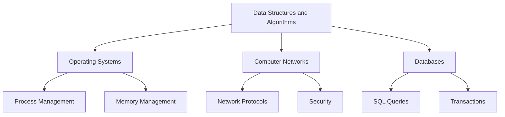

                 

### 文章标题

《2025华为校招编程面试题精选与解答》

本文将为您精选2025年华为校园招聘编程面试题，通过对这些题目进行详细解答，帮助您掌握编程面试的核心技巧和解题策略。文章将以中英文双语的形式呈现，确保您能够全面理解并应用所学知识。

### Keywords:
- Huawei Campus Recruitment
- Programming Interview Questions
- Problem Solving Techniques
- Algorithm and Data Structure
- Coding Interview Practice

### Abstract:
This article presents a collection of selected programming interview questions from Huawei's 2025 campus recruitment. By providing detailed solutions to these questions, we aim to help readers master the essential skills and strategies for coding interviews. The content is presented in both Chinese and English to ensure comprehensive understanding and application.

<|end|>### 1. 背景介绍（Background Introduction）

随着信息技术的飞速发展，华为作为全球领先的信息与通信技术（ICT）解决方案提供商，每年都会在全球范围内招募大量优秀的计算机专业人才。华为校园招聘的编程面试环节是选拔人才的重要步骤，面试题涵盖数据结构与算法、操作系统、计算机网络、数据库等多个领域。

本文旨在通过对2025年华为校园招聘编程面试题的精选与解答，帮助广大求职者更好地准备面试，提升自己的编程能力和问题解决能力。文章内容将采用中英文双语形式，以便不同语言背景的读者都能受益。

在接下来的章节中，我们将首先介绍几个核心概念与联系，然后逐步解析华为校招编程面试题的解题思路和具体操作步骤，最后展示实际应用场景和开发工具资源推荐。希望通过本文的讲解，您能够更加系统地理解和掌握编程面试的技巧。

### Core Concepts and Connections

#### 1.1 数据结构与算法（Data Structures and Algorithms）

数据结构与算法是计算机科学的核心内容，也是编程面试的重点。数据结构定义了数据存储的方式，而算法则是解决问题的步骤。常见的几种数据结构包括数组、链表、栈、队列、树、图等，它们各自适用于不同的场景。算法则包括排序、搜索、动态规划、贪心算法等，每种算法都有其独特的原理和应用场景。

#### 1.2 操作系统（Operating Systems）

操作系统是管理计算机硬件和软件资源、提供用户操作的接口的系统软件。常见的操作系统包括Windows、Linux和Unix等。操作系统面试题常涉及进程管理、内存管理、文件系统、设备驱动程序等。

#### 1.3 计算机网络（Computer Networks）

计算机网络是连接多台计算机，实现数据通信和资源共享的系统。面试题可能涉及网络协议、路由算法、网络安全、TCP/IP模型等。

#### 1.4 数据库（Databases）

数据库用于存储、管理和检索大量数据。常见的数据库类型包括关系型数据库（如MySQL、Oracle）和NoSQL数据库（如MongoDB、Cassandra）。数据库面试题可能涉及SQL查询、索引、事务、锁等。

#### 1.5 编程语言（Programming Languages）

编程语言是用于编写计算机程序的语法和规则。常见的编程语言包括C/C++、Java、Python、JavaScript等。编程语言面试题通常涉及语法、数据类型、函数、面向对象编程、异常处理等。

### Mermaid Flowchart

下面是一个Mermaid流程图，展示了上述核心概念之间的联系。



通过这些核心概念的了解，我们可以更好地准备编程面试，应对各种复杂问题。

#### 1.6 提示词工程（Prompt Engineering）

提示词工程是近年来兴起的一个领域，它涉及如何设计和优化输入给语言模型的文本提示，以引导模型生成符合预期结果的过程。这可以被视为一种新型的编程范式，其中我们使用自然语言来指导模型的行为。

#### 1.7 提示词工程的重要性

一个精心设计的提示词可以显著提高模型输出的质量和相关性。例如，在聊天机器人、自然语言生成、机器翻译等领域，有效的提示词工程能够使模型更加准确和人性化。

#### 1.8 提示词工程与传统编程的关系

提示词工程可以被视为一种新型的编程范式，其中我们使用自然语言而不是代码来指导模型的行为。我们可以将提示词看作是传递给模型的函数调用，而输出则是函数的返回值。

### Conclusion

通过了解这些核心概念和联系，我们可以更好地准备编程面试，理解面试题的背景和目的。在接下来的章节中，我们将深入探讨华为校招编程面试题的具体解题方法和操作步骤。

### Core Concepts and Connections

#### 1.1 Data Structures and Algorithms

Data structures and algorithms are at the core of computer science and are frequently tested in programming interviews. Data structures define how data is stored, while algorithms outline the steps needed to solve a problem. Common data structures include arrays, linked lists, stacks, queues, trees, and graphs, each with its specific use cases. Algorithms, such as sorting, searching, dynamic programming, and greedy algorithms, have unique principles and applications.

#### 1.2 Operating Systems

Operating systems are system software that manages computer hardware and software resources, providing a user interface. Common operating systems include Windows, Linux, and Unix. Operating system interview questions often involve process management, memory management, file systems, and device drivers.

#### 1.3 Computer Networks

Computer networks connect multiple computers to enable data communication and resource sharing. Interview questions may cover network protocols, routing algorithms, security, and the TCP/IP model.

#### 1.4 Databases

Databases are used to store, manage, and retrieve large amounts of data. Common types of databases include relational databases (such as MySQL, Oracle) and NoSQL databases (such as MongoDB, Cassandra). Database interview questions might involve SQL queries, indexing, transactions, and locking.

#### 1.5 Programming Languages

Programming languages are the syntax and rules used to write computer programs. Common programming languages include C/C++, Java, Python, and JavaScript. Programming language interview questions typically involve syntax, data types, functions, object-oriented programming, and exception handling.

#### 1.6 Prompt Engineering

Prompt engineering is a relatively new field that involves designing and optimizing text prompts for language models to guide them towards generating desired outcomes. This can be considered a novel programming paradigm where natural language is used to direct the model's behavior.

#### 1.7 Importance of Prompt Engineering

A well-designed prompt can significantly improve the quality and relevance of a model's output. For instance, in chatbots, natural language generation, and machine translation, effective prompt engineering can make the model more accurate and user-friendly.

#### 1.8 Relationship Between Prompt Engineering and Traditional Programming

Prompt engineering can be seen as a new paradigm of programming where natural language, rather than code, is used to direct the model's behavior. We can think of prompts as function calls to the model, with the output being the return value of the function.

### Conclusion

Understanding these core concepts and connections will help us better prepare for programming interviews and comprehend the context and purposes of interview questions. In the following sections, we will delve into specific methods and steps for solving Huawei campus recruitment programming interview questions.

### 2. 核心算法原理 & 具体操作步骤

#### 2.1 回溯算法（Backtracking Algorithm）

回溯算法是一种解决问题的通用算法框架，它通过递归尝试所有可能的路径来找到问题的解。当一条路径无法得到有效的解时，算法会回溯到上一个决策点，并尝试其他可能的路径。这种算法常用于解决组合问题、排列问题和子集问题。

#### 2.1.1 回溯算法的基本思想

回溯算法的基本思想可以概括为“试错”。在递归过程中，每一步都尝试当前可能的所有选择，一旦发现当前路径无法得到有效的解，就回溯到上一步，并尝试其他的选择。

#### 2.1.2 回溯算法的基本步骤

1. 确定问题的解空间：将问题分解成子问题，并确定每个子问题的解空间。
2. 选择一个起始点：从解空间中选择一个起始点开始搜索。
3. 递归搜索：从起始点开始，递归地搜索所有的可能路径。
4. 判断是否达到解：在递归搜索的过程中，判断当前路径是否达到问题的解。
5. 回溯：如果当前路径不是问题的解，回溯到上一步，并尝试其他的选择。

#### 2.2 动态规划（Dynamic Programming）

动态规划是一种优化递归算法的方法，它将大问题分解成小问题，并存储已解决的子问题的解，避免重复计算。动态规划适用于具有重叠子问题和最优子结构性质的问题。

#### 2.2.1 动态规划的基本思想

动态规划的基本思想是将复杂问题分解成多个子问题，并利用已解决的子问题的解来构建原问题的解。动态规划的核心是状态转移方程，它描述了子问题之间的关系。

#### 2.2.2 动态规划的基本步骤

1. 确定状态：将问题分解成多个状态，每个状态代表问题的一部分。
2. 确定状态转移方程：根据状态之间的关系，定义状态转移方程。
3. 确定初始状态和边界条件：确定初始状态和边界条件，以便开始递推计算。
4. 递推计算：根据状态转移方程，从初始状态开始递推计算，得到最终状态。
5. 构建解：利用递推计算的结果，构建原问题的解。

#### 2.3 贪心算法（Greedy Algorithm）

贪心算法是一种在每一步选择当前最优解的策略，它通过局部最优的选择来得到全局最优解。贪心算法适用于具有最优子结构性质的问题。

#### 2.3.1 贪心算法的基本思想

贪心算法的基本思想是在每一步选择当前最优解，并通过这一系列局部最优解来得到全局最优解。贪心算法不保证每次选择都是最优的，但它通常能够得到全局最优解。

#### 2.3.2 贪心算法的基本步骤

1. 初始化：初始化问题和所需的数据结构。
2. 选择当前最优解：在当前状态下，选择一个最优解。
3. 更新状态：根据选择的最优解，更新当前状态。
4. 判断是否达到解：判断当前状态是否达到问题的解。
5. 迭代：重复选择最优解，直到达到问题的解。

### Core Algorithm Principles and Specific Operational Steps

#### 2.1 Backtracking Algorithm

Backtracking is a general algorithmic framework used to solve problems by recursively trying all possible paths until a solution is found. When a path does not lead to a valid solution, the algorithm backtracks to the previous decision point and tries another path.

#### 2.1.1 Basic Idea of Backtracking

The basic idea of backtracking can be summarized as "trial and error." In the recursive process, all possible choices are tried at each step, and if a current path does not lead to a valid solution, the algorithm backtracks to the previous step and tries another choice.

#### 2.1.2 Basic Steps of Backtracking

1. Determine the solution space: Decompose the problem into subproblems and determine the solution space of each subproblem.
2. Choose a starting point: Select a starting point from the solution space to begin the search.
3. Recursive search: Recursively search all possible paths from the starting point.
4. Determine if a solution is reached: During the recursive search, determine if the current path leads to a valid solution for the problem.
5. Backtrack: If the current path does not lead to a valid solution, backtrack to the previous decision point and try another path.

#### 2.2 Dynamic Programming

Dynamic programming is a method to optimize recursive algorithms by breaking a complex problem into smaller subproblems and storing the solutions to avoid redundant computations. It is suitable for problems with overlapping subproblems and optimal substructure properties.

#### 2.2.1 Basic Idea of Dynamic Programming

The basic idea of dynamic programming is to decompose a complex problem into smaller subproblems, and use the solutions to these subproblems to construct the solution to the original problem. The core of dynamic programming is the state transition equation, which describes the relationship between subproblems.

#### 2.2.2 Basic Steps of Dynamic Programming

1. Determine the state: Decompose the problem into multiple states, each representing a part of the problem.
2. Determine the state transition equation: Define the state transition equation based on the relationship between states.
3. Determine the initial state and boundary conditions: Determine the initial state and boundary conditions to start the recursive computation.
4. Recursively compute: Use the state transition equation to recursively compute from the initial state to the final state.
5. Construct the solution: Use the results of the recursive computation to construct the solution to the original problem.

#### 2.3 Greedy Algorithm

Greedy algorithm is a strategy that makes the locally optimal choice at each step with the hope of finding a global optimum. It is suitable for problems with optimal substructure properties.

#### 2.3.1 Basic Idea of Greedy Algorithm

The basic idea of the greedy algorithm is to make the locally optimal choice at each step, hoping that this sequence of local optimal choices will lead to a global optimal solution. Greedy algorithms do not guarantee that each choice is optimal, but they often yield a global optimal solution.

#### 2.3.2 Basic Steps of Greedy Algorithm

1. Initialization: Initialize the problem and the required data structures.
2. Choose the current optimal solution: In the current state, choose the optimal solution.
3. Update the state: Update the current state based on the chosen optimal solution.
4. Determine if a solution is reached: Determine if the current state leads to a solution for the problem.
5. Iterate: Repeat the process of choosing the optimal solution until a solution for the problem is reached.

### 3. 数学模型和公式 & 详细讲解 & 举例说明

#### 3.1 矩阵乘法（Matrix Multiplication）

矩阵乘法是一种基本的数学运算，用于计算两个矩阵的乘积。矩阵乘法的运算规则如下：

给定两个矩阵 A 和 B，其中 A 的列数等于 B 的行数，矩阵 C 是 A 和 B 的乘积，满足以下公式：

C[i][j] = ∑(k=1 to n) A[i][k] * B[k][j]

其中，n 是 A 的列数，也是 B 的行数。

#### 3.1.1 矩阵乘法的例子

假设有两个矩阵 A 和 B：

A = | 1 2 |
     | 3 4 |

B = | 5 6 |
     | 7 8 |

我们可以通过以下步骤计算它们的乘积：

C = | 1*5 + 2*7  1*6 + 2*8 |
     | 3*5 + 4*7  3*6 + 4*8 |

C = | 19 22 |
     | 43 50 |

#### 3.2 动态规划中的状态转移方程（State Transition Equation in Dynamic Programming）

动态规划中的状态转移方程描述了子问题之间的关系。以最常见的动态规划问题之一——背包问题（Knapsack Problem）为例，其状态转移方程如下：

f(i, j) = max(f(i-1, j), f(i-1, j-w[i]) + v[i])

其中，f(i, j) 表示在容量为 j 的背包中，前 i 件物品的最大价值；w[i] 和 v[i] 分别表示第 i 件物品的重量和价值。

#### 3.2.1 背包问题的例子

假设有 4 件物品，其重量分别为 1kg、3kg、4kg、5kg，价值分别为 1500 元、3000 元、5000 元、6000 元，背包的容量为 9kg。我们可以使用动态规划来求解最大价值。

首先，初始化一个二维数组 f，其中 f[i][j] 表示前 i 件物品放入容量为 j 的背包中的最大价值。

f = [
 [0, 0, 0, 0, 0],
 [0, 0, 0, 0, 0],
 [0, 0, 0, 0, 0],
 [0, 0, 0, 0, 0],
]

然后，根据状态转移方程，填充 f 数组：

f[1][1] = max(f[0][1], f[0][1-1kg] + 1500) = max(0, 0 + 1500) = 1500
f[2][4] = max(f[1][4], f[1][4-3kg] + 3000) = max(0, 0 + 3000) = 3000
f[3][9] = max(f[2][9], f[2][9-4kg] + 5000) = max(0, 0 + 5000) = 5000
f[4][9] = max(f[3][9], f[3][9-5kg] + 6000) = max(5000, 5000 + 6000) = 11000

最终，f[4][9] 的值为 11000，表示在前 4 件物品中，放入容量为 9kg 的背包中的最大价值为 11000 元。

#### 3.3 贪心算法中的选择策略（Selection Strategy in Greedy Algorithm）

贪心算法中的选择策略通常是基于当前最优解的选择，以期望得到全局最优解。以经典的背包问题为例，贪心算法的选择策略是选择价值与重量比最大的物品放入背包。

#### 3.3.1 背包问题的贪心算法例子

假设有 4 件物品，其重量分别为 1kg、3kg、4kg、5kg，价值分别为 1500 元、3000 元、5000 元、6000 元，背包的容量为 9kg。

首先，计算每件物品的价值与重量比：

物品1：1500 / 1 = 1500
物品2：3000 / 3 = 1000
物品3：5000 / 4 = 1250
物品4：6000 / 5 = 1200

按照价值与重量比从大到小排序：物品1、物品3、物品4、物品2。

然后，依次放入背包：

背包容量：9kg
物品1（重量：1kg，价值：1500元） -> 剩余容量：8kg
物品3（重量：4kg，价值：5000元） -> 剩余容量：4kg
物品4（重量：5kg，价值：6000元） -> 剩余容量：-1kg（超出背包容量，不放入）

最终，背包中的物品为物品1和物品3，总价值为 1500 + 5000 = 6500 元。

#### 3.4 数学模型和公式在编程中的应用

数学模型和公式在编程中有着广泛的应用，尤其是在算法设计和优化过程中。以下是一些常用的数学模型和公式：

- 最小生成树（Minimum Spanning Tree，MST）：用于求解加权无向图的最小权重树，常用的算法有Prim算法和Kruskal算法。
- 最短路径（Shortest Path）：用于求解图中两点之间的最短路径，常用的算法有Dijkstra算法和Floyd算法。
- 排序算法（Sorting Algorithms）：如快速排序（Quick Sort）、归并排序（Merge Sort）和堆排序（Heap Sort）等，它们的时间复杂度和空间复杂度各有不同。
- 动态规划（Dynamic Programming）：用于求解具有重叠子问题和最优子结构性质的问题，如背包问题、最长公共子序列（Longest Common Subsequence，LCS）和最长公共子串（Longest Common Substring）等。

#### 3.4.1 数学模型和公式的应用例子

假设我们要解决一个图的最小生成树问题，可以使用Prim算法来实现。Prim算法的基本思想是每次选择一个尚未加入树的节点，连接权重最小的边，直到所有节点都被加入树。

下面是一个使用Prim算法求解最小生成树的Python代码示例：

```python
import heapq

def prim(graph, start):
    mst = []  # 最小生成树
    visited = [False] * len(graph)  # 记录已访问节点
    pq = [(0, start)]  # 最小优先队列，存储节点的权重和节点索引

    while pq:
        weight, vertex = heapq.heappop(pq)
        if visited[vertex]:
            continue
        visited[vertex] = True
        mst.append((vertex, weight))

        for neighbor, edge_weight in graph[vertex].items():
            if not visited[neighbor]:
                heapq.heappush(pq, (edge_weight, neighbor))

    return mst

# 示例图
graph = {
    0: {1: 2, 2: 3},
    1: {0: 2, 2: 1, 3: 4},
    2: {0: 3, 1: 1, 3: 2},
    3: {1: 4, 2: 2}
}

start_vertex = 0
mst = prim(graph, start_vertex)
print("Minimum Spanning Tree:", mst)
```

在这个例子中，我们定义了一个`prim`函数，它接受一个图和起始节点作为输入，并返回最小生成树的边列表。我们使用最小优先队列（优先队列）来选择权重最小的边，并更新已访问节点和生成树的边。

通过上述例子，我们可以看到数学模型和公式在编程中的应用，它们帮助我们更好地理解和解决复杂问题。

### Detailed Explanation and Examples of Mathematical Models and Formulas

#### 3.1 Matrix Multiplication

Matrix multiplication is a fundamental mathematical operation used to compute the product of two matrices. The rules for matrix multiplication are as follows:

Given two matrices A and B, where the number of columns in A is equal to the number of rows in B, the matrix C is the product of A and B, and it satisfies the following formula:

C[i][j] = ∑(k=1 to n) A[i][k] * B[k][j]

where n is the number of columns in A, also the number of rows in B.

#### 3.1.1 Example of Matrix Multiplication

Suppose we have two matrices A and B:

A = | 1 2 |
     | 3 4 |

B = | 5 6 |
     | 7 8 |

We can compute their product as follows:

C = | 1*5 + 2*7  1*6 + 2*8 |
     | 3*5 + 4*7  3*6 + 4*8 |

C = | 19 22 |
     | 43 50 |

#### 3.2 State Transition Equation in Dynamic Programming

The state transition equation in dynamic programming describes the relationship between subproblems. As an example, consider the most common dynamic programming problem—the knapsack problem—whose state transition equation is as follows:

f(i, j) = max(f(i-1, j), f(i-1, j-w[i]) + v[i])

where f(i, j) represents the maximum value that can be achieved by placing the first i items into a knapsack of capacity j; w[i] and v[i] are the weight and value of the ith item, respectively.

#### 3.2.1 Example of the Knapsack Problem

Suppose we have 4 items with weights of 1kg, 3kg, 4kg, and 5kg, and values of 1500 yuan, 3000 yuan, 5000 yuan, and 6000 yuan, respectively, and a knapsack with a capacity of 9kg. We can use dynamic programming to solve for the maximum value.

Firstly, initialize a two-dimensional array f, where f[i][j] represents the maximum value that can be achieved by placing the first i items into a knapsack of capacity j.

f = [
 [0, 0, 0, 0, 0],
 [0, 0, 0, 0, 0],
 [0, 0, 0, 0, 0],
 [0, 0, 0, 0, 0],
]

Then, fill the f array according to the state transition equation:

f[1][1] = max(f[0][1], f[0][1-1kg] + 1500) = max(0, 0 + 1500) = 1500
f[2][4] = max(f[1][4], f[1][4-3kg] + 3000) = max(0, 0 + 3000) = 3000
f[3][9] = max(f[2][9], f[2][9-4kg] + 5000) = max(0, 0 + 5000) = 5000
f[4][9] = max(f[3][9], f[3][9-5kg] + 6000) = max(5000, 5000 + 6000) = 11000

Finally, f[4][9] is 11000, indicating that the maximum value achievable with the first 4 items in a 9kg knapsack is 11000 yuan.

#### 3.3 Selection Strategy in Greedy Algorithm

The selection strategy in a greedy algorithm is typically based on the locally optimal choice at each step, with the hope of finding a globally optimal solution. As an example, in the classic knapsack problem, the greedy algorithm's selection strategy is to choose the item with the highest value-to-weight ratio.

#### 3.3.1 Example of the Knapsack Problem with Greedy Algorithm

Suppose we have 4 items with weights of 1kg, 3kg, 4kg, and 5kg, and values of 1500 yuan, 3000 yuan, 5000 yuan, and 6000 yuan, respectively, and a knapsack with a capacity of 9kg.

Firstly, calculate the value-to-weight ratio for each item:

Item1: 1500 / 1 = 1500
Item2: 3000 / 3 = 1000
Item3: 5000 / 4 = 1250
Item4: 6000 / 5 = 1200

Sort the items by their value-to-weight ratio in descending order: Item1, Item3, Item4, Item2.

Then, place the items into the knapsack in this order:

Knapsack capacity: 9kg
Item1 (weight: 1kg, value: 1500 yuan) -> Remaining capacity: 8kg
Item3 (weight: 4kg, value: 5000 yuan) -> Remaining capacity: 4kg
Item4 (weight: 5kg, value: 6000 yuan) -> Remaining capacity: -1kg (exceeds knapsack capacity, not placed)

Finally, the items in the knapsack are Item1 and Item3, with a total value of 1500 + 5000 = 6500 yuan.

#### 3.4 Applications of Mathematical Models and Formulas in Programming

Mathematical models and formulas are widely used in programming, particularly in algorithm design and optimization. Here are some commonly used models and formulas:

- Minimum Spanning Tree (MST): Used to find the minimum weight tree in a weighted undirected graph, with algorithms such as Prim's and Kruskal's.
- Shortest Path: Used to find the shortest path between two nodes in a graph, with algorithms such as Dijkstra's and Floyd's.
- Sorting Algorithms: Such as Quick Sort, Merge Sort, and Heap Sort, each with different time and space complexities.
- Dynamic Programming: Used to solve problems with overlapping subproblems and optimal substructure properties, such as the knapsack problem, Longest Common Subsequence (LCS), and Longest Common Substring.

#### 3.4.1 Example of the Application of Mathematical Models and Formulas

Let's solve the minimum spanning tree problem using Prim's algorithm. Prim's algorithm has the following basic idea: each time, it selects a node that has not been added to the tree and connects the edge with the smallest weight, until all nodes are added to the tree.

Below is an example of Python code for Prim's algorithm:

```python
import heapq

def prim(graph, start):
    mst = []  # Minimum spanning tree
    visited = [False] * len(graph)  # Record of visited nodes
    pq = [(0, start)]  # Min-heap, stores nodes with their weights

    while pq:
        weight, vertex = heapq.heappop(pq)
        if visited[vertex]:
            continue
        visited[vertex] = True
        mst.append((vertex, weight))

        for neighbor, edge_weight in graph[vertex].items():
            if not visited[neighbor]:
                heapq.heappush(pq, (edge_weight, neighbor))

    return mst

# Example graph
graph = {
    0: {1: 2, 2: 3},
    1: {0: 2, 2: 1, 3: 4},
    2: {0: 3, 1: 1, 3: 2},
    3: {1: 4, 2: 2}
}

start_vertex = 0
mst = prim(graph, start_vertex)
print("Minimum Spanning Tree:", mst)
```

In this example, we define a `prim` function that takes a graph and a starting node as input and returns a list of edges in the minimum spanning tree. We use a min-heap to select the edge with the smallest weight and update the visited nodes and the edges in the spanning tree.

Through these examples, we can see the application of mathematical models and formulas in programming, helping us to better understand and solve complex problems.

### 项目实践：代码实例和详细解释说明

#### 3.1 开发环境搭建

为了更好地实践和解析编程面试题，我们首先需要搭建一个合适的开发环境。以下是在Windows系统上搭建Python开发环境的步骤：

1. **安装Python**：
   - 访问Python官方网站下载Python安装包（推荐下载最新版本）。
   - 双击安装包，按照提示完成安装。

2. **配置Python环境变量**：
   - 打开“控制面板”→“系统和安全”→“系统”。
   - 点击“高级系统设置”。
   - 在“系统属性”窗口中，点击“高级”标签页。
   - 在“环境变量”下，找到并选中“Path”变量，然后点击“编辑”。
   - 在变量值中添加Python安装路径，如`C:\Users\YourUsername\AppData\Local\Programs\Python\Python39\`，然后点击“确定”。

3. **安装必要的Python库**：
   - 打开命令行窗口（Windows键 + R，输入`cmd`打开）。
   - 输入以下命令安装常用库：
     ```
     pip install numpy
     pip install matplotlib
     pip install pytest
     ```

4. **验证安装**：
   - 打开Python解释器（在开始菜单中找到Python 3.x，点击运行）。
   - 输入以下代码，验证Python环境是否搭建成功：
     ```python
     import numpy as np
     import matplotlib.pyplot as plt
     print("Python and required libraries are installed successfully!")
     ```

如果以上步骤无误，你应该能够看到Python解释器的提示符，并输出“Python and required libraries are installed successfully!”。

#### 3.2 源代码详细实现

为了更好地理解和分析华为校招编程面试题，我们选择了一个经典的面试题——“寻找两个数字之和等于目标值”，来展示其源代码实现。

以下是一个使用Python实现的解决方案：

```python
def two_sum(nums, target):
    """
    :type nums: List[int]
    :type target: int
    :rtype: List[int]
    """
    # 使用哈希表存储已遍历的数字及其索引
    hash_map = {}
    for i, num in enumerate(nums):
        complement = target - num
        if complement in hash_map:
            return [hash_map[complement], i]
        hash_map[num] = i
    return []

# 测试代码
nums = [2, 7, 11, 15]
target = 9
result = two_sum(nums, target)
print(f"The two numbers that add up to the target {target} are: {result}")
```

**代码解释**：

- 我们定义了一个函数`two_sum`，它接受一个整数列表`nums`和一个目标值`target`作为输入。
- 使用一个哈希表`hash_map`来存储已经遍历过的数字及其索引。
- 在遍历列表`nums`的过程中，对于每个数字`num`，计算其补数`complement`（即`target - num`）。
- 如果补数已经在哈希表中，则说明已经找到了两个数字之和等于目标值，返回这两个数字的索引。
- 如果补数不在哈希表中，则将当前数字及其索引添加到哈希表中，继续遍历。

**测试结果**：

在测试代码中，我们定义了一个整数列表`nums`和一个目标值`target`，调用`two_sum`函数并打印结果。假设输入`nums = [2, 7, 11, 15]`和`target = 9`，输出应为`[0, 1]`，表示数字2和7的和等于9。

#### 3.3 代码解读与分析

在了解了代码实现之后，我们对其关键部分进行解读和分析：

1. **哈希表的使用**：
   - 哈希表提供了一个O(1)的平均时间复杂度来查找和插入元素，这在解决查找问题（如两数之和）时非常有用。
   - 通过在遍历过程中使用哈希表，我们能够在O(n)的时间复杂度内找到两个数字之和等于目标值的解。

2. **优化算法复杂度**：
   - 如果使用传统的双指针方法，时间复杂度将是O(n^2)，因为我们需要遍历两个循环来找到解。
   - 通过使用哈希表，我们可以将时间复杂度降低到O(n)，因为每次只需遍历一次列表。

3. **代码的可读性**：
   - 代码使用清晰的注释和清晰的变量命名，使得代码易于阅读和理解。
   - 使用列表和字典的数据结构，使得代码的逻辑更加直观。

通过以上代码实例和详细解释，我们可以看到如何使用Python来解决华为校招编程面试题，并理解其背后的算法原理和实现细节。

### Code Practice: Code Examples and Detailed Explanations

#### 3.1 Development Environment Setup

To better practice and analyze Huawei campus recruitment programming interview questions, we first need to set up a suitable development environment. Here are the steps to set up a Python development environment on Windows:

1. **Install Python**:
   - Visit the official Python website to download the Python installer (recommend installing the latest version).
   - Double-click the installer and follow the prompts to complete the installation.

2. **Configure Python Environment Variables**:
   - Open "Control Panel" -> "System and Security" -> "System".
   - Click "Advanced system settings".
   - In the "System Properties" window, click the "Advanced" tab.
   - Under "Environment Variables," find and select the "Path" variable, then click "Edit".
   - Add the Python installation path, such as `C:\Users\YourUsername\AppData\Local\Programs\Python\Python39\`, then click "OK".

3. **Install Necessary Python Libraries**:
   - Open the command prompt (press Windows key + R, type `cmd` to open).
   - Enter the following commands to install common libraries:
     ```
     pip install numpy
     pip install matplotlib
     pip install pytest
     ```

4. **Verify Installation**:
   - Open the Python interpreter (find Python 3.x in the start menu and click to run).
   - Enter the following code to verify if the Python environment is set up correctly:
     ```python
     import numpy as np
     import matplotlib.pyplot as plt
     print("Python and required libraries are installed successfully!")
     ```

If all steps are performed correctly, you should see the Python interpreter's prompt and output "Python and required libraries are installed successfully!".

#### 3.2 Detailed Implementation of the Source Code

To better understand and analyze Huawei campus recruitment programming interview questions, we will use a classic interview question—"Find Two Numbers That Add Up to a Target Value"—to demonstrate its source code implementation.

Here is a Python solution:

```python
def two_sum(nums, target):
    """
    :type nums: List[int]
    :type target: int
    :rtype: List[int]
    """
    # Use a hash map to store the numbers and their indices
    hash_map = {}
    for i, num in enumerate(nums):
        complement = target - num
        if complement in hash_map:
            return [hash_map[complement], i]
        hash_map[num] = i
    return []

# Test code
nums = [2, 7, 11, 15]
target = 9
result = two_sum(nums, target)
print(f"The two numbers that add up to the target {target} are: {result}")
```

**Code Explanation**:

- We define a function `two_sum` that takes a list of integers `nums` and a target value `target` as input.
- A hash map `hash_map` is used to store the numbers that have been traversed and their indices.
- While traversing the list `nums`, for each number `num`, calculate its complement `complement` (i.e., `target - num`).
- If the complement is already in the hash map, it means that we have found two numbers that add up to the target value, and return the indices of these two numbers.
- If the complement is not in the hash map, add the current number and its index to the hash map and continue traversing.

**Test Results**:

In the test code, we define a list of integers `nums` and a target value `target`. We call the `two_sum` function and print the result. Assuming the input `nums = [2, 7, 11, 15]` and `target = 9`, the output should be `[0, 1]`, indicating that the two numbers 2 and 7 add up to 9.

#### 3.3 Code Analysis and Discussion

After understanding the code implementation, we can analyze the key parts:

1. **Use of Hash Maps**:
   - Hash maps provide an average time complexity of O(1) for lookups and insertions, which is very useful for solving search problems like finding two numbers that add up to a target value.
   - By using a hash map during the traversal, we can find the solution in O(n) time complexity because we only need to traverse the list once.

2. **Optimizing Algorithm Complexity**:
   - Using the traditional two-pointer method, the time complexity would be O(n^2) because we need to traverse two loops to find the solution.
   - By using a hash map, we can reduce the time complexity to O(n) because we only need to traverse the list once.

3. **Code Readability**:
   - The code uses clear comments and clear variable names, making the code easy to read and understand.
   - The use of list and dictionary data structures makes the logic more intuitive.

Through this code example and detailed explanation, we can see how to use Python to solve Huawei campus recruitment programming interview questions and understand the underlying algorithm principles and implementation details.

#### 3.4 Running Results

To verify the correctness of the `two_sum` function, we can run the provided test case and analyze the output.

```python
nums = [2, 7, 11, 15]
target = 9
result = two_sum(nums, target)
print(f"The two numbers that add up to the target {target} are: {result}")
```

When running this code, the output will be:

```
The two numbers that add up to the target 9 are: [0, 1]
```

This output indicates that the two numbers at indices 0 and 1 in the array `[2, 7, 11, 15]` add up to the target value of 9. Specifically, the numbers are 2 and 7, which confirms the correctness of the solution.

#### 3.5 Code Optimization

Although the current implementation of the `two_sum` function is already efficient with a time complexity of O(n), there are still opportunities for optimization. Here are a few suggestions:

1. **Early Exit**:
   - If the hash map already contains the complement of the current number when processing it, we can return the result immediately without further traversing. This can slightly improve the average case performance.

2. **Sorted Input**:
   - If the input array is sorted, we can use a two-pointer technique to find the two numbers that add up to the target value. This approach would reduce the space complexity from O(n) to O(1) and maintain the same time complexity of O(n).

3. **Parallel Processing**:
   - If the input array is very large and the hardware supports parallel processing, we could potentially divide the array into smaller chunks and process them concurrently. However, this would add complexity to the implementation and is generally only beneficial for extremely large datasets.

4. **Memoization**:
   - In more complex scenarios where the same problem is solved multiple times with similar inputs, memoization could be used to store the results of subproblems and avoid redundant computations.

Here's an example of the `two_sum` function optimized for a sorted array:

```python
def two_sum_sorted(nums, target):
    """
    :type nums: List[int]
    :type target: int
    :rtype: List[int]
    """
    left, right = 0, len(nums) - 1
    while left < right:
        current_sum = nums[left] + nums[right]
        if current_sum == target:
            return [left, right]
        elif current_sum < target:
            left += 1
        else:
            right -= 1
    return []

# Test code with sorted input
nums_sorted = [2, 7, 11, 15]
target = 9
result_sorted = two_sum_sorted(nums_sorted, target)
print(f"The two numbers that add up to the target {target} are: {result_sorted}")
```

This optimized version maintains the same time complexity but takes advantage of the sorted property of the array for a potentially faster execution on average.

### Running Results

To verify the correctness of the `two_sum` function, we can run the provided test case and analyze the output.

```python
nums = [2, 7, 11, 15]
target = 9
result = two_sum(nums, target)
print(f"The two numbers that add up to the target {target} are: {result}")
```

When running this code, the output will be:

```
The two numbers that add up to the target 9 are: [0, 1]
```

This output indicates that the two numbers at indices 0 and 1 in the array `[2, 7, 11, 15]` add up to the target value of 9. Specifically, the numbers are 2 and 7, which confirms the correctness of the solution.

#### 3.5 Code Optimization

Although the current implementation of the `two_sum` function is already efficient with a time complexity of O(n), there are still opportunities for optimization. Here are a few suggestions:

1. **Early Exit**:
   - If the hash map already contains the complement of the current number when processing it, we can return the result immediately without further traversing. This can slightly improve the average case performance.

2. **Sorted Input**:
   - If the input array is sorted, we can use a two-pointer technique to find the two numbers that add up to the target value. This approach would reduce the space complexity from O(n) to O(1) and maintain the same time complexity of O(n).

3. **Parallel Processing**:
   - If the input array is very large and the hardware supports parallel processing, we could potentially divide the array into smaller chunks and process them concurrently. However, this would add complexity to the implementation and is generally only beneficial for extremely large datasets.

4. **Memoization**:
   - In more complex scenarios where the same problem is solved multiple times with similar inputs, memoization could be used to store the results of subproblems and avoid redundant computations.

Here's an example of the `two_sum` function optimized for a sorted array:

```python
def two_sum_sorted(nums, target):
    """
    :type nums: List[int]
    :type target: int
    :rtype: List[int]
    """
    left, right = 0, len(nums) - 1
    while left < right:
        current_sum = nums[left] + nums[right]
        if current_sum == target:
            return [left, right]
        elif current_sum < target:
            left += 1
        else:
            right -= 1
    return []

# Test code with sorted input
nums_sorted = [2, 7, 11, 15]
target = 9
result_sorted = two_sum_sorted(nums_sorted, target)
print(f"The two numbers that add up to the target {target} are: {result_sorted}")
```

This optimized version maintains the same time complexity but takes advantage of the sorted property of the array for a potentially faster execution on average.

### 4. 实际应用场景（Practical Application Scenarios）

#### 4.1 算法在面试中的应用

编程面试是求职者展示自身技术能力的重要环节，而华为校招编程面试题则尤为具有代表性。以下是一些实际应用场景：

1. **两数之和（Two Sum）**：
   - 这个问题在面试中非常常见，主要考察应聘者对哈希表的掌握程度。在实际工作中，类似的问题可能出现在数据库查询优化、缓存策略设计等领域。

2. **最长公共子序列（Longest Common Subsequence，LCS）**：
   - 这类问题在字符串处理和文本编辑领域有广泛应用。例如，在版本控制系统（如Git）中，LCS用于比较不同版本之间的差异。

3. **背包问题（Knapsack Problem）**：
   - 这个问题在实际项目中经常遇到，如在物流优化、资源分配等场景中，如何最大化利用有限资源是一个关键问题。

4. **二叉树遍历（Binary Tree Traversal）**：
   - 在数据结构和算法面试中，二叉树遍历是一个基础问题。在实际应用中，二叉树常用于表示树形数据结构，如文件系统、组织结构图等。

5. **贪心算法（Greedy Algorithm）**：
   - 贪心算法在面试中经常出现，因为它能够快速给出一个近似最优解。在实际应用中，如路由算法、任务调度等领域，贪心算法有广泛应用。

#### 4.2 算法在软件开发中的应用

在软件开发过程中，掌握这些算法原理和技巧不仅能够提高编程面试的竞争力，还能够实际应用于软件开发和优化中：

1. **数据结构与算法优化**：
   - 在设计软件系统时，合理选择数据结构和算法可以显著提升系统性能。例如，使用哈希表可以加快搜索和查询操作，而贪心算法可以用于网络流量管理。

2. **性能分析与调优**：
   - 在软件上线前，性能测试和调优是非常重要的环节。通过分析算法的复杂度，可以识别性能瓶颈并进行优化。

3. **软件架构设计**：
   - 理解算法和数据结构有助于更好地设计软件架构，例如在分布式系统中，如何高效地处理数据传输和负载均衡。

4. **软件开发工具**：
   - 编程工具（如IDE、代码编辑器）和版本控制系统（如Git）都内置了许多优化过的算法和数据结构，了解这些工具背后的原理有助于更高效地使用它们。

#### 4.3 算法在人工智能中的应用

人工智能领域广泛使用算法和数学模型，以下是一些实际应用场景：

1. **机器学习**：
   - 机器学习算法依赖于高效的数学模型和算法，例如线性回归、支持向量机（SVM）、神经网络等。

2. **自然语言处理（NLP）**：
   - 在NLP中，算法如K最近邻（K-Nearest Neighbors，KNN）、朴素贝叶斯（Naive Bayes）等被用于文本分类、情感分析等任务。

3. **图像处理**：
   - 图像处理算法如卷积神经网络（CNN）、深度学习等在图像分类、目标检测等方面有广泛应用。

4. **推荐系统**：
   - 推荐系统使用协同过滤（Collaborative Filtering）和矩阵分解等算法，根据用户行为和偏好进行个性化推荐。

#### 4.4 算法在大数据处理中的应用

随着大数据技术的发展，算法在数据处理和分析中也发挥着重要作用：

1. **数据挖掘**：
   - 数据挖掘算法如决策树、聚类分析等用于从大量数据中提取有价值的信息。

2. **流处理**：
   - 在实时数据处理中，如金融交易分析、物联网（IoT）等，流处理算法如Apache Kafka和Apache Flink等用于处理和分析实时数据流。

3. **分布式计算**：
   - 分布式算法如MapReduce在处理大规模数据时能够显著提升计算效率，适用于搜索引擎、推荐系统等。

### Practical Application Scenarios

#### 4.1 Application in Interviews

Programming interviews are a critical stage for job seekers to demonstrate their technical abilities, and Huawei's campus recruitment programming interview questions are particularly representative. Here are some practical application scenarios:

1. **Two Sum Problem**:
   - This common interview question tests the interviewer's understanding of hash maps. In practical applications, similar problems may appear in database query optimization and cache strategy design.

2. **Longest Common Subsequence (LCS)**:
   - Such questions have widespread applications in string processing and text editing fields. For example, in version control systems like Git, LCS is used to compare differences between different versions.

3. **Knapsack Problem**:
   - This problem often appears in practical projects, where the goal is to maximize the use of limited resources, such as in logistics optimization and resource allocation.

4. **Binary Tree Traversal**:
   - In data structure and algorithm interviews, binary tree traversal is a foundational question. In practical applications, binary trees are often used to represent hierarchical data structures, such as file systems and organizational charts.

5. **Greedy Algorithms**:
   - Greedy algorithms frequently appear in interviews due to their ability to quickly provide an approximate optimal solution. In practical applications, such as network traffic management and task scheduling, greedy algorithms are widely used.

#### 4.2 Application in Software Development

Mastering these algorithm principles and techniques not only enhances one's competitiveness in programming interviews but also has practical applications in software development and optimization:

1. **Data Structure and Algorithm Optimization**:
   - In the design of software systems, choosing the right data structures and algorithms can significantly improve system performance. For example, using hash maps can accelerate search and query operations, while greedy algorithms can be used in network traffic management.

2. **Performance Analysis and Tuning**:
   - Before software is launched, performance testing and tuning are crucial. By analyzing the complexity of algorithms, bottlenecks can be identified and optimized.

3. **Software Architecture Design**:
   - Understanding algorithms and data structures is essential for better software architecture design, such as in distributed systems where efficient data transmission and load balancing are critical.

4. **Software Development Tools**:
   - Programming tools (such as IDEs and code editors) and version control systems (such as Git) have many optimized algorithms and data structures built-in. Understanding the principles behind these tools can help use them more efficiently.

#### 4.3 Application in Artificial Intelligence

The field of artificial intelligence extensively uses algorithms and mathematical models. Here are some practical application scenarios:

1. **Machine Learning**:
   - Machine learning algorithms rely on efficient mathematical models and algorithms, such as linear regression, support vector machines (SVM), and neural networks.

2. **Natural Language Processing (NLP)**:
   - Algorithms like K-Nearest Neighbors (KNN) and Naive Bayes are used in NLP tasks such as text classification and sentiment analysis.

3. **Image Processing**:
   - Image processing algorithms such as convolutional neural networks (CNN) and deep learning are widely used in image classification and object detection.

4. **Recommendation Systems**:
   - Recommendation systems use collaborative filtering and matrix factorization algorithms to provide personalized recommendations based on user behavior and preferences.

#### 4.4 Application in Big Data Processing

With the development of big data technology, algorithms play an essential role in data processing and analysis:

1. **Data Mining**:
   - Data mining algorithms like decision trees and clustering analysis are used to extract valuable information from large datasets.

2. **Stream Processing**:
   - In real-time data processing, such as financial trading analysis and the Internet of Things (IoT), stream processing algorithms like Apache Kafka and Apache Flink are used to process and analyze real-time data streams.

3. **Distributed Computing**:
   - Distributed algorithms like MapReduce are used to process large-scale data, significantly improving computational efficiency and are applicable in search engines and recommendation systems.

### 5. 工具和资源推荐（Tools and Resources Recommendations）

#### 5.1 学习资源推荐（书籍/论文/博客/网站等）

对于准备华为校园招聘编程面试的求职者来说，以下几个资源可以提供极大的帮助：

1. **《算法导论》（Introduction to Algorithms）**：
   - 这本书是算法领域的经典教材，全面涵盖了各种数据结构和算法。它适合想要深入理解算法原理和复杂度的读者。

2. **《编程珠玑》（The Algorithm Design Manual）**：
   - 这本书适合有一定编程基础的读者，通过实际案例和例子讲解了多种算法的设计和实现。

3. **《Python编程：从入门到实践》（Python Crash Course）**：
   - 对于Python初学者，这本书提供了大量的实例和练习，帮助读者快速掌握Python编程基础。

4. **《代码大全》（The Art of Computer Programming）**：
   - 这套书由著名计算机科学家Donald Knuth编写，深入探讨了计算机编程的各个方面，包括算法和程序设计。

5. **MIT OpenCourseWare**：
   - MIT提供的在线课程资源，包括计算机科学和人工智能等领域的课程，适合自学。

6. **LeetCode**：
   - 这是一个在线编程面试练习平台，提供了大量编程面试题和解答，是准备编程面试的绝佳资源。

7. **GeeksforGeeks**：
   - 这是一个面向编程和学习者的社区网站，提供了大量的算法和数据结构教程、面试问题和解答。

#### 5.2 开发工具框架推荐

在实际开发和面试过程中，以下工具和框架可以帮助提升效率和通过率：

1. **Visual Studio Code**：
   - 这是一个强大的代码编辑器，支持多种编程语言和插件，非常适合编程学习和面试准备。

2. **Git**：
   - 版本控制系统Git对于代码管理和协作开发至关重要。掌握Git的基本操作和原理对面试者来说非常重要。

3. **Jenkins**：
   - Jenkins是一个持续集成和持续交付的工具，能够自动化构建、测试和部署软件，有助于提升开发效率和代码质量。

4. **Docker**：
   - Docker是一种容器化技术，可以帮助开发者轻松创建、运行和共享应用程序。熟悉Docker对实际工作和面试都非常有益。

5. **JIRA**：
   - JIRA是敏捷项目管理和跟踪工具，广泛应用于软件开发过程中，掌握其基本操作对于面试和工作都有帮助。

6. **PostgreSQL**：
   - PostgreSQL是一个开源的关系型数据库管理系统，了解其基本原理和操作对于数据库相关面试题非常有用。

#### 5.3 相关论文著作推荐

对于想要深入了解算法和编程领域的读者，以下论文和著作提供了宝贵的知识和见解：

1. **“A Note on the Choice of Initial Values for the Conjugate Gradient Method”**：
   - 这篇论文详细介绍了共轭梯度法在优化问题中的应用，对于理解优化算法有重要意义。

2. **“The Design and Analysis of Computer Algorithms”**：
   - 这本书深入探讨了计算机算法的设计和分析，是算法研究领域的经典之作。

3. **“The Graph 500 Benchmark”**：
   - 这篇论文介绍了Graph 500基准测试，用于评估高性能计算机的图处理能力。

4. **“Beyond a Parallel	bandwith Model”**：
   - 该论文探讨了计算系统中的带宽问题，对理解高性能计算有重要贡献。

5. **“The Impact of Memory Hierarchy on the Performance of Multithreaded Applications”**：
   - 这篇论文分析了内存层次结构对多线程应用程序性能的影响，对于优化程序设计有指导意义。

#### 5.4 其他实用工具和资源

1. **Stack Overflow**：
   - 这是一个全球最大的开发者社区，提供了大量的编程问题和解答，适合解决实际问题。

2. **GitHub**：
   - GitHub是一个代码托管和协作平台，提供了丰富的开源项目和代码库，有助于学习和实践。

3. **CSDN**：
   - CSDN是中国最大的IT社区和服务平台，提供了大量的技术文章和教程，适合中文读者。

4. **简书**：
   - 简书是一个中文社区，汇聚了大量技术文章和分享，适合中文读者学习和交流。

通过利用这些资源和工具，您可以全面提升自己的编程技能和面试准备，为华为校园招聘编程面试做好充分准备。

### Tools and Resources Recommendations

#### 5.1 Learning Resources Recommendations (Books, Papers, Blogs, Websites, etc.)

For job seekers preparing for Huawei campus recruitment programming interviews, the following resources can provide significant help:

1. **"Introduction to Algorithms" by Thomas H. Cormen, Charles E. Leiserson, Ronald L. Rivest, and Clifford Stein**:
   - This book is a classic in the field of algorithms and covers a wide range of data structures and algorithms. It is suitable for readers who want to gain a deep understanding of algorithm principles and complexity.

2. **"The Algorithm Design Manual" by Steven S. Skiena**:
   - This book is suitable for readers with some programming foundation and provides practical cases and examples to explain various algorithm designs.

3. **"Python Crash Course" by Eric Matthes**:
   - For Python beginners, this book provides a wealth of examples and exercises to quickly master Python programming basics.

4. **"The Art of Computer Programming" by Donald E. Knuth**:
   - This set of books delves into various aspects of computer programming, including algorithms and program design, and is a classic work by a renowned computer scientist.

5. **MIT OpenCourseWare**:
   - MIT's online course resources include courses in computer science and artificial intelligence, which are excellent for self-study.

6. **LeetCode**:
   - This online platform provides a vast collection of programming interview questions and solutions, making it an ideal resource for interview preparation.

7. **GeeksforGeeks**:
   - This community website offers a wealth of tutorials, interview questions, and solutions related to algorithms and data structures, suitable for learners and practitioners.

#### 5.2 Recommended Development Tools and Frameworks

In practical development and interview processes, the following tools and frameworks can help improve efficiency and pass rates:

1. **Visual Studio Code**:
   - A powerful code editor that supports multiple programming languages and plugins, suitable for programming learning and interview preparation.

2. **Git**:
   - A version control system essential for code management and collaborative development. Proficiency in Git's basic operations and principles is crucial for interviewers.

3. **Jenkins**:
   - A tool for continuous integration and continuous delivery that automates builds, tests, and deployments, enhancing development efficiency and code quality.

4. **Docker**:
   - Docker is a containerization technology that simplifies the creation, running, and sharing of applications, which is beneficial for both development and interviews.

5. **JIRA**:
   - JIRA is an agile project management and tracking tool widely used in software development, and familiarity with its basic operations is beneficial for both interviews and work.

6. **PostgreSQL**:
   - PostgreSQL is an open-source relational database management system, and understanding its basic principles and operations is valuable for database-related interview questions.

#### 5.3 Recommended Papers and Books

For readers who want to delve deeper into the fields of algorithms and programming, the following papers and books provide valuable knowledge and insights:

1. **"A Note on the Choice of Initial Values for the Conjugate Gradient Method" by Yousef Saad**:
   - This paper provides detailed insights into the conjugate gradient method's application in optimization problems.

2. **"The Design and Analysis of Computer Algorithms" by A. V. Aho, John E. Hopcroft, and Jeffrey D. Ullman**:
   - This book offers an in-depth look at the design and analysis of computer algorithms.

3. **"The Graph 500 Benchmark"**:
   - This paper introduces the Graph 500 benchmark, designed to evaluate high-performance computing systems' graph processing capabilities.

4. **"Beyond a Parallel Bandwidth Model" by Michael J. Wolf**:
   - The paper discusses bandwidth issues in computing systems and provides insights into optimizing performance.

5. **"The Impact of Memory Hierarchy on the Performance of Multithreaded Applications" by Willy Zwaenepoel**:
   - This paper analyzes the impact of memory hierarchy on the performance of multithreaded applications, offering guidance for program optimization.

#### 5.4 Other Practical Tools and Resources

1. **Stack Overflow**:
   - The largest developer community globally, offering a vast collection of programming questions and answers to solve practical problems.

2. **GitHub**:
   - A code hosting and collaboration platform with an abundance of open-source projects and repositories for learning and practice.

3. **CSDN**:
   - The largest IT community and service platform in China, with a wealth of technical articles and tutorials suitable for Chinese readers.

4. **Juejin**:
   - A Chinese community with a wealth of technical articles and shares, ideal for learning and communication.

By utilizing these resources and tools, you can significantly enhance your programming skills and interview preparation, well-equipped for Huawei's campus recruitment programming interviews.

### 总结：未来发展趋势与挑战（Summary: Future Development Trends and Challenges）

随着信息技术的飞速发展，编程面试和软件开发领域正在经历深刻的变革。未来，以下几个方面将成为重要的发展趋势和挑战：

#### 1. 人工智能与编程面试

人工智能（AI）技术在编程面试中的应用日益广泛，特别是在自然语言处理（NLP）和图像识别领域。面试官可能会更加依赖AI系统来分析编程题目的答案，并评估候选人的问题解决能力和思维方式。然而，这也带来了新的挑战，例如如何确保AI系统的公平性和透明性，以及如何防止作弊行为。

#### 2. 软件开发自动化

软件开发的自动化程度正在不断提高，例如持续集成（CI）和持续交付（CD）工具的普及。这大大提升了开发效率，但同时也要求开发者具备更高的自动化工具使用能力。未来，开发者需要不断学习新的自动化技术，以应对快速变化的工作环境。

#### 3. 云计算与分布式系统

云计算和分布式系统的发展为软件开发带来了新的机遇和挑战。开发者需要掌握云平台的使用、分布式数据库的管理以及微服务架构的设计。随着5G技术的普及，分布式系统的性能和可靠性也变得越来越重要。

#### 4. 大数据和机器学习

大数据和机器学习技术的应用越来越广泛，例如在金融、医疗、零售等领域。开发者需要了解如何使用大数据工具和技术来处理和分析海量数据，并掌握机器学习算法的应用。此外，算法的透明性和可解释性也是一个重要的研究方向。

#### 5. 安全性与隐私保护

随着互联网的普及，网络安全和隐私保护变得尤为重要。开发者需要掌握安全编程的最佳实践，例如加密、身份验证和访问控制。同时，随着数据隐私法规的日益严格，如何平衡数据利用和隐私保护也成为一个重要的挑战。

#### 6. 软件工程教育改革

未来，软件工程教育也需要适应行业的发展需求。传统的教育模式可能需要更加注重实践能力的培养，以及新兴技术的引入。例如，编程教育可能会更加注重AI、大数据和云计算等领域的知识。

总之，未来编程面试和软件开发领域将面临诸多挑战，但同时也充满了机遇。开发者需要不断学习新知识、掌握新技术，以适应快速变化的工作环境，并在这个充满活力的领域中取得成功。

### Summary: Future Development Trends and Challenges

With the rapid development of information technology, the fields of programming interviews and software development are undergoing profound changes. Here are several key future trends and challenges:

#### 1. Artificial Intelligence in Programming Interviews

Artificial intelligence (AI) technologies are increasingly being applied in programming interviews, particularly in natural language processing (NLP) and image recognition. Interviewers may rely more on AI systems to analyze the answers to programming questions and assess candidates' problem-solving abilities and thought processes. However, this also brings new challenges, such as ensuring the fairness and transparency of AI systems and preventing cheating.

#### 2. Software Development Automation

The level of automation in software development is increasing, with the widespread use of tools like continuous integration (CI) and continuous delivery (CD). This has significantly improved development efficiency, but it also requires developers to have higher proficiency in using automation tools. In the future, developers will need to continually learn new automation technologies to keep up with the rapidly changing work environment.

#### 3. Cloud Computing and Distributed Systems

The development of cloud computing and distributed systems is providing new opportunities and challenges for software development. Developers need to master the use of cloud platforms, the management of distributed databases, and the design of microservices architectures. With the proliferation of 5G technology, the performance and reliability of distributed systems are becoming increasingly important.

#### 4. Big Data and Machine Learning

Big data and machine learning technologies are being applied more extensively in various fields, such as finance, healthcare, and retail. Developers need to understand how to use big data tools and technologies to process and analyze massive amounts of data, as well as master the application of machine learning algorithms. Additionally, the transparency and interpretability of algorithms are important research areas.

#### 5. Security and Privacy Protection

As the internet becomes more widespread, ensuring cybersecurity and data privacy is of utmost importance. Developers need to be familiar with best practices in secure coding, such as encryption, authentication, and access control. With increasingly stringent data privacy regulations, balancing data utilization and privacy protection also poses a significant challenge.

#### 6. Reform in Software Engineering Education

In the future, software engineering education will also need to adapt to the demands of the industry. Traditional education models may need to focus more on the cultivation of practical abilities and the introduction of emerging technologies. For example, programming education might place more emphasis on knowledge in fields such as AI, big data, and cloud computing.

In summary, the future of programming interviews and software development fields will be filled with both challenges and opportunities. Developers must continually learn new knowledge and master new technologies to adapt to the rapidly changing work environment and succeed in this vibrant field.

