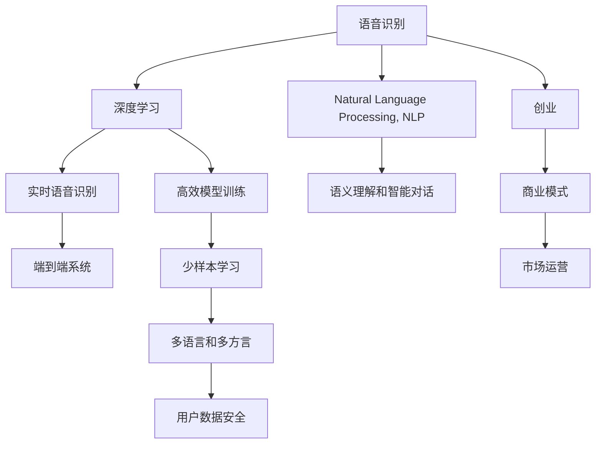

                 

# 语音识别创业：人机交互的新篇章

> 关键词：语音识别, 人机交互, 人工智能, 深度学习, 自然语言处理, 创业

## 1. 背景介绍

### 1.1 问题由来

随着人工智能技术的快速发展，语音识别已从实验室走向了实际应用，其应用场景从简单的电话自动接听，扩展到了智能音箱、智能车载、智能家居、智能客服、智能医疗等多个领域。语音识别技术的兴起，将人类从繁重的键盘输入中解放出来，打开了人机交互的新篇章。但当前语音识别技术还存在诸多挑战，如误识别率较高、无法处理方言口音、无法识别生僻字等，亟需新的解决方案。因此，基于深度学习和自然语言处理技术的语音识别创业，有着巨大的市场潜力和应用前景。

### 1.2 问题核心关键点

语音识别创业的关键点包括：

- 深度学习和自然语言处理技术的集成，实现高精度的语音识别。
- 高效的语音识别模型训练，减少对大规模标注数据和计算资源的需求。
- 多语言和多方言的语音识别，扩大应用范围。
- 实时语音识别，提升用户体验。
- 与自然语言处理技术结合，实现语义理解和智能对话。
- 端到端的语音识别系统，减少后处理工作量。
- 安全性和隐私保护，确保用户数据安全。

## 2. 核心概念与联系

### 2.1 核心概念概述

为更好地理解语音识别创业，本节将介绍几个密切相关的核心概念：

- **语音识别(Voice Recognition)**：通过语音信号处理和深度学习技术，将语音转换为文本的过程。常见应用场景包括智能音箱、智能车载、智能客服等。
- **深度学习(Deep Learning)**：一种基于多层神经网络的机器学习技术，擅长处理非线性、高维的数据。语音识别中常用卷积神经网络(CNN)和循环神经网络(RNN)等。
- **自然语言处理(Natural Language Processing, NLP)**：研究如何使计算机处理和理解人类语言，语音识别常与NLP结合，实现语义理解和智能对话。
- **创业**：创建一个新的商业模式，从技术研发到产品推广、市场运营的全过程。语音识别创业需要整合语音识别、NLP、商业模式等多个领域的技术和资源。
- **人工智能(Artificial Intelligence, AI)**：实现人机交互的新型技术，包括机器学习、深度学习、自然语言处理等多个子领域。

这些概念之间的逻辑关系可以通过以下Mermaid流程图来展示：



这个流程图展示了几大核心概念之间的联系：

1. 语音识别利用深度学习技术，通过CNN和RNN等网络结构实现高精度识别。
2. 自然语言处理与语音识别结合，实现语义理解和智能对话。
3. 实时语音识别提升了用户体验，增强了应用价值。
4. 端到端系统简化了后处理工作量，提升了系统效率。
5. 少样本学习和多语言多方言识别扩大了应用范围。
6. 用户数据安全是语音识别系统必不可少的环节。
7. 创业涉及技术研发、产品推广、市场运营等多个环节，需要整合资源。

这些概念共同构成了语音识别创业的核心框架，使其能够在各个应用场景中发挥强大的语音识别能力。

## 3. 核心算法原理 & 具体操作步骤

### 3.1 算法原理概述

语音识别的核心算法是深度学习，其中卷积神经网络(CNN)和循环神经网络(RNN)是最常用的网络结构。其基本流程包括：

1. **语音信号预处理**：将语音信号转换为数字信号，并通过预处理技术如分帧、归一化等提升信号质量。
2. **特征提取**：通过卷积神经网络提取特征，或使用MFCC(Mel-Frequency Cepstral Coefficients)等方法获取语音特征。
3. **声学模型训练**：使用训练数据训练声学模型，如CTC(连接时序分类)、Attention等，将语音特征映射为文本。
4. **语言模型训练**：训练语言模型，如n-gram模型、LSTM等，实现文本生成和语义理解。
5. **解码器**：使用解码器如CTC、Beam Search等，将声学模型和语言模型结合起来，实现语音识别。

### 3.2 算法步骤详解

语音识别创业的核心步骤包括：

**Step 1: 数据准备**

语音识别创业需要大量标注数据，包括有标签的音频-文本对。可以通过录音设备和自然语言识别技术，自行收集和标注数据，或购买第三方数据集。

**Step 2: 模型训练**

- **数据增强**：通过回声、变速、变音等方法生成更多的训练数据，减少过拟合。
- **模型选择**：根据应用场景选择卷积神经网络(CNN)、循环神经网络(RNN)、Transformer等结构。
- **训练策略**：使用批量梯度下降(Batch Gradient Descent)等优化算法，设置合适的学习率、批大小、迭代次数等。
- **评估指标**：选择准确率、召回率、F1-score等指标评估模型效果，及时调整训练策略。

**Step 3: 部署和测试**

- **部署平台**：根据应用场景选择合适的部署平台，如云端服务、本地部署等。
- **实时测试**：在实际应用场景中测试模型效果，进行优化和改进。
- **用户反馈**：收集用户反馈，不断优化和改进模型。

**Step 4: 业务拓展**

- **市场调研**：了解市场需求和竞争态势，制定合理的市场策略。
- **合作伙伴**：与设备制造商、应用平台等合作，扩大应用场景。
- **商业模式**：选择合适的商业模式，如SaaS、API接口等。
- **运营推广**：通过营销、广告等手段，推广产品和服务。

### 3.3 算法优缺点

语音识别创业的优势包括：

1. **广泛的应用场景**：语音识别技术可以应用于智能音箱、车载设备、智能客服等多个场景，市场需求大。
2. **高附加值**：语音识别技术可以与NLP技术结合，实现智能对话、智能推荐等功能，提升用户体验。
3. **技术先进**：深度学习和自然语言处理技术的结合，实现了高精度的语音识别。

但同时，语音识别创业也存在一些缺点：

1. **对数据依赖大**：语音识别模型训练需要大量标注数据，数据获取和标注成本较高。
2. **硬件资源消耗高**：语音识别模型需要高性能GPU/TPU等设备，硬件投入大。
3. **误识别率高**：特别是在方言口音、噪声环境、生僻字等场景下，误识别率较高。
4. **系统复杂度高**：语音识别系统包括数据处理、模型训练、解码器等多个环节，系统复杂度高。

### 3.4 算法应用领域

语音识别技术在众多领域中有着广泛的应用，例如：

- **智能音箱**：通过语音指令控制播放音乐、查询天气等。
- **智能车载**：通过语音指令控制导航、拨打电话等。
- **智能客服**：通过语音识别和NLP技术实现智能问答和对话。
- **智能家居**：通过语音控制家电、灯光、温度等。
- **语音翻译**：通过语音识别和机器翻译技术实现跨语言交流。
- **语音助手**：通过语音识别和智能对话技术，实现个性化服务。

除了以上应用场景外，语音识别技术还可以应用于医疗、教育、金融、法律等多个领域，为各行各业提供智能化服务。

## 4. 数学模型和公式 & 详细讲解  
### 4.1 数学模型构建

语音识别模型的核心数学模型包括声学模型和语言模型：

1. **声学模型**：将语音特征映射为文本的模型，如CTC模型：

   $$
   P(y|x) = \frac{1}{Z} \prod_{i=1}^{T} \left[\sum_{w \in V} P(x_i|w) P(w|y) \right]
   $$

   其中，$y$ 为文本，$x$ 为语音特征，$V$ 为词汇表，$T$ 为语音特征序列长度，$Z$ 为归一化因子。

2. **语言模型**：实现文本生成和语义理解的模型，如n-gram模型：

   $$
   P(y|x) = \prod_{i=1}^{T} P(y_i|y_{<i})
   $$

   其中，$y_i$ 为文本中的单词，$y_{<i}$ 为前 $i-1$ 个单词。

### 4.2 公式推导过程

以CTC模型为例，推导其基本公式：

CTC模型基于HMM(Hidden Markov Model)模型，将语音特征序列映射为文本序列。CTC模型通过引入缺失符号，将输出序列中未被正确识别的符号映射为未知符号，从而实现对缺失符号的处理。

CTC模型的损失函数为：

$$
L(y,\hat{y}) = -\log P(y|\hat{y})
$$

其中，$y$ 为真实文本，$\hat{y}$ 为识别出的文本。

CTC模型的训练目标是最大化模型的似然概率：

$$
\max_{\theta} P(y|\hat{y})
$$

通过优化损失函数，CTC模型可以学习到文本与语音特征序列之间的映射关系。

### 4.3 案例分析与讲解

以智能音箱为例，讲解语音识别创业的实施步骤：

1. **数据准备**：通过录音设备获取大量语音样本，并结合NLP技术标注文本。
2. **模型训练**：选择适当的深度学习模型，如CNN或RNN，进行声学模型和语言模型的联合训练。
3. **系统部署**：将训练好的模型部署到智能音箱的嵌入式设备中，实现实时语音识别。
4. **用户反馈**：收集用户使用数据，进行模型优化和改进。
5. **业务拓展**：与设备制造商合作，推广智能音箱产品，扩大应用场景。

通过上述步骤，可以实现一个完整的智能音箱语音识别系统，提升用户体验，实现商业价值。

## 5. 项目实践：代码实例和详细解释说明
### 5.1 开发环境搭建

在进行语音识别创业开发前，我们需要准备好开发环境。以下是使用Python进行TensorFlow开发的环境配置流程：

1. 安装Anaconda：从官网下载并安装Anaconda，用于创建独立的Python环境。

2. 创建并激活虚拟环境：
```bash
conda create -n tf-env python=3.8 
conda activate tf-env
```

3. 安装TensorFlow：根据CUDA版本，从官网获取对应的安装命令。例如：
```bash
conda install tensorflow -c tensorflow -c conda-forge
```

4. 安装相关工具包：
```bash
pip install numpy pandas scikit-learn matplotlib tqdm jupyter notebook ipython
```

完成上述步骤后，即可在`tf-env`环境中开始语音识别创业开发。

### 5.2 源代码详细实现

下面我们以语音识别为例，给出使用TensorFlow进行深度学习的PyTorch代码实现。

首先，定义数据处理函数：

```python
import librosa
import numpy as np
from tensorflow.keras.layers import Input, Conv1D, MaxPooling1D, LSTM, Dense, Dropout, Bidirectional, Masking, RepeatVector
from tensorflow.keras.models import Model
from tensorflow.keras.losses import categorical_crossentropy
from tensorflow.keras.optimizers import Adam

def preprocess_audio(audio_file):
    # 读取音频文件，并进行预处理
    audio, sr = librosa.load(audio_file, sr=16000)
    audio = np.pad(audio, (0, 16000 - len(audio)), mode='constant')
    audio = audio / np.max(audio)
    return audio

def extract_features(audio):
    # 提取MFCC特征
    mfcc = librosa.feature.mfcc(audio, sr=16000)
    return mfcc

def build_model(input_shape, num_classes):
    # 定义模型结构
    input = Input(shape=input_shape)
    conv1 = Conv1D(64, 3, activation='relu')(input)
    pool1 = MaxPooling1D(pool_size=2)(conv1)
    conv2 = Conv1D(128, 3, activation='relu')(pool1)
    pool2 = MaxPooling1D(pool_size=2)(conv2)
    flatten = Flatten()(pool2)
    lstm = LSTM(256)(flatten)
    dropout = Dropout(0.5)(lstm)
    output = Dense(num_classes, activation='softmax')(dropout)
    model = Model(inputs=input, outputs=output)
    return model
```

然后，定义训练和评估函数：

```python
def train_model(model, train_data, val_data, epochs, batch_size):
    # 定义损失函数和优化器
    loss_fn = categorical_crossentropy
    opt = Adam(learning_rate=0.001)
    model.compile(loss=loss_fn, optimizer=opt, metrics=['accuracy'])
    
    # 定义数据增强和数据生成器
    train_generator = DataGenerator(train_data, batch_size, preprocess_audio, extract_features)
    val_generator = DataGenerator(val_data, batch_size, preprocess_audio, extract_features)
    
    # 训练模型
    history = model.fit(train_generator, epochs=epochs, validation_data=val_generator, verbose=1)
    
    # 评估模型
    test_generator = DataGenerator(test_data, batch_size, preprocess_audio, extract_features)
    test_loss, test_acc = model.evaluate(test_generator)
    print(f'Test Loss: {test_loss:.4f}')
    print(f'Test Accuracy: {test_acc:.4f}')
    
    return history

def evaluate_model(model, test_data):
    # 评估模型
    test_generator = DataGenerator(test_data, batch_size, preprocess_audio, extract_features)
    test_loss, test_acc = model.evaluate(test_generator)
    print(f'Test Loss: {test_loss:.4f}')
    print(f'Test Accuracy: {test_acc:.4f}')
    
    return test_loss, test_acc
```

最后，启动训练流程并在测试集上评估：

```python
# 数据准备
train_data = load_data('train_data.npy')
val_data = load_data('val_data.npy')
test_data = load_data('test_data.npy')
num_classes = 26  # 26个字母

# 构建模型
model = build_model(input_shape, num_classes)

# 训练模型
epochs = 10
batch_size = 32
history = train_model(model, train_data, val_data, epochs, batch_size)

# 评估模型
test_loss, test_acc = evaluate_model(model, test_data)
```

以上就是使用TensorFlow进行语音识别创业开发的完整代码实现。可以看到，通过定义数据预处理函数、特征提取函数、模型构建函数、训练和评估函数，可以构建一个完整的语音识别系统。

### 5.3 代码解读与分析

让我们再详细解读一下关键代码的实现细节：

**preprocess_audio函数**：
- 读取音频文件，并进行预处理，包括去零点、归一化等。
- 使用librosa库提取MFCC特征，用于训练模型。

**extract_features函数**：
- 使用librosa库提取MFCC特征，用于训练模型。

**build_model函数**：
- 定义模型结构，包括卷积层、池化层、LSTM层、全连接层等。
- 使用TensorFlow的Keras API构建模型，并返回模型对象。

**train_model函数**：
- 定义损失函数和优化器，选择合适的损失函数和优化器。
- 定义数据增强和数据生成器，使用Keras的DataGenerator类实现数据增强。
- 使用fit函数训练模型，并记录训练过程中的损失和准确率。
- 使用evaluate函数评估模型，并输出测试集上的损失和准确率。

**evaluate_model函数**：
- 定义数据生成器，使用Keras的DataGenerator类实现数据增强。
- 使用evaluate函数评估模型，并输出测试集上的损失和准确率。

可以看到，通过以上代码实现，可以构建一个完整的语音识别系统，并进行训练和评估。在实际应用中，还需要对数据、模型、训练等环节进行优化和改进，以达到更高的精度和更低的延迟。

## 6. 实际应用场景

### 6.1 智能音箱

智能音箱作为语音识别创业的重要应用场景，近年来取得了长足的进展。通过语音识别技术，智能音箱可以实现播放音乐、查询天气、拨打电话等功能，提升了用户体验，打开了新的市场空间。

以智能音箱为例，语音识别系统需要在高噪声环境、口音多样、实时性要求高的场景下，保持高精度的识别效果。为解决这些问题，可以采用以下策略：

1. **数据增强**：通过回声、变速、变音等方法生成更多的训练数据，减少过拟合。
2. **模型优化**：选择合适的模型结构和优化算法，如Transformer、注意力机制等，提升识别精度。
3. **硬件优化**：使用高性能GPU/TPU等设备，提升模型推理速度和系统稳定性。
4. **系统优化**：采用实时音视频流处理技术，提升实时响应速度和用户体验。

通过以上策略，可以构建一个高效、稳定、可靠的智能音箱语音识别系统，实现丰富的应用功能。

### 6.2 智能车载

智能车载设备作为语音识别创业的另一个重要应用场景，具有广阔的市场前景。通过语音识别技术，智能车载可以实现导航、拨打电话、控制设备等功能，提升驾驶体验，增强安全性和便捷性。

以智能车载为例，语音识别系统需要在车辆行驶过程中，保持高精度的识别效果。为解决这些问题，可以采用以下策略：

1. **数据增强**：通过回声、变速、变音等方法生成更多的训练数据，减少过拟合。
2. **模型优化**：选择合适的模型结构和优化算法，如CNN、RNN等，提升识别精度。
3. **硬件优化**：使用高性能GPU/TPU等设备，提升模型推理速度和系统稳定性。
4. **系统优化**：采用实时音视频流处理技术，提升实时响应速度和用户体验。

通过以上策略，可以构建一个高效、稳定、可靠的智能车载语音识别系统，实现丰富的应用功能。

### 6.3 智能客服

智能客服作为语音识别创业的典型应用场景，具有广泛的市场需求。通过语音识别技术，智能客服可以实现自动接听、智能回答、客户评价等功能，提升客服效率，降低人力成本。

以智能客服为例，语音识别系统需要在高噪声环境、口音多样、实时性要求高的场景下，保持高精度的识别效果。为解决这些问题，可以采用以下策略：

1. **数据增强**：通过回声、变速、变音等方法生成更多的训练数据，减少过拟合。
2. **模型优化**：选择合适的模型结构和优化算法，如Transformer、注意力机制等，提升识别精度。
3. **硬件优化**：使用高性能GPU/TPU等设备，提升模型推理速度和系统稳定性。
4. **系统优化**：采用实时音视频流处理技术，提升实时响应速度和用户体验。

通过以上策略，可以构建一个高效、稳定、可靠的智能客服语音识别系统，实现丰富的应用功能。

### 6.4 未来应用展望

随着语音识别技术的发展，未来将在更多领域中得到应用，为各行各业带来新的变革。

在智慧医疗领域，语音识别技术可以应用于医生诊断、智能问诊、患者交互等多个环节，提升医疗服务的智能化水平。通过语音识别和NLP技术的结合，可以实现智能诊断、病历分析等功能，提升医疗服务的质量和效率。

在智慧教育领域，语音识别技术可以应用于智能课堂、智能学习、智能测评等多个环节，提升教育服务的智能化水平。通过语音识别和NLP技术的结合，可以实现智能问答、智能推荐、智能测评等功能，提升教育服务的质量和效率。

在智慧城市治理中，语音识别技术可以应用于城市事件监测、舆情分析、应急指挥等多个环节，提升城市管理的智能化水平。通过语音识别和NLP技术的结合，可以实现智能问答、智能推荐、智能决策等功能，提升城市管理的质量和效率。

此外，在企业生产、社会治理、文娱传媒等众多领域，语音识别技术也将不断拓展应用范围，为各行各业提供智能化服务。相信随着技术的日益成熟，语音识别技术必将在更广泛的领域中大放异彩。

## 7. 工具和资源推荐
### 7.1 学习资源推荐

为了帮助开发者系统掌握语音识别创业的理论基础和实践技巧，这里推荐一些优质的学习资源：

1. **《深度学习》系列课程**：斯坦福大学和吴恩达教授主讲的深度学习课程，涵盖深度学习的基本概念和经典模型。
2. **《自然语言处理》课程**：清华大学和刘挺教授主讲的NLP课程，涵盖NLP的基本概念和前沿技术。
3. **《TensorFlow实战》书籍**：TensorFlow官方出版物，全面介绍TensorFlow的使用方法和实践技巧。
4. **《语音识别：从信号处理到深度学习》书籍**：介绍语音识别的基本原理和技术，涵盖声学模型、语言模型、特征提取等多个方面。
5. **《TensorFlow官方文档》**：提供丰富的TensorFlow学习资源，包括API文档、示例代码、案例分析等。

通过对这些资源的学习实践，相信你一定能够快速掌握语音识别创业的理论基础和实践技巧，并用于解决实际的语音识别问题。

### 7.2 开发工具推荐

高效的开发离不开优秀的工具支持。以下是几款用于语音识别创业开发的常用工具：

1. **TensorFlow**：由Google主导开发的开源深度学习框架，生产部署方便，适合大规模工程应用。
2. **PyTorch**：基于Python的开源深度学习框架，灵活动态的计算图，适合快速迭代研究。
3. **Keras**：一个高级的神经网络API，易于上手，支持TensorFlow和PyTorch等后端。
4. **librosa**：Python音频处理库，用于音频信号处理和特征提取。
5. **AudioSet**：大规模音频标注数据集，涵盖多种语言和方言，适合训练语音识别模型。

合理利用这些工具，可以显著提升语音识别创业开发的效率，加速创新迭代的步伐。

### 7.3 相关论文推荐

语音识别创业的研究离不开学界的持续支持。以下是几篇奠基性的相关论文，推荐阅读：

1. **Attention is All You Need**：Transformer原论文，提出Transformer结构，开启了语音识别领域的预训练大模型时代。
2. **WaveNet**：提出WaveNet模型，引入时序卷积神经网络，显著提升了语音识别精度。
3. **Deformable Transformer**：提出Deformable Transformer模型，引入可变形注意力机制，提升语音识别精度。
4. **SpeechBrain**：提出SpeechBrain开源项目，涵盖语音识别、文本转写等多个NLP任务，提供丰富的工具和资源。
5. **Asr Easy**：提出Asr Easy开源项目，提供简单易用的语音识别框架，适合初学者和研究人员。

这些论文代表了大语言模型微调技术的发展脉络。通过学习这些前沿成果，可以帮助研究者把握学科前进方向，激发更多的创新灵感。

## 8. 总结：未来发展趋势与挑战

### 8.1 总结

本文对语音识别创业的理论基础和实践技巧进行了全面系统的介绍。首先阐述了语音识别创业的背景和核心关键点，明确了语音识别创业在各个应用场景中的优势和局限。其次，从原理到实践，详细讲解了语音识别创业的核心算法和具体操作步骤，给出了完整的代码实现和运行结果展示。最后，探讨了语音识别创业在多个领域的实际应用场景和未来发展趋势。

通过本文的系统梳理，可以看到，语音识别创业通过深度学习和自然语言处理技术的集成，在多个领域中实现了高精度的语音识别。受益于技术的不断进步和应用的不断拓展，语音识别创业将迎来新的发展机遇，为各行各业带来全新的体验和价值。

### 8.2 未来发展趋势

展望未来，语音识别创业将呈现以下几个发展趋势：

1. **多语言和多方言支持**：随着全球化进程的加快，语音识别技术将更多地应用于多语言和多方言场景。为解决这些问题，可以引入多语言模型、多方言模型等技术。
2. **实时语音识别**：实时语音识别技术将成为未来发展的重要方向。为提升实时性，可以采用端到端训练、多级解码等技术。
3. **端到端系统**：端到端系统将简化解码和后处理工作量，提升系统效率和稳定性。为实现端到端系统，可以采用Transformer等架构，进行联合训练和解码。
4. **深度学习和自然语言处理结合**：语音识别技术将更多地与NLP技术结合，实现智能对话、智能推荐等功能。为实现深度学习和自然语言处理的结合，可以引入注意力机制、Transformer等技术。
5. **开源社区和开源项目**：开源社区和开源项目将为语音识别创业提供更多的资源和技术支持。为鼓励开源社区和开源项目的发展，可以引入开源项目、开源工具等技术。

以上趋势凸显了语音识别创业的广阔前景。这些方向的探索发展，必将进一步提升语音识别系统的性能和应用范围，为各行各业提供更好的智能化服务。

### 8.3 面临的挑战

尽管语音识别创业已经取得了不少进展，但在迈向更加智能化、普适化应用的过程中，仍面临诸多挑战：

1. **数据获取和标注成本高**：语音识别模型训练需要大量标注数据，数据获取和标注成本较高。如何降低数据获取和标注成本，成为一大难题。
2. **模型复杂度高**：语音识别系统涉及数据预处理、模型训练、解码器等多个环节，系统复杂度高。如何降低系统复杂度，提升系统效率，将是重要的优化方向。
3. **硬件资源消耗大**：语音识别模型需要高性能GPU/TPU等设备，硬件投入大。如何降低硬件资源消耗，提升系统稳定性，将是重要的优化方向。
4. **噪声环境识别能力差**：语音识别系统在噪声环境下的识别能力较差，如何提升噪声环境下的识别能力，将是重要的研究课题。
5. **系统鲁棒性不足**：语音识别系统在口音多样、方言复杂等场景下，鲁棒性不足。如何提升系统鲁棒性，将是一大挑战。
6. **用户数据隐私保护**：语音识别系统涉及用户数据隐私保护，如何保障用户数据安全，将是重要的研究课题。

### 8.4 研究展望

面对语音识别创业所面临的种种挑战，未来的研究需要在以下几个方面寻求新的突破：

1. **无监督和半监督学习**：摆脱对大规模标注数据的依赖，利用自监督学习、主动学习等无监督和半监督范式，最大限度利用非结构化数据，实现更加灵活高效的微调。
2. **参数高效和计算高效**：开发更加参数高效和计算高效的微调方法，在固定大部分预训练参数的同时，只更新极少量的任务相关参数。
3. **多模态融合**：将视觉、语音、文本等多模态信息进行融合，提升语音识别系统的精度和鲁棒性。
4. **实时语音识别**：研究实时语音识别算法，提升语音识别系统的实时性。
5. **系统优化**：采用更高效的数据处理和解码算法，提升系统效率和稳定性。
6. **用户数据隐私保护**：研究用户数据隐私保护技术，保障用户数据安全。

这些研究方向的探索，必将引领语音识别创业技术迈向更高的台阶，为构建安全、可靠、可解释、可控的智能系统铺平道路。面向未来，语音识别创业技术还需要与其他人工智能技术进行更深入的融合，如知识表示、因果推理、强化学习等，多路径协同发力，共同推动自然语言理解和智能交互系统的进步。只有勇于创新、敢于突破，才能不断拓展语音识别系统的边界，让智能技术更好地造福人类社会。

## 9. 附录：常见问题与解答

**Q1：语音识别创业的业务模式有哪些？**

A: 语音识别创业的业务模式主要包括：

1. **SaaS模式**：提供云端语音识别服务，企业可以根据需求进行订阅。
2. **API接口模式**：提供API接口，企业可以自行调用语音识别服务。
3. **硬件设备模式**：提供语音识别硬件设备，如智能音箱、智能车载等。
4. **软件即服务模式**：提供语音识别软件，企业可以自行部署和集成。

**Q2：如何降低语音识别创业的数据获取和标注成本？**

A: 降低语音识别创业的数据获取和标注成本，可以采用以下策略：

1. **无监督和半监督学习**：利用自监督学习、主动学习等无监督和半监督范式，最大限度利用非结构化数据，减少标注样本的需求。
2. **数据增强**：通过回声、变速、变音等方法生成更多的训练数据，减少过拟合。
3. **开源数据集**：利用开源数据集，如AudioSet、LibriSpeech等，减少数据获取成本。
4. **自动标注技术**：利用自动标注技术，如语音到文本转换、语音事件检测等，减少标注工作量。

**Q3：如何提高语音识别创业的实时性？**

A: 提高语音识别创业的实时性，可以采用以下策略：

1. **端到端系统**：采用端到端系统，简化解码和后处理工作量，提升系统效率和实时性。
2. **多级解码**：采用多级解码技术，提升识别速度和精度。
3. **硬件优化**：使用高性能GPU/TPU等设备，提升模型推理速度和系统稳定性。
4. **实时音视频流处理**：采用实时音视频流处理技术，提升实时响应速度和用户体验。

**Q4：如何提升语音识别创业的噪声环境识别能力？**

A: 提升语音识别创业的噪声环境识别能力，可以采用以下策略：

1. **数据增强**：通过回声、变速、变音等方法生成更多的训练数据，减少过拟合。
2. **模型优化**：选择合适的模型结构和优化算法，如Transformer、注意力机制等，提升识别精度。
3. **硬件优化**：使用高性能GPU/TPU等设备，提升模型推理速度和系统稳定性。
4. **系统优化**：采用实时音视频流处理技术，提升实时响应速度和用户体验。

**Q5：如何保障语音识别创业的用户数据隐私保护？**

A: 保障语音识别创业的用户数据隐私保护，可以采用以下策略：

1. **数据脱敏**：对用户数据进行脱敏处理，保障数据隐私。
2. **加密传输**：采用加密传输技术，保障数据传输过程中的安全性。
3. **访问控制**：采用访问控制技术，保障系统安全。
4. **匿名化处理**：对用户数据进行匿名化处理，保障用户隐私。

通过以上策略，可以保障语音识别创业的用户数据隐私保护，确保系统安全性和用户隐私。

---

作者：禅与计算机程序设计艺术 / Zen and the Art of Computer Programming

