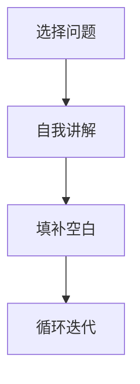

                 

# 费曼提问:唤醒管理者主动思考

> 关键词：费曼技巧, 学习策略, 知识管理, 问题导向, 创新思维

## 1. 背景介绍

在当今这个信息爆炸的时代，管理者面临着前所未有的挑战。一方面，快速变化的市场和日益复杂的业务环境要求他们快速掌握新知识、适应新变化；另一方面，海量的信息又使得他们难以从中找到有价值的内容。在这样的大背景下，如何有效地管理和吸收知识，保持持续学习和创新的能力，成为了管理者的关键课题。费曼技巧（Feynman Technique）由此应运而生，通过一种独特的提问方式，帮助管理者主动思考，提升学习效率和创新能力。

### 1.1 问题由来

费曼技巧，源自诺贝尔奖获得者理查德·费曼。费曼是一位伟大的物理学家，他在教学中发现，通过将复杂的知识用简单明了的语言传授给他人，可以加深自己的理解和掌握。费曼技巧正是基于这种思想，通过自我提问的方式，将复杂的信息转化为简单易懂的形式，从而达到自我学习和提高的目的。

近年来，随着知识管理、终身学习等理念的普及，费曼技巧被广泛应用于各个领域。尤其在企业管理中，面对日益激烈的市场竞争和快速变化的市场环境，如何有效管理知识，提升学习效率，已成为管理者的重要课题。费曼技巧因其简洁有效、易于操作的特点，成为管理者提升学习能力的利器。

## 2. 核心概念与联系

### 2.1 核心概念概述

费曼技巧是一种以问题导向的学习策略，通过将复杂的信息转化为简单易懂的形式，促进知识内化和运用。其核心思想在于通过提问和回答，加深对知识的理解，进而提高学习效率和应用能力。费曼技巧的核心步骤包括三个环节：

1. **选择问题**：选取一个需要掌握的知识点或主题，作为费曼技巧的学习对象。
2. **自我讲解**：用自己的话，将选择的知识点讲给他人，这个过程也是对自己理解的检验。
3. **填补空白**：如果发现讲解中存在不清楚的地方，就针对这些空白进行深入学习，直到能够清晰表达。

费曼技巧与其他学习策略相比，其独特之处在于强调知识的理解而非单纯的记忆。通过自我讲解，可以发现知识盲点，激发深入学习的动力，从而提高学习效率和深度。

### 2.2 核心概念原理和架构的 Mermaid 流程图



这个流程图展示了费曼技巧的基本步骤：首先选择一个问题，然后通过自我讲解和填补空白不断迭代，直到能够清晰地将问题讲给他人理解。

## 3. 核心算法原理 & 具体操作步骤

### 3.1 算法原理概述

费曼技巧的算法原理基于心理学和教育学的理论，通过自我讲解和提问的方式，促进知识的深度理解和应用。其核心思想是通过主动思考和反馈循环，将复杂的知识转化为易于理解的形式，从而达到高效学习的目的。

### 3.2 算法步骤详解

费曼技巧的步骤如下：

**Step 1: 选择问题**
- 从当前工作或学习任务中，选择一个需要掌握的知识点或主题。
- 确保这个问题是你感兴趣且能够解决实际问题的。

**Step 2: 自我讲解**
- 将选择的知识点用自己的话讲给他人听。
- 可以是在脑海中模拟，也可以是对虚拟对象（如空气）讲解。
- 讲的过程中，尽量用简单的语言，避免使用专业术语。
- 如果发现讲解过程中出现理解障碍或空白，不要停下来，先跳过这些点，继续讲解。

**Step 3: 填补空白**
- 针对讲解过程中发现的不清晰或空白部分，进行深入学习。
- 可以通过阅读相关文献、观看视频、咨询专家等方式，填补这些空白。
- 重复这个过程，直到能够清晰地将问题讲给他人理解。

**Step 4: 循环迭代**
- 不断重复上述步骤，直到你对这个问题有了深入的理解和掌握。
- 每次循环后，尝试将新的理解用更简洁明了的语言讲解给他人。

### 3.3 算法优缺点

费曼技巧具有以下优点：

1. **高效性**：通过自我讲解和反馈循环，将复杂知识转化为易懂形式，极大提高了学习效率。
2. **深入性**：强调知识理解和应用，而非简单的记忆，能够帮助管理者掌握知识的深层次含义。
3. **灵活性**：适用于各种知识领域，无论是技术、管理还是人文社科，都可以通过费曼技巧进行深度学习。
4. **实践性强**：通过实际操作，能够及时发现和解决问题，提高实际应用能力。

同时，费曼技巧也存在一些缺点：

1. **初期难度大**：初学者可能会觉得费曼技巧操作复杂，需要一定的实践才能熟练掌握。
2. **依赖自我驱动力**：效果很大程度上取决于个人的自我驱动力和持续性。
3. **适用范围有限**：对于一些需要长期积累和实践的知识，费曼技巧可能无法完全覆盖。

### 3.4 算法应用领域

费曼技巧在多个领域都有广泛应用：

- **技术学习**：程序员、工程师等技术人员可以通过费曼技巧深入理解复杂的技术原理和算法。
- **管理培训**：企业管理者可以通过费曼技巧提升领导力、沟通能力和问题解决能力。
- **学术研究**：研究人员可以通过费曼技巧深度理解理论知识，发现研究中的空白点。
- **个人成长**：任何人都可以通过费曼技巧提升知识管理能力和终身学习的能力。

## 4. 数学模型和公式 & 详细讲解 & 举例说明

### 4.1 数学模型构建

费曼技巧的数学模型较为简单，核心在于将知识点转换为易于理解的形式。可以通过以下公式来表示：

$$
\text{理解度} = \text{讲解清晰度} \times \text{填补空白的深度}
$$

其中，$\text{讲解清晰度}$ 表示通过自我讲解将知识点传达给听众的能力，$\text{填补空白的深度}$ 表示针对不清晰部分进行深入学习的能力。

### 4.2 公式推导过程

费曼技巧的公式推导过程相对简单，其核心在于通过自我讲解和填补空白的反馈循环，逐步提高知识点的理解度。具体推导如下：

1. 假设初始理解度为 $U_0$。
2. 通过自我讲解，理解度变为 $U_1 = U_0 \times \text{讲解清晰度}$。
3. 针对不清晰部分进行填补空白，理解度变为 $U_2 = U_1 \times \text{填补空白的深度}$。
4. 不断重复上述过程，每次迭代后理解度都会提高。

### 4.3 案例分析与讲解

以下是一个具体的费曼技巧应用案例：

**案例背景**：假设你是一名软件工程师，需要掌握一个新的编程语言特性，比如 Rust 的 ownership 概念。

**步骤一**：选择问题 - Rust 的 ownership 概念。

**步骤二**：自我讲解 - 尝试用简单的语言解释 ownership 的概念，比如“ ownership 是 Rust 中保证内存安全和资源管理的机制”。

**步骤三**：填补空白 - 如果讲解中出现了不清楚的部分，比如“到底什么是内存安全？”，就针对这些点进行深入学习，比如阅读相关文档、观看视频、咨询专家。

**步骤四**：循环迭代 - 重复上述步骤，直到能够清晰地将 Rust 的 ownership 概念讲给他人理解。

通过这种费曼技巧的实践，不仅能够掌握 Rust 的 ownership 概念，还能加深对其原理和应用的理解，提高学习效率和应用能力。

## 5. 项目实践：代码实例和详细解释说明

### 5.1 开发环境搭建

进行费曼技巧实践时，不需要编写复杂的代码，主要依赖于基本的文本编辑和知识管理工具。以下是一个基本的开发环境搭建流程：

1. **选择文本编辑工具**：推荐使用 Sublime Text、Visual Studio Code 等支持代码高亮的文本编辑工具。
2. **安装知识管理工具**：如 Notion、Evernote 等，用于记录和管理学习笔记。
3. **配置环境**：确保开发环境中有基本的互联网连接和文本编辑工具的权限。

### 5.2 源代码详细实现

费曼技巧的实现不需要复杂的代码，主要是通过文本编辑和知识管理工具来记录和跟踪学习过程。以下是一个基本的费曼技巧实践流程：

1. **创建学习笔记**：在 Notion 或 Evernote 中创建一个新的笔记，用于记录学习内容。
2. **选择问题**：从笔记中选择一个需要掌握的知识点或主题。
3. **自我讲解**：在笔记中写下对知识点的自我讲解，尽量用简单的语言。
4. **填补空白**：在讲解中出现的不清晰部分，通过阅读、观看视频等方式进行深入学习。
5. **循环迭代**：重复上述步骤，直到能够清晰地将问题讲给他人理解。

### 5.3 代码解读与分析

由于费曼技巧的实现主要依赖于文本编辑和知识管理工具，以下是一些关键点解读：

- **选择问题**：选择问题时要明确学习目标，确保问题有实际应用价值。
- **自我讲解**：自我讲解时要避免使用专业术语，尽量用简单明了的语言。
- **填补空白**：填补空白时要全面深入，确保理解透彻。
- **循环迭代**：每次迭代后都要检查和调整讲解内容，确保逐步提升理解度。

### 5.4 运行结果展示

以下是一个简单的费曼技巧实践结果展示：

假设你学习了 Rust 的 ownership 概念，通过费曼技巧的实践，你可以记录如下笔记：

```
**Rust 的 ownership 概念**

- **讲解**：Rust 中的 ownership 是保证内存安全和资源管理的机制。每个值都有一个唯一的 ownership，当 ownership 移出作用域时，对应的资源会被释放。

- **填补空白**：
  - 什么是内存安全？内存安全是指在程序运行过程中，不会发生内存泄漏、越界访问等问题。
  - ownership 是如何保证内存安全的？通过 RAII 和借用法，保证每个值只有一个 ownership，并且 ownership 移出作用域时自动释放资源。

- **循环迭代**：
  - 通过阅读文档和观看视频，深入理解 ownership 的工作原理。
  - 编写示例代码，实践 ownership 的应用，加深理解。
```

这个笔记记录了学习 Rust 的 ownership 概念的整个过程，通过不断的自我讲解和填补空白，逐渐加深了对该概念的理解。

## 6. 实际应用场景

### 6.1 智能客服系统

在智能客服系统中，费曼技巧可以帮助客服代表深入理解客户问题和解决方案，提升服务质量。客服代表可以通过费曼技巧将复杂的客户问题转化为易于理解的形式，快速找到解决方案。

### 6.2 金融舆情监测

在金融舆情监测中，费曼技巧可以帮助分析师深入理解市场动向和舆情变化，提高决策能力。分析师可以通过费曼技巧将复杂的市场数据转化为易于理解的形式，快速发现市场趋势和异常点。

### 6.3 个性化推荐系统

在个性化推荐系统中，费曼技巧可以帮助推荐算法开发者深入理解用户需求和行为模式，提升推荐效果。开发者可以通过费曼技巧将用户数据转化为易于理解的形式，快速发现用户兴趣点，优化推荐算法。

### 6.4 未来应用展望

随着技术的不断进步和应用的深入，费曼技巧将有以下发展趋势：

1. **自动化和智能化**：通过 AI 辅助，自动生成费曼技巧的讲解和填补空白内容，提高学习效率。
2. **跨领域应用**：费曼技巧将从单纯的知识管理领域，扩展到更多的实际应用场景，如项目管理、医疗诊断等。
3. **个性化学习**：通过智能推荐系统，根据个人的学习习惯和知识结构，定制化生成费曼技巧学习内容。

## 7. 工具和资源推荐

### 7.1 学习资源推荐

以下推荐一些优秀的学习资源，帮助管理者深入理解费曼技巧：

1. **《费曼学习法》书籍**：这本书详细介绍了费曼技巧的理论基础和实践方法，适合初学者阅读。
2. **费曼技巧在线课程**：在 Coursera、Udemy 等平台上可以找到相关的在线课程，系统学习费曼技巧的应用。
3. **费曼技巧博客**：如 Medium 上的“The Feynman Technique: The Ultimate Learning Method”，提供了丰富的实践案例和心得分享。
4. **费曼技巧社区**：如 Quora 上的费曼技巧讨论区，可以找到大量实用的学习技巧和经验分享。

### 7.2 开发工具推荐

费曼技巧的实现主要依赖于文本编辑和知识管理工具，以下是一些推荐的工具：

1. **文本编辑工具**：Sublime Text、Visual Studio Code、Atom 等。
2. **知识管理工具**：Notion、Evernote、OneNote 等。
3. **代码高亮工具**：Prism、Highlight.js 等。

### 7.3 相关论文推荐

以下推荐几篇与费曼技巧相关的经典论文，帮助深入理解其理论基础和实践方法：

1. **《A Simple Guide to the Feynman Technique》**：文章详细介绍了费曼技巧的基本步骤和应用场景，适合初学者阅读。
2. **《The Feynman Technique: A Conceptual Framework for Learning》**：文章构建了费曼技巧的理论框架，分析了其应用效果和限制条件。
3. **《Teaching Science with the Feynman Technique》**：文章通过实际教学案例，展示了费曼技巧在教育中的应用效果和操作步骤。

## 8. 总结：未来发展趋势与挑战

### 8.1 总结

费曼技巧是一种高效的学习方法，通过自我讲解和填补空白的反馈循环，能够显著提高知识点的理解度和应用能力。本文详细介绍了费曼技巧的核心概念、算法原理和具体操作步骤，并通过案例和代码实例展示了其应用方法。费曼技巧已经广泛应用于技术学习、企业管理、学术研究等多个领域，展示了其在提升学习效率和创新能力方面的巨大潜力。

### 8.2 未来发展趋势

未来，费曼技巧将有以下发展趋势：

1. **自动化和智能化**：通过 AI 辅助，自动生成费曼技巧的讲解和填补空白内容，提高学习效率。
2. **跨领域应用**：费曼技巧将从单纯的知识管理领域，扩展到更多的实际应用场景，如项目管理、医疗诊断等。
3. **个性化学习**：通过智能推荐系统，根据个人的学习习惯和知识结构，定制化生成费曼技巧学习内容。

### 8.3 面临的挑战

尽管费曼技巧具有显著的优势，但也面临以下挑战：

1. **初期难度大**：初学者可能会觉得费曼技巧操作复杂，需要一定的实践才能熟练掌握。
2. **依赖自我驱动力**：效果很大程度上取决于个人的自我驱动力和持续性。
3. **适用范围有限**：对于一些需要长期积累和实践的知识，费曼技巧可能无法完全覆盖。

### 8.4 研究展望

未来的研究需要在以下几个方面寻求新的突破：

1. **自动化和智能化**：开发智能化的费曼技巧辅助工具，自动生成讲解和填补空白内容。
2. **跨领域应用**：探索费曼技巧在更多领域的应用，提升其在实际场景中的效果。
3. **个性化学习**：研究基于费曼技巧的个性化学习系统，根据个人学习习惯和知识结构进行定制化推荐。

总之，费曼技巧作为一种高效的学习方法，将在未来的教育、企业管理等领域发挥更加重要的作用。只有勇于创新、敢于突破，才能不断拓展费曼技巧的边界，为知识的传播和应用带来新的突破。

## 9. 附录：常见问题与解答

**Q1: 费曼技巧的适用范围有哪些？**

A: 费曼技巧适用于各种知识领域，无论技术、管理还是人文社科，都可以通过费曼技巧进行深度学习。但对于一些需要长期积累和实践的知识，费曼技巧可能无法完全覆盖。

**Q2: 如何提高费曼技巧的实践效果？**

A: 提高费曼技巧的实践效果，可以从以下几个方面入手：
1. 选择合适的学习内容，确保问题有实际应用价值。
2. 坚持循环迭代，不断调整和优化讲解内容。
3. 广泛搜集和应用多种学习资源，增强学习效果。
4. 主动寻求反馈，及时调整学习策略。

**Q3: 费曼技巧与传统的学习方法相比有哪些优势？**

A: 费曼技巧相比于传统的学习方法，具有以下优势：
1. 高效性：通过自我讲解和反馈循环，将复杂知识转化为易懂形式，极大提高了学习效率。
2. 深入性：强调知识理解和应用，而非简单的记忆，能够帮助管理者掌握知识的深层次含义。
3. 灵活性：适用于各种知识领域，无论是技术、管理还是人文社科，都可以通过费曼技巧进行深度学习。

总之，费曼技巧作为一种高效的学习方法，能够显著提高知识点的理解度和应用能力，值得在管理者和学习者中广泛推广和应用。

---

作者：禅与计算机程序设计艺术 / Zen and the Art of Computer Programming

