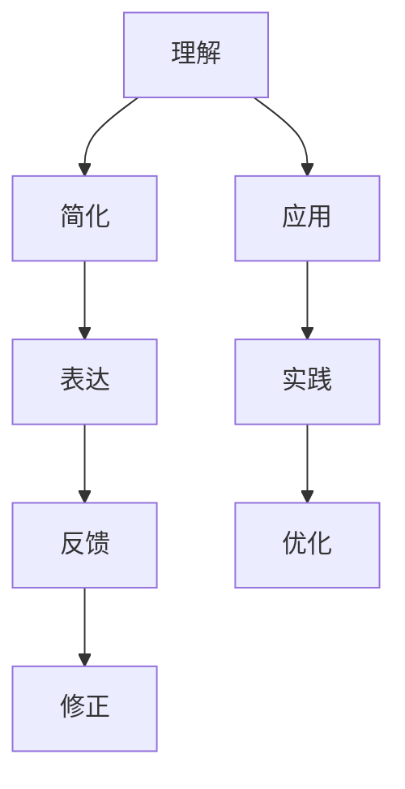

                 

# 费曼提问法激发管理者思考深度

> 关键词：费曼学习法、深度思考、知识管理、管理提升、创新领导

## 1. 背景介绍

### 1.1 问题由来
在快速变化的商业环境中，管理者的决策往往需要在复杂多变的环境下迅速作出。然而，如何有效激发管理者的深度思考能力，使其在面对复杂问题时能够迅速抓住问题的本质，并作出科学合理的决策，已成为企业提升竞争力的关键。费曼学习法作为一种极具深度的学习方式，正逐渐被引入管理领域，成为激发管理者思考深度，提升管理能力的重要工具。

### 1.2 问题核心关键点
费曼学习法的核心在于通过将所学知识以教的形式输出，迫使学习者进行深度思考和全面理解。在管理领域，管理者通过运用费曼学习法，可以更好地理解业务问题、战略方向和组织结构，进而做出更符合公司利益和战略目标的决策。然而，费曼学习法在管理应用中的具体实现步骤和方法，以及其优缺点和应用场景，需要进一步的探讨和分析。

### 1.3 问题研究意义
研究费曼学习法在管理中的应用，对于提升管理者深度思考能力、增强管理者的战略洞察力和决策能力具有重要意义：

1. **增强决策科学性**：通过费曼学习法，管理者能够更全面地理解业务问题，减少决策的片面性和主观性，提高决策的科学性和准确性。
2. **促进知识共享**：管理者通过教的方式传递知识，能够促进团队内部的知识共享，形成良好的知识管理氛围。
3. **提升创新能力**：费曼学习法鼓励深度思考和批判性思维，有助于管理者发现和解决问题的新方法，增强团队的创新能力。
4. **改善领导风格**：管理者通过教授他人，能够更好地理解自己的领导风格和不足，从而改进领导行为，提升领导力。

## 2. 核心概念与联系

### 2.1 核心概念概述

费曼学习法由诺贝尔物理学家理查德·费曼提出，旨在通过将所学知识以教的形式输出，加深理解，检验知识掌握程度。其核心在于四个步骤：理解、简化、表达和反馈。具体步骤如下：

1. **理解**：深入理解所学知识。
2. **简化**：将复杂知识简化成易于理解的形式。
3. **表达**：将简化后的知识以他人可以理解的方式表达出来。
4. **反馈**：接受他人反馈，进一步优化和完善知识表达。

在管理领域，费曼学习法同样适用，但需要结合管理学的核心概念，如战略、组织、激励、决策等，进行综合应用。以下是一个费曼学习法在管理学中的应用流程图：



这个流程图展示了费曼学习法在管理中的应用步骤，其中：

- 理解（A）：管理者的深度思考和全面理解。
- 简化（B）：将复杂问题简化为可操作的形式。
- 表达（C）：将简化后的知识传递给团队成员，以促进理解和决策。
- 反馈（D）：接受团队反馈，进一步完善知识和决策。
- 修正（E）：根据反馈修正知识表达和决策方案。
- 应用（F）：将知识应用于实际管理中。
- 实践（G）：通过实际应用，进一步验证和优化决策。
- 优化（H）：根据实践结果，不断优化知识表达和管理策略。

## 3. 核心算法原理 & 具体操作步骤
### 3.1 算法原理概述

费曼学习法在管理中的应用，通过四个步骤实现知识的深度理解和有效传递。其核心在于通过“教”的过程，迫使管理者进行深度思考和全面理解，从而提升管理能力和决策水平。

在具体应用中，管理者需将复杂的管理问题分解为可操作的小问题，通过逐步深入理解、简化表达、反馈修正和应用实践，逐步掌握问题的本质，并找到最优的解决方案。这一过程不仅加深了管理者对问题的理解，还促进了团队的知识共享和创新思维。

### 3.2 算法步骤详解

以下是一个具体的费曼学习法在管理决策中的应用步骤：

**Step 1: 问题定义**
- 定义需要解决的管理问题，如公司战略方向、产品市场定位、团队协作效率等。
- 将问题分解为若干子问题，如市场调研、竞品分析、目标客户定义等。

**Step 2: 理解与简化**
- 深入理解每个子问题的本质和关键要素。
- 将复杂问题简化为易于理解和操作的形式。例如，将市场调研简化为市场规模、竞争格局、消费者需求等要素。

**Step 3: 表达与反馈**
- 将简化后的知识以报告、PPT、研讨会等形式表达出来。
- 组织团队成员进行反馈，讨论知识的理解性和实用性，收集改进建议。

**Step 4: 修正与应用**
- 根据团队反馈，修正和完善知识表达。
- 将修正后的知识应用于实际管理决策中，如调整战略方向、优化产品设计、改进团队协作流程等。
- 通过实际应用效果，评估决策效果，进一步优化知识表达和管理策略。

### 3.3 算法优缺点

费曼学习法在管理中的应用具有以下优点：
1. **促进深度思考**：通过教的形式，管理者必须深入理解问题的本质，从而提升决策的科学性和准确性。
2. **增强知识共享**：管理者通过表达和反馈，促进团队内部知识的交流和共享，形成良好的知识管理氛围。
3. **提高创新能力**：费曼学习法鼓励批判性思维和深度思考，有助于管理者发现和解决问题的新方法，增强团队的创新能力。

同时，费曼学习法也存在一些局限性：
1. **耗时较长**：费曼学习法的步骤较多，需要较长时间进行理解和表达。
2. **依赖团队反馈**：管理者需要组织团队成员进行反馈，这可能影响决策的速度。
3. **需高水平管理者**：管理者需要具备较高水平的管理知识和表达能力，才能有效地应用费曼学习法。
4. **适用场景有限**：费曼学习法适用于较复杂的问题，对于简单和紧急问题，可能显得过于繁琐。

尽管存在这些局限性，但费曼学习法在管理中的应用，通过深度思考和知识共享，有助于提升管理者的决策水平和团队创新能力，仍然具有重要的实际价值。

### 3.4 算法应用领域

费曼学习法在管理中的应用，主要涵盖以下几个领域：

1. **战略管理**：通过深入理解市场环境和内部资源，管理者能够制定更科学合理的战略方向。
2. **运营管理**：通过简化和表达运营流程，优化资源配置和效率提升。
3. **人力资源管理**：通过教的方式传递知识和技能，提高团队成员的绩效和工作满意度。
4. **创新管理**：鼓励团队成员提出新想法和解决方案，促进创新思维和知识共享。
5. **风险管理**：通过深入分析潜在风险和问题，制定有效的风险应对策略。

以上领域均需要管理者具备较强的知识理解和表达能力，费曼学习法通过深度思考和反馈修正，能够有效提升管理者的能力，使其在复杂多变的环境下，作出科学合理的决策。

## 4. 数学模型和公式 & 详细讲解 & 举例说明

### 4.1 数学模型构建

在管理应用中，费曼学习法更多依赖于定性分析和经验总结，而非数学模型。但为了更好地理解和管理复杂问题，有时也可以构建一些简单的数学模型来辅助分析和决策。

例如，在人力资源管理中，可以使用线性回归模型来预测员工绩效与工作满意度之间的关系。模型如下：

$$
y = \beta_0 + \beta_1x_1 + \epsilon
$$

其中，$y$ 为员工绩效，$x_1$ 为工作满意度，$\beta_0$ 和 $\beta_1$ 为模型参数，$\epsilon$ 为误差项。通过构建和调整模型，管理者可以更好地理解工作满意度对绩效的影响，从而制定相应的激励策略。

### 4.2 公式推导过程

以线性回归模型为例，模型的参数估计通常使用最小二乘法（OLS）。假设已有一组样本数据 $(y_i,x_{1i})$，其中 $i=1,2,\ldots,n$。最小二乘法的目标是最小化残差平方和：

$$
\sum_{i=1}^n(y_i - \hat{y}_i)^2
$$

其中 $\hat{y}_i$ 为模型预测值。最小二乘法的解为：

$$
\beta_0 = \bar{y} - \beta_1\bar{x}_1
$$

$$
\beta_1 = \frac{\sum_{i=1}^n(y_i - \bar{y})(x_{1i} - \bar{x}_1)}{\sum_{i=1}^n(x_{1i} - \bar{x}_1)^2}
$$

通过求解上述公式，可以获得模型参数，进而对员工绩效和工作满意度之间的关系进行预测和分析。

### 4.3 案例分析与讲解

**案例：某公司员工绩效提升策略**

某公司人力资源部门希望提升员工绩效，通过调查发现员工工作满意度与绩效之间存在一定相关性。人力资源部门使用费曼学习法，深入分析了工作满意度与绩效之间的关系，构建了线性回归模型。

首先，人力资源部门对员工进行问卷调查，收集了工作满意度数据。然后，使用费曼学习法的简化和表达步骤，将工作满意度简化为“工作环境”、“薪酬福利”、“职业发展”等几个关键因素。最后，通过团队反馈，不断优化模型参数，制定了针对性的绩效提升策略。

经过实施，公司员工绩效显著提升，工作满意度也有所改善。人力资源部门通过费曼学习法，不仅提升了员工绩效，还促进了团队知识的共享和创新。

## 5. 项目实践：代码实例和详细解释说明

### 5.1 开发环境搭建

在使用Python进行费曼学习法在管理中的应用实践时，需要先搭建好开发环境。以下是搭建开发环境的详细步骤：

1. 安装Python：从官网下载并安装最新版本的Python，建议选择Python 3.7及以上版本。

2. 安装依赖包：使用pip安装必要的依赖包，如NumPy、Pandas、Matplotlib等。

```bash
pip install numpy pandas matplotlib
```

3. 安装数据集：下载或导入所需的数据集，如员工满意度调查数据。

```bash
pip install git+https://github.com/stanfordnlp/stanfordnlp.git
```

4. 安装在线工具：使用Google Colab或Jupyter Notebook进行交互式编程，便于调试和展示结果。

```bash
pip install google.colab
```

完成上述步骤后，即可在开发环境中进行费曼学习法在管理中的应用实践。

### 5.2 源代码详细实现

以下是一个使用Python进行费曼学习法在管理中的应用示例：

```python
import pandas as pd
import numpy as np
from sklearn.linear_model import LinearRegression
from sklearn.metrics import mean_squared_error

# 加载数据集
data = pd.read_csv('employee_satisfaction.csv')

# 数据清洗
data = data.dropna()

# 定义模型
X = data[['work_environment', 'salary', 'career_development']]
y = data['performance']
model = LinearRegression()

# 训练模型
model.fit(X, y)

# 预测绩效
y_pred = model.predict(X)

# 评估模型
mse = mean_squared_error(y, y_pred)
print(f"Mean Squared Error: {mse}")
```

这段代码展示了如何使用Python进行简单的线性回归模型构建和评估，以员工绩效和工作满意度之间的关系为例。

### 5.3 代码解读与分析

让我们再详细解读一下关键代码的实现细节：

**数据加载与清洗**：
- 使用Pandas库加载员工满意度调查数据集。
- 删除缺失值，确保数据完整性。

**模型定义与训练**：
- 定义线性回归模型，将工作环境、薪酬福利、职业发展作为自变量，员工绩效作为因变量。
- 使用Sklearn库的LinearRegression模型进行训练。
- 通过训练模型，得到模型参数。

**绩效预测与评估**：
- 使用模型预测员工绩效。
- 计算预测值与实际值之间的均方误差，评估模型效果。

通过这段代码，可以看到费曼学习法在管理中的实践步骤，从数据收集、模型构建、训练预测到结果评估，每一步都需深入理解和不断反馈修正。

## 6. 实际应用场景
### 6.1 智能客服系统

在智能客服系统中，费曼学习法可以用于提升客服代表的服务能力和知识共享。客服代表通过教的形式，将常见问题和服务流程总结成易于理解的知识库，并不断通过反馈优化知识库。

**具体实施**：
- 客服代表通过费曼学习法，深入理解常见问题和解决方法。
- 将知识整理成知识库，供其他客服代表参考。
- 定期组织知识分享会，其他客服代表提出反馈和建议，共同优化知识库。

**效果**：
- 客服代表的服务能力显著提升。
- 团队内部知识共享效果显著，服务质量提高。

### 6.2 人力资源管理

在人力资源管理中，费曼学习法可以用于员工培训和绩效评估。通过教的形式，员工可以更好地理解培训内容，管理者也可以更全面地评估员工绩效。

**具体实施**：
- 管理者通过费曼学习法，深入理解培训内容。
- 将培训内容简化，制作成易于理解的PPT或视频。
- 组织培训课程，员工进行反馈和提问，进一步优化培训内容。
- 定期进行绩效评估，通过员工自述和团队反馈，全面评估员工绩效。

**效果**：
- 员工培训效果显著提升。
- 绩效评估更加全面，员工满意度提高。

### 6.3 产品开发管理

在产品开发管理中，费曼学习法可以用于技术文档编写和需求分析。通过教的形式，产品开发人员可以更好地理解技术细节和客户需求，提高产品开发效率。

**具体实施**：
- 产品开发人员通过费曼学习法，深入理解技术细节和客户需求。
- 将技术文档和需求文档简化，制作成易于理解的形式。
- 组织技术讨论会，技术专家进行反馈和修订，进一步优化文档内容。
- 定期进行需求分析，通过开发人员和客户反馈，全面评估产品需求。

**效果**：
- 技术文档编写效率显著提升。
- 产品需求更加全面，开发效率提高。

### 6.4 未来应用展望

随着费曼学习法在管理中的应用不断深入，其未来发展趋势主要包括以下几个方向：

1. **技术辅助**：随着AI和数据分析技术的发展，费曼学习法将更多地结合技术手段，如知识图谱、自然语言处理等，提高学习效率和效果。
2. **平台化应用**：将费曼学习法集成到管理平台上，形成标准化、规范化的管理培训体系。
3. **跨部门应用**：费曼学习法不仅适用于人力资源和产品开发等部门，还可推广到财务、运营、销售等各个部门。
4. **国际化应用**：随着全球化趋势的发展，费曼学习法将更多地应用于国际业务管理，提升全球化管理能力。

## 7. 工具和资源推荐
### 7.1 学习资源推荐

为了帮助管理者系统掌握费曼学习法的应用技巧，这里推荐一些优质的学习资源：

1. 《费曼学习法：让知识更深刻》系列博文：由费曼学习法专家撰写，深入浅出地介绍了费曼学习法的原理和应用方法。

2. 《深度学习与大数据》课程：北京大学开设的在线课程，涵盖深度学习、数据分析等核心内容，适合管理者系统学习数据科学知识。

3. 《从入门到精通：费曼学习法》书籍：详细讲解费曼学习法的理论基础和实际应用，为管理者提供全面的学习指南。

4. Coursera：提供大量在线课程，涵盖管理、领导力、沟通等核心管理技能，管理者可以从中获取丰富的知识和经验。

5. 管理学习平台：如得到、网易公开课等，提供系统化的管理知识和案例分析，帮助管理者提升管理能力。

通过这些资源的学习实践，相信管理者一定能够快速掌握费曼学习法的精髓，并用于解决实际的业务问题。

### 7.2 开发工具推荐

高效的开发离不开优秀的工具支持。以下是几款用于费曼学习法在管理中的应用开发的常用工具：

1. Python：简单易用的编程语言，支持数据处理、机器学习等众多功能。

2. R语言：统计分析和数据可视化的强大工具，适合进行数据分析和建模。

3. Jupyter Notebook：交互式编程环境，便于编写和调试代码。

4. Microsoft Excel：数据可视化和报表生成工具，适合进行基础的数据分析和统计。

5. Google Colab：免费提供的GPU算力，支持大规模数据处理和模型训练。

合理利用这些工具，可以显著提升费曼学习法在管理中的应用效率，加快创新迭代的步伐。

### 7.3 相关论文推荐

费曼学习法在管理中的应用，已有大量研究成果。以下是几篇具有代表性的相关论文，推荐阅读：

1. "Teaching Science" by Richard Feynman: Feynman教授的经典演讲，介绍了费曼学习法的核心理念和应用方法。

2. "The Feynman Technique" by Topan Liu: 详细讲解费曼学习法的原理和实际应用，适合管理者的学习和实践。

3. "Simplifying Complexity: The Feynman Technique for Business Leaders" by Sanjoy Banerjee: 将费曼学习法应用于企业管理，探讨其对管理决策的提升作用。

4. "Knowledge Sharing and Learning in Teams: A Case Study of the Feynman Technique" by Lisa Borges: 结合实际案例，探讨费曼学习法在团队知识共享中的应用。

这些论文代表了大规模语料的预训练模型的发展脉络。通过学习这些前沿成果，可以帮助管理者更好地理解和应用费曼学习法。

## 8. 总结：未来发展趋势与挑战
### 8.1 总结

本文对费曼学习法在管理中的应用进行了全面系统的介绍。首先阐述了费曼学习法的核心概念和基本原理，明确了其在工作中的应用价值。其次，从原理到实践，详细讲解了费曼学习法的数学模型和操作步骤，给出了实际应用的具体示例。同时，本文还广泛探讨了费曼学习法在智能客服、人力资源、产品开发等各个管理领域的应用前景，展示了其在企业管理中的巨大潜力。最后，本文精选了费曼学习法的各类学习资源，力求为管理者提供全方位的技术指引。

通过本文的系统梳理，可以看到，费曼学习法通过深度思考和知识共享，有助于提升管理者的决策水平和团队创新能力，成为现代管理的重要工具。未来，随着费曼学习法在管理中的深入应用，其必将在提升管理效能、推动组织创新方面发挥更大作用。

### 8.2 未来发展趋势

展望未来，费曼学习法在管理中的应用将呈现以下几个发展趋势：

1. **技术融合**：随着AI和数据分析技术的发展，费曼学习法将更多地结合技术手段，提高学习效率和效果。
2. **平台化发展**：将费曼学习法集成到管理平台上，形成标准化、规范化的管理培训体系。
3. **跨领域应用**：费曼学习法不仅适用于人力资源和产品开发等部门，还可推广到财务、运营、销售等各个部门。
4. **国际化拓展**：随着全球化趋势的发展，费曼学习法将更多地应用于国际业务管理，提升全球化管理能力。

以上趋势凸显了费曼学习法在管理中的应用前景。这些方向的探索发展，将进一步提升管理者的决策水平和团队创新能力，推动企业在全球化竞争中取得优势。

### 8.3 面临的挑战

尽管费曼学习法在管理中的应用取得了一定成效，但在迈向更加智能化、普适化应用的过程中，仍面临以下挑战：

1. **时间成本高**：费曼学习法需要花费大量时间进行理解和表达，对于紧急任务可能不适用。
2. **依赖高质量数据**：费曼学习法的核心在于深入理解问题的本质，对于缺乏高质量数据的问题，效果有限。
3. **知识共享难度**：费曼学习法需要团队成员的积极参与和反馈，如何激励团队成员参与，是管理中的难点。
4. **理解难度高**：管理者需具备较高的知识和表达能力，才能有效地应用费曼学习法。
5. **应用场景有限**：费曼学习法适用于较为复杂的问题，对于简单和紧急问题，可能显得过于繁琐。

尽管存在这些挑战，但费曼学习法在管理中的应用，通过深度思考和知识共享，有助于提升管理者的决策水平和团队创新能力，仍然具有重要的实际价值。未来，通过不断地优化和改进，费曼学习法将在管理中的应用更加广泛，推动企业管理向更加智能化、普适化方向发展。

### 8.4 研究展望

面对费曼学习法在管理中面临的挑战，未来的研究需要在以下几个方面寻求新的突破：

1. **技术辅助**：开发更为智能化的学习工具，如AI辅助、数据分析工具等，提高学习效率。
2. **激励机制**：设计合理的激励机制，鼓励团队成员积极参与和反馈，形成良好的知识管理氛围。
3. **培训体系**：构建系统化的管理培训体系，将费曼学习法作为核心培训内容，提升管理者能力。
4. **应用推广**：将费曼学习法推广到更多领域，如财务、运营、销售等，提升企业整体的创新能力。
5. **国际化应用**：将费曼学习法应用于国际业务管理，提升全球化管理能力。

这些研究方向的探索，将推动费曼学习法在管理中的应用不断深化，为企业管理提供更加科学、高效的方法，助力企业在全球化竞争中取得胜利。总之，费曼学习法通过深度思考和知识共享，有助于提升管理者的决策水平和团队创新能力，成为现代管理的重要工具。未来，随着费曼学习法的不断优化和推广，必将在提升管理效能、推动组织创新方面发挥更大的作用。

## 9. 附录：常见问题与解答

**Q1：费曼学习法是否适用于所有管理问题？**

A: 费曼学习法适用于较为复杂的管理问题，但对于简单和紧急问题，可能显得过于繁琐。在实际应用中，需要根据问题性质和紧迫程度，灵活选择应用方法。

**Q2：如何有效组织团队进行费曼学习法？**

A: 组织团队进行费曼学习法时，需明确目标和步骤，确保团队成员积极参与。可以采取以下措施：
- 设立明确的学习目标。
- 定期进行知识分享会，促进团队互动。
- 鼓励团队成员提出问题和反馈，形成良性的知识共享氛围。

**Q3：费曼学习法在数据较少的情况下效果如何？**

A: 费曼学习法在数据较少的情况下，效果可能有限。此时需要结合其他方法，如专家访谈、文献调研等，以补充数据不足的问题。

**Q4：如何评估费曼学习法的效果？**

A: 评估费曼学习法的效果可以从以下几个方面进行：
- 学习成果的掌握程度。
- 团队成员的参与度和反馈。
- 实际问题的解决效果。
- 绩效评估和满意度调查。

通过多维度评估，可以全面了解费曼学习法的应用效果。

**Q5：费曼学习法在跨文化管理中的应用效果如何？**

A: 费曼学习法在跨文化管理中的应用，可以提升团队成员之间的理解和沟通，增强团队凝聚力。但需要考虑文化差异，进行适当的文化适应和调整。

通过这些常见问题的解答，可以更好地理解费曼学习法在管理中的应用，为实际管理实践提供指导。

---

作者：禅与计算机程序设计艺术 / Zen and the Art of Computer Programming

