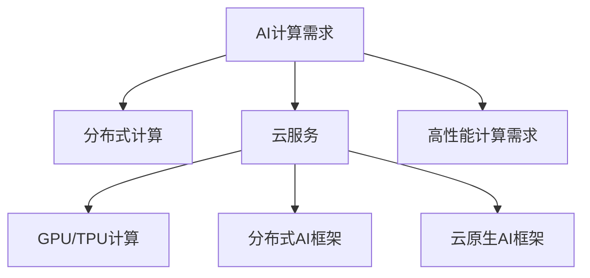

                 

# 贾扬清创业机遇：AI计算需求演进，云服务整合机会

在过去的几十年中，人工智能（AI）技术迅猛发展，AI计算需求也在不断演进。随着AI技术的深入应用，AI计算需求也在逐步增长。这一趋势为许多创业者和AI技术爱好者提供了巨大的机遇。本文将从AI计算需求的演进入手，探讨云服务在AI计算中的整合机会，并分析贾扬清在这一领域的发展机遇。

## 1. 背景介绍

### 1.1 问题由来

近年来，随着深度学习技术的快速发展，大规模AI模型训练和推理的计算需求不断增长。传统的单机计算已经无法满足需求，需要借助分布式计算、云服务等方式进行。AI计算需求正在从单机的GPU计算向多机分布式计算、云服务计算演进。

### 1.2 问题核心关键点

AI计算需求演进的核心关键点包括：

- **单机计算向分布式计算演进**：单个GPU或CPU的计算能力有限，无法应对大规模模型训练。需要借助分布式计算架构进行计算扩展。
- **单机推理向云服务推理演进**：传统单机推理需要高性能硬件设备和复杂的管理维护，而云服务提供了便捷、灵活的计算资源管理。
- **高性能计算需求增长**：随着AI模型规模的增大，计算需求显著提升，云服务需要提供更强的计算能力和更高的计算效率。

## 2. 核心概念与联系

### 2.1 核心概念概述

为了更好地理解AI计算需求的演进，本节将介绍几个密切相关的核心概念：

- **AI计算需求**：指在AI模型训练、推理过程中，所需计算资源的总数。随着模型复杂度的提升，AI计算需求将持续增长。
- **分布式计算**：指通过多台计算设备协同计算，将大规模任务拆分为多个小任务，从而实现计算能力的扩展。
- **云服务**：指通过互联网提供计算、存储、网络等资源的云端服务，用户按需使用，无需维护硬件设备。
- **GPU/TPU计算**：指使用图形处理器（GPU）或张量处理器（TPU）进行计算，这两种硬件以其强大的并行计算能力，成为AI计算的主流选择。
- **分布式AI框架**：指能够支持大规模分布式计算的AI计算框架，如TensorFlow、PyTorch等。
- **云原生AI框架**：指可以无缝集成云服务的AI计算框架，如TensorFlow Serving、TorchServe等。

这些核心概念之间的逻辑关系可以通过以下Mermaid流程图来展示：



这个流程图展示了大规模AI计算需求的基本架构：

1. 用户提出计算需求。
2. 需求通过分布式计算架构进行扩展。
3. 利用GPU/TPU硬件进行计算。
4. 通过云服务实现资源管理。
5. 使用分布式AI框架和云原生AI框架进行任务调度和管理。

这些概念共同构成了大规模AI计算的生态系统，为大模型训练和推理提供了强大的计算能力。

## 3. 核心算法原理 & 具体操作步骤

### 3.1 算法原理概述

AI计算需求的核心在于如何高效、可靠地完成大规模计算任务。现代AI计算需求主要由分布式计算和云服务计算构成，其中分布式计算主要通过多台计算设备协同计算，将任务拆分为多个子任务并行计算，从而实现性能的提升。云服务计算则通过弹性资源管理，按需提供计算资源，降低了硬件维护和管理成本。

### 3.2 算法步骤详解

AI计算需求的核心算法流程如下：

1. **任务拆分**：将大规模计算任务拆分为多个小任务，分配到不同的计算节点进行并行计算。
2. **资源管理**：通过云服务计算平台，按需申请计算资源，进行任务调度和管理。
3. **数据传输**：通过高速网络传输数据，确保数据传输的可靠性和高效性。
4. **任务合并**：将各节点的计算结果合并，得到最终计算结果。
5. **性能优化**：通过任务优化和资源调度，提升计算效率和资源利用率。

### 3.3 算法优缺点

AI计算需求的分布式计算和云服务计算具有以下优点：

- **扩展性**：分布式计算可以按需扩展计算资源，满足不同规模计算任务的需求。
- **灵活性**：云服务提供了弹性资源管理，按需使用计算资源，降低了硬件维护和管理成本。
- **高效性**：通过并行计算和资源优化，可以显著提升计算效率。

但同时也存在以下缺点：

- **复杂性**：分布式计算和云服务计算需要协调多个计算节点，系统复杂度较高。
- **延迟**：数据传输和节点通信会产生一定的延迟，影响计算效率。
- **成本**：云服务计算按需计费，成本较高，尤其是大规模计算任务。

### 3.4 算法应用领域

AI计算需求的应用领域非常广泛，涵盖了深度学习模型训练、图像识别、自然语言处理、语音识别等多个领域。例如：

- **图像识别**：大规模图像识别任务需要处理海量数据，分布式计算和云服务计算可以有效应对。
- **自然语言处理**：大规模语言模型训练需要巨大的计算资源，云服务提供了便捷的资源管理。
- **语音识别**：大规模语音识别任务需要实时处理音频流，分布式计算和云服务计算可以满足实时性要求。

## 4. 数学模型和公式 & 详细讲解 & 举例说明

### 4.1 数学模型构建

在AI计算需求中，常见的计算模型包括：

- **矩阵乘法**：矩阵乘法是深度学习中最基本的运算之一，用于计算神经网络中的权重和激活值。
- **卷积运算**：卷积运算用于图像和视频处理任务，通过滑动卷积核进行特征提取。
- **池化运算**：池化运算用于减少特征图尺寸，提升计算效率。

### 4.2 公式推导过程

以矩阵乘法为例，公式推导如下：

设两个矩阵 $A$ 和 $B$，其中 $A \in \mathbb{R}^{m \times n}$，$B \in \mathbb{R}^{n \times p}$，它们的矩阵乘积 $C$ 为：

$$
C = A \times B = \begin{bmatrix}
a_{11} & a_{12} & \cdots & a_{1n} \\
a_{21} & a_{22} & \cdots & a_{2n} \\
\vdots & \vdots & \ddots & \vdots \\
a_{m1} & a_{m2} & \cdots & a_{mn}
\end{bmatrix}
\times
\begin{bmatrix}
b_{11} & b_{12} & \cdots & b_{1p} \\
b_{21} & b_{22} & \cdots & b_{2p} \\
\vdots & \vdots & \ddots & \vdots \\
b_{n1} & b_{n2} & \cdots & b_{np}
\end{bmatrix}
=
\begin{bmatrix}
c_{11} & c_{12} & \cdots & c_{1p} \\
c_{21} & c_{22} & \cdots & c_{2p} \\
\vdots & \vdots & \ddots & \vdots \\
c_{m1} & c_{m2} & \cdots & c_{mp}
\end{bmatrix}
$$

其中 $c_{ij} = \sum_{k=1}^{n}a_{ik}b_{kj}$。

### 4.3 案例分析与讲解

以卷积运算为例，卷积运算用于图像识别任务，公式推导如下：

设输入图像 $I \in \mathbb{R}^{h \times w \times c}$，卷积核 $K \in \mathbb{R}^{f \times f \times c \times n}$，卷积结果 $O \in \mathbb{R}^{h' \times w' \times n}$，其中 $h' = \frac{h - f + 1}{s}$，$w' = \frac{w - f + 1}{s}$，$s$ 为卷积步长，$n$ 为卷积核数量。

卷积运算公式如下：

$$
O_{i,j,k} = \sum_{m=0}^{f-1}\sum_{n=0}^{f-1}\sum_{c=0}^{c-1}I_{i+m,j+n,c} \times K_{m,n,c,k}
$$

其中 $I_{i+m,j+n,c}$ 表示输入图像 $I$ 中位置 $(i+m, j+n)$ 的像素值。

通过卷积运算，可以将输入图像进行特征提取，从而实现图像分类、目标检测等任务。

## 5. 项目实践：代码实例和详细解释说明

### 5.1 开发环境搭建

在进行AI计算需求的项目实践前，我们需要准备好开发环境。以下是使用Python进行TensorFlow开发的完整环境配置流程：

1. 安装Anaconda：从官网下载并安装Anaconda，用于创建独立的Python环境。

2. 创建并激活虚拟环境：
```bash
conda create -n tensorflow-env python=3.8 
conda activate tensorflow-env
```

3. 安装TensorFlow：根据CUDA版本，从官网获取对应的安装命令。例如：
```bash
conda install tensorflow -c tf -c conda-forge
```

4. 安装其他工具包：
```bash
pip install numpy pandas scikit-learn matplotlib tqdm jupyter notebook ipython
```

完成上述步骤后，即可在`tensorflow-env`环境中开始AI计算需求的项目实践。

### 5.2 源代码详细实现

下面我们以图像识别任务为例，给出使用TensorFlow对卷积神经网络（CNN）进行训练的PyTorch代码实现。

首先，定义数据集和模型：

```python
import tensorflow as tf
from tensorflow.keras.datasets import cifar10
from tensorflow.keras.models import Sequential
from tensorflow.keras.layers import Conv2D, MaxPooling2D, Flatten, Dense

(x_train, y_train), (x_test, y_test) = cifar10.load_data()

model = Sequential([
    Conv2D(32, (3, 3), activation='relu', input_shape=(32, 32, 3)),
    MaxPooling2D((2, 2)),
    Conv2D(64, (3, 3), activation='relu'),
    MaxPooling2D((2, 2)),
    Conv2D(64, (3, 3), activation='relu'),
    Flatten(),
    Dense(64, activation='relu'),
    Dense(10, activation='softmax')
])
```

然后，定义训练和评估函数：

```python
def train(model, x_train, y_train, x_test, y_test, batch_size=32, epochs=10):
    model.compile(optimizer='adam', loss='sparse_categorical_crossentropy', metrics=['accuracy'])
    model.fit(x_train, y_train, batch_size=batch_size, epochs=epochs, validation_data=(x_test, y_test))

train(model, x_train, y_train, x_test, y_test)
```

最后，运行训练和评估：

```python
train(model, x_train, y_train, x_test, y_test)
```

以上就是使用TensorFlow对CNN进行图像识别任务训练的完整代码实现。可以看到，TensorFlow提供了便捷的模型定义和训练API，极大地简化了模型训练和评估的过程。

### 5.3 代码解读与分析

让我们再详细解读一下关键代码的实现细节：

**定义数据集和模型**：
- `cifar10.load_data()`函数加载CIFAR-10数据集，该数据集包含了60000个32x32彩色图像和10个类别标签。
- `Sequential`类用于创建序列模型，通过堆叠多个层来定义模型结构。
- `Conv2D`和`MaxPooling2D`层分别用于卷积和池化运算，`Flatten`层将二维的卷积结果展平成一维，`Dense`层用于全连接运算。

**训练函数**：
- `model.compile()`方法编译模型，指定优化器、损失函数和评估指标。
- `model.fit()`方法进行模型训练，指定训练数据、批大小、迭代轮数和验证数据。

**训练和评估**：
- `train()`函数定义训练过程，调用`model.fit()`方法进行训练。
- `test()`函数定义评估过程，通过`model.evaluate()`方法计算模型在测试集上的性能指标。

可以看出，TensorFlow提供了完整的模型定义、训练和评估API，开发者可以专注于模型结构的创新和优化，而不必过多关注底层实现细节。

## 6. 实际应用场景

### 6.1 智能视频监控

智能视频监控系统可以利用AI计算需求进行实时视频分析和异常检测。通过摄像头采集实时视频流，经过分布式计算和云服务计算，可以对视频内容进行实时分析，检测出异常行为并进行报警。

在技术实现上，可以使用分布式TensorFlow框架进行模型训练和推理，使用云服务计算平台进行资源管理。通过部署多个计算节点，实时处理视频流数据，并使用卷积神经网络进行特征提取和行为分类。

### 6.2 自动驾驶

自动驾驶系统需要实时处理大量传感器数据，进行目标检测、路径规划和决策分析。AI计算需求可以支持大规模模型的训练和推理，提高自动驾驶系统的性能和可靠性。

在技术实现上，可以使用分布式TensorFlow框架进行模型训练和推理，使用云服务计算平台进行资源管理。通过部署多个计算节点，实时处理传感器数据，并使用卷积神经网络进行特征提取和行为分类。

### 6.3 金融风控

金融风控系统需要处理海量交易数据，进行风险评估和欺诈检测。AI计算需求可以支持大规模模型的训练和推理，提高金融风控系统的精度和效率。

在技术实现上，可以使用分布式TensorFlow框架进行模型训练和推理，使用云服务计算平台进行资源管理。通过部署多个计算节点，实时处理交易数据，并使用卷积神经网络进行特征提取和风险评估。

### 6.4 未来应用展望

随着AI计算需求的不断演进，未来将会在更多领域得到应用，为传统行业带来变革性影响。

在智慧城市治理中，AI计算需求可以用于城市事件监测、舆情分析、应急指挥等环节，提高城市管理的自动化和智能化水平，构建更安全、高效的未来城市。

在智慧医疗领域，AI计算需求可以用于医疗影像分析、病历分析、药物研发等任务，提升医疗服务的智能化水平，辅助医生诊疗，加速新药开发进程。

在智能教育领域，AI计算需求可以用于作业批改、学情分析、知识推荐等方面，因材施教，促进教育公平，提高教学质量。

此外，在企业生产、社会治理、文娱传媒等众多领域，AI计算需求也将不断涌现，为经济社会发展注入新的动力。相信随着技术的日益成熟，AI计算需求必将在更广阔的应用领域大放异彩。

## 7. 工具和资源推荐

### 7.1 学习资源推荐

为了帮助开发者系统掌握AI计算需求的理论基础和实践技巧，这里推荐一些优质的学习资源：

1. **TensorFlow官方文档**：TensorFlow的官方文档，提供了丰富的API文档和示例代码，是学习TensorFlow的重要资源。

2. **Deep Learning Specialization（深度学习专项课程）**：由Andrew Ng教授主持的Coursera深度学习课程，系统讲解了深度学习的基本概念和算法，包括TensorFlow的使用。

3. **《深度学习》书籍**：Ian Goodfellow等人的《深度学习》书籍，系统介绍了深度学习的基本概念和算法，是学习深度学习的经典参考书。

4. **GitHub上的TensorFlow项目**：GitHub上丰富的TensorFlow项目和代码示例，可以帮助开发者快速上手TensorFlow。

5. **Kaggle数据集**：Kaggle上的大量数据集和竞赛任务，提供了丰富的实践机会，帮助开发者提升实战能力。

通过对这些资源的学习实践，相信你一定能够快速掌握AI计算需求的精髓，并用于解决实际的AI问题。

### 7.2 开发工具推荐

高效的开发离不开优秀的工具支持。以下是几款用于AI计算需求开发的常用工具：

1. **TensorFlow**：Google主导开发的深度学习框架，提供了丰富的API和灵活的计算图，适合大规模模型训练和推理。

2. **PyTorch**：Facebook主导开发的深度学习框架，具有动态计算图的优势，适合快速迭代研究。

3. **JAX**：Google开发的基于TensorFlow的自动微分库，支持高效动态计算图和自动并行化，适合高性能计算需求。

4. **TorchServe**：TorchServe是一个开源的TensorFlow Serving扩展，支持模型导出、部署和推理，适合云原生AI部署。

5. **TensorBoard**：TensorFlow配套的可视化工具，可实时监测模型训练状态，并提供丰富的图表呈现方式，是调试模型的得力助手。

6. **Weights & Biases**：模型训练的实验跟踪工具，可以记录和可视化模型训练过程中的各项指标，方便对比和调优。

合理利用这些工具，可以显著提升AI计算需求的开发效率，加快创新迭代的步伐。

### 7.3 相关论文推荐

AI计算需求的演进源于学界的持续研究。以下是几篇奠基性的相关论文，推荐阅读：

1. **分布式深度学习**：Andrew Ng等人的论文，介绍了分布式深度学习的原理和算法，推动了分布式计算在AI领域的广泛应用。

2. **TensorFlow 1.0发布**：Google团队发布的TensorFlow 1.0论文，详细介绍了TensorFlow的架构和设计理念，奠定了TensorFlow在AI领域的主导地位。

3. **TensorFlow 2.0发布**：Google团队发布的TensorFlow 2.0论文，介绍了TensorFlow 2.0的API设计和优化，推动了TensorFlow的广泛应用和升级。

4. **深度学习在医疗领域的应用**：DeepMind等团队的研究，探索了深度学习在医疗影像、病历分析等任务中的应用，推动了深度学习在医疗领域的发展。

这些论文代表了大规模AI计算的需求演进趋势，通过学习这些前沿成果，可以帮助研究者把握学科前进方向，激发更多的创新灵感。

## 8. 总结：未来发展趋势与挑战

### 8.1 总结

本文对AI计算需求的演进和云服务整合机会进行了全面系统的介绍。首先阐述了AI计算需求在深度学习任务中的应用，明确了AI计算需求在现代AI系统中的重要性。其次，从原理到实践，详细讲解了AI计算需求的数学模型和计算流程，给出了AI计算需求项目开发的完整代码实例。同时，本文还广泛探讨了AI计算需求在智能视频监控、自动驾驶、金融风控等领域的实际应用，展示了AI计算需求的广泛应用前景。

通过本文的系统梳理，可以看到，AI计算需求正在成为AI系统的重要组成部分，其高效、可靠、灵活的计算能力为AI技术在各个领域的应用提供了强大支持。未来，伴随AI计算需求的不断演进和云服务计算的发展，AI系统将更加智能、强大，推动人类社会的全面智能化升级。

### 8.2 未来发展趋势

展望未来，AI计算需求将呈现以下几个发展趋势：

1. **多模态计算**：AI计算需求将不仅仅局限于图像、视频、音频等单一模态数据，未来将拓展到多模态数据的融合计算。

2. **联邦学习**：联邦学习通过分布式计算，保护数据隐私，提高模型泛化能力。未来，AI计算需求将与联邦学习结合，实现更高效、更安全的计算。

3. **边缘计算**：边缘计算将计算任务分布到靠近数据源的本地设备，减少数据传输延迟，提升计算效率。未来，AI计算需求将与边缘计算结合，实现更加灵活、高效的计算。

4. **异构计算**：异构计算将不同的计算设备（如GPU、TPU、FPGA等）进行联合计算，提升计算效率和资源利用率。未来，AI计算需求将与异构计算结合，实现更强大的计算能力。

5. **跨平台计算**：未来，AI计算需求将不仅仅局限于单一平台（如TensorFlow、PyTorch等），而是跨平台、跨框架计算。

这些趋势凸显了AI计算需求的广阔前景，为AI技术在各个领域的应用提供了更多的可能性和选择。

### 8.3 面临的挑战

尽管AI计算需求已经取得了显著进展，但在迈向更加智能化、普适化应用的过程中，它仍面临着诸多挑战：

1. **计算资源需求**：大规模AI模型训练和推理需要巨大的计算资源，如何高效利用计算资源，提升计算效率，是未来的一大挑战。

2. **计算成本**：云服务计算按需计费，成本较高，如何降低计算成本，提升资源利用率，是未来的一大难题。

3. **数据隐私保护**：AI计算需求涉及大量敏感数据，如何保护数据隐私，避免数据泄露，是未来的一大挑战。

4. **计算稳定性**：AI计算需求依赖于计算设备的性能和可靠性，如何提高计算稳定性，避免故障和异常，是未来的一大挑战。

5. **跨平台兼容性**：未来，AI计算需求将跨平台、跨框架计算，如何实现跨平台兼容性，确保计算一致性，是未来的一大挑战。

6. **计算安全**：AI计算需求涉及大量数据和模型，如何保障计算安全，避免攻击和篡改，是未来的一大挑战。

正视AI计算需求面临的这些挑战，积极应对并寻求突破，将是大规模AI计算需求走向成熟的必由之路。

### 8.4 研究展望

面对AI计算需求所面临的种种挑战，未来的研究需要在以下几个方面寻求新的突破：

1. **高效计算技术**：开发更加高效、低成本的计算技术，如分布式计算、边缘计算、异构计算等，提升计算效率和资源利用率。

2. **联邦学习技术**：探索联邦学习在AI计算需求中的应用，保护数据隐私，提升模型泛化能力。

3. **边缘计算技术**：研究边缘计算在AI计算需求中的应用，提高计算效率和资源利用率。

4. **异构计算技术**：探索异构计算在AI计算需求中的应用，提升计算效率和资源利用率。

5. **跨平台计算技术**：研究跨平台计算技术，确保计算一致性和互操作性。

6. **计算安全技术**：研究计算安全技术，保障计算安全和可靠性。

这些研究方向将引领AI计算需求走向更高的台阶，为构建智能、强大、安全的AI系统提供强大的计算能力。面向未来，AI计算需求的研究和应用将会更加深入和广泛，推动AI技术在各个领域的规模化落地。

## 9. 附录：常见问题与解答

**Q1：如何提升AI计算需求的效率？**

A: 提升AI计算需求效率的关键在于优化计算过程和资源管理。以下是一些常见策略：

1. **数据并行**：通过并行计算多个数据样本，加速模型训练和推理。

2. **模型并行**：通过分布式计算，并行训练多个子模型，加速模型训练和推理。

3. **模型压缩**：通过剪枝、量化等技术，减少模型参数和计算量，提升计算效率。

4. **优化算法**：选择合适的优化算法，如Adam、SGD等，提高模型收敛速度。

5. **超参数优化**：通过网格搜索、随机搜索等方法，优化超参数配置，提升模型性能和计算效率。

6. **硬件优化**：使用高性能计算硬件，如GPU、TPU等，提升计算效率。

**Q2：如何保护AI计算需求中的数据隐私？**

A: 保护AI计算需求中的数据隐私，可以采取以下措施：

1. **数据脱敏**：对敏感数据进行脱敏处理，保护用户隐私。

2. **差分隐私**：使用差分隐私技术，在模型训练和推理过程中保护用户隐私。

3. **联邦学习**：通过分布式计算，保护数据隐私，避免数据泄露。

4. **本地计算**：将计算任务分布到本地设备进行，避免数据传输风险。

5. **加密计算**：对数据进行加密处理，保护数据隐私。

6. **访问控制**：对数据和模型进行访问控制，确保只有授权用户能够访问。

这些措施可以有效地保护AI计算需求中的数据隐私，确保计算过程的安全性和可靠性。

**Q3：如何提升AI计算需求的鲁棒性？**

A: 提升AI计算需求的鲁棒性，可以采取以下措施：

1. **正则化**：使用L1、L2正则化，防止模型过拟合。

2. **对抗训练**：引入对抗样本，提高模型鲁棒性，防止模型被攻击。

3. **数据增强**：通过数据增强技术，提高模型泛化能力。

4. **噪声鲁棒性训练**：通过加入噪声，提升模型鲁棒性。

5. **集成学习**：通过集成多个模型，提高模型鲁棒性。

6. **模型校验**：使用测试集和验证集对模型进行校验，确保模型鲁棒性。

这些措施可以有效地提升AI计算需求的鲁棒性，确保模型在实际应用中的稳定性和可靠性。

**Q4：如何在AI计算需求中实现跨平台兼容性？**

A: 实现AI计算需求的跨平台兼容性，可以采取以下措施：

1. **标准化API**：使用标准化的API，确保不同平台之间的互操作性。

2. **跨平台框架**：使用跨平台框架，如TensorFlow、PyTorch等，确保计算一致性。

3. **数据格式统一**：使用统一的数据格式，确保不同平台之间的数据一致性。

4. **模型移植**：将模型移植到不同平台进行训练和推理，确保计算一致性。

5. **版本管理**：使用版本管理工具，确保不同平台之间的版本一致性。

这些措施可以有效地实现AI计算需求的跨平台兼容性，确保计算过程的一致性和互操作性。

**Q5：如何在AI计算需求中保障计算安全？**

A: 保障AI计算需求中的计算安全，可以采取以下措施：

1. **加密传输**：对数据和模型进行加密传输，保护数据安全。

2. **访问控制**：对数据和模型进行访问控制，确保只有授权用户能够访问。

3. **审计日志**：记录和审计计算过程，确保计算安全。

4. **异常检测**：使用异常检测技术，防止计算过程中的异常行为。

5. **备份和恢复**：定期备份数据和模型，确保计算过程的可恢复性。

6. **安全加固**：使用安全加固技术，保护计算过程的安全性。

这些措施可以有效地保障AI计算需求中的计算安全，确保计算过程的安全性和可靠性。

---

作者：禅与计算机程序设计艺术 / Zen and the Art of Computer Programming

