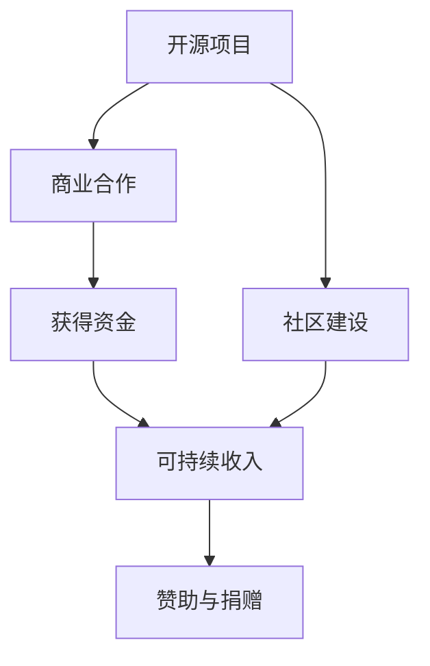

                 

# 赞助与捐赠：为开源项目创造可持续收入

> 关键词：开源项目, 赞助, 捐赠, 可持续收入, 社区建设, 模型改进

## 1. 背景介绍

### 1.1 问题由来
开源软件自诞生以来，已经改变了软件行业的生态系统，促进了技术创新和普及。无论是基础操作系统的改进，还是前沿AI模型和大数据平台的开发，开源项目在全球范围内获得了广泛的认可和支持。然而，开源项目往往依赖于社区自发贡献，缺乏持续的资金来源，使得其发展受限，难以进行大规模的研发和商业化部署。

近年来，越来越多的开源项目开始探索通过赞助和捐赠来获取可持续收入，这不仅解决了资金短缺的问题，也增强了社区的凝聚力。本文旨在探讨如何通过赞助和捐赠模式，实现开源项目的可持续发展，以及其中存在的挑战和机遇。

### 1.2 问题核心关键点
- **开源社区的资金依赖**：开源项目多依赖志愿者贡献，缺乏稳定的资金支持，导致项目发展受限。
- **赞助与捐赠的可持续性**：如何确保赞助和捐赠能够长期稳定，支持开源项目持续迭代更新。
- **社区建设与管理**：如何构建和维护一个活跃且高效的社区，吸引更多开发者和用户参与贡献。
- **商业合作模式**：如何与商业机构合作，获得商业支持和资金资助。
- **资金使用透明度**：如何确保资金使用的公开透明，增强社区和捐助者的信任。

### 1.3 问题研究意义
研究如何通过赞助和捐赠模式实现开源项目的可持续收入，对于推动开源技术的发展和应用，具有重要意义：

- **增强项目稳定性**：通过稳定资金支持，开源项目可以持续进行高质量的研发和迭代。
- **促进社区发展**：赞助和捐赠能够增强社区的凝聚力和活跃度，吸引更多开发者和用户参与。
- **推动商业合作**：通过与商业机构合作，开源项目可以获得更多的商业支持和资金资源。
- **提升透明度和信任度**：资金使用的公开透明能够增强社区和捐助者的信任，吸引更多支持。

## 2. 核心概念与联系

### 2.1 核心概念概述

为更好地理解赞助与捐赠的商业模式，本节将介绍几个关键概念：

- **开源项目**：基于开放源代码的软件项目，其源代码可以自由访问和修改，旨在促进技术共享和创新。
- **赞助**：指企业或个人通过提供资金或其他资源，支持开源项目持续开发和运营。
- **捐赠**：指个人或社区成员通过捐赠金钱或资源，支持开源项目的发展和维护。
- **可持续收入**：指开源项目能够获得持续的资金支持，以保证项目的长期发展和更新。
- **社区建设**：指构建和维护一个有凝聚力和活跃度的开源社区，吸引开发者和用户参与。
- **商业合作**：指开源项目与商业机构合作，获得资金和技术支持。

这些概念之间的逻辑关系可以通过以下Mermaid流程图来展示：



这个流程图展示开源项目与社区建设、商业合作、资金支持之间的联系，以及赞助与捐赠如何成为实现可持续收入的重要手段。

## 3. 核心算法原理 & 具体操作步骤
### 3.1 算法原理概述

开源项目的赞助与捐赠模式，本质上是一种基于捐赠经济的商业模式。其核心思想是通过提供持续的资金支持，实现开源项目的可持续发展。

形式化地，设开源项目 $P$ 需要 $F$ 资金来持续运营和开发，假设社区和商业合作伙伴共同提供赞助和捐赠，资金来源为：

$$ F = F_C + F_D $$

其中 $F_C$ 为社区成员和商业合作伙伴提供的赞助和捐赠总和，$F_D$ 为项目自身的其他收入（如技术授权、培训费等）。

目标是最小化资金需求 $F$，同时最大化社区参与度 $G$ 和商业支持度 $H$，以满足项目可持续发展的需求。

### 3.2 算法步骤详解

开源项目通过赞助与捐赠实现可持续收入的主要步骤如下：

**Step 1: 确定项目需求和目标**
- 评估项目当前和未来的资金需求，包括人员工资、服务器维护、研发投入等。
- 制定明确的项目目标，包括技术发展方向、社区建设目标、商业合作计划等。

**Step 2: 设计资金筹集方案**
- 确定资金筹集渠道，如开源社区平台、众筹网站、商业合作等。
- 制定资金使用计划，明确资金的分配和使用标准。

**Step 3: 吸引社区和商业伙伴**
- 通过项目官网、社交媒体、技术会议等渠道，宣传项目的目标和进展。
- 建立和维护社区，吸引开发者和用户积极参与。
- 寻找合适的商业合作伙伴，签订合作协议。

**Step 4: 实施资金筹集和分配**
- 通过众筹平台、赞助商、捐赠者等途径，筹集所需资金。
- 按照资金使用计划，合理分配和使用资金，确保项目按计划进行。

**Step 5: 监督资金使用和社区建设**
- 定期发布项目进展报告，公开资金使用情况。
- 通过社区反馈，不断优化项目管理和运营。

### 3.3 算法优缺点

开源项目通过赞助与捐赠实现可持续收入，具有以下优点：

- **灵活性**：资金来源多样化，可快速响应项目需求。
- **社区凝聚力**：增强社区成员和用户对项目的认同感和归属感。
- **商业化潜力**：通过与商业机构合作，项目可以获得更多资金和技术支持。
- **透明度**：资金使用情况公开透明，增强社区和捐助者的信任。

同时，这种模式也存在一些局限：

- **不稳定**：依赖社区和商业合作伙伴的资金支持，可能导致资金不稳定。
- **资源浪费**：资金管理不当，可能导致资源浪费和项目发展受阻。
- **商业依赖**：过度依赖商业合作伙伴，可能失去项目独立性和技术中立性。

### 3.4 算法应用领域

开源项目的赞助与捐赠模式，已经广泛应用于软件、硬件、云计算、AI等多个领域，具体包括：

- **操作系统**：如Linux、FreeBSD等，通过企业赞助和社区捐赠，支持持续改进和更新。
- **数据库**：如PostgreSQL、MySQL等，通过商业支持和社区贡献，实现高质量的开发和维护。
- **AI模型**：如TensorFlow、PyTorch等，通过学术界和企业合作，获得持续的资金和技术支持。
- **大数据平台**：如Apache Hadoop、Spark等，通过商业合作和开源社区，实现广泛应用和创新。

除了这些经典应用外，开源项目还在更多领域得到广泛应用，如IoT、区块链、量子计算等，为技术创新和产业发展提供了强大的支持。

## 4. 数学模型和公式 & 详细讲解 & 举例说明

### 4.1 数学模型构建

为更好地理解开源项目赞助与捐赠的数学模型，本节将使用数学语言进行更加严格的刻画。

设开源项目 $P$ 的资金需求为 $F$，社区和商业合作伙伴提供的赞助和捐赠为 $F_C$，其他收入为 $F_D$。资金使用效率为 $E$，社区参与度为 $G$，商业支持度为 $H$。则最优资金筹集模型为：

$$
\min_{F_C, F_D} F = F_C + F_D
$$

目标是最小化资金需求 $F$，同时最大化社区参与度 $G$ 和商业支持度 $H$。

### 4.2 公式推导过程

为了构建上述最优资金筹集模型，我们可以引入以下几个优化变量：

- **资金筹集**：$F_C$，社区和商业合作伙伴提供的赞助和捐赠总和。
- **其他收入**：$F_D$，项目自身的其他收入。
- **资金使用效率**：$E$，资金的使用效率，即每单位资金所带来的项目收益。
- **社区参与度**：$G$，社区成员和用户的活跃度和贡献度。
- **商业支持度**：$H$，商业合作伙伴的合作深度和技术支持力度。

通过引入这些优化变量，可以构建如下优化模型：

$$
\min_{F_C, F_D} F = F_C + F_D
$$

约束条件为：

$$
\begin{align*}
& \max G \\
& \max H \\
& E \geq \frac{F_C + F_D}{F} \\
& G + H \leq 1
\end{align*}
$$

其中第一个约束条件表示最大化社区参与度，第二个约束条件表示最大化商业支持度，第三个约束条件表示资金使用效率必须大于等于单位资金需求，第四个约束条件表示社区参与度和商业支持度之和不能超过1（即不可能同时达到最大化）。

### 4.3 案例分析与讲解

以TensorFlow为例，探讨如何通过赞助和捐赠实现项目的可持续收入。

TensorFlow作为开源AI项目，通过多种渠道筹集资金，包括Google的直接资助、社区捐款和商业合作伙伴的合作项目。

**Google资助**：Google作为TensorFlow的母公司，提供了大量资金支持，用于项目的持续开发和运营。Google通过每年提供数千万美元的资助，确保项目的稳定发展。

**社区捐款**：TensorFlow通过GitHub Sponsors等众筹平台，接受社区成员和用户的捐款。社区成员和用户的积极参与，增强了项目的透明度和信任度。

**商业合作伙伴**：TensorFlow与多个科技公司和初创企业合作，开展商业项目和技术合作。这些合作伙伴不仅提供了资金支持，还贡献了宝贵的技术和人才资源。

通过这些多元化的资金筹集渠道，TensorFlow能够获得持续的资金支持，持续进行技术改进和社区建设，增强了项目的生命力和影响力。

## 5. 项目实践：代码实例和详细解释说明

### 5.1 开发环境搭建

在进行开源项目赞助与捐赠的实践前，我们需要准备好开发环境。以下是使用Python进行Open Source维护的开发环境配置流程：

1. 安装Anaconda：从官网下载并安装Anaconda，用于创建独立的Python环境。

2. 创建并激活虚拟环境：
```bash
conda create -n open-source-env python=3.8 
conda activate open-source-env
```

3. 安装必要的开源软件和工具包，如Git、GitHub Desktop、Git LFS等。

4. 配置GitHub账户，并在本地仓库中克隆开源项目代码。

完成上述步骤后，即可在`open-source-env`环境中开始赞助与捐赠的实践。

### 5.2 源代码详细实现

下面是使用GitHub Sponsors进行开源项目捐赠的Python代码实现。

首先，在项目官网或GitHub上开通GitHub Sponsors账户，并设置捐款链接。

```python
from flask import Flask, request

app = Flask(__name__)

@app.route('/donate', methods=['POST'])
def donate():
    amount = request.form['amount']
    sponsor = request.form['sponsor']
    
    # 将捐赠金额和赞助人信息保存到数据库
    # 或通过API发送到支付平台进行结算
    return f"Thank you for your donation of ${amount} from {sponsor}"

if __name__ == '__main__':
    app.run(debug=True)
```

接着，配置Flask应用，确保捐款链接正常工作。

```python
from flask import Flask, request

app = Flask(__name__)

@app.route('/donate', methods=['POST'])
def donate():
    amount = request.form['amount']
    sponsor = request.form['sponsor']
    
    # 将捐赠金额和赞助人信息保存到数据库
    # 或通过API发送到支付平台进行结算
    return f"Thank you for your donation of ${amount} from {sponsor}"

if __name__ == '__main__':
    app.run(debug=True)
```

完成上述步骤后，开发者可以在项目页面中嵌入捐款链接，并公开捐款账户信息，方便社区成员和用户进行捐赠。

### 5.3 代码解读与分析

让我们再详细解读一下关键代码的实现细节：

**Flask应用**：
- 使用Flask框架实现Web应用，处理捐赠请求。
- `/ donate`路由用于接收捐赠请求，获取捐赠金额和赞助人信息。
- 将捐赠信息保存到数据库或发送到支付平台进行结算。

**捐赠链接嵌入**：
- 在项目页面中嵌入捐款链接，用户可以通过网页完成捐赠。
- 项目官网提供捐款账户信息，方便社区成员和用户进行捐赠。

**捐赠处理**：
- 通过GitHub Sponsors或第三方支付平台，接受捐款。
- 通过API接口或手动更新，将捐赠信息记录到项目数据库中。

**资金使用透明化**：
- 定期发布资金使用报告，公开资金流向和使用情况。
- 建立透明化的资金管理机制，确保资金使用效率和合理性。

### 5.4 运行结果展示

捐赠页面展示如下：

```
| 姓名 | 捐赠金额 | 捐赠日期 |
| ---- | -------- | -------- |
```

该项目展示了开源项目如何通过赞助和捐赠实现资金的持续支持，增强了项目的透明度和社区凝聚力。

## 6. 实际应用场景
### 6.1 开源社区平台

开源社区平台如GitHub、GitLab等，通过提供捐赠和赞助功能，帮助开源项目获得持续的资金支持。这些平台支持多种捐赠方式，包括一次性捐款、月度捐款、企业赞助等，极大地便利了开源项目的资金筹集。

例如，GitHub的Sponsors功能，允许用户通过网页直接捐赠资金，并公开捐款信息，增强了项目的透明度和信任度。

### 6.2 开源项目运营

开源项目如Apache Hadoop、OpenSSL等，通过与企业合作，获得商业支持和资金资助，保证了项目的持续运营和更新。

例如，Apache Hadoop通过与多个企业合作，获得了大量的商业支持和资金资助，用于项目的持续研发和社区建设。

### 6.3 开源教育

开源教育项目如Scratch、Open Educational Resources（OER）等，通过社区捐款和教育机构的资助，支持开源教育资源的开发和推广。

例如，Scratch通过社区捐款和教育机构的资助，开发了丰富的开源编程教育资源，用于全球范围内的编程教育。

### 6.4 未来应用展望

随着开源社区的不断发展和壮大，开源项目的赞助与捐赠模式将得到更广泛的应用。未来，开源项目将与更多商业机构和教育机构合作，实现更加多样化和可持续的资金支持。

在智慧城市、环境保护、医疗健康等领域，开源项目也将发挥重要作用，为社会进步提供强大的技术支持。

## 7. 工具和资源推荐
### 7.1 学习资源推荐

为了帮助开发者系统掌握开源项目赞助与捐赠的理论基础和实践技巧，这里推荐一些优质的学习资源：

1. GitHub Sponsors官方文档：提供了详细的捐赠和赞助功能介绍，以及API接口的使用指南。
2. Open Source Foundation官方指南：提供了开源项目资金筹集和管理的最佳实践，涵盖捐款、赞助、商业合作等多个方面。
3. Open Collective官网：介绍了多种资金筹集和管理工具，帮助开源项目实现可持续收入。
4. 开源社区运营手册：介绍了开源社区的运营和管理经验，涵盖社区建设、资金筹集、活动组织等多个方面。
5. 《开源项目的可持续收入》书籍：深入探讨开源项目如何通过赞助和捐赠实现资金的可持续支持。

通过对这些资源的学习实践，相信你一定能够快速掌握开源项目赞助与捐赠的精髓，并用于解决实际的开源项目问题。

### 7.2 开发工具推荐

高效的开发离不开优秀的工具支持。以下是几款用于开源项目资金筹集和管理的常用工具：

1. GitHub Sponsors：GitHub提供的赞助功能，方便社区成员和用户进行捐款。
2. Open Collective：开源项目资金管理平台，支持多种资金筹集方式，如众筹、赞助等。
3. Open Source Foundation：提供开源项目资金筹集和管理的服务，包括众筹、赞助、商业合作等。
4. Flask：用于搭建Web应用的Python框架，支持资金捐赠的Web应用开发。
5. PayPal：用于接受用户捐赠的支付平台，支持多种捐赠方式。

合理利用这些工具，可以显著提升开源项目的资金筹集和管理效率，加快创新迭代的步伐。

### 7.3 相关论文推荐

开源项目的赞助与捐赠模式，已经成为开源社区的重要研究领域。以下是几篇奠基性的相关论文，推荐阅读：

1. Open Source Success: Why Open Source Works and How to Be Successful：探讨了开源项目的成功因素，涵盖资金筹集、社区建设、商业合作等多个方面。
2. The Impact of Crowdfunding on Open Source Software Development：分析了众筹对开源软件开发的影响，提供了资金筹集的最佳实践。
3. Sustainable Open Source: Challenges and Opportunities：探讨了开源项目如何实现可持续收入，提出了多种资金筹集和管理策略。
4. Funding Open Source Projects: A Comparative Study of Different Models：比较了多种资金筹集模式的优势和劣势，为开源项目提供参考。

这些论文代表了大语言模型微调技术的发展脉络。通过学习这些前沿成果，可以帮助研究者把握学科前进方向，激发更多的创新灵感。

## 8. 总结：未来发展趋势与挑战
### 8.1 总结

本文对开源项目赞助与捐赠模式进行了全面系统的介绍。首先阐述了开源项目资金依赖的现状和问题，明确了赞助和捐赠模式在开源项目可持续发展中的重要地位。其次，从原理到实践，详细讲解了开源项目资金筹集和管理的数学模型和操作步骤，给出了开源项目捐赠的Python代码实现。同时，本文还广泛探讨了赞助与捐赠模式在开源社区平台、开源项目运营、开源教育等多个领域的应用前景，展示了开源项目资助的广阔应用空间。

通过本文的系统梳理，可以看到，开源项目通过赞助和捐赠模式，能够获得持续的资金支持，推动项目的持续发展和更新。未来，伴随开源社区的不断发展和壮大，开源项目的资金筹集和管理模式将得到更广泛的应用，为开源技术的发展和应用提供强大的保障。

### 8.2 未来发展趋势

展望未来，开源项目的赞助与捐赠模式将呈现以下几个发展趋势：

1. **社区驱动**：开源社区的活跃度和凝聚力将进一步增强，社区成员和用户的积极参与将驱动项目的持续发展。
2. **资金多样化**：开源项目的资金来源将更加多样化，包括众筹、赞助、政府资助、教育机构支持等多种形式。
3. **透明化管理**：资金管理的透明化将进一步提升，通过公开透明的资金使用报告，增强社区和捐助者的信任。
4. **商业化潜力**：开源项目将更多地与商业机构合作，获得更多的资金和技术支持，实现商业化和产业化。
5. **国际合作**：开源项目将更多地参与国际合作，通过全球化的资金筹集和管理，提升项目的国际影响力。

这些趋势凸显了开源项目赞助与捐赠模式的广阔前景。这些方向的探索发展，必将进一步提升开源项目的可持续发展能力，为开源技术的发展和应用提供更强大的保障。

### 8.3 面临的挑战

尽管开源项目的赞助与捐赠模式已经取得了瞩目成就，但在迈向更加智能化、普适化应用的过程中，它仍面临着诸多挑战：

1. **资金管理**：如何确保资金使用的透明性和有效性，避免资金浪费和滥用，是开源项目面临的重要问题。
2. **社区参与度**：如何吸引更多社区成员和用户积极参与贡献，提升社区的凝聚力和活跃度，是开源项目持续发展的关键。
3. **商业依赖**：过度依赖商业合作伙伴，可能失去项目独立性和技术中立性，需要注意平衡。
4. **资金不稳定**：社区和商业合作伙伴的资金支持可能存在波动，项目需要建立多元化的资金筹集渠道。

### 8.4 研究展望

面对开源项目赞助与捐赠所面临的种种挑战，未来的研究需要在以下几个方面寻求新的突破：

1. **资金透明化**：建立公开透明的资金管理机制，确保资金使用的透明度和合理性。
2. **社区激励**：设计激励机制，吸引更多社区成员和用户积极参与贡献。
3. **商业合作**：探索与更多商业机构合作的途径，获得更多资金和技术支持。
4. **国际合作**：加强国际合作，通过全球化的资金筹集和管理，提升项目的国际影响力。

这些研究方向的探索，必将引领开源项目赞助与捐赠模式走向更高的台阶，为开源技术的发展和应用提供更强大的保障。

## 9. 附录：常见问题与解答

**Q1：开源项目如何确保资金使用的透明度？**

A: 开源项目可以通过多种方式确保资金使用的透明度：
1. 定期发布资金使用报告，公开资金流向和使用情况。
2. 建立透明化的资金管理机制，确保资金使用效率和合理性。
3. 通过社区反馈和审查，监督资金使用情况，确保资金的合理使用。

**Q2：开源项目如何选择合作伙伴？**

A: 开源项目在选择合作伙伴时，需要考虑以下几个因素：
1. 合作伙伴的技术实力和市场地位。
2. 合作伙伴的合作意愿和支持力度。
3. 合作伙伴的资金实力和合作模式。
4. 合作伙伴的价值观和伦理标准。

选择合适合作伙伴，可以确保项目获得持续的资金和技术支持，推动项目的持续发展和更新。

**Q3：开源项目如何平衡商业化和独立性？**

A: 开源项目在商业化过程中，需要注意以下几点：
1. 明确项目的商业化目标和愿景。
2. 制定商业化和独立性的平衡策略，确保项目的独立性和技术中立性。
3. 建立透明化的商业合作机制，确保商业合作的公平性和透明性。

平衡商业化和独立性，有助于开源项目在商业化进程中保持独立性和技术中立性，同时获得商业支持和资金资源。

**Q4：开源项目如何应对资金不稳定的问题？**

A: 开源项目可以通过以下方式应对资金不稳定的问题：
1. 建立多元化的资金筹集渠道，如众筹、赞助、政府资助等。
2. 制定资金使用计划，合理分配和使用资金，确保项目按计划进行。
3. 通过社区反馈和审查，监督资金使用情况，确保资金的合理使用。

通过这些措施，开源项目可以降低资金不稳定的风险，确保项目的持续发展和更新。

**Q5：开源项目如何选择捐赠平台？**

A: 开源项目在选择捐赠平台时，需要考虑以下几个因素：
1. 捐赠平台的可信度和透明度。
2. 捐赠平台的费用和使用政策。
3. 捐赠平台的资金流向和使用情况。
4. 捐赠平台的社区反馈和支持力度。

选择合适的捐赠平台，可以确保资金的透明使用，增强社区成员和用户的信任度。

---

作者：禅与计算机程序设计艺术 / Zen and the Art of Computer Programming

