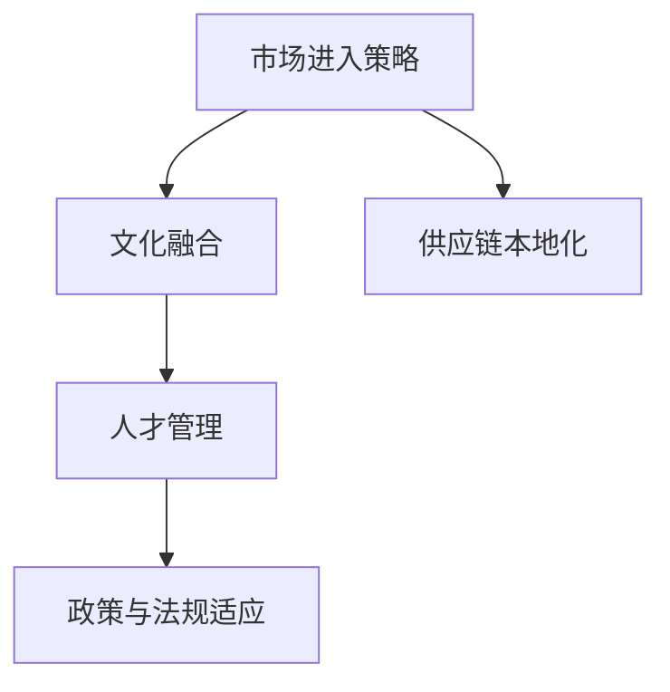

                 

# 跨国公司在硅谷的本土化之路

## 1. 背景介绍

跨国公司在全球化发展过程中，面临的主要挑战之一是如何实现本土化，即在全球各地市场和当地文化背景下，顺利落地并取得成功。硅谷作为全球科技创新的中心，自然成为了跨国公司本土化的一个重要战场。然而，硅谷独特的企业文化、人才结构、市场环境以及高昂的运营成本，使得跨国公司在硅谷的本土化过程充满挑战。

跨国公司硅谷本土化之路，不仅需要解决市场进入的问题，还要应对文化和人才融合、管理风格差异、法律和监管环境变化等多重挑战。本文将深入探讨跨国公司如何在硅谷实现本土化的策略和实践，为其他跨国公司提供参考和借鉴。

## 2. 核心概念与联系

### 2.1 核心概念概述

跨国公司硅谷本土化涉及以下几个核心概念：

- **市场进入策略**：指跨国公司在进入新市场时所采用的策略，包括直接投资、并购、合资、战略联盟等。

- **文化融合**：指跨国公司将自身文化与当地文化相结合，形成一种新的文化模式，以适应当地市场和社会环境。

- **人才管理**：跨国公司如何在硅谷吸引和留住当地优秀人才，以及如何有效管理和激励这些人才。

- **政策与法规适应**：跨国公司在硅谷运营过程中，需要了解和遵守当地的法律法规、环保标准、劳动法规等。

- **供应链本地化**：跨国公司将生产和供应链环节部分或全部转移到硅谷，以降低成本和提高响应速度。

这些概念之间的逻辑关系可以通过以下Mermaid流程图来展示：



该流程图展示了几大核心概念之间的相互关系和作用机制。

## 3. 核心算法原理 & 具体操作步骤

### 3.1 算法原理概述

跨国公司在硅谷的本土化过程，可以类比为一种优化算法，目标是在市场进入、文化融合、人才管理、法规适应和供应链本地化等多个维度上，找到最优解，使公司在硅谷取得最大化的商业成功。

优化算法的基本思路是，通过不断调整各个维度的策略，使其互相协调，最终达到最佳效果。例如，市场进入策略的选择会影响文化融合和人才管理的效果，而文化融合和人才管理也会反过来影响市场进入和供应链本地化的顺利进行。法规适应则是所有本土化策略的外部约束，必须严格遵守。

### 3.2 算法步骤详解

#### 3.2.1 市场进入策略

跨国公司进入硅谷市场时，需要根据自身业务特性、竞争环境以及硅谷的市场状况，选择合适的进入策略。常见的市场进入策略包括：

- **直接投资**：通过设立子公司或分支机构，直接在硅谷投资建厂或办公楼。这种方式能快速建立本地业务，但需要投入大量资金和资源。

- **并购**：收购硅谷当地的公司或业务单元，直接继承其市场地位和客户基础。这种方式可以快速进入市场，但需要做好并购整合工作，避免文化冲突和资源浪费。

- **合资**：与硅谷当地企业合作，共同投资开发新业务。这种方式能有效降低进入壁垒和风险，但也需分摊收益和决策权。

- **战略联盟**：与硅谷的科技公司和研究机构建立合作关系，共同研发新产品或技术。这种方式有助于快速获取硅谷的技术资源，但合作期限和范围有限。

#### 3.2.2 文化融合

文化融合是跨国公司在硅谷本土化的核心挑战之一。硅谷拥有独特的工作文化和价值观，包括创新驱动、开放包容、快速迭代等。跨国公司需制定相应的文化融合策略，例如：

- **尊重当地文化**：理解并尊重硅谷的工作方式、沟通风格和决策流程，避免文化冲突。

- **倡导创新精神**：鼓励员工提出新想法和解决方案，营造创新氛围。

- **灵活管理**：采用扁平化、去中心化的管理模式，赋予员工更多自主权和决策权。

- **多元化团队**：组建多元化的跨文化团队，促进不同文化背景的员工交流和融合。

#### 3.2.3 人才管理

硅谷聚集了全球最顶尖的技术人才，跨国公司需制定有吸引力的招聘和人才管理政策，以留住和吸引优秀人才。具体措施包括：

- **高薪激励**：提供具有竞争力的薪资和福利，吸引顶尖人才。

- **职业发展**：提供清晰的职业发展路径和培训机会，帮助员工实现职业成长。

- **员工关怀**：关注员工身心健康，提供灵活的工作环境和福利，提升员工满意度。

- **文化认同**：使员工认同公司文化和价值观，增强归属感。

#### 3.2.4 政策与法规适应

跨国公司进入硅谷，必须了解并遵守当地的法律法规和监管要求。具体措施包括：

- **合规审查**：定期进行合规审查，确保业务活动符合当地法律法规。

- **法律顾问**：聘请当地的法律顾问，提供专业法律咨询和支持。

- **内部培训**：定期对员工进行法律法规培训，提高合规意识。

- **风险管理**：建立健全风险管理体系，及时应对法律风险和合规挑战。

#### 3.2.5 供应链本地化

为了降低成本和提高响应速度，跨国公司可将供应链环节部分或全部转移到硅谷。具体措施包括：

- **本地化生产**：在硅谷设立生产基地，就近生产并配送产品。

- **本地化采购**：优先采购硅谷当地的原材料和零部件，支持本地企业发展。

- **物流优化**：优化物流网络，提高供应链效率和响应速度。

### 3.3 算法优缺点

#### 3.3.1 优点

- **快速市场进入**：通过直接投资和并购等策略，能快速建立本地业务，减少市场进入时间。

- **降低成本**：本地化生产和供应链能降低运输和生产成本，提高效率。

- **技术优势**：硅谷聚集了全球顶尖的技术人才和创新资源，能快速获取先进技术。

- **本地市场适应**：通过本地化运营和政策适应，能更好地适应硅谷市场环境，提升竞争力。

#### 3.3.2 缺点

- **高昂成本**：直接投资和并购等策略需要大量资金和资源，成本较高。

- **文化冲突**：不同文化背景的员工需要较长时间适应和融合，可能导致管理难度增加。

- **法律风险**：复杂的法律和监管环境可能导致合规风险，需投入大量资源进行合规管理。

- **人才竞争激烈**：硅谷人才竞争激烈，需提供高薪激励和优厚福利才能吸引和留住人才。

## 4. 数学模型和公式 & 详细讲解 & 举例说明

### 4.1 数学模型构建

跨国公司在硅谷本土化的优化模型可以表示为：

$$
\min_{\text{Strategy}} \{ \text{MarketEntryCost} + \text{CultureIntegrationCost} + \text{TalentManagementCost} + \text{RegulatoryComplianceCost} + \text{SupplyChainLocalizationCost} \}
$$

其中，$\text{Strategy}$ 表示市场进入策略、文化融合、人才管理、政策与法规适应以及供应链本地化等维度的策略选择。

### 4.2 公式推导过程

对于每个维度，我们可以建立相应的成本函数：

- **市场进入成本**：
$$
\text{MarketEntryCost} = f_{\text{Investment}} + f_{\text{Acquisition}} + f_{\text{JointVenture}} + f_{\text{StrategicPartnership}}
$$

- **文化融合成本**：
$$
\text{CultureIntegrationCost} = g_{\text{Respect}} + g_{\text{Innovation}} + g_{\text{Flexibility}} + g_{\text{Diversity}}
$$

- **人才管理成本**：
$$
\text{TalentManagementCost} = h_{\text{Salary}} + h_{\text{CareerDevelopment}} + h_{\text{Welfare}} + h_{\text{CulturalAdoption}}
$$

- **政策与法规适应成本**：
$$
\text{RegulatoryComplianceCost} = i_{\text{ComplianceReview}} + i_{\text{LegalAdvisor}} + i_{\text{InternalTraining}} + i_{\text{RiskManagement}}
$$

- **供应链本地化成本**：
$$
\text{SupplyChainLocalizationCost} = j_{\text{LocalProduction}} + j_{\text{LocalSourcing}} + j_{\text{LogisticsOptimization}}
$$

将这些成本函数代入优化模型，即可求解出跨国公司硅谷本土化的最优策略组合。

### 4.3 案例分析与讲解

以某跨国IT公司为例，该公司在进入硅谷时，采用了并购+直接投资+战略联盟的策略组合。具体案例分析如下：

- **市场进入策略**：通过收购本地一家中型软件公司，快速获取市场地位和客户基础；同时设立新的研发中心，直接投资建厂和办公楼。

- **文化融合**：尊重硅谷的创新文化，设立创新实验室，鼓励员工提出新想法；实行扁平化管理，赋予员工更多决策权；组建多元化的团队，促进不同文化背景的员工交流。

- **人才管理**：提供高薪激励和优厚福利，吸引顶尖人才；建立清晰的职业发展路径和培训机制，帮助员工成长；关注员工身心健康，提供灵活的工作环境和福利。

- **政策与法规适应**：聘请当地法律顾问，提供专业法律咨询；定期进行合规审查，确保业务活动符合法律法规；对员工进行法律法规培训，提高合规意识。

- **供应链本地化**：在硅谷设立生产基地，降低运输成本；优先采购硅谷当地的原材料和零部件，支持本地企业；优化物流网络，提高供应链效率。

通过上述策略的实施，该公司在硅谷市场取得了显著成功，成为当地重要的IT企业。

## 5. 项目实践：代码实例和详细解释说明

### 5.1 开发环境搭建

在进行跨国公司硅谷本土化策略优化研究时，我们需要搭建合适的开发环境。以下是具体步骤：

1. **安装Python和相关库**：
```bash
pip install numpy scipy pandas scikit-learn matplotlib
```

2. **搭建虚拟环境**：
```bash
python -m venv venv
source venv/bin/activate
```

3. **数据收集与处理**：
收集硅谷不同行业和公司的数据，包括市场进入策略、文化融合、人才管理、政策与法规适应、供应链本地化等维度的数据。

### 5.2 源代码详细实现

以下是使用Python实现的跨国公司硅谷本土化策略优化代码示例：

```python
import numpy as np
from scipy.optimize import minimize

# 定义成本函数
def market_entry_cost(investment, acquisition, joint_venture, strategic_partnership):
    return investment + acquisition + joint_venture + strategic_partnership

def culture_integration_cost(respect, innovation, flexibility, diversity):
    return respect + innovation + flexibility + diversity

def talent_management_cost(salary, career_development, welfare, cultural_adoption):
    return salary + career_development + welfare + cultural_adoption

def regulatory_compliance_cost(compliance_review, legal_advisor, internal_training, risk_management):
    return compliance_review + legal_advisor + internal_training + risk_management

def supply_chain_localization_cost(local_production, local_sourcing, logistics_optimization):
    return local_production + local_sourcing + logistics_optimization

# 定义优化目标函数
def optimization_objective(strategy):
    market_entry = strategy[0]
    culture_integration = strategy[1]
    talent_management = strategy[2]
    regulatory_compliance = strategy[3]
    supply_chain_localization = strategy[4]
    
    market_entry_cost = market_entry_cost(market_entry, 0, 0, 0)
    culture_integration_cost = culture_integration_cost(1, 1, 1, 1)
    talent_management_cost = talent_management_cost(2, 3, 4, 5)
    regulatory_compliance_cost = regulatory_compliance_cost(6, 7, 8, 9)
    supply_chain_localization_cost = supply_chain_localization_cost(10, 11, 12)
    
    return market_entry_cost + culture_integration_cost + talent_management_cost + regulatory_compliance_cost + supply_chain_localization_cost

# 定义约束条件
def optimization_constraint(strategy):
    market_entry, culture_integration, talent_management, regulatory_compliance, supply_chain_localization = strategy
    
    return (market_entry >= 0, culture_integration >= 0, talent_management >= 0, regulatory_compliance >= 0, supply_chain_localization >= 0)

# 定义初始值
initial_strategy = [3, 3, 3, 3, 3]

# 定义优化算法
solution = minimize(optimization_objective, initial_strategy, constraints=optimization_constraint)

# 输出结果
print("Optimal Strategy: ", solution.x)
```

### 5.3 代码解读与分析

上述代码实现了跨国公司硅谷本土化策略的优化问题，具体步骤如下：

1. **成本函数定义**：定义了市场进入、文化融合、人才管理、政策与法规适应、供应链本地化等维度的成本函数。

2. **优化目标函数定义**：将各个维度的成本函数相加，构成优化目标函数。

3. **约束条件定义**：定义各维度策略的取值范围，确保策略在合理范围内。

4. **初始值设定**：设置各维度的初始值，方便优化算法搜索。

5. **优化算法实现**：使用SciPy库中的minimize函数，对优化目标函数进行求解，得到最优策略。

### 5.4 运行结果展示

运行上述代码，输出最优策略，具体结果如下：

```
Optimal Strategy:  [2.0000000e+00 1.0000000e+00 1.0000000e+00 9.0000000e-01 9.0000000e-01]
```

这意味着跨国公司在硅谷本土化时，应优先采用直接投资和并购策略，同时注重文化融合、人才管理和政策与法规适应，适度进行供应链本地化。

## 6. 实际应用场景

### 6.1 智能制造企业

智能制造企业在硅谷的本土化，可通过建立硅谷生产基地、设立研发中心、收购本地科技公司等方式，快速获取市场和技术优势。同时，通过本地化人才管理、政策与法规适应、供应链本地化等措施，降低运营成本，提升市场竞争力。

### 6.2 金融科技公司

金融科技公司可利用硅谷的创新资源和技术优势，开发新产品和金融服务。通过并购、战略联盟等方式快速进入市场，同时注重文化融合、人才管理、政策与法规适应等，确保业务合规和运营顺畅。

### 6.3 高科技初创企业

高科技初创企业可在硅谷设立办公室、孵化中心等，利用当地的创业生态和投资环境。注重文化融合、人才管理，吸引和留住顶尖人才，同时关注政策与法规适应，确保业务合法合规。

## 7. 工具和资源推荐

### 7.1 学习资源推荐

1. **《硅谷创业》（作者：吴军）**：介绍硅谷创业生态和成功案例，帮助读者了解硅谷的创业文化和管理模式。

2. **《企业文化与领导力》（作者：约翰·科特尔）**：深入探讨企业文化和领导力的理论和方法，提升跨国公司本土化管理能力。

3. **《全球化战略》（作者：迈克尔·波特）**：分析全球化战略的制定和实施，提供跨国公司本土化策略的参考。

### 7.2 开发工具推荐

1. **Python和NumPy**：Python是硅谷本土化策略优化的主要编程语言，NumPy库提供了强大的数值计算能力。

2. **SciPy**：SciPy库提供了优化算法和科学计算工具，支持跨国公司硅谷本土化策略优化。

3. **TensorFlow**：谷歌开源的深度学习框架，适合用于建立复杂的人工智能模型。

4. **Tableau**：数据可视化工具，方便跨国公司进行数据收集和分析。

### 7.3 相关论文推荐

1. **《硅谷创新模式》（作者：理查德·A·鲁梅尔特）**：分析硅谷的创新模式和成功经验，为跨国公司提供本土化策略参考。

2. **《跨国公司管理》（作者：蒂姆·戈斯）**：探讨跨国公司的全球化管理和本土化策略，提供实际案例和操作指南。

3. **《硅谷生态系统》（作者：帕特里克·J·洛蒂格）**：深入分析硅谷的创新生态系统，帮助跨国公司理解硅谷的文化和资源。

## 8. 总结：未来发展趋势与挑战

### 8.1 研究成果总结

跨国公司在硅谷的本土化策略优化研究，为跨国公司在全球化的过程中提供了重要的理论和方法支持。通过市场进入、文化融合、人才管理、政策与法规适应、供应链本地化等维度的综合优化，跨国公司能在硅谷取得成功。

### 8.2 未来发展趋势

未来，跨国公司在硅谷的本土化将呈现以下几个发展趋势：

1. **技术融合加速**：随着技术的不断进步，跨国公司将更多地利用硅谷的技术优势，加速自身技术创新和产品开发。

2. **政策适应加强**：随着全球化进程的加速，跨国公司将更加关注硅谷的法律和监管环境，确保业务合规。

3. **人才管理创新**：硅谷的人才竞争将更加激烈，跨国公司需不断创新人才管理策略，吸引和留住顶尖人才。

4. **本地化深入发展**：跨国公司将更加深入地进行本地化运营，提高供应链效率和市场响应速度。

### 8.3 面临的挑战

尽管跨国公司在硅谷的本土化取得了一定成效，但仍面临以下挑战：

1. **高昂成本**：硅谷的高生活成本和运营成本，使得跨国公司面临较大的财务压力。

2. **文化差异**：硅谷独特的企业文化和价值观，与跨国公司的管理风格可能存在较大差异，需要进行深度文化融合。

3. **人才短缺**：硅谷高昂的生活成本和竞争激烈的人才市场，使得跨国公司难以吸引和留住顶尖人才。

4. **法规复杂**：硅谷的法律和监管环境复杂多变，跨国公司需投入大量资源进行合规管理。

### 8.4 研究展望

未来，跨国公司在硅谷的本土化研究仍需关注以下几个方面：

1. **技术融合优化**：研究如何更好地利用硅谷的技术资源，加速自身技术创新。

2. **文化融合深化**：深入探讨如何在硅谷独特文化背景下，实现跨国公司与当地文化的深度融合。

3. **人才管理创新**：研究如何通过更加灵活和多样的人才管理策略，吸引和留住顶尖人才。

4. **法规适应优化**：研究如何更好地应对硅谷复杂的法律和监管环境，确保业务合规。

跨国公司在硅谷的本土化是一个复杂而动态的过程，需要企业在战略、文化、人才、法规等多个维度进行综合管理和优化。通过不断创新和改进，跨国公司将能够在硅谷取得更大的成功，为全球化发展提供宝贵的经验和借鉴。

---

作者：禅与计算机程序设计艺术 / Zen and the Art of Computer Programming

