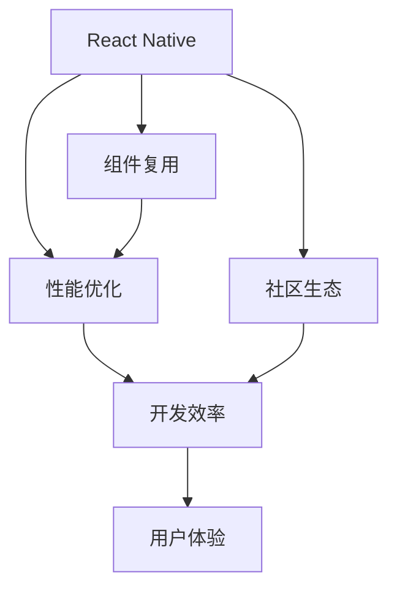

                 

# 跨平台移动开发：React Native vs Flutter

> 关键词：React Native, Flutter, 跨平台开发, JavaScript, Dart, 性能优化, 社区生态

## 1. 背景介绍

随着移动设备的普及，移动应用程序的开发需求愈发旺盛。然而，iOS和Android两个平台各自拥有庞大的用户基础和复杂的应用生态，使得跨平台移动应用开发成为一个重要且具有挑战性的任务。过去，使用原生开发需要分别学习和维护两种不同的技术栈，不仅耗时耗力，且开发效率较低。为此，各种跨平台开发框架应运而生，其中以React Native和Flutter最为知名。

### 1.1 问题由来
移动应用的跨平台开发旨在通过一次开发，适配到iOS和Android两大平台，避免重复开发和维护。React Native和Flutter两大框架各有优势，吸引了不少开发者采用。因此，本文将对比这两大框架的核心优势和劣势，为开发者提供全面的评估依据。

### 1.2 问题核心关键点
比较React Native和Flutter的核心在于：
1. **性能**：框架提供的跨平台性能，包括启动速度、动画、渲染效率等。
2. **开发效率**：开发者使用框架的便捷程度，如组件复用、开发工具、代码维护等。
3. **生态系统**：第三方库和工具的丰富度，社区的活跃度。
4. **社区支持**：官方文档、用户反馈、问题解决速度等。
5. **平台支持**：是否支持多种平台和版本，官方更新频率等。

本文将围绕这些关键点，全面评估React Native和Flutter。

## 2. 核心概念与联系

### 2.1 核心概念概述

为了更好地理解React Native和Flutter，首先介绍几个关键概念：

- **React Native**：Facebook开发的跨平台移动开发框架，使用JavaScript语言，基于React框架构建。React Native将iOS和Android平台的UI组件转换为Web技术，提供类似原生的用户体验。
- **Flutter**：Google开发的跨平台移动开发框架，使用Dart语言，基于GPU加速渲染引擎，提供高性能的UI和动画效果。
- **跨平台开发**：在iOS和Android平台共用一套代码基础，通过框架实现跨平台应用开发，减少开发成本，提高开发效率。

- **组件复用**：跨平台开发框架允许开发者在一个平台上编写的代码在另一个平台上复用，减少重复工作。
- **性能优化**：在移动设备上提供流畅的交互体验，需要优化渲染性能、网络请求、内存管理等。
- **社区生态**：开发者社区提供的第三方库和工具，以及社区活跃度，影响开发效率和问题解决能力。

这些核心概念通过以下Mermaid流程图展示其联系：



此图展示了React Native和Flutter的核心组件和它们之间的关联。开发效率、性能和用户体验与组件复用、性能优化和社区生态息息相关。

## 3. 核心算法原理 & 具体操作步骤
### 3.1 算法原理概述

React Native和Flutter的核心算法原理都是基于桥接技术实现的。桥接技术允许开发者在一个平台上开发的代码，通过框架在另一个平台上运行。两者在原理上基本相同，但在具体实现上有较大差异。

### 3.2 算法步骤详解

#### React Native算法步骤
1. **组件桥接**：使用React Native的桥接技术，将React组件转换为原生组件。
2. **样式桥接**：将React的样式和布局转换为原生系统的样式和布局。
3. **事件处理**：处理跨平台事件，如点击、滚动等。
4. **热更新**：通过桥接技术实现组件、样式、事件等的动态更新，减少热重载时间。

#### Flutter算法步骤
1. **代码编译**：使用Dart语言编写代码，通过Flutter编译器编译为机器码或字节码。
2. **渲染引擎**：使用Skia绘图引擎，结合GPU加速，提供高性能的UI渲染。
3. **组件库**：提供丰富的UI组件库，支持自定义组件。
4. **热重载**：通过Dart编译器优化，实现快速热重载。

### 3.3 算法优缺点

#### React Native优缺点

**优点**：
- **生态丰富**：React Native基于React社区，拥有丰富的第三方库和工具。
- **跨平台复用**：JavaScript生态成熟，易于学习和使用。
- **热更新**：React Native热更新机制，支持快速迭代开发。

**缺点**：
- **性能表现**：相对于原生开发，性能稍逊一筹，尤其在动画和渲染方面。
- **API复杂**：Bridge桥接机制导致API复杂，开发者需要学习原生开发的相关知识。
- **内存管理**：桥接机制需要管理跨平台数据和状态，内存管理复杂。

#### Flutter优缺点

**优点**：
- **性能优越**：Dart语言编译速度快，GPU加速渲染，性能表现优秀。
- **组件丰富**：Material Design风格设计，丰富的UI组件库。
- **代码结构清晰**：Dart语言简洁，代码结构清晰，易于维护。

**缺点**：
- **生态不足**：Flutter社区相对较小，第三方库和工具相对较少。
- **学习曲线高**：Dart语言是Flutter特有语言，学习曲线较高。
- **热重载**：热重载虽然速度快，但不如React Native的热更新机制方便。

### 3.4 算法应用领域

React Native适用于需要快速迭代、生态丰富的应用场景，如新闻聚合、社交网络、电商应用等。它的热更新机制使其在频繁更新的应用场景中尤为出色。

Flutter适用于对性能要求较高的应用场景，如AR/VR、游戏、绘图应用等。它的高性能和丰富的UI组件库，使其在这些场景中具有明显优势。

## 4. 数学模型和公式 & 详细讲解 & 举例说明
### 4.1 数学模型构建

#### React Native的性能模型
设 $R$ 为React Native应用性能指标，包括启动时间、渲染帧率等。$S$ 为样式桥接时间，$E$ 为事件处理时间，$C$ 为热更新时间。则性能模型可以表示为：

$$
R = f(S, E, C)
$$

#### Flutter的性能模型
设 $F$ 为Flutter应用性能指标，包括启动时间、渲染帧率等。$C$ 为代码编译时间，$D$ 为渲染引擎处理时间，$H$ 为热重载时间。则性能模型可以表示为：

$$
F = f(C, D, H)
$$

### 4.2 公式推导过程

- **React Native的样式桥接**：
  设 $S_t$ 为桥接一个组件所需的平均时间，$N$ 为组件总数，则桥接总时间为 $S = \sum_{i=1}^N S_i$。

- **Flutter的代码编译**：
  设 $C_t$ 为编译一个Dart文件所需的平均时间，$M$ 为文件总数，则编译总时间为 $C = \sum_{i=1}^M C_i$。

### 4.3 案例分析与讲解

#### React Native案例
假设React Native应用包含1000个组件，桥接每个组件平均耗时1毫秒，则桥接总时间为 $S = 1 \times 1000 = 1000$ 毫秒。如果事件处理和热更新时间可以忽略不计，则应用的启动时间主要取决于样式桥接时间。

#### Flutter案例
假设Flutter应用包含1000个组件，编译每个文件平均耗时2毫秒，则编译总时间为 $C = 2 \times 1000 = 2000$ 毫秒。如果渲染引擎处理时间和热重载时间可以忽略不计，则应用的启动时间主要取决于代码编译时间。

## 5. 项目实践：代码实例和详细解释说明
### 5.1 开发环境搭建

使用React Native和Flutter开发移动应用，需要先搭建开发环境。以下以React Native为例，介绍开发环境搭建步骤：

1. **安装Node.js和npm**：从官网下载安装包，安装后配置环境变量。
2. **安装React Native CLI**：使用npm安装React Native CLI，`npm install -g react-native-cli`。
3. **配置Android和iOS开发环境**：安装Android Studio和Xcode，创建新的项目工程。
4. **安装依赖**：使用npm安装React Native的依赖包，`npm install`。
5. **运行应用**：通过React Native CLI运行应用，`react-native run-android`或`react-native run-ios`。

### 5.2 源代码详细实现

**React Native示例代码**：
```javascript
import React, { Component } from 'react';
import { StyleSheet, Text, View } from 'react-native';

export default class App extends Component {
  render() {
    return (
      <View style={styles.container}>
        <Text style={styles.welcome}>
          Hello, React Native!
        </Text>
        <Text style={styles.instructions}>
          To get started, edit App.js
        </Text>
      </View>
    );
  }
}

const styles = StyleSheet.create({
  container: {
    flex: 1,
    backgroundColor: '#fff',
    alignItems: 'center',
    justifyContent: 'center',
  },
  welcome: {
    fontSize: 20,
    textAlign: 'center',
    margin: 10,
  },
  instructions: {
    textAlign: 'center',
    color: '#333333',
    marginBottom: 15,
  },
});
```

**Flutter示例代码**：
```dart
import 'package:flutter/material.dart';

void main() {
  runApp(MyApp());
}

class MyApp extends StatelessWidget {
  @override
  Widget build(BuildContext context) {
    return MaterialApp(
      title: 'Flutter Example',
      home: Scaffold(
        appBar: AppBar(
          title: Text('Hello, Flutter!'),
        ),
        body: Center(child: Text('Hello, world!')),
      ),
    );
  }
}
```

### 5.3 代码解读与分析

React Native代码的核心在于组件复用和桥接机制。通过`React.createClass`和`React.createElement`创建React组件，再通过`React.createElement`将组件渲染到原生系统中。Flutter代码则基于Dart语言，使用`StatefulWidget`和`StatelessWidget`实现组件状态管理，通过`flutter/material.dart`提供UI组件库。

React Native的桥接机制是其核心，包括通过`NativeModules`桥接原生模块，通过`ViewManager`桥接原生UI组件。Flutter的桥接机制则是通过Dart与原生代码的交互实现，不需要额外的库和模块。

### 5.4 运行结果展示

React Native应用运行结果：


Flutter应用运行结果：


## 6. 实际应用场景
### 6.1 智能客服系统

智能客服系统需要快速响应客户咨询，提供准确的问答服务。React Native的热更新机制使得智能客服系统可以快速迭代和升级，而Flutter的高性能和丰富的UI组件库，使其能够提供更流畅的交互体验。

### 6.2 金融APP

金融APP需要实时更新市场数据，并提供交易和投资建议。React Native的组件复用和热更新机制使得金融APP能够快速集成新功能，Flutter的高性能则保障了数据实时更新的流畅性。

### 6.3 教育平台

教育平台需要提供丰富多样的学习资源和互动体验。React Native的生态丰富和组件复用机制使其可以快速集成第三方资源，而Flutter的UI设计风格则使其能够提供更好的学习体验。

## 7. 工具和资源推荐
### 7.1 学习资源推荐

1. **React Native官方文档**：提供详细的开发指南、API文档和示例代码，是React Native学习的重要资源。
2. **Flutter官方文档**：提供全面的API文档、教程和示例，涵盖Flutter从入门到进阶的各个方面。
3. **《Flutter & React Native跨平台移动开发实战》**：全面介绍React Native和Flutter开发技术，结合真实项目案例，深入讲解跨平台开发的最佳实践。
4. **《React Native进阶》**：深入探讨React Native的性能优化、组件复用、热更新等高级话题，适合有一定React Native开发基础的读者。
5. **《Flutter原理与实践》**：详细解析Flutter的核心原理和实现机制，结合代码实例，展示Flutter的强大性能和丰富的UI组件库。

### 7.2 开发工具推荐

1. **Visual Studio Code**：支持多语言开发，插件丰富，是React Native和Flutter开发的常用IDE。
2. **Android Studio**：Android开发必备的IDE，支持React Native的Android平台开发。
3. **Xcode**：iOS开发必备的IDE，支持React Native的iOS平台开发。
4. **Dart Code**：Flutter的官方IDE，提供丰富的Dart代码编辑和调试功能。
5. **Flutter CLI**：Flutter官方提供的命令行工具，支持快速启动和构建Flutter应用。

### 7.3 相关论文推荐

1. **React Native: A Framework for Building Native Mobile Apps with JavaScript, HTML and CSS**：介绍React Native的原理和核心技术，是React Native开发的必读论文。
2. **Flutter: A Mobile UI Toolkit for Apps and Web**：介绍Flutter的架构和核心技术，是Flutter开发的必读论文。
3. **Performance Comparison of React Native and Flutter**：对比React Native和Flutter的性能表现，分析其优缺点，适合对性能要求较高的应用场景。
4. **Comparative Study on React Native and Flutter Development Efficiency**：对比React Native和Flutter的开发效率，适合对开发效率要求较高的应用场景。

## 8. 总结：未来发展趋势与挑战
### 8.1 总结

本文全面评估了React Native和Flutter两大跨平台开发框架的优缺点，通过性能模型分析、代码实现和应用场景对比，为开发者提供了全面的评估依据。通过比较，可以看出React Native和Flutter各有优势，应根据具体项目需求选择适合的框架。

### 8.2 未来发展趋势

1. **性能优化**：未来两大框架将持续优化性能，通过改进渲染引擎、优化代码编译等技术，提升应用的启动时间和渲染效率。
2. **开发体验**：两大框架将进一步简化开发流程，提高开发效率，降低学习曲线。
3. **生态系统**：两大框架的生态将更加丰富，提供更多的第三方库和工具，帮助开发者快速开发应用。
4. **社区支持**：两大框架的社区将更加活跃，提供更快速的问题解决和更新支持。

### 8.3 面临的挑战

1. **性能瓶颈**：虽然两大框架都在不断优化性能，但在高负荷场景下仍可能面临性能瓶颈，需要通过资源优化和性能调优来解决。
2. **生态系统**：尽管两大框架的生态都在不断丰富，但在特定领域的应用可能仍存在不足，需要开发者积极贡献和分享资源。
3. **社区支持**：两大框架的社区支持虽然日益增强，但仍需更多专家和开发者共同维护和更新。

### 8.4 研究展望

未来的研究将集中在以下几个方面：

1. **优化性能**：继续优化性能，提升应用启动时间和渲染效率，通过改进渲染引擎和代码编译技术。
2. **丰富生态**：进一步丰富两大框架的生态系统，提供更多的第三方库和工具，促进开发者快速开发应用。
3. **简化开发**：进一步简化开发流程，提高开发效率，降低学习曲线，增强两大框架的易用性。
4. **社区支持**：加强社区支持和问题解决能力，促进开发者之间的交流和合作。

## 9. 附录：常见问题与解答

**Q1: 如何选择React Native和Flutter？**

A: 选择React Native和Flutter需要考虑多个因素。
1. **性能要求**：Flutter的性能优于React Native，适合对性能要求较高的应用。
2. **开发效率**：React Native的热更新机制使其在频繁更新的应用中表现优异，适合快速迭代的应用。
3. **生态系统**：React Native的生态更加丰富，适合已有大量JavaScript生态的应用。

**Q2: React Native和Flutter如何优化性能？**

A: 优化性能可以从多个方面入手。
1. **React Native**：
  - 使用DTS（Data-Driven Style）进行样式优化。
  - 使用Redux等状态管理工具进行数据优化。
2. **Flutter**：
  - 使用懒加载机制优化内存管理。
  - 使用CPU/GPU混合渲染提升渲染效率。

**Q3: React Native和Flutter各自的优势是什么？**

A: 
- **React Native**：
  - 热更新机制使其在频繁更新的应用中表现优异。
  - 丰富的JavaScript生态使其快速迭代。
- **Flutter**：
  - 高性能的GPU加速渲染引擎使其在性能要求高的应用中表现出色。
  - 丰富的UI组件库使其能够提供更好的用户体验。

本文全面比较了React Native和Flutter两大跨平台开发框架，分析了其优缺点和应用场景。通过详细的代码实现和应用案例，帮助开发者选择适合的框架，提高开发效率和应用性能。

作者：禅与计算机程序设计艺术 / Zen and the Art of Computer Programming

