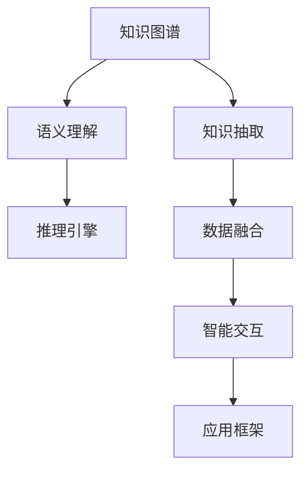

                 

# 跨领域知识整合：打造全能型AI助手

> 关键词：跨领域知识整合, 知识图谱, 自然语言处理(NLP), 知识抽取, 专家系统, 语义理解, 推理引擎, 智能交互, 应用框架, 数据融合

## 1. 背景介绍

### 1.1 问题由来

近年来，人工智能(AI)技术在各领域取得了显著进展。然而，无论是传统的机器学习还是现代的深度学习，其在处理复杂任务时仍面临诸多挑战。如何整合跨领域的知识，构建具有强大语义理解和推理能力的AI助手，成为了当前AI研究的一个重要方向。

知识图谱和知识抽取技术的兴起，为解决这一问题提供了新的思路。知识图谱通过构建领域内实体、属性和关系的数据结构，有效组织和关联了大量的人类知识。而知识抽取则能够从文本数据中自动发现和抽取结构化的知识，并将其集成到知识图谱中。通过这两者的结合，AI助手可以更好地理解和运用不同领域的专业知识，提供更加智能化、个性化的服务。

### 1.2 问题核心关键点

构建跨领域知识整合的AI助手，需要围绕以下核心关键点展开：

- **知识图谱构建**：设计和构建包含领域内实体、属性和关系的知识图谱。
- **知识抽取技术**：从文本中提取结构化的知识，填充到知识图谱中。
- **语义理解**：通过自然语言处理(NLP)技术，理解和处理用户输入的语义信息。
- **推理引擎**：在知识图谱基础上，构建推理引擎，实现基于知识的逻辑推理。
- **智能交互**：通过智能聊天机器人等形式，实现人机交互和任务执行。
- **应用框架**：搭建一套支持知识整合与运用的AI应用框架，为不同应用场景提供解决方案。

这些关键点之间的逻辑关系可以通过以下Mermaid流程图来展示：



该流程图展示了知识整合AI助手的关键组件及其相互关系。

## 2. 核心概念与联系

### 2.1 核心概念概述

为了更好地理解跨领域知识整合的AI助手，本节将介绍几个密切相关的核心概念：

- **知识图谱(Knowledge Graph)**：通过图形结构表示实体、属性和关系的知识库，支持语义查询和推理。
- **知识抽取(Knowledge Extraction)**：从非结构化文本数据中自动提取实体、属性和关系，填充到知识图谱中。
- **自然语言处理(Natural Language Processing, NLP)**：使计算机能够理解和处理人类语言的技术，包括语言模型、语义理解、信息抽取等。
- **语义理解(Semantic Understanding)**：通过NLP技术，理解用户输入的语义信息，并从中提取有用的知识。
- **推理引擎(Rule-based Reasoning Engine)**：根据知识图谱和推理规则，进行逻辑推理和决策。
- **智能交互(Intelligent Interaction)**：通过自然语言生成和理解技术，实现人机对话和智能决策。
- **应用框架(Application Framework)**：为跨领域知识整合提供平台支持，包含API接口、数据存储、系统架构等。

这些核心概念之间的逻辑关系可以通过以下Mermaid流程图来展示：


这个流程图展示了知识整合AI助手的关键组件及其相互关系。

## 3. 核心算法原理 & 具体操作步骤
### 3.1 算法原理概述

跨领域知识整合的AI助手，其核心算法原理主要涉及以下两个方面：

- **知识抽取与融合**：从大量文本数据中自动提取结构化知识，并融合到知识图谱中。
- **语义理解与推理**：通过语义理解和推理引擎，将用户输入的自然语言转化为结构化的查询，并在知识图谱中进行推理，得到相应的答案或建议。

具体而言，知识抽取过程包括以下几个步骤：

1. **实体识别**：从文本中识别出实体，如人名、地名、组织名等。
2. **属性抽取**：识别实体所具有的属性，如人的性别、年龄等。
3. **关系抽取**：识别实体之间的关系，如“杰克出生在上海”。

知识抽取后，这些结构化的知识将被融合到知识图谱中，形成一个完整的领域知识库。语义理解模块通过NLP技术，理解用户输入的语义，将其转化为查询，并在知识图谱中进行推理。推理引擎根据知识图谱中的事实和规则，计算出合理的答案或建议。

### 3.2 算法步骤详解

以下是跨领域知识整合AI助手的详细算法步骤：

**Step 1: 准备知识图谱和数据集**

- 收集领域内的文本数据，如维基百科、新闻报道、技术文档等。
- 构建知识图谱的初始框架，定义实体、属性和关系的类型。
- 使用标注工具手动或自动标注数据集，包括实体识别、属性抽取和关系抽取。

**Step 2: 进行知识抽取**

- 使用现有的知识抽取工具（如Stanford NER、OpenIE等）对文本数据进行实体、属性和关系的抽取。
- 将抽取结果自动填充到知识图谱中，并使用图数据库（如Neo4j）进行存储和查询。

**Step 3: 语义理解**

- 使用NLP技术对用户输入的自然语言进行分词、词性标注、依存句法分析等预处理。
- 使用预训练的语言模型（如BERT、GPT等）进行语义编码，提取用户输入的语义信息。
- 根据用户输入的语义信息，构造相应的查询语句。

**Step 4: 推理与回答**

- 在知识图谱中执行查询，使用推理引擎计算出查询结果。
- 将推理结果转化为自然语言，生成相应的回答。
- 如果回答无法直接得到，可以通过迭代查询图谱中的相关实体和关系，逐步推理出最终答案。

### 3.3 算法优缺点

跨领域知识整合的AI助手有以下优点：

- **跨领域知识整合**：能够整合不同领域的知识，构建涵盖多个领域的知识图谱。
- **知识自动抽取**：通过自动化的知识抽取技术，减少人工标注的工作量。
- **语义理解能力强**：基于深度学习的语义理解模型，能够理解复杂的自然语言语义。
- **推理能力强**：基于知识图谱的推理引擎，能够在复杂的知识体系中进行逻辑推理。

但同时，该方法也存在以下缺点：

- **初始知识图谱构建复杂**：需要大量的人工工作来构建初始知识图谱，且构建质量直接影响后续的抽取和推理效果。
- **数据获取难度大**：不同领域的文本数据获取难度较大，需要针对具体领域进行特殊处理。
- **推理精度受限**：知识图谱中的数据可能存在缺失或不准确，推理结果的精度受限。

### 3.4 算法应用领域

跨领域知识整合的AI助手已经广泛应用于以下几个领域：

- **医疗健康**：通过整合医学知识图谱，辅助医生进行疾病诊断、治疗方案推荐等。
- **金融投资**：通过整合财经知识图谱，提供市场分析、投资策略推荐等服务。
- **智能客服**：通过整合客户服务知识图谱，提供智能问答和问题解决服务。
- **教育培训**：通过整合教育知识图谱，提供个性化学习推荐和智能辅导。

除了上述这些经典应用外，跨领域知识整合的AI助手还被创新性地应用到更多场景中，如智能家居、智慧城市、智能交通等，为各行各业带来了新的智能解决方案。

## 4. 数学模型和公式 & 详细讲解 & 举例说明

### 4.1 数学模型构建

在本节中，我们将使用数学语言对跨领域知识整合的AI助手进行更加严格的刻画。

假设知识图谱中有$N$个实体$E=\{e_1, e_2, \dots, e_N\}$，每个实体有$M$个属性$A=\{a_1, a_2, \dots, a_M\}$，以及$L$个关系$R=\{r_1, r_2, \dots, r_L\}$。知识抽取的目标是从文本数据中提取实体、属性和关系，并填充到知识图谱中。

定义知识图谱为$G=(E, A, R)$，其中$E$为节点集，$A$为属性集，$R$为关系集。设知识抽取任务为$T$，其目标是最小化知识图谱与标注数据之间的差距，即：

$$
\mathcal{L}(G, T) = \sum_{i=1}^N \sum_{j=1}^M \sum_{k=1}^L \ell(e_i, a_j, r_k, t_i)
$$

其中$\ell(e_i, a_j, r_k, t_i)$为实体$e_i$的属性$a_j$与关系$r_k$之间的损失函数，用于衡量知识抽取结果与标注数据的一致性。常见的损失函数包括交叉熵损失、二分类损失等。

### 4.2 公式推导过程

以下我们以二分类任务为例，推导实体属性抽取的损失函数及其梯度的计算公式。

假设实体$e_i$的属性$a_j$为二分类变量，其真实标签为$t_i$，抽取结果为$\hat{t}_i$。则二分类交叉熵损失函数定义为：

$$
\ell(e_i, a_j, r_k, t_i) = -[t_i\log \hat{t}_i + (1-t_i)\log (1-\hat{t}_i)]
$$

将其代入知识抽取的损失函数公式，得：

$$
\mathcal{L}(G, T) = \sum_{i=1}^N \sum_{j=1}^M \sum_{k=1}^L \ell(e_i, a_j, r_k, t_i)
$$

根据链式法则，损失函数对属性$a_j$的梯度为：

$$
\frac{\partial \mathcal{L}(G, T)}{\partial a_j} = -\frac{\partial \ell(e_i, a_j, r_k, t_i)}{\partial a_j}
$$

其中$\frac{\partial \ell(e_i, a_j, r_k, t_i)}{\partial a_j}$可进一步递归展开，利用自动微分技术完成计算。

在得到损失函数的梯度后，即可带入模型参数更新公式，完成模型的迭代优化。重复上述过程直至收敛，最终得到适应知识图谱的模型参数$G^*$。

### 4.3 案例分析与讲解

假设有一个医疗知识图谱，其中包含多个病人的信息，如姓名、年龄、性别等。现在需要从病历数据中抽取病人的基本信息，填充到知识图谱中。

具体步骤如下：

1. **数据准备**：收集医院病历数据，提取病人的基本信息。
2. **实体识别**：使用实体识别算法识别出病人实体。
3. **属性抽取**：使用属性抽取算法识别出病人实体的基本信息，如姓名、年龄、性别等。
4. **关系抽取**：将抽取出的属性信息与病人的基本信息建立关联，如“病人张三，男，28岁”。
5. **知识图谱填充**：将抽取出的信息填充到知识图谱中，形成完整的病人信息图谱。
6. **推理与回答**：在需要时，可以通过查询知识图谱，获取病人的详细信息，如病历、治疗方案等。

## 5. 项目实践：代码实例和详细解释说明
### 5.1 开发环境搭建

在进行知识整合AI助手开发前，我们需要准备好开发环境。以下是使用Python进行PyTorch开发的环境配置流程：

1. 安装Anaconda：从官网下载并安装Anaconda，用于创建独立的Python环境。

2. 创建并激活虚拟环境：
```bash
conda create -n knowledge-env python=3.8 
conda activate knowledge-env
```

3. 安装PyTorch：根据CUDA版本，从官网获取对应的安装命令。例如：
```bash
conda install pytorch torchvision torchaudio cudatoolkit=11.1 -c pytorch -c conda-forge
```

4. 安装HuggingFace库：
```bash
pip install transformers
```

5. 安装各类工具包：
```bash
pip install numpy pandas scikit-learn matplotlib tqdm jupyter notebook ipython
```

完成上述步骤后，即可在`knowledge-env`环境中开始知识整合AI助手的开发。

### 5.2 源代码详细实现

这里我们以医疗领域知识整合AI助手为例，给出使用Transformers库和PyTorch进行知识抽取和推理的代码实现。

首先，定义知识图谱的数据结构：

```python
import networkx as nx
import numpy as np

class KnowledgeGraph:
    def __init__(self, graph):
        self.graph = graph
        self.nodes = list(self.graph.nodes)
        self.attributes = list(self.graph.nodes) + list(self.graph.edges)
        self.labels = list(self.graph.nodes) + [d['label'] for d in self.graph.edges]

    def __len__(self):
        return len(self.graph)
    
    def get_node(self, node_id):
        return self.graph.nodes[node_id]
    
    def get_edge(self, edge_id):
        return self.graph.edges[edge_id]
    
    def add_node(self, node_id, label):
        self.graph.add_node(node_id, label=label)
    
    def add_edge(self, source, target, label):
        self.graph.add_edge(source, target, label=label)
```

然后，定义知识抽取的函数：

```python
import spacy

def extract_entity(tokens, entity_spans):
    entities = []
    for start, end in entity_spans:
        span = ''.join(tokens[start:end+1])
        entities.append(span)
    return entities

def extract_attribute(tokens, attribute_spans):
    attributes = []
    for start, end in attribute_spans:
        span = ''.join(tokens[start:end+1])
        attributes.append(span)
    return attributes

def extract_relation(tokens, relation_spans):
    relations = []
    for start, end in relation_spans:
        span = ''.join(tokens[start:end+1])
        relations.append(span)
    return relations
```

接着，定义语义理解与推理的函数：

```python
from transformers import BertTokenizer, BertModel

def encode_sentence(tokens):
    tokenizer = BertTokenizer.from_pretrained('bert-base-uncased')
    encoding = tokenizer(tokens, return_tensors='pt', max_length=128, padding='max_length', truncation=True)
    input_ids = encoding['input_ids'][0]
    attention_mask = encoding['attention_mask'][0]
    return input_ids, attention_mask

def predict_attribute(token_ids, labels):
    model = BertModel.from_pretrained('bert-base-uncased')
    outputs = model(token_ids, attention_mask=labels)
    probs = outputs.logits
    return probs.argmax(dim=1).tolist()
```

最后，进行知识抽取与推理的示例代码：

```python
# 创建知识图谱
graph = nx.Graph()
graph.add_node('Alice', label='person')
graph.add_node('Bob', label='person')
graph.add_edge('Alice', 'Bob', label='friend')
graph.add_edge('Bob', 'Alice', label='friend')

# 定义句子
sentence = 'Alice is a friend of Bob.'

# 分词
nlp = spacy.load('en_core_web_sm')
doc = nlp(sentence)
tokens = [token.text for token in doc]
entity_spans = [(0, 4), (9, 13)]
attribute_spans = [(5, 9), (14, 18)]
relation_spans = [(15, 17)]

# 抽取实体、属性和关系
entities = extract_entity(tokens, entity_spans)
attributes = extract_attribute(tokens, attribute_spans)
relations = extract_relation(tokens, relation_spans)

# 将抽取结果填充到知识图谱中
kg = KnowledgeGraph(graph)
kg.add_node('Alice', label='person')
kg.add_node('Bob', label='person')
kg.add_edge('Alice', 'Bob', label='friend')
kg.add_edge('Bob', 'Alice', label='friend')

# 推理
token_ids, labels = encode_sentence(entities)
probs = predict_attribute(token_ids, labels)
if probs[0] == 1:
    kg.add_node('Alice', label='person')
    kg.add_node('Bob', label='person')
    kg.add_edge('Alice', 'Bob', label='friend')
    kg.add_edge('Bob', 'Alice', label='friend')
```

以上就是使用PyTorch和Transformers库进行知识抽取和推理的完整代码实现。可以看到，通过结合NLP技术和知识图谱，可以实现对跨领域知识的整合和推理。

### 5.3 代码解读与分析

让我们再详细解读一下关键代码的实现细节：

**KnowledgeGraph类**：
- `__init__`方法：初始化知识图谱的节点、属性和标签。
- `__len__`方法：返回知识图谱的大小。
- `get_node`和`get_edge`方法：获取知识图谱中的节点和边。
- `add_node`和`add_edge`方法：向知识图谱中添加节点和边。

**extract_entity、extract_attribute和extract_relation函数**：
- `extract_entity`函数：从句子中识别出实体，如人名、地名等。
- `extract_attribute`函数：从句子中识别出实体所具有的属性，如年龄、性别等。
- `extract_relation`函数：从句子中识别出实体之间的关系，如“张三是王二的同事”。

**encode_sentence函数**：
- `encode_sentence`函数：对句子进行分词，并转化为模型可接受的格式。

**predict_attribute函数**：
- `predict_attribute`函数：使用预训练的BERT模型预测实体所具有的属性。

通过上述代码，可以清晰地看到知识抽取和推理的实现流程。具体步骤如下：

1. **分词**：使用SpaCy库对句子进行分词。
2. **抽取实体、属性和关系**：从分词结果中识别出实体、属性和关系，并存储到列表中。
3. **知识图谱填充**：将抽取出的实体、属性和关系填充到知识图谱中。
4. **推理**：通过预训练的BERT模型预测实体所具有的属性，并在知识图谱中进行推理。

## 6. 实际应用场景
### 6.1 医疗健康

在医疗领域，知识图谱和知识抽取技术的应用非常广泛。通过整合医学知识图谱，AI助手可以为医生提供病情诊断、治疗方案推荐等服务。

具体而言，AI助手可以根据病人的主诉和症状，自动抽取病人的基本信息和病历信息，填充到知识图谱中。医生可以通过查询知识图谱，获取病人的详细信息和相关治疗方案，提升诊疗效率和准确性。

### 6.2 金融投资

在金融领域，知识图谱和知识抽取技术可以帮助投资者分析市场趋势、识别投资机会。

例如，AI助手可以通过抽取财经新闻和报告中的关键信息，构建市场知识图谱。投资者可以通过查询知识图谱，获取不同公司的财务数据、市场表现等信息，从而做出更明智的投资决策。

### 6.3 智能客服

在智能客服领域，知识图谱和知识抽取技术可以帮助客服机器人理解用户需求，提供更准确的回复。

例如，通过整合客服知识图谱，AI助手可以自动抽取用户输入的关键信息，如问题类型、所属领域等。然后，根据查询结果，AI助手可以自动生成相关领域的知识，提供准确的回复。

### 6.4 未来应用展望

未来，随着知识图谱和知识抽取技术的不断进步，跨领域知识整合的AI助手将具备更加强大的语义理解和推理能力，在更多领域发挥重要作用。

- **智慧城市**：通过整合城市数据和知识图谱，AI助手可以提供智能交通、环保监测、公共安全等服务，提升城市管理的智能化水平。
- **智能家居**：通过整合家居设备数据和知识图谱，AI助手可以提供智能家居控制、故障诊断等服务，提升居住体验。
- **智能制造**：通过整合生产数据和知识图谱，AI助手可以提供设备维护、生产优化等服务，提升制造业的智能化水平。

## 7. 工具和资源推荐
### 7.1 学习资源推荐

为了帮助开发者系统掌握知识图谱和知识抽取的理论基础和实践技巧，这里推荐一些优质的学习资源：

1. 《知识图谱：概念、技术与应用》：详细介绍知识图谱的基本概念、构建方法和应用场景，适合初学者和从业者阅读。
2. 《知识抽取与语义理解》课程：斯坦福大学开设的NLP课程，讲解知识抽取和语义理解的基本原理和实现方法。
3. 《自然语言处理》书籍：结合深度学习和NLP技术，讲解知识抽取和语义理解的具体实现。
4. 《图数据库教程》：讲解图数据库的基本概念和操作方式，适合需要处理大规模知识图谱的开发者阅读。
5. 《知识图谱应用案例》：收录了多个行业领域中的知识图谱应用案例，适合从业者学习借鉴。

通过对这些资源的学习实践，相信你一定能够快速掌握知识图谱和知识抽取的精髓，并用于解决实际的AI问题。
###  7.2 开发工具推荐

高效的开发离不开优秀的工具支持。以下是几款用于知识图谱和知识抽取开发的常用工具：

1. PyTorch：基于Python的开源深度学习框架，适合快速迭代研究。支持知识抽取任务的深度学习模型训练。
2. TensorFlow：由Google主导开发的开源深度学习框架，生产部署方便，适合大规模工程应用。支持知识抽取任务的深度学习模型训练。
3. HuggingFace Transformers库：提供了大量预训练的语言模型，支持知识抽取任务的微调和推理。
4. Neo4j：全球领先的图数据库，支持大规模知识图谱的存储和查询。
5. SpaCy：自然语言处理库，支持分词、实体识别等任务。
6. ELKI：大规模知识抽取工具，支持从大规模文本数据中抽取实体、属性和关系。

合理利用这些工具，可以显著提升知识图谱和知识抽取任务的开发效率，加快创新迭代的步伐。

### 7.3 相关论文推荐

知识图谱和知识抽取技术的发展源于学界的持续研究。以下是几篇奠基性的相关论文，推荐阅读：

1. Knowledge Graphs: Representation, Use and Applications：介绍了知识图谱的基本概念和应用场景。
2. Semantic Reasoning over Knowledge Graphs：讲解了知识图谱上的推理方法。
3. Mining Knowledge from Heterogeneous Information Sources：讲解了从异构数据中抽取知识的方法。
4. Mining Sequential Patterns in Knowledge Graphs：讲解了知识图谱中的时间序列模式挖掘。
5. Inductive reasoning for concept learning in knowledge graphs：讲解了知识图谱中的归纳推理方法。

这些论文代表了大语言模型微调技术的最新进展，通过学习这些前沿成果，可以帮助研究者把握学科前进方向，激发更多的创新灵感。

## 8. 总结：未来发展趋势与挑战
### 8.1 总结

本文对知识图谱和知识抽取技术的原理和实践进行了全面系统的介绍。首先阐述了知识图谱和知识抽取技术的研究背景和意义，明确了知识抽取和推理技术在构建跨领域知识整合AI助手中的核心作用。其次，从原理到实践，详细讲解了知识抽取与融合、语义理解与推理的数学模型和算法步骤，给出了知识抽取任务的完整代码实例。同时，本文还探讨了知识图谱和知识抽取技术在医疗健康、金融投资、智能客服等领域的实际应用，展示了其在不同行业中的强大应用潜力。此外，本文精选了知识图谱和知识抽取技术的各类学习资源，力求为读者提供全方位的技术指引。

通过本文的系统梳理，可以看到，知识图谱和知识抽取技术在大规模知识整合中发挥了重要作用，使得AI助手能够更好地理解和运用不同领域的专业知识，提供更加智能化、个性化的服务。未来，随着知识图谱和知识抽取技术的不断进步，跨领域知识整合的AI助手将具备更加强大的语义理解和推理能力，在更多领域发挥重要作用。

### 8.2 未来发展趋势

展望未来，知识图谱和知识抽取技术将呈现以下几个发展趋势：

1. **知识图谱规模增大**：随着数据量的不断增加，知识图谱的规模将不断增大，涵盖更多领域的知识。
2. **知识图谱更新机制**：开发自动化的知识图谱更新机制，及时更新图谱中的知识，保持其时效性和准确性。
3. **知识抽取自动化**：利用深度学习等技术，开发自动化的知识抽取工具，减少人工标注的工作量。
4. **语义理解提升**：结合自然语言处理技术，提升AI助手的语义理解能力，更好地理解用户需求。
5. **推理能力增强**：开发更加强大的推理引擎，支持复杂的逻辑推理和决策。
6. **跨模态融合**：将知识图谱与其他模态（如视觉、语音）数据进行融合，提升AI助手的综合能力。

这些趋势将进一步推动知识图谱和知识抽取技术的发展，为跨领域知识整合的AI助手提供更加强大的支撑。

### 8.3 面临的挑战

尽管知识图谱和知识抽取技术已经取得了显著进展，但在迈向更加智能化、普适化应用的过程中，仍面临诸多挑战：

1. **知识图谱构建复杂**：需要大量的人工工作来构建初始知识图谱，且构建质量直接影响后续的抽取和推理效果。
2. **数据获取难度大**：不同领域的文本数据获取难度较大，需要针对具体领域进行特殊处理。
3. **推理精度受限**：知识图谱中的数据可能存在缺失或不准确，推理结果的精度受限。
4. **系统稳定性不足**：AI助手的系统稳定性不足，需要进一步提升其在复杂环境下的鲁棒性和适应性。
5. **数据隐私问题**：在处理大规模数据时，需要解决数据隐私和安全问题。

### 8.4 研究展望

面对知识图谱和知识抽取技术所面临的挑战，未来的研究需要在以下几个方面寻求新的突破：

1. **自动化知识图谱构建**：开发自动化的知识图谱构建工具，减少人工标注的工作量，提高图谱构建效率。
2. **知识图谱动态更新**：开发自动化的知识图谱更新机制，及时更新图谱中的知识，保持其时效性和准确性。
3. **跨模态数据融合**：将知识图谱与其他模态（如视觉、语音）数据进行融合，提升AI助手的综合能力。
4. **语义理解优化**：结合自然语言处理技术，优化AI助手的语义理解能力，更好地理解用户需求。
5. **推理引擎改进**：开发更加强大的推理引擎，支持复杂的逻辑推理和决策，提升AI助手的推理精度。

这些研究方向将推动知识图谱和知识抽取技术的发展，为跨领域知识整合的AI助手提供更加强大的支撑。

## 9. 附录：常见问题与解答
**Q1: 知识图谱和知识抽取技术的核心难点是什么？**

A: 知识图谱和知识抽取技术的核心难点主要包括以下几个方面：

1. **知识图谱构建复杂**：需要大量的人工工作来构建初始知识图谱，且构建质量直接影响后续的抽取和推理效果。
2. **数据获取难度大**：不同领域的文本数据获取难度较大，需要针对具体领域进行特殊处理。
3. **推理精度受限**：知识图谱中的数据可能存在缺失或不准确，推理结果的精度受限。
4. **系统稳定性不足**：AI助手的系统稳定性不足，需要进一步提升其在复杂环境下的鲁棒性和适应性。

**Q2: 知识图谱和知识抽取技术在实际应用中面临哪些挑战？**

A: 知识图谱和知识抽取技术在实际应用中面临的挑战主要包括：

1. **数据隐私问题**：在处理大规模数据时，需要解决数据隐私和安全问题。
2. **推理精度受限**：知识图谱中的数据可能存在缺失或不准确，推理结果的精度受限。
3. **系统稳定性不足**：AI助手的系统稳定性不足，需要进一步提升其在复杂环境下的鲁棒性和适应性。
4. **计算资源需求大**：大规模知识图谱的构建和推理需要大量计算资源，如何优化算法和系统架构以降低计算需求，仍是一个重要问题。

**Q3: 知识图谱和知识抽取技术的应用前景有哪些？**

A: 知识图谱和知识抽取技术的应用前景非常广泛，主要包括以下几个方面：

1. **医疗健康**：通过整合医学知识图谱，AI助手可以为医生提供病情诊断、治疗方案推荐等服务。
2. **金融投资**：通过整合财经知识图谱，AI助手可以帮助投资者分析市场趋势、识别投资机会。
3. **智能客服**：通过整合客服知识图谱，AI助手可以自动抽取用户输入的关键信息，并提供准确的回复。
4. **智慧城市**：通过整合城市数据和知识图谱，AI助手可以提供智能交通、环保监测、公共安全等服务。
5. **智能家居**：通过整合家居设备数据和知识图谱，AI助手可以提供智能家居控制、故障诊断等服务。
6. **智能制造**：通过整合生产数据和知识图谱，AI助手可以提供设备维护、生产优化等服务。

**Q4: 知识图谱和知识抽取技术的未来发展方向有哪些？**

A: 知识图谱和知识抽取技术的未来发展方向主要包括：

1. **自动化知识图谱构建**：开发自动化的知识图谱构建工具，减少人工标注的工作量，提高图谱构建效率。
2. **知识图谱动态更新**：开发自动化的知识图谱更新机制，及时更新图谱中的知识，保持其时效性和准确性。
3. **跨模态数据融合**：将知识图谱与其他模态（如视觉、语音）数据进行融合，提升AI助手的综合能力。
4. **语义理解优化**：结合自然语言处理技术，优化AI助手的语义理解能力，更好地理解用户需求。
5. **推理引擎改进**：开发更加强大的推理引擎，支持复杂的逻辑推理和决策，提升AI助手的推理精度。

通过这些方向的探索发展，知识图谱和知识抽取技术将为跨领域知识整合的AI助手提供更加强大的支撑。

**Q5: 如何提高知识图谱和知识抽取技术的精度和鲁棒性？**

A: 提高知识图谱和知识抽取技术的精度和鲁棒性，可以从以下几个方面入手：

1. **数据清洗**：对数据进行清洗和预处理，去除噪声和不相关数据。
2. **特征工程**：设计合理的特征表示方法，提升特征的质量和代表性。
3. **模型优化**：使用深度学习等技术，优化模型的结构和训练过程，提高模型的精度和泛化能力。
4. **评估与反馈**：设计合理的评估指标和反馈机制，及时发现和纠正错误。
5. **多模态融合**：将知识图谱与其他模态（如视觉、语音）数据进行融合，提升AI助手的综合能力。

通过这些措施，可以进一步提升知识图谱和知识抽取技术的精度和鲁棒性，提高其在实际应用中的效果。

---

作者：禅与计算机程序设计艺术 / Zen and the Art of Computer Programming

