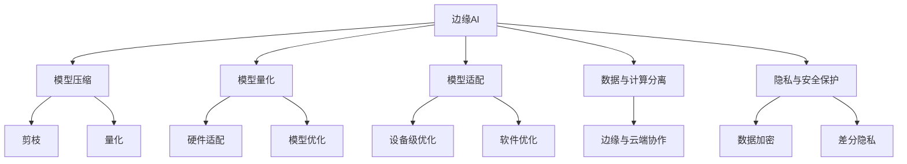

                 

# 边缘AI：在IoT设备上运行机器学习模型

## 1. 背景介绍

### 1.1 问题由来

近年来，物联网(IoT)技术的快速发展，使得设备之间的互联互通变得前所未有的便捷。无论是智能家居、工业设备，还是智慧城市，物联网的应用场景正在不断扩展。然而，由于传统的IoT设备普遍计算能力有限、存储资源不足，无法直接支持大规模机器学习模型的运行，极大地限制了AI在IoT领域的应用。为了解决这个问题，边缘AI应运而生，旨在将机器学习模型部署在IoT设备上，使设备具备更强的计算和推理能力，推动AI技术在边缘端的广泛应用。

### 1.2 问题核心关键点

边缘AI的核心在于如何在资源受限的设备上高效运行机器学习模型，同时兼顾计算速度、模型精度和能耗等关键指标。具体来说，需要考虑以下几个关键问题：

- **模型压缩与裁剪**：如何将大模型压缩到设备可负担的规模。
- **模型量化与加速**：如何在不损失精度的情况下加速模型的推理过程。
- **模型适配与优化**：如何针对特定设备进行模型适配，提高模型运行效率。
- **数据与计算分离**：如何在边缘设备与云端的分布式架构中协调数据流动，实现更高效的推理计算。
- **隐私与安全保护**：如何在保障数据隐私和安全的前提下，实现在IoT设备上的AI应用。

### 1.3 问题研究意义

研究边缘AI技术，对于提升IoT设备的智能化水平，推动AI技术的广泛应用，具有重要意义：

- **提升设备智能性**：边缘AI使得IoT设备能够具备自主感知、决策和学习能力，极大地增强了设备的智能性。
- **降低云中心压力**：将计算和推理任务分散到设备上，可以减轻云中心的计算负担，提高系统的整体效率。
- **降低带宽成本**：通过在边缘设备上进行模型推理，减少了数据传输到云端的需求，降低了带宽成本。
- **增强数据安全性**：将数据和计算分离，减少敏感数据在云端存储的风险，提高数据安全性。
- **促进IoT技术创新**：边缘AI的广泛应用，将推动IoT设备与AI技术的深度融合，促进新技术的创新和应用。

## 2. 核心概念与联系

### 2.1 核心概念概述

为了更好地理解边缘AI的核心原理和架构，本节将介绍几个关键概念：

- **边缘AI (Edge AI)**：在IoT设备上运行机器学习模型，实现数据处理、推理和决策等AI功能的技术。
- **模型压缩**：通过剪枝、量化、因子化等技术，将大模型压缩到设备可负担的规模，以提高模型运行效率。
- **模型量化**：将模型的浮点参数转化为整数或定点参数，减小模型体积，加速推理过程。
- **模型适配**：针对特定设备硬件特性，对模型进行优化和适配，以提高模型性能和运行效率。
- **数据与计算分离**：通过在边缘设备和云端之间的分布式架构，优化数据流动和计算资源分配，实现更高效的AI推理。
- **隐私与安全保护**：通过数据加密、差分隐私等技术，保护数据隐私和安全，确保边缘AI应用的可靠性。

这些核心概念之间的逻辑关系可以通过以下Mermaid流程图来展示：



这个流程图展示的边缘AI核心概念及其之间的关系：

1. 边缘AI将AI功能部署在IoT设备上。
2. 压缩与量化技术减小模型规模和计算需求。
3. 适配与优化技术提高模型性能和运行效率。
4. 数据与计算分离优化系统架构，提升推理效率。
5. 隐私与安全保护确保数据和模型的安全性。

这些概念共同构成了边缘AI的实施框架，使其能够在各种IoT设备上高效运行机器学习模型。

## 3. 核心算法原理 & 具体操作步骤

### 3.1 算法原理概述

边缘AI的核心算法原理在于如何在资源受限的设备上高效运行机器学习模型，同时保证模型性能和推理速度。主要包括以下几个关键步骤：

1. **模型压缩**：通过剪枝、量化等技术，将大模型压缩到设备可负担的规模。
2. **模型量化**：将模型的浮点参数转化为整数或定点参数，减小模型体积，加速推理过程。
3. **模型适配**：针对特定设备硬件特性，对模型进行优化和适配，提高模型性能和运行效率。
4. **数据与计算分离**：在边缘设备与云端之间进行分布式计算，优化数据流动和资源分配，提升推理效率。
5. **隐私与安全保护**：在数据处理和传输过程中，采用加密、差分隐私等技术，确保数据和模型的安全性。

### 3.2 算法步骤详解

基于上述核心原理，边缘AI的具体实施步骤包括：

1. **选择合适的边缘设备**：根据应用场景和需求，选择适合的IoT设备作为边缘计算的载体。
2. **预训练模型选择**：选择与边缘设备硬件特性和应用场景相匹配的预训练模型。
3. **模型压缩与裁剪**：根据设备资源限制，对预训练模型进行剪枝和裁剪，保留对目标任务关键的参数。
4. **模型量化与优化**：将模型的浮点参数转化为定点或整数参数，优化模型结构，提升推理速度。
5. **模型适配与部署**：针对目标设备的硬件特性，进行模型适配，生成适用于边缘设备的模型二进制文件。
6. **数据与计算分离**：设计分布式架构，将数据预处理和模型推理任务分布到边缘设备和云端。
7. **隐私与安全保护**：采用数据加密、差分隐私等技术，保护数据隐私和安全，确保边缘AI应用的可靠性。

### 3.3 算法优缺点

边缘AI算法具有以下优点：

- **提升边缘计算能力**：通过压缩和量化技术，使得模型能够在资源受限的设备上高效运行，提升边缘计算能力。
- **降低带宽和能耗**：通过在边缘设备上进行推理计算，减少数据传输到云端的需求，降低带宽成本，提升能效。
- **增强数据安全性**：通过数据加密和差分隐私等技术，保护数据隐私和安全，确保边缘AI应用的可靠性。

然而，边缘AI也存在以下局限性：

- **模型压缩效果有限**：压缩后的模型精度和性能可能受到影响，特别是在深度任务中。
- **边缘设备计算能力有限**：部分复杂模型在压缩和量化后仍可能超出设备计算能力。
- **模型更新和维护困难**：在资源受限的设备上进行模型更新和维护，需要考虑模型大小、存储和计算资源的限制。
- **分布式架构复杂性**：需要设计复杂的分布式架构，优化数据流动和计算资源分配，增加系统设计和部署的复杂度。

### 3.4 算法应用领域

边缘AI技术已经在多个领域得到了广泛的应用，例如：

- **智能家居**：通过在智能设备上运行模型，实现智能控制和交互，提升家居智能化水平。
- **工业自动化**：在工业设备上部署模型，实现预测性维护和优化控制，提升生产效率和质量。
- **智慧城市**：在城市基础设施中运行模型，实现交通管理、环境监测等功能，提升城市管理智能化水平。
- **医疗健康**：在医疗设备上部署模型，实现疾病预测、诊断和治疗优化，提升医疗服务质量。
- **农业生产**：在农业设备上运行模型，实现智能灌溉、病虫害检测等功能，提升农业生产效率和效益。

这些应用展示了边缘AI技术的强大潜力和广泛应用前景。

## 4. 数学模型和公式 & 详细讲解 & 举例说明

### 4.1 数学模型构建

本节将使用数学语言对边缘AI的关键算法进行更加严格的刻画。

假设边缘设备上运行的是基于深度神经网络(DNN)的机器学习模型 $M_{\theta}$，其中 $\theta$ 为模型参数。设模型输入为 $x \in \mathcal{X}$，输出为 $y \in \mathcal{Y}$，其中 $\mathcal{X}$ 为输入空间，$\mathcal{Y}$ 为输出空间。

定义模型 $M_{\theta}$ 在输入 $x$ 上的损失函数为 $\ell(M_{\theta}(x),y)$，则在数据集 $D$ 上的经验风险为：

$$
\mathcal{L}(\theta) = \frac{1}{N} \sum_{i=1}^N \ell(M_{\theta}(x_i),y_i)
$$

其中 $\mathcal{L}$ 为损失函数，$\theta$ 为模型参数。

### 4.2 公式推导过程

以下我们以卷积神经网络(Convolutional Neural Network, CNN)为例，推导模型压缩、量化和适配等关键算法的数学原理。

#### 4.2.1 模型压缩与裁剪

模型压缩的核心是剪枝和因子化。假设模型有 $N$ 个参数 $\theta_j$，其中 $n$ 个参数对目标任务贡献较大，占比为 $p$。剪枝操作将剩余 $N-n$ 个参数设为0，即 $\theta_j=0$ 对于 $j > n$。

因子化技术则进一步将模型参数分解为若干因子，每个因子只涉及少数参数。假设模型共有 $k$ 个因子 $F_i$，每个因子涉及 $m$ 个参数。因子化操作将模型参数表示为 $\theta = \sum_{i=1}^k F_i \alpha_i$，其中 $\alpha_i$ 为因子权重。

#### 4.2.2 模型量化

模型量化是将浮点参数转化为整数或定点参数。假设模型某层的参数 $\theta_j$ 的量化后参数为 $\hat{\theta}_j$，量化步骤为：

$$
\hat{\theta}_j = \text{round}(\theta_j / \Delta)
$$

其中 $\Delta$ 为量化步长，$\text{round}$ 为四舍五入函数。量化后模型的输出仍需保留浮点精度，因此通常需要在模型输出层保留浮点参数。

#### 4.2.3 模型适配

模型适配涉及对模型进行硬件和软件优化。假设模型适配后的参数为 $\hat{\theta}'$，适配过程为：

$$
\hat{\theta}' = \text{clamp}(\text{quantize}(\text{optimize}(\theta)), \text{min}, \text{max})
$$

其中 $\text{clamp}$ 为参数截断函数，$\text{quantize}$ 为参数量化函数，$\text{optimize}$ 为适配优化函数，$\text{min}$ 和 $\text{max}$ 为参数的截断范围。

### 4.3 案例分析与讲解

我们以边缘设备上的图像分类任务为例，分析边缘AI的实现过程。

1. **预训练模型选择**：选择与边缘设备硬件特性和应用场景相匹配的预训练模型，如MobileNet、ShuffleNet等轻量级模型。
2. **模型压缩与裁剪**：根据设备资源限制，对预训练模型进行剪枝和裁剪，保留对图像分类任务关键的参数。
3. **模型量化与优化**：将模型参数量化为定点参数，优化模型结构，提升推理速度。
4. **模型适配与部署**：针对目标设备的硬件特性，进行模型适配，生成适用于边缘设备的模型二进制文件。
5. **数据与计算分离**：在边缘设备与云端之间进行分布式计算，优化数据流动和计算资源分配，提升推理效率。
6. **隐私与安全保护**：采用数据加密、差分隐私等技术，保护数据隐私和安全，确保边缘AI应用的可靠性。

以下是一个简化版的图像分类任务的边缘AI部署流程：

1. **预训练模型选择**：选择MobileNet模型作为预训练模型。
2. **模型压缩与裁剪**：根据边缘设备资源限制，剪枝和裁剪模型，保留关键的卷积层和全连接层。
3. **模型量化与优化**：将模型参数量化为定点参数，优化模型结构，提升推理速度。
4. **模型适配与部署**：针对边缘设备的硬件特性，进行模型适配，生成适用于边缘设备的模型二进制文件。
5. **数据与计算分离**：在边缘设备与云端之间进行分布式计算，优化数据流动和计算资源分配，提升推理效率。
6. **隐私与安全保护**：采用数据加密、差分隐私等技术，保护数据隐私和安全，确保边缘AI应用的可靠性。

## 5. 项目实践：代码实例和详细解释说明

### 5.1 开发环境搭建

在进行边缘AI实践前，我们需要准备好开发环境。以下是使用Python进行TensorFlow开发的环境配置流程：

1. 安装Anaconda：从官网下载并安装Anaconda，用于创建独立的Python环境。

2. 创建并激活虚拟环境：
```bash
conda create -n tensorflow-env python=3.8 
conda activate tensorflow-env
```

3. 安装TensorFlow：根据CUDA版本，从官网获取对应的安装命令。例如：
```bash
conda install tensorflow=2.6 tf-gpu -c pytorch -c conda-forge
```

4. 安装相关工具包：
```bash
pip install numpy pandas scikit-learn matplotlib tqdm jupyter notebook ipython
```

完成上述步骤后，即可在`tensorflow-env`环境中开始边缘AI实践。

### 5.2 源代码详细实现

这里我们以边缘设备上的图像分类任务为例，给出使用TensorFlow对MobileNet模型进行压缩和量化的PyTorch代码实现。

首先，定义图像分类任务的数据处理函数：

```python
import tensorflow as tf
from tensorflow.keras.applications import MobileNetV2
from tensorflow.keras.preprocessing.image import ImageDataGenerator

def load_data(data_dir, batch_size=32, image_size=(224, 224)):
    train_datagen = ImageDataGenerator(rescale=1./255, shear_range=0.2, zoom_range=0.2, horizontal_flip=True)
    test_datagen = ImageDataGenerator(rescale=1./255)
    
    train_generator = train_datagen.flow_from_directory(
        data_dir,
        target_size=image_size,
        batch_size=batch_size,
        class_mode='categorical',
        shuffle=True)
    
    test_generator = test_datagen.flow_from_directory(
        data_dir,
        target_size=image_size,
        batch_size=batch_size,
        class_mode='categorical',
        shuffle=False)
    
    return train_generator, test_generator
```

然后，定义模型和优化器：

```python
model = MobileNetV2(weights='imagenet', include_top=False, input_shape=(224, 224, 3))
optimizer = tf.keras.optimizers.Adam(learning_rate=1e-4)
```

接着，定义训练和评估函数：

```python
def train_epoch(model, train_generator, optimizer, batch_size):
    model.compile(optimizer=optimizer, loss='categorical_crossentropy', metrics=['accuracy'])
    model.fit(
        train_generator,
        steps_per_epoch=len(train_generator),
        epochs=10,
        validation_data=val_generator,
        validation_steps=len(val_generator))
    
def evaluate(model, test_generator, batch_size):
    model.evaluate(test_generator, steps=len(test_generator))
```

最后，启动训练流程并在测试集上评估：

```python
train_generator, test_generator = load_data('data_dir')

train_epoch(model, train_generator, optimizer, batch_size=16)

evaluate(model, test_generator, batch_size=16)
```

以上就是使用TensorFlow对MobileNet进行图像分类任务边缘AI部署的完整代码实现。可以看到，得益于TensorFlow的高效封装，我们能够相对简洁地完成模型压缩和量化的过程。

### 5.3 代码解读与分析

让我们再详细解读一下关键代码的实现细节：

**load_data函数**：
- 定义了图像分类任务的数据生成器，使用ImageDataGenerator对图像进行预处理，生成批量化数据流。
- 使用flow_from_directory方法从目录中读取图像数据，并生成训练集和测试集。

**模型与优化器定义**：
- 选择MobileNetV2模型作为预训练模型。
- 定义Adam优化器，并设置学习率。

**训练和评估函数**：
- 使用模型编译函数，将模型编译成可执行的形式，并设置损失函数和评价指标。
- 调用模型的fit方法，对训练集进行迭代训练，并在验证集上进行评估。
- 调用模型的evaluate方法，在测试集上进行最终评估。

**训练流程**：
- 加载数据集，定义模型和优化器。
- 在训练集上迭代训练模型，并在验证集上评估模型性能。
- 在测试集上评估最终模型性能。

可以看到，TensorFlow提供了丰富的API支持，使得边缘AI的部署过程变得更加高效和便捷。

当然，工业级的系统实现还需考虑更多因素，如模型的保存和部署、超参数的自动搜索、更灵活的任务适配层等。但核心的边缘AI范式基本与此类似。

## 6. 实际应用场景
### 6.1 智能家居

边缘AI技术在智能家居领域有着广泛的应用，可以通过在智能设备上运行图像分类、语音识别等模型，实现智能控制和交互，提升家居智能化水平。例如，智能摄像头可以通过图像分类模型识别人脸和物体，实现自动登录和解锁；智能音箱可以通过语音识别模型理解用户指令，实现语音控制家居设备。

### 6.2 工业自动化

边缘AI在工业自动化中的应用，主要体现在设备监控和预测性维护上。通过在工业设备上部署模型，可以实现对设备状态和运行情况的实时监测，预测设备故障，提高生产效率和设备利用率。例如，通过在工业机器臂上运行图像分类模型，可以实时监测零部件的外观和质量，实现自动化检测和筛选。

### 6.3 智慧城市

智慧城市是边缘AI技术的重要应用场景之一。通过在城市基础设施中部署模型，可以实现交通管理、环境监测等功能，提升城市管理智能化水平。例如，智能交通系统可以通过视频分析模型，实时监测交通流量和运行状态，优化交通信号灯控制，缓解交通拥堵；智能垃圾桶可以通过图像分类模型，自动识别垃圾类型和重量，实现智能化回收和处理。

### 6.4 医疗健康

边缘AI在医疗健康领域的应用，主要体现在疾病预测、诊断和治疗优化上。通过在医疗设备上部署模型，可以实现对患者的健康状况进行实时监测和分析，预测疾病风险，提高诊断准确率和治疗效果。例如，智能穿戴设备可以通过图像分类模型，实时监测患者的健康指标，预警异常情况；智能诊断设备可以通过语音识别模型，实时记录和分析患者的语音信息，辅助医生进行诊断和治疗。

### 6.5 农业生产

边缘AI在农业生产中的应用，主要体现在智能灌溉和病虫害检测上。通过在农业设备上部署模型，可以实现对农田和作物的实时监测和分析，优化灌溉和病虫害防治措施，提升农业生产效率和效益。例如，智能灌溉设备可以通过图像分类模型，实时监测土壤湿度和作物生长状态，优化灌溉方案；智能病虫害检测设备可以通过图像分类模型，实时识别病虫害类型和发生情况，及时采取防治措施。

## 7. 工具和资源推荐
### 7.1 学习资源推荐

为了帮助开发者系统掌握边缘AI的理论基础和实践技巧，这里推荐一些优质的学习资源：

1. **《深度学习入门》书籍**：介绍了深度学习的基本概念和关键技术，涵盖模型压缩、量化、适配等主题。
2. **CS231n《卷积神经网络》课程**：斯坦福大学开设的计算机视觉课程，深入讲解卷积神经网络的原理和应用。
3. **《TensorFlow实战》书籍**：介绍了TensorFlow的核心概念和API使用，涵盖模型部署、优化等主题。
4. **TensorFlow官网**：提供了丰富的学习资料和示例代码，是TensorFlow学习的权威资源。
5. **边缘AI社区**：专注于边缘AI技术的交流和分享，提供最新的技术动态和应用案例。

通过对这些资源的学习实践，相信你一定能够快速掌握边缘AI技术的精髓，并用于解决实际的IoT问题。

### 7.2 开发工具推荐

高效的开发离不开优秀的工具支持。以下是几款用于边缘AI开发的常用工具：

1. **TensorFlow**：基于Python的开源深度学习框架，提供了丰富的API和工具支持，适合高效开发和部署。
2. **PyTorch**：基于Python的开源深度学习框架，提供了灵活的动态计算图和自动微分功能，适合深度学习模型的研究和开发。
3. **ONNX**：开放神经网络交换格式，支持多种深度学习框架和硬件平台，方便模型的转换和部署。
4. **TensorFlow Lite**：TensorFlow的低延迟优化版本，支持移动设备和边缘设备的部署和推理。
5. **TensorRT**：NVIDIA推出的深度学习推理优化工具，支持高性能的GPU推理加速。

合理利用这些工具，可以显著提升边缘AI开发的效率和效果。

### 7.3 相关论文推荐

边缘AI技术的发展源于学界的持续研究。以下是几篇奠基性的相关论文，推荐阅读：

1. **《A Survey on Compression of Deep Neural Networks》**：综述了深度神经网络的压缩技术，包括剪枝、量化、因子化等方法。
2. **《TensorFlow Lite: A Size, Speed, and Flexibility-Optimized TensorFlow for Mobile and Edge Devices》**：介绍了TensorFlow Lite的特性和应用场景，适合边缘设备的模型部署。
3. **《Edge-AI: A Survey of Recent Advances》**：综述了边缘AI技术的最新进展，包括模型压缩、量化、适配等技术。
4. **《Adaptive Edge-AI: Scalable and Reliable Edge Inference》**：讨论了如何在边缘设备上进行高效的模型推理，优化数据流动和计算资源分配。
5. **《Edge Computing: Overview of Recent Research》**：综述了边缘计算的研究现状和未来趋势，涵盖数据处理、推理、安全等方面。

这些论文代表了大模型边缘AI技术的发展脉络。通过学习这些前沿成果，可以帮助研究者把握学科前进方向，激发更多的创新灵感。

## 8. 总结：未来发展趋势与挑战

### 8.1 总结

本文对边缘AI技术进行了全面系统的介绍。首先阐述了边缘AI的背景和核心概念，明确了边缘AI在IoT设备上运行机器学习模型的独特价值。其次，从原理到实践，详细讲解了边缘AI的核心算法和操作步骤，给出了边缘AI任务开发的完整代码实例。同时，本文还广泛探讨了边缘AI技术在多个行业领域的应用前景，展示了边缘AI技术的强大潜力和广泛应用前景。此外，本文精选了边缘AI技术的各类学习资源，力求为读者提供全方位的技术指引。

通过本文的系统梳理，可以看到，边缘AI技术正在成为IoT设备智能化的一个重要方向，极大地提升IoT设备的计算和推理能力，推动AI技术的广泛应用。

### 8.2 未来发展趋势

展望未来，边缘AI技术将呈现以下几个发展趋势：

1. **模型精度提升**：通过更先进的模型结构和算法，提升边缘AI模型的精度和性能。
2. **计算资源优化**：通过更高效的计算图和资源管理技术，优化边缘设备的计算资源，提升模型推理效率。
3. **数据与计算分离**：在边缘设备与云端之间进行更灵活的数据流动和计算资源分配，实现更高效的AI推理。
4. **隐私与安全保护**：通过更严格的数据加密和差分隐私技术，保护数据隐私和安全，确保边缘AI应用的可靠性。
5. **边缘计算平台化**：将边缘AI技术集成到边缘计算平台中，实现更灵活的部署和管理。

这些趋势凸显了边缘AI技术的广阔前景。这些方向的探索发展，必将进一步提升IoT设备的智能化水平，推动AI技术在边缘端的广泛应用。

### 8.3 面临的挑战

尽管边缘AI技术已经取得了一定的进展，但在实际应用中仍然面临诸多挑战：

1. **模型压缩效果有限**：压缩后的模型精度和性能可能受到影响，特别是在深度任务中。
2. **边缘设备计算能力有限**：部分复杂模型在压缩和量化后仍可能超出设备计算能力。
3. **模型更新和维护困难**：在资源受限的设备上进行模型更新和维护，需要考虑模型大小、存储和计算资源的限制。
4. **分布式架构复杂性**：需要设计复杂的分布式架构，优化数据流动和计算资源分配，增加系统设计和部署的复杂度。
5. **隐私与安全风险**：在边缘设备上进行数据处理和模型推理，存在数据泄露和隐私泄露的风险。

正视这些挑战，积极应对并寻求突破，将是大模型边缘AI技术走向成熟的必由之路。相信随着学界和产业界的共同努力，这些挑战终将一一被克服，边缘AI技术必将在构建智能化IoT设备中发挥越来越重要的作用。

### 8.4 研究展望

面对边缘AI面临的诸多挑战，未来的研究需要在以下几个方面寻求新的突破：

1. **模型压缩与量化技术**：开发更高效的模型压缩与量化方法，提升边缘AI模型的精度和性能。
2. **边缘设备适配技术**：针对不同类型和功能的边缘设备，开发适配性强的边缘AI模型。
3. **分布式架构优化**：设计更灵活和高效的分布式架构，优化数据流动和计算资源分配。
4. **隐私与安全保护**：采用更严格的数据加密和差分隐私技术，保护数据隐私和安全。
5. **边缘计算平台化**：将边缘AI技术集成到边缘计算平台中，实现更灵活的部署和管理。

这些研究方向将引领边缘AI技术的不断进步，推动IoT设备智能化和AI技术的深度融合。面向未来，边缘AI技术还需要与其他人工智能技术进行更深入的融合，如知识表示、因果推理、强化学习等，多路径协同发力，共同推动边缘计算和AI技术的不断进步。

## 9. 附录：常见问题与解答

**Q1：边缘AI是否适用于所有IoT设备？**

A: 边缘AI技术主要适用于计算和存储资源受限的IoT设备，如智能家居、工业设备、医疗设备等。对于一些高性能设备，如智能手机、平板电脑等，通常可以在云端进行模型推理，不需要边缘AI技术。

**Q2：边缘AI的计算能力和推理速度如何？**

A: 边缘AI技术的计算能力和推理速度取决于具体设备的选择和优化。通过模型压缩和量化技术，可以显著减小模型规模，提升推理速度。但即使经过优化，边缘AI的计算能力和推理速度仍可能无法与高性能计算设备相媲美。

**Q3：边缘AI与云计算的关系是什么？**

A: 边缘AI与云计算是相辅相成的技术。边缘AI主要处理设备端的计算和推理任务，而云计算则负责数据的存储、管理和服务。通过分布式架构，边缘AI与云计算可以无缝协作，实现更高效的数据流动和资源分配。

**Q4：边缘AI如何保障数据隐私和安全？**

A: 边缘AI通过数据加密、差分隐私等技术，保护数据隐私和安全。数据加密技术可以将数据在传输和存储过程中进行加密，防止数据泄露。差分隐私技术可以在数据发布前进行噪音添加，防止个体数据的识别和攻击。

**Q5：边缘AI的优势和局限性是什么？**

A: 边缘AI的优势在于能够将计算和推理任务分布到边缘设备上，减少数据传输到云端的需求，降低带宽成本和延迟。但边缘AI也存在计算资源有限、模型更新和维护困难等局限性。因此，需要结合云计算和边缘计算的优点，构建分布式架构，实现更高效的AI推理。

正视边缘AI面临的这些挑战，积极应对并寻求突破，将是大模型边缘AI技术走向成熟的必由之路。相信随着学界和产业界的共同努力，这些挑战终将一一被克服，边缘AI技术必将在构建智能化IoT设备中发挥越来越重要的作用。

---

作者：禅与计算机程序设计艺术 / Zen and the Art of Computer Programming

