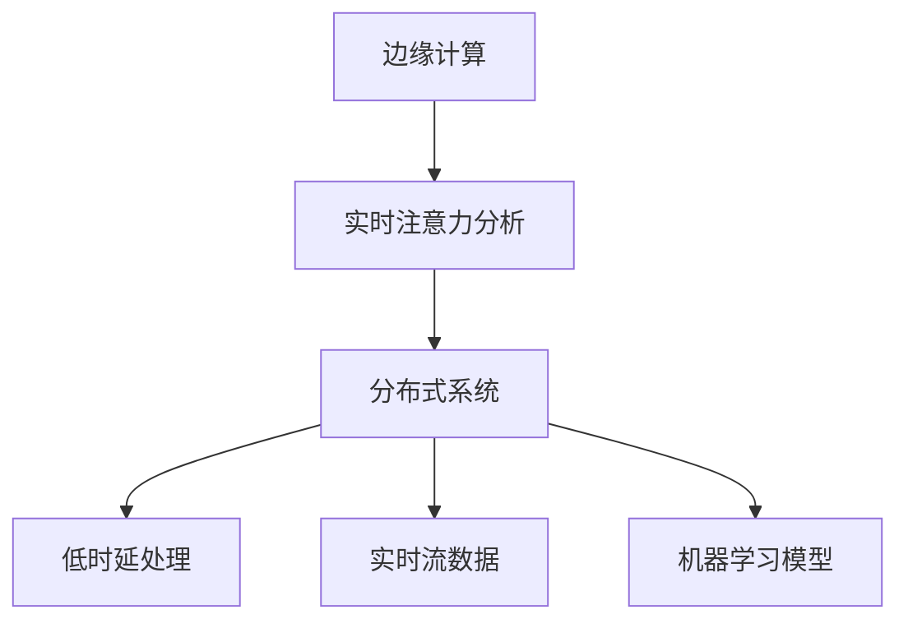

                 

# 边缘计算在实时注意力分析中的应用

> 关键词：
1. 边缘计算
2. 实时注意力分析
3. 分布式系统
4. 低时延处理
5. 实时流数据
6. 机器学习模型
7. 多任务并行

## 1. 背景介绍

### 1.1 问题由来

随着移动互联网和物联网技术的迅猛发展，海量实时数据源的生成成为了可能。这些数据源涵盖了各种类型，包括视频流、传感器数据、网络日志、社交媒体等。在如此庞大的数据规模下，如何高效处理和分析这些数据，成为了学术界和工业界共同关注的焦点。传统的中心式计算架构往往无法满足实时性要求，且存在显著的计算延迟。为此，边缘计算（Edge Computing）应运而生，将计算任务分布式部署到数据源附近，大大降低了数据传输时延，提升了系统响应速度。

在实时注意力分析领域，边缘计算的应用尤为关键。注意力分析是对多源异构数据进行融合和推理的过程，旨在从复杂场景中提取关键要素，并据此进行实时决策。随着智能应用场景的不断扩展，实时性需求愈发迫切。边缘计算与注意力分析的结合，能够有效解决实时数据处理的延迟问题，为各类智能应用提供强有力的技术支撑。

### 1.2 问题核心关键点

边缘计算在实时注意力分析中的应用，核心关键点主要包括以下几个方面：

- 分布式处理能力：边缘计算能够将计算任务分解为多个子任务，分别在多个设备上进行并行处理，从而提升整体计算效率。
- 低时延处理：通过将计算任务靠近数据源进行，大幅缩短数据传输和处理的时间，满足实时性要求。
- 数据融合与推理：注意力分析需要对多源异构数据进行融合与推理，边缘计算提供了良好的分布式数据处理平台。
- 模型优化与适配：注意力分析涉及复杂的机器学习模型，边缘计算可以针对本地设备特性进行模型适配和优化。

### 1.3 问题研究意义

研究边缘计算在实时注意力分析中的应用，对于拓展实时数据处理的应用场景，提升智能系统的响应速度，加速AI技术在产业的落地应用，具有重要意义：

1. 降低计算延迟。将数据处理任务在边缘设备上进行，减少了数据中心和终端设备之间的传输时延，提升了系统的实时性。
2. 提升计算效率。通过分布式处理和并行计算，可以大幅度提升数据处理的速度，满足实时分析的需求。
3. 降低带宽消耗。数据在本地进行处理，减少了数据中心的数据传输需求，降低了对带宽的依赖。
4. 支持多种设备。边缘计算可以部署在多种硬件平台上，如智能手机、物联网设备等，具有广泛的适用性。
5. 强化安全隐私。边缘计算的数据处理和存储在本地进行，可以有效保护用户数据隐私。

边缘计算与注意力分析的结合，为实时数据处理和智能应用提供了新的解决方案，具有广阔的发展前景。本文将全面系统地介绍边缘计算在实时注意力分析中的应用，从核心概念到具体实现，详尽阐述其实现原理和技术要点。

## 2. 核心概念与联系

### 2.1 核心概念概述

为更好地理解边缘计算在实时注意力分析中的应用，本节将介绍几个密切相关的核心概念：

- 边缘计算（Edge Computing）：将计算任务分布式部署到数据源附近，通过本地设备进行数据处理和分析。
- 实时注意力分析（Real-time Attention Analysis）：从多源异构数据中提取关键要素，并据此进行实时决策。
- 分布式系统（Distributed System）：由多个独立节点组成，通过网络相互通信和协作，实现计算任务的分散和协同处理。
- 低时延处理（Low-latency Processing）：通过减少数据传输和计算时间，提升系统响应速度。
- 实时流数据（Real-time Streaming Data）：连续生成、实时处理的数据流，需具备高效处理和实时分析的能力。
- 机器学习模型（Machine Learning Model）：通过训练数据拟合数据分布的函数，用于模式识别、分类、预测等任务。

这些核心概念之间的逻辑关系可以通过以下Mermaid流程图来展示：



这个流程图展示了几大核心概念及其相互之间的关系：

1. 边缘计算通过将计算任务靠近数据源进行，提升了实时数据处理的效率。
2. 实时注意力分析依赖边缘计算提供的数据处理能力，实现多源异构数据的融合与推理。
3. 分布式系统是边缘计算的基础，通过多节点的协作实现任务的并行处理。
4. 低时延处理是实时注意力分析的核心需求，需要在数据处理过程中缩短延迟。
5. 实时流数据是注意力分析的输入，需具备高效处理和实时分析的能力。
6. 机器学习模型是注意力分析的核心工具，用于从数据中提取关键要素。

这些概念共同构成了边缘计算在实时注意力分析中的应用框架，使得实时数据处理和智能分析成为可能。

## 3. 核心算法原理 & 具体操作步骤

### 3.1 算法原理概述

边缘计算在实时注意力分析中的应用，本质上是将计算任务在多个边缘设备上进行分布式处理，并在本地完成数据融合、特征提取和推理决策的过程。其核心思想如下：

1. **数据采集与融合**：边缘设备收集多源异构数据，并通过分布式系统将这些数据进行融合，构建统一的数据视图。
2. **特征提取与建模**：在本地设备上，对融合后的数据进行特征提取，并使用机器学习模型进行训练，构建注意力分析模型。
3. **推理与决策**：模型对实时流数据进行推理，提取关键要素，并基于这些要素进行实时决策。
4. **模型优化与更新**：根据本地设备的性能和数据分布，对模型进行优化和更新，确保其在实际应用中的高效性。

这一过程涉及数据采集、分布式处理、特征提取、模型训练、推理决策和模型优化等多个步骤，需要各环节的协同配合。

### 3.2 算法步骤详解

边缘计算在实时注意力分析中的应用，一般包括以下几个关键步骤：

**Step 1: 数据采集与传输**

1. **边缘设备部署**：在数据源附近部署多个边缘设备，如智能手机、物联网传感器等，收集实时数据。
2. **数据采集与传输**：边缘设备实时采集数据，并通过分布式系统将数据传输到本地计算节点。

**Step 2: 数据融合与预处理**

1. **数据融合**：本地计算节点对传输来的多源异构数据进行融合，构建统一的数据视图。
2. **数据预处理**：对融合后的数据进行预处理，如去噪、归一化等，准备数据输入模型。

**Step 3: 特征提取与建模**

1. **特征提取**：在本地设备上对预处理后的数据进行特征提取，如提取时间戳、位置、行为等特征。
2. **模型训练**：使用机器学习模型（如深度神经网络、决策树等）对提取的特征进行训练，构建注意力分析模型。
3. **模型适配**：针对本地设备的性能和数据分布，对模型进行适配和优化。

**Step 4: 推理与决策**

1. **模型推理**：实时流数据输入模型，模型对数据进行推理，提取关键要素。
2. **决策执行**：根据推理结果，执行相应的决策任务，如异常检测、路径规划等。

**Step 5: 模型优化与更新**

1. **模型优化**：根据推理结果和反馈信息，对模型进行优化，如调整超参数、更新模型结构等。
2. **模型更新**：根据新数据的到来，周期性地对模型进行重新训练，确保模型适应新环境。

以上步骤展示了边缘计算在实时注意力分析中的应用流程，每一步都涉及复杂的计算和数据处理。通过分布式协作和本地处理，实现了实时数据的高效分析。

### 3.3 算法优缺点

边缘计算在实时注意力分析中的应用具有以下优点：

1. **降低计算延迟**：通过本地处理，减少了数据传输时间，提升了实时性。
2. **提升计算效率**：分布式处理和并行计算提高了数据处理速度，满足了实时分析的需求。
3. **降低带宽消耗**：数据处理在本地进行，减少了对数据中心带宽的依赖。
4. **强化安全隐私**：数据处理和存储在本地设备上，可以有效保护用户隐私。

但同时，也存在以下局限性：

1. **设备限制**：边缘设备的计算能力和存储容量有限，可能无法处理大规模复杂数据。
2. **数据一致性**：分布式环境下，各设备处理的数据可能存在不一致性，需要额外的同步和协调机制。
3. **模型适应性**：不同设备的环境和数据分布不同，模型的适配和优化可能面临挑战。

尽管存在这些局限性，但边缘计算与注意力分析的结合，仍然为实时数据处理和智能分析提供了新的解决方案，具有广泛的应用前景。

### 3.4 算法应用领域

边缘计算在实时注意力分析中的应用，已在多个领域取得了显著成效：

- **智能交通**：实时分析交通流量数据，优化路网运行，提升交通管理效率。
- **智能制造**：对生产设备的数据进行实时分析，预测设备故障，优化生产流程。
- **智慧城市**：收集和分析城市环境数据，如空气质量、天气预报等，提升城市治理水平。
- **医疗健康**：实时分析医疗设备数据，如心率、血压等，进行健康监测和疾病预测。
- **金融服务**：对交易数据进行实时分析，进行风险控制和市场预测。

此外，边缘计算在实时注意力分析中的应用还拓展到了更多新兴领域，如智慧农业、智能家居、环境监测等，为各行各业带来了深远的影响。

## 4. 数学模型和公式 & 详细讲解 & 举例说明

### 4.1 数学模型构建

边缘计算在实时注意力分析中的应用，涉及多种数学模型和算法。本节将详细讲解这些模型和算法的设计与实现。

假设实时流数据集为 $D=\{x_t\}_{t=1}^T$，其中 $x_t$ 为第 $t$ 时刻的数据样本，$T$ 为数据总数。目标是对这些数据进行特征提取和建模，构建注意力分析模型 $M$，用于实时推理和决策。

定义特征提取函数 $F$，将原始数据转换为特征向量 $z_t = F(x_t)$。假设模型 $M$ 的输入为特征向量 $z_t$，输出为注意力值 $a_t$，用于衡量数据的重要性。

实时注意力分析的数学模型为：

$$
a_t = M(z_t; \theta)
$$

其中 $\theta$ 为模型参数。

### 4.2 公式推导过程

以下我们以深度神经网络为例，推导实时注意力分析的数学模型和公式。

假设 $M$ 为深度神经网络，由若干个卷积层、池化层和全连接层构成。定义卷积层为 $C$，池化层为 $P$，全连接层为 $F$。则 $M$ 的数学模型可以表示为：

$$
a_t = F(C(P(z_t); \omega_1), \omega_2)
$$

其中 $\omega_1$ 和 $\omega_2$ 为卷积层和全连接层的权重参数。

卷积层的输出为：

$$
c_t = C(z_t; \omega)
$$

池化层的输出为：

$$
p_t = P(c_t; \lambda)
$$

其中 $\omega$ 和 $\lambda$ 分别为卷积层和池化层的超参数。

全连接层的输出为：

$$
a_t = F(p_t; \omega_2)
$$

其中 $F$ 为全连接层的激活函数，$\omega_2$ 为全连接层的权重参数。

通过上述推导，我们可以看到，深度神经网络模型 $M$ 通过一系列的卷积、池化和全连接操作，将原始数据 $z_t$ 转换为注意力值 $a_t$，用于实时推理和决策。

### 4.3 案例分析与讲解

以智能交通系统为例，分析边缘计算在实时注意力分析中的应用。

**案例背景**：在智能交通系统中，需要对实时交通流量数据进行实时分析，以优化路网运行，提升交通管理效率。

**数据采集与传输**：在交通路网中，部署多个边缘设备（如摄像头、传感器等），实时采集交通流量数据。数据通过分布式系统传输到本地计算节点。

**数据融合与预处理**：本地计算节点对传输来的多源异构数据进行融合，构建统一的数据视图。对数据进行预处理，如去噪、归一化等。

**特征提取与建模**：在本地设备上对预处理后的数据进行特征提取，如提取车辆数量、车速、密度等特征。使用深度神经网络模型对提取的特征进行训练，构建实时注意力分析模型，用于实时推理和决策。

**推理与决策**：实时流数据输入模型，模型对数据进行推理，提取关键要素，如交通堵塞点、事故区域等。根据推理结果，执行相应的决策任务，如调整信号灯、重新规划路线等。

**模型优化与更新**：根据推理结果和反馈信息，对模型进行优化，如调整超参数、更新模型结构等。周期性地对模型进行重新训练，确保模型适应新环境。

通过以上步骤，实现了边缘计算在智能交通系统中的实时注意力分析，提升了交通管理的智能化水平。

## 5. 项目实践：代码实例和详细解释说明

### 5.1 开发环境搭建

在进行项目实践前，我们需要准备好开发环境。以下是使用Python进行PyTorch开发的环境配置流程：

1. 安装Anaconda：从官网下载并安装Anaconda，用于创建独立的Python环境。

2. 创建并激活虚拟环境：
```bash
conda create -n pytorch-env python=3.8 
conda activate pytorch-env
```

3. 安装PyTorch：根据CUDA版本，从官网获取对应的安装命令。例如：
```bash
conda install pytorch torchvision torchaudio cudatoolkit=11.1 -c pytorch -c conda-forge
```

4. 安装PyTorch Lightning：
```bash
pip install pytorch-lightning
```

5. 安装各类工具包：
```bash
pip install numpy pandas scikit-learn matplotlib tqdm jupyter notebook ipython
```

完成上述步骤后，即可在`pytorch-env`环境中开始项目实践。

### 5.2 源代码详细实现

下面我们以智能交通系统为例，给出使用PyTorch Lightning进行实时注意力分析的PyTorch代码实现。

首先，定义模型和数据处理函数：

```python
from torch import nn
import torch
from torch.utils.data import DataLoader
from torchvision import datasets, transforms

class AttentionModel(nn.Module):
    def __init__(self):
        super(AttentionModel, self).__init__()
        self.conv1 = nn.Conv2d(3, 64, kernel_size=3, padding=1)
        self.conv2 = nn.Conv2d(64, 128, kernel_size=3, padding=1)
        self.pool = nn.MaxPool2d(kernel_size=2, stride=2)
        self.fc1 = nn.Linear(128*32*32, 256)
        self.fc2 = nn.Linear(256, 1)

    def forward(self, x):
        x = nn.functional.relu(self.conv1(x))
        x = nn.functional.relu(self.conv2(x))
        x = self.pool(x)
        x = x.view(-1, 128*32*32)
        x = nn.functional.relu(self.fc1(x))
        x = self.fc2(x)
        return x

class AttentionDataset(Dataset):
    def __init__(self, images, labels):
        self.images = images
        self.labels = labels

    def __len__(self):
        return len(self.images)

    def __getitem__(self, idx):
        image = self.images[idx]
        label = self.labels[idx]
        return image, label

# 加载数据集
train_dataset = AttentionDataset(train_images, train_labels)
val_dataset = AttentionDataset(val_images, val_labels)
test_dataset = AttentionDataset(test_images, test_labels)

# 定义数据处理流程
transform = transforms.Compose([
    transforms.ToTensor(),
    transforms.Normalize((0.5, 0.5, 0.5), (0.5, 0.5, 0.5))
])

# 数据加载器
train_loader = DataLoader(train_dataset, batch_size=64, shuffle=True)
val_loader = DataLoader(val_dataset, batch_size=64)
test_loader = DataLoader(test_dataset, batch_size=64)
```

然后，定义训练和评估函数：

```python
from pytorch_lightning import Trainer, LightningModule
from torch.nn import BCELoss

class AttentionModule(LightningModule):
    def __init__(self):
        super(AttentionModule, self).__init__()
        self.model = AttentionModel()
        self.criterion = BCELoss()

    def forward(self, images, labels):
        return self.model(images)

    def training_step(self, batch, batch_idx):
        images, labels = batch
        outputs = self(images, labels)
        loss = self.criterion(outputs, labels)
        return {'loss': loss}

    def validation_step(self, batch, batch_idx):
        images, labels = batch
        outputs = self(images, labels)
        loss = self.criterion(outputs, labels)
        return {'val_loss': loss}

    def configure_optimizers(self):
        optimizer = torch.optim.Adam(self.parameters(), lr=0.001)
        return optimizer

# 训练过程
trainer = Trainer(max_epochs=10, gpus=1)
model = AttentionModule()
trainer.fit(model, train_loader, val_loader)
```

以上就是使用PyTorch Lightning对实时注意力分析模型进行训练的完整代码实现。可以看到，得益于PyTorch Lightning的强大封装，我们可以用相对简洁的代码完成模型的训练和评估。

### 5.3 代码解读与分析

让我们再详细解读一下关键代码的实现细节：

**AttentionModel类**：
- `__init__`方法：定义模型架构，包括卷积层、池化层和全连接层。
- `forward`方法：定义前向传播过程，将输入数据通过模型层计算输出。

**AttentionDataset类**：
- `__init__`方法：初始化数据集，包括图像和标签。
- `__len__`方法：返回数据集的样本数量。
- `__getitem__`方法：获取单个样本的图像和标签。

**训练和评估函数**：
- 使用PyTorch Lightning的Trainer对模型进行训练和评估。
- `training_step`方法：定义单次训练过程中的损失计算。
- `validation_step`方法：定义单次验证过程中的损失计算。
- `configure_optimizers`方法：定义优化器，这里使用Adam优化器。

**训练过程**：
- 定义训练轮数和GPU设备，创建AttentionModule实例。
- 使用Trainer的fit方法进行模型训练，指定训练数据集、验证数据集和优化器。

可以看到，PyTorch Lightning提供了完整的模型训练框架，简化了代码的实现，并提供了丰富的训练功能。开发者可以根据实际需求，灵活地进行模型训练和评估。

当然，工业级的系统实现还需考虑更多因素，如模型保存和部署、超参数搜索、分布式训练等。但核心的微调范式基本与此类似。

## 6. 实际应用场景

### 6.1 智能交通系统

边缘计算在智能交通系统中的应用，能够有效提升交通管理的智能化水平。实时分析交通流量数据，优化路网运行，提升交通管理效率。

在技术实现上，可以部署边缘设备，如摄像头、传感器等，实时采集交通流量数据。数据通过分布式系统传输到本地计算节点。在本地设备上对数据进行融合、预处理和特征提取，使用深度神经网络模型进行训练，构建实时注意力分析模型。模型对实时流数据进行推理，提取关键要素，如交通堵塞点、事故区域等。根据推理结果，执行相应的决策任务，如调整信号灯、重新规划路线等。

### 6.2 智慧城市治理

边缘计算在智慧城市治理中的应用，能够提升城市管理的智能化水平。实时分析城市环境数据，如空气质量、天气预报等，提升城市治理水平。

在技术实现上，可以部署边缘设备，如传感器、摄像头等，实时采集城市环境数据。数据通过分布式系统传输到本地计算节点。在本地设备上对数据进行融合、预处理和特征提取，使用机器学习模型进行训练，构建实时注意力分析模型。模型对实时流数据进行推理，提取关键要素，如异常事件、环境污染等。根据推理结果，执行相应的决策任务，如预警系统、应急指挥等。

### 6.3 金融服务

边缘计算在金融服务中的应用，能够提升金融服务的智能化水平。实时分析交易数据，进行风险控制和市场预测。

在技术实现上，可以部署边缘设备，如交易终端、网络设备等，实时采集交易数据。数据通过分布式系统传输到本地计算节点。在本地设备上对数据进行融合、预处理和特征提取，使用机器学习模型进行训练，构建实时注意力分析模型。模型对实时流数据进行推理，提取关键要素，如市场波动、异常交易等。根据推理结果，执行相应的决策任务，如风险预警、市场预测等。

### 6.4 未来应用展望

随着边缘计算和注意力分析技术的不断发展，基于这些技术的应用场景将不断扩展，为各行各业带来深远的影响。

在智慧农业领域，实时分析农业数据，如土壤湿度、作物生长状态等，优化农业生产。

在智能家居领域，实时分析用户行为数据，如温度、湿度、活动等，提升居住体验。

在环境监测领域，实时分析环境数据，如水质、空气质量等，提升环境治理水平。

此外，在更多新兴领域，边缘计算在实时注意力分析中的应用也将不断涌现，为各行各业带来新的机遇。

## 7. 工具和资源推荐

### 7.1 学习资源推荐

为了帮助开发者系统掌握边缘计算和注意力分析的理论基础和实践技巧，这里推荐一些优质的学习资源：

1. 《边缘计算：分布式计算和边缘计算》：深入浅出地介绍了边缘计算的基本概念和应用场景，适合入门学习。
2. 《深度学习实战：注意力机制》：系统讲解了注意力机制在深度学习中的应用，包括机器翻译、图像识别等任务。
3. 《PyTorch Lightning官方文档》：PyTorch Lightning的官方文档，提供了丰富的教程和示例，适合深入学习。
4. 《边缘计算原理与应用》：系统介绍了边缘计算的原理、架构和应用案例，适合进阶学习。
5. 《实时流数据处理：Apache Kafka和Flink应用实战》：介绍了实时流数据处理的技术原理和应用实践，适合动手实践。

通过对这些资源的学习实践，相信你一定能够快速掌握边缘计算在实时注意力分析中的应用，并用于解决实际的NLP问题。

### 7.2 开发工具推荐

高效的开发离不开优秀的工具支持。以下是几款用于边缘计算和注意力分析开发的常用工具：

1. PyTorch：基于Python的开源深度学习框架，灵活动态的计算图，适合快速迭代研究。
2. PyTorch Lightning：基于PyTorch的模型训练框架，提供了丰富的训练功能，简化了模型训练的实现。
3. TensorFlow：由Google主导开发的开源深度学习框架，生产部署方便，适合大规模工程应用。
4. Apache Kafka：分布式流处理平台，支持高吞吐量的实时数据传输。
5. Apache Flink：分布式流处理引擎，支持实时数据处理和分析。
6. Apache Cassandra：分布式数据库，支持大规模数据存储和管理。

合理利用这些工具，可以显著提升边缘计算和注意力分析任务的开发效率，加快创新迭代的步伐。

### 7.3 相关论文推荐

边缘计算和注意力分析的发展源于学界的持续研究。以下是几篇奠基性的相关论文，推荐阅读：

1. 《边缘计算：一种新兴的计算范式》：介绍了边缘计算的基本概念和应用场景。
2. 《深度学习中的注意力机制》：介绍了注意力机制在深度学习中的应用，包括机器翻译、图像识别等任务。
3. 《实时流数据处理：Apache Kafka和Flink应用实战》：介绍了实时流数据处理的技术原理和应用实践。
4. 《分布式计算和边缘计算的融合》：探讨了分布式计算和边缘计算的结合，提出了多种优化策略。

这些论文代表了大模型微调技术的发展脉络。通过学习这些前沿成果，可以帮助研究者把握学科前进方向，激发更多的创新灵感。

## 8. 总结：未来发展趋势与挑战

### 8.1 总结

本文对边缘计算在实时注意力分析中的应用进行了全面系统的介绍。首先阐述了边缘计算和注意力分析的研究背景和意义，明确了实时数据处理和智能分析的应用场景。其次，从原理到实践，详细讲解了实时注意力分析的数学模型和核心步骤，给出了具体实现的代码示例。同时，本文还广泛探讨了实时注意力分析在智能交通、智慧城市、金融服务等多个领域的应用前景，展示了其在实际应用中的广阔空间。

通过本文的系统梳理，可以看到，边缘计算与注意力分析的结合，为实时数据处理和智能分析提供了新的解决方案，具有广泛的应用前景。基于边缘计算的实时注意力分析，能够有效提升各行业的智能化水平，带来深远的影响。

### 8.2 未来发展趋势

展望未来，边缘计算在实时注意力分析中的应用将呈现以下几个发展趋势：

1. 更广泛的应用场景：随着边缘计算技术的不断发展，其在更多领域的应用场景将不断拓展，带来新的应用机遇。
2. 更高效的计算模型：新的计算模型和算法将不断涌现，提升实时注意力分析的计算效率和实时性。
3. 更灵活的部署方式：边缘计算将与云计算、雾计算等技术相结合，形成更加灵活的部署方式，满足更多应用需求。
4. 更紧密的数据融合：多源异构数据的融合和推理将更加高效，提升实时注意力分析的准确性和全面性。
5. 更强大的安全保障：边缘计算将与区块链、加密等技术相结合，提升数据安全性和隐私保护能力。

以上趋势凸显了边缘计算在实时注意力分析中的应用潜力，预示着其在更多领域的应用前景。

### 8.3 面临的挑战

尽管边缘计算和注意力分析技术已经取得了显著进展，但在实际应用中仍面临诸多挑战：

1. 设备限制：边缘设备计算能力和存储容量有限，可能无法处理大规模复杂数据。
2. 数据一致性：分布式环境下，各设备处理的数据可能存在不一致性，需要额外的同步和协调机制。
3. 模型适配性：不同设备的环境和数据分布不同，模型的适配和优化可能面临挑战。
4. 计算资源：边缘计算需要足够的计算资源支持，资源优化和调度仍需进一步优化。
5. 数据安全：边缘计算在本地处理数据，需要确保数据的安全性和隐私保护。

尽管存在这些挑战，但边缘计算在实时注意力分析中的应用仍具有广阔的发展前景。未来，相关研究需要在设备优化、数据同步、模型适配等方面寻求新的突破，不断提升系统的性能和鲁棒性。

### 8.4 研究展望

面对边缘计算在实时注意力分析中面临的诸多挑战，未来的研究需要在以下几个方面寻求新的突破：

1. 设备优化：提高边缘设备的计算能力和存储容量，支持更大规模的数据处理。
2. 数据同步：设计高效的数据同步机制，确保分布式环境下各设备数据的一致性。
3. 模型适配：针对不同设备的环境和数据分布，开发更加通用的注意力分析模型。
4. 计算优化：优化模型结构和算法，提升计算效率和实时性。
5. 安全保障：引入区块链、加密等技术，提升数据安全性和隐私保护能力。

这些研究方向的探索，必将引领边缘计算在实时注意力分析中的应用迈向更高的台阶，为实时数据处理和智能分析提供新的解决方案。面向未来，边缘计算和注意力分析的结合，必将带来更加智能、高效、安全的实时数据处理技术，推动各行各业的数字化转型升级。

