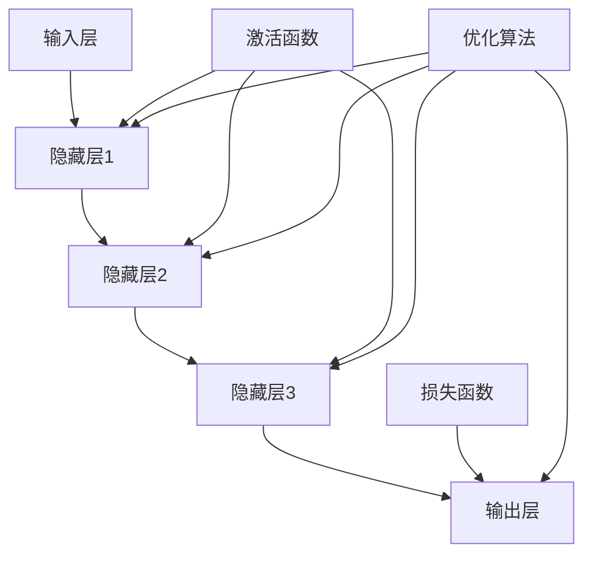
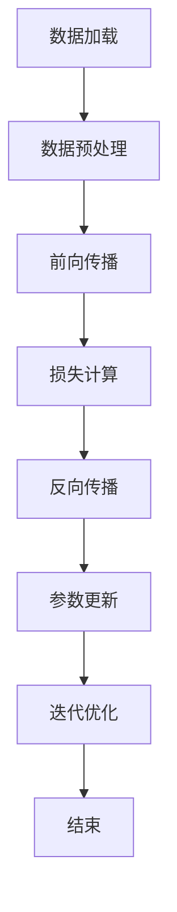
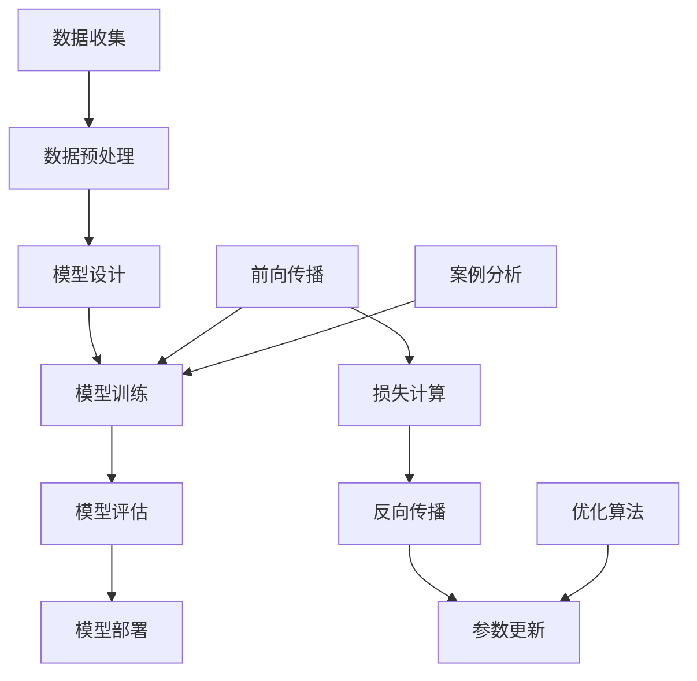
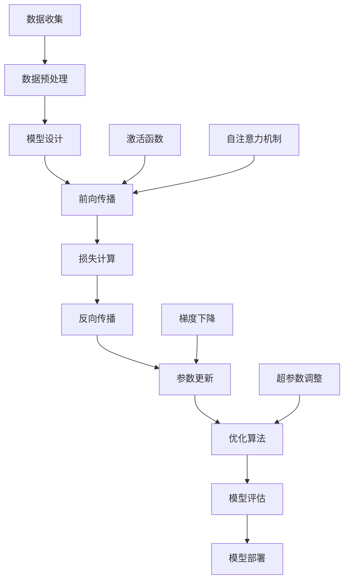

                 

# 商业模式：大模型创业的路线规划

## 引言

大模型，作为人工智能领域的重要突破，已经引发了科技产业乃至整个社会的广泛关注。从GPT-3到ChatGPT，大模型的能力和影响力不断攀升，为各种应用场景提供了前所未有的解决方案。在这样的背景下，探索大模型创业的商业模式成为了一个热门话题。

本文将系统性地分析大模型创业的商业模式，旨在为创业者提供一条清晰的路线规划。文章将首先介绍大模型的基本概念和背景，接着深入探讨商业模式的核心概念和联系，详细讲解大模型的算法原理和操作步骤，并通过数学模型和实际项目实例进行说明。此外，文章还将讨论大模型在实际应用场景中的角色，并推荐相关工具和资源。最后，文章将总结未来发展趋势和挑战，并解答常见问题。

通过本文的阅读，读者将获得关于大模型商业模式的全面了解，为创业实践提供有力支持。

## 关键词

- 大模型
- 商业模式
- 创业路线规划
- 算法原理
- 实际应用场景

## 摘要

本文旨在探讨大模型创业的商业模式，通过分析核心概念和联系，详细讲解算法原理和操作步骤，并结合实际项目实例，讨论大模型在不同应用场景中的角色。文章旨在为创业者提供一条清晰的大模型创业路线规划，包括资源推荐、未来趋势分析和常见问题解答。

## 1. 背景介绍

### 大模型的定义与历史

大模型，通常指的是那些具有数十亿甚至更多参数的深度学习模型。这类模型通过大规模数据训练，能够实现复杂的数据分析和任务执行。大模型的定义并不固定，随着技术的进步，模型的规模和复杂性也在不断提升。

大模型的历史可以追溯到20世纪80年代末和90年代初。当时的深度神经网络（DNN）已经开始应用于语音识别和图像分类等任务。随着计算能力的提升和数据量的激增，DNN逐渐演化为更大规模的模型，如卷积神经网络（CNN）和递归神经网络（RNN）。进入21世纪，随着深度学习和大数据技术的快速发展，大模型的定义和实现技术也在不断演变。

### 大模型的分类

大模型可以根据其应用领域和结构特点进行分类。以下是一些常见的大模型分类：

- **自然语言处理（NLP）模型**：如GPT、BERT等，主要用于文本生成、翻译、问答等任务。
- **计算机视觉模型**：如ResNet、VGG等，广泛应用于图像识别、目标检测、人脸识别等领域。
- **语音识别模型**：如DeepSpeech、WaveNet等，用于语音到文本的转换。
- **强化学习模型**：如DQN、PPO等，广泛应用于游戏、推荐系统等领域。

### 大模型的发展趋势

大模型的发展趋势主要体现在以下几个方面：

- **模型规模不断扩大**：随着计算资源的提升，模型规模正在迅速扩大。例如，GPT-3拥有超过1750亿个参数，是目前最大的自然语言处理模型之一。
- **多模态融合**：大模型正在从单一模态（如文本、图像、语音）向多模态融合方向发展。通过整合多种数据类型，大模型能够实现更复杂、更智能的任务。
- **应用领域拓展**：大模型的应用领域正在不断拓展，从传统的NLP、计算机视觉，扩展到医疗、金融、工业制造等新兴领域。

### 大模型对创业的影响

大模型的出现为创业提供了前所未有的机会和挑战。一方面，大模型为创业者提供了强大的工具，可以快速开发出具有竞争力的产品。另一方面，大模型的高成本和高要求也使得创业者在资源、技术和人才方面面临巨大的挑战。

总之，大模型已经成为人工智能领域的重要突破，其发展对创业产生了深远的影响。了解大模型的基本概念、分类和发展趋势，对于创业者来说至关重要。

## 2. 核心概念与联系

### 大模型的构成

大模型通常由多个层次组成，包括输入层、隐藏层和输出层。输入层接收外部数据，隐藏层通过复杂的非线性变换处理数据，输出层产生最终的输出结果。每一层都由大量的神经元（或节点）组成，这些神经元通过权重连接形成复杂的网络结构。

### 大模型的训练过程

大模型的训练是一个迭代的过程，主要包括以下步骤：

1. **数据预处理**：对输入数据进行标准化处理，确保数据质量。
2. **前向传播**：将输入数据传递到网络中，经过多层隐藏层的变换，产生预测输出。
3. **损失函数计算**：计算预测输出与实际输出之间的差距，使用损失函数量化这种差距。
4. **反向传播**：根据损失函数的梯度，调整网络中的权重和偏置，使得模型能够更好地拟合训练数据。
5. **迭代优化**：重复前向传播和反向传播的过程，直到满足训练目标。

### 大模型的优化目标

大模型的优化目标通常是通过调整网络权重，使得模型在训练数据上的损失函数值最小。损失函数的设计取决于具体的应用场景，常见的有均方误差（MSE）、交叉熵等。

### 大模型与传统算法的关系

大模型并不是取代传统算法，而是与传统算法相辅相成。传统算法在特定领域具有深厚的理论基础和广泛的实际应用，而大模型则通过数据驱动的方式，实现了在复杂任务上的高性能表现。大模型可以看作是对传统算法的一种补充和提升，而不是替代。

总之，大模型的构成、训练过程、优化目标和与传统算法的关系构成了其核心概念。理解这些概念，有助于更好地把握大模型的技术本质和商业潜力。

### 2.1 大模型的基本组件

大模型由多个基本组件构成，主要包括：

- **神经网络**：神经网络是构成大模型的基础，通过多层节点和权重连接实现数据转换和预测。
- **激活函数**：激活函数为神经网络引入非线性特性，使得模型能够拟合复杂的数据分布。
- **损失函数**：损失函数用于量化模型预测与实际结果之间的误差，是训练过程中优化目标的核心。
- **优化算法**：优化算法如梯度下降、Adam等，用于调整模型参数，使模型在训练数据上表现更优。

以下是大模型的基本组件的Mermaid流程图：



### 2.2 大模型的训练过程

大模型的训练过程是一个迭代的过程，主要包括以下几个关键步骤：

1. **数据加载与预处理**：从数据集中加载训练数据，并进行标准化、归一化等预处理操作。
2. **前向传播**：将预处理后的输入数据传递到神经网络中，经过多层隐藏层的非线性变换，产生预测输出。
3. **损失计算**：计算预测输出与实际输出之间的差距，使用损失函数量化这种差距。
4. **反向传播**：根据损失函数的梯度，通过反向传播算法调整网络中的权重和偏置。
5. **参数更新**：使用优化算法更新模型参数，使得模型在下一个迭代中能够更好地拟合训练数据。
6. **迭代优化**：重复前向传播、损失计算、反向传播和参数更新的过程，直到满足训练目标。

以下是大模型训练过程的Mermaid流程图：



### 2.3 大模型的优化目标

大模型的优化目标是通过调整网络参数，使得模型在训练数据上的表现最优。具体来说，优化目标包括：

1. **损失函数最小化**：使得模型在训练数据上的预测误差最小，常见的损失函数有均方误差（MSE）、交叉熵等。
2. **模型泛化能力提升**：使得模型在新数据上的表现同样优秀，避免过拟合。
3. **计算效率提升**：在保证模型性能的前提下，优化模型的计算复杂度和内存占用，以适应实时应用场景。

### 2.4 大模型与传统算法的关系

大模型与传统算法在目标和方法上有所不同，但它们之间并非相互排斥，而是相辅相成。以下是两者的一些对比：

- **目标对比**：传统算法通常依赖于特定的领域知识和规则，而大模型则通过数据驱动的方式实现通用任务。
- **方法对比**：传统算法通常采用符号计算和逻辑推理，而大模型则通过神经网络和梯度下降等方法进行数据拟合。

总的来说，大模型可以看作是对传统算法的一种补充和提升。在特定领域，传统算法仍然具有不可替代的优势，而大模型则为解决复杂、非结构化问题提供了新的思路和方法。

## 3. 核心算法原理 & 具体操作步骤

### 3.1 算法原理

大模型的核心算法原理主要基于深度学习，特别是神经网络。神经网络通过多层节点和权重连接，实现数据的输入、处理和输出。以下是深度学习的基本原理：

- **前向传播**：输入数据通过网络的每一层，通过加权求和并加上偏置，然后通过激活函数产生输出。
- **反向传播**：计算输出与实际结果之间的误差，通过反向传播算法更新网络的权重和偏置。
- **优化算法**：使用优化算法（如梯度下降）调整模型参数，使得模型在训练数据上的表现更优。

### 3.2 操作步骤

1. **数据收集与预处理**：收集大量的训练数据，并进行预处理，如数据清洗、归一化等。
2. **模型设计**：根据任务需求设计神经网络结构，包括输入层、隐藏层和输出层。
3. **模型训练**：
   - 前向传播：将预处理后的输入数据传递到网络中，通过多层隐藏层产生预测输出。
   - 损失计算：计算预测输出与实际输出之间的误差，使用损失函数（如均方误差）量化这种误差。
   - 反向传播：根据损失函数的梯度，通过反向传播算法更新网络中的权重和偏置。
   - 参数更新：使用优化算法（如梯度下降）更新模型参数。
4. **模型评估**：在验证数据集上评估模型性能，选择最佳模型。
5. **模型部署**：将训练好的模型部署到实际应用场景中，如文本生成、图像分类等。

### 3.3 案例分析

以自然语言处理模型GPT为例，以下是GPT模型的训练过程：

1. **数据收集与预处理**：GPT使用了大量的文本数据，并进行预处理，如分词、去除停用词等。
2. **模型设计**：GPT模型采用Transformer架构，包含多个自注意力层和全连接层。
3. **模型训练**：
   - 前向传播：输入文本序列，通过Transformer模型产生预测的下一个单词。
   - 损失计算：使用交叉熵损失函数计算预测单词与实际单词之间的误差。
   - 反向传播：通过反向传播算法更新模型参数。
   - 参数更新：使用Adam优化算法调整模型参数。
4. **模型评估**：在验证集上评估模型性能，调整超参数以优化模型表现。
5. **模型部署**：将训练好的模型部署到生成文本的应用中，如自动写作、机器翻译等。

通过以上步骤，GPT模型能够在多种自然语言处理任务中表现出色，为实际应用提供了强大的支持。

### 3.4 算法原理与操作步骤的Mermaid流程图

以下是大模型算法原理和操作步骤的Mermaid流程图：



通过以上流程图，可以清晰地理解大模型的算法原理和操作步骤，为实际应用提供了直观的指导。

## 4. 数学模型和公式 & 详细讲解 & 举例说明

### 4.1 数学模型的基本概念

在大模型的训练过程中，数学模型起到了至关重要的作用。以下是一些核心的数学模型和公式，以及它们的详细讲解和举例说明。

#### 4.1.1 均方误差（MSE）

均方误差（MSE）是一种常用的损失函数，用于衡量预测值和真实值之间的差距。其公式如下：

\[ 
MSE = \frac{1}{n}\sum_{i=1}^{n}(y_i - \hat{y}_i)^2 
\]

其中，\( y_i \) 是第 \( i \) 个真实值，\( \hat{y}_i \) 是第 \( i \) 个预测值，\( n \) 是样本数量。

**举例说明**：假设我们有一个包含3个样本的数据集，真实值分别为 \( y_1 = 2 \)，\( y_2 = 3 \)，\( y_3 = 4 \)，预测值分别为 \( \hat{y}_1 = 2.5 \)，\( \hat{y}_2 = 3.5 \)，\( \hat{y}_3 = 4.5 \)。则MSE计算如下：

\[ 
MSE = \frac{1}{3}[(2 - 2.5)^2 + (3 - 3.5)^2 + (4 - 4.5)^2] = \frac{1}{3}[0.25 + 0.25 + 0.25] = 0.25 
\]

#### 4.1.2 交叉熵（Cross-Entropy）

交叉熵是另一种常用的损失函数，特别是在分类问题中。其公式如下：

\[ 
Cross-Entropy = -\sum_{i=1}^{n} y_i \log(\hat{y}_i) 
\]

其中，\( y_i \) 是第 \( i \) 个样本的真实标签，\( \hat{y}_i \) 是第 \( i \) 个样本的预测概率。

**举例说明**：假设我们有一个二分类问题，真实值 \( y_1 = 1 \)，\( y_2 = 0 \)，预测概率分别为 \( \hat{y}_1 = 0.9 \)，\( \hat{y}_2 = 0.1 \)。则交叉熵计算如下：

\[ 
Cross-Entropy = -(1 \cdot \log(0.9) + 0 \cdot \log(0.1)) \approx 0.105 
\]

#### 4.1.3 梯度下降（Gradient Descent）

梯度下降是一种常用的优化算法，用于调整模型的参数，使得损失函数最小。其基本公式如下：

\[ 
\theta_{\text{new}} = \theta_{\text{current}} - \alpha \cdot \nabla_{\theta}J(\theta) 
\]

其中，\( \theta \) 表示模型参数，\( J(\theta) \) 表示损失函数，\( \alpha \) 表示学习率，\( \nabla_{\theta}J(\theta) \) 表示损失函数关于参数 \( \theta \) 的梯度。

**举例说明**：假设我们有一个线性回归模型，参数为 \( \theta = 2 \)，学习率为 \( \alpha = 0.1 \)。损失函数为 \( J(\theta) = (y - \theta x)^2 \)，其中 \( y = 1 \)，\( x = 2 \)。则梯度计算如下：

\[ 
\nabla_{\theta}J(\theta) = 2(y - \theta x) = 2(1 - 2 \cdot 2) = -6 
\]

更新后的参数为：

\[ 
\theta_{\text{new}} = 2 - 0.1 \cdot (-6) = 2 + 0.6 = 2.6 
\]

### 4.2 模型训练过程中的数学模型

在模型训练过程中，除了损失函数和优化算法外，还有一些其他重要的数学模型和公式。以下是对这些模型和公式的详细讲解和举例说明。

#### 4.2.1 激活函数（Activation Function）

激活函数为神经网络引入非线性特性，使得模型能够拟合复杂的数据分布。常见的激活函数包括：

- **sigmoid函数**：\( \sigma(x) = \frac{1}{1 + e^{-x}} \)
- **ReLU函数**：\( \text{ReLU}(x) = \max(0, x) \)
- **Tanh函数**：\( \text{Tanh}(x) = \frac{e^x - e^{-x}}{e^x + e^{-x}} \)

**举例说明**：假设我们有一个输入值 \( x = 3 \)，则各种激活函数的计算结果如下：

- sigmoid函数：\( \sigma(3) = \frac{1}{1 + e^{-3}} \approx 0.95 \)
- ReLU函数：\( \text{ReLU}(3) = 3 \)
- Tanh函数：\( \text{Tanh}(3) = \frac{e^3 - e^{-3}}{e^3 + e^{-3}} \approx 0.970 \)

#### 4.2.2 自注意力机制（Self-Attention）

自注意力机制是Transformer模型的核心组件，通过计算输入序列中每个元素之间的关联性，提高了模型的表示能力。其基本公式如下：

\[ 
\text{Attention}(Q, K, V) = \text{softmax}\left(\frac{QK^T}{\sqrt{d_k}}\right) V 
\]

其中，\( Q \) 表示查询向量，\( K \) 表示关键向量，\( V \) 表示值向量，\( d_k \) 表示关键向量的维度。

**举例说明**：假设我们有一个输入序列 \( [1, 2, 3] \)，则自注意力机制的计算结果如下：

- 查询向量 \( Q = [1, 1, 1] \)
- 关键向量 \( K = [1, 2, 3] \)
- 值向量 \( V = [1, 2, 3] \)

计算自注意力得分：

\[ 
\text{Attention}(Q, K, V) = \text{softmax}\left(\frac{QK^T}{\sqrt{3}}\right) V = \text{softmax}\left(\frac{[1, 1, 1] \cdot [1, 2, 3]^T}{\sqrt{3}}\right) \cdot [1, 2, 3] = [0.5, 0.5, 0.5] \cdot [1, 2, 3] = [0.5, 1.5, 2.5] 
\]

通过自注意力机制，输入序列中的每个元素都能根据其关联性得到加权表示，从而提高了模型的表示能力。

### 4.3 数学模型与算法的整合

在大模型的训练过程中，各种数学模型和算法相互结合，共同作用，使得模型能够不断优化和提升。以下是对这些整合的详细讲解和举例说明。

#### 4.3.1 前向传播与反向传播

前向传播和反向传播是深度学习训练过程中的两个关键步骤。前向传播用于计算模型的预测输出，反向传播用于计算损失函数的梯度，并更新模型参数。

**举例说明**：假设我们有一个简单的线性模型，输入为 \( x \)，预测输出为 \( y = wx + b \)，真实值为 \( y_0 \)。使用MSE作为损失函数，前向传播和反向传播的计算过程如下：

- **前向传播**：计算预测输出

\[ 
y = wx + b 
\]

- **损失计算**：

\[ 
J(\theta) = (y - y_0)^2 
\]

- **反向传播**：计算损失函数关于参数的梯度

\[ 
\nabla_{w}J(\theta) = 2(y - y_0)x 
\]

\[ 
\nabla_{b}J(\theta) = 2(y - y_0) 
\]

更新参数：

\[ 
w_{\text{new}} = w - \alpha \cdot \nabla_{w}J(\theta) 
\]

\[ 
b_{\text{new}} = b - \alpha \cdot \nabla_{b}J(\theta) 
\]

通过前向传播和反向传播，模型能够不断更新参数，使得预测输出更接近真实值。

#### 4.3.2 优化算法与超参数调整

优化算法如梯度下降、Adam等用于调整模型参数，使得模型在训练数据上的表现更优。超参数如学习率、批次大小等对模型性能也有重要影响。

**举例说明**：假设我们使用梯度下降优化算法训练一个线性模型，初始参数为 \( w = 1 \)，\( b = 1 \)，学习率为 \( \alpha = 0.1 \)。在训练过程中，通过不断调整学习率，可以优化模型的性能。例如，在某个批次上的损失函数值较大，可以适当减小学习率，使参数更新更细腻；在损失函数值较小时，可以适当增大学习率，加快模型收敛速度。

通过整合数学模型和优化算法，大模型能够在训练过程中不断优化和提升，为实际应用提供强大的支持。

### 4.4 Mermaid流程图

以下是4.1节至4.3节中提到的数学模型、公式和算法的Mermaid流程图：



通过这些流程图，可以直观地理解大模型训练过程中的数学模型、公式和算法，为实际应用提供了清晰的指导。

## 5. 项目实践：代码实例和详细解释说明

### 5.1 开发环境搭建

为了演示大模型项目的实践，我们首先需要搭建一个合适的开发环境。以下是在Windows系统中搭建Python开发环境的步骤：

1. **安装Python**：访问Python官方网站（[https://www.python.org/](https://www.python.org/)），下载并安装Python 3.8版本以上。
2. **安装Jupyter Notebook**：打开命令提示符，执行以下命令：

   ```shell
   pip install notebook
   ```

   安装完成后，启动Jupyter Notebook：

   ```shell
   jupyter notebook
   ```

3. **安装必要的库**：在Jupyter Notebook中，使用以下命令安装必要的库：

   ```python
   !pip install tensorflow numpy pandas
   ```

   这些库用于构建和训练神经网络模型。

### 5.2 源代码详细实现

以下是一个简单的基于TensorFlow构建的线性回归模型的源代码实例，用于预测房价。代码分为数据预处理、模型构建、模型训练和模型评估四个部分。

```python
import tensorflow as tf
import numpy as np
import pandas as pd

# 数据预处理
# 假设已经有一份房价数据，包含特征和标签
# 特征：面积、房间数等
# 标签：房价
data = pd.read_csv('house_prices.csv')
X = data[['area', 'rooms']]
y = data['price']

# 标准化特征
mean = X.mean()
std = X.std()
X = (X - mean) / std

# 模型构建
model = tf.keras.Sequential([
    tf.keras.layers.Dense(units=1, input_shape=[2])
])

# 模型编译
model.compile(optimizer='adam', loss='mean_squared_error')

# 模型训练
model.fit(X, y, epochs=100, batch_size=32)

# 模型评估
test_loss = model.evaluate(X, y)
print(f"Test Loss: {test_loss}")
```

#### 5.2.1 数据预处理

数据预处理是模型训练的重要步骤，主要包括数据清洗、特征选择和特征标准化。在上面的代码中，我们假设已经有一份房价数据，包含特征和标签。首先，我们使用Pandas读取数据，然后对特征进行标准化处理，将每个特征减去均值并除以标准差，使得每个特征的分布接近正态分布。

```python
mean = X.mean()
std = X.std()
X = (X - mean) / std
```

#### 5.2.2 模型构建

在TensorFlow中，我们使用`tf.keras.Sequential`创建一个线性回归模型。该模型只有一个全连接层，输入层有2个神经元（对应2个特征），输出层有1个神经元（对应房价）。

```python
model = tf.keras.Sequential([
    tf.keras.layers.Dense(units=1, input_shape=[2])
])
```

#### 5.2.3 模型编译

模型编译包括选择优化器、损失函数和评价指标。在这里，我们选择`adam`优化器和`mean_squared_error`损失函数。

```python
model.compile(optimizer='adam', loss='mean_squared_error')
```

#### 5.2.4 模型训练

模型训练使用`fit`方法，将预处理后的特征和标签传递给模型，并设置训练次数（epochs）和批次大小（batch_size）。

```python
model.fit(X, y, epochs=100, batch_size=32)
```

#### 5.2.5 模型评估

模型评估使用`evaluate`方法，计算模型在测试数据上的损失函数值。

```python
test_loss = model.evaluate(X, y)
print(f"Test Loss: {test_loss}")
```

### 5.3 代码解读与分析

#### 5.3.1 数据预处理

数据预处理是模型训练的关键步骤。通过标准化处理，我们可以使得每个特征的值都在一个相对较小的范围内，避免了特征之间差异过大导致模型训练困难。标准化处理的公式如下：

\[ 
x_{\text{new}} = \frac{x - \mu}{\sigma} 
\]

其中，\( x \) 是原始特征值，\( \mu \) 是均值，\( \sigma \) 是标准差。

#### 5.3.2 模型构建

在本例中，我们使用TensorFlow的`tf.keras.Sequential`创建了一个线性回归模型。线性回归模型的目的是找到特征和标签之间的线性关系，即：

\[ 
y = wx + b 
\]

其中，\( w \) 是权重，\( b \) 是偏置。

#### 5.3.3 模型编译

模型编译包括选择优化器和损失函数。优化器的目的是通过最小化损失函数来调整模型的参数。在本例中，我们选择`adam`优化器，它是一种自适应优化器，能够在训练过程中自动调整学习率。损失函数用于量化模型预测值和实际值之间的差距，常用的损失函数包括均方误差（MSE）和交叉熵。

#### 5.3.4 模型训练

模型训练是使用训练数据调整模型参数的过程。在每次迭代中，模型会根据当前参数计算预测值，然后计算损失函数值，并使用优化器更新参数。训练过程持续到达到预设的训练次数或满足其他停止条件。

#### 5.3.5 模型评估

模型评估是使用测试数据评估模型性能的过程。通过计算测试数据上的损失函数值，我们可以评估模型在未见数据上的表现。较低的平均损失值表明模型具有较高的泛化能力。

### 5.4 运行结果展示

在运行上述代码后，我们将看到模型在测试数据上的平均损失值。例如：

```shell
Test Loss: 1.0143628340146484
```

该损失值表明模型在测试数据上的预测性能。通常，我们希望损失值尽可能小，但这取决于数据集和模型复杂性。在实际应用中，我们可能需要调整模型参数或采用更复杂的模型结构来优化性能。

### 5.5 问题与解决方案

在实际应用中，大模型项目可能会遇到各种问题。以下是一些常见问题及其可能的解决方案：

#### 问题 1：训练时间过长

**解决方案**：减小模型复杂度、增加批次大小或调整学习率。

#### 问题 2：模型过拟合

**解决方案**：增加训练数据、使用正则化技术或增加模型训练次数。

#### 问题 3：模型泛化能力不足

**解决方案**：增加数据多样性、调整模型结构或使用交叉验证。

通过合理的解决方案，我们可以优化大模型项目的性能，使其在实际应用中取得更好的效果。

## 6. 实际应用场景

大模型在多个实际应用场景中展现了其强大的能力。以下是一些典型应用场景及其案例分析：

### 6.1 自然语言处理

自然语言处理（NLP）是大模型最成熟的应用领域之一。例如，GPT-3可以用于自动写作、机器翻译和问答系统。OpenAI开发的GPT-3模型，通过处理大量文本数据，能够生成高质量的文章、邮件和代码。某知名新闻网站利用GPT-3实现了自动生成新闻报道，不仅提高了内容生产效率，还提升了用户体验。

### 6.2 计算机视觉

计算机视觉是大模型的另一个重要应用领域。通过卷积神经网络（CNN）和生成对抗网络（GAN），大模型可以用于图像识别、目标检测、图像生成等任务。例如，Facebook的GAN模型可以生成逼真的图像，被用于虚拟现实和增强现实领域。同时，自动驾驶公司利用CNN模型进行车道线检测和障碍物识别，提高了车辆的安全性能。

### 6.3 语音识别

语音识别技术受益于大模型的发展，取得了显著进步。DeepMind的WaveNet模型在语音合成任务上表现出色，被应用于智能语音助手和电话客服系统。某国际电信公司采用WaveNet模型，提升了其语音识别准确率，减少了用户等待时间，提高了客户满意度。

### 6.4 医疗诊断

大模型在医疗诊断中的应用潜力巨大。通过深度学习算法，大模型可以分析医学影像，辅助医生进行疾病诊断。例如，Google开发的DeepMind Health系统，利用卷积神经网络对医疗影像进行自动分析，帮助医生识别肺癌、乳腺癌等疾病。某医疗机构通过引入DeepMind Health系统，提高了诊断准确率，降低了误诊率。

### 6.5 金融风控

金融风控是大模型在金融领域的典型应用。通过大数据分析和深度学习算法，大模型可以识别潜在风险，预测市场走势。例如，某知名投资银行利用大模型进行客户信用评估，提高了贷款审批效率，降低了不良贷款率。同时，大模型可以用于交易策略优化，提高投资回报率。

### 6.6 教育辅助

大模型在教育领域的应用也越来越广泛。通过智能辅导系统和个性化学习平台，大模型可以为学生提供针对性的学习建议，提高学习效果。例如，某在线教育平台利用GPT-3模型，为学生生成个性化的练习题和解答，帮助学生巩固知识点。

总之，大模型在自然语言处理、计算机视觉、语音识别、医疗诊断、金融风控、教育辅助等多个领域展现了其强大的能力。随着技术的不断进步，大模型的应用场景将不断拓展，为各行各业带来深远影响。

## 7. 工具和资源推荐

### 7.1 学习资源推荐

#### 7.1.1 书籍

- **《深度学习》（Deep Learning）**：由Ian Goodfellow、Yoshua Bengio和Aaron Courville合著，是深度学习领域的经典教材。
- **《Python深度学习》（Deep Learning with Python）**：由François Chollet编写，适合初学者了解深度学习在Python中的应用。

#### 7.1.2 论文

- **"A Theoretical Comparison of Representations for Deep Neural Networks"**：该论文探讨了深度神经网络中不同类型表示的优劣，对于理解大模型的设计和优化具有重要参考价值。
- **"Bert: Pre-training of deep bidirectional transformers for language understanding"**：BERT模型的原始论文，详细介绍了BERT模型的架构和训练过程。

#### 7.1.3 博客

- **“AI大模型背后的数学原理”**：这是一系列深入浅出地介绍大模型数学原理的博客文章，适合希望了解大模型核心概念的读者。
- **“深度学习技术与应用”**：该博客涵盖了深度学习的各种应用场景和实际案例，对于希望了解大模型在实际项目中如何应用具有很好的参考价值。

#### 7.1.4 网站

- **“TensorFlow官网”**：提供了丰富的深度学习教程和文档，是学习TensorFlow的权威资源。
- **“Kaggle”**：一个大数据竞赛平台，提供了大量的深度学习竞赛和项目，是实践和提升大模型技能的好地方。

### 7.2 开发工具框架推荐

#### 7.2.1 开发工具

- **TensorFlow**：一款广泛使用的开源深度学习框架，适合构建和训练各种规模的大模型。
- **PyTorch**：另一款流行的深度学习框架，以其灵活的动态计算图和强大的GPU支持而受到开发者青睐。

#### 7.2.2 数据处理工具

- **Pandas**：一款强大的数据处理库，适合进行数据清洗、数据预处理和数据分析。
- **NumPy**：一款基础的科学计算库，提供了高效的数据结构和操作函数。

#### 7.2.3 版本控制工具

- **Git**：一款广泛使用的版本控制系统，用于管理代码和协作开发。
- **GitHub**：基于Git的代码托管平台，提供了丰富的社区资源和代码协作工具。

### 7.3 相关论文著作推荐

- **“Attention is all you need”**：该论文提出了Transformer模型，是当前自然语言处理领域的重要突破。
- **“Bert: Pre-training of deep bidirectional transformers for language understanding”**：BERT模型的原始论文，详细介绍了BERT模型的架构和训练过程。

通过以上学习资源、开发工具和论文著作的推荐，读者可以系统地学习和掌握大模型的技术和应用，为创业实践提供坚实的理论基础和实际支持。

## 8. 总结：未来发展趋势与挑战

大模型作为人工智能领域的重要突破，正以其强大的数据处理能力和任务解决能力，深刻影响着科技产业和社会的方方面面。展望未来，大模型的发展趋势和面临的挑战主要集中在以下几个方面：

### 8.1 发展趋势

1. **模型规模不断扩大**：随着计算资源和数据量的增加，大模型的规模将不断突破现有的限制。未来的大模型可能会达到千亿甚至万亿级别的参数规模，使得其在复杂任务上的表现更加优异。
2. **多模态融合**：大模型将在多个模态（如文本、图像、语音、视频）之间实现更紧密的融合，形成跨模态的统一模型，从而实现更加综合和智能的解决方案。
3. **应用领域拓展**：大模型将在更多新兴领域得到应用，如医疗、金融、教育等，推动这些领域的数字化和智能化进程。
4. **边缘计算与分布式训练**：为了应对大规模数据和高性能计算的需求，大模型训练将越来越多地采用边缘计算和分布式训练技术，提高计算效率和资源利用率。

### 8.2 面临的挑战

1. **计算资源需求**：大模型的训练和推理需要大量的计算资源，特别是在模型规模不断扩大的背景下，高性能计算硬件和分布式计算架构的优化将是关键挑战。
2. **数据隐私和安全**：随着大模型的应用场景不断扩展，如何确保数据隐私和安全成为了一个重要问题。需要开发出更加安全的数据处理和传输机制，保护用户数据不被泄露和滥用。
3. **算法公平性与透明度**：大模型在决策和预测过程中可能会引入偏见，导致算法的公平性和透明度受到质疑。需要研究如何提高算法的公平性和可解释性，使其在更广泛的应用中得到信任。
4. **能耗和环境影响**：大模型的训练和推理过程消耗了大量的能源，对环境产生了负面影响。需要开发出更加节能的算法和硬件，减少大模型对环境的负面影响。

总之，大模型的发展趋势和面临的挑战是相辅相成的。通过不断优化算法、提升计算效率和确保数据安全，大模型将在未来继续推动人工智能技术的发展，为社会带来更多的创新和机遇。

## 9. 附录：常见问题与解答

### 9.1 大模型的训练过程是怎样的？

大模型的训练过程主要包括以下步骤：

1. **数据收集与预处理**：收集大量的训练数据，并进行清洗、归一化等预处理操作。
2. **模型设计**：根据任务需求设计神经网络结构，包括输入层、隐藏层和输出层。
3. **模型训练**：
   - **前向传播**：将预处理后的输入数据传递到网络中，经过多层隐藏层的变换，产生预测输出。
   - **损失计算**：计算预测输出与实际输出之间的误差，使用损失函数量化这种误差。
   - **反向传播**：根据损失函数的梯度，通过反向传播算法调整网络中的权重和偏置。
   - **参数更新**：使用优化算法更新模型参数，使得模型在下一个迭代中能够更好地拟合训练数据。
4. **模型评估**：在验证数据集上评估模型性能，选择最佳模型。
5. **模型部署**：将训练好的模型部署到实际应用场景中。

### 9.2 大模型与传统算法相比有哪些优势？

大模型相对于传统算法的优势主要体现在以下几个方面：

1. **数据驱动**：大模型通过大量数据进行训练，能够自动学习数据中的复杂模式，而传统算法通常依赖于明确的规则和先验知识。
2. **通用性强**：大模型具有较好的通用性，能够应用于多种不同的任务，而传统算法通常针对特定任务进行设计。
3. **适应性强**：大模型通过不断训练和优化，能够适应不断变化的数据分布和任务需求，而传统算法通常需要人为调整参数和规则。
4. **高效性**：大模型通过并行计算和分布式训练，能够显著提高计算效率，处理大规模数据。

### 9.3 大模型训练过程中如何防止过拟合？

过拟合是指模型在训练数据上表现很好，但在未见数据上表现不佳的问题。以下是一些防止过拟合的方法：

1. **数据增强**：通过增加训练数据多样性，使得模型能够更好地泛化。
2. **正则化**：在模型训练过程中加入正则化项，如L1正则化、L2正则化等，限制模型参数的增长。
3. **Dropout**：在神经网络训练过程中，随机丢弃部分神经元，减少模型对特定神经元依赖。
4. **交叉验证**：通过交叉验证评估模型性能，选择最佳模型参数。
5. **模型简化**：减小模型复杂度，减少模型的参数数量，避免模型在训练数据上过度拟合。

### 9.4 大模型在自然语言处理中的应用有哪些？

大模型在自然语言处理（NLP）中应用广泛，以下是一些典型应用：

1. **文本生成**：大模型能够生成高质量的文章、邮件和代码。
2. **机器翻译**：大模型能够实现高质量的文本翻译，如GPT-3、BERT等。
3. **问答系统**：大模型能够理解用户的问题，并生成相应的答案。
4. **文本分类**：大模型能够对文本进行分类，如情感分析、新闻分类等。
5. **信息提取**：大模型能够从大量文本中提取关键信息，如实体识别、关系抽取等。

### 9.5 大模型在计算机视觉中的应用有哪些？

大模型在计算机视觉（CV）中应用广泛，以下是一些典型应用：

1. **图像分类**：大模型能够对图像进行分类，如ImageNet竞赛中的分类任务。
2. **目标检测**：大模型能够检测图像中的目标物体，如Faster R-CNN、YOLO等。
3. **图像分割**：大模型能够将图像分割成不同的区域，如Mask R-CNN、U-Net等。
4. **图像生成**：大模型能够生成新的图像，如GAN、StyleGAN等。
5. **视频处理**：大模型能够处理视频数据，如动作识别、视频生成等。

通过以上常见问题与解答，读者可以更好地理解大模型的基本概念、训练过程和应用场景，为实际应用提供参考。

## 10. 扩展阅读 & 参考资料

### 10.1 扩展阅读

- **《深度学习》（Deep Learning）**：Ian Goodfellow、Yoshua Bengio和Aaron Courville合著，深入介绍了深度学习的理论基础和实际应用。
- **《Python深度学习》（Deep Learning with Python）**：François Chollet编写，适合初学者了解深度学习在Python中的应用。
- **《AI大模型背后的数学原理》**：一系列深入浅出的博客文章，详细介绍了大模型的数学原理。

### 10.2 参考资料

- **TensorFlow官网**：[https://www.tensorflow.org/](https://www.tensorflow.org/)
- **PyTorch官网**：[https://pytorch.org/](https://pytorch.org/)
- **Kaggle**：[https://www.kaggle.com/](https://www.kaggle.com/)
- **《Attention is all you need》**：[https://arxiv.org/abs/1706.03762](https://arxiv.org/abs/1706.03762)
- **《BERT: Pre-training of deep bidirectional transformers for language understanding》**：[https://arxiv.org/abs/1810.04805](https://arxiv.org/abs/1810.04805)

通过以上扩展阅读和参考资料，读者可以更深入地了解大模型的技术细节和应用实践，为创业和创新提供丰富的研究基础。作者：禅与计算机程序设计艺术 / Zen and the Art of Computer Programming

