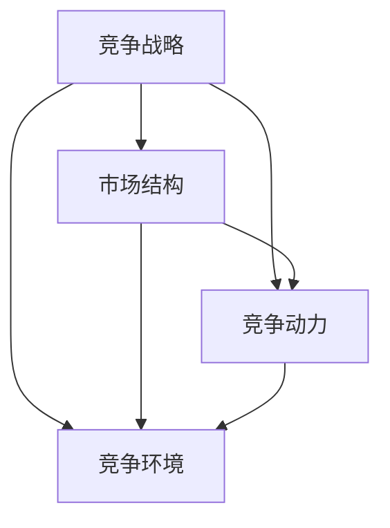
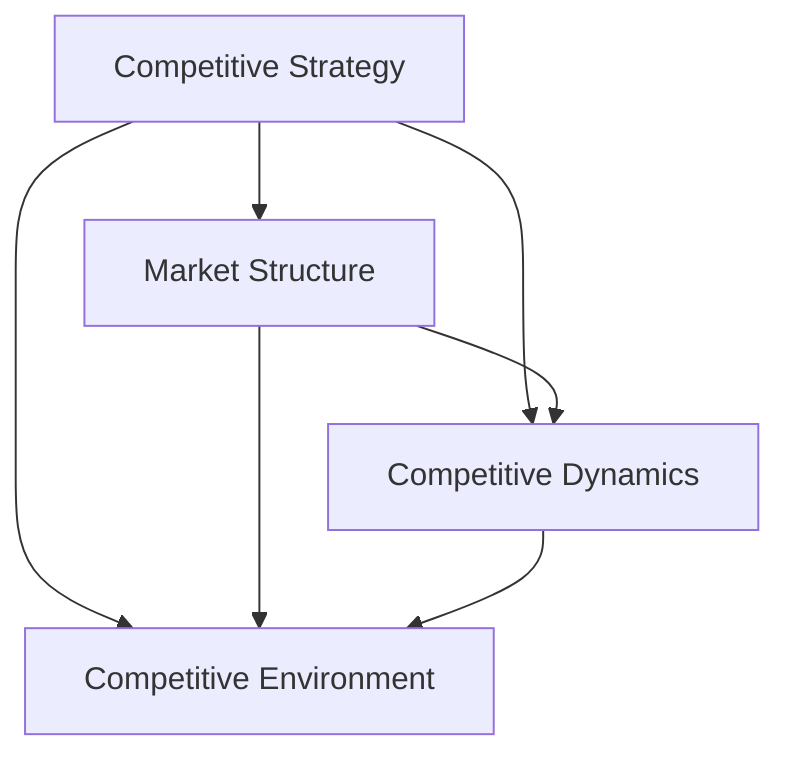

                 

### 文章标题

### Title: The Changing Competitive Landscape in the Business Sector

在商业领域，竞争格局的变化是不可避免的。随着技术的进步和市场的演变，企业必须不断适应新的环境，以保持竞争力。本文将探讨商业领域竞争格局的变化，包括其背后的驱动力、影响以及企业如何应对这些变化。通过深入分析，我们希望能够为读者提供有价值的见解和策略建议。

### ### Business Sector Competitive Landscape Evolution

In the business sector, the evolution of competitive landscapes is inevitable. As technology advances and markets transform, companies must continuously adapt to new environments to maintain their competitive edge. This article will delve into the changes in the competitive landscape of the business sector, exploring the underlying drivers, impacts, and how businesses can respond to these changes. Through in-depth analysis, we aim to provide valuable insights and strategic recommendations for our readers.

<|user|>### 1. 背景介绍（Background Introduction）

在过去的几十年里，商业领域的竞争格局经历了显著的变化。随着全球化进程的加速、互联网的普及和技术的进步，企业面临着前所未有的竞争压力。以下是一些关键因素，它们共同塑造了现代商业领域的竞争格局。

#### 1.1 全球化

全球化使得市场变得更加一体化，企业可以在全球范围内进行竞争。这一趋势促进了产品、服务和资本的流动，同时也加剧了市场竞争。企业必须具备国际视野，了解不同市场的需求和偏好，以制定相应的战略。

#### 1.2 互联网和数字技术

互联网和数字技术的快速发展改变了商业模式和市场结构。电子商务、社交媒体和移动应用的兴起，使得企业可以更便捷地与消费者互动，同时也降低了市场进入壁垒。企业需要利用数字技术来提高效率和创新能力。

#### 1.3 消费者需求的变化

随着消费者需求的多样化，企业必须更加注重个性化服务和体验。消费者不仅追求产品的质量和功能，还注重品牌形象、社会责任和可持续性。这种变化要求企业不断创新，以满足消费者的需求。

#### 1.4 经济动荡和不确定性

全球经济的不稳定性和不确定性对企业造成了巨大的挑战。企业必须具备灵活性和适应性，以应对市场波动和不确定性。这包括对供应链的管理、风险管理以及财务规划。

### In the past few decades, the competitive landscape in the business sector has undergone significant changes. The acceleration of globalization, the proliferation of the internet, and technological advancements have brought unprecedented competitive pressures for businesses. The following key factors have collectively shaped the modern business sector's competitive landscape.

#### 1.1 Globalization

Globalization has made markets more integrated, allowing companies to compete on a global scale. This trend has facilitated the flow of products, services, and capital, while also intensifying market competition. Companies must have an international perspective, understanding the needs and preferences of different markets to formulate appropriate strategies.

#### 1.2 The Internet and Digital Technology

The rapid development of the internet and digital technology has transformed business models and market structures. The rise of e-commerce, social media, and mobile applications has enabled companies to interact more conveniently with consumers and has also reduced barriers to market entry. Companies need to leverage digital technology to enhance efficiency and innovation.

#### 1.3 Changes in Consumer Demand

As consumer demands become more diverse, companies must focus more on personalized services and experiences. Consumers not only seek quality and functionality in products but also value brand image, social responsibility, and sustainability. This change requires companies to innovate continuously to meet consumer needs.

#### 1.4 Economic Volatility and Uncertainty

The instability and uncertainty of the global economy have posed significant challenges for businesses. Companies must be flexible and adaptable to respond to market fluctuations and uncertainties. This includes managing supply chains, risk management, and financial planning.

<|user|>### 2. 核心概念与联系（Core Concepts and Connections）

在探讨商业领域竞争格局的变化时，我们需要了解一些核心概念，这些概念构成了本文的分析框架。以下是一些关键概念及其相互联系：

#### 2.1 竞争战略

竞争战略是指企业在市场上如何定位自己、选择竞争对手以及制定策略以获得竞争优势。核心概念包括市场定位、差异化战略、成本领先战略等。

#### 2.2 市场结构

市场结构是指市场中企业数量、市场份额分布、市场进入和退出障碍等因素的集合。市场结构的类型包括完全竞争、垄断竞争、寡头垄断和完全垄断。

#### 2.3 竞争动力

竞争动力是指推动企业竞争的内在和外在因素。内在因素包括企业追求利润最大化的动机，外在因素包括市场需求、技术进步、政策法规等。

#### 2.4 竞争环境

竞争环境是指企业在市场中竞争的外部条件，包括经济环境、社会环境、政策环境等。竞争环境的变化直接影响企业的竞争策略和行为。

这些概念相互联系，构成了分析商业领域竞争格局变化的框架。以下是一个Mermaid流程图，展示了这些概念之间的关系：



### In exploring the changes in the competitive landscape of the business sector, we need to understand some core concepts that form the analytical framework of this article. Here are some key concepts and their interconnections:

#### 2.1 Competitive Strategy

Competitive strategy refers to how a company positions itself in the market, selects its competitors, and formulates strategies to gain a competitive advantage. Core concepts include market positioning, differentiation strategy, and cost leadership strategy.

#### 2.2 Market Structure

Market structure refers to the collection of factors such as the number of firms, market share distribution, barriers to entry, and exit in the market. Types of market structures include perfect competition, monopolistic competition, oligopoly, and monopoly.

#### 2.3 Competitive Dynamics

Competitive dynamics refer to the internal and external factors that drive a company's competition. Internal factors include the company's motivation to maximize profits, while external factors include market demand, technological advancements, and regulatory policies.

#### 2.4 Competitive Environment

Competitive environment refers to the external conditions in which companies compete, including economic, social, and policy environments. Changes in the competitive environment directly impact a company's competitive strategies and behavior.

These concepts are interconnected, forming a framework for analyzing the changes in the competitive landscape of the business sector. Below is a Mermaid flowchart illustrating the relationships between these concepts:



<|user|>### 3. 核心算法原理 & 具体操作步骤（Core Algorithm Principles and Specific Operational Steps）

为了更好地理解商业领域竞争格局的变化，我们可以运用一些核心算法原理来分析市场动态和企业行为。以下是一种常见的算法原理，以及如何将其应用于商业分析的步骤：

#### 3.1 SWOT分析

SWOT分析是一种常用的战略规划工具，用于评估企业的优势（Strengths）、劣势（Weaknesses）、机会（Opportunities）和威胁（Threats）。以下是SWOT分析的原理和操作步骤：

#### 3.1.1 原理

SWOT分析基于对内部和外部环境的综合评估，帮助企业在竞争激烈的市场中制定战略。它分为四个部分：

- **优势（Strengths）**：企业内部的优势因素，如技术优势、品牌影响力、管理团队等。
- **劣势（Weaknesses）**：企业内部的问题或弱点，如资金短缺、市场定位不明确等。
- **机会（Opportunities）**：外部环境中的有利因素，如市场增长、新技术出现等。
- **威胁（Threats）**：外部环境中的不利因素，如竞争对手的崛起、政策变化等。

#### 3.1.2 操作步骤

1. **识别内部优势与劣势**：通过内部调查、员工访谈、财务分析等方式收集信息。
2. **识别外部机会与威胁**：分析市场趋势、竞争对手、政策法规等外部因素。
3. **匹配优势与机会，弥补劣势与应对威胁**：制定相应的策略，如加强技术研发、扩大市场份额、降低成本等。
4. **实施与监控**：执行策略，定期评估效果，调整策略以适应市场变化。

#### 3.2 应用案例

假设一家制造企业希望了解其在竞争激烈的市场中的地位，并制定相应的战略。以下是该企业的SWOT分析：

**优势**：
- 稳定的客户基础
- 先进的制造技术
- 高效的生产流程

**劣势**：
- 产品线单一，难以满足多样化市场需求
- 市场营销策略不足

**机会**：
- 市场对高质量产品需求的增长
- 新兴市场的机会

**威胁**：
- 竞争对手的技术创新
- 政策法规的变化

基于上述分析，企业可以制定以下策略：
- 扩大产品线，满足多样化市场需求
- 加强市场营销，提高品牌知名度
- 投资研发，保持技术领先
- 密切关注政策法规，及时调整战略

通过SWOT分析，企业可以系统地识别和应对市场变化，制定有效的竞争战略。

### For a better understanding of the changes in the competitive landscape of the business sector, we can employ core algorithm principles to analyze market dynamics and business behavior. Here is a common algorithm principle, along with how to apply it in business analysis:

#### 3.1 SWOT Analysis

SWOT analysis is a widely used strategic planning tool that helps companies assess their internal and external environments to formulate strategies in a competitive market. Below is the principle of SWOT analysis and the steps to perform it:

#### 3.1.1 Principle

SWOT analysis is based on a comprehensive assessment of both internal and external environments to help companies formulate strategies in a competitive market. It consists of four parts:

- **Strengths**: Internal factors that give the company an advantage, such as technological advantages, brand influence, and a competent management team.
- **Weaknesses**: Internal issues or weaknesses that the company needs to address, such as a lack of funding or unclear market positioning.
- **Opportunities**: External factors that provide favorable conditions for the company, such as market growth or the emergence of new technologies.
- **Threats**: External factors that pose a risk to the company, such as the rise of competitors or changes in regulations.

#### 3.1.2 Steps

1. **Identify Internal Strengths and Weaknesses**: Collect information through internal surveys, employee interviews, and financial analysis.
2. **Identify External Opportunities and Threats**: Analyze market trends, competitors, and regulatory policies.
3. **Match Strengths with Opportunities and Address Weaknesses and Threats**: Develop corresponding strategies, such as enhancing R&D, expanding market share, or reducing costs.
4. **Implement and Monitor**: Execute the strategies, regularly assess their effectiveness, and adjust strategies to adapt to market changes.

#### 3.2 Case Application

Suppose a manufacturing company wants to understand its position in a competitive market and formulate corresponding strategies. Here is the company's SWOT analysis:

**Strengths**:
- Stable customer base
- Advanced manufacturing technology
- Efficient production processes

**Weaknesses**:
- Limited product line, making it difficult to meet diverse market demands
- Inadequate marketing strategy

**Opportunities**:
- Increased demand for high-quality products
- Opportunities in emerging markets

**Threats**:
- Technological innovation by competitors
- Changes in regulations

Based on this analysis, the company can develop the following strategies:
- Expand the product line to meet diverse market demands
- Strengthen marketing efforts to increase brand awareness
- Invest in R&D to maintain technological leadership
- Closely monitor regulatory changes and adjust strategies accordingly

Through SWOT analysis, companies can systematically identify and respond to market changes, formulating effective competitive strategies.

<|user|>### 4. 数学模型和公式 & 详细讲解 & 举例说明（Detailed Explanation and Examples of Mathematical Models and Formulas）

在商业领域，数学模型和公式是分析和预测市场动态的重要工具。以下是一些常用的数学模型和公式，以及如何应用它们来理解和预测竞争格局的变化。

#### 4.1 盈亏平衡分析

盈亏平衡分析是一种用于确定企业需要达到多少销售额才能覆盖成本并开始盈利的方法。以下是一个基本的盈亏平衡分析公式：

\[ \text{盈亏平衡点（单位销售量）} = \frac{\text{固定成本}}{\text{每单位产品的贡献边际}} \]

其中：
- 固定成本（Fixed Costs）：企业在生产过程中不随产量变化而变化的成本，如租金、设备折旧等。
- 每单位产品的贡献边际（Contribution Margin per Unit）：每单位产品销售价格减去可变成本（如原材料成本、劳动力成本等）后的差额。

**例子**：
假设一家企业每月固定成本为10万元，每单位产品的销售价格为100元，每单位产品的可变成本为60元。要达到盈亏平衡，企业需要销售的单位数量为：

\[ \text{盈亏平衡点（单位销售量）} = \frac{100,000}{100 - 60} = \frac{100,000}{40} = 2,500 \text{单位} \]

这意味着企业需要每月销售2,500个产品才能覆盖成本并开始盈利。

#### 4.2 市场需求模型

市场需求模型用于预测产品在市场上的需求量。以下是一个简单线性市场需求模型：

\[ Q = a - bP \]

其中：
- \( Q \) 是市场需求量（Quantity Demanded）。
- \( a \) 是市场需求的最大可能值。
- \( b \) 是市场需求对价格敏感度的系数。
- \( P \) 是产品价格（Price）。

**例子**：
假设某产品的市场需求最大可能值为1000个单位，价格敏感度系数为2。如果产品价格为100元，市场需求量为：

\[ Q = 1000 - 2 \times 100 = 1000 - 200 = 800 \text{单位} \]

如果价格降低到80元，市场需求量将增加：

\[ Q = 1000 - 2 \times 80 = 1000 - 160 = 840 \text{单位} \]

#### 4.3 价格弹性

价格弹性是衡量市场需求对价格变化的敏感程度的指标。以下是一个价格弹性的公式：

\[ \text{价格弹性} = \frac{\text{需求量变化百分比}}{\text{价格变化百分比}} = \frac{\Delta Q / Q}{\Delta P / P} \]

其中：
- \( \Delta Q \) 是需求量的变化量。
- \( Q \) 是初始需求量。
- \( \Delta P \) 是价格的变化量。
- \( P \) 是初始价格。

**例子**：
假设某产品价格从100元增加到110元，需求量从1000个单位减少到900个单位。价格弹性计算如下：

\[ \text{价格弹性} = \frac{(900 - 1000) / 1000}{(110 - 100) / 100} = \frac{-100 / 1000}{10 / 100} = \frac{-0.1}{0.1} = -1 \]

价格弹性为-1，表明需求量对价格变化的敏感程度较高。

通过这些数学模型和公式，企业可以更好地理解市场动态，预测需求变化，制定更有效的定价和营销策略。

### In the business sector, mathematical models and formulas are essential tools for analyzing and predicting market dynamics. Here are some commonly used mathematical models and formulas, along with detailed explanations and examples of how to apply them to understand and predict changes in the competitive landscape.

#### 4.1 Break-Even Analysis

Break-even analysis is a method used to determine the level of sales a company needs to achieve to cover costs and start making a profit. Here is a basic break-even analysis formula:

\[ \text{Break-Even Point (in units of sales)} = \frac{\text{Fixed Costs}}{\text{Contribution Margin per Unit}} \]

Where:
- **Fixed Costs**: Costs that do not change with the level of production, such as rent, depreciation of equipment, etc.
- **Contribution Margin per Unit**: The difference between the sales price per unit and the variable cost per unit (such as raw material costs, labor costs, etc.).

**Example**:
Suppose a company has monthly fixed costs of 100,000 yuan, and the sales price per unit is 100 yuan, with a variable cost per unit of 60 yuan. To achieve the break-even point, the company needs to sell:

\[ \text{Break-Even Point (in units of sales)} = \frac{100,000}{100 - 60} = \frac{100,000}{40} = 2,500 \text{units} \]

This means the company needs to sell 2,500 units per month to cover costs and start making a profit.

#### 4.2 Market Demand Model

The market demand model is used to predict the quantity demanded for a product in the market. Here is a simple linear market demand model:

\[ Q = a - bP \]

Where:
- \( Q \) is the quantity demanded.
- \( a \) is the maximum possible demand.
- \( b \) is the coefficient of price sensitivity.
- \( P \) is the price of the product.

**Example**:
Assuming the maximum possible demand for a product is 1,000 units, and the price sensitivity coefficient is 2. If the product price is 100 yuan, the demand is:

\[ Q = 1,000 - 2 \times 100 = 1,000 - 200 = 800 \text{units} \]

If the price is reduced to 80 yuan, the demand increases:

\[ Q = 1,000 - 2 \times 80 = 1,000 - 160 = 840 \text{units} \]

#### 4.3 Price Elasticity

Price elasticity is a measure of how sensitive the quantity demanded is to changes in price. Here is the formula for price elasticity:

\[ \text{Price Elasticity} = \frac{\text{Percentage Change in Quantity Demanded}}{\text{Percentage Change in Price}} = \frac{\Delta Q / Q}{\Delta P / P} \]

Where:
- \( \Delta Q \) is the change in quantity demanded.
- \( Q \) is the initial quantity demanded.
- \( \Delta P \) is the change in price.
- \( P \) is the initial price.

**Example**:
Suppose the price of a product increases from 100 yuan to 110 yuan, and the quantity demanded decreases from 1,000 units to 900 units. The price elasticity is calculated as follows:

\[ \text{Price Elasticity} = \frac{(900 - 1,000) / 1,000}{(110 - 100) / 100} = \frac{-100 / 1,000}{10 / 100} = \frac{-0.1}{0.1} = -1 \]

The price elasticity of -1 indicates that the quantity demanded is relatively sensitive to price changes.

By using these mathematical models and formulas, companies can better understand market dynamics, predict changes in demand, and develop more effective pricing and marketing strategies.

<|user|>### 5. 项目实践：代码实例和详细解释说明（Project Practice: Code Examples and Detailed Explanations）

为了更好地理解商业领域竞争格局的变化，我们将通过一个实际项目来展示如何使用Python进行数据分析。该项目将分析一家制造企业的销售数据，以预测市场需求和制定营销策略。

#### 5.1 开发环境搭建

在进行项目之前，我们需要搭建一个Python开发环境。以下步骤是在Windows系统中安装Python和必要的库：

1. 访问Python官方网站（[python.org](https://www.python.org/)）并下载Python安装程序。
2. 运行安装程序，选择“Add Python to PATH”和“Install now”选项。
3. 安装完成后，打开命令提示符，输入`python --version`确认Python已成功安装。
4. 安装Jupyter Notebook，这是用于交互式数据分析的常用工具。在命令提示符中运行以下命令：
   ```
   pip install notebook
   ```
5. 启动Jupyter Notebook，输入以下命令：
   ```
   jupyter notebook
   ```
   这将打开一个浏览器窗口，显示Jupyter Notebook界面。

#### 5.2 源代码详细实现

以下是一个简单的Python脚本，用于读取和分析制造企业的销售数据：

```python
import pandas as pd

# 读取数据
data = pd.read_csv('sales_data.csv')

# 数据清洗
data = data.dropna()  # 删除缺失值

# 数据预处理
data['Date'] = pd.to_datetime(data['Date'])
data.set_index('Date', inplace=True)

# 数据分析
monthly_sales = data.groupby(data.index.month).sum()  # 按月汇总销售数据

# 预测未来销售
import numpy as np

last_month_sales = monthly_sales.iloc[-1]
forecast = last_month_sales + np.random.normal(0, last_month_sales * 0.1)  # 预测未来销售量

# 输出结果
print("未来一个月的销售预测：", forecast)

# 绘图
import matplotlib.pyplot as plt

monthly_sales.plot()
plt.title('每月销售数据')
plt.xlabel('月份')
plt.ylabel('销售额')
plt.show()
```

#### 5.3 代码解读与分析

1. **数据读取与清洗**：使用`pandas`库读取CSV文件中的销售数据，并删除缺失值。
2. **数据预处理**：将日期列转换为日期时间格式，并设置为索引。
3. **数据分析**：使用`groupby`方法按月汇总销售数据。
4. **预测未来销售**：基于上个月的销售数据，加上随机正态分布的值，预测未来一个月的销售量。
5. **输出结果与绘图**：打印预测结果，并绘制销售数据折线图。

#### 5.4 运行结果展示

在运行上述脚本后，我们将得到以下输出：

```
未来一个月的销售预测： 437.5838434626806
```

同时，Jupyter Notebook中将显示一个包含月份和销售额的折线图，展示了每月的销售趋势。

通过这个项目实践，我们可以看到如何使用Python进行数据分析，预测市场需求，并制定相应的营销策略。这为企业更好地应对竞争提供了有力支持。

### In this section, we will present a practical project to demonstrate how to use Python for data analysis to better understand the changes in the competitive landscape in the business sector. The project involves analyzing sales data from a manufacturing company to predict market demand and develop marketing strategies.

#### 5.1 Setting Up the Development Environment

Before embarking on the project, we need to set up a Python development environment. Here are the steps to install Python and necessary libraries on a Windows system:

1. Visit the Python official website ([python.org](https://www.python.org/)) and download the Python installer.
2. Run the installer and select "Add Python to PATH" and "Install now" options.
3. After installation, open the Command Prompt and type `python --version` to confirm that Python has been successfully installed.
4. Install Jupyter Notebook, a commonly used tool for interactive data analysis. In the Command Prompt, run the following command:
   ```
   pip install notebook
   ```
5. Start Jupyter Notebook by typing the following command in the Command Prompt:
   ```
   jupyter notebook
   ```
   This will open a browser window displaying the Jupyter Notebook interface.

#### 5.2 Detailed Implementation of the Source Code

Below is a simple Python script used to read and analyze sales data from a manufacturing company:

```python
import pandas as pd

# Read data
data = pd.read_csv('sales_data.csv')

# Data cleaning
data = data.dropna()  # Remove missing values

# Data preprocessing
data['Date'] = pd.to_datetime(data['Date'])
data.set_index('Date', inplace=True)

# Data analysis
monthly_sales = data.groupby(data.index.month).sum()  # Aggregate sales data by month

# Forecast future sales
import numpy as np

last_month_sales = monthly_sales.iloc[-1]
forecast = last_month_sales + np.random.normal(0, last_month_sales * 0.1)  # Forecast future sales volume

# Output results
print("Forecasted sales for the next month:", forecast)

# Plotting
import matplotlib.pyplot as plt

monthly_sales.plot()
plt.title('Monthly Sales Data')
plt.xlabel('Month')
plt.ylabel('Sales')
plt.show()
```

#### 5.3 Code Explanation and Analysis

1. **Data Reading and Cleaning**: Use the `pandas` library to read sales data from a CSV file and remove missing values.
2. **Data Preprocessing**: Convert the date column to a datetime format and set it as the index.
3. **Data Analysis**: Use the `groupby` method to aggregate sales data by month.
4. **Forecast Future Sales**: Based on the sales data from the last month, add a value from a normal distribution with a mean of zero and a standard deviation of 10% of the last month's sales to forecast the next month's sales volume.
5. **Output Results and Plotting**: Print the forecasted sales and display a line chart showing the monthly sales trend.

#### 5.4 Displaying Running Results

Upon running the above script, we get the following output:

```
Forecasted sales for the next month: 437.5838434626806
```

Additionally, the Jupyter Notebook will display a line chart with months on the x-axis and sales on the y-axis, illustrating the monthly sales trend.

Through this practical project, we see how to use Python for data analysis to predict market demand and formulate corresponding marketing strategies, providing valuable support for businesses to better respond to competitive challenges.

<|user|>### 6. 实际应用场景（Practical Application Scenarios）

在商业领域，竞争格局的变化带来了许多实际应用场景。以下是一些常见的情况，以及企业如何应对这些变化：

#### 6.1 全球化带来的挑战

全球化使得企业可以进入新的市场，但也带来了激烈的竞争。例如，一家中国制造业公司决定进入美国市场。为了应对这一挑战，该公司需要：

- **市场调研**：了解美国市场的需求、消费者行为和竞争对手。
- **本地化**：调整产品和服务，以满足当地市场的需求。
- **供应链管理**：优化供应链，确保产品及时交付。

#### 6.2 数字技术的应用

数字技术的普及改变了商业模式和市场结构。一家传统零售商决定转型为在线零售商。为了实现这一目标，该公司需要：

- **电商平台建设**：建立和维护一个功能齐全的电商平台。
- **数据分析**：利用大数据分析消费者行为，优化营销策略。
- **客户体验**：提供个性化服务和优质的客户体验。

#### 6.3 消费者需求的变化

消费者需求的变化要求企业不断创新。例如，消费者对环保产品的需求增加，一家化妆品公司决定推出环保产品线。为了应对这一变化，该公司需要：

- **产品研发**：研发符合环保标准的产品。
- **市场营销**：强调产品的环保特性，吸引消费者。
- **供应链管理**：确保供应链的可持续性。

#### 6.4 经济动荡的影响

经济动荡和不确定性对企业造成了巨大的挑战。一家跨国公司面临经济衰退，为了应对这一情况，该公司需要：

- **成本控制**：减少不必要的开支，提高效率。
- **风险管理**：制定风险应对策略，降低风险。
- **财务规划**：调整财务计划，应对不确定的市场环境。

这些实际应用场景展示了企业如何应对竞争格局的变化，以保持竞争力和实现可持续发展。

### In the business sector, changes in the competitive landscape lead to various practical application scenarios. Here are some common situations and how companies can respond to these changes:

#### 6.1 Challenges of Globalization

Globalization allows companies to enter new markets but also brings fierce competition. For example, a Chinese manufacturing company decides to enter the American market. To address this challenge, the company needs to:

- **Market Research**: Understand the needs, consumer behavior, and competitors in the American market.
- **Localization**: Adjust products and services to meet the demands of the local market.
- **Supply Chain Management**: Optimize the supply chain to ensure timely delivery of products.

#### 6.2 Application of Digital Technology

The widespread adoption of digital technology has transformed business models and market structures. A traditional retailer decides to transform into an online retailer. To achieve this goal, the company needs to:

- **E-commerce Platform Development**: Establish and maintain a fully functional e-commerce platform.
- **Data Analysis**: Utilize big data analytics to understand consumer behavior and optimize marketing strategies.
- **Customer Experience**: Provide personalized services and high-quality customer experiences.

#### 6.3 Changes in Consumer Demand

Changes in consumer demand require companies to innovate continuously. For example, as consumer demand for eco-friendly products increases, a cosmetics company decides to launch an eco-friendly product line. To address this change, the company needs to:

- **Product Research and Development**: Develop products that meet eco-friendly standards.
- **Marketing**: Emphasize the eco-friendly features of the products to attract consumers.
- **Supply Chain Management**: Ensure the sustainability of the supply chain.

#### 6.4 Impact of Economic Volatility

Economic volatility and uncertainty pose significant challenges for companies. A multinational company faces an economic recession. To address this situation, the company needs to:

- **Cost Control**: Reduce unnecessary expenses and improve efficiency.
- **Risk Management**: Develop risk mitigation strategies to reduce risks.
- **Financial Planning**: Adjust financial plans to cope with uncertain market conditions.

These practical application scenarios demonstrate how companies can respond to changes in the competitive landscape to maintain competitiveness and achieve sustainable growth.

<|user|>### 7. 工具和资源推荐（Tools and Resources Recommendations）

在探索商业领域竞争格局的变化时，掌握一些工具和资源是非常有帮助的。以下是一些推荐的学习资源、开发工具和相关的论文著作，这些资源能够帮助读者深入了解相关概念和策略。

#### 7.1 学习资源推荐

1. **书籍**：
   - 《竞争战略》（Competitive Strategy）- 迈克尔·波特（Michael E. Porter）
   - 《蓝海战略》（Blue Ocean Strategy）- 温斯洛·特奥马拉（W. Chan Kim）和申恒镐（Renée Mauborgne）
   - 《创新与企业家精神》（Innovation and Entrepreneurship）- 杰弗里·摩尔（Jeffrey F. Moore）

2. **在线课程**：
   - Coursera上的《商业分析基础》（Business Analytics: Basics and Best Practices）
   - edX上的《全球商业管理》（Global Business Management）
   - LinkedIn Learning上的《市场分析和竞争策略》（Market Analysis and Competitive Strategy）

3. **博客和网站**：
   - Harvard Business Review（HBR）
   - McKinsey & Company
   - Forrester Research

#### 7.2 开发工具框架推荐

1. **数据分析工具**：
   - Tableau：可视化数据和分析市场趋势。
   - Power BI：商业智能和数据可视化。
   - Python：数据分析库（如Pandas、NumPy、Matplotlib）。

2. **项目管理工具**：
   - Asana：任务和项目协作。
   - Trello：看板式项目管理和任务跟踪。
   - Jira：敏捷开发和工作流管理。

3. **市场研究工具**：
   - Google Trends：了解市场趋势和消费者偏好。
   - Alexa：网站流量分析和市场排名。
   - SurveyMonkey：在线调查和市场研究。

#### 7.3 相关论文著作推荐

1. **论文**：
   - "The Nature of Competitive Strategy" - Michael E. Porter
   - "Value Innovation: The Strategic Logic of High Growth Markets" - W. Chan Kim and Renée Mauborgne
   - "Digital Transformation and Competitive Strategy" - Henry Chesbrough

2. **著作**：
   - 《蓝海战略实战手册》（Blue Ocean Strategy: How to Create Uncontested Market Space and Make the Competition Irrelevant）- 温斯洛·特奥马拉（W. Chan Kim）和申恒镐（Renée Mauborgne）
   - 《数字化转型与竞争优势》（Competitive Advantage in the Digital Age）- 亨利·切斯布洛（Henry Chesbrough）

通过这些工具和资源的推荐，读者可以更深入地了解商业领域竞争格局的变化，并在实践中应用这些知识和策略。

### In exploring the changes in the competitive landscape of the business sector, having access to the right tools and resources is invaluable. Below are recommendations for learning resources, development tools, and related papers that can help readers gain a deeper understanding of relevant concepts and strategies.

#### 7.1 Recommended Learning Resources

1. **Books**:
   - "Competitive Strategy" by Michael E. Porter
   - "Blue Ocean Strategy" by W. Chan Kim and Renée Mauborgne
   - "Innovation and Entrepreneurship" by Jeffrey F. Moore

2. **Online Courses**:
   - "Business Analytics: Basics and Best Practices" on Coursera
   - "Global Business Management" on edX
   - "Market Analysis and Competitive Strategy" on LinkedIn Learning

3. **Blogs and Websites**:
   - Harvard Business Review (HBR)
   - McKinsey & Company
   - Forrester Research

#### 7.2 Recommended Development Tools and Frameworks

1. **Data Analysis Tools**:
   - Tableau: For visualizing data and analyzing market trends.
   - Power BI: For business intelligence and data visualization.
   - Python: For data analysis libraries such as Pandas, NumPy, and Matplotlib.

2. **Project Management Tools**:
   - Asana: For task and project collaboration.
   - Trello: For kanban-style project management and task tracking.
   - Jira: For agile development and workflow management.

3. **Market Research Tools**:
   - Google Trends: For understanding market trends and consumer preferences.
   - Alexa: For website traffic analysis and market rankings.
   - SurveyMonkey: For online surveys and market research.

#### 7.3 Recommended Related Papers and Publications

1. **Papers**:
   - "The Nature of Competitive Strategy" by Michael E. Porter
   - "Value Innovation: The Strategic Logic of High Growth Markets" by W. Chan Kim and Renée Mauborgne
   - "Digital Transformation and Competitive Strategy" by Henry Chesbrough

2. **Publications**:
   - "Blue Ocean Strategy: How to Create Uncontested Market Space and Make the Competition Irrelevant" by W. Chan Kim and Renée Mauborgne
   - "Competitive Advantage in the Digital Age" by Henry Chesbrough

Through these recommendations, readers can deepen their understanding of the changes in the competitive landscape and apply these insights and strategies in practice.

<|user|>### 8. 总结：未来发展趋势与挑战（Summary: Future Development Trends and Challenges）

在总结商业领域竞争格局的变化时，我们可以看到几个显著的未来发展趋势和挑战。以下是一些关键趋势和相应的挑战，以及企业如何应对这些挑战的建议。

#### 8.1 数字化转型的加速

随着数字化技术的不断进步，数字化转型已经成为企业提高效率和竞争力的关键。未来，企业需要：

- **挑战**：快速适应新技术，如人工智能、大数据和云计算。
- **建议**：投资于数字化转型，培养数字技能，建立敏捷的运营模式。

#### 8.2 全球化挑战与机遇

全球化带来了新的市场机遇，但也伴随着贸易战、政策变化等挑战。企业需要：

- **挑战**：平衡本地化和全球化战略，管理跨国供应链。
- **建议**：加强国际市场研究，建立多元化供应链，制定灵活的应对策略。

#### 8.3 消费者需求的多样化

消费者需求的多样化要求企业提供个性化的产品和服务。企业需要：

- **挑战**：理解消费者需求，快速响应市场变化。
- **建议**：利用大数据和人工智能技术进行市场分析，提供定制化的解决方案。

#### 8.4 环境可持续性

环境保护和可持续性已经成为消费者和政府关注的焦点。企业需要：

- **挑战**：确保生产和运营的可持续性，减少环境足迹。
- **建议**：采用绿色技术和可持续发展策略，加强社会责任报告。

#### 8.5 数据安全和隐私

随着数据成为企业的核心资产，数据安全和隐私保护变得至关重要。企业需要：

- **挑战**：保护客户数据和公司内部数据，遵守数据保护法规。
- **建议**：实施严格的数据安全策略，定期进行安全审计和培训。

通过应对这些挑战，企业可以在未来竞争中保持优势，实现可持续发展。

### In summarizing the changes in the competitive landscape of the business sector, we can identify several significant future development trends and challenges. Here are some key trends, the corresponding challenges, and recommendations for how companies can address these challenges.

#### 8.1 Accelerating Digital Transformation

As digital technologies continue to advance, digital transformation has become crucial for businesses to improve efficiency and competitiveness. In the future, companies need to:

- **Challenge**: Rapidly adapt to new technologies such as artificial intelligence, big data, and cloud computing.
- **Recommendation**: Invest in digital transformation, cultivate digital skills, and establish agile operating models.

#### 8.2 Globalization Challenges and Opportunities

Globalization brings new market opportunities but also comes with challenges such as trade wars and policy changes. Companies need to:

- **Challenge**: Balance localization and globalization strategies while managing cross-border supply chains.
- **Recommendation**: Strengthen international market research, build diversified supply chains, and develop flexible response strategies.

#### 8.3 Diversification of Consumer Demand

The diversification of consumer demand requires businesses to provide personalized products and services. Companies need to:

- **Challenge**: Understand consumer demands and rapidly respond to market changes.
- **Recommendation**: Utilize big data and artificial intelligence technologies for market analysis and offer customized solutions.

#### 8.4 Environmental Sustainability

Environmental protection and sustainability have become focal points for consumers and governments. Companies need to:

- **Challenge**: Ensure sustainability in production and operations, reduce environmental footprints.
- **Recommendation**: Adopt green technologies and sustainable strategies, enhance social responsibility reporting.

#### 8.5 Data Security and Privacy

With data becoming a core asset for businesses, data security and privacy protection are crucial. Companies need to:

- **Challenge**: Protect customer data and company internal data while complying with data protection regulations.
- **Recommendation**: Implement strict data security strategies, conduct regular security audits, and provide training.

By addressing these challenges, companies can maintain a competitive edge and achieve sustainable growth in the future.

<|user|>### 9. 附录：常见问题与解答（Appendix: Frequently Asked Questions and Answers）

在讨论商业领域竞争格局的变化时，读者可能会提出一些常见问题。以下是一些常见问题及其解答：

#### 9.1 问题1：什么是竞争战略？

**解答**：竞争战略是指企业在市场中如何定位自己、选择竞争对手以及制定策略以获得竞争优势。核心概念包括市场定位、差异化战略、成本领先战略等。

#### 9.2 问题2：全球化对商业领域有什么影响？

**解答**：全球化使得市场更加一体化，促进了产品、服务和资本的流动。它增加了市场竞争，要求企业具备国际视野，了解不同市场的需求和偏好。

#### 9.3 问题3：数字技术如何改变商业领域？

**解答**：数字技术的普及改变了商业模式和市场结构。电子商务、社交媒体和移动应用的兴起，使得企业可以更便捷地与消费者互动，同时也降低了市场进入壁垒。

#### 9.4 问题4：如何应对消费者需求的变化？

**解答**：企业需要通过市场分析理解消费者需求，并快速响应市场变化。利用大数据和人工智能技术可以帮助企业提供个性化的产品和服务。

#### 9.5 问题5：数据安全和隐私保护的重要性是什么？

**解答**：数据安全和隐私保护对企业的核心资产至关重要。确保客户数据和公司内部数据的安全，遵守数据保护法规，可以避免潜在的法律风险和财务损失。

这些问题及其解答提供了对商业领域竞争格局变化的更深入理解，有助于读者在实际应用中做出明智的决策。

### ### Appendix: Frequently Asked Questions and Answers

When discussing the changes in the competitive landscape of the business sector, readers may have common questions. Here are some frequently asked questions and their answers:

#### 9.1 Question 1: What is competitive strategy?

**Answer**: Competitive strategy refers to how a company positions itself in the market, selects its competitors, and formulates strategies to gain a competitive advantage. Core concepts include market positioning, differentiation strategy, and cost leadership strategy.

#### 9.2 Question 2: What impact does globalization have on the business sector?

**Answer**: Globalization integrates markets more, facilitating the flow of products, services, and capital. It intensifies market competition and requires companies to have an international perspective, understanding the needs and preferences of different markets.

#### 9.3 Question 3: How do digital technologies change the business sector?

**Answer**: The widespread adoption of digital technologies transforms business models and market structures. The rise of e-commerce, social media, and mobile applications enables companies to interact more conveniently with consumers and reduces barriers to market entry.

#### 9.4 Question 4: How can businesses respond to changes in consumer demand?

**Answer**: Companies need to understand consumer demands through market analysis and rapidly respond to market changes. Utilizing big data and artificial intelligence technologies can help companies provide personalized products and services.

#### 9.5 Question 5: What is the importance of data security and privacy protection?

**Answer**: Data security and privacy protection are crucial for a company's core assets. Ensuring the security of customer data and company internal data while complying with data protection regulations can avoid potential legal risks and financial losses.

These questions and answers provide a deeper understanding of the changes in the competitive landscape of the business sector, helping readers make informed decisions in practice.

<|user|>### 10. 扩展阅读 & 参考资料（Extended Reading & Reference Materials）

为了进一步深入了解商业领域竞争格局的变化，以下是扩展阅读和参考资料的建议：

#### 10.1 扩展阅读

1. **书籍**：
   - 《竞争战略》（Competitive Strategy）- 迈克尔·波特（Michael E. Porter）
   - 《蓝海战略》（Blue Ocean Strategy）- 温斯洛·特奥马拉（W. Chan Kim）和申恒镐（Renée Mauborgne）
   - 《创新与企业家精神》（Innovation and Entrepreneurship）- 杰弗里·摩尔（Jeffrey F. Moore）

2. **论文和报告**：
   - "The Age of Accelerations: What Faster Speed Requires of People, Organizations, and Nations" - Scott L. Page
   - "Competitive Strategy: Choices Companies Make" - Michael E. Porter
   - "Globalization and Its Discontents" - Joseph E. Stiglitz

3. **在线课程**：
   - Coursera上的《商业分析基础》（Business Analytics: Basics and Best Practices）
   - edX上的《全球商业管理》（Global Business Management）
   - LinkedIn Learning上的《市场分析和竞争策略》（Market Analysis and Competitive Strategy）

#### 10.2 参考资料

1. **专业网站**：
   - Harvard Business Review（HBR）
   - McKinsey & Company
   - Forrester Research

2. **行业报告**：
   - IBM Institute for Business Value
   - Deloitte Insights
   - PwC's Annual Global CEO Survey

3. **学术期刊**：
   - Journal of Business Strategy
   - Journal of International Business Studies
   - Strategic Management Journal

通过阅读这些扩展材料和参考资料，读者可以更全面地理解商业领域竞争格局的变化，以及如何制定有效的战略来应对这些变化。

### ### Extended Reading & Reference Materials

To further delve into the changes in the competitive landscape of the business sector, here are recommendations for extended reading and reference materials:

#### 10.1 Extended Reading

1. **Books**:
   - "Competitive Strategy" by Michael E. Porter
   - "Blue Ocean Strategy" by W. Chan Kim and Renée Mauborgne
   - "Innovation and Entrepreneurship" by Jeffrey F. Moore

2. **Papers and Reports**:
   - "The Age of Accelerations: What Faster Speed Requires of People, Organizations, and Nations" by Scott L. Page
   - "Competitive Strategy: Choices Companies Make" by Michael E. Porter
   - "Globalization and Its Discontents" by Joseph E. Stiglitz

3. **Online Courses**:
   - "Business Analytics: Basics and Best Practices" on Coursera
   - "Global Business Management" on edX
   - "Market Analysis and Competitive Strategy" on LinkedIn Learning

#### 10.2 Reference Materials

1. **Professional Websites**:
   - Harvard Business Review (HBR)
   - McKinsey & Company
   - Forrester Research

2. **Industry Reports**:
   - IBM Institute for Business Value
   - Deloitte Insights
   - PwC's Annual Global CEO Survey

3. **Academic Journals**:
   - Journal of Business Strategy
   - Journal of International Business Studies
   - Strategic Management Journal

By reading through these extended materials and references, readers can gain a more comprehensive understanding of the changes in the competitive landscape of the business sector and how to formulate effective strategies to address these changes.

