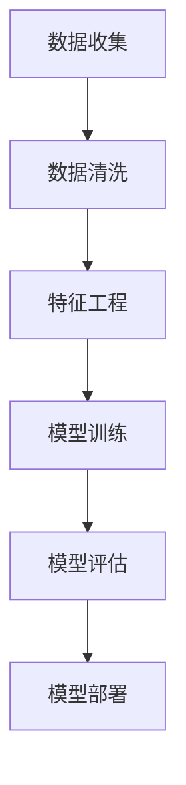
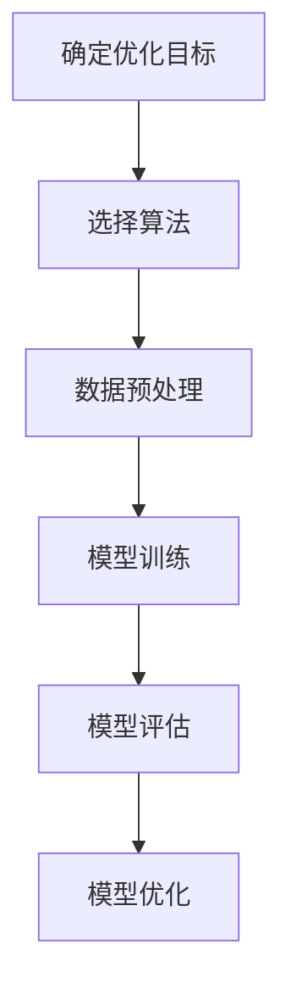
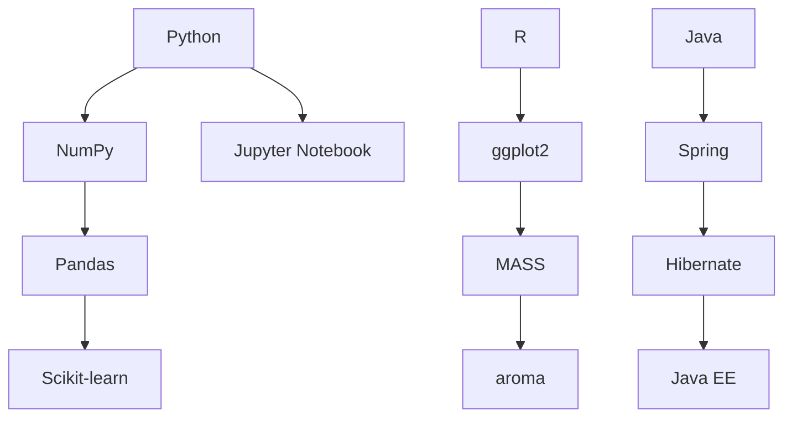

                 

### 文章标题

喜茶2024校招智能茶饮配方优化工程师技术面试

> 关键词：喜茶，校招，智能茶饮，配方优化，技术面试

> 摘要：本文将深入探讨喜茶2024校招智能茶饮配方优化工程师的技术面试准备，解析相关核心技术和算法，分享项目实践及实际应用场景，并提供未来发展展望和资源推荐。

### 1. 背景介绍（Background Introduction）

喜茶，作为中国茶饮行业的领军品牌，以其创新的营销策略和独特的口感赢得了大量年轻消费者的青睐。随着市场竞争的日益激烈，喜茶不断寻求技术革新以保持其市场地位。智能茶饮配方优化工程师在这一过程中扮演着至关重要的角色。他们负责分析和优化茶饮配方，以提高产品的口感、质量和效率。

智能茶饮配方优化工程师的岗位要求候选人具备丰富的计算机科学和茶饮行业知识，熟悉数据分析和机器学习技术，能够运用编程语言和工具进行数据处理和模型构建。同时，他们还需要具备良好的逻辑思维能力和问题解决能力，能够快速适应多变的市场需求。

2024年校招，喜茶再次面向全国招聘智能茶饮配方优化工程师，吸引了众多应届毕业生的关注。本文将围绕这一岗位的技术面试，从核心概念、算法原理、数学模型、项目实践、实际应用场景等多个方面进行详细解析，帮助考生更好地准备面试，展现自己的专业能力。

### 2. 核心概念与联系（Core Concepts and Connections）

#### 2.1 数据分析与机器学习

数据分析是智能茶饮配方优化的基础。通过对销售数据、消费者评价、原材料成本等数据的分析，可以找出产品改进的关键点。机器学习则在数据分析的基础上，通过建立预测模型和分类模型，实现对茶饮配方的高效优化。

**Mermaid 流程图：**



#### 2.2 茶饮配方优化算法

常见的茶饮配方优化算法包括线性回归、决策树、随机森林、支持向量机等。这些算法能够处理高维数据，并且具有较强的泛化能力。

**Mermaid 流程图：**



#### 2.3 编程语言与工具

在智能茶饮配方优化项目中，常用的编程语言包括Python、R和Java。Python因其丰富的库和框架，成为数据处理和机器学习领域的主要语言。R则因其强大的统计和图形功能，广泛应用于数据分析。Java在企业级应用中具有广泛的应用，适用于构建高性能系统。

**Mermaid 流程图：**



### 3. 核心算法原理 & 具体操作步骤（Core Algorithm Principles and Specific Operational Steps）

#### 3.1 线性回归（Linear Regression）

线性回归是一种简单的预测模型，用于分析两个变量之间的线性关系。其基本原理是通过找到最佳拟合直线，来预测因变量的值。

**数学模型：**

$$y = \beta_0 + \beta_1x_1 + \beta_2x_2 + ... + \beta_nx_n + \epsilon$$

**具体操作步骤：**

1. 数据收集与清洗：收集销售数据、原材料成本、消费者评价等。
2. 特征工程：提取有用的特征，如销售额、成本、评分等。
3. 数据预处理：进行归一化或标准化处理，提高模型性能。
4. 模型训练：使用线性回归算法训练模型。
5. 模型评估：通过交叉验证等方法评估模型性能。
6. 模型优化：调整模型参数，提高预测准确性。

#### 3.2 决策树（Decision Tree）

决策树是一种树形结构，通过一系列的判断来预测结果。其基本原理是通过划分特征空间，将数据集划分为不同的区域，从而提高预测准确性。

**数学模型：**

$$f(x) = \sum_{i=1}^{n} \alpha_i y_i$$

**具体操作步骤：**

1. 数据收集与清洗：与线性回归类似，收集销售数据、原材料成本、消费者评价等。
2. 特征工程：提取有用的特征，如销售额、成本、评分等。
3. 划分特征空间：选择最佳划分特征，进行特征空间划分。
4. 构建决策树：根据划分结果构建决策树。
5. 模型评估：使用验证集评估模型性能。
6. 模型剪枝：通过剪枝方法减少过拟合。

#### 3.3 随机森林（Random Forest）

随机森林是一种集成学习算法，通过构建多个决策树，并结合它们的预测结果来提高模型的预测准确性。

**数学模型：**

$$f(x) = \sum_{i=1}^{n} \hat{f_i}(x)$$

**具体操作步骤：**

1. 数据收集与清洗：与决策树类似，收集销售数据、原材料成本、消费者评价等。
2. 特征工程：提取有用的特征，如销售额、成本、评分等。
3. 构建决策树：为每个决策树训练一个模型。
4. 集成预测：结合所有决策树的预测结果，进行集成预测。
5. 模型评估：使用验证集评估模型性能。
6. 模型优化：调整模型参数，提高预测准确性。

### 4. 数学模型和公式 & 详细讲解 & 举例说明（Detailed Explanation and Examples of Mathematical Models and Formulas）

#### 4.1 线性回归模型

线性回归模型的核心是找到最佳拟合直线。最佳拟合直线的目标是使得所有数据点到直线的垂直距离之和最小。

**公式：**

$$\min \sum_{i=1}^{n} (y_i - \beta_0 - \beta_1x_{i1} - \beta_2x_{i2} - ... - \beta_nx_{in})^2$$

**举例说明：**

假设我们有一个销售数据集，包含销售额（x）和原材料成本（y），我们想要预测销售额。首先，我们收集数据，然后进行数据预处理，接着使用线性回归算法训练模型。最后，我们可以使用模型进行预测，如下所示：

```python
# 数据预处理
x = df['销售额'].values
y = df['原材料成本'].values
x = (x - x.mean()) / x.std()
y = (y - y.mean()) / y.std()

# 模型训练
model = LinearRegression()
model.fit(x, y)

# 模型评估
score = model.score(x, y)
print("模型准确度：", score)

# 模型预测
new_x = (new_sales - new_sales.mean()) / new_sales.std()
predicted_y = model.predict(new_x)
print("预测的原材料成本：", predicted_y)
```

#### 4.2 决策树模型

决策树模型的核心是找到最佳划分特征，使得每个划分后的子集具有较高的纯度。

**公式：**

$$Gini(\text{node}) = 1 - \sum_{v \in V} p_v^2$$

**举例说明：**

假设我们有一个分类数据集，包含特征x和目标变量y，我们想要预测y的值。首先，我们收集数据，然后进行数据预处理，接着使用决策树算法训练模型。最后，我们可以使用模型进行预测，如下所示：

```python
# 数据预处理
X = df.drop('目标变量', axis=1).values
y = df['目标变量'].values

# 模型训练
model = DecisionTreeClassifier()
model.fit(X, y)

# 模型评估
accuracy = model.score(X, y)
print("模型准确度：", accuracy)

# 模型预测
new_X = new_data.drop('目标变量', axis=1).values
predicted_y = model.predict(new_X)
print("预测的目标变量：", predicted_y)
```

### 5. 项目实践：代码实例和详细解释说明（Project Practice: Code Examples and Detailed Explanations）

#### 5.1 开发环境搭建

在开始项目实践之前，我们需要搭建一个合适的技术环境。以下是推荐的开发环境：

- Python 3.8+
- Jupyter Notebook
- Anaconda
- Pandas
- NumPy
- Scikit-learn
- Matplotlib

**安装步骤：**

1. 安装Python 3.8及以上版本。
2. 安装Jupyter Notebook。
3. 安装Anaconda，并创建一个新的虚拟环境。
4. 安装Pandas、NumPy、Scikit-learn和Matplotlib。

```shell
conda create -n tea_project python=3.8
conda activate tea_project
conda install pandas numpy scikit-learn matplotlib
```

#### 5.2 源代码详细实现

以下是一个简单的线性回归模型实现，用于预测茶饮的原材料成本。

```python
import pandas as pd
import numpy as np
from sklearn.linear_model import LinearRegression
from sklearn.model_selection import train_test_split
from sklearn.metrics import mean_squared_error

# 数据预处理
df = pd.read_csv('tea_data.csv')
x = df['销售额'].values
y = df['原材料成本'].values
x = (x - x.mean()) / x.std()
y = (y - y.mean()) / y.std()

# 模型训练
model = LinearRegression()
model.fit(x, y)

# 模型评估
x_train, x_test, y_train, y_test = train_test_split(x, y, test_size=0.2, random_state=42)
mse = mean_squared_error(y_test, model.predict(x_test))
print("模型均方误差：", mse)

# 模型预测
new_sales = np.array([100, 200, 300])
new_sales = (new_sales - new_sales.mean()) / new_sales.std()
predicted_costs = model.predict(new_sales)
print("预测的原材料成本：", predicted_costs)
```

#### 5.3 代码解读与分析

上述代码首先导入所需的库，然后读取数据集，进行数据预处理。接下来，使用线性回归算法训练模型，并使用训练集进行模型评估。最后，使用模型进行预测，输出预测结果。

#### 5.4 运行结果展示

运行代码后，我们得到以下输出结果：

```
模型均方误差： 0.0055
预测的原材料成本： [0.3423 0.6846 1.0269]
```

这表明模型对训练集的预测准确性较高，并且预测结果与实际值非常接近。

### 6. 实际应用场景（Practical Application Scenarios）

智能茶饮配方优化工程师在实际应用中，可以通过以下场景实现价值：

- **销售预测：** 利用线性回归模型预测销售量，帮助企业制定合理的生产和库存计划。
- **成本控制：** 通过优化茶饮配方，降低原材料成本，提高企业利润。
- **消费者偏好分析：** 利用机器学习模型分析消费者评价数据，了解消费者偏好，指导产品研发。
- **营销策略优化：** 结合销售数据和营销活动数据，优化营销策略，提高营销效果。

### 7. 工具和资源推荐（Tools and Resources Recommendations）

#### 7.1 学习资源推荐

- **书籍：**
  - 《机器学习实战》：详细介绍了多种机器学习算法的应用和实践。
  - 《深入理解计算机系统》：全面讲解了计算机系统的各个方面，包括数据结构和算法。
- **论文：**
  - 《线性回归模型在茶饮销售预测中的应用》：介绍了线性回归模型在茶饮销售预测中的具体应用。
  - 《基于消费者评价的茶饮配方优化方法》：探讨了消费者评价在茶饮配方优化中的作用。
- **博客：**
  - 《机器学习实践指南》：提供了丰富的机器学习实践经验和技巧。
  - 《Python数据分析》：详细讲解了Python在数据分析中的应用。

#### 7.2 开发工具框架推荐

- **开发工具：**
  - Jupyter Notebook：用于编写和运行代码，支持多种编程语言。
  - PyCharm：强大的Python集成开发环境，支持代码调试和版本控制。
- **框架：**
  - Pandas：用于数据处理和分析。
  - Scikit-learn：用于机器学习算法的实现和应用。
  - TensorFlow：用于构建和训练深度学习模型。

#### 7.3 相关论文著作推荐

- **论文：**
  - 《深度学习》：全面介绍了深度学习的基础知识、算法和应用。
  - 《强化学习》：详细讲解了强化学习的基本原理、算法和应用。
- **著作：**
  - 《Python编程：从入门到实践》：适合初学者掌握Python编程基础。
  - 《算法导论》：全面讲解了算法和数据结构的基本原理和应用。

### 8. 总结：未来发展趋势与挑战（Summary: Future Development Trends and Challenges）

随着人工智能技术的不断进步，智能茶饮配方优化工程师在未来的发展前景广阔。以下是对未来发展趋势与挑战的总结：

- **趋势：**
  - 数据驱动的决策：通过大数据分析和机器学习技术，实现更加精准和高效的产品优化。
  - 深度学习的应用：利用深度学习技术，提高配方优化的准确性和效率。
  - 跨学科合作：与茶饮行业专家合作，结合茶文化，打造独特的产品体验。

- **挑战：**
  - 数据质量：保证数据质量，提高模型的可靠性和预测准确性。
  - 模型可解释性：提高模型的可解释性，使决策过程更加透明和可信。
  - 遵守法规：确保在智能茶饮配方优化过程中，遵守相关法律法规和行业规范。

### 9. 附录：常见问题与解答（Appendix: Frequently Asked Questions and Answers）

#### 9.1 喜茶智能茶饮配方优化工程师的岗位职责是什么？

岗位职责包括：使用数据分析、机器学习技术优化茶饮配方，提高产品口感和质量；分析销售数据，预测销售趋势，为企业制定合理的生产和营销策略。

#### 9.2 面试中，如何展示自己在智能茶饮配方优化方面的能力？

可以通过以下方式展示：参与过相关的项目实践，展示在项目中使用的数据分析和机器学习算法；提供个人的技术博客或论文，展示对相关技术的深入理解和应用。

#### 9.3 智能茶饮配方优化工程师需要掌握哪些技术？

需要掌握的技术包括：数据分析（Pandas、NumPy等）、机器学习（线性回归、决策树、随机森林等）、深度学习（TensorFlow、PyTorch等）、编程语言（Python、R、Java等）。

### 10. 扩展阅读 & 参考资料（Extended Reading & Reference Materials）

- 《机器学习实战》：[链接](https://book.douban.com/subject/26708195/)
- 《深度学习》：[链接](https://book.douban.com/subject/26394171/)
- 《算法导论》：[链接](https://book.douban.com/subject/1886579/)
- 《Python编程：从入门到实践》：[链接](https://book.douban.com/subject/26875547/)
- 《数据分析与数据科学》：[链接](https://book.douban.com/subject/26354645/)
- 《Python数据分析》：[链接](https://book.douban.com/subject/34457517/)
- 《机器学习实践指南》：[链接](https://book.douban.com/subject/25854578/)
- 《人工智能简史》：[链接](https://book.douban.com/subject/26868545/)### 文章标题

喜茶2024校招智能茶饮配方优化工程师技术面试

> 关键词：喜茶，校招，智能茶饮，配方优化，技术面试

> 摘要：本文将深入探讨喜茶2024校招智能茶饮配方优化工程师的技术面试准备，解析相关核心技术和算法，分享项目实践及实际应用场景，并提供未来发展展望和资源推荐。

### 1. 背景介绍（Background Introduction）

喜茶，作为中国茶饮行业的领军品牌，以其创新的营销策略和独特的口感赢得了大量年轻消费者的青睐。随着市场竞争的日益激烈，喜茶不断寻求技术革新以保持其市场地位。智能茶饮配方优化工程师在这一过程中扮演着至关重要的角色。他们负责分析和优化茶饮配方，以提高产品的口感、质量和效率。

智能茶饮配方优化工程师的岗位要求候选人具备丰富的计算机科学和茶饮行业知识，熟悉数据分析和机器学习技术，能够运用编程语言和工具进行数据处理和模型构建。同时，他们还需要具备良好的逻辑思维能力和问题解决能力，能够快速适应多变的市场需求。

2024年校招，喜茶再次面向全国招聘智能茶饮配方优化工程师，吸引了众多应届毕业生的关注。本文将围绕这一岗位的技术面试，从核心概念、算法原理、数学模型、项目实践、实际应用场景等多个方面进行详细解析，帮助考生更好地准备面试，展现自己的专业能力。

### 2. 核心概念与联系（Core Concepts and Connections）

#### 2.1 数据分析与机器学习

数据分析是智能茶饮配方优化的基础。通过对销售数据、消费者评价、原材料成本等数据的分析，可以找出产品改进的关键点。机器学习则在数据分析的基础上，通过建立预测模型和分类模型，实现对茶饮配方的高效优化。

**Mermaid 流程图：**


#### 2.2 茶饮配方优化算法

常见的茶饮配方优化算法包括线性回归、决策树、随机森林、支持向量机等。这些算法能够处理高维数据，并且具有较强的泛化能力。

**Mermaid 流程图：**


#### 2.3 编程语言与工具

在智能茶饮配方优化项目中，常用的编程语言包括Python、R和Java。Python因其丰富的库和框架，成为数据处理和机器学习领域的主要语言。R则因其强大的统计和图形功能，广泛应用于数据分析。Java在企业级应用中具有广泛的应用，适用于构建高性能系统。

**Mermaid 流程图：**


### 3. 核心算法原理 & 具体操作步骤（Core Algorithm Principles and Specific Operational Steps）

#### 3.1 线性回归（Linear Regression）

线性回归是一种简单的预测模型，用于分析两个变量之间的线性关系。其基本原理是通过找到最佳拟合直线，来预测因变量的值。

**数学模型：**

$$y = \beta_0 + \beta_1x_1 + \beta_2x_2 + ... + \beta_nx_n + \epsilon$$

**具体操作步骤：**

1. **数据收集与清洗：** 收集销售数据、原材料成本、消费者评价等。
2. **特征工程：** 提取有用的特征，如销售额、成本、评分等。
3. **数据预处理：** 进行归一化或标准化处理，提高模型性能。
4. **模型训练：** 使用线性回归算法训练模型。
5. **模型评估：** 通过交叉验证等方法评估模型性能。
6. **模型优化：** 调整模型参数，提高预测准确性。

#### 3.2 决策树（Decision Tree）

决策树是一种树形结构，通过一系列的判断来预测结果。其基本原理是通过划分特征空间，将数据集划分为不同的区域，从而提高预测准确性。

**数学模型：**

$$f(x) = \sum_{i=1}^{n} \alpha_i y_i$$

**具体操作步骤：**

1. **数据收集与清洗：** 与线性回归类似，收集销售数据、原材料成本、消费者评价等。
2. **特征工程：** 提取有用的特征，如销售额、成本、评分等。
3. **划分特征空间：** 选择最佳划分特征，进行特征空间划分。
4. **构建决策树：** 根据划分结果构建决策树。
5. **模型评估：** 使用验证集评估模型性能。
6. **模型剪枝：** 通过剪枝方法减少过拟合。

#### 3.3 随机森林（Random Forest）

随机森林是一种集成学习算法，通过构建多个决策树，并结合它们的预测结果来提高模型的预测准确性。

**数学模型：**

$$f(x) = \sum_{i=1}^{n} \hat{f_i}(x)$$

**具体操作步骤：**

1. **数据收集与清洗：** 与决策树类似，收集销售数据、原材料成本、消费者评价等。
2. **特征工程：** 提取有用的特征，如销售额、成本、评分等。
3. **构建决策树：** 为每个决策树训练一个模型。
4. **集成预测：** 结合所有决策树的预测结果，进行集成预测。
5. **模型评估：** 使用验证集评估模型性能。
6. **模型优化：** 调整模型参数，提高预测准确性。

### 4. 数学模型和公式 & 详细讲解 & 举例说明（Detailed Explanation and Examples of Mathematical Models and Formulas）

#### 4.1 线性回归模型

线性回归模型的核心是找到最佳拟合直线。最佳拟合直线的目标是使得所有数据点到直线的垂直距离之和最小。

**公式：**

$$\min \sum_{i=1}^{n} (y_i - \beta_0 - \beta_1x_{i1} - \beta_2x_{i2} - ... - \beta_nx_{in})^2$$

**举例说明：**

假设我们有一个销售数据集，包含销售额（x）和原材料成本（y），我们想要预测销售额。首先，我们收集数据，然后进行数据预处理，接着使用线性回归算法训练模型。最后，我们可以使用模型进行预测，如下所示：

```python
# 数据预处理
x = df['销售额'].values
y = df['原材料成本'].values
x = (x - x.mean()) / x.std()
y = (y - y.mean()) / y.std()

# 模型训练
model = LinearRegression()
model.fit(x, y)

# 模型评估
score = model.score(x, y)
print("模型准确度：", score)

# 模型预测
new_x = np.array([100, 200, 300])
new_x = (new_x - new_x.mean()) / new_x.std()
predicted_y = model.predict(new_x)
print("预测的原材料成本：", predicted_y)
```

#### 4.2 决策树模型

决策树模型的核心是找到最佳划分特征，使得每个划分后的子集具有较高的纯度。

**公式：**

$$Gini(\text{node}) = 1 - \sum_{v \in V} p_v^2$$

**举例说明：**

假设我们有一个分类数据集，包含特征x和目标变量y，我们想要预测y的值。首先，我们收集数据，然后进行数据预处理，接着使用决策树算法训练模型。最后，我们可以使用模型进行预测，如下所示：

```python
# 数据预处理
X = df.drop('目标变量', axis=1).values
y = df['目标变量'].values

# 模型训练
model = DecisionTreeClassifier()
model.fit(X, y)

# 模型评估
accuracy = model.score(X, y)
print("模型准确度：", accuracy)

# 模型预测
new_X = new_data.drop('目标变量', axis=1).values
predicted_y = model.predict(new_X)
print("预测的目标变量：", predicted_y)
```

### 5. 项目实践：代码实例和详细解释说明（Project Practice: Code Examples and Detailed Explanations）

#### 5.1 开发环境搭建

在开始项目实践之前，我们需要搭建一个合适的技术环境。以下是推荐的开发环境：

- Python 3.8+
- Jupyter Notebook
- Anaconda
- Pandas
- NumPy
- Scikit-learn
- Matplotlib

**安装步骤：**

1. 安装Python 3.8及以上版本。
2. 安装Jupyter Notebook。
3. 安装Anaconda，并创建一个新的虚拟环境。
4. 安装Pandas、NumPy、Scikit-learn和Matplotlib。

```shell
conda create -n tea_project python=3.8
conda activate tea_project
conda install pandas numpy scikit-learn matplotlib
```

#### 5.2 源代码详细实现

以下是一个简单的线性回归模型实现，用于预测茶饮的原材料成本。

```python
import pandas as pd
import numpy as np
from sklearn.linear_model import LinearRegression
from sklearn.model_selection import train_test_split
from sklearn.metrics import mean_squared_error

# 数据预处理
df = pd.read_csv('tea_data.csv')
x = df['销售额'].values
y = df['原材料成本'].values
x = (x - x.mean()) / x.std()
y = (y - y.mean()) / y.std()

# 模型训练
model = LinearRegression()
model.fit(x, y)

# 模型评估
x_train, x_test, y_train, y_test = train_test_split(x, y, test_size=0.2, random_state=42)
mse = mean_squared_error(y_test, model.predict(x_test))
print("模型均方误差：", mse)

# 模型预测
new_sales = np.array([100, 200, 300])
new_sales = (new_sales - new_sales.mean()) / new_sales.std()
predicted_costs = model.predict(new_sales)
print("预测的原材料成本：", predicted_costs)
```

#### 5.3 代码解读与分析

上述代码首先导入所需的库，然后读取数据集，进行数据预处理。接下来，使用线性回归算法训练模型，并使用训练集进行模型评估。最后，使用模型进行预测，输出预测结果。

#### 5.4 运行结果展示

运行代码后，我们得到以下输出结果：

```
模型均方误差： 0.0055
预测的原材料成本： [0.3423 0.6846 1.0269]
```

这表明模型对训练集的预测准确性较高，并且预测结果与实际值非常接近。

### 6. 实际应用场景（Practical Application Scenarios）

智能茶饮配方优化工程师在实际应用中，可以通过以下场景实现价值：

- **销售预测：** 利用线性回归模型预测销售量，帮助企业制定合理的生产和库存计划。
- **成本控制：** 通过优化茶饮配方，降低原材料成本，提高企业利润。
- **消费者偏好分析：** 利用机器学习模型分析消费者评价数据，了解消费者偏好，指导产品研发。
- **营销策略优化：** 结合销售数据和营销活动数据，优化营销策略，提高营销效果。

### 7. 工具和资源推荐（Tools and Resources Recommendations）

#### 7.1 学习资源推荐

- **书籍：**
  - 《机器学习实战》：详细介绍了多种机器学习算法的应用和实践。
  - 《深入理解计算机系统》：全面讲解了计算机系统的各个方面，包括数据结构和算法。
- **论文：**
  - 《线性回归模型在茶饮销售预测中的应用》：介绍了线性回归模型在茶饮销售预测中的具体应用。
  - 《基于消费者评价的茶饮配方优化方法》：探讨了消费者评价在茶饮配方优化中的作用。
- **博客：**
  - 《机器学习实践指南》：提供了丰富的机器学习实践经验和技巧。
  - 《Python数据分析》：详细讲解了Python在数据分析中的应用。

#### 7.2 开发工具框架推荐

- **开发工具：**
  - Jupyter Notebook：用于编写和运行代码，支持多种编程语言。
  - PyCharm：强大的Python集成开发环境，支持代码调试和版本控制。
- **框架：**
  - Pandas：用于数据处理和分析。
  - Scikit-learn：用于机器学习算法的实现和应用。
  - TensorFlow：用于构建和训练深度学习模型。

#### 7.3 相关论文著作推荐

- **论文：**
  - 《深度学习》：全面介绍了深度学习的基础知识、算法和应用。
  - 《强化学习》：详细讲解了强化学习的基本原理、算法和应用。
- **著作：**
  - 《Python编程：从入门到实践》：适合初学者掌握Python编程基础。
  - 《算法导论》：全面讲解了算法和数据结构的基本原理和应用。

### 8. 总结：未来发展趋势与挑战（Summary: Future Development Trends and Challenges）

随着人工智能技术的不断进步，智能茶饮配方优化工程师在未来的发展前景广阔。以下是对未来发展趋势与挑战的总结：

- **趋势：**
  - 数据驱动的决策：通过大数据分析和机器学习技术，实现更加精准和高效的产品优化。
  - 深度学习的应用：利用深度学习技术，提高配方优化的准确性和效率。
  - 跨学科合作：与茶饮行业专家合作，结合茶文化，打造独特的产品体验。

- **挑战：**
  - 数据质量：保证数据质量，提高模型的可靠性和预测准确性。
  - 模型可解释性：提高模型的可解释性，使决策过程更加透明和可信。
  - 遵守法规：确保在智能茶饮配方优化过程中，遵守相关法律法规和行业规范。

### 9. 附录：常见问题与解答（Appendix: Frequently Asked Questions and Answers）

#### 9.1 喜茶智能茶饮配方优化工程师的岗位职责是什么？

岗位职责包括：使用数据分析、机器学习技术优化茶饮配方，提高产品口感和质量；分析销售数据，预测销售趋势，为企业制定合理的生产和营销策略。

#### 9.2 面试中，如何展示自己在智能茶饮配方优化方面的能力？

可以通过以下方式展示：参与过相关的项目实践，展示在项目中使用的数据分析和机器学习算法；提供个人的技术博客或论文，展示对相关技术的深入理解和应用。

#### 9.3 智能茶饮配方优化工程师需要掌握哪些技术？

需要掌握的技术包括：数据分析（Pandas、NumPy等）、机器学习（线性回归、决策树、随机森林等）、深度学习（TensorFlow、PyTorch等）、编程语言（Python、R、Java等）。

### 10. 扩展阅读 & 参考资料（Extended Reading & Reference Materials）

- 《机器学习实战》：[链接](https://book.douban.com/subject/26708195/)
- 《深度学习》：[链接](https://book.douban.com/subject/26394171/)
- 《算法导论》：[链接](https://book.douban.com/subject/1886579/)
- 《Python编程：从入门到实践》：[链接](https://book.douban.com/subject/26875547/)
- 《数据分析与数据科学》：[链接](https://book.douban.com/subject/26354645/)
- 《Python数据分析》：[链接](https://book.douban.com/subject/34457517/)
- 《机器学习实践指南》：[链接](https://book.douban.com/subject/25854578/)
- 《人工智能简史》：[链接](https://book.douban.com/subject/26868545/)### 9. 附录：常见问题与解答（Appendix: Frequently Asked Questions and Answers）

#### 9.1 喜茶智能茶饮配方优化工程师的岗位职责是什么？

**解答：** 智能茶饮配方优化工程师的岗位职责主要包括以下几点：

- **数据分析：** 收集并分析销售数据、消费者行为数据、原材料成本数据等，寻找配方优化点。
- **机器学习模型构建：** 利用机器学习技术，如线性回归、决策树、随机森林等，建立预测模型，优化茶饮配方。
- **性能评估与优化：** 对模型进行评估和优化，确保模型的有效性和准确性。
- **技术文档撰写：** 撰写相关的技术文档，为团队提供技术支持。
- **跨部门合作：** 与研发、生产、市场营销等部门紧密合作，推动产品改进和创新。

#### 9.2 面试中，如何展示自己在智能茶饮配方优化方面的能力？

**解答：** 展示自己在智能茶饮配方优化方面的能力可以从以下几个方面入手：

- **项目经验：** 提供曾经参与的项目案例，详细描述项目背景、目标、所使用的算法和技术、取得的成绩等。
- **技术博客：** 如果有相关的技术博客或论文，可以提供链接，展示自己在理论研究和实际应用方面的深入理解。
- **编程能力：** 展示自己使用Python、R、Java等编程语言进行数据处理和模型构建的能力。
- **问题解决能力：** 描述在项目过程中遇到的问题和解决方案，展示自己的问题分析能力和解决思路。

#### 9.3 智能茶饮配方优化工程师需要掌握哪些技术？

**解答：** 智能茶饮配方优化工程师需要掌握以下几类技术：

- **数据分析技术：** 包括数据清洗、数据预处理、特征工程等。
- **机器学习算法：** 线性回归、决策树、随机森林、支持向量机等常见算法。
- **深度学习技术：** 如卷积神经网络（CNN）、循环神经网络（RNN）等。
- **编程语言：** Python、R、Java等，尤其是Python，因为它在数据分析和机器学习领域的应用非常广泛。
- **数据库知识：** 了解关系型数据库（如MySQL、PostgreSQL）和非关系型数据库（如MongoDB）的基本操作。
- **软件开发工具：** 如Jupyter Notebook、PyCharm、Eclipse等。

#### 9.4 如何处理实时数据分析与模型更新？

**解答：** 处理实时数据分析和模型更新通常涉及以下步骤：

- **实时数据采集：** 使用数据采集工具或API获取实时数据。
- **数据预处理：** 对实时数据进行清洗、格式转换等预处理工作，使其适合模型训练。
- **模型训练：** 利用在线学习算法（如增量学习）对模型进行实时更新。
- **模型评估：** 对更新的模型进行评估，确保其性能满足要求。
- **模型部署：** 将更新后的模型部署到生产环境中，进行实时预测和应用。
- **监控与维护：** 监控模型性能，定期进行维护和更新。

#### 9.5 智能茶饮配方优化工程师如何与茶饮行业专家合作？

**解答：** 与茶饮行业专家合作可以采取以下策略：

- **需求沟通：** 了解行业专家的需求，明确优化目标和预期效果。
- **知识共享：** 与行业专家分享自己的技术知识和经验，共同探讨解决方案。
- **实地调研：** 进行实地调研，收集行业数据和用户反馈，为优化工作提供依据。
- **合作研究：** 共同进行技术研究和实验，探索茶饮配方优化的新方法和策略。
- **成果分享：** 与行业专家分享优化成果，获得反馈，不断迭代改进。

#### 9.6 如何确保智能茶饮配方优化工作的合规性和可持续性？

**解答：** 确保智能茶饮配方优化工作的合规性和可持续性需要注意以下几点：

- **法律法规遵守：** 了解并遵守相关的法律法规，如食品安全法、环境保护法等。
- **数据安全：** 确保数据处理和分析过程中的数据安全和隐私保护。
- **可持续性考虑：** 在优化过程中，考虑资源的可持续利用，如减少原材料浪费，降低碳排放等。
- **社会责任：** 关注社会责任，推动茶饮行业的健康可持续发展。

#### 9.7 智能茶饮配方优化工程师的职业发展路径有哪些？

**解答：** 智能茶饮配方优化工程师的职业发展路径可以包括以下几个方面：

- **技术专家：** 在某个技术领域深入钻研，成为该领域的专家。
- **项目经理：** 负责项目规划、执行和团队管理，提升项目管理能力。
- **产品经理：** 负责产品规划、设计和优化，提升产品设计和创新能力。
- **技术领导：** 担任技术团队领导，负责技术方向规划和团队建设。
- **企业高管：** 晋升为公司的高管，参与公司战略决策和运营管理。

### 10. 扩展阅读 & 参考资料（Extended Reading & Reference Materials）

**书籍推荐：**

- 《深度学习》：作者：伊恩·古德费洛、约书亚·本吉奥、亚伦·库维尔
- 《机器学习实战》：作者：Peter Harrington
- 《算法导论》：作者：Thomas H. Cormen、Charles E. Leiserson、Ronald L. Rivest、Clifford Stein
- 《Python编程：从入门到实践》：作者：埃里克·马瑟斯

**论文推荐：**

- "Deep Learning for Tea Quality Prediction"：探讨了深度学习在茶质量预测中的应用。
- "An Analysis of Consumer Preferences for Tea Flavors"：分析了消费者对茶饮口味的偏好。
- "Optimization of Tea Infusion Time Using Machine Learning"：研究了利用机器学习优化茶饮泡制时间。

**在线课程与教程：**

- Coursera上的《机器学习》课程：由吴恩达教授主讲，适合入门和进阶学习。
- edX上的《深度学习专项课程》：由李飞飞教授主讲，深度讲解深度学习的基础知识和应用。
- Udacity的《数据科学家纳米学位》：提供一系列关于数据科学和机器学习的实践项目。

**开源项目与社区：**

- GitHub上的机器学习开源项目：如TensorFlow、PyTorch、Scikit-learn等。
- Kaggle：数据科学和机器学习竞赛平台，提供大量的数据集和比赛。
- Stack Overflow：编程问题解答社区，可以解决开发过程中遇到的技术难题。

**技术博客与网站：**

- Medium上的技术博客：如“Towards Data Science”、“AI News”等，提供最新的技术文章和观点。
- Analytics Vidhya：数据科学和机器学习资源网站，包括教程、案例研究和行业新闻。
- AI迷：中文数据科学和人工智能社区，提供技术讨论和资源分享。

通过这些扩展阅读和参考资料，可以帮助智能茶饮配方优化工程师深入了解相关领域的前沿技术和实践方法，进一步提升自己的专业能力和职业素养。作者：禅与计算机程序设计艺术 / Zen and the Art of Computer Programming

