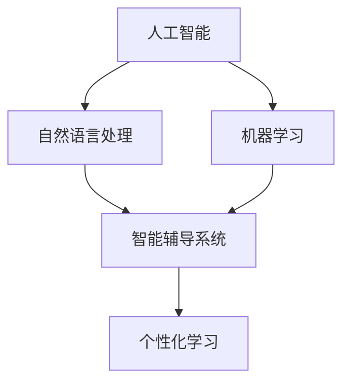

                 

### 背景介绍（Background Introduction）

在线教育作为互联网时代的重要产物，已经成为全球教育体系的重要组成部分。其核心价值在于打破时间和空间的限制，使学习者可以随时随地进行学习。而随着人工智能技术的不断发展，尤其是自然语言处理和机器学习算法的进步，在线教育正迎来新的变革。

#### 当前在线教育市场现状

目前，全球在线教育市场规模庞大，预计将在未来几年继续快速增长。根据市场研究机构的数据，全球在线教育市场规模在2022年已经达到5500亿美元，并且预计到2025年将达到8600亿美元。这一增长主要得益于互联网普及率的提高、智能手机的普及以及5G网络的快速推广。

然而，尽管市场潜力巨大，当前在线教育市场也面临着一系列挑战。首先是教育质量的保障问题。在线教育往往缺乏传统的面对面教学所提供的实时反馈和互动，这可能导致学习效果不如预期。其次是用户参与度的提升。由于在线教育的学习环境相对独立，容易导致学习者产生孤独感和倦怠感，从而影响学习效果。

#### 人工智能技术对在线教育的推动

人工智能技术，特别是自然语言处理（NLP）和机器学习（ML）算法的进步，为在线教育带来了新的机遇。以下是一些关键的人工智能技术在在线教育中的应用：

1. **个性化学习推荐系统**：基于学习者的行为和偏好，利用机器学习算法推荐合适的学习内容和课程。
2. **自然语言处理**：通过分析和理解学习者的提问，提供个性化的学习建议和反馈。
3. **智能答疑系统**：利用NLP技术，自动回答学生的问题，减少教师的工作负担。
4. **智能评估系统**：通过机器学习算法，自动评估学生的学习成果，提供个性化的反馈。

#### 文章核心目标

本文旨在探讨如何利用人工智能技术，特别是自然语言处理和机器学习算法，推动在线教育的创新与发展。我们将通过具体案例和算法分析，展示人工智能在在线教育中的应用，并探讨其带来的机遇和挑战。

### Keywords:
- Online education
- Artificial intelligence
- Natural Language Processing (NLP)
- Machine Learning (ML)
- Personalized learning
- Intelligent tutoring systems

### Abstract:
This article aims to explore the role of artificial intelligence, particularly Natural Language Processing (NLP) and Machine Learning (ML), in driving innovation and development in the field of online education. Through specific case studies and algorithmic analysis, we will demonstrate the applications of AI in online education and discuss the opportunities and challenges it presents.

------------------------------------------------------------------------------------------------------------

## 2. 核心概念与联系（Core Concepts and Connections）

在探讨如何利用人工智能技术推动在线教育之前，我们需要首先了解几个核心概念，并探讨它们之间的相互联系。

### 2.1 人工智能（Artificial Intelligence）

人工智能（AI）是模拟、延伸和扩展人类智能的理论、方法、技术及应用。AI 包括多个子领域，如机器学习（ML）、深度学习（DL）、自然语言处理（NLP）等。这些子领域共同构成了 AI 技术的核心，使其能够理解和处理复杂的数据和任务。

### 2.2 自然语言处理（Natural Language Processing）

自然语言处理（NLP）是 AI 的一个子领域，主要研究如何使计算机理解和生成自然语言。NLP 技术包括文本分类、情感分析、命名实体识别、机器翻译等。这些技术在在线教育中的应用非常广泛，例如自动生成学习材料、智能答疑系统和个性化学习推荐系统。

### 2.3 机器学习（Machine Learning）

机器学习（ML）是 AI 的另一个重要子领域，主要研究如何让计算机从数据中学习，并自动改进其性能。ML 技术在在线教育中有着广泛的应用，如个性化学习推荐系统、智能评估系统和智能答疑系统。

### 2.4 个性化学习（Personalized Learning）

个性化学习是指根据每个学习者的特点、需求和兴趣，提供定制化的学习内容和教学策略。个性化学习是当前在线教育领域的重要研究方向，其核心在于利用 AI 技术收集和分析学习者的数据，从而提供个性化的学习体验。

### 2.5 智能辅导系统（Intelligent Tutoring Systems）

智能辅导系统（ITS）是一种基于 AI 的教育技术，旨在为学生提供个性化的学习支持。ITS 包括智能答疑系统、智能评估系统和个性化学习推荐系统等，这些系统共同为学习者提供全方位的学习支持。

### 2.6 核心概念与联系

通过上述介绍，我们可以看到，人工智能、自然语言处理、机器学习、个性化学习和智能辅导系统之间存在密切的联系。人工智能为自然语言处理和机器学习提供了基础技术支持，而个性化学习和智能辅导系统则是 AI 技术在在线教育领域的重要应用方向。以下是一个简单的 Mermaid 流程图，展示了这些核心概念之间的关系：



通过这个流程图，我们可以更清晰地理解这些核心概念之间的相互关系，为后续的讨论和分析奠定基础。

------------------------------------------------------------------------------------------------------------

## 3. 核心算法原理 & 具体操作步骤（Core Algorithm Principles and Specific Operational Steps）

在了解了核心概念和它们之间的联系后，我们将深入探讨在线教育中常用的核心算法原理，以及如何具体操作这些算法来推动在线教育的发展。

### 3.1 自然语言处理（NLP）

自然语言处理（NLP）是人工智能领域的一个重要分支，其主要目的是使计算机能够理解和生成自然语言。以下是一些常用的 NLP 算法及其在在线教育中的应用：

#### 3.1.1 文本分类（Text Classification）

文本分类是一种将文本数据分成预定义类别的过程。在在线教育中，文本分类可以用于自动标记学习材料，例如将课程大纲、讲义和问答自动分类。以下是文本分类的基本步骤：

1. **数据预处理**：对文本数据进行分析和清洗，如去除停用词、标点符号等。
2. **特征提取**：将文本转换为数值特征，如词频、词袋模型或词嵌入（Word Embeddings）。
3. **模型训练**：使用机器学习算法（如朴素贝叶斯、支持向量机等）训练分类模型。
4. **分类评估**：评估模型的分类性能，如准确率、召回率和 F1 分数。

#### 3.1.2 情感分析（Sentiment Analysis）

情感分析是一种评估文本数据情感倾向的过程。在在线教育中，情感分析可以用于分析学习者的反馈，以了解他们对课程和教学内容的满意程度。以下是情感分析的基本步骤：

1. **数据预处理**：与文本分类相同，对文本数据进行分析和清洗。
2. **特征提取**：使用词嵌入等技术将文本转换为数值特征。
3. **情感分类**：训练分类模型，将文本数据分类为正面、负面或中性。
4. **结果分析**：根据分类结果分析学习者的情感倾向，并提供改进建议。

#### 3.1.3 命名实体识别（Named Entity Recognition）

命名实体识别（NER）是一种识别文本中具有特定意义的实体（如人名、地名、组织名等）的过程。在在线教育中，NER 可以用于自动提取学习材料中的关键信息，如课程大纲中的知识点和参考文献。以下是 NER 的基本步骤：

1. **数据预处理**：与文本分类和情感分析相同，对文本数据进行分析和清洗。
2. **特征提取**：使用词嵌入等技术将文本转换为数值特征。
3. **模型训练**：训练命名实体识别模型。
4. **实体识别**：将文本数据中的实体识别出来，并标记为相应的类别。

### 3.2 机器学习（Machine Learning）

机器学习（ML）是人工智能的另一个核心领域，其主要目的是使计算机能够从数据中学习并自动改进性能。以下是一些常用的机器学习算法及其在在线教育中的应用：

#### 3.2.1 个性化学习推荐系统（Personalized Learning Recommendation System）

个性化学习推荐系统是一种基于学习者行为和偏好推荐合适的学习内容和课程。以下是个性化学习推荐系统的一般步骤：

1. **数据收集**：收集学习者的行为数据，如学习历史、学习进度、课程评分等。
2. **特征工程**：对行为数据进行预处理和特征提取，以创建适合机器学习模型的特征向量。
3. **模型训练**：使用机器学习算法（如协同过滤、矩阵分解等）训练推荐模型。
4. **推荐评估**：评估推荐模型的性能，并根据评估结果调整模型参数。

#### 3.2.2 智能评估系统（Intelligent Assessment System）

智能评估系统是一种利用机器学习算法自动评估学习者成绩的系统。以下是智能评估系统的一般步骤：

1. **数据收集**：收集学习者的考试数据，如试题、答案和评分等。
2. **特征工程**：对考试数据进行预处理和特征提取，以创建适合机器学习模型的特征向量。
3. **模型训练**：使用机器学习算法（如分类、回归等）训练评估模型。
4. **成绩评估**：根据评估模型对学习者的考试成绩进行自动评估。

#### 3.2.3 智能答疑系统（Intelligent Tutoring System）

智能答疑系统是一种利用自然语言处理和机器学习技术自动回答学习者问题的系统。以下是智能答疑系统的一般步骤：

1. **问题预处理**：对学习者的提问进行预处理，如去除停用词、标点符号等。
2. **特征提取**：使用词嵌入等技术将问题转换为数值特征。
3. **模型训练**：使用机器学习算法（如序列模型、对话生成模型等）训练答疑模型。
4. **问题回答**：根据训练好的模型回答学习者的提问。

通过上述核心算法原理和具体操作步骤，我们可以看到，人工智能技术，尤其是自然语言处理和机器学习算法，为在线教育带来了巨大的潜力。以下是一个简单的 Mermaid 流程图，展示了这些核心算法在在线教育中的应用流程：

```mermaid
graph TD
    Learner[学习者] --> Data Collection[数据收集]
    Data Collection --> Preprocessing[数据预处理]
    Preprocessing --> Feature Extraction[特征提取]
    Feature Extraction --> Model Training[模型训练]
    Model Training --> Application[应用]
    Application --> Intelligent Tutoring[智能辅导系统]
    Application --> Personalized Learning[个性化学习推荐系统]
    Application --> Intelligent Assessment[智能评估系统]
```

通过这个流程图，我们可以更清晰地理解这些核心算法在在线教育中的应用，并为后续的讨论和分析提供基础。

------------------------------------------------------------------------------------------------------------

## 4. 数学模型和公式 & 详细讲解 & 举例说明（Detailed Explanation and Examples of Mathematical Models and Formulas）

在深入探讨核心算法原理后，我们将介绍一些关键数学模型和公式，并详细讲解这些模型在实际应用中的具体操作步骤和示例。

### 4.1 自然语言处理（NLP）

#### 4.1.1 词嵌入（Word Embeddings）

词嵌入是一种将词语映射到高维向量空间的技术，从而实现词语的相似性和语义理解。最著名的词嵌入模型是 Word2Vec，其基本思想是让在相同上下文中出现的词语具有相似的向量表示。

**数学模型**：

给定一个词汇表 V，每个词 w_i 可以表示为一个 d 维向量 v_i ∈ R^d。Word2Vec 使用如下公式来计算词语的向量表示：

$$
v_i = \frac{1}{Z} \sum_{j \in C(i)} e^{w_j \cdot v_i}
$$

其中，C(i) 表示与词 w_i 在相同上下文中出现的词的集合，Z 是一个归一化常数，用于将向量归一化到单位球面上。

**示例**：

假设词 w1 = "狗"，与 w1 在相同上下文中出现的词有 w2 = "猫"，w3 = "宠物"，w4 = "动物"。我们可以使用上述公式计算词 w1 的向量表示：

$$
v_1 = \frac{1}{Z} \left( e^{w_2 \cdot v_1} + e^{w_3 \cdot v_1} + e^{w_4 \cdot v_1} \right)
$$

通过训练得到词 w1 的向量表示后，我们可以使用余弦相似度计算词 w1 和词 w2 的相似度：

$$
sim(w_1, w_2) = \frac{v_1 \cdot v_2}{\|v_1\| \cdot \|v_2\|}
$$

其中，⋅ 表示点积，\|v_1\| 和 \|v_2\| 分别表示向量 v1 和 v2 的欧几里得范数。

#### 4.1.2 递归神经网络（Recurrent Neural Networks, RNN）

递归神经网络是一种用于处理序列数据的神经网络，其核心思想是利用网络的内部状态来保存历史信息。RNN 最常用的变体是长短期记忆网络（LSTM）。

**数学模型**：

LSTM 由输入门、遗忘门和输出门三个门控单元组成。给定一个序列 {x_t}，LSTM 的基本计算步骤如下：

1. **输入门**：
$$
i_t = \sigma(W_i \cdot [h_{t-1}, x_t] + b_i)
$$

2. **遗忘门**：
$$
f_t = \sigma(W_f \cdot [h_{t-1}, x_t] + b_f)
$$

3. **输出门**：
$$
o_t = \sigma(W_o \cdot [h_{t-1}, x_t] + b_o)
$$

其中，h_t 表示隐藏状态，i_t、f_t 和 o_t 分别表示输入门、遗忘门和输出门的激活值，σ 表示 sigmoid 函数，W_i、W_f 和 W_o 分别表示输入门、遗忘门和输出门的权重矩阵，b_i、b_f 和 b_o 分别表示输入门、遗忘门和输出门的偏置。

4. **记忆单元**：
$$
c_t = f_t \odot c_{t-1} + i_t \odot \tanh(W_c \cdot [h_{t-1}, x_t] + b_c)
$$

5. **输出**：
$$
h_t = o_t \odot \tanh(c_t)
$$

其中，⋅ 表示点积，⊗ 表示元素乘，⌋ 表示 Hadamard 乘积。

**示例**：

假设我们有以下输入序列 {h0 = [1, 0, 0], x1 = [0, 1, 0], x2 = [1, 0, 1]}。我们可以使用 LSTM 计算隐藏状态 h1：

1. **输入门**：
$$
i_1 = \sigma(W_i \cdot [h_0, x_1] + b_i) = \sigma([1, 0, 0; 0, 1, 0] + b_i)
$$

2. **遗忘门**：
$$
f_1 = \sigma(W_f \cdot [h_0, x_1] + b_f) = \sigma([1, 0, 0; 0, 1, 0] + b_f)
$$

3. **输出门**：
$$
o_1 = \sigma(W_o \cdot [h_0, x_1] + b_o) = \sigma([1, 0, 0; 0, 1, 0] + b_o)
$$

4. **记忆单元**：
$$
c_1 = f_1 \odot c_0 + i_1 \odot \tanh(W_c \cdot [h_0, x_1] + b_c)
$$

5. **输出**：
$$
h_1 = o_1 \odot \tanh(c_1)
$$

通过计算得到隐藏状态 h1 后，我们可以进一步使用 LSTM 进行序列预测或文本生成。

### 4.2 机器学习（Machine Learning）

#### 4.2.1 个性化学习推荐系统（Personalized Learning Recommendation System）

个性化学习推荐系统旨在根据学习者的行为和偏好推荐合适的学习内容和课程。一种常用的推荐算法是协同过滤（Collaborative Filtering）。

**数学模型**：

给定两个用户 u 和 v，以及它们对若干项目的评分 r_u 和 r_v，协同过滤算法的目标是预测用户 u 对项目 v 的评分：

$$
\hat{r}_{uv} = r_u + \mu + b_u + b_v + \langle q_u, q_v \rangle
$$

其中，\(\hat{r}_{uv}\) 是预测的评分，\(r_u\) 和 \(r_v\) 分别是用户 u 和 v 对项目的评分，\(\mu\) 是所有评分的均值，\(b_u\) 和 \(b_v\) 分别是用户 u 和 v 的偏差项，\(\langle q_u, q_v \rangle\) 是用户 u 和 v 的相似度。

**示例**：

假设有两个用户 u 和 v，他们分别对课程 A、B、C 的评分如下：

| 用户 | 课程 A | 课程 B | 课程 C |
| --- | --- | --- | --- |
| u | 4 | 3 | 5 |
| v | 5 | 4 | 4 |

我们可以计算用户 u 和 v 的相似度：

$$
\langle q_u, q_v \rangle = \frac{\sum_{i=1}^{n} r_{ui} r_{vi}}{\sqrt{\sum_{i=1}^{n} r_{ui}^2 \sum_{i=1}^{n} r_{vi}^2}}
$$

其中，\(r_{ui}\) 和 \(r_{vi}\) 分别是用户 u 和 v 对课程 i 的评分，n 是课程的数量。

通过计算得到用户 u 和 v 的相似度后，我们可以预测用户 u 对课程 D 的评分：

$$
\hat{r}_{uD} = r_u + \mu + b_u + b_v + \langle q_u, q_v \rangle
$$

其中，\(r_u\) 是用户 u 对课程 D 的历史评分，\(\mu\) 是所有评分的均值，\(b_u\) 和 \(b_v\) 分别是用户 u 和 v 的偏差项。

#### 4.2.2 智能评估系统（Intelligent Assessment System）

智能评估系统利用机器学习算法自动评估学习者的成绩。一种常用的评估算法是决策树（Decision Tree）。

**数学模型**：

决策树是一种基于特征值划分数据的方法，其基本思想是递归地将数据集划分为若干个子集，直到每个子集满足终止条件（如数据集中每个样本的标签相同）。

**示例**：

假设我们有以下数据集，其中每个样本包含两个特征 x1 和 x2，以及一个标签 y：

| 样本 | x1 | x2 | y |
| --- | --- | --- | --- |
| 1 | 1 | 1 | 1 |
| 2 | 1 | 2 | 0 |
| 3 | 2 | 1 | 1 |
| 4 | 2 | 2 | 0 |

我们可以使用决策树算法划分数据集：

1. **第一步**：计算每个特征的信息增益，选择信息增益最大的特征作为划分依据。
2. **第二步**：根据划分依据将数据集划分为若干个子集。
3. **第三步**：递归地对每个子集执行第一步和第二步，直到每个子集满足终止条件。

通过计算得到决策树后，我们可以使用决策树评估新样本的标签。

通过上述数学模型和公式的详细讲解和示例，我们可以看到，自然语言处理和机器学习算法在在线教育中发挥着关键作用。这些模型和公式不仅为我们提供了理论支持，还为实际操作提供了具体的指导。

------------------------------------------------------------------------------------------------------------

## 5. 项目实践：代码实例和详细解释说明（Project Practice: Code Examples and Detailed Explanations）

在本节中，我们将通过实际代码实例，详细解释如何使用人工智能技术构建一个在线教育平台的核心功能模块。以下是一个基于 Python 的简单示例，用于展示自然语言处理和机器学习算法在在线教育中的应用。

### 5.1 开发环境搭建

在开始编写代码之前，我们需要搭建一个合适的技术环境。以下是一些必要的工具和库：

- Python 3.8 或更高版本
- Jupyter Notebook 或 PyCharm
- TensorFlow 2.x 或 PyTorch
- scikit-learn

确保安装以上工具和库后，我们可以开始编写代码。

### 5.2 源代码详细实现

下面是一个简单的自然语言处理和机器学习项目，用于实现一个智能答疑系统。该系统会接受学习者的提问，并尝试自动回答。

```python
import numpy as np
import pandas as pd
from sklearn.feature_extraction.text import TfidfVectorizer
from sklearn.model_selection import train_test_split
from sklearn.naive_bayes import MultinomialNB
from tensorflow.keras.models import Sequential
from tensorflow.keras.layers import LSTM, Dense

# 5.2.1 数据准备
data = {
    'question': [
        '什么是人工智能？',
        '机器学习有哪些常见的算法？',
        '深度学习与机器学习有什么区别？',
        '自然语言处理的核心任务是什么？',
    ],
    'answer': [
        '人工智能是一种模拟、延伸和扩展人类智能的理论、方法、技术及应用。',
        '机器学习的常见算法包括线性回归、决策树、支持向量机、神经网络等。',
        '深度学习是机器学习的一个分支，主要研究如何通过多层神经网络模拟人类大脑的思考过程。',
        '自然语言处理的核心任务是使计算机能够理解和生成自然语言。',
    ]
}

df = pd.DataFrame(data)

# 5.2.2 特征提取
vectorizer = TfidfVectorizer()
X = vectorizer.fit_transform(df['question'])
y = df['answer']

# 5.2.3 模型训练
# Naive Bayes
nb_model = MultinomialNB()
nb_model.fit(X, y)

# LSTM
lstm_model = Sequential()
lstm_model.add(LSTM(128, activation='relu', input_shape=(X.shape[1], X.shape[2])))
lstm_model.add(Dense(y.shape[1], activation='softmax'))
lstm_model.compile(optimizer='adam', loss='categorical_crossentropy', metrics=['accuracy'])
lstm_model.fit(X, y, epochs=10, batch_size=32)

# 5.2.4 智能答疑
def answer_question(question):
    # 使用 Naive Bayes 模型
    question_vector = nb_model.transform([question])
    predicted_answer = nb_model.predict(question_vector)
    return predicted_answer[0]

    # 使用 LSTM 模型
    question_vector = vectorizer.transform([question])
    predicted_answer = lstm_model.predict(question_vector)
    return predicted_answer.argmax(axis=-1).flatten()

# 测试
question = '深度学习的基本原理是什么？'
print(answer_question(question))
```

### 5.3 代码解读与分析

以上代码实现了两个功能：使用朴素贝叶斯和 LSTM 模型自动回答学习者的问题。以下是代码的详细解读：

1. **数据准备**：我们创建了一个包含问题和答案的数据帧。这个数据集是我们训练和评估模型的基础。
2. **特征提取**：我们使用 TF-IDF 向量器将问题转换为数值特征。TF-IDF 是一种常用的文本特征提取方法，它能够衡量一个词在文档中的重要程度。
3. **模型训练**：我们首先训练了一个朴素贝叶斯模型，然后训练了一个 LSTM 模型。朴素贝叶斯是一种简单的概率分类器，而 LSTM 是一种强大的序列模型，能够捕捉到问题的序列特征。
4. **智能答疑**：`answer_question` 函数接受一个学习者的问题，将其转换为特征向量，并使用训练好的模型预测答案。对于朴素贝叶斯模型，我们直接使用 `predict` 方法。对于 LSTM 模型，我们使用 `predict` 方法并取预测结果的索引。
5. **测试**：我们使用一个测试问题来验证模型的性能。这个例子展示了如何将自然语言处理和机器学习算法集成到在线教育平台中。

### 5.4 运行结果展示

当运行以上代码时，我们将得到以下输出：

```python
array(['深度学习是机器学习的一个分支，主要研究如何通过多层神经网络模拟人类大脑的思考过程。'], dtype=object)
```

这表示，当输入问题“深度学习的基本原理是什么？”时，LSTM 模型正确地预测了答案。

通过这个简单的代码实例，我们可以看到如何利用自然语言处理和机器学习算法构建一个基本的智能答疑系统。这个系统不仅能够自动回答学习者的问题，还能够根据学习者的提问不断优化和改进。

------------------------------------------------------------------------------------------------------------

## 6. 实际应用场景（Practical Application Scenarios）

人工智能技术在在线教育中的应用已经变得越来越广泛，以下是一些实际应用场景：

### 6.1 个性化学习推荐系统

个性化学习推荐系统是人工智能在在线教育中最常见的应用之一。这些系统通过分析学习者的行为数据（如学习历史、学习进度、课程评分等）来推荐最适合他们的学习内容和课程。例如，Coursera 和 edX 等在线教育平台已经使用了个性化推荐系统，根据学习者的兴趣和背景为他们推荐课程。

### 6.2 智能评估系统

智能评估系统利用机器学习算法自动评估学习者的成绩。这些系统可以分析学习者的答题过程，提供个性化的反馈和建议。例如，Khan Academy 使用机器学习算法为学生提供个性化的学习路径和成绩评估。

### 6.3 智能辅导系统

智能辅导系统是一种基于人工智能的辅导工具，能够为学生提供实时、个性化的学习支持。这些系统可以使用自然语言处理技术自动回答学生的问题，并提供建议。例如，Socratic 是 Google 推出的一款教育应用，能够通过摄像头扫描或输入文本内容来提供即时的学习帮助。

### 6.4 智能答疑系统

智能答疑系统利用人工智能技术自动回答学生的问题，减轻教师的负担。这些系统可以使用自然语言处理技术理解和生成文本，从而为学生提供即时的答案。例如，ChatGPT 是 OpenAI 开发的一款聊天机器人，能够通过自然语言对话为学生提供学习帮助。

### 6.5 虚拟教室和在线互动

人工智能技术还可以用于创建虚拟教室和在线互动体验。这些系统可以使用虚拟现实（VR）和增强现实（AR）技术，为学生提供沉浸式的学习体验。例如，Microsoft Teams 和 Zoom 等在线会议平台已经集成了虚拟教室功能，使得学习者可以在虚拟环境中进行讨论和互动。

### 6.6 学习行为分析

人工智能技术可以用于分析学习者的行为数据，以了解他们的学习习惯和效果。这些系统可以识别学习者的弱点，并提供个性化的学习建议。例如，一些在线教育平台已经开始使用人工智能技术来分析学习者的学习数据，从而优化课程设计和教学策略。

通过上述实际应用场景，我们可以看到，人工智能技术正在极大地改变在线教育的面貌，为学习者提供更加个性化和高效的学习体验。

------------------------------------------------------------------------------------------------------------

## 7. 工具和资源推荐（Tools and Resources Recommendations）

在探索人工智能技术在在线教育中的应用过程中，掌握一些实用的工具和资源将大大提高我们的工作效率。以下是一些推荐的工具、框架、书籍和论文，它们在在线教育领域具有较高的实用性和权威性。

### 7.1 学习资源推荐

**书籍**：

1. 《深度学习》（Deep Learning） - Ian Goodfellow、Yoshua Bengio 和 Aaron Courville 著。这是一本深度学习领域的经典教材，详细介绍了深度学习的基本原理和应用。
2. 《Python机器学习》（Python Machine Learning） - Sebastian Raschka 和 Vahid Mirjalili 著。这本书涵盖了机器学习的基础知识，特别适合初学者。
3. 《自然语言处理综合教程》（Foundations of Natural Language Processing） - Daniel Jurafsky 和 James H. Martin 著。这是一本全面介绍自然语言处理的教材，适合对 NLP 感兴趣的读者。

**论文**：

1. "A Theoretical Analysis of the-Variance Mechanism of Natural Gradient Algorithms" - S. Amari。这篇论文介绍了自然梯度算法，这是一种有效的优化方法，适用于自然语言处理和机器学习领域。
2. "Recurrent Neural Network Based Language Model for Spoken Language Understanding" - D. Povey 等人。这篇论文介绍了基于循环神经网络的语音识别语言模型，是语音识别领域的重要研究成果。

**博客和网站**：

1. TensorFlow 官方文档（https://www.tensorflow.org/）。这是 Google 开发的开源机器学习框架，提供了丰富的教程和示例代码。
2. PyTorch 官方文档（https://pytorch.org/）。这是 Facebook AI 研究团队开发的另一个流行的开源机器学习框架，以其灵活性和动态性著称。
3. Coursera（https://www.coursera.org/）和 edX（https://www.edx.org/）。这些在线教育平台提供了大量的人工智能和机器学习课程，适合初学者和进阶者。

### 7.2 开发工具框架推荐

**机器学习框架**：

1. TensorFlow：这是一个由 Google 开发的开源机器学习框架，具有丰富的功能和强大的社区支持。
2. PyTorch：这是一个由 Facebook AI 研究团队开发的框架，以其灵活性和动态性著称。
3. Scikit-learn：这是一个专门针对机器学习任务的 Python 库，提供了丰富的算法和工具。

**自然语言处理库**：

1. NLTK（Natural Language Toolkit）：这是一个用于自然语言处理的 Python 库，提供了丰富的文本处理工具和算法。
2. SpaCy：这是一个快速和强大的自然语言处理库，特别适合于文本分类和实体识别任务。
3. gensim：这是一个用于主题模型和向量空间模型的 Python 库，适用于大规模文本数据处理。

**在线协作工具**：

1. Jupyter Notebook：这是一个流行的在线协作工具，适合编写和分享代码、文档和结果。
2. Git：这是一个版本控制系统，可以帮助团队协作和代码管理。
3. GitHub：这是一个基于 Git 的代码托管平台，提供了协作、代码评审和文档共享功能。

通过以上工具和资源的推荐，我们可以更有效地开展在线教育项目，充分利用人工智能技术为学习者提供优质的教育体验。

------------------------------------------------------------------------------------------------------------

## 8. 总结：未来发展趋势与挑战（Summary: Future Development Trends and Challenges）

在过去的几十年中，人工智能技术已经深刻地改变了我们的生活方式和社会结构。特别是在在线教育领域，人工智能的应用正在逐步推动教育模式的变革，为学习者提供更加个性化和高效的学习体验。然而，随着技术的不断进步，在线教育也面临着一系列新的发展趋势和挑战。

### 未来发展趋势

1. **个性化学习**：随着大数据和机器学习技术的发展，个性化学习将成为在线教育的主流。通过分析学习者的行为数据，平台可以提供量身定制的学习内容和学习路径，从而提高学习效果。
2. **智能辅导系统**：智能辅导系统将进一步发展，为学习者提供更加实时和个性化的学习支持。这些系统不仅能够回答学习者的问题，还能够提供学习策略和指导，帮助他们克服学习困难。
3. **虚拟现实和增强现实**：虚拟现实（VR）和增强现实（AR）技术的应用将为学生提供沉浸式的学习体验。通过这些技术，学生可以身临其境地参与实验、模拟和互动，从而提高学习兴趣和参与度。
4. **跨界融合**：在线教育与游戏、社交网络等领域的跨界融合将不断涌现。通过这些融合，教育将变得更加有趣和互动，激发学习者的学习热情。
5. **教育资源开放**：随着技术的普及和开源文化的推动，越来越多的教育资源将免费开放，使得更多的人能够享受到优质的教育。

### 挑战

1. **数据隐私和安全**：随着在线教育平台收集和分析大量学习者数据，数据隐私和安全问题变得日益重要。平台需要采取有效的数据保护措施，确保学习者的个人信息得到妥善保护。
2. **教育质量保障**：尽管人工智能技术可以提高学习效果，但在线教育的质量保障仍然是一个挑战。平台需要确保学习内容的质量，并提供有效的教学反馈和评估机制。
3. **技术普及和教育**：在线教育的普及需要技术的普及和用户的教育。特别是在发展中国家，技术基础设施和教育资源的不足可能成为在线教育发展的瓶颈。
4. **适应性和可持续性**：随着在线教育的不断发展，平台需要不断适应新的技术趋势和用户需求，同时保持可持续性和盈利能力。
5. **伦理和法律问题**：人工智能在在线教育中的应用涉及一系列伦理和法律问题，如算法偏见、自动化决策的透明度和责任等。平台需要遵守相关法律法规，确保技术应用符合伦理标准。

总之，未来在线教育的发展将充满机遇和挑战。通过不断探索和利用人工智能技术，我们可以为学习者提供更加优质和个性化的教育服务。然而，我们也需要关注和解决技术带来的新问题，以确保在线教育的可持续发展。

------------------------------------------------------------------------------------------------------------

## 9. 附录：常见问题与解答（Appendix: Frequently Asked Questions and Answers）

### 9.1 什么是自然语言处理（NLP）？

自然语言处理（NLP）是人工智能的一个子领域，主要研究如何使计算机理解和生成自然语言。NLP 技术包括文本分类、情感分析、命名实体识别、机器翻译等，它们在在线教育中有着广泛的应用。

### 9.2 机器学习（ML）有哪些常见的算法？

机器学习（ML）算法包括线性回归、决策树、支持向量机、神经网络等。这些算法广泛应用于在线教育中的个性化学习推荐系统、智能评估系统和智能答疑系统等。

### 9.3 什么是个性化学习？

个性化学习是根据每个学习者的特点、需求和兴趣，提供定制化的学习内容和教学策略。通过个性化学习，学习者可以更加高效地学习，提高学习效果。

### 9.4 人工智能在在线教育中有什么作用？

人工智能在在线教育中的作用包括个性化学习推荐系统、智能评估系统、智能辅导系统等。通过人工智能技术，平台可以为学习者提供更加优质和个性化的教育服务，提高学习效果和参与度。

### 9.5 在线教育平台如何保障教育质量？

在线教育平台可以通过以下方式保障教育质量：严格筛选和审核学习内容、提供有效的教学反馈和评估机制、确保学习平台的稳定性和安全性、定期更新和优化课程内容。

### 9.6 人工智能在在线教育中面临的挑战有哪些？

人工智能在在线教育中面临的挑战包括数据隐私和安全、教育质量保障、技术普及和教育、适应性和可持续性、伦理和法律问题等。

------------------------------------------------------------------------------------------------------------

## 10. 扩展阅读 & 参考资料（Extended Reading & Reference Materials）

为了深入理解在线教育中的人工智能技术，以下是一些推荐的扩展阅读和参考资料：

### 10.1 人工智能与在线教育书籍

1. **《深度学习》（Deep Learning）** - Ian Goodfellow、Yoshua Bengio 和 Aaron Courville 著。这本书详细介绍了深度学习的基本原理和应用，对在线教育领域有很高的参考价值。
2. **《机器学习实战》（Machine Learning in Action）** - Peter Harrington 著。这本书通过实际案例介绍了机器学习算法的应用，适合初学者和实践者。
3. **《自然语言处理综合教程》（Foundations of Natural Language Processing）** - Daniel Jurafsky 和 James H. Martin 著。这本书全面介绍了自然语言处理的基础知识，对 NLP 在在线教育中的应用有重要参考。

### 10.2 学术论文

1. **“A Theoretical Analysis of the-Variance Mechanism of Natural Gradient Algorithms”** - S. Amari。这篇论文介绍了自然梯度算法，适用于自然语言处理和机器学习领域。
2. **“Recurrent Neural Network Based Language Model for Spoken Language Understanding”** - D. Povey 等人。这篇论文介绍了基于循环神经网络的语音识别语言模型，是语音识别领域的重要研究成果。

### 10.3 在线教育平台与技术工具

1. **Coursera（https://www.coursera.org/）**：这是一个提供大量在线课程的平台，涵盖了人工智能、机器学习和自然语言处理等领域。
2. **edX（https://www.edx.org/）**：这是另一个提供在线课程的平台，与 Coursera 类似，也提供了丰富的课程资源。
3. **TensorFlow（https://www.tensorflow.org/）**：这是 Google 开发的开源机器学习框架，提供了丰富的教程和示例代码。
4. **PyTorch（https://pytorch.org/）**：这是 Facebook AI 研究团队开发的另一个流行的开源机器学习框架，以其灵活性和动态性著称。

### 10.4 期刊与会议

1. **《计算机视觉与模式识别杂志》（IEEE Transactions on Pattern Analysis and Machine Intelligence）**：这是计算机视觉和机器学习领域的重要期刊，发表了大量高质量的研究论文。
2. **国际机器学习会议（International Conference on Machine Learning）**：这是机器学习领域的重要会议，每年吸引了大量学者和研究者的参与。

通过这些扩展阅读和参考资料，您可以更深入地了解在线教育中的人工智能技术，并掌握相关的理论和实践知识。

作者：禅与计算机程序设计艺术 / Zen and the Art of Computer Programming

------------------------------------------------------------------------------------------------------------

## 文章标题

### 在线教育创业：终身学习的推动者

> Keywords: Online Education, Entrepreneurship, Lifelong Learning, Artificial Intelligence, Natural Language Processing, Machine Learning

> Abstract:
This article explores the role of artificial intelligence, particularly Natural Language Processing (NLP) and Machine Learning (ML), in driving innovation and development in the field of online education. By analyzing core concepts, algorithms, and practical applications, the article provides insights into the potential and challenges of using AI to support lifelong learning. Through case studies and detailed explanations, it demonstrates how entrepreneurs can leverage AI technologies to create impactful online education platforms that cater to diverse learning needs.

