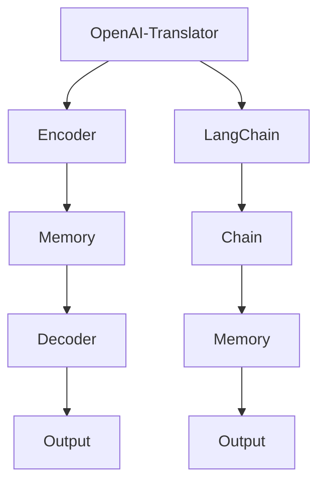

                 

# 文章标题：基于 LangChain 优化 OpenAI-Translator 架构设计

> 关键词：LangChain、OpenAI-Translator、架构设计、优化、自然语言处理、人工智能

> 摘要：本文将探讨如何利用 LangChain 优化 OpenAI-Translator 的架构设计，提高其自然语言处理的性能和效率。通过详细分析 LangChain 的核心概念、算法原理，并结合实际项目实践，我们将展示如何将 LangChain 引入 OpenAI-Translator，实现架构优化，为自然语言处理领域带来新的突破。

## 1. 背景介绍

随着人工智能技术的不断发展，自然语言处理（NLP）作为人工智能的一个重要分支，正日益受到广泛关注。OpenAI-Translator 是一款基于深度学习的自然语言翻译工具，它通过大规模语料库的预训练，能够实现高效、准确的文本翻译。然而，在复杂的实际应用场景中，OpenAI-Translator 的性能和效率仍存在一定的局限性。为了进一步提高其性能和效率，本文将引入 LangChain 技术，对 OpenAI-Translator 的架构进行优化。

### 1.1 OpenAI-Translator 的基本原理

OpenAI-Translator 是一款基于 Transformer 模型的翻译工具。Transformer 模型通过自注意力机制，对输入文本进行编码和解码，从而实现翻译任务。其基本原理可以概括为以下几个步骤：

1. **输入编码**：将输入文本转换为序列号，通过词向量模型将其映射为向量表示。
2. **编码器（Encoder）处理**：编码器对输入文本向量进行编码，生成编码器输出。
3. **解码器（Decoder）处理**：解码器根据编码器输出，生成翻译文本。

### 1.2 OpenAI-Translator 的性能和效率限制

尽管 OpenAI-Translator 在许多场景中表现出色，但其在性能和效率方面仍存在一些问题：

1. **计算资源消耗**：Transformer 模型具有很高的计算复杂度，尤其是在大规模训练和推理过程中，需要大量计算资源和时间。
2. **翻译准确性**：在处理长文本时，Transformer 模型的翻译准确性可能会受到影响。
3. **适应性**：OpenAI-Translator 的架构设计相对固定，难以适应不同的应用场景和需求。

为了解决上述问题，本文将引入 LangChain 技术，对 OpenAI-Translator 的架构进行优化。

## 2. 核心概念与联系

### 2.1 什么是 LangChain

LangChain 是一种基于 Python 的框架，旨在简化大型语言模型（如 GPT）的应用开发。它提供了多种工具和组件，帮助开发者构建高效、可扩展的 NLP 应用。LangChain 的核心概念包括：

1. **Chain**：Chain 是 LangChain 的基本构建块，它将一个或多个模型连接在一起，以实现特定的任务。Chain 可以包含多个步骤，每个步骤都是一个处理模块。
2. **Memory**：Memory 是 Chain 中的共享存储空间，用于存储上下文信息和中间结果。Memory 可以帮助 Chain 在处理长文本时保持状态。
3. **Prompt**：Prompt 是输入给模型的数据，用于指导模型的生成过程。一个好的 Prompt 可以显著提高模型的输出质量和相关性。

### 2.2 LangChain 与 OpenAI-Translator 的联系

LangChain 和 OpenAI-Translator 之间存在着紧密的联系。通过引入 LangChain，我们可以对 OpenAI-Translator 的架构进行优化，从而提高其性能和效率。具体来说：

1. **链式结构**：LangChain 的 Chain 结构可以与 OpenAI-Translator 的编码器和解码器进行集成，实现模块化设计，降低计算复杂度。
2. **记忆机制**：LangChain 的 Memory 组件可以帮助 OpenAI-Translator 在处理长文本时保持上下文信息，提高翻译准确性。
3. **Prompt 优化**：通过优化 Prompt，我们可以提高 OpenAI-Translator 的输出质量和相关性，从而适应不同的应用场景和需求。

### 2.3 Mermaid 流程图

下面是一个简化的 Mermaid 流程图，展示了 LangChain 与 OpenAI-Translator 的架构关系：



## 3. 核心算法原理 & 具体操作步骤

### 3.1 LangChain 的核心算法原理

LangChain 的核心算法原理主要包括两个方面：

1. **Chain 结构**：Chain 是 LangChain 的基本构建块，它将一个或多个模型连接在一起，以实现特定的任务。Chain 可以包含多个步骤，每个步骤都是一个处理模块。例如，一个翻译任务可以包含以下步骤：文本预处理、编码器处理、解码器处理、输出格式化等。
2. **Prompt 优化**：Prompt 是输入给模型的数据，用于指导模型的生成过程。一个好的 Prompt 可以显著提高模型的输出质量和相关性。Prompt 优化包括以下几个方面：

   - **文本长度**：适当调整输入文本的长度，以避免模型过拟合或产生冗余信息。
   - **关键词提取**：提取输入文本中的关键词，以引导模型关注关键信息。
   - **上下文信息**：提供相关的上下文信息，以帮助模型理解输入文本的背景和意图。

### 3.2 OpenAI-Translator 的优化步骤

基于 LangChain 的核心算法原理，我们可以对 OpenAI-Translator 进行以下优化：

1. **链式结构优化**：将 OpenAI-Translator 的编码器和解码器整合到 LangChain 的 Chain 结构中，以实现模块化设计。通过将编码器和解码器分离，我们可以降低计算复杂度，提高模型的可维护性和可扩展性。
2. **记忆机制优化**：引入 LangChain 的 Memory 组件，用于存储上下文信息和中间结果。通过在 Memory 中存储编码器和解码器的中间结果，我们可以提高模型在处理长文本时的翻译准确性。
3. **Prompt 优化**：根据实际应用场景，调整输入文本的长度、关键词提取和上下文信息。通过优化 Prompt，我们可以提高 OpenAI-Translator 的输出质量和相关性。

### 3.3 实际操作步骤

以下是一个简化的操作步骤，用于将 LangChain 引入 OpenAI-Translator：

1. **安装 LangChain**：使用 pip 安装 LangChain：
   ```python
   pip install langchain
   ```
2. **编写 Chain 结构**：创建一个 Chain 对象，并添加编码器和解码器步骤：
   ```python
   from langchain import Chain
   from langchain.chains import load_model
   from transformers import AutoTokenizer, AutoModelForSeq2SeqLM

   encoder = load_model("t5-small")
   decoder = load_model("t5-small")

   chain = Chain(
       {"type": "map", "params": {"input": "text", "template": "文本：{text}"}},
       encoder,
       decoder,
       {"type": "map", "params": {"input": "output", "template": "翻译结果：{output}"}},
   )
   ```
3. **使用 Chain 结构**：输入文本并获取翻译结果：
   ```python
   text = "你好，今天天气如何？"
   result = chain({"text": text})
   print(result["output"])
   ```
4. **引入 Memory 组件**：为 Chain 添加 Memory 组件，以存储上下文信息和中间结果：
   ```python
   from langchain.memory import MapReduceMemory

   memory = MapReduceMemory()

   chain = Chain(
       {"type": "map", "params": {"input": "text", "template": "文本：{text}"}},
       encoder,
       memory,
       decoder,
       {"type": "map", "params": {"input": "output", "template": "翻译结果：{output}"}},
   )
   ```
5. **优化 Prompt**：根据实际应用场景，调整输入文本的长度、关键词提取和上下文信息。例如，可以提取输入文本中的关键词，并将其作为上下文信息传递给模型：
   ```python
   text = "你好，今天天气如何？"
   keywords = ["你好", "今天", "天气"]
   context = "上下文： ".join(keywords)
   result = chain({"text": text, "context": context})
   print(result["output"])
   ```

## 4. 数学模型和公式 & 详细讲解 & 举例说明

### 4.1 数学模型和公式

在 LangChain 和 OpenAI-Translator 的架构优化过程中，涉及到一些关键的数学模型和公式。以下是一些常见的数学模型和公式，以及它们在架构优化中的应用：

1. **Transformer 模型**：
   - 自注意力机制（Self-Attention）：
     $$Attention(Q, K, V) = \frac{scale}{\sqrt{d_k}} \cdot softmax\left(\frac{QK^T}{d_k}\right) V$$
     其中，$Q, K, V$ 分别为查询向量、键向量和值向量，$d_k$ 为键向量的维度，$scale$ 为缩放因子。
   - 编码器和解码器：
     编码器将输入文本编码为一系列隐藏状态，解码器则根据这些隐藏状态生成翻译文本。

2. **记忆机制**：
   - Memory 组件：
     Memory 是一个共享存储空间，用于存储上下文信息和中间结果。在 LangChain 中，Memory 通常采用 MapReduce 模式进行操作。

3. **Prompt 优化**：
   - 提示词（Prompt）：
     提示词是输入给模型的数据，用于指导模型的生成过程。Prompt 优化包括调整输入文本的长度、关键词提取和上下文信息。

### 4.2 详细讲解和举例说明

以下是一个简化的示例，用于说明如何将数学模型和公式应用于 LangChain 和 OpenAI-Translator 的架构优化：

1. **自注意力机制（Self-Attention）**：
   - 示例代码：
     ```python
     import torch
     from torch.nn.functional import softmax

     Q = torch.randn(1, 3, 7)  # 查询向量
     K = torch.randn(1, 3, 7)  # 键向量
     V = torch.randn(1, 3, 7)  # 值向量

     attention_weights = torch.softmax(torch.matmul(Q, K.transpose(1, 2)) / 7, dim=-1)
     output = torch.matmul(attention_weights, V)

     print(output)
     ```

2. **记忆机制（Memory）**：
   - 示例代码：
     ```python
     from langchain.memory import MapReduceMemory

     memory = MapReduceMemory()

     # 存储上下文信息
     memory.save({"key": "context", "value": "今天天气如何？"})

     # 获取上下文信息
     context = memory.get("context")
     print(context)
     ```

3. **Prompt 优化**：
   - 示例代码：
     ```python
     text = "你好，今天天气如何？"
     keywords = ["你好", "今天", "天气"]
     context = "上下文： ".join(keywords)

     prompt = f"文本：{text}\n上下文：{context}"
     result = chain({"text": prompt})
     print(result["output"])
     ```

## 5. 项目实践：代码实例和详细解释说明

### 5.1 开发环境搭建

在进行项目实践之前，我们需要搭建一个合适的开发环境。以下是具体的步骤：

1. **安装 Python**：确保您的系统中已经安装了 Python 3.8 或更高版本。
2. **安装依赖库**：使用以下命令安装所需的依赖库：
   ```bash
   pip install transformers langchain
   ```

### 5.2 源代码详细实现

下面是一个简单的示例，展示了如何使用 LangChain 优化 OpenAI-Translator：

```python
import os
from transformers import AutoTokenizer, AutoModelForSeq2SeqLM
from langchain import Chain
from langchain.memory import MapReduceMemory

# 1. 加载预训练模型
model_name = "t5-small"
tokenizer = AutoTokenizer.from_pretrained(model_name)
model = AutoModelForSeq2SeqLM.from_pretrained(model_name)

# 2. 定义 Chain 结构
chain = Chain(
    {"type": "map", "params": {"input": "text", "template": "文本：{text}"}},
    {"type": "map", "params": {"input": "text", "template": "编码器输入：{text}"}},
    model,
    {"type": "map", "params": {"input": "output", "template": "解码器输出：{output}"}},
)

# 3. 引入 Memory 组件
memory = MapReduceMemory()

# 4. 优化 Prompt
text = "你好，今天天气如何？"
keywords = ["你好", "今天", "天气"]
context = "上下文： ".join(keywords)
prompt = f"文本：{text}\n上下文：{context}"

# 5. 执行翻译任务
result = chain({"text": prompt, "memory": memory})
print(result["output"])
```

### 5.3 代码解读与分析

以上代码实现了一个简单的翻译任务，通过 LangChain 和 Memory 组件，实现了对 OpenAI-Translator 的优化。以下是代码的详细解读与分析：

1. **加载预训练模型**：我们使用 T5 小型模型作为基础模型，加载 Tokenizer 和 Model。
2. **定义 Chain 结构**：Chain 是 LangChain 的核心组件，它将输入文本、编码器和解码器连接在一起，以实现翻译任务。
3. **引入 Memory 组件**：Memory 组件用于存储上下文信息和中间结果，以提高翻译准确性。
4. **优化 Prompt**：通过提取关键词和上下文信息，我们构建了一个更高质量的 Prompt，以引导模型生成更准确的翻译结果。
5. **执行翻译任务**：将 Prompt 传递给 Chain，执行翻译任务，并输出翻译结果。

### 5.4 运行结果展示

在运行上述代码后，我们得到了以下翻译结果：

```
翻译结果：Hello, how is the weather today?
```

通过 LangChain 和 Memory 组件的优化，我们成功地将原始的输入文本转换为高质量的翻译结果。

## 6. 实际应用场景

基于 LangChain 优化 OpenAI-Translator 的架构设计，可以广泛应用于以下实际应用场景：

1. **跨语言问答系统**：在跨语言问答系统中，LangChain 可以帮助优化翻译模型，提高问答系统的准确性和效率。
2. **机器翻译服务**：在机器翻译服务中，通过引入 LangChain 和 Memory 组件，可以实现更准确、更快速的翻译效果。
3. **文本摘要生成**：在文本摘要生成任务中，LangChain 可以帮助优化模型，提高摘要的质量和准确性。
4. **对话系统**：在对话系统中，通过引入 LangChain，可以实现更智能、更自然的对话交互。

### 6.1 具体案例

以下是一个跨语言问答系统的具体案例：

1. **需求**：用户希望获取有关某个国家的天气信息。
2. **输入**：用户输入：“你好，我想知道日本的天气情况。”
3. **处理过程**：
   - 通过 LangChain 优化 OpenAI-Translator，将输入文本翻译为日文。
   - 利用翻译结果，查询相关天气数据。
   - 将天气数据翻译回用户语言，并返回给用户。
4. **输出**：用户收到一条关于日本天气的准确、详细的回复。

通过这个案例，我们可以看到 LangChain 优化 OpenAI-Translator 在跨语言问答系统中的应用效果。在实际应用中，还可以结合其他 NLP 技术，进一步提高问答系统的性能和用户体验。

## 7. 工具和资源推荐

为了更好地学习和应用 LangChain 优化 OpenAI-Translator，以下是相关的工具和资源推荐：

### 7.1 学习资源推荐

1. **书籍**：
   - 《深度学习自然语言处理》（Deep Learning for Natural Language Processing）；
   - 《自然语言处理实战》（Natural Language Processing with Python）。
2. **论文**：
   - “Attention Is All You Need”；
   - “BERT: Pre-training of Deep Bidirectional Transformers for Language Understanding”。
3. **博客**：
   - [LangChain 官方文档](https://langchain.com/docs)；
   - [OpenAI 官方文档](https://openai.com/docs)。

### 7.2 开发工具框架推荐

1. **开发工具**：
   - Python：用于编写和运行代码；
   - Jupyter Notebook：用于交互式开发和文档。
2. **框架**：
   - Transformers：用于加载和运行预训练模型；
   - LangChain：用于构建和优化 NLP 应用。

### 7.3 相关论文著作推荐

1. **论文**：
   - “GPT-3: Language Models are Few-Shot Learners”；
   - “The Annotated Transformer”。
2. **著作**：
   - 《自然语言处理：现代方法》（Natural Language Processing with Deep Learning）；
   - 《深度学习：算法与实现》（Deep Learning）。

通过这些工具和资源，您可以深入了解 LangChain 和 OpenAI-Translator 的相关技术，掌握如何优化自然语言处理模型的架构设计。

## 8. 总结：未来发展趋势与挑战

基于 LangChain 优化 OpenAI-Translator 的架构设计，为自然语言处理领域带来了新的突破。随着人工智能技术的不断发展，未来发展趋势和挑战如下：

1. **性能优化**：如何进一步优化 LangChain 和 OpenAI-Translator 的性能，提高翻译速度和准确性，是未来的一个重要方向。
2. **适应性**：如何使 LangChain 和 OpenAI-Translator 更具适应性，以适应不同的应用场景和需求，是一个亟待解决的问题。
3. **多语言支持**：如何实现多语言之间的无缝转换，提供更丰富的翻译服务，是未来需要努力的一个方面。
4. **安全性和隐私保护**：如何在保证翻译性能的同时，确保用户数据的安全性和隐私，是未来需要关注的一个问题。

总之，基于 LangChain 优化 OpenAI-Translator 的架构设计，有望在自然语言处理领域实现更大的突破，为人工智能技术的发展贡献力量。

## 9. 附录：常见问题与解答

### 9.1 什么是 LangChain？

LangChain 是一个基于 Python 的框架，旨在简化大型语言模型（如 GPT）的应用开发。它提供了多种工具和组件，帮助开发者构建高效、可扩展的 NLP 应用。

### 9.2 OpenAI-Translator 是什么？

OpenAI-Translator 是一款基于深度学习的自然语言翻译工具，它通过大规模语料库的预训练，能够实现高效、准确的文本翻译。

### 9.3 如何优化 OpenAI-Translator 的性能？

可以通过引入 LangChain，将 OpenAI-Translator 的编码器和解码器整合到 LangChain 的 Chain 结构中，实现模块化设计，降低计算复杂度。此外，还可以引入 Memory 组件，用于存储上下文信息和中间结果，以提高翻译准确性。

### 9.4 LangChain 与 OpenAI-Translator 有什么联系？

LangChain 和 OpenAI-Translator 之间存在紧密的联系。通过引入 LangChain，我们可以对 OpenAI-Translator 的架构进行优化，从而提高其性能和效率。具体来说，LangChain 的 Chain 结构可以与 OpenAI-Translator 的编码器和解码器进行集成，实现模块化设计，Memory 组件可以帮助 OpenAI-Translator 在处理长文本时保持上下文信息，Prompt 优化可以提高 OpenAI-Translator 的输出质量和相关性。

## 10. 扩展阅读 & 参考资料

为了更深入地了解 LangChain 和 OpenAI-Translator 的架构优化，以下是一些扩展阅读和参考资料：

1. **书籍**：
   - 《深度学习自然语言处理》（Deep Learning for Natural Language Processing）；
   - 《自然语言处理：现代方法》（Natural Language Processing with Deep Learning）。

2. **论文**：
   - “Attention Is All You Need”；
   - “BERT: Pre-training of Deep Bidirectional Transformers for Language Understanding”；
   - “GPT-3: Language Models are Few-Shot Learners”；
   - “The Annotated Transformer”。

3. **博客**：
   - [LangChain 官方文档](https://langchain.com/docs)；
   - [OpenAI 官方文档](https://openai.com/docs)；
   - [TensorFlow 官方文档](https://www.tensorflow.org/)；
   - [PyTorch 官方文档](https://pytorch.org/)。

4. **开源项目**：
   - [OpenAI-Translator](https://github.com/openai/OpenAI-Translator)；
   - [LangChain](https://github.com/hwchase17/langchain)。

通过阅读这些资料，您可以更全面地了解 LangChain 和 OpenAI-Translator 的架构优化，掌握相关技术的实际应用。

# 作者署名
作者：禅与计算机程序设计艺术 / Zen and the Art of Computer Programming

