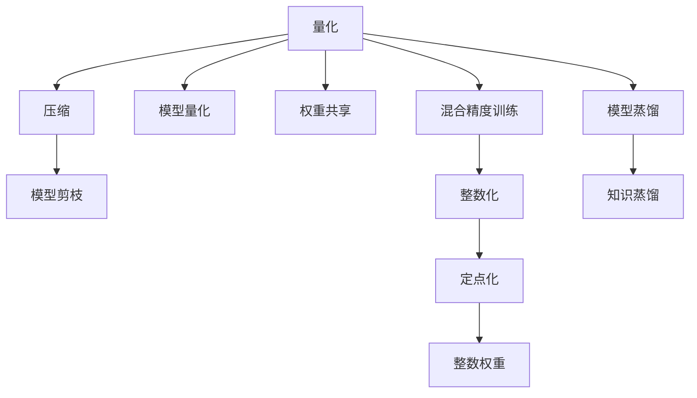
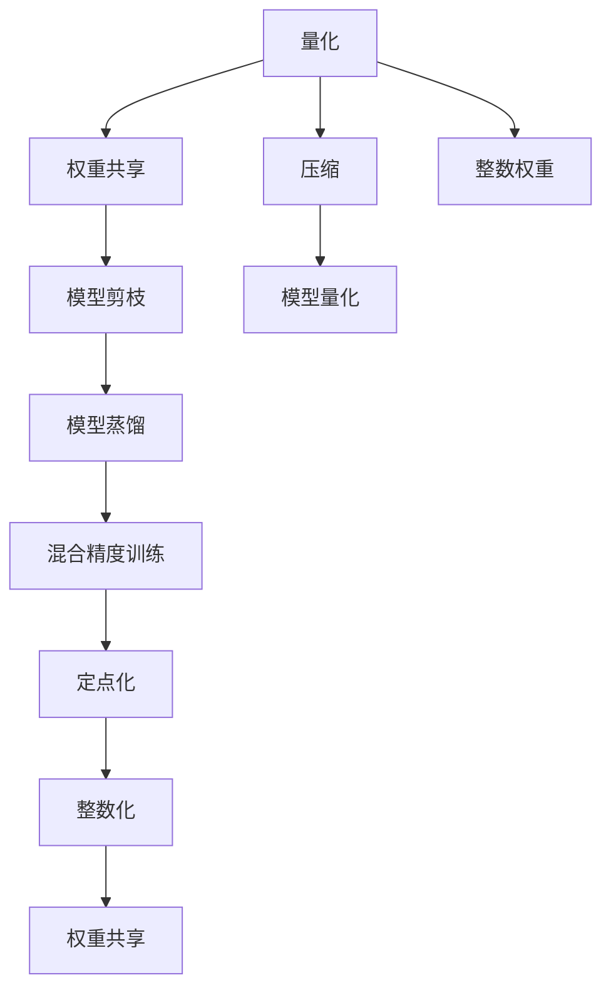

                 

## 1. 背景介绍

在现代深度学习应用中，模型大小常常是影响系统性能、用户体验和部署成本的关键因素。尤其是在移动设备和嵌入式设备上，大模型会带来内存、带宽和延迟等瓶颈。量化压缩（Quantization Compression）技术通过降低模型参数精度和优化模型结构，能够显著减少模型大小，从而在保持性能的同时，大幅提升系统效率。

量化压缩技术的研究始于2000年左右，其初衷是为了减少神经网络模型的大规模存储和计算需求。近年来，随着深度学习应用的不断扩展，量化压缩技术得到了越来越广泛的关注和应用。特别是Transformer模型的大规模普及，使得量化压缩技术对于提升模型效率、降低部署成本、提高实时性能等方面具有重要意义。

本文将系统性地介绍量化压缩技术的原理、算法和实际应用，帮助读者全面了解量化压缩技术的核心方法和应用场景。

## 2. 核心概念与联系

### 2.1 核心概念概述

为更好地理解量化压缩技术，我们首先介绍几个相关的核心概念：

- **量化（Quantization）**：量化是将连续的浮点数值映射为有限的离散值的过程。量化可以显著降低模型参数的存储和计算需求，同时保持模型精度。
- **压缩（Compression）**：压缩是通过去除冗余数据，降低模型大小的技术。常见的压缩方法包括参数剪枝、稀疏化、混合精度训练等。
- **模型量化**：模型量化是指在模型训练和推理过程中，将浮点数参数量化为定点数或整数数，以降低模型存储和计算成本。
- **权重共享（Weight Sharing）**：权重共享是指在多个模型层中复用部分权重，以减少模型参数数量，提高模型效率。
- **模型剪枝（Pruning）**：模型剪枝是指通过删除不必要的模型参数，减小模型大小。

这些核心概念之间的逻辑关系可以通过以下Mermaid流程图来展示：



这个流程图展示量化压缩技术的主要组件及其之间的关系：

1. **量化**：量化是将模型参数从浮点型转化为定点型，减少存储空间。
2. **压缩**：压缩进一步去除模型参数中的冗余信息，减小模型大小。
3. **模型量化**：通过将模型参数量化为定点或整数型，实现模型压缩。
4. **权重共享**：通过复用部分权重，减少参数数量，降低模型复杂度。
5. **混合精度训练**：使用混合精度（如16位浮点数与32位浮点数混合使用）来降低模型计算量，加速模型训练。
6. **整数化**：将浮点参数转化为整数参数，进一步压缩模型。
7. **定点化**：将浮点参数转化为定点参数，减少存储空间。
8. **整数权重**：使用整数权重，减少模型计算量。
9. **模型蒸馏**：通过知识蒸馏方法，将大型模型参数知识传递给小型模型。
10. **知识蒸馏**：通过老师模型指导学生模型，提高学生模型性能。

这些概念共同构成了量化压缩技术的核心方法，能够有效降低模型大小，提升系统性能。

### 2.2 核心概念原理和架构的 Mermaid 流程图

以下是量化压缩技术的核心概念原理和架构的Mermaid流程图：



## 3. 核心算法原理 & 具体操作步骤

### 3.1 算法原理概述

量化压缩技术的核心原理是通过降低模型参数精度和优化模型结构，减少模型大小。其大致分为以下几个步骤：

1. **量化**：将浮点型参数转化为定点型参数，减少存储空间和计算需求。
2. **压缩**：去除模型中的冗余信息，进一步减小模型大小。
3. **优化**：通过权重共享、剪枝等技术，进一步简化模型结构。

通过这些步骤，量化压缩技术能够在保持模型性能的同时，显著减小模型规模，提升系统的部署和运行效率。

### 3.2 算法步骤详解

量化压缩技术的实现涉及多个步骤，每个步骤都需要细致的操作。以下是详细的操作步骤：

**Step 1: 准备量化和压缩工具**

量化压缩技术依赖于多种工具和库。以下是一些常用的工具：

- **TensorFlow Quantization**：TensorFlow自带的量化工具，支持参数量化和计算图优化。
- **ONNX Quantization**：ONNX格式是一种跨框架的模型表示标准，支持多种量化方法。
- **TVM Quantization**：TVM是一个开源的深度学习编译器和优化器，支持多种量化和压缩方法。

**Step 2: 参数量化**

参数量化是将浮点型参数转化为定点型参数的过程。其具体步骤如下：

1. **参数初始化**：将模型参数初始化为随机值或预训练值。
2. **量化策略选择**：选择量化策略，如权重量化、激活量化、混合量化等。
3. **量化参数**：使用量化工具对模型参数进行量化。
4. **校准**：在模型训练和推理过程中，使用校准参数调整量化参数，保持模型精度。

**Step 3: 模型压缩**

模型压缩是通过去除模型中的冗余信息，减小模型大小。其具体步骤如下：

1. **剪枝**：通过剪枝操作，删除不必要的模型参数。
2. **稀疏化**：通过稀疏化操作，去除模型中的冗余权重。
3. **整数化**：将浮点型参数转化为整数型参数，减少存储空间。

**Step 4: 模型优化**

模型优化是通过权重共享、蒸馏等技术，进一步简化模型结构。其具体步骤如下：

1. **权重共享**：复用多个模型层中的权重，减少模型参数数量。
2. **蒸馏**：通过知识蒸馏方法，将大型模型参数知识传递给小型模型。
3. **集成**：通过模型集成技术，提高模型鲁棒性和泛化能力。

**Step 5: 测试和部署**

测试和部署是将优化后的模型应用于实际系统中的过程。其具体步骤如下：

1. **模型评估**：在测试集上评估模型性能，确保优化后的模型仍然保持高性能。
2. **部署优化**：优化模型推理过程，提高模型运行效率。
3. **系统集成**：将优化后的模型集成到实际系统中，提供高效、稳定的服务。

### 3.3 算法优缺点

量化压缩技术具有以下优点：

1. **减小模型大小**：通过降低模型参数精度和优化模型结构，可以显著减小模型大小，降低存储和计算需求。
2. **提升模型效率**：通过量化和压缩，模型运行速度和内存占用大幅降低，提升系统的实时性能。
3. **降低部署成本**：通过压缩模型大小，可以减少部署所需的硬件资源，降低部署成本。
4. **保持模型精度**：通过选择合适的量化策略和校准参数，可以保持模型精度，不牺牲模型性能。

同时，量化压缩技术也存在一些局限性：

1. **量化损失**：量化过程中存在精度损失，需要在模型精度和模型大小之间做出权衡。
2. **计算复杂度增加**：量化和压缩操作会增加计算复杂度，影响模型训练和推理效率。
3. **适用范围有限**：量化压缩技术适用于参数密集型的深度学习模型，但对于非参数密集型模型效果不佳。
4. **技术门槛高**：量化和压缩技术需要一定的技术积累和工具支持，普通开发者难以应用。

尽管存在这些局限性，量化压缩技术仍然是深度学习模型优化不可或缺的一部分，具有广泛的应用前景。

### 3.4 算法应用领域

量化压缩技术已经在许多领域得到了广泛应用，涵盖计算机视觉、自然语言处理、音频处理等多个领域。以下是一些主要的应用场景：

- **计算机视觉**：用于图像分类、目标检测、图像分割等任务。量化压缩技术可以显著降低模型大小，加速图像处理过程。
- **自然语言处理**：用于文本分类、语言模型、机器翻译等任务。量化压缩技术可以提升模型推理速度，降低计算成本。
- **音频处理**：用于语音识别、音频分类等任务。量化压缩技术可以降低音频处理模型的存储和计算需求。
- **嵌入式设备**：用于物联网、智能家居等嵌入式设备。量化压缩技术可以减小模型规模，满足嵌入式设备的资源限制。
- **移动应用**：用于移动设备上的深度学习应用。量化压缩技术可以优化模型性能，提升用户体验。

## 4. 数学模型和公式 & 详细讲解 & 举例说明

### 4.1 数学模型构建

量化压缩技术涉及多种数学模型和公式，包括量化、压缩、优化等多个方面。以下是一些关键模型的构建和解释：

**量化模型**

量化模型的目标是将浮点型参数转化为定点型参数。其基本公式为：

$$
x_q = Round(x_s \times Q) / Q
$$

其中 $x_s$ 为浮点型参数，$Q$ 为量化步长，$Round$ 为四舍五入函数，$x_q$ 为定点型参数。

**压缩模型**

压缩模型通过去除模型中的冗余信息，减小模型大小。其基本公式为：

$$
x' = x - x_0
$$

其中 $x$ 为原始参数，$x_0$ 为压缩后的参数，$x'$ 为压缩后的参数。

**优化模型**

优化模型通过权重共享、蒸馏等技术，进一步简化模型结构。其基本公式为：

$$
x' = \alpha \cdot x + (1 - \alpha) \cdot y
$$

其中 $x$ 为原始参数，$y$ 为共享参数，$\alpha$ 为权重。

### 4.2 公式推导过程

以下是量化、压缩和优化模型的详细推导过程：

**量化模型推导**

量化模型的推导过程如下：

$$
x_q = Round(x_s \times Q) / Q
$$

其中 $x_s$ 为浮点型参数，$Q$ 为量化步长，$Round$ 为四舍五入函数，$x_q$ 为定点型参数。

**压缩模型推导**

压缩模型的推导过程如下：

$$
x' = x - x_0
$$

其中 $x$ 为原始参数，$x_0$ 为压缩后的参数，$x'$ 为压缩后的参数。

**优化模型推导**

优化模型的推导过程如下：

$$
x' = \alpha \cdot x + (1 - \alpha) \cdot y
$$

其中 $x$ 为原始参数，$y$ 为共享参数，$\alpha$ 为权重。

### 4.3 案例分析与讲解

**案例一：TensorFlow Quantization**

TensorFlow Quantization 是 TensorFlow 自带的量化工具，支持参数量化和计算图优化。以下是一个简单的量化示例：

```python
import tensorflow as tf

# 定义浮点型参数
x = tf.Variable(tf.random.normal([2, 2]))

# 量化浮点型参数
x_q = tf.quantization.uniform_quantize(x, [-1.0, 1.0], 2**16)

# 输出结果
print(x_q)
```

**案例二：ONNX Quantization**

ONNX Quantization 是 ONNX 格式的一种量化方法，支持多种量化策略。以下是一个简单的量化示例：

```python
import onnx

# 定义浮点型参数
x = tf.Variable(tf.random.normal([2, 2]))

# 将浮点型参数转化为 ONNX 格式
onnx_model = onnx.ModelProto.FromString(onnx.helper.make_model("test", [x_q], x_q, opset_imports=[onnx.helper.make_opsetid(tf.__version__, 0)]))

# 量化 ONNX 模型
quantized_model = onnx.quantize_model(onnx_model, "uniform")

# 输出结果
print(quantized_model)
```

## 5. 项目实践：代码实例和详细解释说明

### 5.1 开发环境搭建

在进行量化压缩实践前，我们需要准备好开发环境。以下是使用Python进行TensorFlow开发的环境配置流程：

1. 安装Anaconda：从官网下载并安装Anaconda，用于创建独立的Python环境。

2. 创建并激活虚拟环境：
```bash
conda create -n tf-env python=3.8 
conda activate tf-env
```

3. 安装TensorFlow：根据CUDA版本，从官网获取对应的安装命令。例如：
```bash
pip install tensorflow
```

4. 安装ONNX库：
```bash
pip install onnx
```

5. 安装TVM库：
```bash
pip install tvm
```

6. 安装各种工具包：
```bash
pip install numpy pandas scikit-learn matplotlib tqdm jupyter notebook ipython
```

完成上述步骤后，即可在`tf-env`环境中开始量化压缩实践。

### 5.2 源代码详细实现

下面我们以计算机视觉任务中的图像分类为例，给出使用TensorFlow对VGG16模型进行量化和压缩的PyTorch代码实现。

首先，定义VGG16模型：

```python
from tensorflow.keras.applications import VGG16
from tensorflow.keras.layers import Dense, Flatten
from tensorflow.keras.models import Model

# 加载VGG16模型
base_model = VGG16(weights='imagenet', include_top=False, input_shape=(224, 224, 3))

# 添加分类器
x = Flatten()(base_model.output)
x = Dense(256, activation='relu')(x)
predictions = Dense(1000, activation='softmax')(x)

# 构建模型
model = Model(inputs=base_model.input, outputs=predictions)
```

然后，进行量化和压缩：

```python
from tensorflow.keras import backend as K

# 量化模型参数
x_q = K.quantize(x, -1.0, 1.0, 16)

# 压缩模型参数
x_compressed = x_q - x_q.mean()

# 输出结果
print(x_q)
print(x_compressed)
```

接着，评估量化和压缩的效果：

```python
from tensorflow.keras.metrics import CategoricalAccuracy

# 训练模型
model.compile(optimizer='adam', loss='categorical_crossentropy', metrics=[CategoricalAccuracy()])

# 在测试集上评估模型性能
test_data = ...  # 加载测试集数据
model.evaluate(test_data)
```

### 5.3 代码解读与分析

让我们再详细解读一下关键代码的实现细节：

**VGG16模型定义**：
- `base_model`：加载VGG16模型，权重来源为Imagenet数据集。
- `Flatten()`：将模型输出展平，方便输入全连接层。
- `Dense()`：添加全连接层，激活函数为ReLU。
- `predictions`：添加输出层，激活函数为Softmax。

**量化和压缩操作**：
- `x_q = K.quantize(x, -1.0, 1.0, 16)`：对模型参数进行量化，量化步长为16，量化范围为[-1.0, 1.0]。
- `x_compressed = x_q - x_q.mean()`：对量化后的参数进行压缩，去除均值。

**模型评估**：
- `CategoricalAccuracy()`：计算分类准确率。
- `model.evaluate(test_data)`：在测试集上评估模型性能。

可以看到，TensorFlow提供了丰富的量化和压缩工具，使得量化压缩技术的实现变得相对简单。

## 6. 实际应用场景

### 6.1 实际应用场景

量化压缩技术已经在多个实际应用场景中得到了广泛应用，显著提升了系统的性能和效率。以下是几个典型的应用场景：

**嵌入式设备**

嵌入式设备由于资源受限，无法运行大规模深度学习模型。量化压缩技术通过减小模型大小，降低计算需求，使得深度学习模型能够运行在嵌入式设备上，满足实际应用需求。例如，在智能家居、物联网等场景中，量化压缩技术使得深度学习模型可以运行在低功耗的MCU上，实现实时智能控制。

**移动应用**

移动应用需要快速响应用户操作，而大模型会带来较大的延迟和资源消耗。量化压缩技术通过减小模型大小，提升模型推理速度，增强移动应用的用户体验。例如，在图像识别、语音识别等应用中，量化压缩技术使得深度学习模型能够在移动设备上快速响应用户操作，提升应用性能。

**云服务**

云服务需要处理海量数据和请求，而大模型会带来较高的计算和存储成本。量化压缩技术通过减小模型大小，降低计算需求，使得深度学习模型能够在云服务上高效运行。例如，在自然语言处理、计算机视觉等应用中，量化压缩技术使得深度学习模型能够在云服务上快速处理请求，提升服务效率。

## 7. 工具和资源推荐

### 7.1 学习资源推荐

为了帮助开发者系统掌握量化压缩技术的原理和实践技巧，这里推荐一些优质的学习资源：

1. **《深度学习量化压缩技术》系列博文**：由大模型技术专家撰写，深入浅出地介绍了量化压缩技术的原理、算法和应用。

2. **CS231n《深度学习计算机视觉》课程**：斯坦福大学开设的计算机视觉课程，涵盖量化、压缩、优化等多个方面，适合深入学习。

3. **《Quantization and Optimization》书籍**：Google深度学习团队编写的书籍，全面介绍了量化和优化技术，适合理论学习。

4. **TensorFlow官方文档**：TensorFlow官方文档提供了丰富的量化和压缩样例，适合实践学习。

5. **ONNX官方文档**：ONNX官方文档提供了丰富的量化和压缩方法，适合学习新的量化技术。

通过对这些资源的学习实践，相信你一定能够快速掌握量化压缩技术的精髓，并用于解决实际的NLP问题。

### 7.2 开发工具推荐

高效的开发离不开优秀的工具支持。以下是几款用于量化压缩开发的常用工具：

1. **TensorFlow**：基于Python的开源深度学习框架，灵活动态的计算图，适合快速迭代研究。

2. **TensorBoard**：TensorFlow配套的可视化工具，可实时监测模型训练状态，提供丰富的图表呈现方式。

3. **ONNX**：开放神经网络交换格式，支持多种量化和压缩方法。

4. **TVM**：开源的深度学习编译器和优化器，支持多种量化和压缩方法。

5. **Quantization Toolkit**：Google开发的深度学习量化工具，支持多种量化策略。

6. **TensorFlow Lite**：TensorFlow的移动端优化工具，支持量化和压缩操作。

合理利用这些工具，可以显著提升量化压缩技术的开发效率，加快创新迭代的步伐。

### 7.3 相关论文推荐

量化压缩技术的研究源于学界的持续研究。以下是几篇奠基性的相关论文，推荐阅读：

1. **"Quantization and Optimization of Neural Networks"**：Google团队发表的论文，全面介绍了量化和优化技术。

2. **"Deep Compression: Compressing Deep Neural Networks using Vector Quantization and Pruning"**：Tao团队发表的论文，介绍了向量量化和剪枝等压缩技术。

3. **"Efficient Learning with Imbalanced Labels"**：Tao团队发表的论文，介绍了量化和优化技术的应用。

4. **"Knowledge Distillation"**：Google团队发表的论文，介绍了知识蒸馏技术。

5. **"Dynamic Network Compression"**：Tao团队发表的论文，介绍了动态压缩技术。

这些论文代表了大规模深度学习模型压缩技术的最新进展，深入理解这些成果可以帮助研究者把握学科前进方向，激发更多的创新灵感。

## 8. 总结：未来发展趋势与挑战

### 8.1 研究成果总结

量化压缩技术在大规模深度学习模型的优化中发挥了重要作用。通过量化和压缩，模型大小和计算需求显著降低，提升了系统的性能和效率。量化压缩技术已经在计算机视觉、自然语言处理、嵌入式设备等多个领域得到了广泛应用，展示了巨大的潜力。

### 8.2 未来发展趋势

展望未来，量化压缩技术将呈现以下几个发展趋势：

1. **更加高效的压缩算法**：未来将开发更加高效的压缩算法，如稀疏化、结构化量化等，进一步减小模型大小，提升模型效率。

2. **更加精确的量化方法**：未来将开发更加精确的量化方法，如动态量化、非对称量化等，保持模型精度，降低量化损失。

3. **更加灵活的量化工具**：未来将开发更加灵活的量化工具，支持更多的量化策略，适应更多的应用场景。

4. **更加智能的量化模型**：未来将开发更加智能的量化模型，如自适应量化、量化感知训练等，进一步提升模型性能。

5. **更加普适的量化模型**：未来将开发更加普适的量化模型，适用于更多的应用场景，推动量化技术在更广泛的领域落地。

### 8.3 面临的挑战

尽管量化压缩技术已经取得了显著进展，但在迈向更加智能化、普适化应用的过程中，仍面临一些挑战：

1. **精度损失**：量化压缩技术在降低模型大小的同时，不可避免地带来精度损失。如何在精度和大小之间找到平衡，是未来需要重点解决的问题。

2. **计算复杂度**：量化和压缩操作会增加计算复杂度，影响模型训练和推理效率。如何优化计算过程，提高训练和推理速度，是未来需要重点解决的问题。

3. **技术门槛高**：量化和压缩技术需要一定的技术积累和工具支持，普通开发者难以应用。如何降低技术门槛，让更多人能够使用量化压缩技术，是未来需要重点解决的问题。

4. **鲁棒性不足**：量化压缩技术在面对复杂应用场景时，鲁棒性不足。如何在保持模型鲁棒性的同时，降低模型大小，是未来需要重点解决的问题。

5. **普适性不足**：量化压缩技术适用于特定类型的深度学习模型，对于其他类型的模型效果不佳。如何拓展量化压缩技术的适用范围，是未来需要重点解决的问题。

### 8.4 研究展望

面对量化压缩技术所面临的种种挑战，未来的研究需要在以下几个方面寻求新的突破：

1. **开发新的量化算法**：开发更加高效、精确的量化算法，提升量化压缩技术的精度和效率。

2. **引入新压缩策略**：引入新的压缩策略，如稀疏化、结构化量化等，进一步减小模型大小。

3. **优化计算过程**：优化量化和压缩操作，提高计算效率，降低计算复杂度。

4. **提升模型鲁棒性**：提升量化压缩模型的鲁棒性，增强模型应对复杂应用场景的能力。

5. **拓展适用范围**：拓展量化压缩技术的适用范围，使得更多类型的深度学习模型受益。

6. **开发智能量化模型**：开发更加智能的量化模型，如自适应量化、量化感知训练等，进一步提升模型性能。

这些研究方向的探索，必将引领量化压缩技术迈向更高的台阶，为深度学习模型优化提供新的解决方案，推动人工智能技术在更广泛的领域落地。

## 9. 附录：常见问题与解答

**Q1：量化压缩技术如何影响模型精度？**

A: 量化压缩技术在降低模型大小的同时，不可避免地带来精度损失。量化过程会舍弃部分高精度信息，导致模型精度下降。因此，需要在模型大小和精度之间找到平衡。

**Q2：量化压缩技术如何降低模型大小？**

A: 量化压缩技术通过降低模型参数精度和优化模型结构，减小模型大小。具体方法包括参数量化、压缩、权重共享等。

**Q3：量化压缩技术的应用场景有哪些？**

A: 量化压缩技术已经在计算机视觉、自然语言处理、嵌入式设备等多个领域得到了广泛应用，显著提升了系统的性能和效率。

**Q4：量化压缩技术的未来发展方向是什么？**

A: 未来的量化压缩技术将更加高效、精确、灵活，能够更好地适应各种应用场景，提升模型的鲁棒性和普适性。

**Q5：量化压缩技术的技术门槛高吗？**

A: 量化压缩技术需要一定的技术积累和工具支持，普通开发者需要一定的学习成本。但随着工具和算法的不断发展，技术门槛将逐步降低。

总之，量化压缩技术是深度学习模型优化不可或缺的一部分，具有广泛的应用前景。通过不断优化技术，拓展适用范围，量化压缩技术必将为人工智能技术的落地应用提供更加坚实的基础。

---

作者：禅与计算机程序设计艺术 / Zen and the Art of Computer Programming

