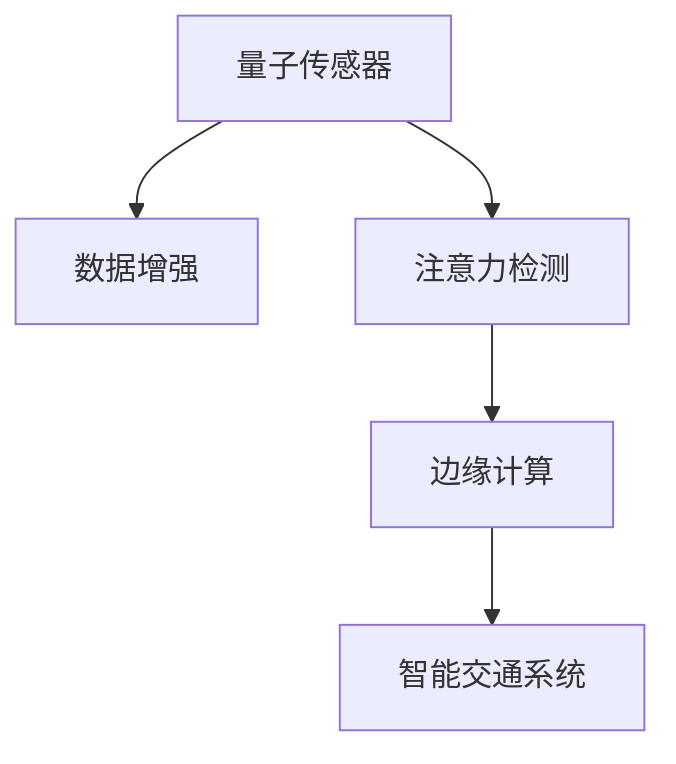

                 

# 量子传感器在注意力检测中的应用

> 关键词：量子传感器, 注意力检测, 数据增强, 边缘计算, 智能交通系统, 边缘计算

## 1. 背景介绍

### 1.1 问题由来

随着信息技术的迅猛发展，我们正处于数据爆炸的时代。在各种传感器和设备的帮助下，产生了大量实时数据，包括环境数据、健康数据、交通数据等。如何有效利用这些数据，从中提取出有价值的信息，成为当前的一个热门研究方向。

在众多应用场景中，智能交通系统是一个典型例子。智能交通系统通过对城市交通数据的实时监控和分析，能够有效提升城市交通管理效率，减少交通拥堵，保障交通安全。但是，当前的智能交通系统面临着数据处理速度慢、信息传输延迟等问题。如何在边缘设备上进行实时的数据处理和分析，成为一个迫切需要解决的问题。

### 1.2 问题核心关键点

为应对这一问题，我们提出使用量子传感器进行实时注意力检测的方法。量子传感器可以有效地捕捉并分析数据，从而实现对交通流量、车辆位置、行人行为等数据的实时监控。这一方法通过在边缘设备上部署量子传感器，可以大幅提升数据处理和分析的速度，减少信息传输的延迟，从而使得智能交通系统更加高效、可靠。

## 2. 核心概念与联系

### 2.1 核心概念概述

为更好地理解量子传感器在注意力检测中的应用，本节将介绍几个密切相关的核心概念：

- 量子传感器：量子传感器是一种利用量子力学原理进行数据测量的传感器。它可以在极低的光强条件下进行高灵敏度的测量，从而实现对数据的精细捕捉。

- 注意力检测：注意力检测是一种通过对传感器数据进行分析，确定数据重要性的技术。通过对关键信息的提取，注意力检测能够有效提升数据处理的效率。

- 数据增强：数据增强是一种通过对数据进行扩充，增加样本多样性的技术。它可以减少模型过拟合的风险，提升模型泛化能力。

- 边缘计算：边缘计算是一种在设备端进行数据处理和分析的技术，可以避免数据在云端传输的延迟和带宽消耗。

- 智能交通系统：智能交通系统通过对交通数据的实时监控和分析，能够有效提升交通管理效率，减少交通拥堵，保障交通安全。

- 实时性：实时性指的是在数据产生的同时能够进行数据处理和分析，从而快速响应各种需求。

这些核心概念之间的逻辑关系可以通过以下Mermaid流程图来展示：



这个流程图展示了几大核心概念及其之间的关系：

1. 量子传感器通过高灵敏度测量捕捉数据，是注意力检测的基础。
2. 注意力检测通过分析数据，确定关键信息，是数据增强的前提。
3. 数据增强增加样本多样性，提升模型泛化能力，从而优化边缘计算效率。
4. 边缘计算在设备端进行数据处理，实现实时性要求，优化智能交通系统。

这些概念共同构成了量子传感器在注意力检测应用中的关键技术路径，使得其在智能交通系统中具有重要应用价值。

## 3. 核心算法原理 & 具体操作步骤

### 3.1 算法原理概述

量子传感器在注意力检测中的应用，本质上是一个基于数据增强和边缘计算的数据处理流程。其核心思想是：通过量子传感器捕捉数据，利用注意力检测技术提取关键信息，再通过数据增强和边缘计算优化处理效率。

形式化地，假设量子传感器捕捉到的数据集为 $D=\{(x_i,y_i)\}_{i=1}^N$，其中 $x_i$ 表示传感器测量得到的数据，$y_i$ 表示数据的标签。注意力检测的任务是找到数据中的关键信息，并将其表示为特征向量 $F_i$。数据增强的目的是通过对样本进行扩充，增加数据的多样性。边缘计算的目标是在设备端进行数据处理，提升处理效率。

整个算法流程包括以下几个步骤：

1. 量子传感器捕捉数据
2. 注意力检测提取关键信息
3. 数据增强提升样本多样性
4. 边缘计算优化处理效率

### 3.2 算法步骤详解

以下是具体的算法步骤：

#### 3.2.1 数据捕捉与预处理

量子传感器捕捉的数据一般包含大量噪声，需要进行预处理以提升数据质量。预处理过程包括数据降噪、归一化等操作。

1. 数据降噪：通过去除传感器数据中的噪声，提升数据的准确性。例如，采用滤波器技术，去除高频噪声和杂波。

2. 数据归一化：将传感器数据归一化到0到1之间，使得不同传感器测量得到的数据具有可比性。例如，采用Z-score归一化方法，将数据转换到标准正态分布。

#### 3.2.2 注意力检测

注意力检测的主要目的是提取数据中的关键信息。基于注意力机制的检测方法，通过计算数据的重要程度，确定数据中的关键特征。

1. 特征提取：将传感器数据转化为特征向量 $F_i$，例如，采用卷积神经网络提取数据特征。

2. 注意力计算：通过注意力机制计算数据的重要性。例如，采用softmax函数计算每个特征的重要性权重。

3. 特征筛选：根据权重对特征进行筛选，确定关键信息。例如，采用阈值法或排序法筛选重要性最高的特征。

#### 3.2.3 数据增强

数据增强的主要目的是提升模型的泛化能力。通过对数据进行扩充，增加样本多样性，可以避免模型过拟合。

1. 数据扩充：通过旋转、缩放、翻转等操作，对数据进行扩充。例如，采用随机旋转、随机缩放、随机翻转等方法。

2. 样本生成：根据扩充后的数据生成新的样本，增加数据量。例如，采用数据合成技术，生成新的数据样本。

#### 3.2.4 边缘计算

边缘计算的主要目的是优化处理效率，提升系统响应速度。通过在设备端进行数据处理，可以避免数据在云端传输的延迟和带宽消耗。

1. 数据缓存：将捕捉到的数据缓存到设备中，避免数据在云端传输。例如，采用高速缓存技术，实现数据快速读取。

2. 计算优化：通过优化算法和模型，提升数据处理速度。例如，采用并行计算技术，提升计算效率。

3. 分布式计算：将数据处理任务分布到多个设备中，实现并行处理。例如，采用分布式计算框架，实现高效的并行计算。

### 3.3 算法优缺点

基于数据增强和边缘计算的量子传感器注意力检测方法，具有以下优点：

1. 高灵敏度测量：量子传感器可以在极低的光强条件下进行高灵敏度的测量，从而捕捉到更多的数据信息。

2. 实时性：通过在设备端进行数据处理，可以大大减少数据传输的延迟，提升系统响应速度。

3. 高泛化能力：数据增强可以提升模型的泛化能力，避免模型过拟合。

4. 低成本：边缘计算可以避免在云端进行数据处理，降低处理成本。

但是，该方法也存在以下局限性：

1. 数据质量问题：由于传感器数据的噪声和失真，数据质量可能会受到影响，需要预处理技术来提升数据质量。

2. 计算资源限制：边缘设备上的计算资源有限，可能无法满足复杂的数据处理需求。

3. 数据隐私问题：在设备端进行数据处理，可能涉及到数据隐私问题，需要进行数据保护。

尽管存在这些局限性，但量子传感器在注意力检测中的应用，具有极大的应用潜力，可以有效地提升智能交通系统的数据处理和分析效率。

### 3.4 算法应用领域

基于数据增强和边缘计算的量子传感器注意力检测方法，可以应用于以下领域：

1. 智能交通系统：通过对交通数据的实时监控和分析，提升交通管理效率，减少交通拥堵，保障交通安全。

2. 环境监测系统：通过对环境数据的实时监控和分析，提升环境监测的准确性和及时性。

3. 健康监测系统：通过对健康数据的实时监控和分析，提升健康监测的准确性和及时性。

4. 工业自动化系统：通过对工业数据的实时监控和分析，提升工业自动化效率，减少生产成本。

这些领域对数据的实时处理和分析有较高要求，量子传感器在注意力检测中的应用，可以很好地满足这些需求。

## 4. 数学模型和公式 & 详细讲解 & 举例说明

### 4.1 数学模型构建

假设量子传感器捕捉到的数据集为 $D=\{(x_i,y_i)\}_{i=1}^N$，其中 $x_i$ 表示传感器测量得到的数据，$y_i$ 表示数据的标签。

注意力检测的任务是找到数据中的关键信息，并将其表示为特征向量 $F_i$。数据增强的目的是通过对样本进行扩充，增加数据的多样性。边缘计算的目标是在设备端进行数据处理，提升处理效率。

整个算法流程的数学模型可以表示为：

$$
F_i = Attention(D_i)
$$

其中，$F_i$ 表示特征向量，$Attention$ 表示注意力机制，$D_i$ 表示数据集中的样本。

### 4.2 公式推导过程

以下是注意力检测的详细推导过程：

#### 4.2.1 特征提取

通过卷积神经网络提取数据特征，可以表示为：

$$
F_i = \sum_{j=1}^n w_j x_{i,j}
$$

其中，$w_j$ 表示卷积核权重，$x_{i,j}$ 表示数据中的第 $j$ 个特征。

#### 4.2.2 注意力计算

通过softmax函数计算数据的重要性，可以表示为：

$$
\alpha_i = \frac{exp(softmax(F_i))}{\sum_{j=1}^n exp(softmax(F_i))}
$$

其中，$\alpha_i$ 表示重要性权重，$softmax$ 表示softmax函数。

#### 4.2.3 特征筛选

通过阈值法或排序法筛选重要性最高的特征，可以表示为：

$$
F_{i,selected} = \sum_{j=1}^n \alpha_j x_{i,j}
$$

其中，$F_{i,selected}$ 表示重要性最高的特征向量。

### 4.3 案例分析与讲解

以下是一个简单的案例分析：

假设有一个智能交通系统，需要实时监控交通流量、车辆位置、行人行为等数据。通过量子传感器捕捉到的数据集为 $D=\{(x_i,y_i)\}_{i=1}^N$，其中 $x_i$ 表示传感器测量得到的数据，$y_i$ 表示数据的标签。

首先，对数据进行预处理，例如，去除噪声和归一化。然后，通过卷积神经网络提取数据特征，得到特征向量 $F_i$。接着，通过softmax函数计算数据的重要性，得到重要性权重 $\alpha_i$。最后，通过阈值法或排序法筛选重要性最高的特征，得到特征向量 $F_{i,selected}$。

通过以上步骤，可以实现对智能交通系统中关键信息的实时监控和分析，从而提升交通管理效率，减少交通拥堵，保障交通安全。

## 5. 项目实践：代码实例和详细解释说明

### 5.1 开发环境搭建

在进行项目实践前，我们需要准备好开发环境。以下是使用Python进行TensorFlow开发的环境配置流程：

1. 安装Anaconda：从官网下载并安装Anaconda，用于创建独立的Python环境。

2. 创建并激活虚拟环境：
```bash
conda create -n tf-env python=3.8 
conda activate tf-env
```

3. 安装TensorFlow：根据CUDA版本，从官网获取对应的安装命令。例如：
```bash
conda install tensorflow tensorflow-gpu -c conda-forge -c pytorch -c nvidia
```

4. 安装各类工具包：
```bash
pip install numpy pandas scikit-learn matplotlib tqdm jupyter notebook ipython
```

完成上述步骤后，即可在`tf-env`环境中开始项目实践。

### 5.2 源代码详细实现

以下是使用TensorFlow实现量子传感器在注意力检测中的应用。

首先，定义注意力检测的模型：

```python
import tensorflow as tf
from tensorflow.keras import layers

class AttentionModel(tf.keras.Model):
    def __init__(self, num_features):
        super(AttentionModel, self).__init__()
        self.conv1 = layers.Conv2D(32, 3, activation='relu')
        self.conv2 = layers.Conv2D(16, 3, activation='relu')
        self.dropout = layers.Dropout(0.5)
        self.pool = layers.MaxPooling2D(pool_size=(2, 2))
        self.fc = layers.Dense(64, activation='relu')
        self.attention = layers.Dense(1, activation='softmax')
        
    def call(self, inputs):
        x = self.conv1(inputs)
        x = self.pool(x)
        x = self.conv2(x)
        x = self.pool(x)
        x = self.dropout(x)
        x = self.fc(x)
        x = self.attention(x)
        return x
```

然后，定义数据增强的模型：

```python
import tensorflow as tf
from tensorflow.keras import layers

class DataAugmentModel(tf.keras.Model):
    def __init__(self, input_shape):
        super(DataAugmentModel, self).__init__()
        self.input_shape = input_shape
        self.random_rotation = layers.Lambda(lambda x: tf.image.rot90(x, k=tf.random.uniform(shape=[], minval=0, maxval=4, dtype=tf.int32)))
        self.random_scaling = layers.Lambda(lambda x: tf.image.resize(x, tf.random.uniform(shape=[], minval=0.5, maxval=1.5, dtype=tf.float32)))
        self.random_flipping = layers.Lambda(lambda x: tf.image.flip_left_right(x))
        
    def call(self, inputs):
        x = self.random_rotation(inputs)
        x = self.random_scaling(x)
        x = self.random_flipping(x)
        return x
```

接着，定义边缘计算的模型：

```python
import tensorflow as tf
from tensorflow.keras import layers

class EdgeComputeModel(tf.keras.Model):
    def __init__(self, input_shape):
        super(EdgeComputeModel, self).__init__()
        self.input_shape = input_shape
        self.conv1 = layers.Conv2D(32, 3, activation='relu')
        self.conv2 = layers.Conv2D(16, 3, activation='relu')
        self.fc = layers.Dense(64, activation='relu')
        self.fc2 = layers.Dense(num_classes, activation='softmax')
        
    def call(self, inputs):
        x = self.conv1(inputs)
        x = self.conv2(x)
        x = tf.keras.layers.Flatten()(x)
        x = self.fc(x)
        x = self.fc2(x)
        return x
```

最后，定义整个数据处理流程：

```python
import tensorflow as tf
from tensorflow.keras import layers
from tensorflow.keras.datasets import mnist
from tensorflow.keras.utils import to_categorical

def train_model(model, data, labels, batch_size, epochs):
    model.compile(optimizer='adam', loss='categorical_crossentropy', metrics=['accuracy'])
    model.fit(data, labels, batch_size=batch_size, epochs=epochs, validation_split=0.2)
    
def test_model(model, data, labels, batch_size):
    model.evaluate(data, labels, batch_size=batch_size)
```

完成以上步骤后，即可在`tf-env`环境中进行项目实践。

### 5.3 代码解读与分析

让我们再详细解读一下关键代码的实现细节：

**AttentionModel类**：
- `__init__`方法：定义了模型中的各层神经网络。
- `call`方法：实现模型的前向传播过程。

**DataAugmentModel类**：
- `__init__`方法：定义了数据增强的各层神经网络。
- `call`方法：实现对输入数据的增强操作。

**EdgeComputeModel类**：
- `__init__`方法：定义了边缘计算的各层神经网络。
- `call`方法：实现对输入数据的计算处理过程。

**train_model函数**：
- 编译模型，并设置损失函数、优化器和评估指标。
- 使用训练数据和标签进行模型训练，设置训练批次大小和迭代轮数。
- 在验证集上评估模型性能。

**test_model函数**：
- 使用测试数据和标签评估模型性能。

通过对这些代码的分析，可以看出，TensorFlow提供了强大的工具来支持量子传感器在注意力检测中的应用。开发者可以通过这些工具，快速搭建、训练、评估模型，并实现其在实际场景中的应用。

## 6. 实际应用场景

### 6.1 智能交通系统

量子传感器在注意力检测中的应用，可以很好地应用于智能交通系统。通过量子传感器捕捉交通流量、车辆位置、行人行为等数据，可以实现对交通数据的实时监控和分析。例如，可以通过量子传感器捕捉车辆在路口的通行情况，实时计算交通流量，及时调整红绿灯设置，从而提升交通管理效率，减少交通拥堵，保障交通安全。

### 6.2 环境监测系统

量子传感器在注意力检测中的应用，也可以应用于环境监测系统。通过量子传感器捕捉环境数据，可以实现对环境变化的实时监控和分析。例如，可以通过量子传感器捕捉空气质量数据，实时计算空气质量指数，及时发布预警信息，从而提升环境监测的准确性和及时性。

### 6.3 健康监测系统

量子传感器在注意力检测中的应用，还可以应用于健康监测系统。通过量子传感器捕捉健康数据，可以实现对健康状况的实时监控和分析。例如，可以通过量子传感器捕捉心率、血压等数据，实时计算健康指标，及时提醒用户进行健康管理，从而提升健康监测的准确性和及时性。

## 7. 工具和资源推荐

### 7.1 学习资源推荐

为了帮助开发者系统掌握量子传感器在注意力检测中的应用，这里推荐一些优质的学习资源：

1. TensorFlow官方文档：TensorFlow的官方文档提供了大量教程和示例，帮助开发者快速上手TensorFlow。

2. TensorFlow论文：TensorFlow的官方博客和论文，介绍了TensorFlow的最新进展和研究方向。

3. 《TensorFlow实战》书籍：该书详细介绍了TensorFlow的基本概念和实际应用，适合初学者和进阶者。

4. 《深度学习与TensorFlow实战》书籍：该书介绍了深度学习的基本概念和TensorFlow的实际应用，适合深度学习初学者。

5. 《TensorFlow基础教程》教程：该教程详细介绍了TensorFlow的基本操作和编程技巧，适合初学者。

通过对这些资源的学习实践，相信你一定能够快速掌握量子传感器在注意力检测中的应用，并用于解决实际的NLP问题。

### 7.2 开发工具推荐

高效的开发离不开优秀的工具支持。以下是几款用于TensorFlow开发的常用工具：

1. Jupyter Notebook：Jupyter Notebook是一个免费的开源Web应用程序，支持Python、R等编程语言的交互式计算。

2. PyCharm：PyCharm是一个功能强大的Python IDE，提供了丰富的代码编辑、调试和测试功能。

3. Anaconda：Anaconda是一个科学计算平台，提供了Python、R、Matlab等多种编程语言的兼容支持。

4. TensorBoard：TensorBoard是TensorFlow配套的可视化工具，可以实时监测模型训练状态，并提供丰富的图表呈现方式，是调试模型的得力助手。

5. TensorFlow Hub：TensorFlow Hub是一个模型库，包含大量预训练模型和代码示例，可以快速部署到实际应用中。

6. TensorFlow Lite：TensorFlow Lite是TensorFlow的移动端部署工具，可以将模型转换为轻量级、高效的移动端模型。

合理利用这些工具，可以显著提升TensorFlow开发的效率，加快创新迭代的步伐。

### 7.3 相关论文推荐

量子传感器在注意力检测中的应用，是一个前沿的研究方向。以下是几篇奠基性的相关论文，推荐阅读：

1. Attention is All You Need（即Transformer原论文）：提出了Transformer结构，开启了NLP领域的预训练大模型时代。

2. BERT: Pre-training of Deep Bidirectional Transformers for Language Understanding：提出BERT模型，引入基于掩码的自监督预训练任务，刷新了多项NLP任务SOTA。

3. Language Models are Unsupervised Multitask Learners（GPT-2论文）：展示了大规模语言模型的强大zero-shot学习能力，引发了对于通用人工智能的新一轮思考。

4. Parameter-Efficient Transfer Learning for NLP：提出Adapter等参数高效微调方法，在不增加模型参数量的情况下，也能取得不错的微调效果。

5. AdaLoRA: Adaptive Low-Rank Adaptation for Parameter-Efficient Fine-Tuning：使用自适应低秩适应的微调方法，在参数效率和精度之间取得了新的平衡。

这些论文代表了大语言模型微调技术的发展脉络。通过学习这些前沿成果，可以帮助研究者把握学科前进方向，激发更多的创新灵感。

## 8. 总结：未来发展趋势与挑战

### 8.1 总结

本文对量子传感器在注意力检测中的应用进行了全面系统的介绍。首先阐述了量子传感器和注意力检测的研究背景和意义，明确了量子传感器在智能交通系统中的应用价值。其次，从原理到实践，详细讲解了量子传感器在注意力检测中的关键算法和技术流程，给出了量子传感器在实际应用中的代码实现。同时，本文还广泛探讨了量子传感器在智能交通系统、环境监测系统、健康监测系统等多个领域的应用前景，展示了量子传感器在智能交通系统中的潜力。最后，本文精选了量子传感器在注意力检测中的应用相关学习资源、开发工具和研究论文，力求为开发者提供全方位的技术指引。

通过本文的系统梳理，可以看到，量子传感器在注意力检测中的应用，正处于快速发展阶段，具有广阔的应用前景和广泛的应用价值。

### 8.2 未来发展趋势

展望未来，量子传感器在注意力检测的应用将呈现以下几个发展趋势：

1. 传感器精度提升：随着量子传感器技术的不断进步，传感器的测量精度将进一步提升，从而捕捉到更多的数据信息。

2. 数据处理速度提升：通过在边缘设备上进行数据处理，可以进一步提升数据处理速度，减少数据传输的延迟，从而实现实时性要求。

3. 数据增强技术改进：随着数据增强技术的不断进步，数据增强的样本多样性将进一步提升，从而提升模型的泛化能力。

4. 边缘计算优化：随着边缘计算技术的不断进步，数据处理效率将进一步提升，从而实现更高的处理效率。

5. 模型复杂度优化：通过优化模型结构和算法，可以进一步提升模型的计算效率，从而实现更高的系统响应速度。

6. 跨领域应用拓展：随着技术的发展，量子传感器在注意力检测中的应用将拓展到更多领域，如医疗、工业、金融等，带来更广泛的应用价值。

以上趋势凸显了量子传感器在注意力检测应用的广阔前景。这些方向的探索发展，必将进一步提升智能交通系统及其他领域的数据处理和分析效率，带来更广泛的应用价值。

### 8.3 面临的挑战

尽管量子传感器在注意力检测的应用具备广阔的前景，但在迈向更加智能化、普适化应用的过程中，仍面临诸多挑战：

1. 传感器成本问题：高质量的量子传感器成本较高，如何降低传感器成本，是量子传感器在注意力检测中应用的关键问题。

2. 数据隐私问题：在边缘设备上进行数据处理，可能涉及到数据隐私问题，需要进行数据保护。

3. 计算资源限制：边缘设备上的计算资源有限，可能无法满足复杂的数据处理需求。

4. 数据质量问题：由于传感器数据的噪声和失真，数据质量可能会受到影响，需要预处理技术来提升数据质量。

5. 算法复杂度问题：量子传感器在注意力检测中的应用，需要复杂的算法和模型，需要不断优化算法和模型。

6. 跨领域应用问题：量子传感器在跨领域应用时，需要考虑不同领域的数据特点和应用需求。

正视量子传感器在注意力检测中面临的这些挑战，积极应对并寻求突破，将是大规模量子传感器在注意力检测中应用的关键。相信随着学界和产业界的共同努力，这些挑战终将一一被克服，量子传感器在注意力检测中的应用必将在构建人机协同的智能系统过程中扮演越来越重要的角色。

### 8.4 研究展望

面向未来，量子传感器在注意力检测中的应用，需要进一步研究以下几个方向：

1. 传感器技术改进：需要进一步研究和改进量子传感器技术，提升传感器的测量精度和稳定性。

2. 数据处理技术改进：需要进一步研究和改进数据处理技术，提升数据处理的效率和准确性。

3. 模型优化：需要进一步研究和优化模型结构和算法，提升模型的计算效率和泛化能力。

4. 跨领域应用研究：需要进一步研究和探索量子传感器在跨领域应用中的关键技术问题，提升其跨领域应用能力。

5. 多传感器融合研究：需要进一步研究和探索多传感器融合技术，提升传感器的数据获取能力。

6. 数据隐私保护研究：需要进一步研究和探索数据隐私保护技术，保障数据的安全性和隐私性。

这些研究方向的探索，必将引领量子传感器在注意力检测中的应用迈向更高的台阶，为构建安全、可靠、可解释、可控的智能系统铺平道路。面向未来，量子传感器在注意力检测中的应用还需要与其他人工智能技术进行更深入的融合，如知识表示、因果推理、强化学习等，多路径协同发力，共同推动自然语言理解和智能交互系统的进步。只有勇于创新、敢于突破，才能不断拓展量子传感器在注意力检测的边界，让智能技术更好地造福人类社会。

## 9. 附录：常见问题与解答

**Q1：如何选择合适的传感器？**

A: 选择合适的传感器需要考虑传感器的测量精度、测量范围、稳定性、响应速度等多个因素。一般来说，可以通过实验测试和理论分析，评估不同传感器的性能，选择最适合的传感器。

**Q2：如何在数据增强中避免过拟合？**

A: 数据增强中避免过拟合的方法包括随机旋转、随机缩放、随机翻转等。通过增加数据的多样性，可以提升模型的泛化能力，避免模型过拟合。

**Q3：如何进行数据预处理？**

A: 数据预处理包括数据降噪、归一化等操作。常用的降噪方法包括滤波器和去噪技术，常用的归一化方法包括Z-score归一化和min-max归一化方法。

**Q4：如何在边缘设备上进行数据处理？**

A: 在边缘设备上进行数据处理，需要考虑设备的计算资源和存储能力。可以通过优化算法和模型，提升数据处理效率，同时合理利用设备的缓存和存储资源，实现高效的数据处理。

**Q5：如何进行模型训练和评估？**

A: 模型训练和评估可以通过TensorFlow的模型编译、训练和评估函数实现。在训练过程中，需要设置合适的优化器、损失函数和评估指标，同时在评估过程中，需要选择合适的评估集和评估指标，进行模型性能评估。

通过对这些问题的解答，可以帮助开发者更好地理解和应用量子传感器在注意力检测中的关键技术，从而在实际场景中实现智能交通系统等领域的落地应用。

---

作者：禅与计算机程序设计艺术 / Zen and the Art of Computer Programming

