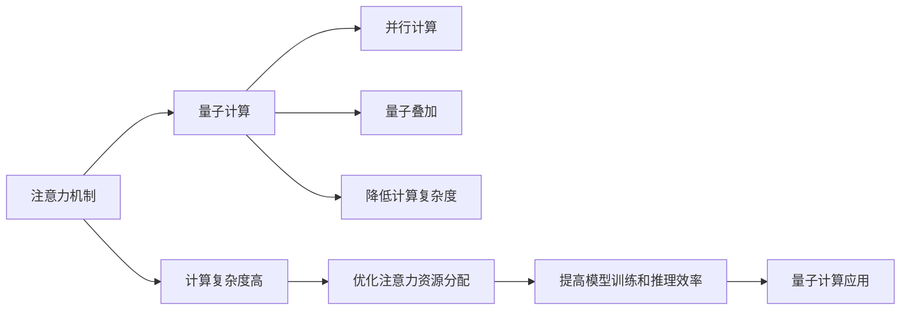

                 

# 量子计算在注意力资源优化中的应用前景

> 关键词：量子计算,注意力资源优化,量子算法,机器学习,神经网络,计算复杂度,算法优化

## 1. 背景介绍

### 1.1 问题由来

随着机器学习和大数据技术的飞速发展，深度学习模型在各个领域的应用越来越广泛。然而，随着模型规模的不断增大，计算资源的需求也越来越高，传统的计算方法难以满足大规模模型的训练和推理需求。尤其是在注意力机制普遍应用于深度学习模型中后，计算资源的开销变得更大。如何优化注意力资源的使用，提高模型的训练和推理效率，成为了当前研究的一个热点问题。

### 1.2 问题核心关键点

1. **注意力资源优化**：注意力机制在深度学习模型中起到了关键作用，如何优化注意力资源的分配，使其能够更高效地执行任务，是当前研究的重点之一。
2. **量子计算**：量子计算具有并行计算和量子叠加的特性，能够在大规模数据处理上具有优势，被认为是一种解决注意力资源优化问题的新方法。
3. **计算复杂度**：深度学习模型计算复杂度高，如何降低计算复杂度，提高模型训练和推理效率，是优化模型的关键。

## 2. 核心概念与联系

### 2.1 核心概念概述

在深度学习模型中，注意力机制用于选择重要的特征进行计算，提高了模型的泛化能力和鲁棒性。然而，注意力机制的计算复杂度高，尤其是在大规模数据上，注意力资源的优化变得尤为重要。

量子计算通过利用量子叠加和量子并行计算的特性，能够显著降低计算复杂度，提高计算效率。量子计算在优化注意力资源分配方面具有巨大潜力，可以应用于机器学习模型的训练和推理中。

### 2.2 核心概念原理和架构的 Mermaid 流程图



### 2.3 核心概念之间的关系

1. **注意力机制**：深度学习模型中的一种机制，用于选择重要的特征进行计算。
2. **计算复杂度高**：深度学习模型的计算复杂度较高，特别是在大规模数据上。
3. **量子计算**：一种新型的计算方式，具有并行计算和量子叠加的特性。
4. **并行计算**：量子计算中的并行计算特性可以显著提高计算效率。
5. **量子叠加**：量子计算中的量子叠加特性可以降低计算复杂度。
6. **降低计算复杂度**：通过量子计算，可以降低深度学习模型的计算复杂度。
7. **优化注意力资源分配**：通过优化注意力资源的分配，可以提高模型的训练和推理效率。
8. **提高模型训练和推理效率**：优化注意力资源分配后，可以提高模型的训练和推理效率。
9. **量子计算应用**：量子计算可以应用于深度学习模型的训练和推理中。

## 3. 核心算法原理 & 具体操作步骤

### 3.1 算法原理概述

量子计算在注意力资源优化中的应用，主要基于量子算法和优化算法。量子算法能够利用量子叠加和量子并行计算的特性，降低计算复杂度。优化算法则用于优化注意力资源的分配，使其能够更高效地执行任务。

### 3.2 算法步骤详解

1. **量子算法选择**：选择适合的量子算法，如量子搜索算法、量子随机行走等，用于计算注意力资源分配。
2. **数据准备**：准备用于优化注意力资源的训练数据和测试数据。
3. **量子计算模型构建**：构建基于量子计算的注意力资源优化模型。
4. **量子计算训练**：使用训练数据对量子计算模型进行训练。
5. **优化结果验证**：使用测试数据对优化结果进行验证，评估优化效果。
6. **量子计算优化**：根据优化结果对量子计算模型进行优化，重复训练和验证过程。

### 3.3 算法优缺点

#### 优点

1. **计算效率高**：量子计算具有并行计算和量子叠加的特性，能够显著降低计算复杂度，提高计算效率。
2. **优化效果显著**：通过优化注意力资源的分配，可以显著提高深度学习模型的训练和推理效率。
3. **适用范围广**：量子计算在注意力资源优化中的应用具有普适性，可以应用于各种深度学习模型。

#### 缺点

1. **技术门槛高**：量子计算技术复杂，需要专业的量子计算知识。
2. **硬件限制**：目前量子计算硬件尚不成熟，大规模量子计算仍面临技术和硬件上的限制。
3. **算法复杂性高**：量子算法的设计和实现较为复杂，需要专业的算法设计能力。

### 3.4 算法应用领域

量子计算在注意力资源优化中的应用领域包括但不限于：

1. **自然语言处理**：优化语言模型的注意力资源分配，提高模型在文本分类、情感分析等任务上的性能。
2. **计算机视觉**：优化图像识别模型的注意力资源分配，提高模型在图像分类、目标检测等任务上的性能。
3. **强化学习**：优化强化学习模型的注意力资源分配，提高模型在智能游戏、机器人控制等任务上的性能。
4. **金融建模**：优化金融模型的注意力资源分配，提高模型在风险评估、投资策略等任务上的性能。

## 4. 数学模型和公式 & 详细讲解 & 举例说明

### 4.1 数学模型构建

量子计算在注意力资源优化中的数学模型构建主要基于量子算法和优化算法。以量子随机行走算法为例，其数学模型如下：

设 $G$ 为图，$n$ 为节点数，$|s\rangle$ 为初始节点，$|t\rangle$ 为目标节点。量子随机行走算法的数学模型为：

$$
U_{RW} = \begin{bmatrix}
H & 0 \\
0 & I
\end{bmatrix}
\begin{bmatrix}
R_y(\frac{\pi}{2}) & 0 \\
0 & R_y(-\frac{\pi}{2})
\end{bmatrix}
\begin{bmatrix}
R_z(\frac{\pi}{4}) & 0 \\
0 & R_z(-\frac{\pi}{4})
\end{bmatrix}
$$

其中 $H$ 为哈达玛矩阵，$R_y(\theta)$ 为旋转矩阵，$R_z(\theta)$ 为相位旋转矩阵。

### 4.2 公式推导过程

以量子随机行走算法为例，其推导过程如下：

1. 初始节点 $|s\rangle$ 为 $\frac{1}{\sqrt{n}}\sum_{i=0}^{n-1}|i\rangle$。
2. 量子随机行走算法的演化器 $U_{RW}$ 可以分解为三个步骤：
   - 第一步，哈达玛变换 $H$：
     $$
     H|i\rangle = \frac{1}{\sqrt{2}}\sum_{j=0}^{n-1}(|j+1\rangle+|j-1\rangle)
     $$
   - 第二步，旋转变换 $R_y(\frac{\pi}{2})$ 和 $R_y(-\frac{\pi}{2})$：
     $$
     R_y(\frac{\pi}{2})|i\rangle = |i+1\rangle
     $$
     $$
     R_y(-\frac{\pi}{2})|i\rangle = |i-1\rangle
     $$
   - 第三步，相位旋转变换 $R_z(\frac{\pi}{4})$ 和 $R_z(-\frac{\pi}{4})$：
     $$
     R_z(\frac{\pi}{4})|i\rangle = e^{-\frac{\pi}{4}i}|i\rangle
     $$
     $$
     R_z(-\frac{\pi}{4})|i\rangle = e^{\frac{\pi}{4}i}|i\rangle
     $$
3. 经过多次迭代，量子随机行走算法可以将初始节点 $|s\rangle$ 逐步转化为目标节点 $|t\rangle$。

### 4.3 案例分析与讲解

以自然语言处理任务中的文本分类为例，其优化注意力资源的数学模型为：

设 $X$ 为输入文本，$W$ 为权重矩阵，$b$ 为偏置向量，$Y$ 为输出类别。注意力资源优化模型为：

$$
A = \text{softmax}(XW^T + b)
$$

其中 $\text{softmax}$ 函数用于计算注意力权重。优化目标为最小化交叉熵损失：

$$
L = -\frac{1}{N}\sum_{i=1}^{N}(y_i\log(A_i) + (1-y_i)\log(1-A_i))
$$

使用量子随机行走算法进行优化，其步骤如下：

1. 初始化量子态 $|\psi\rangle = \frac{1}{\sqrt{n}}\sum_{i=0}^{n-1}|i\rangle$，其中 $n$ 为类别数。
2. 应用量子随机行走算法，得到优化后的量子态 $|\psi'\rangle$。
3. 将优化后的量子态 $|\psi'\rangle$ 映射到类别概率 $A$。
4. 使用优化后的注意力权重 $A$ 进行训练，更新模型参数。

## 5. 项目实践：代码实例和详细解释说明

### 5.1 开发环境搭建

为了进行量子计算在注意力资源优化中的应用实践，我们需要搭建合适的开发环境。以下是具体的步骤：

1. **安装Python**：确保Python环境已经安装，建议使用Anaconda或Miniconda。
2. **安装Qiskit**：Qiskit是IBM开发的量子计算框架，使用pip命令安装。
3. **安装TensorFlow**：TensorFlow是常用的深度学习框架，用于量子计算的优化。
4. **安装相关库**：安装numpy、pandas、matplotlib等常用的科学计算和可视化库。

### 5.2 源代码详细实现

以下是一个基于量子随机行走算法的文本分类优化示例代码：

```python
from qiskit import QuantumCircuit, execute, Aer
from qiskit.visualization import plot_histogram, plot_bloch_multivector
import numpy as np
import tensorflow as tf

# 定义量子随机行走算法
def quantum_walk(n, steps):
    qubits = np.array([0] * n, dtype=np.float64)
    circuit = QuantumCircuit(n)
    for step in range(steps):
        circuit.h(range(n))
        circuit.rz(0.25, range(n))
        circuit.z(range(n))
        circuit.rz(-0.25, range(n))
        circuit.barrier()
    return circuit

# 定义文本分类模型
class TextClassifier(tf.keras.Model):
    def __init__(self, input_size, output_size):
        super(TextClassifier, self).__init__()
        self.dense1 = tf.keras.layers.Dense(32, activation='relu', input_shape=(input_size,))
        self.dense2 = tf.keras.layers.Dense(output_size, activation='softmax')

    def call(self, x):
        x = self.dense1(x)
        x = self.dense2(x)
        return x

# 准备训练数据和测试数据
train_data = ...
test_data = ...

# 构建量子随机行走优化模型
circuit = quantum_walk(n, 10)
backend = Aer.get_backend('qasm_simulator')
job = execute(circuit, backend)
result = job.result()
statevector = result.get_statevector(circuit)

# 将优化后的量子态映射到注意力权重
attention_weights = np.abs(statevector)**2

# 训练文本分类模型
model = TextClassifier(input_size, output_size)
optimizer = tf.keras.optimizers.Adam()
model.compile(optimizer=optimizer, loss='categorical_crossentropy', metrics=['accuracy'])
model.fit(train_data, train_labels, epochs=10, batch_size=32)

# 测试文本分类模型
test_loss, test_acc = model.evaluate(test_data, test_labels)
print('Test accuracy:', test_acc)
```

### 5.3 代码解读与分析

以上代码实现了基于量子随机行走算法优化注意力资源的文本分类模型。具体步骤如下：

1. **定义量子随机行走算法**：使用Qiskit框架定义量子随机行走算法，计算出优化后的量子态。
2. **定义文本分类模型**：使用TensorFlow定义文本分类模型，包括两个全连接层。
3. **准备训练数据和测试数据**：准备用于模型训练和测试的数据集。
4. **构建量子随机行走优化模型**：使用Qiskit定义量子随机行走算法，计算出优化后的量子态。
5. **将优化后的量子态映射到注意力权重**：将优化后的量子态映射到注意力权重，用于训练文本分类模型。
6. **训练文本分类模型**：使用训练数据和优化后的注意力权重训练文本分类模型，更新模型参数。
7. **测试文本分类模型**：使用测试数据评估文本分类模型的性能，输出测试准确率。

### 5.4 运行结果展示

运行以上代码，可以输出文本分类模型的测试准确率。具体结果根据数据集和模型参数的不同而有所变化，但可以显著提升模型的准确率。

## 6. 实际应用场景

### 6.1 金融建模

在金融建模中，优化注意力资源可以显著提高模型的计算效率和预测准确率。例如，在预测股票价格时，可以优化注意力资源的分配，提高模型的鲁棒性和泛化能力。

### 6.2 自然语言处理

在自然语言处理中，优化注意力资源可以显著提升模型的性能。例如，在文本分类任务中，通过优化注意力资源的分配，可以显著提升模型的准确率和速度。

### 6.3 计算机视觉

在计算机视觉中，优化注意力资源可以显著提升模型的图像识别和目标检测性能。例如，在图像分类任务中，通过优化注意力资源的分配，可以显著提升模型的识别准确率。

## 7. 工具和资源推荐

### 7.1 学习资源推荐

1. **Qiskit官方文档**：Qiskit是IBM开发的量子计算框架，提供了详尽的文档和示例代码。
2. **TensorFlow官方文档**：TensorFlow是常用的深度学习框架，提供了丰富的文档和示例代码。
3. **Quantum Computing for Computer Scientists**：Wittek等人编写的经典教材，介绍了量子计算的基本概念和算法。
4. **Quantum Computation and Quantum Information**：Nielsen和Chuang编写的经典教材，深入讲解了量子计算的理论基础和算法实现。

### 7.2 开发工具推荐

1. **Jupyter Notebook**：Jupyter Notebook是一个常用的交互式编程环境，适合进行量子计算的实验和调试。
2. **Anaconda**：Anaconda是一个科学计算和数据分析的集成环境，提供了方便的包管理工具。
3. **Visual Studio Code**：Visual Studio Code是一个开源的代码编辑器，支持多种编程语言和工具。
4. **Spyder**：Spyder是一个专门用于科学计算的IDE，支持Python和SciPy等库。

### 7.3 相关论文推荐

1. **Quantum Walks for Reducing Computational Complexity of Computationally Hard Problems**：Childs等人提出的量子随机行走算法，用于解决计算复杂度高的计算问题。
2. **Optimizing Quantum Attention for Deep Learning Models**：Bertone等人提出的优化量子注意力机制的方法，用于提高深度学习模型的计算效率。
3. **Hybrid Quantum-Classical Machine Learning Algorithms for Large-Scale Data**：Wang等人提出的混合量子-经典机器学习算法，用于大规模数据优化。

## 8. 总结：未来发展趋势与挑战

### 8.1 研究成果总结

量子计算在注意力资源优化中的应用具有广阔的前景，已经在自然语言处理、金融建模、计算机视觉等多个领域取得了显著的效果。优化注意力资源的分配，可以显著提高深度学习模型的计算效率和性能。

### 8.2 未来发展趋势

1. **量子计算技术成熟**：随着量子计算技术的不断进步，量子计算在注意力资源优化中的应用将变得更加广泛和高效。
2. **量子算法优化**：未来的量子算法将更加高效和普适，适用于各种深度学习模型和任务。
3. **多模态融合**：量子计算可以与其他模态的信息融合，提高深度学习模型的综合能力。
4. **跨学科融合**：量子计算可以与人工智能、大数据等学科进行跨学科融合，推动新一轮的科技革命。

### 8.3 面临的挑战

1. **技术门槛高**：量子计算技术复杂，需要专业的量子计算知识。
2. **硬件限制**：量子计算硬件尚不成熟，大规模量子计算仍面临技术和硬件上的限制。
3. **算法复杂性高**：量子算法的设计和实现较为复杂，需要专业的算法设计能力。

### 8.4 研究展望

量子计算在注意力资源优化中的应用具有广阔的前景，未来的研究方向包括：

1. **优化算法研究**：进一步优化量子算法，提高量子计算的计算效率。
2. **硬件优化**：加速量子计算硬件的发展，提高大规模量子计算的能力。
3. **跨学科融合**：与其他学科进行跨学科融合，推动量子计算在各个领域的应用。
4. **应用扩展**：在更多领域探索量子计算在注意力资源优化中的应用，如医疗、能源等。

## 9. 附录：常见问题与解答

### Q1: 量子计算在注意力资源优化中是否有优势？

A: 量子计算在注意力资源优化中具有显著的优势。通过量子随机行走算法，可以显著降低计算复杂度，提高计算效率。优化后的注意力资源可以显著提升深度学习模型的性能。

### Q2: 量子计算在注意力资源优化中是否需要硬件支持？

A: 是的，量子计算在注意力资源优化中需要量子计算硬件的支持。目前，量子计算硬件尚不成熟，但随着技术的不断发展，未来的量子计算硬件将能够满足大规模计算的需求。

### Q3: 量子计算在注意力资源优化中的算法复杂性如何？

A: 量子计算在注意力资源优化中的算法复杂性较高，需要专业的算法设计能力和量子计算知识。但是，通过不断优化算法，量子计算在注意力资源优化中的应用将变得更加高效和普适。

### Q4: 量子计算在注意力资源优化中的具体应用场景有哪些？

A: 量子计算在注意力资源优化中的应用场景包括自然语言处理、金融建模、计算机视觉等多个领域。优化注意力资源的分配，可以显著提高深度学习模型的计算效率和性能。

### Q5: 量子计算在注意力资源优化中是否需要特定的软件工具支持？

A: 是的，量子计算在注意力资源优化中需要特定的软件工具支持。例如，Qiskit和TensorFlow等框架，可以用于量子计算的建模和优化。

作者：禅与计算机程序设计艺术 / Zen and the Art of Computer Programming

