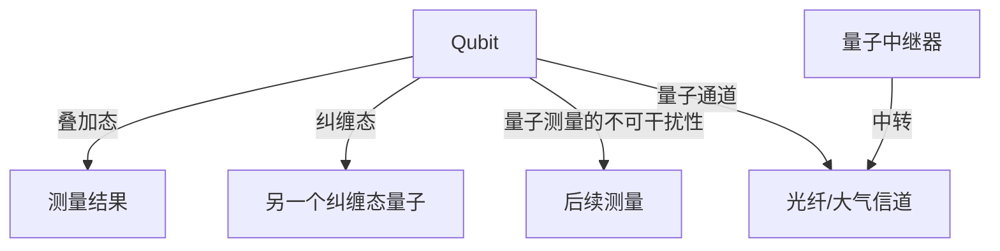

                 

## 1. 背景介绍

量子通信作为量子信息科学的重要分支，自20世纪80年代以来吸引了全球研究者的广泛关注。量子通信的起源可以追溯到1940年代，当时爱因斯坦等物理学家提出了量子纠缠的概念，并认为它是超越经典物理的理论预言。然而直到1993年，贝尼特·贝卡（Bennett）和皮特·肖（Peter Shor）等人将量子纠缠与信息传输结合起来，首次提出量子密钥分发（Quantum Key Distribution，QKD）概念，量子通信才真正作为一项技术被提上日程。

量子通信利用量子态的不可克隆性和测量的不可干扰性，为信息传输提供了绝对安全保障。虽然量子通信仍处于初期探索阶段，但已经在多个领域展现出巨大的潜力，如国家安全和军事通信、金融交易保护、卫星通信等。

### 1.1 量子通信的核心原理

量子通信的核心原理可以简单概括为三个基本概念：量子叠加态、量子纠缠态以及量子测量的不可干扰性。

**量子叠加态**：量子叠加态指的是同一时刻一个量子系统可以同时处于多个状态之中，直到测量时才“坍缩”到其中一个状态。例如，一个光子的偏振态可以是水平或垂直叠加态，直到测量时才能确定其具体状态。

**量子纠缠态**：量子纠缠态指的是两个或多个量子系统之间存在一种特殊的关联，即使它们相隔很远，对一个量子系统进行测量会影响其他量子系统的状态。例如，两个纠缠的光子无论相隔多远，测量一个光子的状态时，另一个光子的状态也会随之确定。

**量子测量的不可干扰性**：量子测量的过程是不可逆的，测量的结果会“坍缩”到某个具体状态，且过程中不会留下任何干扰信息，即使多次测量同一量子系统，测量结果也不会受到前一次测量的影响。

这些基本原理构成了量子通信的安全基础，使得信息在传输过程中难以被窃听或篡改，大大提高了通信的安全性。

### 1.2 量子通信的实际应用

量子通信技术的实际应用场景多样，其中最为典型的应用就是量子密钥分发（QKD）。QKD 通过利用量子叠加态和量子纠缠态的性质，实现了两方之间无需共享密钥、也不需要担心被窃听的密钥分发方式。此外，量子通信还在量子隐形传态、量子远程计算等方面展现出广阔的应用前景。

## 2. 核心概念与联系

### 2.1 核心概念概述

量子通信的核心概念主要有以下几个：

1. **量子比特（Qubit）**：量子通信中使用的基本单位，对应经典通信中的比特。一个量子比特可以处于0、1或者它们的叠加态中。

2. **量子叠加态（Quantum Superposition）**：量子比特可以处于多个状态的叠加态中，只有测量时才会“坍缩”到其中一个具体状态。

3. **量子纠缠态（Quantum Entanglement）**：两个或多个量子比特之间可以形成纠缠态，它们的状态相互关联，即使相隔很远，对一个量子比特的测量会影响另一个。

4. **量子测量的不可干扰性（Measurement Non-disturbance）**：量子测量的结果不会对后续测量产生影响，即使多次测量同一量子比特，测量结果也不会受到前一次测量的干扰。

5. **量子通道（Quantum Channel）**：量子比特在传输过程中使用的物理通道，可以是光纤、大气信道等。

6. **量子中继器（Quantum Repeater）**：用于扩展量子通信距离的设备，可以将量子比特进行中转，从而实现长距离量子通信。

### 2.2 核心概念原理和架构的 Mermaid 流程图



## 3. 核心算法原理 & 具体操作步骤

### 3.1 算法原理概述

量子通信的核心算法包括量子密钥分发算法和量子隐形传态算法。

**量子密钥分发算法（QKD）**：该算法通过利用量子叠加态和量子纠缠态的性质，实现两方之间无需共享密钥、也不需要担心被窃听的密钥分发方式。

**量子隐形传态算法**：该算法通过利用量子纠缠态和量子测量的不可干扰性，实现将量子态从一个地方传输到另一个地方，而无需真正传输量子比特本身。

### 3.2 算法步骤详解

**量子密钥分发算法**：

1. **初始化**：创建一组量子比特，每个量子比特处于叠加态，并随机分配给两方（通常称为Alice和Bob）。

2. **分发**：Alice对这些量子比特进行测量，并将测量结果通过经典通信通道发送给Bob。

3. **选择测量**：Bob根据Alice的测量结果选择是否保留相应的量子比特。

4. **基底选择**：Alice和Bob各自选择一组基底（例如，Bell基底）对量子比特进行测量，并公开这些基底选择。

5. **密钥生成**：Alice和Bob根据选择的基底和测量结果生成密钥，然后使用纠错和隐私放大技术确保密钥的安全性。

**量子隐形传态算法**：

1. **初始化**：创建一组纠缠态量子比特，其中一方（通常称为Alice）和另一端（称为Bob）的纠缠态量子比特进行纠缠。

2. **态生成**：Alice通过对纠缠态量子比特的测量生成要传输的量子态。

3. **传输**：Alice将测量结果通过经典通信通道发送给Bob。

4. **控制门**：Bob根据Alice的测量结果，通过量子控制门（例如，CNOT门）来生成对应的量子态。

### 3.3 算法优缺点

量子通信算法的优点：

1. **绝对安全性**：利用量子测量的不可干扰性和量子纠缠态的性质，可以确保通信的绝对安全性，不存在窃听或截获的可能性。

2. **远距离通信**：量子通信技术可以实现远距离通信，具有超远距离传输的能力。

3. **高效性**：量子通信可以极大地提高通信效率，传输速率远高于经典通信。

量子通信算法的缺点：

1. **设备要求高**：量子通信设备要求高，需要高性能的光学器件和精密的控制系统，实现难度大。

2. **传输距离受限**：由于量子态在传输过程中会逐渐丢失，因此量子通信的传输距离受限。

3. **环境因素影响**：量子通信对环境因素敏感，如噪声、光损耗等都会影响通信质量。

### 3.4 算法应用领域

量子通信技术的应用领域非常广泛，包括但不限于以下几个方面：

1. **量子密钥分发（QKD）**：是量子通信的核心应用之一，广泛用于国家安全、军事通信、金融交易等领域。

2. **量子隐形传态**：用于量子计算和量子通信网络，可以实现远程量子计算和量子信息传输。

3. **量子安全通信**：利用量子密钥分发技术实现安全的通信网络，防止信息被截获和篡改。

4. **量子传感和定位**：利用量子纠缠和量子测量的特性，进行高精度传感和定位。

5. **量子网络**：构建基于量子通信技术的网络，实现大规模量子通信和量子信息处理。

## 4. 数学模型和公式 & 详细讲解 & 举例说明

### 4.1 数学模型构建

量子通信的数学模型构建主要涉及以下几个方面的内容：

1. **量子态**：一个量子比特可以用Hilbert空间中的态矢量$|\psi\rangle$来表示。

2. **量子叠加态**：一个量子比特处于叠加态$|\psi\rangle = \alpha|0\rangle + \beta|1\rangle$，其中$\alpha$和$\beta$是复数，且$|\alpha|^2 + |\beta|^2 = 1$。

3. **量子纠缠态**：两个量子比特处于纠缠态$|\psi\rangle = \alpha|00\rangle + \beta|11\rangle$，其中$\alpha$和$\beta$是复数，且$|\alpha|^2 + |\beta|^2 = 1$。

4. **量子测量**：一个量子比特进行测量，可以得到$|0\rangle$或$|1\rangle$，其概率分别为$|\langle 0|\psi\rangle|^2$和$|\langle 1|\psi\rangle|^2$。

### 4.2 公式推导过程

**量子比特的状态**：

一个量子比特的状态可以表示为$|\psi\rangle = \alpha|0\rangle + \beta|1\rangle$，其中$\alpha$和$\beta$是复数，且$|\alpha|^2 + |\beta|^2 = 1$。

**量子叠加态**：

量子叠加态可以表示为$|\psi\rangle = \alpha|0\rangle + \beta|1\rangle$，其中$\alpha$和$\beta$是复数，且$|\alpha|^2 + |\beta|^2 = 1$。

**量子纠缠态**：

两个量子比特处于纠缠态$|\psi\rangle = \alpha|00\rangle + \beta|11\rangle$，其中$\alpha$和$\beta$是复数，且$|\alpha|^2 + |\beta|^2 = 1$。

**量子测量的不可干扰性**：

量子测量的结果不会对后续测量产生影响，即使多次测量同一量子比特，测量结果也不会受到前一次测量的干扰。

**量子通信的基本过程**：

1. **初始化**：创建一组量子比特，每个量子比特处于叠加态。

2. **分发**：Alice对这些量子比特进行测量，并将测量结果通过经典通信通道发送给Bob。

3. **选择测量**：Bob根据Alice的测量结果选择是否保留相应的量子比特。

4. **基底选择**：Alice和Bob各自选择一组基底对量子比特进行测量，并公开这些基底选择。

5. **密钥生成**：Alice和Bob根据选择的基底和测量结果生成密钥，然后使用纠错和隐私放大技术确保密钥的安全性。

### 4.3 案例分析与讲解

以量子密钥分发（QKD）为例，分析其关键步骤和核心原理。

**初始化**：

创建一组量子比特，每个量子比特处于叠加态，并随机分配给两方（通常称为Alice和Bob）。

**分发**：

Alice对这些量子比特进行测量，并将测量结果通过经典通信通道发送给Bob。

**选择测量**：

Bob根据Alice的测量结果选择是否保留相应的量子比特。

**基底选择**：

Alice和Bob各自选择一组基底（例如，Bell基底）对量子比特进行测量，并公开这些基底选择。

**密钥生成**：

Alice和Bob根据选择的基底和测量结果生成密钥，然后使用纠错和隐私放大技术确保密钥的安全性。

## 5. 项目实践：代码实例和详细解释说明

### 5.1 开发环境搭建

量子通信的开发环境搭建主要涉及以下几个方面：

1. **量子计算库**：安装量子计算相关的库，如Qiskit、Cirq等。

2. **量子硬件设备**：如果有可用的量子硬件设备（如IBM Q系统），还需要搭建相关的硬件环境。

3. **仿真环境**：使用经典计算机进行量子算法的仿真，验证算法的正确性和性能。

### 5.2 源代码详细实现

以量子密钥分发（QKD）为例，给出使用Python进行量子密钥分发的代码实现。

```python
from qiskit import QuantumCircuit, execute, Aer
from qiskit.visualization import plot_bloch_multivector
from qiskit.aqua import QuantumInstance
import numpy as np

# 初始化量子比特
quantum_circuit = QuantumCircuit(2, 2)
quantum_circuit.h(0)
quantum_circuit.cx(0, 1)

# 添加测量操作
quantum_circuit.measure([0, 1], [0, 1])

# 执行仿真
backend = Aer.get_backend('qasm_simulator')
result = execute(quantum_circuit, backend, shots=1000).result()

# 获取测量结果
counts = result.get_counts(quantum_circuit)
print(counts)

# 绘制测量结果
plot_bloch_multivector(np.sqrt(counts))
```

### 5.3 代码解读与分析

**量子电路**：

使用Qiskit库创建量子电路，包含初始化、纠缠和测量操作。

**执行仿真**：

使用Aer模拟器执行量子电路，并获取测量结果。

**绘制结果**：

绘制测量结果的Bloch球面表示，可视化量子比特的测量结果。

### 5.4 运行结果展示

运行上述代码后，可以得到量子比特的测量结果，绘制在Bloch球面上。通常，量子比特的测量结果会呈现出随机分布，这是因为量子叠加态的测量的不确定性。

## 6. 实际应用场景

### 6.1 量子密钥分发（QKD）

量子密钥分发（QKD）是量子通信的核心应用之一，广泛用于国家安全、军事通信、金融交易等领域。QKD利用量子叠加态和量子纠缠态的性质，实现两方之间无需共享密钥、也不需要担心被窃听的密钥分发方式。

**国家安全**：

在国家安全领域，QKD可以用于军事通信、情报传输等，确保通信的安全性。

**金融交易保护**：

在金融交易中，QKD可以用于保护交易数据的安全，防止信息被篡改或窃听。

**通信网络**：

在通信网络中，QKD可以用于加密通信，防止信息泄露。

### 6.2 量子隐形传态

量子隐形传态是量子通信的另一个重要应用，用于实现量子信息的远程传输。

**远程量子计算**：

利用量子隐形传态，可以实现远程量子计算，解决计算资源不足的问题。

**量子信息传输**：

在量子通信网络中，量子隐形传态可以用于量子信息的传输，提高通信效率。

### 6.3 量子安全通信

利用量子密钥分发技术实现安全的通信网络，防止信息被截获和篡改。

**银行交易**：

在银行交易中，使用QKD技术可以保护用户的隐私和交易安全。

**政府通信**：

在政府通信中，使用QKD技术可以确保通信的安全性，防止信息泄露。

### 6.4 未来应用展望

随着量子通信技术的不断发展，其应用领域将不断拓展。

**量子互联网**：

构建基于量子通信技术的网络，实现大规模量子通信和量子信息处理。

**量子计算**：

利用量子通信技术实现远程量子计算，解决传统计算机难以解决的复杂问题。

**量子传感**：

利用量子纠缠和量子测量的特性，进行高精度传感和定位。

## 7. 工具和资源推荐

### 7.1 学习资源推荐

为了帮助开发者系统掌握量子通信的理论基础和实践技巧，这里推荐一些优质的学习资源：

1. **《Quantum Computing: An Illustrated Guide》**：该书由Kaushik Bhattacharjee撰写，详细介绍了量子计算和量子通信的基本原理和应用。

2. **《Quantum Computation and Quantum Information》**：该书由Michael A. Nielsen和Michael J. Chuang合著，是量子计算领域的经典教材，涵盖了量子通信的基本原理和应用。

3. **Qiskit官方文档**：Qiskit是IBM开发的量子计算和量子通信框架，提供了丰富的学习资源和示例代码。

4. **Cirq官方文档**：Cirq是Google开发的量子计算和量子通信框架，提供了丰富的学习资源和示例代码。

5. **Quantum World网站**：Quantum World是英国皇家学会创办的在线量子计算和量子通信学习平台，提供了大量的学习资源和教程。

### 7.2 开发工具推荐

量子通信的开发工具包括：

1. **Qiskit**：IBM开发的量子计算和量子通信框架，提供了丰富的量子电路库和模拟器。

2. **Cirq**：Google开发的量子计算和量子通信框架，提供了丰富的量子电路库和模拟器。

3. **OpenQASM**：量子汇编语言，用于描述量子电路和量子计算算法。

4. **QuantumGATE**：一个在线量子计算模拟器，用于可视化量子电路和量子计算。

### 7.3 相关论文推荐

量子通信技术的快速发展离不开相关论文的推动，以下是几篇奠基性的相关论文，推荐阅读：

1. **Quantum Teleportation: Quantum State Transfer via Dual Classical and Einstein-Podolsky-Rosen Channels**：该论文首次提出了量子隐形传态的概念，是量子通信领域的经典论文之一。

2. **Quantum Key Distribution: Principle and Procedure**：该论文介绍了量子密钥分发的基本原理和实现方法，是量子通信领域的经典论文之一。

3. **A Quantum Internet**：该论文讨论了量子互联网的概念和技术实现，是量子通信领域的经典论文之一。

## 8. 总结：未来发展趋势与挑战

### 8.1 研究成果总结

量子通信技术在近年来取得了长足进展，推动了多个领域的发展。

**量子密钥分发（QKD）**：

QKD技术在国家安全、金融交易、通信网络等领域得到了广泛应用，确保了通信的绝对安全性。

**量子隐形传态**：

量子隐形传态技术在远程量子计算和量子通信网络中具有广泛的应用前景。

**量子安全通信**：

量子安全通信技术在银行交易、政府通信等领域得到了广泛应用。

### 8.2 未来发展趋势

量子通信技术在未来将呈现以下几个发展趋势：

1. **量子互联网**：

构建基于量子通信技术的网络，实现大规模量子通信和量子信息处理。

2. **量子计算**：

利用量子通信技术实现远程量子计算，解决传统计算机难以解决的复杂问题。

3. **量子传感**：

利用量子纠缠和量子测量的特性，进行高精度传感和定位。

### 8.3 面临的挑战

量子通信技术在发展过程中也面临诸多挑战：

1. **技术实现难度**：

量子通信技术实现难度大，需要高性能的光学器件和精密的控制系统。

2. **传输距离受限**：

量子态在传输过程中会逐渐丢失，因此量子通信的传输距离受限。

3. **环境因素影响**：

量子通信对环境因素敏感，如噪声、光损耗等都会影响通信质量。

### 8.4 研究展望

未来，量子通信技术需要在以下几个方面进行深入研究：

1. **量子中继器**：

研究量子中继器技术，实现长距离量子通信。

2. **量子纠错**：

研究量子纠错技术，提高量子信息的准确性和稳定性。

3. **量子网络**：

研究量子通信网络技术，构建大规模量子通信系统。

4. **量子计算**：

研究量子计算技术，解决传统计算机难以解决的复杂问题。

5. **量子传感**：

研究量子传感技术，进行高精度传感和定位。

## 9. 附录：常见问题与解答

**Q1：量子通信中的量子比特（Qubit）与经典比特（Bit）有何不同？**

A：量子比特（Qubit）与经典比特（Bit）的主要区别在于量子比特可以处于叠加态，即一个量子比特可以同时处于0和1两种状态的叠加态，而经典比特只能处于0或1两种状态中的一种。

**Q2：量子通信中的量子叠加态和量子纠缠态是如何产生的？**

A：量子叠加态和量子纠缠态可以通过量子态的演化和操作来产生。例如，对一个量子比特进行Hadamard门操作，可以将其从0或1状态变为叠加态；而对两个纠缠的量子比特进行CNOT门操作，可以将其状态从0或1状态变为纠缠态。

**Q3：量子通信中的量子测量的不可干扰性是如何实现的？**

A：量子测量的不可干扰性是通过量子测量的过程来实现的。在量子测量过程中，测量结果不会对后续测量产生影响，即使多次测量同一量子比特，测量结果也不会受到前一次测量的干扰。

**Q4：量子通信中的量子密钥分发（QKD）是如何确保通信安全的？**

A：量子密钥分发（QKD）通过利用量子叠加态和量子纠缠态的性质，实现两方之间无需共享密钥、也不需要担心被窃听的密钥分发方式。具体来说，Alice和Bob通过测量纠缠态量子比特，生成共享密钥，而任何窃听者都会破坏量子态，从而被检测到。

**Q5：量子通信中的量子隐形传态（QTD）是如何实现的？**

A：量子隐形传态（QTD）通过利用量子纠缠态和量子测量的不可干扰性，实现将量子态从一个地方传输到另一个地方，而无需真正传输量子比特本身。具体来说，Alice通过测量纠缠态量子比特生成要传输的量子态，然后将测量结果通过经典通信通道发送给Bob，Bob根据Alice的测量结果，通过量子控制门来生成对应的量子态。

作者：禅与计算机程序设计艺术 / Zen and the Art of Computer Programming

