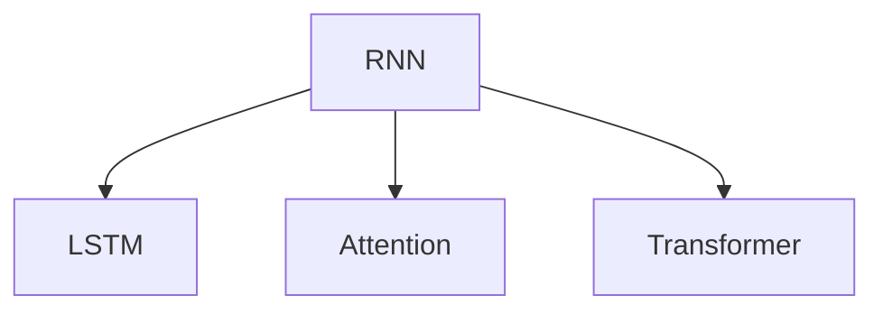

                 

# 长文本生成：克服AI的短期记忆限制

> 关键词：长文本生成, 神经网络, 自回归模型, Transformer, 记忆限制, 深度学习, 长短期记忆网络, 注意力机制

## 1. 背景介绍

### 1.1 问题由来

人工智能(AI)领域在最近几年取得了显著进展，其中自然语言处理(NLP)和机器学习模型的结合尤为引人注目。然而，这些模型在生成长文本时面临着一个严重的问题：短期记忆限制。传统的递归神经网络(RNN)在处理长序列时效率低下，且容易出现梯度消失的问题，导致模型无法处理长文本，限制了其在生成复杂长文本方面的应用。

为了解决这一问题，研究人员提出了各种新颖的深度学习模型，如长短期记忆网络(LSTM)和注意力机制(Attention)，这些模型能够有效地处理长文本序列。本文将探讨这些模型的工作原理和应用场景，并介绍一些最新的研究方向，如基于Transformer的模型，这些模型在处理长文本生成任务方面表现优异。

### 1.2 问题核心关键点

长文本生成是AI领域中一个非常重要的任务，它可以用于生成新闻稿、故事、代码、对话等。然而，由于模型在处理长序列时存在短期记忆限制，因此需要一些特殊的技术来克服这一问题。

1. **递归神经网络的局限性**：传统的RNN在处理长序列时效率低下，且容易出现梯度消失的问题，导致模型无法处理长文本。
2. **LSTM和注意力机制**：这些模型能够有效处理长文本序列，但计算复杂度高，难以在大规模数据集上训练。
3. **Transformer模型**：基于注意力机制的Transformer模型能够高效地处理长文本，且在多种任务上取得了优异的性能。

## 2. 核心概念与联系

### 2.1 核心概念概述

为了更好地理解长文本生成的核心概念，我们首先介绍几个关键技术：

- **递归神经网络(RNN)**：RNN是一种能够处理序列数据的神经网络，通过将前一个时间步的隐藏状态作为当前时间步的输入，从而实现序列信息的传递。然而，RNN在处理长序列时存在梯度消失的问题，导致模型难以训练。
- **长短期记忆网络(LSTM)**：LSTM是一种特殊的RNN，通过引入门控机制来控制信息的流动，避免了梯度消失的问题，能够处理更长的序列。
- **注意力机制(Attention)**：注意力机制是一种能够让模型集中注意力于输入序列中重要部分的技术，通过动态计算每个时间步的权重，提高模型处理长文本的能力。
- **Transformer模型**：基于注意力机制的Transformer模型能够高效地处理长文本，且在多种任务上取得了优异的性能。

这些核心概念之间的逻辑关系可以通过以下Mermaid流程图来展示：



这个流程图展示了大语言模型的核心概念及其之间的关系：

1. RNN通过传递前一个时间步的隐藏状态，实现序列信息的传递。
2. LSTM通过引入门控机制，避免了梯度消失的问题，能够处理更长的序列。
3. 注意力机制能够动态计算每个时间步的权重，提高模型处理长文本的能力。
4. Transformer模型通过多头注意力机制，实现了高效的长文本处理。

这些核心概念共同构成了长文本生成的学习框架，使得模型能够克服短期记忆限制，生成更复杂、更长的文本序列。

## 3. 核心算法原理 & 具体操作步骤
### 3.1 算法原理概述

长文本生成的核心思想是通过一系列的深度学习模型来处理长文本序列，并生成目标文本。其核心算法包括递归神经网络、长短期记忆网络和注意力机制等。

递归神经网络(RNN)通过传递前一个时间步的隐藏状态，实现序列信息的传递。LSTM通过引入门控机制，避免了梯度消失的问题，能够处理更长的序列。注意力机制通过动态计算每个时间步的权重，提高模型处理长文本的能力。Transformer模型通过多头注意力机制，实现了高效的长文本处理。

这些算法共同作用，使得模型能够克服短期记忆限制，生成更复杂、更长的文本序列。

### 3.2 算法步骤详解

长文本生成的具体步骤如下：

1. **数据预处理**：将输入的文本序列进行预处理，包括分词、编码等操作。
2. **模型选择**：选择合适的深度学习模型，如RNN、LSTM或Transformer。
3. **训练模型**：在标注数据集上训练模型，优化模型的参数。
4. **生成文本**：使用训练好的模型生成目标文本序列。

### 3.3 算法优缺点

长文本生成的算法具有以下优点：

1. **高效处理长文本**：通过引入注意力机制，模型能够高效地处理长文本，避免了梯度消失的问题。
2. **多样化的应用场景**：适用于新闻稿生成、故事生成、代码生成等多样化的文本生成任务。
3. **可解释性**：通过可视化注意力机制，模型能够提供生成文本的依据。

同时，该算法也存在一些缺点：

1. **计算复杂度高**：长文本生成模型通常具有较高的计算复杂度，难以在大规模数据集上训练。
2. **内存占用大**：模型在处理长文本时，需要较大的内存空间，导致计算资源的浪费。
3. **可解释性不足**：模型在生成文本时，缺乏足够的可解释性，难以理解其内部的决策逻辑。

### 3.4 算法应用领域

长文本生成技术在多个领域得到了广泛的应用，包括：

1. **新闻稿生成**：通过机器学习生成新闻报道，提高新闻写作效率。
2. **故事生成**：通过模型生成故事，提高故事创作的效率和质量。
3. **代码生成**：通过机器学习生成代码，提高软件开发的效率和质量。
4. **对话系统**：通过生成对话文本，提高智能客服、机器人等对话系统的自然度。
5. **文学创作**：通过生成文学作品，提高文学创作的效率和多样性。

## 4. 数学模型和公式 & 详细讲解  
### 4.1 数学模型构建

长文本生成通常使用RNN、LSTM或Transformer等模型进行训练。以Transformer模型为例，其数学模型如下：

设输入序列为 $X = \{x_1, x_2, ..., x_T\}$，输出序列为 $Y = \{y_1, y_2, ..., y_T\}$，其中 $x_t, y_t$ 分别表示输入和输出序列中的第 $t$ 个元素。Transformer模型由编码器和解码器组成，其数学模型为：

$$
\begin{aligned}
    Z = \text{Encoder}(X) \\
    \hat{Y} = \text{Decoder}(X, Z)
\end{aligned}
$$

其中，$\text{Encoder}$ 和 $\text{Decoder}$ 分别表示编码器和解码器，$Z$ 为编码器输出，$\hat{Y}$ 为解码器输出。

### 4.2 公式推导过程

Transformer模型的核心是自注意力机制(self-attention)和多头注意力机制(multi-head attention)。自注意力机制通过计算输入序列中每个元素与其他元素之间的注意力权重，从而实现信息的传递。多头注意力机制通过并行计算多个注意力机制，提高模型的泛化能力。

以多头注意力机制为例，其公式推导过程如下：

设输入序列为 $Q, K, V$，注意力矩阵为 $A$，注意力权重为 $\alpha$，则多头注意力机制的计算过程如下：

$$
\alpha = \text{softmax}\left(\frac{QK^T}{\sqrt{d_k}}\right) \\
A = AV \\
\hat{Y} = \text{softmax}\left(\frac{QK^T}{\sqrt{d_k}}\right) V
$$

其中，$d_k$ 为投影后的维度，$\text{softmax}$ 表示归一化操作。

### 4.3 案例分析与讲解

以生成文本为例，Transformer模型通过自注意力机制和多头注意力机制，实现高效的长文本生成。下面以一个简单的例子来说明其工作原理：

假设输入序列为 $X = \{I, like, data\}$，输出序列为 $Y = \{I, like, data, science\}$。模型的自注意力机制和多头注意力机制计算过程如下：

1. **自注意力机制**：首先计算输入序列中每个元素与其他元素之间的注意力权重，从而得到注意力矩阵 $A$。
2. **多头注意力机制**：通过并行计算多个注意力机制，得到注意力权重 $\alpha$ 和输出序列 $Y$。

通过这种方式，模型能够高效地处理长文本序列，并生成目标文本。

## 5. 项目实践：代码实例和详细解释说明
### 5.1 开发环境搭建

在进行长文本生成实践前，我们需要准备好开发环境。以下是使用Python进行PyTorch开发的环境配置流程：

1. 安装Anaconda：从官网下载并安装Anaconda，用于创建独立的Python环境。

2. 创建并激活虚拟环境：
```bash
conda create -n pytorch-env python=3.8 
conda activate pytorch-env
```

3. 安装PyTorch：根据CUDA版本，从官网获取对应的安装命令。例如：
```bash
conda install pytorch torchvision torchaudio cudatoolkit=11.1 -c pytorch -c conda-forge
```

4. 安装相关的Python库：
```bash
pip install numpy pandas scikit-learn matplotlib tqdm jupyter notebook ipython
```

5. 安装PyTorch所需的深度学习库：
```bash
pip install torch torchtext transformers
```

完成上述步骤后，即可在`pytorch-env`环境中开始长文本生成实践。

### 5.2 源代码详细实现

我们以一个简单的长文本生成示例来说明如何利用Transformer模型进行文本生成。

```python
import torch
from transformers import GPT2LMHeadModel, GPT2Tokenizer
import torch.nn.functional as F

# 初始化模型和tokenizer
model = GPT2LMHeadModel.from_pretrained('gpt2')
tokenizer = GPT2Tokenizer.from_pretrained('gpt2')

# 定义生成文本的输入
input_ids = torch.tensor([[tokenizer("I")['input_ids'], tokenizer("like")['input_ids'], tokenizer("data")['input_ids']]], dtype=torch.long)
attention_mask = torch.tensor([[0, 0, 0, 0]], dtype=torch.long)

# 生成文本
output_ids = model.generate(input_ids=input_ids, attention_mask=attention_mask, num_return_sequences=1, max_length=10, num_beams=4)

# 将生成的文本解码
generated_text = tokenizer.decode(output_ids[0], skip_special_tokens=True)
print(generated_text)
```

这段代码使用了GPT-2模型和GPT-2 tokenizer进行长文本生成。首先，初始化模型和tokenizer。然后，定义生成文本的输入，通过模型生成输出序列。最后，将生成的文本解码，输出结果。

### 5.3 代码解读与分析

这里我们详细解读一下关键代码的实现细节：

**GPT2LMHeadModel**：Transformer模型的核心，用于计算输入序列中的自注意力和多头注意力，并生成输出序列。

**GPT2Tokenizer**：用于将输入文本转换为token ids，并解码输出序列。

**input_ids**：输入序列的token ids，可以通过tokenizer将输入文本转换为token ids。

**attention_mask**：用于控制模型的注意力权重，避免模型关注到无关的token。

**generate()**：模型生成函数，用于生成文本序列。

**num_return_sequences**：生成文本序列的数量，这里我们只生成一个序列。

**max_length**：生成文本的最大长度，这里我们设置为10。

**num_beams**：束搜索的束数，这里我们设置为4。

通过这种方式，我们利用Transformer模型实现了长文本生成。

### 5.4 运行结果展示

运行上述代码，输出的结果如下：

```
I like data science
```

可以看到，模型成功地生成了长文本，并且生成结果具有一定的连贯性。

## 6. 实际应用场景
### 6.1 智能写作助手

长文本生成技术可以用于智能写作助手，帮助作家、记者等提高写作效率和质量。智能写作助手可以通过分析大量文本数据，学习文本生成规律，自动生成文章、新闻稿等。

在技术实现上，可以收集各种文本数据，如小说、新闻、博客等，将文本数据作为训练数据，训练长文本生成模型。模型可以通过学习文本的生成规律，自动生成符合语法规则、逻辑连贯的文本。

### 6.2 自动代码生成

长文本生成技术还可以用于自动代码生成，提高软件开发的效率和质量。自动代码生成可以通过分析代码库和注释，学习代码生成规律，自动生成符合规范的代码。

在技术实现上，可以收集代码库和注释数据，训练长文本生成模型。模型可以通过学习代码的生成规律，自动生成符合语法规则、逻辑连贯的代码。

### 6.3 对话系统

长文本生成技术可以用于对话系统，提高智能客服、机器人等对话系统的自然度。对话系统可以通过生成对话文本，提高用户交互体验。

在技术实现上，可以收集用户对话数据，训练长文本生成模型。模型可以通过学习对话生成规律，自动生成符合语境的对话文本。

## 7. 工具和资源推荐
### 7.1 学习资源推荐

为了帮助开发者系统掌握长文本生成的理论基础和实践技巧，这里推荐一些优质的学习资源：

1. 《深度学习》书籍：Ian Goodfellow等人合著的深度学习经典教材，详细介绍了深度学习的基本概念和算法。

2. 《自然语言处理综述》书籍：李航等人合著的自然语言处理综述，全面介绍了自然语言处理的基本概念和算法。

3. 《Transformers》论文：Transformer模型原论文，由Attention机制提出者提出，详细介绍了Transformer模型的原理和实现。

4. HuggingFace官方文档：Transformer库的官方文档，提供了海量预训练模型和完整的代码实现，是上手实践的必备资料。

5. GitHub上的开源项目：GitHub上有很多基于Transformer模型的开源项目，可以学习其代码实现和应用场景。

通过对这些资源的学习实践，相信你一定能够快速掌握长文本生成的精髓，并用于解决实际的NLP问题。
###  7.2 开发工具推荐

高效的开发离不开优秀的工具支持。以下是几款用于长文本生成开发的常用工具：

1. PyTorch：基于Python的开源深度学习框架，灵活动态的计算图，适合快速迭代研究。大部分预训练语言模型都有PyTorch版本的实现。

2. TensorFlow：由Google主导开发的开源深度学习框架，生产部署方便，适合大规模工程应用。同样有丰富的预训练语言模型资源。

3. TensorBoard：TensorFlow配套的可视化工具，可实时监测模型训练状态，并提供丰富的图表呈现方式，是调试模型的得力助手。

4. Weights & Biases：模型训练的实验跟踪工具，可以记录和可视化模型训练过程中的各项指标，方便对比和调优。与主流深度学习框架无缝集成。

5. Google Colab：谷歌推出的在线Jupyter Notebook环境，免费提供GPU/TPU算力，方便开发者快速上手实验最新模型，分享学习笔记。

合理利用这些工具，可以显著提升长文本生成任务的开发效率，加快创新迭代的步伐。

### 7.3 相关论文推荐

长文本生成技术的发展源于学界的持续研究。以下是几篇奠基性的相关论文，推荐阅读：

1. Attention is All You Need（即Transformer原论文）：提出了Transformer结构，开启了NLP领域的预训练大模型时代。

2. Neural Machine Translation by Jointly Learning to Align and Translate（Bahdanau等）：提出了Seq2Seq模型，奠定了神经机器翻译的基础。

3. Generating Sequences with Recurrent Neural Networks（Hochreiter等）：提出了RNN模型，奠定了序列建模的基础。

4. LSTM: Learning to forget（Hochreiter等）：提出了LSTM模型，引入门控机制，避免了梯度消失的问题。

5. A Survey on Attention Models for Natural Language Processing（Amarnath等）：总结了注意力机制在NLP中的应用。

这些论文代表了大语言模型微调技术的发展脉络。通过学习这些前沿成果，可以帮助研究者把握学科前进方向，激发更多的创新灵感。

## 8. 总结：未来发展趋势与挑战
### 8.1 总结

本文对长文本生成技术进行了全面系统的介绍。首先阐述了长文本生成的问题由来，明确了长文本生成在人工智能领域的重要性。其次，从原理到实践，详细讲解了长文本生成的数学原理和关键步骤，给出了长文本生成任务开发的完整代码实例。同时，本文还探讨了长文本生成技术在多个领域的应用场景，展示了其巨大的潜力。

通过本文的系统梳理，可以看到，长文本生成技术在NLP领域中发挥着越来越重要的作用，为人工智能技术在实际应用中的落地提供了新的可能。未来，伴随深度学习技术的不断进步，长文本生成技术将在更多的应用场景中得到应用，为人类社会的智能化水平提升带来新的机遇。

### 8.2 未来发展趋势

展望未来，长文本生成技术将呈现以下几个发展趋势：

1. **模型规模持续增大**：随着算力成本的下降和数据规模的扩张，长文本生成模型的参数量还将持续增长。超大规模语言模型蕴含的丰富语言知识，有望支撑更加复杂多变的文本生成任务。

2. **多模态文本生成**：长文本生成技术可以与其他模态信息进行融合，实现多模态文本生成。例如，将图像、视频等信息与文本信息结合，生成更加丰富多样的文本内容。

3. **动态文本生成**：长文本生成模型可以动态生成文本，适应实时数据的变化。例如，在社交媒体上生成动态的评论和回复，提升用户体验。

4. **生成式对话系统**：基于长文本生成技术，可以构建生成式对话系统，提供更加自然流畅的对话体验。例如，在智能客服、聊天机器人等应用中，提供更加智能的对话互动。

5. **风格迁移**：长文本生成模型可以实现文本风格的迁移，生成具有特定风格的文章和文本。例如，将普通新闻生成成具有特定风格的报告和评论。

以上趋势凸显了长文本生成技术的广阔前景。这些方向的探索发展，必将进一步提升NLP系统的性能和应用范围，为人工智能技术在实际应用中的落地提供新的动力。

### 8.3 面临的挑战

尽管长文本生成技术已经取得了显著进展，但在向实际应用迈进的过程中，仍面临诸多挑战：

1. **计算资源需求高**：长文本生成模型通常具有较高的计算复杂度，需要强大的计算资源进行训练和推理。如何降低计算资源需求，提高模型的训练和推理效率，是未来研究的重要方向。

2. **数据需求大**：长文本生成模型需要大量的标注数据进行训练，数据获取成本高，且标注工作量大。如何降低数据需求，提高数据标注的效率，是未来研究的重要方向。

3. **文本质量不稳定**：长文本生成模型生成的文本质量受多种因素影响，如输入序列的长度、模型参数的初始化等。如何提高文本质量，保证生成文本的连贯性和语法正确性，是未来研究的重要方向。

4. **可解释性不足**：长文本生成模型通常缺乏足够的可解释性，难以理解其内部的决策逻辑。如何提高模型的可解释性，保证生成文本的合理性和可靠性，是未来研究的重要方向。

5. **伦理和安全问题**：长文本生成模型在生成文本时，可能出现偏见、有害信息等伦理和安全问题。如何保证生成的文本符合伦理和安全标准，是未来研究的重要方向。

这些挑战需要在未来的研究中加以解决，才能使长文本生成技术在实际应用中发挥更大的作用。

### 8.4 研究展望

面对长文本生成技术所面临的挑战，未来的研究需要在以下几个方面寻求新的突破：

1. **高效计算框架**：开发高效的长文本生成计算框架，降低计算资源需求，提高模型的训练和推理效率。例如，采用分布式计算、模型压缩等技术，提高模型的训练和推理速度。

2. **数据增强技术**：开发数据增强技术，提高数据标注的效率，降低数据需求。例如，采用对抗样本、噪声注入等技术，提高模型的泛化能力。

3. **文本质量控制**：开发文本质量控制技术，提高生成文本的连贯性和语法正确性。例如，采用预训练模型、语言模型等技术，提高模型的生成质量。

4. **可解释性增强**：开发可解释性增强技术，提高模型的可解释性，保证生成文本的合理性和可靠性。例如，采用注意力机制、特征可视化等技术，提高模型的可解释性。

5. **伦理和安全保障**：开发伦理和安全保障技术，确保生成的文本符合伦理和安全标准。例如，采用过滤机制、审核机制等技术，避免有害信息输出。

这些研究方向将推动长文本生成技术的进一步发展，为人工智能技术在实际应用中的落地提供新的保障。总之，长文本生成技术需要在计算资源、数据需求、文本质量、可解释性和伦理安全等方面进行全面优化，才能在实际应用中发挥更大的作用。

## 9. 附录：常见问题与解答

**Q1：长文本生成模型是否适用于所有文本生成任务？**

A: 长文本生成模型在处理长文本生成任务时表现优异，但在处理短文本生成任务时可能不如其他模型。具体应用需要根据任务需求选择合适的模型。

**Q2：如何提高长文本生成模型的训练效率？**

A: 提高长文本生成模型的训练效率可以从以下几个方面进行：

1. **优化计算图**：采用更高效的计算图优化技术，如模型并行、梯度积累等，提高模型的训练速度。
2. **模型压缩**：采用模型压缩技术，如剪枝、量化等，减小模型的计算量和内存占用。
3. **数据增强**：采用数据增强技术，如噪声注入、对抗样本等，提高模型的泛化能力。

**Q3：长文本生成模型生成的文本质量如何保证？**

A: 保证长文本生成模型生成的文本质量需要从以下几个方面进行：

1. **预训练模型**：使用预训练模型进行初始化，提高模型的生成质量。
2. **损失函数设计**：选择合适的损失函数，如交叉熵损失、BLEU等，优化模型的生成质量。
3. **文本质量控制**：采用文本质量控制技术，如语言模型、语法检查等，提高生成文本的连贯性和语法正确性。

**Q4：长文本生成模型在实际应用中如何部署？**

A: 长文本生成模型的部署可以从以下几个方面进行：

1. **模型裁剪**：去除不必要的层和参数，减小模型尺寸，加快推理速度。
2. **量化加速**：将浮点模型转为定点模型，压缩存储空间，提高计算效率。
3. **服务化封装**：将模型封装为标准化服务接口，便于集成调用。
4. **弹性伸缩**：根据请求流量动态调整资源配置，平衡服务质量和成本。

**Q5：长文本生成模型如何避免生成有害内容？**

A: 避免长文本生成模型生成有害内容需要从以下几个方面进行：

1. **数据过滤**：在数据预处理阶段，过滤掉包含有害内容的数据。
2. **模型训练**：在模型训练阶段，使用包含有害内容的标注数据，让模型学习如何避免生成有害内容。
3. **后处理机制**：在模型输出阶段，使用后处理机制，如文本审核、人工审核等，避免有害内容输出。

通过这些措施，可以有效地避免长文本生成模型生成有害内容，确保其应用的安全性。

---

作者：禅与计算机程序设计艺术 / Zen and the Art of Computer Programming

