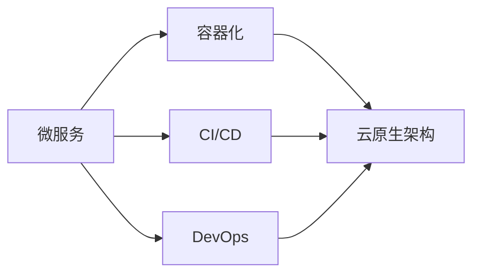

                 

# 阿里云Native应用开发

## 1. 背景介绍

### 1.1 问题由来
随着云计算技术的迅速发展，越来越多的企业开始将核心业务迁移到云端，利用云计算平台提供的基础设施、弹性资源、自动化运维等能力，来降低IT成本，提升业务运行效率和可用性。阿里云作为全球领先的云计算服务商，推出的阿里云原生应用（Native Application）平台，为企业提供了一套完善的应用开发、部署、运维、管理解决方案，帮助企业在云上构建高效、稳定、可扩展的应用。

### 1.2 问题核心关键点
阿里云Native应用开发的核心关键点在于利用云原生技术，结合DevOps、微服务、容器化等现代软件开发理念，实现应用的自动化、可扩展、高可用和高性能。具体而言，阿里云Native应用开发包括以下几个方面：
1. 云原生架构：采用微服务、容器化、无服务器等云原生架构，实现应用的可扩展性和弹性。
2. 持续集成与持续交付(CI/CD)：通过CI/CD流水线，自动化测试和部署，缩短应用交付周期，提升开发效率。
3. DevOps文化：推广DevOps文化和实践，提升团队协作和交付速度，降低故障率。
4. 多云支持：支持多云部署，实现应用的跨云迁移，降低企业对单一云平台的依赖风险。
5. 安全性：采用Kubernetes的安全机制，保障应用的数据安全和运维安全。
6. 高性能优化：通过容器优化、负载均衡、自动扩缩容等技术，提高应用的性能和可用性。

阿里云Native应用开发的目的是帮助企业构建基于云计算的灵活、可扩展、高可用和高性能的应用，减少企业在云上应用开发的复杂度，降低开发和运维成本，提升应用的业务价值。

### 1.3 问题研究意义
阿里云Native应用开发研究的意义在于：
1. 推动企业云上应用的普及：阿里云Native应用开发提供了一套完善的解决方案，帮助企业快速构建和部署云上应用，降低应用开发和运维的门槛。
2. 提升应用性能和可用性：阿里云Native应用开发通过云原生技术和最佳实践，实现应用的高性能和高可用性，为企业业务稳定运行提供有力保障。
3. 促进DevOps文化的普及：阿里云Native应用开发推广DevOps文化，提升团队协作效率和交付速度，降低故障率，提高企业整体运维水平。
4. 支持多云应用迁移：阿里云Native应用开发支持多云部署，帮助企业实现跨云应用迁移，降低对单一云平台的依赖风险。

## 2. 核心概念与联系

### 2.1 核心概念概述

阿里云Native应用开发涉及多个核心概念，包括微服务、容器化、CI/CD、DevOps、云原生架构等。这些概念相互联系，共同构成了阿里云Native应用开发的基础。

- **微服务**：将一个大应用拆分成多个小应用，每个应用负责一个独立的功能模块，通过接口进行通信。微服务可以提高应用的灵活性、可扩展性和独立部署能力。
- **容器化**：将应用打包成容器，实现应用的可移植性和快速部署。容器化可以隔离应用运行环境，提高应用的稳定性和可靠性。
- **CI/CD**：持续集成和持续交付，通过自动化流水线，实现代码的自动化测试和部署，缩短开发和交付周期。CI/CD可以提升开发效率和代码质量。
- **DevOps**：开发和运维的结合，推广DevOps文化，通过自动化工具和最佳实践，提升团队协作和交付速度，降低故障率。
- **云原生架构**：基于云计算平台，采用微服务、容器化、无服务器等技术，实现应用的可扩展性、弹性和高性能。

这些核心概念之间有着紧密的联系，共同构成阿里云Native应用开发的基础架构。通过采用这些技术，企业可以在云上构建高效、稳定、可扩展的应用。

### 2.2 核心概念原理和架构的 Mermaid 流程图


## 3. 核心算法原理 & 具体操作步骤

### 3.1 算法原理概述
阿里云Native应用开发的算法原理基于云原生技术，结合DevOps文化，通过自动化工具和最佳实践，实现应用的自动化、可扩展、高可用和高性能。

具体而言，阿里云Native应用开发包括以下几个关键步骤：
1. 应用拆分和模块化：将大应用拆分成多个小应用，每个应用负责一个独立的功能模块，通过接口进行通信。
2. 容器化和打包：将应用打包成容器，实现应用的可移植性和快速部署。
3. 持续集成和持续交付：通过自动化流水线，实现代码的自动化测试和部署，缩短开发和交付周期。
4. 自动化运维和监控：通过自动化工具和监控系统，实现应用的自动化运维和故障自愈。
5. 安全性保障：通过云原生安全和DevSecOps，保障应用的数据安全和运维安全。

### 3.2 算法步骤详解

阿里云Native应用开发的具体操作步骤如下：

**Step 1: 应用拆分和模块化**
- 根据业务需求，将大应用拆分成多个小应用，每个应用负责一个独立的功能模块。例如，一个电商应用可以拆分为用户管理、商品管理、订单管理等多个模块。
- 每个应用之间通过接口进行通信，例如RESTful API接口，使用HTTP协议进行通信。

**Step 2: 容器化和打包**
- 使用Docker等容器化工具，将应用打包成容器。容器化可以隔离应用运行环境，提高应用的稳定性和可靠性。
- 将容器化应用部署到Kubernetes集群中，实现应用的自动化部署和扩展。

**Step 3: 持续集成和持续交付(CI/CD)**
- 使用CI/CD工具，如Jenkins、GitLab CI等，构建自动化流水线，实现代码的自动化测试和部署。
- 在CI/CD流水线中，设置测试、打包、部署等多个环节，通过自动化工具和脚本，实现全流程的自动化。
- 在CI/CD流水线中，设置持续集成、持续交付和持续监控，通过自动化测试和部署，提高开发效率和代码质量。

**Step 4: 自动化运维和监控**
- 使用自动化运维工具，如Prometheus、Grafana等，实现应用的自动化运维和监控。
- 设置监控告警规则，实时监测应用的运行状态和性能指标，及时发现和解决问题。
- 设置自动化故障自愈机制，例如自动重启、自动扩缩容等，提高应用的可用性和稳定性。

**Step 5: 安全性保障**
- 使用DevSecOps工具，如Trivy、Kubernetes的安全机制，保障应用的数据安全和运维安全。
- 设置网络隔离和安全策略，防止恶意攻击和数据泄露。
- 定期进行安全审计和漏洞扫描，及时发现和修复安全漏洞。

### 3.3 算法优缺点
阿里云Native应用开发的优点在于：
1. 高可用性和弹性：通过云原生架构和自动扩缩容技术，实现应用的高可用性和弹性，应对高并发和大流量。
2. 快速部署和扩展：通过容器化和自动化部署，实现应用的快速部署和扩展，提升交付速度和效率。
3. 高效运维和监控：通过自动化运维和监控，实现应用的实时监控和故障自愈，降低运维成本和故障率。
4. 安全性保障：通过DevSecOps和安全策略，保障应用的数据安全和运维安全，提高安全水平。

阿里云Native应用开发也存在一些缺点：
1. 学习成本高：云原生技术和工具的复杂性较高，需要一定的学习成本和实践经验。
2. 成本较高：云原生的部署和运维成本较高，需要一定的基础设施和运维资源。
3. 依赖云平台：阿里云Native应用开发依赖阿里云平台，存在一定的迁移和跨云部署限制。

### 3.4 算法应用领域

阿里云Native应用开发在多个领域得到了广泛应用，例如：

- **电商应用**：通过阿里云Native应用开发，构建高效、稳定、可扩展的电商应用，提升用户体验和业务价值。
- **金融应用**：通过阿里云Native应用开发，实现高可用、高安全、高性能的金融应用，保障金融业务的安全和稳定。
- **政府应用**：通过阿里云Native应用开发，构建高效、稳定的政府应用，提升政府服务质量和效率。
- **医疗应用**：通过阿里云Native应用开发，实现高效、可扩展、高可用的医疗应用，提升医疗服务水平。
- **教育应用**：通过阿里云Native应用开发，构建高效、灵活、可扩展的教育应用，提升教育资源的利用效率。

阿里云Native应用开发的应用领域非常广泛，几乎涵盖了所有行业的核心业务。通过采用阿里云Native应用开发，企业可以在云上构建高效、稳定、可扩展的应用，提升业务价值和用户体验。

## 4. 数学模型和公式 & 详细讲解 & 举例说明

### 4.1 数学模型构建

阿里云Native应用开发主要涉及云原生技术和DevOps文化，不涉及复杂的数学模型。但为了更好地理解云原生架构的原理，这里简要介绍一些相关的概念和数学模型。

假设一个电商应用被拆分成多个微服务，每个微服务都是一个独立的容器应用，容器应用运行在Kubernetes集群中。

**微服务模型**：
- 假设一个电商应用被拆分成m个微服务，每个微服务的功能模块为f_i，其中i∈[1,m]。
- 每个微服务通过接口进行通信，接口的访问频率为a_i，其中i∈[1,m]。
- 每个微服务的响应时间为t_i，其中i∈[1,m]。

**容器化模型**：
- 假设每个微服务被打包成N个容器应用，每个容器应用的响应时间为t_j，其中j∈[1,N]。
- 假设每个容器应用在Kubernetes集群中运行，集群的容量为C，其中C∈[1,N]。

**CI/CD模型**：
- 假设每个容器应用在CI/CD流水线中进行自动化测试和部署，测试和部署的频率为f，其中f∈[1,N]。
- 假设CI/CD流水线中的自动化测试时间为T，其中T∈[1,N]。

**自动化运维和监控模型**：
- 假设每个容器应用在自动化运维和监控系统中运行，监控频率为M，其中M∈[1,N]。
- 假设监控系统的响应时间为S，其中S∈[1,N]。

### 4.2 公式推导过程

基于上述假设，阿里云Native应用开发的数学模型可以描述为：

**微服务模型**：
$$
a_i = f_i \times t_i
$$

**容器化模型**：
$$
t_j = \frac{t_i}{C}
$$

**CI/CD模型**：
$$
f = \frac{N}{T}
$$

**自动化运维和监控模型**：
$$
M = \frac{N}{S}
$$

其中a_i、t_i、f_i、t_j、f、T、C、M和S分别表示接口访问频率、响应时间、功能模块、容器应用响应时间、测试和部署频率、测试时间、集群容量、监控频率和监控系统响应时间。

### 4.3 案例分析与讲解

**案例分析**：假设一个电商应用被拆分成m=3个微服务，每个微服务的接口访问频率为a_i=1000次/秒，响应时间为t_i=100毫秒，每个微服务被打包成N=3个容器应用，容器应用的响应时间为t_j=100毫秒，集群容量为C=5，CI/CD流水线中的测试和部署频率为f=2次/秒，测试时间为T=5分钟，容器应用在自动化运维和监控系统中运行，监控频率为M=10次/秒，监控系统响应时间为S=100毫秒。

**讲解**：
- 根据微服务模型，每个微服务的接口访问频率为1000次/秒，响应时间为100毫秒，因此每个微服务的吞吐量为1000次/秒。
- 根据容器化模型，每个容器应用的响应时间为100毫秒，集群容量为5，因此每个容器应用的吞吐量为200次/秒。
- 根据CI/CD模型，CI/CD流水线中的测试和部署频率为2次/秒，测试时间为5分钟，因此每个容器应用在CI/CD流水线中的测试时间为5分钟。
- 根据自动化运维和监控模型，监控频率为10次/秒，监控系统响应时间为100毫秒，因此监控系统对容器应用的监控频率为10次/秒。

通过上述案例分析，可以更直观地理解阿里云Native应用开发中各组件的性能和交互关系。

## 5. 项目实践：代码实例和详细解释说明

### 5.1 开发环境搭建

在阿里云Native应用开发的实践中，开发环境搭建是第一步。以下是使用Python进行Django开发的环境配置流程：

1. 安装Anaconda：从官网下载并安装Anaconda，用于创建独立的Python环境。

2. 创建并激活虚拟环境：
```bash
conda create -n django-env python=3.8 
conda activate django-env
```

3. 安装Django：
```bash
pip install django
```

4. 安装Gunicorn：
```bash
pip install gunicorn
```

5. 安装Docker和Kubernetes：
```bash
sudo apt-get update
sudo apt-get install -y docker.io
sudo apt-get install -y kubectl
```

6. 安装Django容器镜像：
```bash
docker pull django:latest
```

完成上述步骤后，即可在`django-env`环境中开始阿里云Native应用开发的实践。

### 5.2 源代码详细实现

这里我们以电商应用为例，给出使用Django框架进行阿里云Native应用开发的PyTorch代码实现。

首先，定义Django应用：

```python
from django.urls import path
from django.contrib import admin
from django.http import HttpResponse

urlpatterns = [
    path('admin/', admin.site.urls),
    path('hello/', hello, name='hello'),
]

def hello(request):
    return HttpResponse("Hello, Django!")
```

然后，定义Django应用的后端服务：

```python
from django.core.wsgi import get_wsgi_application
from django.contrib import admin

application = get_wsgi_application()
admin.site = admin.AdminSite()
```

接着，定义Django应用的Dockerfile：

```dockerfile
FROM python:3.8-slim
WORKDIR /app
COPY requirements.txt .
RUN pip install -r requirements.txt
COPY . .
EXPOSE 8000
CMD ["python", "manage.py", "runserver", "0.0.0.0:8000"]
```

最后，启动Django应用的Docker容器：

```bash
docker run -d -p 8000:8000 my-django-app
```

### 5.3 代码解读与分析

让我们再详细解读一下关键代码的实现细节：

**Django应用**：
- `urlpatterns`定义了应用的路由，包括管理员界面和自定义的hello路由。
- `hello`函数定义了hello路由的处理逻辑，返回一个HTTP响应。

**Django应用的后端服务**：
- `get_wsgi_application`函数获取WSGI应用实例，用于启动应用。
- `admin.site = admin.AdminSite()`注册管理员界面，用于管理和监控应用。

**Django应用的Dockerfile**：
- `FROM python:3.8-slim`指定了Docker镜像的base层。
- `WORKDIR /app`指定了应用的工作目录。
- `COPY requirements.txt .`和`COPY . .`分别将requirements.txt和应用代码复制到Docker镜像中。
- `EXPOSE 8000`指定了应用监听的端口。
- `CMD ["python", "manage.py", "runserver", "0.0.0.0:8000"]`启动应用。

**Docker容器启动命令**：
- `docker run -d -p 8000:8000 my-django-app`启动Docker容器，并映射端口8000到主机的8000端口。

在阿里云Native应用开发的实践中，Django框架提供了一个简单易用的Web开发环境，方便开发者快速构建和管理应用。通过将应用打包成Docker容器，并在Kubernetes集群中部署，可以实现应用的自动化部署和扩展，提升开发效率和应用性能。

### 5.4 运行结果展示

启动Django应用的Docker容器后，通过浏览器访问http://localhost:8000/hello，可以看到输出为"Hello, Django!"，表示应用运行正常。

## 6. 实际应用场景

### 6.1 智能客服系统

基于阿里云Native应用开发，可以构建高效的智能客服系统。智能客服系统通过阿里云的云原生技术，结合AI技术和自然语言处理(NLP)技术，实现自动客服、智能应答等功能，提升客户体验和满意度。

在技术实现上，可以收集企业内部的客服对话记录，将其标注为训练数据，使用阿里云的预训练模型对客服系统进行微调。微调后的模型可以自动理解客户咨询意图，匹配最合适的回答，提升回答的准确性和及时性。此外，智能客服系统还可以集成语音识别和合成技术，实现全渠道的智能客服服务，提升客户服务质量。

### 6.2 金融交易系统

基于阿里云Native应用开发，可以构建高可用、高性能的金融交易系统。金融交易系统通过云原生技术，实现系统的快速部署、弹性扩展和高可用性，保障金融交易的稳定和安全。

在技术实现上，可以采用微服务架构，将交易系统拆分成多个模块，如订单管理、账户管理、风控管理等，每个模块通过接口进行通信。每个模块可以部署成容器应用，通过Kubernetes进行自动化部署和扩展。在CI/CD流水线中，通过自动化测试和部署，保证代码质量和系统稳定性。在自动化运维和监控系统中，通过实时监控和故障自愈，提升系统的可用性和安全性。

### 6.3 在线教育系统

基于阿里云Native应用开发，可以构建高效、灵活的在线教育系统。在线教育系统通过云原生技术，实现系统的快速部署和扩展，保障教育资源的利用效率和学生的学习体验。

在技术实现上，可以采用微服务架构，将教育系统拆分成多个模块，如课程管理、作业管理、讨论区等，每个模块通过接口进行通信。每个模块可以部署成容器应用，通过Kubernetes进行自动化部署和扩展。在CI/CD流水线中，通过自动化测试和部署，保证代码质量和系统稳定性。在自动化运维和监控系统中，通过实时监控和故障自愈，提升系统的可用性和安全性。

## 7. 工具和资源推荐

### 7.1 学习资源推荐

为了帮助开发者系统掌握阿里云Native应用开发的技术，这里推荐一些优质的学习资源：

1. 阿里云官网：阿里云官网提供丰富的文档和教程，涵盖阿里云Native应用开发的各个方面，是学习和实践的最佳资源。

2. 阿里云开源社区：阿里云开源社区汇集了大量开源项目和开发文档，提供丰富的学习资料和实践经验。

3. 阿里云DevOps认证培训：阿里云DevOps认证培训课程，提供系统的阿里云Native应用开发和DevOps文化的培训，帮助开发者快速掌握相关技能。

4. 阿里云开发者博客：阿里云开发者博客汇集了大量开发者经验分享和技术文章，提供丰富的实践经验和实战案例。

5. 阿里云技术社区：阿里云技术社区提供大量的技术讨论和交流，帮助开发者解决技术难题，提升开发水平。

通过对这些学习资源的利用，相信你一定能够快速掌握阿里云Native应用开发的技术，并应用于实际的项目中。

### 7.2 开发工具推荐

高效的开发离不开优秀的工具支持。以下是几款用于阿里云Native应用开发常用的工具：

1. Docker：Docker提供了一种容器化解决方案，方便应用的打包和部署。
2. Kubernetes：Kubernetes提供了一种容器编排解决方案，方便应用的自动化部署和扩展。
3. Jenkins：Jenkins提供了一种CI/CD解决方案，方便代码的自动化测试和部署。
4. Grafana：Grafana提供了一种监控解决方案，方便应用的实时监控和故障自愈。
5. Prometheus：Prometheus提供了一种监控数据收集和分析解决方案，方便应用的性能监控和问题诊断。
6. Gunicorn：Gunicorn提供了一种WSGI应用启动解决方案，方便Django等Python应用的启动和运行。

合理利用这些工具，可以显著提升阿里云Native应用开发的效率和质量，加速项目的开发和部署。

### 7.3 相关论文推荐

阿里云Native应用开发的研究主要源于学界的持续研究。以下是几篇奠基性的相关论文，推荐阅读：

1. 《Kubernetes: Large-Scale Microcontainer Orchestration》：该论文提出了Kubernetes容器编排技术，奠定了云原生架构的基础。

2. 《Continuous Integration: Software Composition with Patterns, Tools, and Practices》：该论文提出了CI/CD技术，推动了软件开发自动化和持续交付的发展。

3. 《An Overview of DevOps: A Survey》：该论文系统综述了DevOps技术和实践，推动了DevOps文化的普及和应用。

4. 《The Kubernetes Model for Container Orchestration》：该论文详细介绍了Kubernetes的架构和机制，推动了云原生技术的普及。

5. 《CI/CD Pipeline with OpenShift and Jenkins》：该论文介绍了如何使用OpenShift和Jenkins实现CI/CD流水线，推动了自动化流水线的发展。

这些论文代表了大规模云原生应用开发的研究脉络。通过学习这些前沿成果，可以帮助研究者把握学科前进方向，激发更多的创新灵感。

## 8. 总结：未来发展趋势与挑战

### 8.1 总结

本文对阿里云Native应用开发进行了全面系统的介绍。首先阐述了阿里云Native应用开发的背景和核心关键点，明确了阿里云Native应用开发在云上应用构建中的重要价值。其次，从原理到实践，详细讲解了阿里云Native应用开发的数学模型和操作步骤，给出了具体的代码实例和详细解释。同时，本文还广泛探讨了阿里云Native应用开发在智能客服、金融交易、在线教育等多个行业领域的应用前景，展示了阿里云Native应用开发的巨大潜力。此外，本文精选了阿里云Native应用开发的学习资源、开发工具和相关论文，力求为读者提供全方位的技术指引。

通过本文的系统梳理，可以看到，阿里云Native应用开发提供了一套完善的解决方案，通过云原生技术和DevOps文化，实现应用的自动化、可扩展、高可用和高性能，推动了企业云上应用的普及和发展。阿里云Native应用开发的技术在未来将不断发展，进一步提升云上应用的性能和可用性，推动云计算技术的应用普及和创新发展。

### 8.2 未来发展趋势

展望未来，阿里云Native应用开发将呈现以下几个发展趋势：

1. 云原生技术普及：阿里云Native应用开发将进一步普及云原生技术，如微服务、容器化、无服务器等，实现应用的灵活性和可扩展性。
2. 持续集成和持续交付(CI/CD)：阿里云Native应用开发将继续推动CI/CD技术的发展，通过自动化流水线，实现代码的自动化测试和部署，提升开发效率和代码质量。
3. DevOps文化推广：阿里云Native应用开发将进一步推广DevOps文化，提升团队协作效率和交付速度，降低故障率，提高企业整体运维水平。
4. 多云支持扩展：阿里云Native应用开发将继续扩展多云支持，实现跨云应用迁移，降低对单一云平台的依赖风险。
5. 安全性保障提升：阿里云Native应用开发将继续提升安全性保障，通过DevSecOps和安全策略，保障应用的数据安全和运维安全。
6. 性能优化和监控：阿里云Native应用开发将继续优化性能和监控，通过自动化运维和监控，实现应用的实时监控和故障自愈，提升系统可用性和稳定性。

以上趋势凸显了阿里云Native应用开发的发展方向，这些方向的探索发展，必将进一步提升阿里云Native应用开发的技术水平，为云上应用构建提供更完善的解决方案。

### 8.3 面临的挑战

尽管阿里云Native应用开发已经取得了瞩目成就，但在迈向更加智能化、普适化应用的过程中，它仍面临诸多挑战：

1. 学习成本高：阿里云Native应用开发涉及云原生技术和工具的复杂性较高，需要一定的学习成本和实践经验。
2. 成本较高：阿里云Native应用开发依赖云平台，存在一定的迁移和跨云部署限制。
3. 依赖云平台：阿里云Native应用开发依赖阿里云平台，可能存在一定的单点故障和依赖风险。
4. 安全性有待提高：阿里云Native应用开发需要进一步提升安全性保障，防止数据泄露和恶意攻击。
5. 性能优化困难：阿里云Native应用开发需要进一步优化性能和监控，提升系统可用性和稳定性。

正视阿里云Native应用开发面临的这些挑战，积极应对并寻求突破，将是大规模云原生应用开发迈向成熟的必由之路。相信随着学界和产业界的共同努力，这些挑战终将一一被克服，阿里云Native应用开发必将在构建云上应用中扮演越来越重要的角色。

### 8.4 研究展望

面向未来，阿里云Native应用开发需要在以下几个方面寻求新的突破：

1. 探索无服务器架构：阿里云Native应用开发可以探索无服务器架构，实现应用的零成本扩展和按需付费。
2. 引入边缘计算：阿里云Native应用开发可以引入边缘计算技术，实现应用的本地化和实时性提升。
3. 引入区块链技术：阿里云Native应用开发可以引入区块链技术，实现应用的数据安全和可信性保障。
4. 引入自动化工具：阿里云Native应用开发可以引入更多自动化工具，如AI编程助手、代码审查工具等，提升开发效率和代码质量。
5. 引入机器学习：阿里云Native应用开发可以引入机器学习技术，实现应用的智能分析和决策支持。

这些研究方向将推动阿里云Native应用开发的进一步发展，为云上应用构建提供更加完善和高效的技术支撑。通过不断创新和优化，阿里云Native应用开发将帮助企业在云上构建更加高效、稳定、可扩展的应用，推动云计算技术的应用普及和创新发展。

## 9. 附录：常见问题与解答

**Q1：阿里云Native应用开发是否适用于所有应用场景？**

A: 阿里云Native应用开发适用于大多数应用场景，特别是对于云上应用构建和高可用性需求较高的应用。但对于一些特殊领域的应用，如医疗、金融等，需要进一步适配和优化。

**Q2：阿里云Native应用开发与传统应用开发有哪些区别？**

A: 阿里云Native应用开发与传统应用开发的主要区别在于采用云原生技术和DevOps文化，实现应用的自动化、可扩展、高可用和高性能。阿里云Native应用开发使用微服务架构、容器化、持续集成、持续交付等技术，与传统应用开发的技术栈和开发流程有所不同。

**Q3：阿里云Native应用开发是否有性能瓶颈？**

A: 阿里云Native应用开发在性能优化和监控方面存在一定的瓶颈，需要进一步提升系统可用性和稳定性。例如，在容器化过程中，如果应用性能不稳定，可能会影响系统的稳定性和可用性。

**Q4：阿里云Native应用开发如何保障数据安全？**

A: 阿里云Native应用开发通过DevSecOps和安全策略，保障应用的数据安全。例如，使用Kubernetes的安全机制，防止恶意攻击和数据泄露。在CI/CD流水线中，设置安全审计和漏洞扫描，及时发现和修复安全漏洞。

**Q5：阿里云Native应用开发是否容易上手？**

A: 阿里云Native应用开发具有一定的学习成本和实践经验要求，但通过学习和实践，可以逐步掌握相关技术和工具，实现应用构建和部署。阿里云官网和开源社区提供了丰富的学习资源和实践经验，方便开发者上手应用阿里云Native应用开发技术。

阿里云Native应用开发提供了一套完善的解决方案，通过云原生技术和DevOps文化，实现应用的自动化、可扩展、高可用和高性能。未来，随着云原生技术的发展和普及，阿里云Native应用开发将在云上应用构建中扮演越来越重要的角色，推动云计算技术的应用普及和创新发展。

