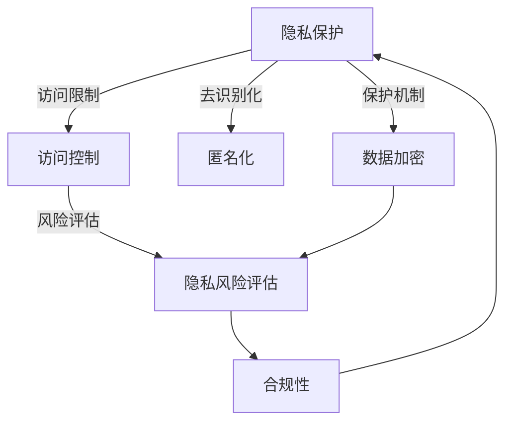

                 

## 1. 背景介绍

在数字化时代，计算资源的丰富和计算能力的提升，使得数据驱动的智能化应用遍地开花。然而，数据的敏感性、数据的合法使用、数据的隐私保护成为了技术发展过程中亟待解决的重大问题。这些问题的解决不仅关系到数字经济的健康发展，也直接关联到每个人的权益保障和日常生活。

本文将深入探讨隐私安全在数据处理和计算中的应用，旨在提升对数据安全防护的认识，帮助企业和个人在技术发展中采取有效的措施，保护敏感数据，实现数据价值最大化，并确保数据使用的合规性。

## 2. 核心概念与联系

### 2.1 核心概念概述

1. **隐私保护**：在数据处理和计算中，对个人、组织或其他实体敏感信息进行保护，避免未经授权的访问和使用。
2. **数据敏感性**：数据的敏感程度，即泄露或被恶意使用可能导致的潜在危害。
3. **数据加密**：对数据进行编码，使其无法被未经授权的第三方解读。
4. **匿名化**：通过移除或变换数据中的身份标识信息，使其无法直接识别具体个人。
5. **访问控制**：通过设置权限和身份验证，控制数据访问和使用。
6. **隐私风险评估**：评估数据处理过程中可能出现的隐私风险，并采取措施减少风险。
7. **合规性**：确保数据处理和使用的行为符合法律法规和伦理标准。

### 2.2 核心概念联系（Mermaid流程图）



### 2.3 核心概念原理和架构

隐私保护涉及多个技术层面，包括数据加密、匿名化、访问控制等。这些技术构成了隐私保护架构的核心。

- **数据加密**：基于密码学的加密技术，通过对数据进行编码，防止未经授权的第三方解读。常用加密算法包括AES、RSA等。

- **匿名化**：通过移除或变换数据中的身份标识信息，使得数据无法直接识别具体个人。匿名化技术包括k-匿名、t-接近匿名、差分隐私等。

- **访问控制**：通过设定权限和身份验证，限制对数据的访问和使用。访问控制机制通常包括身份验证、权限管理、审计日志等。

隐私保护架构的目标是通过以上多种技术手段，确保数据在存储、传输、使用过程中的安全性。

## 3. 核心算法原理 & 具体操作步骤

### 3.1 算法原理概述

数据隐私保护的核心在于如何在保证数据可用性的同时，确保数据的安全性。常见的隐私保护算法包括差分隐私、同态加密、安全多方计算等。

- **差分隐私**：通过在查询结果中引入随机噪声，使得攻击者无法确定任何单个数据记录。差分隐私的数学定义如下：
  $$
  \epsilon-\text{差分隐私} \implies |P(Q(D)) - P(Q(D'))| \leq \epsilon
  $$
  其中 $D$ 和 $D'$ 是相邻的数据集，$Q$ 是一个查询函数，$\epsilon$ 是隐私保护参数。

- **同态加密**：允许在加密数据上执行计算，计算结果可以直接解密，无需访问明文数据。同态加密分为全同态加密(PHF)和部分同态加密(PHS)。

- **安全多方计算**：允许多方在不泄露各自输入的情况下，协作计算一个共享函数。安全多方计算基于多方安全计算协议，保障各方数据隐私。

### 3.2 算法步骤详解

以下是差分隐私算法的详细步骤：

1. **定义隐私保护参数**：根据数据敏感性和隐私保护需求，设定隐私保护参数 $\epsilon$。
2. **添加噪声**：在数据查询结果中随机添加噪声 $\delta$。
3. **查询和计算**：在噪声化后的数据上执行查询和计算操作。
4. **解密和输出**：将查询结果解密，输出最终的查询结果。

### 3.3 算法优缺点

差分隐私算法的主要优点包括：
- 提供了数学定义的隐私保护，确保隐私保护参数 $\epsilon$ 满足隐私保护要求。
- 适用范围广，适用于多种数据查询场景。

主要缺点包括：
- 引入的噪声可能影响查询结果的精度。
- 隐私保护参数 $\epsilon$ 与查询结果的精度成反比，需要平衡隐私和精度。

### 3.4 算法应用领域

差分隐私算法广泛应用于政府数据公开、企业用户数据分析、健康数据分析等领域。例如，在医疗数据公开时，差分隐私算法可以确保公开数据无法识别具体个人，保护个人隐私。

## 4. 数学模型和公式 & 详细讲解 & 举例说明

### 4.1 数学模型构建

差分隐私的定义如下：
$$
\epsilon-\text{差分隐私} \implies |P(Q(D)) - P(Q(D'))| \leq \epsilon
$$
其中 $D$ 和 $D'$ 是相邻的数据集，$Q$ 是一个查询函数，$\epsilon$ 是隐私保护参数。

### 4.2 公式推导过程

对于查询函数 $Q$，差分隐私的定义可以转化为：
$$
|P(Q(D)) - P(Q(D'))| \leq \epsilon
$$
假设 $D$ 和 $D'$ 只有一条记录不同，即 $D = D' + v$，其中 $v$ 是单位向量。

则差分隐私的推导过程如下：
$$
\begin{aligned}
|P(Q(D)) - P(Q(D'))| &= |P(Q(D + v)) - P(Q(D'))| \\
&\leq |P(Q(D + v)) - P(Q(D))| + |P(Q(D)) - P(Q(D'))| \\
&= \epsilon
\end{aligned}
$$
即 $\epsilon$ 可以用于衡量隐私保护的强度。

### 4.3 案例分析与讲解

考虑一个查询函数 $Q$，查询一个数据集 $D$ 中记录的平均值。差分隐私的实现步骤如下：

1. 定义隐私保护参数 $\epsilon$。
2. 随机生成噪声 $\delta$，满足 $\delta \sim \mathcal{N}(0, \sigma^2)$。
3. 计算 $Q(D) = \frac{1}{|D|}\sum_{i=1}^{|D|} x_i + \delta$。
4. 输出查询结果 $Q(D)$。

通过差分隐私算法，确保查询结果的平均值在 $\epsilon$ 范围内的概率极高，从而保护了数据隐私。

## 5. 项目实践：代码实例和详细解释说明

### 5.1 开发环境搭建

1. 安装Python：从官网下载并安装Python，建议安装最新版本。
2. 安装相关库：通过pip安装numpy、pandas、scipy等库，用于数据处理和计算。
3. 安装差分隐私库：通过pip安装differential_privacy库，用于实现差分隐私算法。

### 5.2 源代码详细实现

```python
import differential_privacy as dp
import numpy as np
import pandas as pd

def differential_privacy_query(data, query_func, epsilon):
    dp_query = dp.DifferentialPrivacy(query_func, epsilon=epsilon)
    result = dp_query(data)
    return result

# 数据集
data = pd.read_csv('data.csv')

# 查询函数
def query_func(data):
    return np.mean(data['value'])

# 隐私保护参数
epsilon = 0.1

# 执行差分隐私查询
result = differential_privacy_query(data, query_func, epsilon)

print(result)
```

### 5.3 代码解读与分析

在上述代码中，我们首先定义了一个差分隐私查询函数 `differential_privacy_query`，接受数据集、查询函数和隐私保护参数作为输入。接着，我们使用差分隐私库 `differential_privacy` 创建了差分隐私查询对象 `dp_query`，设置隐私保护参数 `epsilon`。最后，通过调用查询对象的方法 `dp_query(data)`，实现了差分隐私查询。

## 6. 实际应用场景

### 6.1 政府数据公开

政府在公开数据时，需要考虑数据的敏感性，避免泄露个人隐私。差分隐私算法可以用于匿名化数据，确保公开数据无法识别具体个人。

### 6.2 企业用户数据分析

企业在分析用户数据时，需要保护用户的隐私。差分隐私算法可以用于查询用户行为数据，同时保护用户的隐私不被泄露。

### 6.3 健康数据分析

在健康数据分析中，需要保护患者隐私。差分隐私算法可以用于查询患者数据，同时确保患者的隐私不被泄露。

### 6.4 未来应用展望

未来，隐私保护技术将更加广泛地应用于数字化时代，保障个人和企业数据的安全。同时，隐私保护技术也将与区块链、量子计算等新兴技术结合，提供更为先进和安全的隐私保护方案。

## 7. 工具和资源推荐

### 7.1 学习资源推荐

1. 《数据科学导论》：该书详细介绍了数据处理和分析的基本概念和技术，包括数据清洗、数据可视化等。
2. 《机器学习实战》：该书提供了丰富的机器学习实践案例，包括数据预处理、模型训练等。
3. 《差分隐私算法》：该书详细介绍了差分隐私算法的原理和实现方法，适合深入学习。
4. 《隐私保护与安全技术》课程：由清华大学开设，讲解了隐私保护和安全技术的基本原理和应用案例。

### 7.2 开发工具推荐

1. Python：Python作为数据科学和机器学习的主要语言，提供了丰富的数据处理和分析库。
2. Pandas：Pandas是Python中常用的数据处理库，支持数据清洗、数据可视化等操作。
3. Scikit-learn：Scikit-learn是Python中常用的机器学习库，支持多种机器学习算法的实现。
4. Differential Privacy：Differential Privacy是Python中常用的差分隐私库，支持差分隐私算法的实现。

### 7.3 相关论文推荐

1. "Differential Privacy" by Cynthia Dwork et al.：该论文是差分隐私算法的经典之作，奠定了差分隐私理论的基础。
2. "Homomorphic Encryption: Fully Homomorphic and Somewhat Homomorphic Encryption" by Craig Gentry：该论文提出了全同态加密和部分同态加密的概念，为同态加密技术奠定了理论基础。
3. "Secure Multi-Party Computation and Secret Sharing" by Shafi Goldwasser et al.：该论文介绍了安全多方计算的基本原理和实现方法，为安全多方计算技术提供了理论支持。

## 8. 总结：未来发展趋势与挑战

### 8.1 研究成果总结

隐私保护技术在数字化时代的重要性日益凸显，差分隐私、同态加密、安全多方计算等技术在实践中得到了广泛应用。差分隐私算法提供了数学定义的隐私保护，适用于多种数据查询场景。

### 8.2 未来发展趋势

未来，隐私保护技术将进一步与区块链、量子计算等新兴技术结合，提供更为先进和安全的隐私保护方案。同时，隐私保护技术也将更加广泛地应用于各行各业，保障数据的安全性。

### 8.3 面临的挑战

隐私保护技术在实际应用中面临诸多挑战，包括隐私保护参数的设定、隐私保护的精度和效率、隐私保护算法的实现复杂度等。需要更多的研究和实践来不断优化隐私保护技术。

### 8.4 研究展望

未来，隐私保护技术将在保障数据安全的同时，促进数据的高效利用，推动数字化经济的发展。同时，隐私保护技术也将与法律、伦理等社会因素结合，形成更为完善的隐私保护体系。

## 9. 附录：常见问题与解答

**Q1：差分隐私算法的基本原理是什么？**

A: 差分隐私算法通过在查询结果中引入随机噪声，使得攻击者无法确定任何单个数据记录，从而保护数据隐私。

**Q2：差分隐私算法的主要优点和缺点是什么？**

A: 差分隐私算法的主要优点包括提供了数学定义的隐私保护和适用范围广。主要缺点包括引入的噪声可能影响查询结果的精度，隐私保护参数和查询结果的精度成反比。

**Q3：差分隐私算法可以应用于哪些场景？**

A: 差分隐私算法可以应用于政府数据公开、企业用户数据分析、健康数据分析等多个场景，确保数据在公开和查询过程中保护隐私。

**Q4：如何选择合适的差分隐私参数？**

A: 差分隐私参数的选择需要根据数据敏感性和隐私保护需求来确定。通常采用Laplace噪声、Gaussian噪声等方法来引入噪声，并通过试验评估隐私保护效果。

**Q5：如何在差分隐私算法中保证查询结果的精度？**

A: 在差分隐私算法中，引入噪声的强度和隐私保护参数有关。通过调整噪声的强度和隐私保护参数，可以在隐私保护和查询结果精度之间取得平衡。

---

作者：禅与计算机程序设计艺术 / Zen and the Art of Computer Programming

