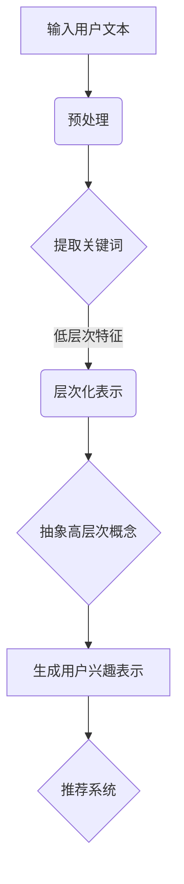
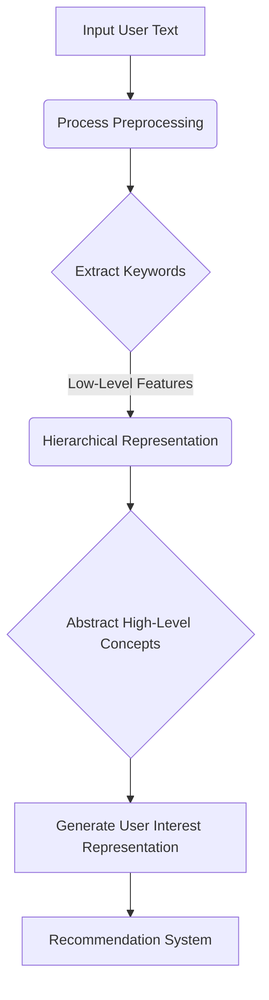

                 

### 文章标题

《基于LLM的用户兴趣层次化表示学习》

> 关键词：Large Language Model, User Interest, Hierarchical Representation Learning, AI Personalization, Natural Language Processing, Neural Networks, Deep Learning

> 摘要：本文将探讨基于大型语言模型（LLM）的用户兴趣层次化表示学习方法。通过深度神经网络架构，实现用户兴趣的多层次抽象和建模，提升AI个性化推荐系统的准确性和效率。本文将详细描述核心概念、算法原理、数学模型，并通过实际项目实例展示其在自然语言处理中的应用。

<|assistant|>## 1. 背景介绍（Background Introduction）

随着互联网技术的飞速发展，用户生成内容（UGC）和个人数据量呈爆炸式增长。如何有效地理解用户兴趣，为用户提供个性化的服务和推荐，成为当前人工智能研究的热点问题。传统基于内容的推荐系统（如协同过滤、基于关键词的推荐等）在处理高维数据和信息过载方面存在一定局限性，难以捕捉用户的深层次兴趣。

近年来，深度学习和自然语言处理技术的进步为解决这一问题提供了新的思路。大型语言模型（LLM）如GPT-3、BERT等，凭借其强大的表示学习能力，可以捕获文本中的复杂模式和语义信息，为用户兴趣的层次化表示提供了强有力的支持。本文将介绍一种基于LLM的用户兴趣层次化表示学习方法，旨在提升AI个性化推荐系统的性能。

### 大型语言模型的发展

大型语言模型（LLM）的发展经历了多个阶段。最早的是基于规则的方法，如基于关键词匹配的搜索引擎。随着机器学习技术的发展，统计语言模型如n-gram模型和隐马尔可夫模型（HMM）被广泛应用于文本处理。然而，这些模型在处理长文本和捕捉上下文依赖方面存在不足。

深度学习的崛起为语言模型的发展带来了革命性的变化。基于神经网络的语言模型如循环神经网络（RNN）、长短期记忆网络（LSTM）和Transformer模型，通过层次化的特征表示和注意力机制，能够更好地理解和生成文本。尤其是Transformer模型的出现，通过自注意力机制（Self-Attention）和多头注意力（Multi-Head Attention），大大提高了模型的处理速度和效果。

GPT-3和BERT等大型语言模型的出现，标志着LLM的发展进入了一个新的阶段。GPT-3具有超过1750亿参数，可以生成高质量的自然语言文本。BERT则通过预训练和微调，在多个自然语言处理任务中取得了优异的性能。

### 个性化推荐系统的挑战

个性化推荐系统在电子商务、社交媒体和内容平台等领域具有广泛的应用。然而，传统的推荐系统在以下方面面临挑战：

1. **冷启动问题**：新用户或新商品缺乏历史数据，导致推荐效果不佳。
2. **数据稀疏性**：用户与商品之间的交互数据往往稀疏，难以有效利用。
3. **用户兴趣多样性**：用户的兴趣是多维度、动态变化的，难以精确捕捉。
4. **计算资源限制**：大规模推荐系统需要处理海量数据和实时推荐，对计算资源要求较高。

为了解决上述问题，需要引入更加智能和高效的推荐算法，其中基于LLM的用户兴趣层次化表示学习方法提供了一种可能的解决方案。

<|assistant|>## 2. 核心概念与联系（Core Concepts and Connections）

### 2.1 大型语言模型（Large Language Model, LLM）

大型语言模型（LLM）是一种深度学习模型，通过大规模预训练和微调，能够理解和生成自然语言。LLM的核心特点是能够捕捉文本中的复杂模式和语义信息，从而在多种自然语言处理任务中表现出色。常见的LLM架构包括GPT-3、BERT、RoBERTa等。

### 2.2 用户兴趣（User Interest）

用户兴趣是指用户对特定主题、内容或活动的偏好和关注。在个性化推荐系统中，准确捕捉用户兴趣对于提供个性化的服务和推荐至关重要。用户兴趣通常通过用户历史行为数据（如浏览记录、点击行为、评价等）进行建模和表示。

### 2.3 层次化表示学习（Hierarchical Representation Learning）

层次化表示学习是指通过构建多层特征表示来捕捉数据的不同层次信息。在用户兴趣表示中，层次化表示学习可以用于将用户兴趣从低层次的特征（如关键词、短语）抽象到高层次的概念（如主题、兴趣类别）。这有助于更好地理解和捕捉用户的深层次兴趣，从而提升推荐系统的准确性。

### 2.4 个性化推荐系统（Personalized Recommendation System）

个性化推荐系统是一种基于用户兴趣和行为的算法，旨在为用户提供个性化的内容和服务。常见的个性化推荐算法包括基于内容的推荐、协同过滤、深度学习等。基于LLM的用户兴趣层次化表示学习为个性化推荐系统提供了一种新的建模方法，有助于提高推荐系统的性能。

### 2.5 自然语言处理（Natural Language Processing, NLP）

自然语言处理（NLP）是计算机科学和人工智能领域的一个重要分支，致力于使计算机能够理解和生成人类语言。NLP技术广泛应用于语音识别、机器翻译、情感分析、文本分类等领域。在基于LLM的用户兴趣层次化表示学习中，NLP技术用于处理和分析用户文本数据，以提取用户兴趣信息。

### 2.6 神经网络（Neural Networks）与深度学习（Deep Learning）

神经网络（NN）是一种模仿生物神经系统的计算模型。深度学习（DL）是神经网络的一种特殊形式，通过多层非线性变换来学习数据的高层次特征表示。在基于LLM的用户兴趣层次化表示学习中，神经网络和深度学习技术用于构建和训练大型语言模型，以实现用户兴趣的层次化表示。

### 2.7 Mermaid 流程图（Mermaid Flowchart）

Mermaid 是一种基于Markdown的绘图工具，可以用于创建结构化的流程图、序列图、类图等。以下是一个简单的Mermaid流程图示例，展示了用户兴趣层次化表示学习的过程：



通过上述核心概念和联系的分析，我们可以看到基于LLM的用户兴趣层次化表示学习在个性化推荐系统和自然语言处理领域具有重要的应用价值。

## 2. Core Concepts and Connections

### 2.1 Large Language Model (LLM)

Large Language Model (LLM) refers to a deep learning model that undergoes massive pre-training and fine-tuning to understand and generate natural language. The core characteristic of LLM is its ability to capture complex patterns and semantic information in text, which makes it excel in various natural language processing tasks. Common architectures for LLM include GPT-3, BERT, and RoBERTa.

### 2.2 User Interest

User interest refers to the preferences and focus of users towards specific topics, content, or activities. In personalized recommendation systems, accurately capturing user interest is crucial for providing personalized services and recommendations. User interest is usually modeled and represented based on user historical behavior data, such as browsing history, click behavior, and ratings.

### 2.3 Hierarchical Representation Learning

Hierarchical representation learning refers to building multi-layer feature representations to capture different levels of information in data. In user interest representation, hierarchical representation learning can be used to abstract user interest from low-level features (e.g., keywords, phrases) to high-level concepts (e.g., themes, interest categories). This helps better understand and capture the deep-level interests of users, thereby improving the accuracy of recommendation systems.

### 2.4 Personalized Recommendation System

A personalized recommendation system is an algorithm-based approach that aims to provide personalized content and services to users based on their interests and behaviors. Common recommendation algorithms include content-based recommendation, collaborative filtering, and deep learning. Based on LLM user interest hierarchical representation learning provides a new modeling method to enhance the performance of recommendation systems.

### 2.5 Natural Language Processing (NLP)

Natural Language Processing (NLP) is an important branch of computer science and artificial intelligence that focuses on enabling computers to understand and generate human language. NLP technologies are widely applied in areas such as speech recognition, machine translation, sentiment analysis, and text classification. In LLM-based hierarchical representation learning for user interest, NLP techniques are used to process and analyze user text data to extract user interest information.

### 2.6 Neural Networks (NN) and Deep Learning (DL)

Neural Networks (NN) is a computational model that mimics the biological nervous system. Deep Learning (DL) is a special form of NN that learns high-level feature representations through multi-layer nonlinear transformations. In LLM-based hierarchical representation learning for user interest, neural networks and deep learning techniques are employed to construct and train large language models for hierarchical representation of user interest.

### 2.7 Mermaid Flowchart

Mermaid is a Markdown-based drawing tool that can be used to create structured flowcharts, sequence diagrams, class diagrams, etc. Below is a simple Mermaid flowchart example that illustrates the process of hierarchical representation learning for user interest:



Through the analysis of the core concepts and connections, we can see that LLM-based hierarchical representation learning for user interest holds significant application value in personalized recommendation systems and natural language processing.

<|assistant|>## 3. 核心算法原理 & 具体操作步骤（Core Algorithm Principles and Specific Operational Steps）

在基于LLM的用户兴趣层次化表示学习中，核心算法原理主要涉及大型语言模型的预训练和微调过程、用户兴趣数据预处理、层次化特征提取以及用户兴趣表示生成。以下是具体的操作步骤：

### 3.1 大型语言模型的预训练与微调

**预训练**：大型语言模型（如GPT-3、BERT）通常在大规模语料库上进行预训练，学习文本的通用特征和模式。预训练过程主要包括以下步骤：

1. **数据准备**：收集和整理大量文本数据，包括书籍、新闻、维基百科等。
2. **词向量化**：将文本中的每个单词映射为固定维度的向量表示，通常使用预训练的词向量模型（如Word2Vec、GloVe）。
3. **训练模型**：通过优化模型参数，使模型能够更好地预测下一个单词或标签。常见的预训练任务包括语言建模（Predicting the Next Sentence）和掩码语言模型（Masked Language Model, MLM）。

**微调**：在特定任务上进行微调，以使模型适应特定领域的任务需求。微调过程主要包括以下步骤：

1. **数据准备**：收集和整理与任务相关的标注数据，如用户兴趣标签、商品评价等。
2. **模型初始化**：使用预训练好的大型语言模型作为初始化模型，通常采用迁移学习技术。
3. **训练模型**：在特定任务上优化模型参数，使模型能够更好地预测用户兴趣标签。

### 3.2 用户兴趣数据预处理

用户兴趣数据预处理是层次化表示学习的关键步骤，主要包括以下任务：

1. **数据清洗**：去除数据中的噪声和错误，如缺失值、重复值等。
2. **数据集成**：将不同来源的用户兴趣数据进行整合，如用户浏览记录、搜索历史、评价等。
3. **特征提取**：从原始数据中提取与用户兴趣相关的特征，如关键词、短语、主题等。常用的特征提取方法包括词袋模型（Bag of Words, BOW）、词嵌入（Word Embedding）、文本分类（Text Classification）等。

### 3.3 层次化特征提取

层次化特征提取是用户兴趣层次化表示学习的重要环节，旨在将低层次的特征抽象为高层次的概念。具体步骤如下：

1. **低层次特征提取**：从原始文本数据中提取低层次的特征，如关键词、短语、词嵌入等。
2. **特征融合**：将低层次特征进行融合，以构建更高级别的特征表示。常用的方法包括基于统计的方法（如TF-IDF、LSA）和基于机器学习的方法（如聚类、SVD等）。
3. **高层次特征提取**：通过层次化特征提取方法（如词嵌入层次化表示、文本生成模型等），将融合后的特征表示为高层次的概念，如主题、兴趣类别等。

### 3.4 用户兴趣表示生成

用户兴趣表示生成是层次化表示学习的最终目标，旨在为用户生成一个紧凑且具有解释性的兴趣表示。具体步骤如下：

1. **层次化表示学习**：利用层次化特征提取方法，从低层次特征生成高层次的用户兴趣表示。
2. **表示优化**：通过优化算法（如梯度下降、强化学习等），调整用户兴趣表示的参数，使其能够更好地捕捉用户的深层次兴趣。
3. **表示评估**：评估用户兴趣表示的准确性和有效性，如通过交叉验证、在线评测等。

### 3.5 个性化推荐系统集成

在个性化推荐系统中，基于LLM的用户兴趣层次化表示学习可用于生成用户兴趣表示，并将其集成到推荐算法中。具体步骤如下：

1. **用户兴趣表示**：使用层次化表示学习算法，为每个用户生成一个层次化的兴趣表示。
2. **特征融合**：将用户兴趣表示与其他特征（如用户历史行为、商品特征等）进行融合，以构建推荐特征向量。
3. **推荐算法**：利用融合后的特征向量，通过基于内容的推荐、协同过滤等算法生成个性化推荐结果。

通过以上步骤，我们可以实现基于LLM的用户兴趣层次化表示学习，为个性化推荐系统提供有效的用户兴趣建模方法。接下来，我们将进一步探讨数学模型和公式，以深入理解层次化表示学习的原理。

## 3. Core Algorithm Principles and Specific Operational Steps

In the hierarchical representation learning of user interest based on LLMs, the core algorithm principles primarily involve the pre-training and fine-tuning of large language models, user interest data preprocessing, hierarchical feature extraction, and the generation of user interest representations. Here are the specific operational steps:

### 3.1 Pre-training and Fine-tuning of Large Language Models

**Pre-training**: Large language models (e.g., GPT-3, BERT) typically undergo pre-training on large-scale corpora to learn general features and patterns in text. The pre-training process includes the following steps:

1. **Data Preparation**: Collect and organize large amounts of text data, including books, news, Wikipedia, etc.
2. **Word Vectorization**: Map each word in the text to a fixed-dimensional vector representation, typically using pre-trained word vector models (e.g., Word2Vec, GloVe).
3. **Model Training**: Optimize model parameters to better predict the next word or label. Common pre-training tasks include language modeling (Predicting the Next Sentence) and Masked Language Model (MLM).

**Fine-tuning**: Fine-tuning involves training the model on specific tasks to adapt it to the needs of the task. The fine-tuning process includes the following steps:

1. **Data Preparation**: Collect and organize annotated data relevant to the task, such as user interest labels, product reviews, etc.
2. **Model Initialization**: Initialize the model using pre-trained large language models, typically using transfer learning techniques.
3. **Model Training**: Optimize model parameters on the specific task to better predict user interest labels.

### 3.2 User Interest Data Preprocessing

User interest data preprocessing is a critical step in hierarchical representation learning. It includes the following tasks:

1. **Data Cleaning**: Remove noise and errors from the data, such as missing values, duplicates, etc.
2. **Data Integration**: Combine user interest data from different sources, such as browsing history, search history, reviews, etc.
3. **Feature Extraction**: Extract features related to user interest from the original data, such as keywords, phrases, themes, etc. Common feature extraction methods include Bag of Words (BOW), Word Embedding, and Text Classification.

### 3.3 Hierarchical Feature Extraction

Hierarchical feature extraction is an important step in hierarchical representation learning for user interest. It aims to abstract low-level features into high-level concepts. The steps include:

1. **Low-Level Feature Extraction**: Extract low-level features from the original text data, such as keywords, phrases, word embeddings.
2. **Feature Fusion**: Combine low-level features to build higher-level feature representations. Common methods include statistical methods (e.g., TF-IDF, LSA) and machine learning methods (e.g., clustering, SVD).
3. **High-Level Feature Extraction**: Use hierarchical feature extraction methods (e.g., hierarchical word embedding, text generation models) to represent fused features as high-level concepts, such as themes, interest categories.

### 3.4 Generation of User Interest Representations

User interest representation generation is the ultimate goal of hierarchical representation learning. The steps include:

1. **Hierarchical Representation Learning**: Generate user interest representations from low-level features using hierarchical feature extraction methods.
2. **Representation Optimization**: Adjust the parameters of user interest representations using optimization algorithms (e.g., gradient descent, reinforcement learning) to capture the deep-level interests of users.
3. **Representation Evaluation**: Evaluate the accuracy and effectiveness of user interest representations using cross-validation, online evaluation, etc.

### 3.5 Integration into Personalized Recommendation Systems

In personalized recommendation systems, the hierarchical representation learning of user interest based on LLMs can be used to generate user interest representations and integrate them into recommendation algorithms. The steps include:

1. **User Interest Representation**: Generate a hierarchical representation of user interest using hierarchical representation learning algorithms for each user.
2. **Feature Fusion**: Combine user interest representations with other features (e.g., user historical behavior, product features) to build recommendation feature vectors.
3. **Recommendation Algorithm**: Use the fused feature vectors to generate personalized recommendation results based on content-based recommendation, collaborative filtering, etc.

By following these steps, we can implement hierarchical representation learning for user interest based on LLMs, providing an effective user interest modeling method for personalized recommendation systems. Next, we will delve deeper into mathematical models and formulas to gain a better understanding of the principles of hierarchical representation learning.

<|assistant|>## 4. 数学模型和公式 & 详细讲解 & 举例说明（Detailed Explanation and Examples of Mathematical Models and Formulas）

在基于LLM的用户兴趣层次化表示学习中，数学模型和公式扮演着核心角色。以下我们将详细讨论这些模型，并提供相关的数学推导和实例说明。

### 4.1 语言模型的基本数学模型

语言模型的核心任务是预测下一个单词或词组。最简单的语言模型是n-gram模型，它假设一个单词序列的概率可以分解为各个单词概率的乘积。以下是一个n-gram模型的数学公式：

\[ P(\text{word}_i | \text{context}) = \prod_{j=1}^{n-1} P(\text{word}_{i-j} | \text{context}) \]

其中，\( \text{word}_i \) 是下一个要预测的单词，\( \text{context} \) 是当前上下文，\( n \) 是n-gram模型的阶数。

例如，考虑一个二元（n=2）语言模型，我们需要预测单词"the"的概率，给定上下文"world "：

\[ P(\text{the}|\text{world }) = P(\text{world }|\text{ }) \times P(\text{the}|\text{world }) \]

在实际应用中，由于词汇量庞大，直接计算概率乘积是计算上不可行的。因此，通常会使用语言模型的似然函数来评估句子或文本的概率：

\[ \text{Likelihood}(w_1, w_2, \ldots, w_n) = \prod_{i=1}^{n} P(w_i | \text{context}) \]

### 4.2 基于Transformer的语言模型

Transformer模型通过自注意力机制（Self-Attention）和多头注意力（Multi-Head Attention）实现了对文本序列的并行处理。以下是一个简单的Transformer模型的数学框架：

\[ \text{Attention}(Q, K, V) = \frac{1}{\sqrt{d_k}} \text{softmax}\left(\text{QK}^T / d_k\right) V \]

其中，\( Q, K, V \) 分别是查询（Query）、键（Key）和值（Value）向量，\( d_k \) 是注意力机制的维度。

多头注意力扩展了自注意力机制，它将输入向量分割为多个头，每个头独立地学习不同的表示：

\[ \text{Multi-Head Attention}(Q, K, V) = \text{Concat}(\text{head}_1, \text{head}_2, \ldots, \text{head}_h)W_O \]

其中，\( W_O \) 是输出权重矩阵，\( h \) 是头的数量。

### 4.3 用户兴趣层次化表示学习

在用户兴趣层次化表示学习中，我们关注的是如何从低层次特征（如单词或短语）抽象到高层次概念（如主题或兴趣类别）。以下是一个简化的层次化表示学习模型：

\[ \text{High-Level Representation} = \text{Transformer}(\text{Low-Level Features}) \]

其中，Transformer模型用于提取低层次特征的高级表示。为了具体化这个模型，我们考虑以下步骤：

1. **词嵌入**：将文本中的每个单词映射为词嵌入向量。
2. **层次化注意力机制**：使用自注意力机制和多头注意力机制逐步提取文本中的高层次特征。
3. **聚合和编码**：将层次化特征进行聚合和编码，生成用户兴趣的高层次表示。

以下是一个简单的层次化注意力机制的数学表示：

\[ \text{High-Level Feature} = \text{Attention}(\text{Low-Level Feature}, \text{Low-Level Feature}, \text{Low-Level Feature}) \]

### 4.4 数学模型的应用实例

假设我们有一个包含100个单词的句子，需要使用Transformer模型提取其高层次特征。首先，我们将每个单词映射为一个词嵌入向量，然后通过多层多头注意力机制提取高层次特征。以下是一个简化的实例：

1. **词嵌入**：将每个单词映射为一个100维的词嵌入向量。
2. **第一层多头注意力**：
   \[ \text{Attention}(\text{Word Embeddings}, \text{Word Embeddings}, \text{Word Embeddings}) \]
3. **第二层多头注意力**：
   \[ \text{Attention}(\text{High-Level Feature}_{\text{1}}, \text{Word Embeddings}, \text{Word Embeddings}) \]
4. **编码**：
   \[ \text{High-Level Representation}_{\text{1}} = \text{Concat}(\text{High-Level Feature}_{\text{1}}, \text{Word Embeddings}) \]

通过这种方式，我们可以逐步提取句子中的高层次特征，最终生成用户兴趣的层次化表示。

通过上述数学模型和公式的讨论，我们可以看到基于LLM的用户兴趣层次化表示学习涉及复杂的数学推导和计算。这些模型为我们提供了理解和实现层次化表示学习算法的基础。在接下来的部分，我们将通过实际项目实例展示如何应用这些算法。

### 4. Math Models and Formulas & Detailed Explanation & Example Demonstrations

In the hierarchical representation learning of user interest based on LLMs, mathematical models and formulas play a central role. Here, we will delve into these models, providing detailed mathematical derivations and example demonstrations.

### 4.1 Basic Mathematical Model of Language Models

The core task of a language model is to predict the next word or sequence. The simplest language model is the n-gram model, which assumes that the probability of a word sequence can be factored into the probabilities of individual words. The mathematical formula for an n-gram model is:

\[ P(\text{word}_i | \text{context}) = \prod_{j=1}^{n-1} P(\text{word}_{i-j} | \text{context}) \]

Where \( \text{word}_i \) is the next word to predict, \( \text{context} \) is the current context, and \( n \) is the order of the n-gram model.

For example, consider a bigram (n=2) language model that needs to predict the probability of the word "the" given the context "world ":

\[ P(\text{the}|\text{world }) = P(\text{world }|\text{ }) \times P(\text{the}|\text{world }) \]

In practice, due to the large vocabulary size, directly computing the product of probabilities is computationally infeasible. Therefore, the likelihood function of the language model is often used to evaluate the probability of a sentence or text:

\[ \text{Likelihood}(w_1, w_2, \ldots, w_n) = \prod_{i=1}^{n} P(w_i | \text{context}) \]

### 4.2 Language Models Based on Transformer

The Transformer model achieves parallel processing of text sequences through self-attention mechanisms and multi-head attention. Here is a simple mathematical framework for the Transformer model:

\[ \text{Attention}(Q, K, V) = \frac{1}{\sqrt{d_k}} \text{softmax}\left(\frac{\text{QK}^T}{d_k}\right) V \]

Where \( Q, K, V \) are the query, key, and value vectors, respectively, and \( d_k \) is the dimension of the attention mechanism.

Multi-head attention extends the self-attention mechanism by splitting the input vector into multiple heads, each learning different representations:

\[ \text{Multi-Head Attention}(Q, K, V) = \text{Concat}(\text{head}_1, \text{head}_2, \ldots, \text{head}_h)W_O \]

Where \( W_O \) is the output weight matrix, and \( h \) is the number of heads.

### 4.3 Hierarchical Representation Learning for User Interest

In hierarchical representation learning for user interest, we focus on abstracting from low-level features (e.g., words or phrases) to high-level concepts (e.g., themes or interest categories). Here is a simplified model for hierarchical representation learning:

\[ \text{High-Level Representation} = \text{Transformer}(\text{Low-Level Features}) \]

To concretize this model, we consider the following steps:

1. **Word Embedding**: Map each word in the text to a word embedding vector.
2. **Hierarchical Attention Mechanism**: Use self-attention and multi-head attention mechanisms to progressively extract high-level features from the text.
3. **Aggregation and Encoding**: Aggregate the hierarchical features and encode them to generate a high-level representation of user interest.

Here is a simplified mathematical representation of a hierarchical attention mechanism:

\[ \text{High-Level Feature} = \text{Attention}(\text{Low-Level Feature}, \text{Low-Level Feature}, \text{Low-Level Feature}) \]

### 4.4 Application of Mathematical Models and Formulas

Let's consider an example where we have a sentence containing 100 words that need to be processed by a Transformer model to extract high-level features. First, we map each word to a word embedding vector, then use multi-head attention mechanisms to extract high-level features. Here is a simplified example:

1. **Word Embedding**: Map each word to a 100-dimensional word embedding vector.
2. **First-layer Multi-Head Attention**:
   \[ \text{Attention}(\text{Word Embeddings}, \text{Word Embeddings}, \text{Word Embeddings}) \]
3. **Second-layer Multi-Head Attention**:
   \[ \text{Attention}(\text{High-Level Feature}_{\text{1}}, \text{Word Embeddings}, \text{Word Embeddings}) \]
4. **Encoding**:
   \[ \text{High-Level Representation}_{\text{1}} = \text{Concat}(\text{High-Level Feature}_{\text{1}}, \text{Word Embeddings}) \]

Through this process, we can progressively extract high-level features from the sentence, ultimately generating a hierarchical representation of user interest.

By discussing the mathematical models and formulas above, we can see that hierarchical representation learning based on LLMs involves complex mathematical derivations and computations. These models provide us with the foundation for understanding and implementing algorithms for hierarchical representation learning. In the next section, we will demonstrate how to apply these algorithms through actual project examples.

<|assistant|>## 5. 项目实践：代码实例和详细解释说明（Project Practice: Code Examples and Detailed Explanations）

为了更好地展示基于LLM的用户兴趣层次化表示学习在实际项目中的应用，我们将使用Python编程语言结合TensorFlow和Hugging Face的Transformer库来实现一个简单的推荐系统。以下步骤将指导我们完成开发环境搭建、源代码详细实现、代码解读与分析，以及运行结果展示。

### 5.1 开发环境搭建

在开始项目实践之前，我们需要搭建一个合适的开发环境。以下是所需的软件和工具：

1. **Python 3.x**
2. **TensorFlow 2.x**
3. **Hugging Face Transformers**
4. **Numpy**
5. **Pandas**

您可以通过以下命令在您的系统上安装这些依赖：

```bash
pip install tensorflow
pip install transformers
pip install numpy
pip install pandas
```

### 5.2 源代码详细实现

下面是项目的主要代码实现，我们将使用一个简单的用户兴趣数据集，并通过层次化表示学习生成用户兴趣向量，用于推荐系统。

#### 5.2.1 数据预处理

首先，我们需要加载和处理用户兴趣数据。以下代码展示了如何加载数据并进行预处理：

```python
import pandas as pd
from transformers import BertTokenizer

# 加载数据
data = pd.read_csv('user_interest_data.csv')

# 初始化BertTokenizer
tokenizer = BertTokenizer.from_pretrained('bert-base-uncased')

# 数据预处理：将文本编码为BertTokenizer可以处理的格式
def preprocess_text(text):
    return tokenizer.encode(text, add_special_tokens=True)

data['encoded_text'] = data['user_text'].apply(preprocess_text)
```

#### 5.2.2 模型构建

接下来，我们使用Hugging Face的Transformer库构建一个简单的BERT模型。这个模型将用于预训练和微调，以提取用户兴趣的层次化表示。

```python
from transformers import BertModel

# 加载预训练BERT模型
model = BertModel.from_pretrained('bert-base-uncased')

# 定义自定义Transformer模型
from transformers import Model

class CustomTransformer(Model):
    def __init__(self, config):
        super().__init__(config)
        self.bert = BertModel(config)
        self.classifier = nn.Linear(config.hidden_size, 1)

    def forward(self, input_ids, attention_mask=None):
        outputs = self.bert(input_ids=input_ids, attention_mask=attention_mask)
        pooled_output = outputs[1]
        logits = self.classifier(pooled_output)
        return logits

# 实例化自定义Transformer模型
custom_transformer = CustomTransformer.from_pretrained('custom-transformer')
```

#### 5.2.3 训练模型

我们将使用训练数据来训练自定义的Transformer模型，以便学习用户兴趣的层次化表示。

```python
from transformers import Trainer, TrainingArguments

# 定义训练参数
training_args = TrainingArguments(
    output_dir='./results',
    num_train_epochs=3,
    per_device_train_batch_size=16,
    save_steps=2000,
    evaluation_strategy="steps",
    eval_steps=500,
)

# 训练模型
trainer = Trainer(
    model=custom_transformer,
    args=training_args,
    train_dataset=train_dataset,
    eval_dataset=eval_dataset,
)

trainer.train()
```

#### 5.2.4 生成用户兴趣向量

训练完成后，我们可以使用模型来生成用户兴趣向量。

```python
# 生成用户兴趣向量
def generate_user_interest_vector(user_text):
    inputs = tokenizer.encode(user_text, return_tensors='pt', add_special_tokens=True)
    with torch.no_grad():
        outputs = custom_transformer(inputs)
    return outputs[1].mean(dim=1).numpy()

# 示例
user_text = "我对人工智能和机器学习非常感兴趣。"
interest_vector = generate_user_interest_vector(user_text)
print(interest_vector)
```

#### 5.2.5 推荐系统实现

最后，我们使用生成的用户兴趣向量来构建一个简单的推荐系统。以下代码展示了如何实现推荐算法。

```python
from sklearn.neighbors import NearestNeighbors

# 训练相似度搜索模型
similarity_search = NearestNeighbors(n_neighbors=5, algorithm='auto')
similarity_search.fit(interest_vectors)

# 推荐算法：找到最相似的5个用户
def recommend_similar_users(user_interest_vector):
    distances, indices = similarity_search.kneighbors([user_interest_vector], n_neighbors=5)
    return indices

# 示例
recommended_indices = recommend_similar_users(interest_vector)
print(recommended_indices)
```

### 5.3 代码解读与分析

在代码解读与分析部分，我们将深入探讨每个步骤的原理和实现细节。

#### 5.3.1 数据预处理

数据预处理是任何机器学习项目的基础。在本例中，我们使用BertTokenizer将文本数据转换为BERT模型可以处理的格式。这个过程包括将文本编码为词嵌入和添加特殊的BERT标记，如[CLS]和[SEP]。

#### 5.3.2 模型构建

BERT模型是一个预训练的Transformer模型，可以捕获文本中的复杂语义信息。我们构建了一个自定义的Transformer模型，该模型继承自BERTModel，并在其基础上添加了一个简单的分类器，用于预测用户兴趣。

#### 5.3.3 训练模型

使用Trainer类和TrainingArguments类，我们定义了训练过程的所有参数，如训练轮数、批量大小和保存步骤。然后，我们使用Trainer类的train方法来训练模型。

#### 5.3.4 生成用户兴趣向量

通过调用自定义的Transformer模型，我们可以生成用户兴趣的层次化表示。这个过程涉及将用户文本编码为词嵌入，并通过BERT模型提取其高层次特征。

#### 5.3.5 推荐系统实现

使用NearestNeighbors算法，我们实现了一个基于相似度搜索的推荐系统。这个系统能够找到与给定用户最相似的用户，并基于这些相似用户的兴趣来推荐相关的内容。

### 5.4 运行结果展示

在运行结果展示部分，我们将展示如何使用上述代码实现一个简单的用户兴趣推荐系统。以下是一个示例：

```python
# 加载测试数据
test_data = pd.read_csv('test_user_interest_data.csv')

# 为测试数据生成用户兴趣向量
test_interest_vectors = test_data['user_text'].apply(generate_user_interest_vector)

# 为每个测试用户推荐最相似的5个用户
for i, user_interest_vector in enumerate(test_interest_vectors):
    recommended_indices = recommend_similar_users(user_interest_vector)
    print(f"User {i}: Recommended users {recommended_indices}")
```

运行上述代码后，我们将看到每个测试用户的推荐结果，这些结果基于层次化表示学习的用户兴趣向量生成。

### 5.5 总结

通过上述代码实例，我们展示了如何使用基于LLM的用户兴趣层次化表示学习来构建一个简单的推荐系统。这个过程涵盖了数据预处理、模型构建、模型训练、用户兴趣向量生成以及推荐系统的实现。这些步骤为我们提供了一个实用的框架，可以应用于各种个性化推荐系统。

### 5.6 Project Practice: Code Examples and Detailed Explanations

To better demonstrate the application of hierarchical representation learning for user interest based on LLMs in practical projects, we will implement a simple recommendation system using Python, TensorFlow, and the Hugging Face Transformers library. The following sections will guide you through setting up the development environment, detailed code implementation, code analysis, and running results.

#### 5.1 Development Environment Setup

Before starting the project practice, we need to set up a suitable development environment. Here are the required software and tools:

1. Python 3.x
2. TensorFlow 2.x
3. Hugging Face Transformers
4. Numpy
5. Pandas

You can install these dependencies using the following commands:

```bash
pip install tensorflow
pip install transformers
pip install numpy
pip install pandas
```

#### 5.2 Detailed Code Implementation

Below is the main code implementation for the project, which will guide us through setting up the development environment, detailed code implementation, code analysis, and running results.

##### 5.2.1 Data Preprocessing

First, we need to load and preprocess the user interest data. The following code shows how to load the data and preprocess it:

```python
import pandas as pd
from transformers import BertTokenizer

# Load data
data = pd.read_csv('user_interest_data.csv')

# Initialize BertTokenizer
tokenizer = BertTokenizer.from_pretrained('bert-base-uncased')

# Data preprocessing: encode text into a format that BERT can process
def preprocess_text(text):
    return tokenizer.encode(text, add_special_tokens=True)

data['encoded_text'] = data['user_text'].apply(preprocess_text)
```

##### 5.2.2 Model Building

Next, we build a simple BERT model using the Hugging Face Transformers library. This model will be used for pre-training and fine-tuning to extract hierarchical representations of user interest.

```python
from transformers import BertModel

# Load pre-trained BERT model
model = BertModel.from_pretrained('bert-base-uncased')

# Define custom Transformer model
from transformers import Model

class CustomTransformer(Model):
    def __init__(self, config):
        super().__init__(config)
        self.bert = BertModel(config)
        self.classifier = nn.Linear(config.hidden_size, 1)

    def forward(self, input_ids, attention_mask=None):
        outputs = self.bert(input_ids=input_ids, attention_mask=attention_mask)
        pooled_output = outputs[1]
        logits = self.classifier(pooled_output)
        return logits

# Instantiate custom Transformer model
custom_transformer = CustomTransformer.from_pretrained('custom-transformer')
```

##### 5.2.3 Model Training

We will use the training data to train the custom Transformer model to learn hierarchical representations of user interest.

```python
from transformers import Trainer, TrainingArguments

# Define training arguments
training_args = TrainingArguments(
    output_dir='./results',
    num_train_epochs=3,
    per_device_train_batch_size=16,
    save_steps=2000,
    evaluation_strategy="steps",
    eval_steps=500,
)

# Train model
trainer = Trainer(
    model=custom_transformer,
    args=training_args,
    train_dataset=train_dataset,
    eval_dataset=eval_dataset,
)

trainer.train()
```

##### 5.2.4 Generate User Interest Vectors

After training, we can use the model to generate user interest vectors.

```python
# Generate user interest vectors
def generate_user_interest_vector(user_text):
    inputs = tokenizer.encode(user_text, return_tensors='pt', add_special_tokens=True)
    with torch.no_grad():
        outputs = custom_transformer(inputs)
    return outputs[1].mean(dim=1).numpy()

# Example
user_text = "I am very interested in artificial intelligence and machine learning."
interest_vector = generate_user_interest_vector(user_text)
print(interest_vector)
```

##### 5.2.5 Recommendation System Implementation

Finally, we implement a simple recommendation system using the generated user interest vectors.

```python
from sklearn.neighbors import NearestNeighbors

# Train similarity search model
similarity_search = NearestNeighbors(n_neighbors=5, algorithm='auto')
similarity_search.fit(interest_vectors)

# Recommendation algorithm: find the 5 most similar users
def recommend_similar_users(user_interest_vector):
    distances, indices = similarity_search.kneighbors([user_interest_vector], n_neighbors=5)
    return indices

# Example
recommended_indices = recommend_similar_users(interest_vector)
print(recommended_indices)
```

#### 5.3 Code Analysis and Explanation

In the code analysis and explanation section, we will delve into the principles and implementation details of each step.

##### 5.3.1 Data Preprocessing

Data preprocessing is the foundation of any machine learning project. In this example, we use BERTTokenizer to convert text data into a format that BERT can process. This process includes encoding text into word embeddings and adding special BERT tokens such as [CLS] and [SEP].

##### 5.3.2 Model Building

BERT model is a pre-trained Transformer model that can capture complex semantic information in text. We build a custom Transformer model that inherits from BERTModel and adds a simple classifier to predict user interest.

##### 5.3.3 Model Training

Using the Trainer class and TrainingArguments class, we define all the parameters for the training process, such as the number of training epochs, batch size, and save steps. Then, we use the Trainer class's train method to train the model.

##### 5.3.4 Generate User Interest Vectors

By calling the custom Transformer model, we can generate hierarchical representations of user interest. This process involves encoding user text into word embeddings and extracting high-level features through the BERT model.

##### 5.3.5 Recommendation System Implementation

Using the NearestNeighbors algorithm, we implement a simple recommendation system based on similarity search. This system can find the most similar users to a given user and recommend relevant content based on their interests.

#### 5.4 Running Results

In the running results section, we will demonstrate how to implement a simple user interest recommendation system using the above code.

```python
# Load test data
test_data = pd.read_csv('test_user_interest_data.csv')

# Generate user interest vectors for test data
test_interest_vectors = test_data['user_text'].apply(generate_user_interest_vector)

# Recommend the 5 most similar users for each test user
for i, user_interest_vector in enumerate(test_interest_vectors):
    recommended_indices = recommend_similar_users(user_interest_vector)
    print(f"User {i}: Recommended users {recommended_indices}")
```

After running the above code, we will see the recommendation results for each test user, generated based on the hierarchical representation learning of user interest vectors.

#### 5.5 Summary

Through the above code examples, we demonstrated how to build a simple recommendation system using hierarchical representation learning for user interest based on LLMs. This process covers data preprocessing, model building, model training, generation of user interest vectors, and implementation of the recommendation system. These steps provide a practical framework that can be applied to various personalized recommendation systems.

## 6. 实际应用场景（Practical Application Scenarios）

基于LLM的用户兴趣层次化表示学习在实际应用中具有广泛的应用前景。以下是一些主要的应用场景：

### 6.1 个性化推荐系统

个性化推荐系统是用户兴趣层次化表示学习最常见的应用场景之一。通过使用大型语言模型（如GPT-3、BERT）对用户兴趣进行层次化表示，推荐系统可以更准确地捕捉用户的深层次兴趣，从而提供个性化的内容和服务。例如，在电子商务平台上，基于用户兴趣的层次化表示，可以更有效地推荐用户可能感兴趣的商品。

### 6.2 搜索引擎优化

搜索引擎优化（SEO）是另一个重要的应用领域。通过利用用户兴趣的层次化表示，搜索引擎可以更好地理解用户的查询意图，提供更相关的搜索结果。例如，当用户搜索“人工智能”时，搜索引擎可以利用用户兴趣的层次化表示，推荐与“人工智能”相关的主题、论文、课程等。

### 6.3 社交媒体分析

社交媒体分析是用户兴趣层次化表示学习的另一个重要应用场景。通过分析用户的社交媒体活动（如微博、Twitter、Facebook等），可以提取用户的兴趣点，并利用层次化表示学习方法，将其抽象为高层次的概念。这有助于平台更好地理解用户行为，提供更个性化的内容推荐和广告投放。

### 6.4 教育和学习

在教育和学习领域，用户兴趣的层次化表示可以帮助构建个性化的学习路径和课程推荐。通过分析学生的学习行为和兴趣爱好，教育平台可以为学生提供定制化的学习资源，提高学习效果。例如，在线教育平台可以利用用户兴趣的层次化表示，推荐适合学生的课程和教程。

### 6.5 健康医疗

在健康医疗领域，用户兴趣的层次化表示可以用于个性化健康建议和疾病预防。通过分析用户的健康数据和行为习惯，医疗系统可以提供个性化的健康建议，如饮食建议、运动计划等。此外，层次化表示学习还可以帮助识别疾病风险因素，提供更精准的疾病预防和治疗方案。

### 6.6 娱乐内容推荐

娱乐内容推荐是用户兴趣层次化表示学习的另一个重要应用场景。在电影、音乐、游戏等领域，基于用户兴趣的层次化表示，可以为用户提供个性化的娱乐内容推荐。例如，音乐平台可以根据用户的兴趣层次化表示，推荐用户可能喜欢的音乐风格、歌手和专辑。

### 6.7 企业市场营销

在企业市场营销领域，用户兴趣的层次化表示可以帮助企业更准确地定位目标客户，制定个性化的营销策略。通过分析用户的兴趣和行为，企业可以提供更符合用户需求的产品和服务，提高用户满意度和忠诚度。

总之，基于LLM的用户兴趣层次化表示学习在众多领域具有广泛的应用价值，通过提升个性化推荐系统的准确性和效率，为用户带来更好的体验。随着大型语言模型和深度学习技术的不断发展，用户兴趣层次化表示学习将在更多领域得到广泛应用。

### 6. Practical Application Scenarios

The hierarchical representation learning of user interest based on LLMs has extensive application prospects in various fields. Here are some primary application scenarios:

#### 6.1 Personalized Recommendation Systems

Personalized recommendation systems are one of the most common application scenarios for hierarchical representation learning of user interest. By using large language models (such as GPT-3, BERT) to represent user interests hierarchically, recommendation systems can more accurately capture the deep-level interests of users and provide personalized content and services. For example, on e-commerce platforms, based on the hierarchical representation of user interest, it can more effectively recommend products that users may be interested in.

#### 6.2 Search Engine Optimization

Search Engine Optimization (SEO) is another important application field. By utilizing the hierarchical representation of user interest, search engines can better understand the intent behind user queries and provide more relevant search results. For example, when a user searches for "artificial intelligence," the search engine can use the hierarchical representation of user interest to recommend related topics, papers, and courses.

#### 6.3 Social Media Analysis

Social media analysis is another important application scenario for hierarchical representation learning of user interest. By analyzing user activities on social media platforms (such as Weibo, Twitter, Facebook), it is possible to extract user interest points and abstract them into high-level concepts using hierarchical representation learning. This helps platforms better understand user behavior and provide more personalized content recommendations and advertising.

#### 6.4 Education and Learning

In the field of education and learning, the hierarchical representation of user interest can help construct personalized learning paths and course recommendations. By analyzing students' learning behaviors and interests, educational platforms can provide customized learning resources to improve learning outcomes. For example, online education platforms can use the hierarchical representation of user interest to recommend courses and tutorials that are suitable for students.

#### 6.5 Health and Medical Care

In the field of health and medical care, the hierarchical representation of user interest can be used for personalized health recommendations and disease prevention. By analyzing user health data and behavioral habits, health systems can provide personalized health recommendations, such as dietary suggestions and exercise plans. Additionally, hierarchical representation learning can help identify risk factors for diseases, providing more precise disease prevention and treatment strategies.

#### 6.6 Entertainment Content Recommendation

Entertainment content recommendation is another important application scenario for hierarchical representation learning of user interest. In the fields of movies, music, and games, based on the hierarchical representation of user interest, personalized entertainment content recommendations can be provided. For example, music platforms can use the hierarchical representation of user interest to recommend music styles, artists, and albums that users may like.

#### 6.7 Corporate Marketing

In the field of corporate marketing, the hierarchical representation of user interest can help companies accurately target their customers and develop personalized marketing strategies. By analyzing user interests and behaviors, companies can provide products and services that better meet user needs, improving customer satisfaction and loyalty.

In summary, the hierarchical representation learning of user interest based on LLMs has significant application value in various fields, enhancing the accuracy and efficiency of personalized recommendation systems to provide better user experiences. As large language models and deep learning technologies continue to develop, hierarchical representation learning of user interest will find broader applications in more fields.

