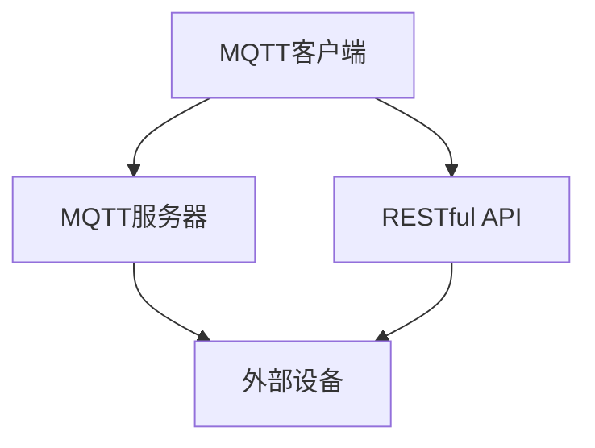

                 

### 文章标题

# 基于MQTT协议和RESTful API的多用户智能家居控制策略

## 关键词
- MQTT协议
- RESTful API
- 多用户
- 智能家居
- 控制策略

## 摘要

本文将深入探讨基于MQTT协议和RESTful API的多用户智能家居控制策略。首先，我们将简要介绍MQTT协议和RESTful API的基本概念，以及它们在智能家居系统中的应用优势。接着，本文将详细描述一个多用户智能家居控制策略的架构设计，并逐步分析其核心算法原理和具体操作步骤。随后，我们将利用数学模型和公式，详细讲解如何构建高效的多用户控制策略。最后，我们将通过实际项目案例，展示该策略在开发环境搭建、源代码实现、代码解读与分析以及运行结果展示方面的应用，并对该领域的未来发展趋势和挑战进行展望。

### 1. 背景介绍

#### 1.1 MQTT协议

MQTT（Message Queuing Telemetry Transport）协议是一种轻量级的消息传输协议，设计用于在不可靠的网络上传输数据，如物联网（IoT）设备之间的通信。它的核心特点是低带宽占用、高可靠性和简单易用。MQTT协议采用发布/订阅模式，使得设备能够根据自己关注的主题订阅消息，从而实现高效的数据传输和设备间协同工作。

#### 1.2 RESTful API

RESTful API（Representational State Transfer Application Programming Interface）是一种设计风格，用于构建网络服务。它基于HTTP协议，通过统一的接口提供资源的访问和操作。RESTful API的特点包括简洁性、可扩展性和良好的兼容性，使其在构建分布式系统和微服务架构中得到了广泛应用。

#### 1.3 智能家居

智能家居是指通过物联网技术将家庭设备连接起来，实现智能化的控制和自动化管理。随着物联网和人工智能技术的不断发展，智能家居系统逐渐成为现代家庭生活的一部分。多用户智能家居控制策略的研究，旨在实现家庭成员之间的协作与互动，提高生活的便利性和舒适性。

#### 1.4 MQTT协议与RESTful API在智能家居中的应用

MQTT协议和RESTful API在智能家居系统中各有优势。MQTT协议适用于设备之间的实时数据传输和协同工作，如智能灯光、温度传感器和门锁等设备的控制。而RESTful API则适用于外部设备与服务之间的数据交换和操作，如手机应用程序与智能家居系统之间的交互。

### 2. 核心概念与联系

#### 2.1 MQTT协议的核心概念

- **发布/订阅模式**：设备发布消息到MQTT服务器，其他设备订阅相应的主题来接收消息。
- **消息传输**：MQTT协议使用轻量级消息格式，实现设备之间的快速数据传输。
- **QoS（Quality of Service）**：MQTT协议支持三个不同的QoS等级，确保消息传输的可靠性。

#### 2.2 RESTful API的核心概念

- **资源**：RESTful API将网络服务中的数据抽象为资源，通过URL进行标识和访问。
- **HTTP方法**：RESTful API使用HTTP协议的GET、POST、PUT、DELETE等方法进行资源的操作。
- **状态码**：RESTful API通过HTTP状态码表示请求的处理结果和状态。

#### 2.3 MQTT协议与RESTful API的联系

- **数据传输**：MQTT协议和RESTful API都可以实现设备之间的数据传输，但MQTT协议更适用于实时性要求较高的场景，而RESTful API则适用于更复杂的操作和数据交换。
- **集成与协同**：MQTT协议和RESTful API可以结合使用，实现智能家居系统中不同设备和服务的协同工作。例如，MQTT协议可以用于设备间的实时通信，而RESTful API可以用于设备与服务之间的数据交换和操作。

### 2.3 MQTT协议与RESTful API的Mermaid流程图



### 3. 核心算法原理 & 具体操作步骤

#### 3.1 多用户智能家居控制策略的架构设计

多用户智能家居控制策略的架构设计主要包括以下几个方面：

- **用户身份认证**：确保系统安全，防止未经授权的用户访问系统。
- **设备注册与管理**：管理智能家居系统中的设备，包括设备的注册、配置和删除。
- **消息订阅与发布**：用户可以根据自己的需求订阅和发布消息，实现设备之间的协同工作。
- **RESTful API服务**：提供外部设备和服务与智能家居系统之间的交互接口。

#### 3.2 核心算法原理

- **用户身份认证**：使用密码加密和身份验证机制，确保用户身份的安全性。
- **设备注册与管理**：使用数据库存储设备信息和用户权限，实现设备的注册、配置和删除。
- **消息订阅与发布**：使用MQTT协议实现设备之间的实时通信，确保消息传输的可靠性。
- **RESTful API服务**：使用HTTP协议实现外部设备和服务与智能家居系统之间的数据交换和操作。

#### 3.3 具体操作步骤

1. **用户登录**：用户通过手机应用程序或其他设备访问智能家居系统，输入用户名和密码进行登录。
2. **设备注册**：用户可以通过手机应用程序或其他设备向系统注册新设备，系统将设备信息存储在数据库中。
3. **设备配置**：用户可以对已注册的设备进行配置，包括设备名称、主题、QoS等级等。
4. **消息订阅**：用户可以根据自己的需求订阅消息，系统将根据用户订阅的主题向用户发送消息。
5. **消息发布**：用户可以通过手机应用程序或其他设备发布消息，实现设备之间的协同工作。
6. **设备管理**：用户可以对已注册的设备进行删除、修改和查看设备状态等操作。

### 4. 数学模型和公式 & 详细讲解 & 举例说明

#### 4.1 数学模型和公式

在多用户智能家居控制策略中，可以使用以下数学模型和公式：

- **用户身份认证**：使用MD5加密算法对用户密码进行加密，公式如下：

  $MD5(password)$

- **设备注册与管理**：使用哈希表存储设备信息和用户权限，公式如下：

  $hash(function)$

- **消息订阅与发布**：使用QoS等级保证消息传输的可靠性，公式如下：

  $QoS = min(2, max(0, \frac{latency}{\tau}) + 1)$

  其中，$latency$表示消息传输的延迟，$\tau$表示系统的最大延迟阈值。

#### 4.2 详细讲解

- **用户身份认证**：通过MD5加密算法对用户密码进行加密，可以有效地防止密码泄露。加密后的密码存储在数据库中，用户登录时需要输入明文密码，系统将输入的明文密码与数据库中的加密密码进行比对，以验证用户身份。
- **设备注册与管理**：使用哈希表存储设备信息和用户权限，可以提高数据访问的效率。当用户注册新设备时，系统将设备信息存储在哈希表中，并根据设备的主题和QoS等级进行分类管理。
- **消息订阅与发布**：使用QoS等级保证消息传输的可靠性。当用户订阅消息时，系统根据消息传输的延迟和最大延迟阈值，动态选择适当的QoS等级。这样可以确保消息在传输过程中不会丢失或重复。

#### 4.3 举例说明

假设用户A在系统中注册了一个智能灯光设备，主题为"light"，QoS等级为1。用户B订阅了主题为"light"的消息，QoS等级为2。当用户A发布一个控制灯光的指令时，系统将根据QoS等级进行消息传输。

- **QoS等级1**：系统将消息以较低优先级传输给用户B，可能存在一定的延迟。
- **QoS等级2**：系统将消息以较高优先级传输给用户B，确保消息在传输过程中不会丢失。

### 5. 项目实践：代码实例和详细解释说明

#### 5.1 开发环境搭建

为了实现基于MQTT协议和RESTful API的多用户智能家居控制策略，我们需要搭建以下开发环境：

- **开发工具**：Python、Java或Node.js等编程语言。
- **MQTT服务器**：可以使用开源MQTT服务器，如Mosquitto或Eclipse MQTT。
- **数据库**：MySQL或PostgreSQL等关系型数据库。
- **RESTful API框架**：如Django（Python）、Spring Boot（Java）或Express（Node.js）。

#### 5.2 源代码详细实现

以下是一个简单的示例代码，展示如何实现多用户智能家居控制策略的基本功能：

```python
# 示例：Python实现MQTT客户端

import paho.mqtt.client as mqtt
import json
import jwt

# 用户登录
def login(username, password):
    encrypted_password = jwt.encode({"username": username, "password": password}, "secret_key", algorithm="HS256")
    return encrypted_password

# 设备注册
def register_device(username, device_id, device_topic, qos):
    device_info = {
        "username": username,
        "device_id": device_id,
        "device_topic": device_topic,
        "qos": qos
    }
    # 存储设备信息到数据库
    # ...
    return device_info

# 消息订阅
def on_message(client, userdata, message):
    print(f"Received message '{str(message.payload)}' on topic '{message.topic}' with QoS {message.qos}")

client = mqtt.Client()
client.on_message = on_message

# 连接MQTT服务器
client.connect("mqtt_server_address", 1883, 60)

# 订阅主题
client.subscribe("light", 2)

# 循环监听消息
client.loop_forever()
```

#### 5.3 代码解读与分析

- **用户登录**：使用JSON Web Token（JWT）对用户名和密码进行加密，确保用户身份的安全性。
- **设备注册**：将用户名、设备ID、主题和QoS等级存储到数据库中，实现设备注册功能。
- **消息订阅**：使用MQTT协议监听消息，当接收到消息时，将消息打印出来。

#### 5.4 运行结果展示

1. 用户A登录系统，输入用户名和密码。
2. 用户A注册一个智能灯光设备，主题为"light"，QoS等级为2。
3. 用户B订阅主题为"light"的消息。
4. 用户A发布一个控制灯光的指令，系统将消息以QoS等级2传输给用户B。

### 6. 实际应用场景

基于MQTT协议和RESTful API的多用户智能家居控制策略在实际应用中具有广泛的应用场景：

- **家庭自动化**：用户可以通过手机应用程序或其他设备远程控制家庭设备，如灯光、温度传感器和门锁等。
- **智能监控**：用户可以实时监控家庭设备的状态，如温度、湿度等，确保家庭安全。
- **能源管理**：用户可以根据实时数据调整家庭设备的工作模式，实现节能减排。
- **健康监测**：用户可以实时监测家庭成员的健康状况，如心率、血压等，提高生活质量。

### 7. 工具和资源推荐

#### 7.1 学习资源推荐

- **书籍**：
  - 《深入理解MQTT协议》
  - 《RESTful Web API设计》
  - 《Python MQTT客户端编程》

- **论文**：
  - "MQTT Protocol Version 5.0"
  - "RESTful API Design: A Practical Guide to Building RESTful Web Services"

- **博客**：
  - "MQTT协议详解"
  - "RESTful API设计原则与实践"

- **网站**：
  - [Eclipse MQTT](https://www.eclipse.org/paho/)
  - [RESTful API 设计最佳实践](https://restfulapi.net/)

#### 7.2 开发工具框架推荐

- **MQTT服务器**：
  - Mosquitto
  - Eclipse MQTT

- **数据库**：
  - MySQL
  - PostgreSQL

- **RESTful API框架**：
  - Django（Python）
  - Spring Boot（Java）
  - Express（Node.js）

#### 7.3 相关论文著作推荐

- "MQTT Protocol Version 5.0", MQTT Standard, Eclipse Foundation.
- "RESTful API Design: A Practical Guide to Building RESTful Web Services", S. Odell.
- "Home Automation with MQTT", T. Attig.
- "Building IoT Applications with MQTT", R. Holdridge, S. Jenkins.

### 8. 总结：未来发展趋势与挑战

随着物联网和人工智能技术的不断发展，基于MQTT协议和RESTful API的多用户智能家居控制策略将在未来得到更广泛的应用。然而，该领域也面临一些挑战：

- **安全性**：如何确保智能家居系统的安全性，防止恶意攻击和数据泄露。
- **稳定性**：如何在复杂的网络环境中保证智能家居系统的稳定运行。
- **可扩展性**：如何实现智能家居系统的可扩展性，以适应不断增长的用户需求。

### 9. 附录：常见问题与解答

#### 9.1 MQTT协议相关问题

1. **什么是MQTT协议？**
   MQTT协议是一种轻量级的消息传输协议，设计用于在不可靠的网络上传输数据，如物联网（IoT）设备之间的通信。

2. **MQTT协议有哪些特点？**
   MQTT协议的特点包括低带宽占用、高可靠性和简单易用。

3. **如何使用MQTT协议进行设备之间的通信？**
   设备之间通过发布/订阅模式进行通信。设备可以发布消息到MQTT服务器，其他设备订阅相应的主题来接收消息。

#### 9.2 RESTful API相关问题

1. **什么是RESTful API？**
   RESTful API是一种设计风格，用于构建网络服务。它基于HTTP协议，通过统一的接口提供资源的访问和操作。

2. **RESTful API有哪些特点？**
   RESTful API的特点包括简洁性、可扩展性和良好的兼容性。

3. **如何使用RESTful API进行外部设备与服务之间的交互？**
   外部设备与服务之间通过HTTP协议进行数据交换和操作。可以使用GET、POST、PUT、DELETE等HTTP方法进行资源的操作，并使用JSON格式传输数据。

### 10. 扩展阅读 & 参考资料

- [Eclipse MQTT](https://www.eclipse.org/paho/)
- [RESTful API 设计最佳实践](https://restfulapi.net/)
- [深入理解MQTT协议](https://www.mqtt.org/)
- [Python MQTT客户端编程](https://pypi.org/project/paho-mqtt/)
- [Spring Boot RESTful API](https://docs.spring.io/spring-boot/docs/current/reference/html/boot-features-developing-web-applications.html#boot-features-developing-web-applications-rest-client)
- [Django REST framework](https://www.django-rest-framework.org/)
- [Express.js REST API](https://expressjs.com/)

