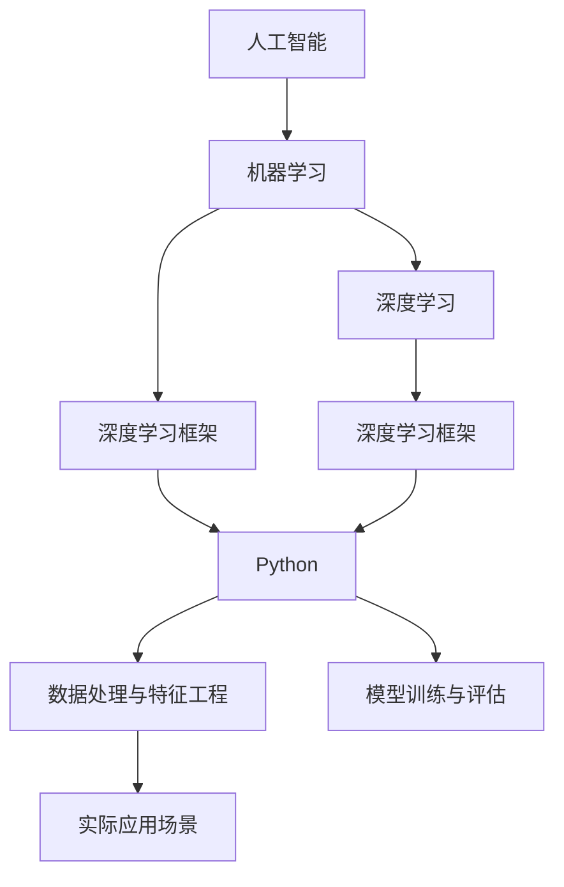

                 

# 零基础快速掌握AI开发

> 关键词：人工智能,机器学习,深度学习,深度学习框架,Python,数据处理,模型训练,实际应用

## 1. 背景介绍

### 1.1 问题由来

人工智能(AI)技术的迅猛发展，使得AI在各行各业的应用成为可能。然而，对于零基础的入门者来说，学习AI技术的门槛似乎很高，不知道从何下手。其实，只要掌握正确的学习路径和方法，即使没有计算机科学或数学背景，也能快速掌握AI开发的基本技能。本文将系统介绍如何零基础快速掌握AI开发，帮助读者轻松上手，迈向AI技术的殿堂。

### 1.2 问题核心关键点

本文将从以下几个关键点切入，帮助读者迅速掌握AI开发：

- 理解AI的基本概念和应用场景
- 选择合适的AI开发工具和框架
- 掌握数据处理和特征工程的基本技巧
- 学习常见的机器学习算法和深度学习框架
- 实践动手操作，巩固所学知识
- 了解AI在实际应用中的场景和案例

## 2. 核心概念与联系

### 2.1 核心概念概述

为更好地理解AI开发的基础知识，本节将介绍几个核心概念：

- 人工智能(AI)：使计算机系统能够模拟人的智能行为，包括学习、推理、感知等。
- 机器学习(ML)：通过数据和算法让机器自动学习规律，无需明确的编程指令。
- 深度学习(Deep Learning, DL)：使用多层神经网络进行复杂模式识别和决策的任务。
- 深度学习框架：如TensorFlow、PyTorch等，提供高效的计算图和自动微分机制。
- Python编程语言：广泛用于数据科学和机器学习，易于学习和使用。
- 数据处理与特征工程：数据清洗、预处理、特征提取等技巧。
- 模型训练与评估：选择合适的算法和超参数，使用数据集训练和评估模型。
- 实际应用场景：图像识别、自然语言处理、推荐系统等。

这些核心概念之间的逻辑关系可以通过以下Mermaid流程图来展示：



这个流程图展示了几大核心概念及其之间的关系：

1. 人工智能是目标，机器学习和深度学习是手段。
2. 深度学习框架是实现深度学习任务的底层技术。
3. Python是实现这些技术的主要编程语言。
4. 数据处理与特征工程是模型训练的前提。
5. 模型训练与评估是实现人工智能任务的核心步骤。
6. 实际应用场景是AI技术的最终目标。

理解这些核心概念及其相互关系，是掌握AI开发的基础。

## 3. 核心算法原理 & 具体操作步骤
### 3.1 算法原理概述

AI开发的核心是模型训练和评估。模型训练是指使用数据集训练模型，使其能够进行特定任务。评估则是检验模型在未见过的数据上表现如何。以下是一些常见的模型训练与评估算法：

- 监督学习：通过已标注的数据集训练模型，预测新数据。
- 无监督学习：通过未标注的数据集训练模型，发现数据的内部结构。
- 强化学习：通过与环境交互，学习最优策略以最大化奖励。
- 神经网络：使用多层非线性神经元，构建复杂的模式识别模型。
- 卷积神经网络(CNN)：用于图像处理和计算机视觉任务。
- 循环神经网络(RNN)：用于序列数据处理，如文本生成和语音识别。
- 深度信念网络(DBN)：用于概率图模型和特征学习。
- 深度自编码器(Deep Autoencoder)：用于特征降维和数据生成。

### 3.2 算法步骤详解

AI开发通常包括以下关键步骤：

**Step 1: 数据准备与预处理**

1. 收集数据：根据应用场景，从公开数据集、互联网爬虫等渠道获取数据。
2. 数据清洗：处理缺失值、异常值、重复数据等。
3. 数据增强：如旋转、缩放、噪声注入等，丰富训练集的多样性。
4. 特征工程：提取、变换、选择特征，如将图像转换为像素值向量，将文本转换为词嵌入向量。

**Step 2: 模型选择与构建**

1. 选择合适的模型：如线性回归、逻辑回归、决策树、SVM、CNN、RNN等。
2. 配置超参数：如学习率、批量大小、迭代次数等。
3. 搭建模型：使用深度学习框架实现模型结构，如定义神经网络层、损失函数、优化器等。

**Step 3: 训练与优化**

1. 训练模型：使用训练集数据，反复迭代更新模型参数。
2. 验证模型：使用验证集数据评估模型性能，防止过拟合。
3. 调整超参数：根据验证集性能，调整学习率、批量大小等参数。
4. 模型融合：集成多个模型，提升性能。

**Step 4: 评估与测试**

1. 评估模型：使用测试集数据评估模型性能，如准确率、召回率、F1值等。
2. 输出结果：将模型应用到实际问题中，输出预测结果。

### 3.3 算法优缺点

AI开发的算法具有以下优点：

1. 能够处理复杂的数据和任务，具有强大的表达能力。
2. 自动学习和优化，减少人工干预。
3. 在许多领域取得优异成果，如图像识别、自然语言处理、语音识别等。

同时，这些算法也存在一些缺点：

1. 对数据质量要求高，数据获取和处理成本较高。
2. 需要大量计算资源，训练时间长。
3. 模型复杂，难以解释和调试。
4. 对新数据泛化能力有限，需要持续监控和更新。

尽管存在这些局限，但AI开发算法已经在许多领域取得了巨大成功，显示出其强大的潜力和应用前景。

### 3.4 算法应用领域

AI开发在众多领域都有广泛的应用：

- 计算机视觉：如图像分类、目标检测、人脸识别等。
- 自然语言处理：如机器翻译、情感分析、问答系统等。
- 语音识别与生成：如语音识别、语音合成等。
- 推荐系统：如电商推荐、音乐推荐等。
- 医疗诊断：如影像诊断、病历分析等。
- 金融预测：如股票预测、信用评估等。

## 4. 数学模型和公式 & 详细讲解 & 举例说明

### 4.1 数学模型构建

本节将使用数学语言对AI开发中常见的模型进行详细描述。

假设我们有一个线性回归模型，用于预测房价。模型表示为：

$$
y = w_0 + w_1 x_1 + w_2 x_2 + \cdots + w_n x_n
$$

其中 $y$ 表示预测房价，$x_1, x_2, \cdots, x_n$ 表示输入特征，$w_0, w_1, w_2, \cdots, w_n$ 表示模型参数。我们的目标是找到最优的参数 $w$，使得模型能够最小化预测误差。

### 4.2 公式推导过程

最小化预测误差可以通过求解损失函数来实现。常用的损失函数包括均方误差(MSE)和交叉熵(CE)。

对于线性回归模型，MSE损失函数表示为：

$$
L(w) = \frac{1}{2N}\sum_{i=1}^N (y_i - w^T x_i)^2
$$

其中 $N$ 表示样本数量，$y_i$ 表示第 $i$ 个样本的标签值，$x_i$ 表示第 $i$ 个样本的特征向量。

对于二分类问题，CE损失函数表示为：

$$
L(w) = -\frac{1}{N}\sum_{i=1}^N [y_i \log(\sigma(w^T x_i)) + (1-y_i) \log(1-\sigma(w^T x_i))]
$$

其中 $\sigma$ 表示sigmoid函数，$y_i \in \{0,1\}$ 表示样本的真实标签。

### 4.3 案例分析与讲解

以房价预测为例，我们如何使用线性回归模型进行预测。

假设我们有一组训练集数据，每条数据包含 $n$ 个特征 $x_i$ 和一个标签 $y_i$。我们的目标是通过训练数据找到最优的模型参数 $w$，使得预测误差最小。

1. 数据准备：收集训练数据，将标签和特征存储在变量中。

2. 特征工程：将特征转化为模型能够处理的向量形式。

3. 模型构建：定义线性回归模型，设置损失函数为MSE。

4. 训练模型：使用梯度下降算法，反复迭代更新模型参数 $w$，最小化预测误差。

5. 评估模型：使用测试集数据评估模型性能，计算MSE损失。

6. 输出结果：将模型应用于新数据，进行房价预测。

## 5. 项目实践：代码实例和详细解释说明

### 5.1 开发环境搭建

在进行AI开发实践前，我们需要准备好开发环境。以下是使用Python进行TensorFlow开发的环境配置流程：

1. 安装Anaconda：从官网下载并安装Anaconda，用于创建独立的Python环境。

2. 创建并激活虚拟环境：
```bash
conda create -n tensorflow-env python=3.8 
conda activate tensorflow-env
```

3. 安装TensorFlow：根据CUDA版本，从官网获取对应的安装命令。例如：
```bash
conda install tensorflow -c tensorflow -c conda-forge
```

4. 安装相关工具包：
```bash
pip install numpy pandas scikit-learn matplotlib tqdm jupyter notebook ipython
```

完成上述步骤后，即可在`tensorflow-env`环境中开始AI开发实践。

### 5.2 源代码详细实现

这里我们以房价预测为例，给出使用TensorFlow进行线性回归模型训练的PyTorch代码实现。

首先，定义训练集和测试集数据：

```python
import numpy as np
from sklearn.datasets import load_boston

boston = load_boston()
X_train = boston.data
y_train = boston.target
X_test = boston.data
y_test = boston.target
```

然后，定义模型和优化器：

```python
import tensorflow as tf
from tensorflow import keras

model = keras.Sequential([
    keras.layers.Dense(units=1, input_shape=[X_train.shape[1]])
])

optimizer = keras.optimizers.SGD(learning_rate=0.01)

model.compile(optimizer=optimizer, loss='mean_squared_error')
```

接着，定义训练和评估函数：

```python
def train_epoch(model, dataset, batch_size, optimizer):
    for batch in dataset:
        features, labels = batch
        with tf.GradientTape() as tape:
            predictions = model(features)
            loss = keras.losses.mean_squared_error(labels, predictions)
        gradients = tape.gradient(loss, model.trainable_weights)
        optimizer.apply_gradients(zip(gradients, model.trainable_weights))

def evaluate(model, dataset, batch_size):
    total_loss = 0
    for batch in dataset:
        features, labels = batch
        predictions = model(features)
        loss = keras.losses.mean_squared_error(labels, predictions)
        total_loss += loss
    return total_loss / len(dataset)
```

最后，启动训练流程并在测试集上评估：

```python
epochs = 100

for epoch in range(epochs):
    train_epoch(model, X_train, y_train, optimizer)
    test_loss = evaluate(model, X_test, y_test)
    print(f"Epoch {epoch+1}, test loss: {test_loss:.4f}")
```

以上就是使用TensorFlow进行房价预测的完整代码实现。可以看到，得益于TensorFlow的强大封装，我们可以用相对简洁的代码完成模型训练。

### 5.3 代码解读与分析

让我们再详细解读一下关键代码的实现细节：

**数据准备**

1. 导入必要的库和数据集，使用sklearn的load_boston方法加载波士顿房价数据集。
2. 将数据集的特征和标签分别存储在X_train、y_train、X_test、y_test变量中。

**模型构建**

1. 定义一个Sequential模型，添加一个全连接层，输入维度为特征数，输出维度为1。
2. 定义优化器为随机梯度下降，学习率为0.01。
3. 编译模型，设置损失函数为均方误差。

**训练和评估**

1. 定义训练函数，循环迭代每个批次的数据，计算损失梯度，更新模型参数。
2. 定义评估函数，循环迭代每个批次的数据，计算均方误差，并累加总损失。
3. 在每个epoch结束后，输出测试集上的均方误差。

**训练流程**

1. 定义总的epoch数，开始循环迭代
2. 在每个epoch内，在训练集上训练，输出测试集上的均方误差
3. 所有epoch结束后，输出最终测试结果

可以看到，TensorFlow提供了简单易用的API，使得AI开发变得更加高效便捷。开发者可以将更多精力放在数据处理、模型改进等高层逻辑上，而不必过多关注底层的实现细节。

当然，工业级的系统实现还需考虑更多因素，如模型的保存和部署、超参数的自动搜索、更灵活的模型适配层等。但核心的模型训练流程基本与此类似。

## 6. 实际应用场景

### 6.1 智能推荐系统

基于深度学习的大规模推荐系统已经成为电商、社交媒体等应用中的标配。推荐系统通过学习用户的兴趣和行为，推荐相关商品或内容，提升用户体验和转化率。

在技术实现上，可以收集用户的历史行为数据，将商品或内容特征和用户行为数据作为监督数据，在深度神经网络上进行微调。微调后的模型能够学习到用户对商品或内容的偏好，从而推荐更符合用户兴趣的商品或内容。同时，可以引入多模态数据，如用户评论、社交网络信息等，提升推荐系统的综合性能。

### 6.2 自动驾驶

自动驾驶技术是AI在实际应用中取得重大突破的典型代表。通过计算机视觉、深度学习等技术，自动驾驶系统能够自动识别交通标志、行人、车辆等，进行路径规划和决策，实现无人驾驶。

在自动驾驶系统中，计算机视觉技术能够对传感器数据进行处理和分析，识别道路、交通标志、行人等关键信息。深度神经网络能够对这些信息进行处理和融合，生成驾驶决策。通过大规模数据集进行预训练和微调，自动驾驶系统能够不断优化，提升驾驶安全性和效率。

### 6.3 医疗诊断

医疗领域对AI的需求日益增长。AI能够辅助医生进行疾病诊断、治疗方案制定等，提高医疗效率和质量。

在医疗诊断中，AI可以通过图像识别、文本分析等技术，辅助医生进行疾病诊断。例如，AI可以对医学影像进行分割、特征提取和分类，帮助医生识别肿瘤、病变等。同时，AI可以分析患者的病历记录、检查报告等文本数据，提供个性化的治疗方案。

### 6.4 未来应用展望

随着AI技术的不断发展，未来将有更多行业和领域被AI技术所改变。

- 在医疗领域，AI将通过辅助诊断、个性化治疗等方式，提升医疗服务的质量和效率。
- 在金融领域，AI将通过风险预测、欺诈检测等方式，提升金融系统的稳定性和安全性。
- 在教育领域，AI将通过智能评估、个性化推荐等方式，提升教育资源的使用效率。
- 在农业领域，AI将通过精准农业、智能监测等方式，提升农业生产效率和资源利用率。

## 7. 工具和资源推荐

### 7.1 学习资源推荐

为了帮助开发者系统掌握AI开发的技术基础和应用技巧，这里推荐一些优质的学习资源：

1. Coursera《深度学习》课程：斯坦福大学开设的深度学习经典课程，涵盖深度学习的基本概念和算法，适合零基础学习。

2. Udacity《深度学习基础》课程：针对深度学习的入门课程，讲解深度学习的原理和实践，有动手操作的实践环节。

3. Kaggle：全球最大的数据科学竞赛平台，提供丰富的数据集和竞赛题目，帮助开发者实践和提升技能。

4. Google AI教育资源：Google提供的一系列AI教育资源，包括课程、教程、代码示例等，覆盖AI的各个领域。

5. TensorFlow官方文档：TensorFlow的官方文档，提供了详细的API说明和代码示例，适合快速上手。

通过对这些资源的学习实践，相信你一定能够快速掌握AI开发的核心技术，并应用于解决实际问题。

### 7.2 开发工具推荐

高效的开发离不开优秀的工具支持。以下是几款用于AI开发常用的工具：

1. TensorFlow：由Google主导开发的深度学习框架，提供丰富的计算图和自动微分机制，适合大规模工程应用。

2. PyTorch：由Facebook开发的深度学习框架，灵活易用，适合研究和原型开发。

3. Jupyter Notebook：开源的交互式笔记本，支持Python、R等多种语言，方便数据处理和模型训练。

4. Weights & Biases：模型训练的实验跟踪工具，记录和可视化模型训练过程中的各项指标，方便调试和优化。

5. TensorBoard：TensorFlow配套的可视化工具，可实时监测模型训练状态，并提供丰富的图表呈现方式。

6. Google Colab：谷歌提供的在线Jupyter Notebook环境，免费提供GPU/TPU算力，方便快速实验。

合理利用这些工具，可以显著提升AI开发的效率，加快创新迭代的步伐。

### 7.3 相关论文推荐

AI开发的研究领域十分广泛，以下是几篇奠基性的相关论文，推荐阅读：

1. LeCun et al.《A Tutorial on Energy-Based Learning》：介绍了能量基学习的基本原理和应用。

2. Hinton et al.《A Practical Guide to Training Restricted Boltzmann Machines》：讲解了限制玻尔兹曼机(RBM)的训练方法和应用。

3. Bengio et al.《A Course on Machine Learning for Speech and Language Processing》：介绍了机器学习和深度学习在语音和语言处理中的应用。

4. Goodfellow et al.《Generative Adversarial Nets》：介绍了生成对抗网络(GAN)的基本原理和应用。

5. Kingma et al.《Adam: A Method for Stochastic Optimization》：介绍了Adam优化算法的基本原理和应用。

这些论文代表了大规模机器学习和深度学习的发展脉络。通过学习这些前沿成果，可以帮助研究者把握学科前进方向，激发更多的创新灵感。

## 8. 总结：未来发展趋势与挑战

### 8.1 总结

本文对AI开发的基本概念和实现过程进行了全面系统的介绍。首先阐述了AI开发的目标、方法和应用场景，明确了数据准备、模型构建、训练评估等关键步骤。其次，从原理到实践，详细讲解了AI开发中常见的算法和框架，给出了完整的代码实例。同时，本文还广泛探讨了AI开发在推荐系统、自动驾驶、医疗诊断等诸多领域的实际应用，展示了AI技术的强大潜力。最后，本文精选了AI开发的学习资源、开发工具和相关论文，力求为读者提供全方位的技术指引。

通过本文的系统梳理，可以看到，AI开发需要掌握基本的数学和编程技能，理解算法和模型原理，学会数据处理和模型训练。只有不断实践和优化，才能在AI领域取得进步。

### 8.2 未来发展趋势

展望未来，AI开发将呈现以下几个发展趋势：

1. 数据的重要性将更加凸显。随着数据量的不断增长，大数据技术将发挥更加重要的作用，帮助AI系统更好地学习规律和模式。

2. 深度学习将不断演进。新的深度学习算法和模型结构将不断涌现，推动AI技术在各个领域的应用。

3. 跨领域融合将更加广泛。AI技术将与物联网、区块链、5G等新兴技术结合，形成更加强大的应用场景。

4. 自动化和智能化将更加普及。自动机器学习和自动化AI开发技术将逐步成熟，降低AI开发门槛。

5. 伦理和安全性将更加受到关注。AI系统的透明性、公平性和安全性将成为研究重点，确保AI技术造福人类。

以上趋势凸显了AI开发技术的广阔前景。这些方向的探索发展，必将进一步提升AI系统的性能和应用范围，为人类生产和生活带来深远影响。

### 8.3 面临的挑战

尽管AI开发技术已经取得了瞩目成就，但在迈向更加智能化、普适化应用的过程中，它仍面临着诸多挑战：

1. 数据质量问题：数据不平衡、噪声多、标签错误等，会影响AI系统的性能和可靠性。

2. 模型复杂度：大规模深度神经网络模型难以解释和调试，存在黑盒风险。

3. 计算资源需求：训练大规模模型需要大量计算资源，对硬件和网络要求较高。

4. 伦理和法律问题：AI系统的透明性、公平性和安全性问题，需要法律和伦理的规范和保障。

5. 应用场景限制：不同领域的AI应用需要针对性的优化和调整，难以一招鲜吃遍天。

尽管存在这些挑战，但随着AI技术的不断进步和普及，相信AI开发将会取得更大的成就，推动人类社会进入更加智能化的时代。

### 8.4 研究展望

面对AI开发所面临的挑战，未来的研究需要在以下几个方面寻求新的突破：

1. 强化学习和迁移学习：通过强化学习和迁移学习，提升AI系统的自适应和泛化能力。

2. 跨模态学习和多任务学习：通过跨模态学习和多任务学习，提升AI系统的综合性能。

3. 可解释性和透明性：通过可解释性和透明性研究，增强AI系统的可信度和可控性。

4. 大规模数据和计算资源：通过大规模数据和计算资源，提升AI系统的训练效率和性能。

5. 伦理和安全规范：通过伦理和安全规范研究，确保AI技术的安全和公平性。

这些研究方向将推动AI开发技术的不断进步，为构建智能、可靠、可控的AI系统铺平道路。面向未来，AI开发技术需要更多跨学科的合作和创新，共同推动人工智能技术的发展和应用。

## 9. 附录：常见问题与解答

**Q1：如何选择合适的深度学习框架？**

A: 选择合适的深度学习框架主要取决于应用场景和个人经验。TensorFlow和PyTorch是目前最流行的两个深度学习框架，TensorFlow适合大规模工程应用，PyTorch灵活易用，适合研究和原型开发。

**Q2：AI开发中如何处理缺失值和异常值？**

A: 处理缺失值和异常值的方法包括插值、删除、填补等。插值方法如均值填补、线性插值等，填补方法如KNN、均值、中位数等。删除方法如随机删除、异常值删除等。

**Q3：如何优化AI模型的计算效率？**

A: 优化计算效率的方法包括模型裁剪、量化加速、分布式训练等。模型裁剪通过去除不必要的层和参数，减小模型尺寸。量化加速通过将浮点模型转为定点模型，压缩存储空间。分布式训练通过多台设备并行训练，提高计算效率。

**Q4：AI开发中如何进行数据增强？**

A: 数据增强的方法包括旋转、缩放、平移、噪声注入等。例如，对图像数据进行随机旋转、缩放、平移，增加训练集的多样性。对文本数据进行回译、近义替换、扰动等，增加训练集的多样性。

**Q5：如何评估AI模型的性能？**

A: 评估模型性能的方法包括交叉验证、ROC曲线、AUC等。交叉验证通过将数据集分为训练集和验证集，评估模型的泛化能力。ROC曲线通过绘制真正率与假正率的关系图，评估模型的分类能力。AUC通过计算ROC曲线下的面积，评估模型的性能。

---

作者：禅与计算机程序设计艺术 / Zen and the Art of Computer Programming

