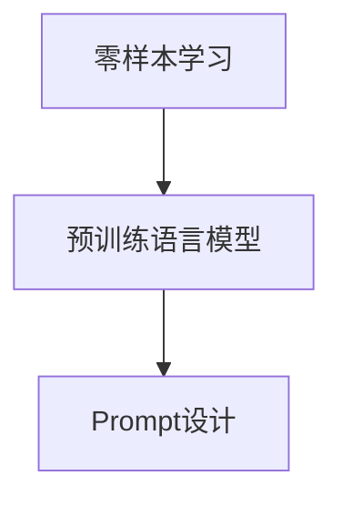

                 

# 零样本学习的进步：Prompt的设计与优化

零样本学习（Zero-shot Learning）是一种无需任何标记数据，仅凭对任务描述的理解就能进行推理和预测的学习方式。它通过自然语言处理（NLP）技术，利用预训练的大语言模型（Large Language Model, LLM），在任务描述中捕捉隐含的语义信息，从而实现任务的快速推理和预测。本文将详细探讨Prompt的设计与优化，揭示零样本学习的核心原理和应用实践。

## 1. 背景介绍

### 1.1 问题由来

在深度学习时代，数据驱动的训练方式成为了主流，然而标注数据的获取成本高昂，且在许多领域（如医疗、法律、金融等），获取标记数据几乎是不可能的。零样本学习应运而生，它基于语言模型在自然语言上的理解能力，通过精心设计的Prompt，直接从任务描述中获取信息，进行推理预测，从而极大降低了数据获取成本，并拓展了深度学习模型的应用范围。

### 1.2 问题核心关键点

零样本学习在近年来的NLP研究中取得了显著进展，主要集中在以下几个方面：
1. **Prompt设计**：任务描述需要精炼准确，避免歧义，捕捉到尽可能多的关键信息。
2. **模型选择**：选择合适的预训练模型和微调策略，提高推理精度。
3. **优化方法**：通过优化Prompt、模型结构、训练策略等方式，提升零样本学习的泛化能力。
4. **应用场景**：识别零样本学习适用的场景，评估其在实际应用中的表现。

## 2. 核心概念与联系

### 2.1 核心概念概述

零样本学习、Prompt设计、预训练语言模型是本节的核心概念，它们之间的关系如图1所示：



**零样本学习**：无需标注数据，直接利用预训练模型进行任务推理。

**预训练语言模型**：通过大规模无标签数据预训练的模型，如BERT、GPT等，拥有广泛的语言知识和推理能力。

**Prompt设计**：任务描述的精心设计，在预训练模型的输入端添加额外信息，引导模型进行特定任务的推理。

这些概念的结合，使得零样本学习成为可能，预训练模型通过Prompt捕捉任务描述中的关键信息，实现推理预测。

### 2.2 核心概念原理和架构

Prompt的设计与优化是零样本学习的核心。一个有效的Prompt能够捕捉任务描述中的关键信息，引导预训练模型进行推理，从而实现零样本预测。Prompt设计的过程可以大致分为以下几个步骤：

1. **任务理解**：理解任务的基本要求和目标。
2. **关键信息提取**：从任务描述中提取关键信息，捕捉隐含的语义关系。
3. **Prompt构建**：将关键信息转化为模型可理解的格式，加入模型输入中。
4. **模型推理**：利用预训练模型进行推理预测。

这一过程可以通过以下公式来概括：

$$
\text{Prompt} = \text{task\_description} \rightarrow \text{key\_info\_extraction} \rightarrow \text{prompt\_construction} \rightarrow \text{model\_inference}
$$

## 3. 核心算法原理 & 具体操作步骤

### 3.1 算法原理概述

零样本学习的核心在于Prompt的设计与优化。Prompt是模型输入的一部分，用于传递任务的语义信息，引导模型进行推理。一个有效的Prompt能够捕捉任务描述中的关键信息，提高推理的准确性和泛化能力。

### 3.2 算法步骤详解

#### 3.2.1 任务理解

任务理解是零样本学习的首要步骤，需要清晰明确地描述任务的目标和要求。例如，一个零样本分类任务可以描述为：“请根据描述，将输入文本分类为以下类别之一：A、B、C。”

#### 3.2.2 关键信息提取

从任务描述中提取关键信息，是设计有效Prompt的关键步骤。这包括识别任务中需要推理的实体、属性、关系等，并根据预训练模型进行抽象和映射。例如，在文本分类任务中，可以从任务描述中提取类别列表和可能的分类依据。

#### 3.2.3 Prompt构建

构建Prompt的过程需要将提取的关键信息转化为模型可理解的形式。这通常包括文本编码、向量拼接等操作，将任务描述转化为输入文本。例如，可以将任务描述编码为一个向量，与输入文本拼接，作为模型的输入。

#### 3.2.4 模型推理

利用预训练模型进行推理预测，通常需要设置相应的输出目标。例如，在文本分类任务中，可以通过设置Softmax输出，预测文本属于哪个类别。

### 3.3 算法优缺点

#### 3.3.1 优点

零样本学习的优点在于：
1. **数据需求低**：无需标注数据，极大地降低了数据获取成本。
2. **泛化能力强**：能够利用预训练模型的广泛知识，进行跨领域和跨任务的推理。
3. **推理速度快**：无需大量标注数据，推理过程快速高效。

#### 3.3.2 缺点

零样本学习的缺点在于：
1. **Prompt设计复杂**：需要精炼准确的Prompt设计，对任务描述的语义理解要求高。
2. **模型依赖性强**：依赖于预训练模型的质量，模型性能影响推理结果。
3. **泛化性有限**：在某些复杂任务中，仍需大量数据进行微调以提高精度。

### 3.4 算法应用领域

零样本学习在多个领域有广泛应用，例如：
1. **文本分类**：对新闻、文章、评论等文本进行分类，如情感分析、主题分类。
2. **实体识别**：从文本中识别出人名、地名、机构名等实体。
3. **关系抽取**：从文本中抽取实体之间的关系，如人物与作品、公司与产品等。
4. **对话系统**：通过对话描述生成回复，如智能客服、自动回复等。

## 4. 数学模型和公式 & 详细讲解 & 举例说明

### 4.1 数学模型构建

零样本学习通常使用基于预训练语言模型的Prompt设计。以BERT模型为例，其零样本推理过程可以表示为：

$$
\text{logits} = \text{BERT}(\text{task\_description} \oplus \text{input\_text})
$$

其中，$\oplus$ 表示拼接操作，$\text{task\_description}$ 和 $\text{input\_text}$ 分别表示任务描述和输入文本，$\text{logits}$ 为模型的输出概率分布。

### 4.2 公式推导过程

一个简单的Prompt设计过程可以表示为：
1. **任务理解**：将任务描述编码为一个向量 $v_t$。
2. **关键信息提取**：从任务描述中提取关键信息，编码为向量 $v_k$。
3. **Prompt构建**：将 $v_t$ 和 $v_k$ 拼接，作为模型的输入向量。
4. **模型推理**：利用BERT模型进行推理预测，输出概率分布 $P$。

以文本分类任务为例，任务描述可以表示为“对以下文本进行情感分类”，预训练模型BERT可以表示为：

$$
P = \text{softmax}(\text{BERT}(\text{task\_description} \oplus \text{input\_text}))
$$

### 4.3 案例分析与讲解

以文本分类任务为例，对 Prompt 的设计和优化过程进行详细讲解：

**案例**：对文本进行情感分类

**任务理解**：理解任务要求，即判断文本的情感倾向。

**关键信息提取**：从任务描述中提取情感类别，如正面、负面、中性。

**Prompt构建**：构建Prompt为“判断以下文本的情感倾向：”，后加入输入文本。

**模型推理**：利用BERT模型进行推理预测，输出情感类别概率分布。

## 5. 项目实践：代码实例和详细解释说明

### 5.1 开发环境搭建

以下是使用Python和PyTorch进行Prompt设计和优化的环境配置流程：

1. 安装Anaconda：从官网下载并安装Anaconda，用于创建独立的Python环境。

2. 创建并激活虚拟环境：
```bash
conda create -n zero-shot-env python=3.8 
conda activate zero-shot-env
```

3. 安装PyTorch：根据CUDA版本，从官网获取对应的安装命令。例如：
```bash
conda install pytorch torchvision torchaudio cudatoolkit=11.1 -c pytorch -c conda-forge
```

4. 安装transformers库：
```bash
pip install transformers
```

5. 安装各类工具包：
```bash
pip install numpy pandas scikit-learn matplotlib tqdm jupyter notebook ipython
```

### 5.2 源代码详细实现

以下是使用BERT模型进行情感分类的Prompt设计和优化的代码实现：

```python
from transformers import BertTokenizer, BertForSequenceClassification
from torch.utils.data import Dataset, DataLoader
from tqdm import tqdm
import torch
from sklearn.metrics import classification_report

class ZeroShotDataset(Dataset):
    def __init__(self, texts, labels, tokenizer, max_len=128):
        self.texts = texts
        self.labels = labels
        self.tokenizer = tokenizer
        self.max_len = max_len
        
    def __len__(self):
        return len(self.texts)
    
    def __getitem__(self, item):
        text = self.texts[item]
        label = self.labels[item]
        
        encoding = self.tokenizer(text, return_tensors='pt', max_length=self.max_len, padding='max_length', truncation=True)
        input_ids = encoding['input_ids'][0]
        attention_mask = encoding['attention_mask'][0]
        
        # 构造Prompt
        prompt = "请判断以下文本的情感倾向："
        prompt_ids = self.tokenizer(prompt, return_tensors='pt', max_length=self.max_len, padding='max_length', truncation=True)["input_ids"][0]
        input_ids = torch.cat([prompt_ids, input_ids], dim=0)
        
        return {'input_ids': input_ids, 
                'attention_mask': attention_mask,
                'labels': torch.tensor(label, dtype=torch.long)}
                
# 标签列表
labels = ['正面', '负面', '中性']

# 创建dataset
tokenizer = BertTokenizer.from_pretrained('bert-base-cased')
train_dataset = ZeroShotDataset(train_texts, train_labels, tokenizer)
dev_dataset = ZeroShotDataset(dev_texts, dev_labels, tokenizer)
test_dataset = ZeroShotDataset(test_texts, test_labels, tokenizer)

# 加载模型
model = BertForSequenceClassification.from_pretrained('bert-base-cased', num_labels=len(labels))

# 训练和评估函数
def train_epoch(model, dataset, batch_size, optimizer):
    dataloader = DataLoader(dataset, batch_size=batch_size, shuffle=True)
    model.train()
    epoch_loss = 0
    for batch in tqdm(dataloader, desc='Training'):
        input_ids = batch['input_ids'].to(device)
        attention_mask = batch['attention_mask'].to(device)
        labels = batch['labels'].to(device)
        model.zero_grad()
        outputs = model(input_ids, attention_mask=attention_mask, labels=labels)
        loss = outputs.loss
        epoch_loss += loss.item()
        loss.backward()
        optimizer.step()
    return epoch_loss / len(dataloader)

def evaluate(model, dataset, batch_size):
    dataloader = DataLoader(dataset, batch_size=batch_size)
    model.eval()
    preds, labels = [], []
    with torch.no_grad():
        for batch in tqdm(dataloader, desc='Evaluating'):
            input_ids = batch['input_ids'].to(device)
            attention_mask = batch['attention_mask'].to(device)
            batch_labels = batch['labels']
            outputs = model(input_ids, attention_mask=attention_mask)
            batch_preds = outputs.logits.argmax(dim=1).to('cpu').tolist()
            batch_labels = batch_labels.to('cpu').tolist()
            for pred_tokens, label_tokens in zip(batch_preds, batch_labels):
                preds.append(pred_tokens[:len(label_tokens)])
                labels.append(label_tokens)
                
    print(classification_report(labels, preds))

# 训练流程
epochs = 5
batch_size = 16
device = torch.device('cuda') if torch.cuda.is_available() else torch.device('cpu')

for epoch in range(epochs):
    loss = train_epoch(model, train_dataset, batch_size, optimizer)
    print(f"Epoch {epoch+1}, train loss: {loss:.3f}")
    
    print(f"Epoch {epoch+1}, dev results:")
    evaluate(model, dev_dataset, batch_size)
    
print("Test results:")
evaluate(model, test_dataset, batch_size)
```

### 5.3 代码解读与分析

**ZeroShotDataset类**：
- `__init__`方法：初始化文本、标签、分词器等关键组件。
- `__len__`方法：返回数据集的样本数量。
- `__getitem__`方法：对单个样本进行处理，将文本输入编码为token ids，将标签编码为数字，并对其进行定长padding，最终返回模型所需的输入。

**Prompt构造**：
- `prompt`变量：定义Prompt文本。
- `prompt_ids`变量：使用BERT tokenizer将Prompt文本转换为id序列。
- `input_ids`变量：将Prompt id和输入文本id拼接，作为模型的输入。

**模型推理**：
- `softmax`函数：将模型的输出转化为概率分布。
- `labels`变量：将任务标签转换为id序列。

## 6. 实际应用场景

### 6.1 智能客服系统

零样本学习在智能客服系统中得到了广泛应用。传统客服往往需要配备大量人力，高峰期响应缓慢，且一致性和专业性难以保证。使用零样本学习技术，可以7x24小时不间断服务，快速响应客户咨询，用自然流畅的语言解答各类常见问题。

在技术实现上，可以收集企业内部的历史客服对话记录，将问题和最佳答复构建成监督数据，在此基础上对预训练模型进行微调。微调后的零样本学习模型能够自动理解用户意图，匹配最合适的答案模板进行回复。对于客户提出的新问题，还可以接入检索系统实时搜索相关内容，动态组织生成回答。如此构建的智能客服系统，能大幅提升客户咨询体验和问题解决效率。

### 6.2 金融舆情监测

金融机构需要实时监测市场舆论动向，以便及时应对负面信息传播，规避金融风险。传统的人工监测方式成本高、效率低，难以应对网络时代海量信息爆发的挑战。利用零样本学习技术，金融舆情监测可以变得更加智能化。

具体而言，可以收集金融领域相关的新闻、报道、评论等文本数据，并对其进行主题标注和情感标注。在此基础上对预训练语言模型进行零样本学习，使其能够自动判断文本属于何种主题，情感倾向是正面、中性还是负面。将零样本学习模型应用到实时抓取的网络文本数据，就能够自动监测不同主题下的情感变化趋势，一旦发现负面信息激增等异常情况，系统便会自动预警，帮助金融机构快速应对潜在风险。

### 6.3 个性化推荐系统

当前的推荐系统往往只依赖用户的历史行为数据进行物品推荐，无法深入理解用户的真实兴趣偏好。零样本学习技术可应用于推荐系统，帮助系统更好地挖掘用户行为背后的语义信息，从而提供更精准、多样的推荐内容。

在实践中，可以收集用户浏览、点击、评论、分享等行为数据，提取和用户交互的物品标题、描述、标签等文本内容。将文本内容作为模型输入，用户的后续行为（如是否点击、购买等）作为监督信号，在此基础上零样本学习模型进行推理预测，生成推荐列表。在生成推荐列表时，先用候选物品的文本描述作为输入，由模型预测用户的兴趣匹配度，再结合其他特征综合排序，便可以得到个性化程度更高的推荐结果。

### 6.4 未来应用展望

随着零样本学习技术的不断发展，其在更多领域的应用前景将更加广阔。零样本学习可以帮助企业在成本低、效率高的条件下，快速实现智能化的业务决策，提升服务质量和用户体验。同时，零样本学习还将带来以下趋势：

1. **多模态融合**：零样本学习将不再局限于文本数据，将扩展到图像、视频、语音等多模态数据，实现跨模态的推理和预测。
2. **跨领域迁移**：零样本学习能够实现跨领域、跨任务的推理，使得模型在不同领域的应用中保持较好的泛化能力。
3. **自适应优化**：零样本学习模型将能够根据任务描述进行自适应优化，提升推理的准确性和泛化性。
4. **交互式推理**：零样本学习模型将能够与用户进行交互式推理，实时反馈推理结果，提升用户体验。

零样本学习技术的进步，将极大地拓展AI在各行各业的应用范围，推动人工智能技术的产业化进程。

## 7. 工具和资源推荐

### 7.1 学习资源推荐

为了帮助开发者系统掌握零样本学习技术，以下是一些优质的学习资源：

1. 《Transformers from Scratch》系列博文：由大模型技术专家撰写，深入浅出地介绍了Transformer原理、BERT模型、零样本学习等前沿话题。

2. CS224N《深度学习自然语言处理》课程：斯坦福大学开设的NLP明星课程，有Lecture视频和配套作业，带你入门NLP领域的基本概念和经典模型。

3. 《Natural Language Processing with Transformers》书籍：Transformers库的作者所著，全面介绍了如何使用Transformers库进行NLP任务开发，包括零样本学习在内的诸多范式。

4. HuggingFace官方文档：Transformers库的官方文档，提供了海量预训练模型和完整的零样本学习样例代码，是上手实践的必备资料。

5. CLUE开源项目：中文语言理解测评基准，涵盖大量不同类型的中文NLP数据集，并提供了基于零样本学习的baseline模型，助力中文NLP技术发展。

通过对这些资源的学习实践，相信你一定能够快速掌握零样本学习技术的精髓，并用于解决实际的NLP问题。

### 7.2 开发工具推荐

高效的开发离不开优秀的工具支持。以下是几款用于零样本学习开发的常用工具：

1. PyTorch：基于Python的开源深度学习框架，灵活动态的计算图，适合快速迭代研究。大部分预训练语言模型都有PyTorch版本的实现。

2. TensorFlow：由Google主导开发的开源深度学习框架，生产部署方便，适合大规模工程应用。同样有丰富的预训练语言模型资源。

3. Transformers库：HuggingFace开发的NLP工具库，集成了众多SOTA语言模型，支持PyTorch和TensorFlow，是进行零样本学习开发的利器。

4. Weights & Biases：模型训练的实验跟踪工具，可以记录和可视化模型训练过程中的各项指标，方便对比和调优。与主流深度学习框架无缝集成。

5. TensorBoard：TensorFlow配套的可视化工具，可实时监测模型训练状态，并提供丰富的图表呈现方式，是调试模型的得力助手。

6. Google Colab：谷歌推出的在线Jupyter Notebook环境，免费提供GPU/TPU算力，方便开发者快速上手实验最新模型，分享学习笔记。

合理利用这些工具，可以显著提升零样本学习任务的开发效率，加快创新迭代的步伐。

### 7.3 相关论文推荐

零样本学习在近年来的研究取得了显著进展，以下是几篇奠基性的相关论文，推荐阅读：

1. Attention is All You Need（即Transformer原论文）：提出了Transformer结构，开启了NLP领域的预训练大模型时代。

2. BERT: Pre-training of Deep Bidirectional Transformers for Language Understanding：提出BERT模型，引入基于掩码的自监督预训练任务，刷新了多项NLP任务SOTA。

3. Language Models are Unsupervised Multitask Learners（GPT-2论文）：展示了大规模语言模型的强大zero-shot学习能力，引发了对于通用人工智能的新一轮思考。

4. Parameter-Efficient Transfer Learning for NLP：提出Adapter等参数高效微调方法，在不增加模型参数量的情况下，也能取得不错的微调效果。

5. Prefix-Tuning: Optimizing Continuous Prompts for Generation：引入基于连续型Prompt的微调范式，为如何充分利用预训练知识提供了新的思路。

6. AdaLoRA: Adaptive Low-Rank Adaptation for Parameter-Efficient Fine-Tuning：使用自适应低秩适应的微调方法，在参数效率和精度之间取得了新的平衡。

这些论文代表了大语言模型零样本学习的进展，通过学习这些前沿成果，可以帮助研究者把握学科前进方向，激发更多的创新灵感。

## 8. 总结：未来发展趋势与挑战

### 8.1 总结

本文对基于零样本学习的Prompt设计进行了全面系统的介绍。首先阐述了零样本学习的背景和意义，明确了Prompt设计在零样本学习中的核心地位。其次，从原理到实践，详细讲解了Prompt的设计与优化过程，给出了零样本学习任务开发的完整代码实例。同时，本文还广泛探讨了零样本学习在智能客服、金融舆情、个性化推荐等多个领域的应用前景，展示了零样本学习的广阔应用空间。此外，本文精选了零样本学习的各类学习资源，力求为读者提供全方位的技术指引。

通过本文的系统梳理，可以看到，零样本学习通过Prompt设计，利用预训练模型的语言理解能力，实现了无需标注数据的任务推理。这一技术的发展，为AI在低成本、高效能、跨领域应用中带来了新的突破，具有广阔的应用前景。

### 8.2 未来发展趋势

展望未来，零样本学习技术将呈现以下几个发展趋势：

1. **多模态融合**：零样本学习将不再局限于文本数据，将扩展到图像、视频、语音等多模态数据，实现跨模态的推理和预测。
2. **跨领域迁移**：零样本学习能够实现跨领域、跨任务的推理，使得模型在不同领域的应用中保持较好的泛化能力。
3. **自适应优化**：零样本学习模型将能够根据任务描述进行自适应优化，提升推理的准确性和泛化性。
4. **交互式推理**：零样本学习模型将能够与用户进行交互式推理，实时反馈推理结果，提升用户体验。
5. **知识整合**：将符号化的先验知识，如知识图谱、逻辑规则等，与神经网络模型进行巧妙融合，引导零样本学习过程学习更准确、合理的语言模型。

这些趋势凸显了零样本学习技术的广阔前景。这些方向的探索发展，必将进一步提升零样本学习的性能和应用范围，为构建智能化的决策系统提供新的技术手段。

### 8.3 面临的挑战

尽管零样本学习技术已经取得了显著进展，但在迈向更加智能化、普适化应用的过程中，仍面临诸多挑战：

1. **Prompt设计复杂**：需要精炼准确的Prompt设计，对任务描述的语义理解要求高。
2. **模型依赖性强**：依赖于预训练模型的质量，模型性能影响推理结果。
3. **泛化性有限**：在某些复杂任务中，仍需大量数据进行微调以提高精度。
4. **数据需求高**：在某些领域，获取高质量的标注数据和普适性高的Prompt仍是一个挑战。
5. **计算资源需求高**：零样本学习往往需要大量的计算资源，特别是在大规模模型上的推理过程。

正视零样本学习面临的这些挑战，积极应对并寻求突破，将使零样本学习技术更加成熟和实用。相信随着学界和产业界的共同努力，这些挑战终将一一被克服，零样本学习必将在构建智能化的决策系统中扮演越来越重要的角色。

### 8.4 研究展望

面对零样本学习所面临的挑战，未来的研究需要在以下几个方面寻求新的突破：

1. **高效Prompt设计**：开发更加高效、泛化能力强的Prompt设计方法，提高零样本学习的精度和应用范围。
2. **模型结构优化**：探索更加轻量级的模型结构，提升零样本学习的推理速度和资源利用效率。
3. **自适应学习**：研究自适应学习策略，使得零样本学习模型能够根据任务描述进行动态优化，提升推理的准确性。
4. **知识增强**：将符号化的先验知识与神经网络模型进行深度融合，增强零样本学习模型的泛化能力和推理精度。
5. **多模态推理**：将零样本学习技术拓展到多模态数据，实现跨模态的推理和预测。

这些研究方向的探索，必将引领零样本学习技术迈向更高的台阶，为构建智能化的决策系统提供新的技术手段。面向未来，零样本学习技术还需要与其他人工智能技术进行更深入的融合，如知识表示、因果推理、强化学习等，多路径协同发力，共同推动零样本学习技术的发展。

## 9. 附录：常见问题与解答

**Q1：零样本学习是否适用于所有NLP任务？**

A: 零样本学习在大多数NLP任务上都能取得不错的效果，特别是对于数据量较小的任务。但对于一些特定领域的任务，如医学、法律等，仅依靠通用语料预训练的模型可能难以很好地适应。此时需要在特定领域语料上进一步预训练，再进行零样本学习，才能获得理想效果。

**Q2：零样本学习如何选择合适的预训练模型？**

A: 零样本学习的效果很大程度上依赖于预训练模型的质量。通常来说，BERT、GPT等大语言模型效果较好。在选择预训练模型时，需要考虑其预训练数据集的质量、规模以及模型的架构等因素。

**Q3：零样本学习在实际应用中如何避免过拟合？**

A: 零样本学习中过拟合的问题可以通过以下方式缓解：
1. 数据增强：通过回译、近义替换等方式扩充训练集。
2. 正则化：使用L2正则、Dropout、Early Stopping等技术。
3. 对抗训练：引入对抗样本，提高模型鲁棒性。
4. 参数高效微调：只调整少量参数，减少过拟合风险。

**Q4：零样本学习在实际应用中如何评估效果？**

A: 零样本学习的评估可以采用多种指标，如准确率、精确率、召回率、F1-score等。具体评估方式需要根据具体任务进行选择。例如，在文本分类任务中，可以使用分类报告（classification report）进行评估，输出各个类别的精确率、召回率、F1-score等指标。

**Q5：零样本学习在实际应用中如何优化Prompt设计？**

A: 优化Prompt设计的方法有很多，以下是一些常见的方法：
1. 任务理解：清晰明确的描述任务目标。
2. 关键信息提取：从任务描述中提取关键信息，捕捉隐含的语义关系。
3. 提示模板：设计精炼、准确的Prompt模板，避免歧义。
4. 多样本测试：使用多个样本进行测试，选择效果最佳的Prompt设计。

通过不断优化Prompt设计，可以提高零样本学习的精度和泛化能力。

总之，零样本学习技术的进步为NLP领域带来了新的突破，其应用前景广阔。然而，在实际应用中，还需要不断优化Prompt设计，选择合适的预训练模型，提升零样本学习的泛化能力和推理精度。相信随着技术的不断进步和应用场景的不断拓展，零样本学习将在更多领域得到广泛应用，带来新的智能化革命。

---

作者：禅与计算机程序设计艺术 / Zen and the Art of Computer Programming

