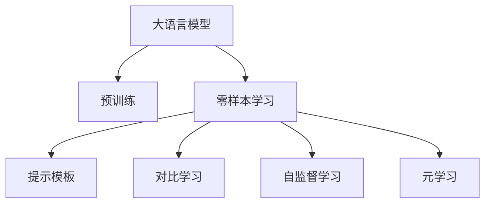

                 

# 零样本学习：Prompt的设计艺术

## 1. 背景介绍

### 1.1 问题由来
在自然语言处理（Natural Language Processing, NLP）领域，传统的监督学习范式需要大量的标注数据来训练模型，这不仅增加了成本，还限制了模型的应用范围。而零样本学习（Zero-shot Learning, ZSL）的出现，让模型能够在没有直接观察到任何训练样本的情况下，进行推理和预测。这对于资源受限、数据稀缺的应用场景具有重要意义，如医疗诊断、智能客服、自然语言生成等。

### 1.2 问题核心关键点
零样本学习的核心在于，通过合理设计提示模板（Prompt），引导大语言模型（Large Language Model, LLM）在未见过的样本上进行推理，从而实现预测或分类等任务。提示模板通常是一段包含任务描述和示例的文本，能够有效指导模型输出。

### 1.3 问题研究意义
零样本学习通过提升模型的泛化能力，使得在缺乏数据的环境中也能进行有效推理。这对于扩大模型的应用场景、降低数据标注成本、加速模型开发和部署具有重要意义。在实际应用中，零样本学习能够显著提升模型的泛化能力和推理效率，特别是在医疗、金融、安全等领域，零样本学习模型能够快速响应新问题，提高决策的准确性和效率。

## 2. 核心概念与联系

### 2.1 核心概念概述

为更好地理解零样本学习的原理和设计，本节将介绍几个核心概念及其之间的联系：

- **大语言模型**：如GPT、BERT等，通过大规模无标签数据预训练，学习通用语言表示，具备强大的语言理解和生成能力。
- **零样本学习**：在未见过的样本上进行推理和预测，无需直接观察训练数据，适用于数据稀缺和资源受限的环境。
- **提示模板**：引导模型进行特定任务推理的文本描述，通常包含任务描述、示例和推理格式等信息。
- **对比学习**：通过学习不同任务之间的相似性和差异性，提升模型的泛化能力。
- **自监督学习**：利用未标注数据自学习任务，如掩码语言模型、同义词替换等，提高模型的泛化性能。
- **元学习**：学习如何快速适应新任务，提升模型的推理效率和泛化能力。

这些概念之间的逻辑关系可以通过以下Mermaid流程图来展示：



这个流程图展示了大语言模型的核心概念及其之间的联系：

1. 大语言模型通过预训练获得基础能力。
2. 零样本学习使得模型能够在未见过的样本上进行推理。
3. 提示模板引导模型进行特定任务推理。
4. 对比学习和自监督学习提升模型的泛化能力。
5. 元学习使得模型能够快速适应新任务。

这些概念共同构成了零样本学习的理论基础，使得模型能够在缺乏直接训练样本的情况下，通过巧妙设计的提示模板进行推理和预测。

## 3. 核心算法原理 & 具体操作步骤

### 3.1 算法原理概述

零样本学习基于以下原理：
1. **通用语言表示**：大语言模型通过大规模无标签数据预训练，学习到通用的语言表示，能够在大范围内进行推理和预测。
2. **提示模板设计**：提示模板包含任务描述和示例，能够引导模型进行特定任务的推理。
3. **对比学习**：通过学习不同任务之间的相似性和差异性，提升模型的泛化能力。
4. **自监督学习**：利用未标注数据进行自学习，提高模型的泛化性能。
5. **元学习**：学习如何快速适应新任务，提升模型的推理效率和泛化能力。

零样本学习的过程通常分为以下几个步骤：
1. **提示模板设计**：设计合适的提示模板，包含任务描述、示例和推理格式等信息。
2. **模型输入**：将提示模板作为模型的输入，进行推理或预测。
3. **结果分析**：分析模型输出，判断推理结果的正确性和可解释性。

### 3.2 算法步骤详解

#### 3.2.1 提示模板设计
提示模板的设计是零样本学习的核心。一个好的提示模板应该包含以下要素：
1. **任务描述**：清晰描述任务的目标和要求，如“给定一个句子，判断它是褒义还是贬义”。
2. **示例**：提供一些有代表性的示例，帮助模型理解任务。
3. **推理格式**：指定模型的推理格式，如“输入：<句子>，输出：<褒义/贬义>”。

以下是一些常见的提示模板：
1. **分类任务**：
   - 输入：<句子>，分类：<标签>
   - 示例：<句子1>，标签：<标签1>
   - 推理格式：输入：<句子>，分类：<标签>
2. **生成任务**：
   - 输入：<提示>，生成：<文本>
   - 示例：<提示1>，生成：<文本1>
   - 推理格式：输入：<提示>，生成：<文本>
3. **问答任务**：
   - 输入：<问题>，输出：<答案>
   - 示例：<问题1>，答案：<答案1>
   - 推理格式：输入：<问题>，输出：<答案>

#### 3.2.2 模型输入
将设计好的提示模板作为模型的输入，进行推理或预测。以下是使用Hugging Face Transformers库对BERT模型进行零样本分类的代码实现：

```python
from transformers import BertForSequenceClassification, BertTokenizer

# 加载模型和分词器
model = BertForSequenceClassification.from_pretrained('bert-base-cased')
tokenizer = BertTokenizer.from_pretrained('bert-base-cased')

# 提示模板
prompt = "输入：<句子>，分类：<褒义/贬义>"

# 待推理的文本
sentence = "这家餐厅的菜品非常美味"

# 对文本进行编码
encoded_prompt = tokenizer.encode(prompt, return_tensors='pt')
encoded_sentence = tokenizer.encode(sentence, return_tensors='pt')

# 推理输出
inputs = {'recip:output': encoded_prompt, 'sequence': encoded_sentence}
outputs = model(**inputs)
```

#### 3.2.3 结果分析
分析模型输出的概率分布或预测结果，判断推理的正确性和可解释性。以下是判断情绪分类结果的正确性的代码实现：

```python
from sklearn.metrics import accuracy_score

# 获取模型输出的概率分布
probabilities = outputs.logits.detach().cpu().numpy()[0]

# 判断推理结果
if probabilities[0] > 0.5:
    label = "褒义"
else:
    label = "贬义"

# 判断推理结果是否正确
correct = label == '褒义'  # 假设正确的标签为'褒义'
print(f"推理结果：{label}，正确性：{correct}")
```

### 3.3 算法优缺点

#### 3.3.1 优点
1. **无需标注数据**：零样本学习不需要大量的标注数据，只需设计好的提示模板即可进行推理，节省了数据标注的成本和时间。
2. **泛化能力强**：零样本学习能够在小样本环境下进行推理，具有较强的泛化能力。
3. **推理效率高**：零样本学习只需推理一次即可得到结果，速度快于从头训练模型。
4. **应用广泛**：零样本学习适用于各种NLP任务，如分类、生成、问答等。

#### 3.3.2 缺点
1. **提示模板设计困难**：设计好的提示模板需要经验和技巧，通常需要经过多次试验和调试。
2. **模型泛化性能受限**：零样本学习的效果受到提示模板质量的影响，可能存在一定的泛化性能瓶颈。
3. **缺乏可解释性**：零样本学习模型通常缺乏可解释性，难以理解模型的推理过程。
4. **效果不稳定**：不同提示模板可能导致不同的推理结果，结果稳定性较差。

## 4. 数学模型和公式 & 详细讲解 & 举例说明

### 4.1 数学模型构建

零样本学习的数学模型基于以下假设：
1. 大语言模型通过预训练学习到通用的语言表示 $f_{\theta}$，其中 $\theta$ 为模型参数。
2. 提示模板 $P$ 包含任务描述、示例和推理格式，用于引导模型推理。
3. 对于未见过的样本 $x$，模型通过推理模板 $P$ 输出结果 $y$。

数学模型可以表示为：
$$
y = f_{\theta}(P)
$$

### 4.2 公式推导过程

假设模型输入为 $x$，提示模板为 $P$，输出为 $y$。推理过程可以表示为：
$$
y = f_{\theta}(P)
$$

对于分类任务，假设模型输出的概率分布为 $P(y|x, P)$，则损失函数可以表示为：
$$
\mathcal{L} = -\log P(y|x, P)
$$

对于生成任务，假设模型输出的概率分布为 $P(y|x, P)$，则损失函数可以表示为：
$$
\mathcal{L} = -\log P(y|x, P)
$$

对于问答任务，假设模型输出的概率分布为 $P(y|x, P)$，则损失函数可以表示为：
$$
\mathcal{L} = -\log P(y|x, P)
$$

### 4.3 案例分析与讲解

#### 4.3.1 分类任务
假设任务为情感分类，提示模板为“输入：<句子>，分类：<褒义/贬义>”。以下是使用Hugging Face Transformers库对BERT模型进行零样本分类的代码实现：

```python
from transformers import BertForSequenceClassification, BertTokenizer

# 加载模型和分词器
model = BertForSequenceClassification.from_pretrained('bert-base-cased')
tokenizer = BertTokenizer.from_pretrained('bert-base-cased')

# 提示模板
prompt = "输入：<句子>，分类：<褒义/贬义>"

# 待推理的文本
sentence = "这家餐厅的菜品非常美味"

# 对文本进行编码
encoded_prompt = tokenizer.encode(prompt, return_tensors='pt')
encoded_sentence = tokenizer.encode(sentence, return_tensors='pt')

# 推理输出
inputs = {'recip:output': encoded_prompt, 'sequence': encoded_sentence}
outputs = model(**inputs)
```

#### 4.3.2 生成任务
假设任务为文本生成，提示模板为“输入：<提示>，生成：<文本>”。以下是使用GPT-2模型进行文本生成的代码实现：

```python
from transformers import GPT2LMHeadModel, GPT2Tokenizer

# 加载模型和分词器
model = GPT2LMHeadModel.from_pretrained('gpt2')
tokenizer = GPT2Tokenizer.from_pretrained('gpt2')

# 提示模板
prompt = "输入：<提示>，生成：<文本>"

# 待推理的文本
prompt_text = "描述一个神秘的机器"

# 对提示模板进行编码
encoded_prompt = tokenizer.encode(prompt, return_tensors='pt')

# 生成文本
inputs = {'input_ids': encoded_prompt}
outputs = model.generate(**inputs)

# 将生成文本解码为字符串
generated_text = tokenizer.decode(outputs[0], skip_special_tokens=True)
```

## 5. 项目实践：代码实例和详细解释说明

### 5.1 开发环境搭建

在进行零样本学习项目实践前，需要准备好开发环境。以下是使用Python进行PyTorch开发的环境配置流程：

1. 安装Anaconda：从官网下载并安装Anaconda，用于创建独立的Python环境。

2. 创建并激活虚拟环境：
```bash
conda create -n pytorch-env python=3.8 
conda activate pytorch-env
```

3. 安装PyTorch：根据CUDA版本，从官网获取对应的安装命令。例如：
```bash
conda install pytorch torchvision torchaudio cudatoolkit=11.1 -c pytorch -c conda-forge
```

4. 安装Transformers库：
```bash
pip install transformers
```

5. 安装各类工具包：
```bash
pip install numpy pandas scikit-learn matplotlib tqdm jupyter notebook ipython
```

完成上述步骤后，即可在`pytorch-env`环境中开始零样本学习实践。

### 5.2 源代码详细实现

以下是使用GPT-2模型进行文本生成的代码实现：

```python
from transformers import GPT2LMHeadModel, GPT2Tokenizer

# 加载模型和分词器
model = GPT2LMHeadModel.from_pretrained('gpt2')
tokenizer = GPT2Tokenizer.from_pretrained('gpt2')

# 提示模板
prompt = "输入：<提示>，生成：<文本>"

# 待推理的文本
prompt_text = "描述一个神秘的机器"

# 对提示模板进行编码
encoded_prompt = tokenizer.encode(prompt, return_tensors='pt')

# 生成文本
inputs = {'input_ids': encoded_prompt}
outputs = model.generate(**inputs)

# 将生成文本解码为字符串
generated_text = tokenizer.decode(outputs[0], skip_special_tokens=True)
print(generated_text)
```

### 5.3 代码解读与分析

**提示模板设计**：
- 提示模板是零样本学习的核心，设计一个好的模板需要考虑任务类型、输入格式、输出格式等因素。
- 对于分类任务，提示模板通常包含任务描述和示例，帮助模型理解任务目标。
- 对于生成任务，提示模板通常包含生成要求和示例，帮助模型生成符合要求的文本。

**模型推理**：
- 将提示模板输入模型进行推理，得到输出结果。
- 根据任务类型，选择合适的损失函数进行计算。

**结果分析**：
- 对模型输出的结果进行分析和解释，判断推理的正确性和可解释性。
- 根据任务类型，选择合适的评估指标进行评估，如准确率、F1分数等。

## 6. 实际应用场景

### 6.1 智能客服系统

零样本学习可以应用于智能客服系统的构建，提升客户咨询体验。智能客服系统需要快速响应客户咨询，提供个性化的服务。零样本学习可以自动理解客户意图，匹配最合适的答案模板进行回复，提升系统响应速度和准确性。

### 6.2 金融舆情监测

金融舆情监测需要实时监测市场舆论动向，以便及时应对负面信息传播，规避金融风险。零样本学习可以自动判断文本属于何种主题，情感倾向是正面、中性还是负面，提供实时舆情分析。

### 6.3 个性化推荐系统

个性化推荐系统需要根据用户兴趣推荐个性化内容。零样本学习可以自动理解用户兴趣点，匹配最符合用户兴趣的内容，提升推荐效果。

### 6.4 未来应用展望

未来，零样本学习将在更多领域得到应用，为传统行业带来变革性影响：

- **医疗诊断**：零样本学习可以自动诊断疾病，提供快速、准确的医疗建议。
- **智能安全**：零样本学习可以自动分析网络攻击行为，提供实时威胁预警。
- **教育培训**：零样本学习可以自动生成学习资源，提供个性化的学习体验。
- **智慧城市**：零样本学习可以自动分析城市事件，提供智能城市治理方案。

## 7. 工具和资源推荐

### 7.1 学习资源推荐

为帮助开发者系统掌握零样本学习的理论基础和实践技巧，推荐以下学习资源：

1. 《Transformer从原理到实践》系列博文：由大模型技术专家撰写，深入浅出地介绍了Transformer原理、BERT模型、零样本学习等前沿话题。

2. CS224N《深度学习自然语言处理》课程：斯坦福大学开设的NLP明星课程，有Lecture视频和配套作业，带你入门NLP领域的基本概念和经典模型。

3. 《Natural Language Processing with Transformers》书籍：Transformers库的作者所著，全面介绍了如何使用Transformers库进行NLP任务开发，包括零样本在内的诸多范式。

4. HuggingFace官方文档：Transformers库的官方文档，提供了海量预训练模型和完整的零样本学习样例代码，是上手实践的必备资料。

5. CLUE开源项目：中文语言理解测评基准，涵盖大量不同类型的中文NLP数据集，并提供了基于零样本的baseline模型，助力中文NLP技术发展。

通过对这些资源的学习实践，相信你一定能够快速掌握零样本学习的精髓，并用于解决实际的NLP问题。

### 7.2 开发工具推荐

高效的开发离不开优秀的工具支持。以下是几款用于零样本学习开发的常用工具：

1. PyTorch：基于Python的开源深度学习框架，灵活动态的计算图，适合快速迭代研究。大部分预训练语言模型都有PyTorch版本的实现。

2. TensorFlow：由Google主导开发的开源深度学习框架，生产部署方便，适合大规模工程应用。同样有丰富的预训练语言模型资源。

3. Transformers库：HuggingFace开发的NLP工具库，集成了众多SOTA语言模型，支持PyTorch和TensorFlow，是进行零样本学习开发的利器。

4. Weights & Biases：模型训练的实验跟踪工具，可以记录和可视化模型训练过程中的各项指标，方便对比和调优。与主流深度学习框架无缝集成。

5. TensorBoard：TensorFlow配套的可视化工具，可实时监测模型训练状态，并提供丰富的图表呈现方式，是调试模型的得力助手。

6. Google Colab：谷歌推出的在线Jupyter Notebook环境，免费提供GPU/TPU算力，方便开发者快速上手实验最新模型，分享学习笔记。

合理利用这些工具，可以显著提升零样本学习的开发效率，加快创新迭代的步伐。

### 7.3 相关论文推荐

零样本学习技术的发展源于学界的持续研究。以下是几篇奠基性的相关论文，推荐阅读：

1. Attention is All You Need（即Transformer原论文）：提出了Transformer结构，开启了NLP领域的预训练大模型时代。

2. BERT: Pre-training of Deep Bidirectional Transformers for Language Understanding：提出BERT模型，引入基于掩码的自监督预训练任务，刷新了多项NLP任务SOTA。

3. Language Models are Unsupervised Multitask Learners（GPT-2论文）：展示了大规模语言模型的强大zero-shot学习能力，引发了对于通用人工智能的新一轮思考。

4. Self-Supervised Feature Learning via Noisy Pretext Tasks（SST-2）：提出基于噪声预文本任务的自监督学习范式，提升了模型的泛化性能。

5. Masked Language Model Pretraining for Feature Learning（BERT论文）：提出掩码语言模型预训练任务，提高了模型的语言表示能力。

6. SIMC: Simple Yet Strong Cross-Modal Contrastive Learning for Zero-Shot Text Generation：提出跨模态对比学习范式，提升了模型的zero-shot文本生成能力。

这些论文代表了大零样本学习技术的发展脉络。通过学习这些前沿成果，可以帮助研究者把握学科前进方向，激发更多的创新灵感。

## 8. 总结：未来发展趋势与挑战

### 8.1 总结

本文对零样本学习的方法进行了全面系统的介绍。首先阐述了零样本学习的研究背景和意义，明确了提示模板设计在零样本学习中的核心地位。其次，从原理到实践，详细讲解了零样本学习的数学模型和核心步骤，给出了零样本学习任务开发的完整代码实例。同时，本文还探讨了零样本学习在智能客服、金融舆情、个性化推荐等多个行业领域的应用前景，展示了零样本学习范式的巨大潜力。此外，本文精选了零样本学习的各类学习资源，力求为读者提供全方位的技术指引。

通过本文的系统梳理，可以看到，零样本学习技术通过巧妙的提示模板设计，能够在缺乏直接训练样本的情况下，利用大语言模型的泛化能力进行推理和预测，具有广泛的应用前景。未来，伴随零样本学习技术的发展，将进一步拓展人工智能技术的应用边界，为传统行业带来新的变革。

### 8.2 未来发展趋势

展望未来，零样本学习技术将呈现以下几个发展趋势：

1. **提示模板设计自动化**：通过深度学习模型自动设计提示模板，减少人工干预，提高模板设计的效率和质量。
2. **多模态零样本学习**：将零样本学习应用于多模态数据，如文本、图像、语音等，提升模型的跨领域泛化能力。
3. **元学习与自监督学习结合**：将元学习和自监督学习结合，提升模型的快速适应能力和泛化性能。
4. **知识增强零样本学习**：将外部知识库与模型结合，提高模型的零样本推理能力。
5. **跨领域零样本学习**：将零样本学习应用于不同领域，提升模型的跨领域泛化能力。
6. **可解释性增强**：提升零样本学习模型的可解释性，增强模型的透明度和可信度。

以上趋势凸显了零样本学习技术的广阔前景。这些方向的探索发展，必将进一步提升零样本学习模型的推理能力，为构建安全、可靠、可解释、可控的智能系统铺平道路。

### 8.3 面临的挑战

尽管零样本学习技术已经取得了一定的进展，但在向更广泛的应用场景推广的过程中，仍面临诸多挑战：

1. **提示模板设计困难**：提示模板的设计需要经验和技巧，难以自动生成高质量的提示模板。
2. **泛化性能受限**：零样本学习的效果受到提示模板质量的影响，泛化性能存在瓶颈。
3. **可解释性不足**：零样本学习模型通常缺乏可解释性，难以理解模型的推理过程。
4. **效果不稳定**：不同提示模板可能导致不同的推理结果，结果稳定性较差。
5. **资源消耗大**：大语言模型推理过程计算量大，对硬件资源要求高。

### 8.4 研究展望

面对零样本学习面临的挑战，未来的研究需要在以下几个方面寻求新的突破：

1. **自动生成高质量提示模板**：通过深度学习模型自动生成高质量的提示模板，减少人工干预。
2. **提升提示模板泛化性能**：通过多模态学习、元学习等方法提升提示模板的泛化能力。
3. **增强模型可解释性**：通过可解释性增强方法，提高零样本学习模型的透明度和可信度。
4. **优化推理计算图**：优化零样本学习模型的计算图，提高推理效率，降低计算资源消耗。
5. **结合外部知识库**：将外部知识库与零样本学习模型结合，提升模型的推理能力。
6. **多模态零样本学习**：将零样本学习应用于多模态数据，提升模型的跨领域泛化能力。

这些研究方向的探索，将引领零样本学习技术迈向更高的台阶，为构建安全、可靠、可解释、可控的智能系统提供有力支持。

## 9. 附录：常见问题与解答

**Q1：零样本学习是否适用于所有NLP任务？**

A: 零样本学习适用于大多数NLP任务，特别是对于数据量较小的任务。但对于一些特定领域的任务，如医学、法律等，需要进一步优化提示模板，以提高模型的推理能力。

**Q2：提示模板设计如何考虑不同任务的复杂度？**

A: 提示模板设计需要考虑不同任务的复杂度。对于简单任务，提示模板可以较为简短，直接描述任务要求即可。对于复杂任务，提示模板需要详细描述任务目标和示例，帮助模型理解任务。

**Q3：零样本学习模型是否需要反复调试提示模板？**

A: 零样本学习模型通常需要反复调试提示模板，以找到最合适的模板。不同模板可能导致不同的推理结果，需要多次试验和调试。

**Q4：零样本学习在实际应用中需要注意哪些问题？**

A: 零样本学习在实际应用中需要注意以下问题：
1. **提示模板质量**：设计高质量的提示模板，避免误导模型。
2. **泛化性能**：通过多种方法提升提示模板的泛化性能。
3. **推理效率**：优化模型推理计算图，提高推理速度。
4. **可解释性**：增强模型的可解释性，提高模型的透明度和可信度。
5. **数据量**：对于数据量较少的任务，零样本学习可能效果不佳，需要结合其他方法提升效果。

**Q5：零样本学习模型如何结合外部知识库？**

A: 零样本学习模型可以通过将外部知识库与模型结合，提升模型的推理能力。例如，在零样本文本生成任务中，可以结合知识图谱和逻辑规则，生成符合逻辑和常识的文本。

通过不断探索和优化，零样本学习技术必将在更多领域得到应用，为人工智能技术的发展注入新的动力。

