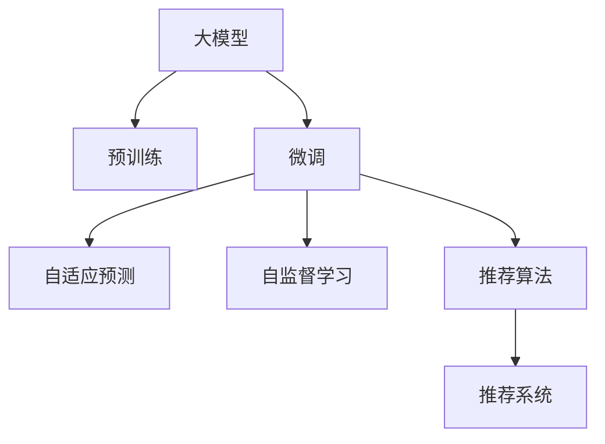

                 

# 面向不同推荐任务的大模型Prompt范式总结

> 关键词：大模型,Prompt范式,推荐系统,个性化推荐,自适应预测,自监督学习,预训练,推荐算法

## 1. 背景介绍

### 1.1 问题由来

推荐系统是互联网公司重要的业务引擎之一，它通过分析用户的行为数据，为用户推荐符合其兴趣的内容。传统的推荐系统大多依赖于用户的历史行为数据进行个性化推荐，难以捕捉用户的潜在兴趣，且容易陷入冷启动问题。近年来，随着预训练语言模型的出现，推荐系统迈入了基于大模型的全新阶段。

预训练语言模型（Large Language Model, LLMs）在自监督学习任务上获得了丰富、通用的语言知识，具备强大的理解和生成能力。基于大模型的推荐系统，通过预训练-微调(Fine-tuning)的框架，将通用语言知识迁移到个性化推荐任务上，极大地提升了推荐系统的效果。

### 1.2 问题核心关键点

在大模型推荐系统中，推荐任务的多样性给模型的设计和优化带来了挑战。常见的推荐任务包括基于内容的推荐、基于协同过滤的推荐、混合推荐等。每个推荐任务的目标和实现方式都有所不同，因此需要针对性地设计大模型的Prompt范式，以提升推荐效果。

Prompt范式是指在模型输入中使用特定的文本模板或标签，引导模型进行任务特定的推理和生成。通过精心设计的Prompt，可以最大限度地利用大模型的语言理解能力，实现更精准、高效的个性化推荐。

本文旨在总结面向不同推荐任务的大模型Prompt范式，帮助开发者系统性地掌握Prompt技术，提升推荐系统的性能。

## 2. 核心概念与联系

### 2.1 核心概念概述

为更好地理解基于大模型的推荐系统，本文将介绍几个密切相关的核心概念：

- 大模型(Large Language Model, LLM)：以自回归(如GPT)或自编码(如BERT)模型为代表的大规模预训练语言模型。通过在大规模无标签文本语料上进行预训练，学习通用的语言表示，具备强大的语言理解和生成能力。

- Prompt范式：在模型输入中使用特定的文本模板或标签，引导模型进行任务特定的推理和生成。通过精心设计的Prompt，可以最大限度地利用大模型的语言理解能力，实现更精准、高效的个性化推荐。

- 推荐系统：通过分析用户的行为数据，为用户推荐符合其兴趣的内容的系统。包括基于内容的推荐、基于协同过滤的推荐、混合推荐等。

- 预训练-微调：指在预训练模型的基础上，使用下游任务的少量标注数据，通过有监督地训练来优化模型在特定任务上的性能。在大模型推荐系统中，通常只微调顶层分类器或解码器，并以较小的学习率更新全部或部分的模型参数。

- 自适应预测：指模型能够根据输入的Prompt自动调整输出，从而实现零样本或少样本学习。在大模型推荐系统中，自适应预测技术可以显著提升推荐效果，特别是在面临长尾数据、冷启动等挑战时。

- 自监督学习：指使用未标注数据进行模型训练，学习任务的通用表示。在大模型推荐系统中，自监督学习可以用于预训练和微调任务，提高模型的泛化能力和鲁棒性。

- 推荐算法：包括基于内容的推荐、基于协同过滤的推荐、混合推荐等，用于实现不同推荐任务的具体方法。

这些核心概念之间的逻辑关系可以通过以下Mermaid流程图来展示：



这个流程图展示了大模型推荐系统的核心概念及其之间的关系：

1. 大模型通过预训练获得基础能力。
2. 微调是对预训练模型进行任务特定的优化，可以分为自适应预测和自监督学习等。
3. 推荐算法是推荐系统实现的具体方法。
4. 自适应预测技术可以实现零样本或少样本学习，提升推荐效果。
5. 自监督学习可以用于预训练和微调任务，提高模型的泛化能力和鲁棒性。

这些概念共同构成了大模型推荐系统的学习和应用框架，使得模型能够更好地适应各种推荐任务，提升推荐系统的效果。

## 3. 核心算法原理 & 具体操作步骤
### 3.1 算法原理概述

面向不同推荐任务的大模型Prompt范式，本质上是一种基于自适应预测的自监督学习范式。其核心思想是：将预训练的大模型视作一个强大的"特征提取器"，通过下游任务的少量标注数据，利用自适应预测技术，优化模型在特定任务上的性能。

具体而言，假设推荐系统包含$N$个推荐任务$T=\{T_1, T_2, ..., T_N\}$，每个任务$T_i$的标注数据集为$D_i=\{(x_i,y_i)\}_{i=1}^N$，其中$x_i$为输入特征，$y_i$为推荐结果。模型的目标是学习一个泛化的表示函数$f$，使得$f(x_i)$能够适应所有推荐任务$T$的推荐结果。

大模型通过自监督学习任务获得通用表示，再通过下游任务的自适应预测进行微调，得到适应特定推荐任务的模型参数。具体的流程如下：

1. 使用大规模无标签数据对大模型进行预训练，学习通用的语言表示。
2. 针对每个推荐任务$T_i$，设计适当的Prompt范式，并利用标注数据集$D_i$对模型进行微调。
3. 微调后的模型通过自适应预测技术，对新的输入特征$x$进行推荐预测。

### 3.2 算法步骤详解

面向不同推荐任务的大模型Prompt范式，一般包括以下几个关键步骤：

**Step 1: 准备预训练模型和数据集**
- 选择合适的预训练语言模型$M_{\theta}$作为初始化参数，如BERT、GPT等。
- 准备推荐系统中的各个推荐任务$T=\{T_1, T_2, ..., T_N\}$的标注数据集$D_i$，划分为训练集、验证集和测试集。

**Step 2: 添加任务适配层**
- 根据推荐任务类型，在预训练模型顶层设计合适的输出层和损失函数。
- 对于推荐任务，通常使用分类交叉熵损失函数。

**Step 3: 设计Prompt范式**
- 根据具体推荐任务，设计相应的Prompt范式。例如，在用户评分预测任务中，可以设计如下Prompt范式："请对商品$x$评分，评分范围1-5。"
- 将Prompt范式作为模型输入的一部分，加入模型进行训练。

**Step 4: 设置微调超参数**
- 选择合适的优化算法及其参数，如AdamW、SGD等，设置学习率、批大小、迭代轮数等。
- 设置正则化技术及强度，包括权重衰减、Dropout、Early Stopping等。
- 确定冻结预训练参数的策略，如仅微调顶层，或全部参数都参与微调。

**Step 5: 执行梯度训练**
- 将训练集数据分批次输入模型，前向传播计算损失函数。
- 反向传播计算参数梯度，根据设定的优化算法和学习率更新模型参数。
- 周期性在验证集上评估模型性能，根据性能指标决定是否触发Early Stopping。
- 重复上述步骤直到满足预设的迭代轮数或Early Stopping条件。

**Step 6: 测试和部署**
- 在测试集上评估微调后模型$M_{\hat{\theta}}$的性能，对比微调前后的精度提升。
- 使用微调后的模型对新输入特征进行推理预测，集成到实际的应用系统中。

以上就是面向不同推荐任务的大模型Prompt范式的一般流程。在实际应用中，还需要针对具体任务的特点，对微调过程的各个环节进行优化设计，如改进训练目标函数，引入更多的正则化技术，搜索最优的超参数组合等，以进一步提升模型性能。

### 3.3 算法优缺点

面向不同推荐任务的大模型Prompt范式，具有以下优点：

1. 简单高效。只需准备少量标注数据，即可对预训练模型进行快速适配，获得较大的性能提升。
2. 通用适用。适用于各种推荐系统中的推荐任务，设计简单的任务适配层即可实现微调。
3. 参数高效。利用参数高效微调技术，在固定大部分预训练权重不变的情况下，仍可取得不错的提升。
4. 效果显著。在学术界和工业界的诸多推荐任务上，基于微调的方法已经刷新了最先进的性能指标。

同时，该方法也存在一定的局限性：

1. 依赖标注数据。微调的效果很大程度上取决于标注数据的质量和数量，获取高质量标注数据的成本较高。
2. 迁移能力有限。当目标任务与预训练数据的分布差异较大时，微调的性能提升有限。
3. 可解释性不足。微调模型的决策过程通常缺乏可解释性，难以对其推理逻辑进行分析和调试。

尽管存在这些局限性，但就目前而言，面向不同推荐任务的大模型Prompt范式仍是大模型推荐系统应用的主流范式。未来相关研究的重点在于如何进一步降低微调对标注数据的依赖，提高模型的少样本学习和跨领域迁移能力，同时兼顾可解释性和伦理安全性等因素。

### 3.4 算法应用领域

面向不同推荐任务的大模型Prompt范式，在推荐系统中的应用已得到了广泛的应用，覆盖了几乎所有常见推荐任务，例如：

- 用户评分预测：预测用户对商品、电影、书籍等的评分。通过将商品描述作为输入，微调模型学习评分-商品映射。
- 商品推荐：根据用户的历史行为数据，推荐用户可能感兴趣的商品。通过将用户行为序列作为输入，微调模型学习行为-商品映射。
- 内容推荐：根据用户的浏览历史，推荐用户可能感兴趣的内容。通过将内容摘要作为输入，微调模型学习内容-用户映射。
- 搜索引擎：推荐用户可能感兴趣的相关搜索结果。通过将搜索关键词作为输入，微调模型学习关键词-内容映射。

除了上述这些经典任务外，大模型Prompt范式也被创新性地应用到更多场景中，如个性化音乐播放、新闻订阅、广告投放等，为推荐系统带来了全新的突破。随着预训练模型和Prompt范式的不断进步，相信推荐系统将在更广阔的应用领域大放异彩。

## 4. 数学模型和公式 & 详细讲解  
### 4.1 数学模型构建

本节将使用数学语言对面向不同推荐任务的大模型Prompt范式进行更加严格的刻画。

记预训练语言模型为 $M_{\theta}$，其中 $\theta$ 为预训练得到的模型参数。假设推荐系统中的推荐任务 $T_i$ 的训练集为 $D_i=\{(x_i,y_i)\}_{i=1}^N, x_i \in \mathcal{X}, y_i \in \mathcal{Y}$。

定义模型 $M_{\theta}$ 在输入 $x_i$ 上的输出为 $\hat{y}_i=M_{\theta}(x_i) \in \mathcal{Y}$。推荐任务的目标是最小化损失函数：

$$
\ell(M_{\theta}(x_i),y_i) = -y_i\log \hat{y}_i - (1-y_i)\log (1-\hat{y}_i)
$$

从而得到经验风险：

$$
\mathcal{L}(\theta) = \frac{1}{N}\sum_{i=1}^N \ell(M_{\theta}(x_i),y_i)
$$

微调的优化目标是最小化经验风险，即找到最优参数：

$$
\theta^* = \mathop{\arg\min}_{\theta} \mathcal{L}(\theta)
$$

在实践中，我们通常使用基于梯度的优化算法（如SGD、Adam等）来近似求解上述最优化问题。设 $\eta$ 为学习率，$\lambda$ 为正则化系数，则参数的更新公式为：

$$
\theta \leftarrow \theta - \eta \nabla_{\theta}\mathcal{L}(\theta) - \eta\lambda\theta
$$

其中 $\nabla_{\theta}\mathcal{L}(\theta)$ 为损失函数对参数 $\theta$ 的梯度，可通过反向传播算法高效计算。

### 4.2 公式推导过程

以下我们以用户评分预测任务为例，推导交叉熵损失函数及其梯度的计算公式。

假设模型 $M_{\theta}$ 在输入 $x$ 上的输出为 $\hat{y}=M_{\theta}(x) \in [0,1]$，表示用户对商品$x$的评分。真实标签 $y \in \{1,2,3,4,5\}$。则二分类交叉熵损失函数定义为：

$$
\ell(M_{\theta}(x),y) = -[y\log \hat{y} + (1-y)\log (1-\hat{y})]
$$

将其代入经验风险公式，得：

$$
\mathcal{L}(\theta) = -\frac{1}{N}\sum_{i=1}^N [y_i\log M_{\theta}(x_i)+(1-y_i)\log(1-M_{\theta}(x_i))]
$$

根据链式法则，损失函数对参数 $\theta_k$ 的梯度为：

$$
\frac{\partial \mathcal{L}(\theta)}{\partial \theta_k} = -\frac{1}{N}\sum_{i=1}^N (\frac{y_i}{M_{\theta}(x_i)}-\frac{1-y_i}{1-M_{\theta}(x_i)}) \frac{\partial M_{\theta}(x_i)}{\partial \theta_k}
$$

其中 $\frac{\partial M_{\theta}(x_i)}{\partial \theta_k}$ 可进一步递归展开，利用自动微分技术完成计算。

在得到损失函数的梯度后，即可带入参数更新公式，完成模型的迭代优化。重复上述过程直至收敛，最终得到适应下游推荐任务的最优模型参数 $\theta^*$。

## 5. 项目实践：代码实例和详细解释说明
### 5.1 开发环境搭建

在进行Prompt范式实践前，我们需要准备好开发环境。以下是使用Python进行PyTorch开发的环境配置流程：

1. 安装Anaconda：从官网下载并安装Anaconda，用于创建独立的Python环境。

2. 创建并激活虚拟环境：
```bash
conda create -n pytorch-env python=3.8 
conda activate pytorch-env
```

3. 安装PyTorch：根据CUDA版本，从官网获取对应的安装命令。例如：
```bash
conda install pytorch torchvision torchaudio cudatoolkit=11.1 -c pytorch -c conda-forge
```

4. 安装Transformers库：
```bash
pip install transformers
```

5. 安装各类工具包：
```bash
pip install numpy pandas scikit-learn matplotlib tqdm jupyter notebook ipython
```

完成上述步骤后，即可在`pytorch-env`环境中开始Prompt范式的实践。

### 5.2 源代码详细实现

下面我们以商品推荐任务为例，给出使用Transformers库对BERT模型进行微调的PyTorch代码实现。

首先，定义推荐任务的数据处理函数：

```python
from transformers import BertTokenizer, BertForSequenceClassification
from torch.utils.data import Dataset
import torch

class RecommenderDataset(Dataset):
    def __init__(self, texts, labels, tokenizer, max_len=128):
        self.texts = texts
        self.labels = labels
        self.tokenizer = tokenizer
        self.max_len = max_len
        
    def __len__(self):
        return len(self.texts)
    
    def __getitem__(self, item):
        text = self.texts[item]
        label = self.labels[item]
        
        encoding = self.tokenizer(text, return_tensors='pt', max_length=self.max_len, padding='max_length', truncation=True)
        input_ids = encoding['input_ids'][0]
        attention_mask = encoding['attention_mask'][0]
        
        # 对label进行one-hot编码
        encoded_labels = torch.tensor([label == 1], dtype=torch.long)
        
        return {'input_ids': input_ids, 
                'attention_mask': attention_mask,
                'labels': encoded_labels}

# 标签与id的映射
label2id = {1: 0, -1: 1}
id2label = {0: 1, 1: -1}

# 创建dataset
tokenizer = BertTokenizer.from_pretrained('bert-base-cased')

train_dataset = RecommenderDataset(train_texts, train_labels, tokenizer)
dev_dataset = RecommenderDataset(dev_texts, dev_labels, tokenizer)
test_dataset = RecommenderDataset(test_texts, test_labels, tokenizer)
```

然后，定义模型和优化器：

```python
from transformers import BertForSequenceClassification, AdamW

model = BertForSequenceClassification.from_pretrained('bert-base-cased', num_labels=2)

optimizer = AdamW(model.parameters(), lr=2e-5)
```

接着，定义训练和评估函数：

```python
from torch.utils.data import DataLoader
from tqdm import tqdm
from sklearn.metrics import accuracy_score

device = torch.device('cuda') if torch.cuda.is_available() else torch.device('cpu')
model.to(device)

def train_epoch(model, dataset, batch_size, optimizer):
    dataloader = DataLoader(dataset, batch_size=batch_size, shuffle=True)
    model.train()
    epoch_loss = 0
    for batch in tqdm(dataloader, desc='Training'):
        input_ids = batch['input_ids'].to(device)
        attention_mask = batch['attention_mask'].to(device)
        labels = batch['labels'].to(device)
        model.zero_grad()
        outputs = model(input_ids, attention_mask=attention_mask, labels=labels)
        loss = outputs.loss
        epoch_loss += loss.item()
        loss.backward()
        optimizer.step()
    return epoch_loss / len(dataloader)

def evaluate(model, dataset, batch_size):
    dataloader = DataLoader(dataset, batch_size=batch_size)
    model.eval()
    preds, labels = [], []
    with torch.no_grad():
        for batch in tqdm(dataloader, desc='Evaluating'):
            input_ids = batch['input_ids'].to(device)
            attention_mask = batch['attention_mask'].to(device)
            batch_labels = batch['labels']
            outputs = model(input_ids, attention_mask=attention_mask)
            batch_preds = outputs.logits.argmax(dim=2).to('cpu').tolist()
            batch_labels = batch_labels.to('cpu').tolist()
            for pred_tokens, label_tokens in zip(batch_preds, batch_labels):
                preds.append(pred_tokens[0])
                labels.append(label_tokens[0])
                
    print(accuracy_score(labels, preds))
```

最后，启动训练流程并在测试集上评估：

```python
epochs = 5
batch_size = 16

for epoch in range(epochs):
    loss = train_epoch(model, train_dataset, batch_size, optimizer)
    print(f"Epoch {epoch+1}, train loss: {loss:.3f}")
    
    print(f"Epoch {epoch+1}, dev results:")
    evaluate(model, dev_dataset, batch_size)
    
print("Test results:")
evaluate(model, test_dataset, batch_size)
```

以上就是使用PyTorch对BERT进行商品推荐任务微调的完整代码实现。可以看到，得益于Transformers库的强大封装，我们可以用相对简洁的代码完成BERT模型的加载和微调。

### 5.3 代码解读与分析

让我们再详细解读一下关键代码的实现细节：

**RecommenderDataset类**：
- `__init__`方法：初始化文本、标签、分词器等关键组件。
- `__len__`方法：返回数据集的样本数量。
- `__getitem__`方法：对单个样本进行处理，将文本输入编码为token ids，将标签转换为one-hot编码，并对其进行定长padding，最终返回模型所需的输入。

**label2id和id2label字典**：
- 定义了标签与数字id之间的映射关系，用于将标签转换为one-hot编码。

**训练和评估函数**：
- 使用PyTorch的DataLoader对数据集进行批次化加载，供模型训练和推理使用。
- 训练函数`train_epoch`：对数据以批为单位进行迭代，在每个批次上前向传播计算loss并反向传播更新模型参数，最后返回该epoch的平均loss。
- 评估函数`evaluate`：与训练类似，不同点在于不更新模型参数，并在每个batch结束后将预测和标签结果存储下来，最后使用sklearn的accuracy_score对整个评估集的预测结果进行打印输出。

**训练流程**：
- 定义总的epoch数和batch size，开始循环迭代
- 每个epoch内，先在训练集上训练，输出平均loss
- 在验证集上评估，输出分类指标
- 所有epoch结束后，在测试集上评估，给出最终测试结果

可以看到，PyTorch配合Transformers库使得BERT微调的代码实现变得简洁高效。开发者可以将更多精力放在数据处理、模型改进等高层逻辑上，而不必过多关注底层的实现细节。

当然，工业级的系统实现还需考虑更多因素，如模型的保存和部署、超参数的自动搜索、更灵活的任务适配层等。但核心的Prompt范式基本与此类似。

## 6. 实际应用场景
### 6.1 智能推荐系统

基于大模型Prompt范式的推荐系统，可以广泛应用于智能推荐系统的构建。传统推荐系统往往依赖于用户的历史行为数据进行个性化推荐，难以捕捉用户的潜在兴趣，且容易陷入冷启动问题。而使用大模型Prompt范式，能够最大限度地利用用户输入的信息，生成更精准、个性化的推荐结果。

在技术实现上，可以收集用户的多种输入信息，如浏览历史、评分、评论等，将这些信息整合成推荐任务的提示词，再利用大模型进行微调。微调后的模型能够自动理解输入信息，生成更符合用户兴趣的推荐结果。对于新用户或面临冷启动问题的情况，可以通过更灵活的Prompt设计，引导模型给出初步推荐，再逐步积累用户反馈进行后续优化。

### 6.2 内容创作辅助

内容创作辅助是大模型Prompt范式的另一重要应用。在新闻、自媒体、创意写作等领域，高质量的内容创作常常需要大量的素材和灵感。使用大模型Prompt范式，可以通过精心设计的Prompt引导模型生成新的内容。

例如，在新闻撰写中，可以通过给定主题、背景、关键词等信息，设计合适的Prompt，调用大模型生成初稿。模型生成的初稿可以作为灵感来源，帮助作者快速创作高质量内容。在自媒体领域，可以通过给定主题和风格，引导模型生成符合作者风格的创意文章。

### 6.3 社交媒体内容推荐

社交媒体内容推荐是推荐系统的重要应用之一。通过收集用户的互动数据，如点赞、评论、分享等，可以设计合适的Prompt，调用大模型进行推荐。例如，在微博、微信等社交平台上，可以通过分析用户的互动行为，生成符合用户兴趣的微博推荐、文章推荐等。

在技术实现上，可以设计不同的Prompt模板，针对不同的推荐场景进行微调。例如，对于微博推荐，可以设计一些流行词汇、热点话题的提示词，引导模型生成热门微博推荐。对于文章推荐，可以设计一些关键词、主题的提示词，引导模型生成相关文章推荐。

### 6.4 未来应用展望

随着大模型Prompt范式的不断发展，其在推荐系统中的应用前景将更加广阔。

在智慧医疗领域，基于大模型Prompt范式的推荐系统，可以用于推荐个性化的治疗方案、药物、医院等，提升医疗服务的智能化水平。

在智能教育领域，大模型Prompt范式可以用于推荐个性化的学习资源、学习计划，因材施教，促进教育公平，提高教学质量。

在智慧城市治理中，大模型Prompt范式可以用于推荐个性化的城市服务、活动，提高城市管理的自动化和智能化水平，构建更安全、高效的未来城市。

此外，在企业生产、社会治理、文娱传媒等众多领域，基于大模型Prompt范式的推荐系统也将不断涌现，为传统行业数字化转型升级提供新的技术路径。相信随着技术的日益成熟，大模型Prompt范式必将成为推荐系统的重要范式，推动人工智能技术在更广泛的领域落地应用。

## 7. 工具和资源推荐
### 7.1 学习资源推荐

为了帮助开发者系统掌握大模型Prompt范式，这里推荐一些优质的学习资源：

1. 《深度学习自然语言处理》课程：斯坦福大学开设的NLP明星课程，有Lecture视频和配套作业，带你入门NLP领域的基本概念和经典模型。

2. 《Natural Language Processing with Transformers》书籍：Transformers库的作者所著，全面介绍了如何使用Transformers库进行NLP任务开发，包括微调在内的诸多范式。

3. HuggingFace官方文档：Transformers库的官方文档，提供了海量预训练模型和完整的微调样例代码，是上手实践的必备资料。

4. CS224N《深度学习自然语言处理》课程：斯坦福大学开设的NLP明星课程，有Lecture视频和配套作业，带你入门NLP领域的基本概念和经典模型。

5. 《Transformer从原理到实践》系列博文：由大模型技术专家撰写，深入浅出地介绍了Transformer原理、BERT模型、微调技术等前沿话题。

通过对这些资源的学习实践，相信你一定能够快速掌握大模型Prompt范式的精髓，并用于解决实际的NLP问题。
###  7.2 开发工具推荐

高效的开发离不开优秀的工具支持。以下是几款用于大模型Prompt范式开发的常用工具：

1. PyTorch：基于Python的开源深度学习框架，灵活动态的计算图，适合快速迭代研究。大部分预训练语言模型都有PyTorch版本的实现。

2. TensorFlow：由Google主导开发的开源深度学习框架，生产部署方便，适合大规模工程应用。同样有丰富的预训练语言模型资源。

3. Transformers库：HuggingFace开发的NLP工具库，集成了众多SOTA语言模型，支持PyTorch和TensorFlow，是进行Prompt范式开发的利器。

4. Weights & Biases：模型训练的实验跟踪工具，可以记录和可视化模型训练过程中的各项指标，方便对比和调优。与主流深度学习框架无缝集成。

5. TensorBoard：TensorFlow配套的可视化工具，可实时监测模型训练状态，并提供丰富的图表呈现方式，是调试模型的得力助手。

6. Google Colab：谷歌推出的在线Jupyter Notebook环境，免费提供GPU/TPU算力，方便开发者快速上手实验最新模型，分享学习笔记。

合理利用这些工具，可以显著提升大模型Prompt范式的开发效率，加快创新迭代的步伐。

### 7.3 相关论文推荐

大模型Prompt范式的研究源于学界的持续研究。以下是几篇奠基性的相关论文，推荐阅读：

1. Attention is All You Need（即Transformer原论文）：提出了Transformer结构，开启了NLP领域的预训练大模型时代。

2. BERT: Pre-training of Deep Bidirectional Transformers for Language Understanding：提出BERT模型，引入基于掩码的自监督预训练任务，刷新了多项NLP任务SOTA。

3. Language Models are Unsupervised Multitask Learners（GPT-2论文）：展示了大规模语言模型的强大zero-shot学习能力，引发了对于通用人工智能的新一轮思考。

4. Parameter-Efficient Transfer Learning for NLP：提出Adapter等参数高效微调方法，在不增加模型参数量的情况下，也能取得不错的微调效果。

5. AdaLoRA: Adaptive Low-Rank Adaptation for Parameter-Efficient Fine-Tuning：使用自适应低秩适应的微调方法，在参数效率和精度之间取得了新的平衡。

这些论文代表了大模型Prompt范式的发展脉络。通过学习这些前沿成果，可以帮助研究者把握学科前进方向，激发更多的创新灵感。

## 8. 总结：未来发展趋势与挑战

### 8.1 总结

本文对面向不同推荐任务的大模型Prompt范式进行了全面系统的介绍。首先阐述了大模型Prompt范式在推荐系统中的研究背景和意义，明确了Prompt范式在提升推荐效果、缓解冷启动问题方面的独特价值。其次，从原理到实践，详细讲解了Prompt范式的数学原理和关键步骤，给出了Prompt范式任务开发的完整代码实例。同时，本文还广泛探讨了Prompt范式在智能推荐系统、内容创作辅助、社交媒体推荐等多个场景中的应用前景，展示了Prompt范式的巨大潜力。此外，本文精选了Prompt范式的各类学习资源，力求为读者提供全方位的技术指引。

通过本文的系统梳理，可以看到，面向不同推荐任务的大模型Prompt范式，正在成为推荐系统的重要范式，极大地拓展了预训练语言模型的应用边界，催生了更多的落地场景。受益于大规模语料的预训练，Prompt范式模型以更低的时间和标注成本，在小样本条件下也能取得理想的推荐效果，有力推动了推荐系统的产业化进程。未来，伴随预训练语言模型和Prompt范式的持续演进，相信推荐系统将在更广阔的应用领域大放异彩，深刻影响人类的生产生活方式。

### 8.2 未来发展趋势

展望未来，大模型Prompt范式将呈现以下几个发展趋势：

1. 模型规模持续增大。随着算力成本的下降和数据规模的扩张，预训练语言模型的参数量还将持续增长。超大批次的训练和推理也可能遇到显存不足的问题。因此需要采用一些资源优化技术，如梯度积累、混合精度训练、模型并行等，来突破硬件瓶颈。

2. Prompt设计多样化。随着推荐任务的多样化，需要设计更多形式的Prompt，如混合Prompt、多模态Prompt等，以提高模型的适应性和表现。

3. 自适应预测技术升级。未来自适应预测技术将更注重模型的鲁棒性和泛化能力，引入更多先验知识，如知识图谱、逻辑规则等，指导Prompt设计和模型微调。

4. 知识整合能力增强。现有的Prompt范式往往局限于文本信息，未来会进一步拓展到图像、视频、语音等多模态数据微调，实现视觉、语音等多模态信息与文本信息的协同建模。

5. 交互式Prompt范式。未来Prompt范式将更具交互性，通过与用户实时交互，动态生成个性化推荐，提升用户体验。

以上趋势凸显了大模型Prompt范式的广阔前景。这些方向的探索发展，必将进一步提升推荐系统的性能和应用范围，为人类认知智能的进化带来深远影响。

### 8.3 面临的挑战

尽管大模型Prompt范式已经取得了瞩目成就，但在迈向更加智能化、普适化应用的过程中，它仍面临着诸多挑战：

1. 标注成本瓶颈。虽然Prompt范式减少了对标注样本的依赖，但对于长尾应用场景，难以获得充足的高质量标注数据，成为制约Prompt范式性能的瓶颈。如何进一步降低Prompt范式对标注样本的依赖，将是一大难题。

2. 模型鲁棒性不足。当前Prompt范式模型面对域外数据时，泛化性能往往大打折扣。对于测试样本的微小扰动，Prompt范式模型的预测也容易发生波动。如何提高Prompt范式模型的鲁棒性，避免灾难性遗忘，还需要更多理论和实践的积累。

3. 推理效率有待提高。大规模语言模型虽然精度高，但在实际部署时往往面临推理速度慢、内存占用大等效率问题。如何在保证性能的同时，简化模型结构，提升推理速度，优化资源占用，将是重要的优化方向。

4. 可解释性亟需加强。当前Prompt范式模型通常缺乏可解释性，难以解释其内部工作机制和决策逻辑。对于医疗、金融等高风险应用，算法的可解释性和可审计性尤为重要。如何赋予Prompt范式模型更强的可解释性，将是亟待攻克的难题。

5. 安全性有待保障。预训练语言模型难免会学习到有偏见、有害的信息，通过Prompt范式传递到下游任务，产生误导性、歧视性的输出，给实际应用带来安全隐患。如何从数据和算法层面消除模型偏见，避免恶意用途，确保输出的安全性，也将是重要的研究课题。

6. 知识整合能力不足。现有的Prompt范式往往局限于文本信息，难以灵活吸收和运用更广泛的先验知识。如何让Prompt范式过程更好地与外部知识库、规则库等专家知识结合，形成更加全面、准确的信息整合能力，还有很大的想象空间。

正视Prompt范式面临的这些挑战，积极应对并寻求突破，将是大模型Prompt范式走向成熟的必由之路。相信随着学界和产业界的共同努力，这些挑战终将一一被克服，大模型Prompt范式必将在构建人机协同的智能时代中扮演越来越重要的角色。

### 8.4 研究展望

面对大模型Prompt范式所面临的种种挑战，未来的研究需要在以下几个方面寻求新的突破：

1. 探索无监督和半监督Prompt范式。摆脱对大规模标注数据的依赖，利用自监督学习、主动学习等无监督和半监督范式，最大限度利用非结构化数据，实现更加灵活高效的Prompt范式。

2. 研究参数高效和计算高效的Prompt范式。开发更加参数高效的Prompt范式，在固定大部分预训练参数的同时，只更新极少量的任务相关参数。同时优化Prompt范式的计算图，减少前向传播和反向传播的资源消耗，实现更加轻量级、实时性的部署。

3. 融合因果和对比学习范式。通过引入因果推断和对比学习思想，增强Prompt范式建立稳定因果关系的能力，学习更加普适、鲁棒的语言表征，从而提升模型泛化性和抗干扰能力。

4. 引入更多先验知识。将符号化的先验知识，如知识图谱、逻辑规则等，与神经网络模型进行巧妙融合，引导Prompt范式过程学习更准确、合理的语言模型。同时加强不同模态数据的整合，实现视觉、语音等多模态信息与文本信息的协同建模。

5. 结合因果分析和博弈论工具。将因果分析方法引入Prompt范式，识别出模型决策的关键特征，增强输出解释的因果性和逻辑性。借助博弈论工具刻画人机交互过程，主动探索并规避模型的脆弱点，提高系统稳定性。

6. 纳入伦理道德约束。在Prompt范式训练目标中引入伦理导向的评估指标，过滤和惩罚有偏见、有害的输出倾向。同时加强人工干预和审核，建立Prompt范式行为的监管机制，确保输出符合人类价值观和伦理道德。

这些研究方向的探索，必将引领大模型Prompt范式技术迈向更高的台阶，为构建安全、可靠、可解释、可控的智能系统铺平道路。面向未来，大模型Prompt范式技术还需要与其他人工智能技术进行更深入的融合，如知识表示、因果推理、强化学习等，多路径协同发力，共同推动自然语言理解和智能交互系统的进步。只有勇于创新、敢于突破，才能不断拓展Prompt范式的边界，让智能技术更好地造福人类社会。

## 9. 附录：常见问题与解答

**Q1：大模型Prompt范式是否适用于所有推荐任务？**

A: 大模型Prompt范式在大多数推荐任务上都能取得不错的效果，特别是对于数据量较小的任务。但对于一些特定领域的任务，如医学、法律等，仅仅依靠通用语料预训练的模型可能难以很好地适应。此时需要在特定领域语料上进一步预训练，再进行微调，才能获得理想效果。此外，对于一些需要时效性、个性化很强的任务，如对话、推荐等，Prompt范式方法也需要针对性的改进优化。

**Q2：如何选择合适的Prompt范式？**

A: 选择Prompt范式需要考虑多个因素，包括：

1. 推荐任务的类型。不同类型的推荐任务，需要设计不同的Prompt范式。例如，用户评分预测任务可以设计简单的文本提示，而内容推荐任务可能需要更复杂的Prompt，如关键词、主题等。
2. 用户输入的类型。用户输入可以是文本、图片、视频等多种形式，需要设计多模态的Prompt范式，以适应不同形式的输入。
3. 数据分布的差异。不同推荐任务的数据分布可能差异较大，需要设计鲁棒性更强的Prompt范式，以适应多种数据分布。

在实际应用中，可以通过A/B测试和模型评估，不断优化Prompt范式的设计，提升推荐效果。

**Q3：微调过程中如何缓解过拟合问题？**

A: 缓解Prompt范式中的过拟合问题，可以采取以下措施：

1. 数据增强。通过数据增强技术，如回译、近义替换等方式，扩充训练集。
2. 正则化。使用L2正则、Dropout、Early Stopping等正则化技术，防止模型过度拟合训练数据。
3. 参数高效微调。采用参数高效微调方法，如Adapter、LoRA等，只更新极少量的任务相关参数，减小过拟合风险。
4. 多模型集成。训练多个Prompt范式模型，取平均输出，抑制过拟合。

这些措施需要根据具体任务和数据特点进行灵活组合，只有在数据、模型、训练、推理等各环节进行全面优化，才能最大限度地发挥Prompt范式的威力。

**Q4：微调模型在落地部署时需要注意哪些问题？**

A: 将微调模型转化为实际应用，还需要考虑以下因素：

1. 模型裁剪。去除不必要的层和参数，减小模型尺寸，加快推理速度。
2. 量化加速。将浮点模型转为定点模型，压缩存储空间，提高计算效率。
3. 服务化封装。将模型封装为标准化服务接口，便于集成调用。
4. 弹性伸缩。根据请求流量动态调整资源配置，平衡服务质量和成本。
5. 监控告警。实时采集系统指标，设置异常告警阈值，确保服务稳定性。
6. 安全防护。采用访问鉴权、数据脱敏等措施，保障数据和模型安全。

大模型Prompt范式为推荐系统提供了高效的解决方案，但如何将强大的性能转化为稳定、高效、安全的业务价值，还需要工程实践的不断打磨。唯有从数据、算法、工程、业务等多个维度协同发力，才能真正实现人工智能技术在垂直行业的规模化落地。总之，Prompt范式需要开发者根据具体任务，不断迭代和优化模型、数据和算法，方能得到理想的效果。

---

作者：禅与计算机程序设计艺术 / Zen and the Art of Computer Programming

