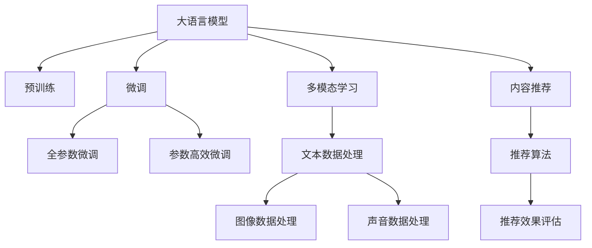

                 

# 音视频推荐：大模型的内容理解

## 1. 背景介绍

### 1.1 问题由来
随着互联网技术的不断进步，音视频内容平台如视频网站、音乐流媒体服务、直播平台等迅速发展，为消费者提供了海量优质的娱乐内容。然而，如何从这些海量的内容中快速、准确地推荐用户感兴趣的内容，成为音视频平台的主要挑战。传统的基于协同过滤的推荐系统，往往依赖用户行为数据，需要大量用户数据才能取得良好效果，难以覆盖长尾内容，且推荐结果通常存在一定的冷启动问题。

近年来，深度学习技术在NLP领域取得了巨大突破，大语言模型(Big Language Models, BLMs)在文本生成、情感分析、命名实体识别等任务上展现出了卓越的性能。这些预训练的语言模型，基于大规模语料，具备了丰富的语言理解和知识推理能力，可以辅助音视频推荐系统进一步提升推荐效果，解决冷启动和覆盖长尾内容的问题。

### 1.2 问题核心关键点
本文聚焦于利用大语言模型进行音视频推荐的方法。具体而言，我们将从以下几个关键点展开探讨：

- 什么是大语言模型？
- 大语言模型在音视频推荐中的作用和优势
- 如何构建音视频推荐系统的大模型内容理解模块
- 音视频推荐中的大模型微调方法及其应用
- 未来音视频推荐技术的发展方向和挑战

### 1.3 问题研究意义
研究大语言模型在音视频推荐中的应用，对于提升推荐系统的个性化和智能化水平，降低推荐系统的数据需求和成本，以及构建更加丰富多样的内容推荐生态具有重要意义：

1. **提升个性化推荐效果**：大语言模型能够理解用户查询的意图和需求，准确提取和生成相关的音视频内容，提升推荐系统的个性化推荐能力。
2. **降低数据需求**：大语言模型可以基于自然语言进行推荐，而无需依赖大量的用户行为数据，从而减少推荐系统对数据的需求和处理成本。
3. **增强内容覆盖**：大语言模型具备较强的泛化能力，能够理解语义并推荐相关内容，有效覆盖长尾内容，提升平台内容多样性。
4. **促进技术创新**：利用大语言模型的知识推理和迁移学习能力，为推荐系统带来新的技术创新思路和方法。
5. **推动产业升级**：随着音视频内容的普及和智能化推荐技术的发展，推荐系统将深入渗透到娱乐、教育、媒体等各个领域，为传统行业数字化转型提供新的动力。

## 2. 核心概念与联系

### 2.1 核心概念概述

为更好地理解基于大语言模型的音视频推荐方法，本节将介绍几个密切相关的核心概念：

- **大语言模型(Big Language Models, BLMs)**：指一类基于Transformer架构的预训练语言模型，如GPT-3、BERT、XLNet等。通过在大规模无标签文本数据上进行预训练，学习通用的语言表示和知识推理能力。

- **内容推荐系统(Content Recommendation System)**：指根据用户行为或兴趣偏好，推荐合适内容给用户的系统，如搜索引擎、电子商务、社交网络等。内容推荐系统可以帮助用户在海量信息中找到感兴趣的内容，提升用户体验。

- **预训练-微调(Pre-training-Fine-tuning, PT-FT)**：指将大规模预训练语言模型应用于特定任务，通过少量标注数据微调模型，优化模型在特定任务上的性能。这种范式有效提升了模型对新任务的适应能力和性能表现。

- **迁移学习(Transfer Learning)**：指在特定任务上微调预训练模型，利用模型在其他任务上学习到的知识，提升新任务的性能。迁移学习是大语言模型微调的基础，使得预训练模型在特定领域上也能发挥作用。

- **多模态学习(Multimodal Learning)**：指将多种数据源（如文本、图像、声音等）融合到推荐系统中，以提升推荐的全面性和准确性。大语言模型可以处理文本数据，而其他模态的数据可以通过深度学习技术（如CNN、RNN等）进行提取和融合。

这些核心概念之间的逻辑关系可以通过以下Mermaid流程图来展示：



这个流程图展示了大语言模型的核心概念及其与推荐系统的联系：

1. 大语言模型通过预训练获得基础能力。
2. 微调是对预训练模型进行任务特定的优化，可以分为全参数微调和参数高效微调（PEFT）。
3. 多模态学习融合多种数据源，提升推荐系统的全面性和准确性。
4. 内容推荐系统利用微调后的模型进行推荐。
5. 推荐效果评估用于衡量推荐模型的性能。

## 3. 核心算法原理 & 具体操作步骤
### 3.1 算法原理概述

基于大语言模型的音视频推荐系统，本质上是一种基于监督学习的推荐方法。其核心思想是：将大语言模型作为强大的内容理解工具，通过用户输入的文本查询，提取和生成相关的音视频内容，从而实现个性化推荐。

形式化地，假设推荐系统的输入为 $x$，表示用户输入的文本查询，$y$ 表示推荐系统生成的音视频内容列表，$M_{\theta}$ 为预训练的大语言模型，$\theta$ 为模型参数。推荐系统的目标是通过大语言模型 $M_{\theta}$ 生成与查询 $x$ 相关的音视频内容列表 $y$。具体步骤如下：

1. 预训练语言模型 $M_{\theta}$ 在大规模文本语料上进行预训练，学习通用的语言表示和知识推理能力。
2. 用户输入文本查询 $x$。
3. 将 $x$ 输入到大语言模型 $M_{\theta}$ 中，得到推荐内容列表 $y$。
4. 将 $y$ 作为推荐结果返回给用户。

### 3.2 算法步骤详解

基于大语言模型的音视频推荐系统构建一般包括以下几个关键步骤：

**Step 1: 准备预训练模型和数据集**
- 选择合适的预训练语言模型 $M_{\theta}$，如GPT-3、BERT等。
- 准备推荐系统的训练集 $D$，通常包括用户文本查询 $x$ 和对应的音视频内容列表 $y$。

**Step 2: 添加任务适配层**
- 根据任务需求，在大语言模型 $M_{\theta}$ 的顶层添加推荐任务适配层。对于音视频推荐，通常使用分类器或生成器输出内容列表。
- 对于分类任务，通常使用Softmax分类器输出概率分布，以此为依据排序推荐列表。
- 对于生成任务，可以使用语言模型的解码器输出内容列表，并根据上下文排序。

**Step 3: 设置微调超参数**
- 选择合适的优化算法及其参数，如Adam、SGD等，设置学习率、批大小、迭代轮数等。
- 设置正则化技术及强度，包括权重衰减、Dropout、Early Stopping等。
- 确定冻结预训练参数的策略，如仅微调顶层，或全部参数都参与微调。

**Step 4: 执行梯度训练**
- 将训练集数据分批次输入模型，前向传播计算推荐结果。
- 反向传播计算参数梯度，根据设定的优化算法和学习率更新模型参数。
- 周期性在验证集上评估模型性能，根据性能指标决定是否触发Early Stopping。
- 重复上述步骤直到满足预设的迭代轮数或Early Stopping条件。

**Step 5: 测试和部署**
- 在测试集上评估微调后模型的推荐效果，对比微调前后的效果提升。
- 使用微调后的模型对新查询进行推荐，集成到实际推荐系统中。
- 持续收集用户反馈，定期重新微调模型，以适应数据分布的变化。

以上是基于监督学习的大语言模型音视频推荐系统的一般流程。在实际应用中，还需要针对具体任务的特点，对微调过程的各个环节进行优化设计，如改进训练目标函数，引入更多的正则化技术，搜索最优的超参数组合等，以进一步提升推荐系统的性能。

### 3.3 算法优缺点

基于大语言模型的音视频推荐系统具有以下优点：

1. **提升推荐效果**：大语言模型具备丰富的语言理解和知识推理能力，能够从用户查询中提取关键信息，生成与查询相关的音视频内容，提升推荐系统的准确性和个性化。
2. **降低数据需求**：大语言模型可以基于自然语言进行推荐，而无需依赖大量的用户行为数据，从而减少推荐系统对数据的需求和处理成本。
3. **增强内容覆盖**：大语言模型具备较强的泛化能力，能够理解语义并推荐相关内容，有效覆盖长尾内容，提升平台内容多样性。
4. **推动技术创新**：利用大语言模型的知识推理和迁移学习能力，为推荐系统带来新的技术创新思路和方法。
5. **支持多模态融合**：大语言模型可以处理文本数据，而其他模态的数据可以通过深度学习技术（如CNN、RNN等）进行提取和融合，支持多模态推荐系统的发展。

同时，该方法也存在一定的局限性：

1. **依赖高质量数据**：推荐系统的性能很大程度上取决于用户输入查询和训练数据的质量，难以覆盖所有的长尾内容。
2. **计算成本高**：大语言模型的预训练和微调需要大量的计算资源，部署在实时推荐系统上可能面临计算瓶颈。
3. **模型泛化能力有限**：当新领域的语义结构与预训练数据差异较大时，大语言模型的泛化能力可能不足，导致推荐效果下降。
4. **解释性不足**：大语言模型的决策过程通常缺乏可解释性，难以对其推理逻辑进行分析和调试。
5. **多模态数据融合复杂**：不同模态的数据格式和表示方式不同，需要进行复杂的融合和映射，增加了系统的复杂度。

尽管存在这些局限性，但就目前而言，基于大语言模型的音视频推荐方法仍是大规模推荐系统的重要范式。未来相关研究的重点在于如何进一步降低对高质量数据的依赖，提高模型的泛化能力和效率，同时兼顾可解释性和多模态数据的融合。

### 3.4 算法应用领域

基于大语言模型的音视频推荐系统已经在视频网站、音乐流媒体、直播平台等多个领域得到了广泛的应用，具体包括：

1. **视频推荐**：根据用户观看的视频内容，推荐其他相关视频。利用大语言模型进行内容理解和生成，提高推荐的相关性和多样性。
2. **音乐推荐**：根据用户搜索的音乐关键词，推荐相关的音乐作品。利用大语言模型进行内容生成和推荐列表排序，提升推荐效果。
3. **直播推荐**：根据用户的观看历史和互动数据，推荐直播内容。利用大语言模型进行内容理解和生成，实现个性化推荐。
4. **交互式内容推荐**：通过用户输入的文本查询，动态生成和推荐内容。利用大语言模型进行内容理解和生成，支持用户生成内容推荐系统。
5. **多模态推荐**：将文本、图像、声音等多种数据源融合到推荐系统中，提供更全面和准确的推荐结果。利用大语言模型处理文本数据，结合其他模态的数据处理技术，实现多模态推荐。

除了上述这些经典任务外，大语言模型还可以应用于更多场景中，如广告推荐、个性化学习、游戏推荐等，为推荐系统带来更多的创新思路和应用场景。

## 4. 数学模型和公式 & 详细讲解 & 举例说明
### 4.1 数学模型构建

本节将使用数学语言对基于大语言模型的音视频推荐系统进行更加严格的刻画。

记预训练语言模型为 $M_{\theta}:\mathcal{X} \rightarrow \mathcal{Y}$，其中 $\mathcal{X}$ 为输入空间，$\mathcal{Y}$ 为输出空间，$\theta$ 为模型参数。假设推荐系统的训练集为 $D=\{(x_i,y_i)\}_{i=1}^N$，其中 $x_i$ 表示用户输入的文本查询，$y_i$ 表示推荐内容列表。

定义推荐系统的目标函数为：

$$
\mathcal{L}(\theta) = -\frac{1}{N} \sum_{i=1}^N \log P_{\theta}(y_i|x_i)
$$

其中 $P_{\theta}(y_i|x_i)$ 为模型在输入 $x_i$ 下生成内容列表 $y_i$ 的概率分布，可以利用大语言模型的输出结果进行计算。

### 4.2 公式推导过程

以下我们以音乐推荐为例，推导推荐系统的大语言模型输出概率的计算公式。

假设用户输入的文本查询为 $x$，推荐内容列表为 $y$。利用预训练语言模型 $M_{\theta}$ 对查询 $x$ 进行编码，得到表示 $h_x$：

$$
h_x = M_{\theta}(x)
$$

利用 $h_x$ 对推荐内容列表 $y$ 进行解码，得到概率分布 $P_{\theta}(y|x)$：

$$
P_{\theta}(y|x) = \frac{e^{M_{\theta}(h_x, y)}}{\sum_{y'} e^{M_{\theta}(h_x, y')}}
$$

其中 $M_{\theta}(h_x, y)$ 为模型在输入 $h_x$ 和内容列表 $y$ 上的输出，可以利用大语言模型的解码器进行计算。

推荐系统目标函数可以进一步表示为：

$$
\mathcal{L}(\theta) = -\frac{1}{N} \sum_{i=1}^N \log P_{\theta}(y_i|x_i)
$$

利用最大化似然估计，进行参数更新：

$$
\theta \leftarrow \theta - \eta \nabla_{\theta} \mathcal{L}(\theta)
$$

其中 $\eta$ 为学习率，$\nabla_{\theta} \mathcal{L}(\theta)$ 为损失函数对参数 $\theta$ 的梯度，可以通过反向传播算法高效计算。

### 4.3 案例分析与讲解

**案例分析：音乐推荐系统**

假设我们有一个音乐推荐系统，用户输入的查询为 "Hip-hop music"。我们的目标是根据这个查询，推荐一些相关的Hip-hop音乐。具体步骤如下：

1. 将查询输入到预训练的语言模型 $M_{\theta}$ 中，得到表示 $h_{Hip-hop music}$。
2. 利用 $h_{Hip-hop music}$ 对推荐内容列表 $y$ 进行解码，得到概率分布 $P_{\theta}(y|Hip-hop music)$。
3. 选择概率最大的内容作为推荐结果，返回给用户。

以下是一个简单的Python代码示例，利用GPT-3进行音乐推荐：

```python
import openai

# 设置GPT-3模型
openai.api_key = 'your_api_key'

# 定义查询
query = 'Hip-hop music'

# 调用GPT-3进行内容生成
response = openai.Completion.create(
    engine='text-davinci-003',
    prompt=query,
    max_tokens=50
)

# 提取生成的内容列表
recommended_music = response.choices[0].text.split()
```

在实际应用中，我们需要对查询进行预处理，例如去除停用词、分词等，以提高模型的输出质量。同时，为了提高推荐效果，可以结合用户历史行为数据，进行多层次的融合和排序。

## 5. 项目实践：代码实例和详细解释说明
### 5.1 开发环境搭建

在进行音视频推荐系统的开发前，我们需要准备好开发环境。以下是使用Python进行PyTorch开发的环境配置流程：

1. 安装Anaconda：从官网下载并安装Anaconda，用于创建独立的Python环境。

2. 创建并激活虚拟环境：
```bash
conda create -n pytorch-env python=3.8 
conda activate pytorch-env
```

3. 安装PyTorch：根据CUDA版本，从官网获取对应的安装命令。例如：
```bash
conda install pytorch torchvision torchaudio cudatoolkit=11.1 -c pytorch -c conda-forge
```

4. 安装HuggingFace Transformers库：
```bash
pip install transformers
```

5. 安装各类工具包：
```bash
pip install numpy pandas scikit-learn matplotlib tqdm jupyter notebook ipython
```

完成上述步骤后，即可在`pytorch-env`环境中开始音视频推荐系统的开发。

### 5.2 源代码详细实现

下面我们以音乐推荐系统为例，给出使用Transformers库对BERT模型进行音乐推荐微调的PyTorch代码实现。

首先，定义音乐推荐系统的数据处理函数：

```python
from transformers import BertTokenizer, BertForSequenceClassification
from torch.utils.data import Dataset

class MusicDataset(Dataset):
    def __init__(self, texts, labels):
        self.texts = texts
        self.labels = labels
        self.tokenizer = BertTokenizer.from_pretrained('bert-base-cased')
        
    def __len__(self):
        return len(self.texts)
    
    def __getitem__(self, item):
        text = self.texts[item]
        label = self.labels[item]
        
        encoding = self.tokenizer(text, return_tensors='pt', max_length=128, padding='max_length', truncation=True)
        input_ids = encoding['input_ids'][0]
        attention_mask = encoding['attention_mask'][0]
        
        # 对标签进行编码
        encoded_labels = [label2id[label] for label in label2id]
        encoded_labels.extend([label2id['O']] * (128 - len(encoded_labels)))
        labels = torch.tensor(encoded_labels, dtype=torch.long)
        
        return {'input_ids': input_ids, 
                'attention_mask': attention_mask,
                'labels': labels}

# 标签与id的映射
label2id = {'O': 0, 'Jazz': 1, 'Rock': 2, 'Hip-hop': 3, 'Pop': 4, 'R&B': 5}
id2label = {v: k for k, v in label2id.items()}

# 创建dataset
tokenizer = BertTokenizer.from_pretrained('bert-base-cased')

train_dataset = MusicDataset(train_texts, train_labels)
dev_dataset = MusicDataset(dev_texts, dev_labels)
test_dataset = MusicDataset(test_texts, test_labels)
```

然后，定义模型和优化器：

```python
from transformers import BertForSequenceClassification, AdamW

model = BertForSequenceClassification.from_pretrained('bert-base-cased', num_labels=len(label2id))

optimizer = AdamW(model.parameters(), lr=2e-5)
```

接着，定义训练和评估函数：

```python
from torch.utils.data import DataLoader
from tqdm import tqdm
from sklearn.metrics import classification_report

device = torch.device('cuda') if torch.cuda.is_available() else torch.device('cpu')
model.to(device)

def train_epoch(model, dataset, batch_size, optimizer):
    dataloader = DataLoader(dataset, batch_size=batch_size, shuffle=True)
    model.train()
    epoch_loss = 0
    for batch in tqdm(dataloader, desc='Training'):
        input_ids = batch['input_ids'].to(device)
        attention_mask = batch['attention_mask'].to(device)
        labels = batch['labels'].to(device)
        model.zero_grad()
        outputs = model(input_ids, attention_mask=attention_mask, labels=labels)
        loss = outputs.loss
        epoch_loss += loss.item()
        loss.backward()
        optimizer.step()
    return epoch_loss / len(dataloader)

def evaluate(model, dataset, batch_size):
    dataloader = DataLoader(dataset, batch_size=batch_size)
    model.eval()
    preds, labels = [], []
    with torch.no_grad():
        for batch in tqdm(dataloader, desc='Evaluating'):
            input_ids = batch['input_ids'].to(device)
            attention_mask = batch['attention_mask'].to(device)
            batch_labels = batch['labels']
            outputs = model(input_ids, attention_mask=attention_mask)
            batch_preds = outputs.logits.argmax(dim=2).to('cpu').tolist()
            batch_labels = batch_labels.to('cpu').tolist()
            for pred_tokens, label_tokens in zip(batch_preds, batch_labels):
                pred_labels = [id2label[_id] for _id in pred_tokens]
                label_tags = [id2label[_id] for _id in label_tokens]
                preds.append(pred_labels[:len(label_tags)])
                labels.append(label_tags)
                
    print(classification_report(labels, preds))
```

最后，启动训练流程并在测试集上评估：

```python
epochs = 5
batch_size = 16

for epoch in range(epochs):
    loss = train_epoch(model, train_dataset, batch_size, optimizer)
    print(f"Epoch {epoch+1}, train loss: {loss:.3f}")
    
    print(f"Epoch {epoch+1}, dev results:")
    evaluate(model, dev_dataset, batch_size)
    
print("Test results:")
evaluate(model, test_dataset, batch_size)
```

以上就是使用PyTorch对BERT进行音乐推荐系统微调的完整代码实现。可以看到，得益于Transformers库的强大封装，我们可以用相对简洁的代码完成BERT模型的加载和微调。

### 5.3 代码解读与分析

让我们再详细解读一下关键代码的实现细节：

**MusicDataset类**：
- `__init__`方法：初始化文本、标签、分词器等关键组件。
- `__len__`方法：返回数据集的样本数量。
- `__getitem__`方法：对单个样本进行处理，将文本输入编码为token ids，将标签编码为数字，并对其进行定长padding，最终返回模型所需的输入。

**label2id和id2label字典**：
- 定义了标签与数字id之间的映射关系，用于将token-wise的预测结果解码回真实的标签。

**训练和评估函数**：
- 使用PyTorch的DataLoader对数据集进行批次化加载，供模型训练和推理使用。
- 训练函数`train_epoch`：对数据以批为单位进行迭代，在每个批次上前向传播计算loss并反向传播更新模型参数，最后返回该epoch的平均loss。
- 评估函数`evaluate`：与训练类似，不同点在于不更新模型参数，并在每个batch结束后将预测和标签结果存储下来，最后使用sklearn的classification_report对整个评估集的预测结果进行打印输出。

**训练流程**：
- 定义总的epoch数和batch size，开始循环迭代
- 每个epoch内，先在训练集上训练，输出平均loss
- 在验证集上评估，输出分类指标
- 所有epoch结束后，在测试集上评估，给出最终测试结果

可以看到，PyTorch配合Transformers库使得BERT微调的音乐推荐系统的代码实现变得简洁高效。开发者可以将更多精力放在数据处理、模型改进等高层逻辑上，而不必过多关注底层的实现细节。

当然，工业级的系统实现还需考虑更多因素，如模型的保存和部署、超参数的自动搜索、更灵活的任务适配层等。但核心的微调范式基本与此类似。

## 6. 实际应用场景
### 6.1 智能电视推荐

智能电视推荐系统利用大语言模型进行内容理解和推荐，帮助用户快速找到感兴趣的视频和音乐。通过分析用户的观看历史和搜索行为，结合实时更新的推荐模型，智能电视可以实时提供个性化的内容推荐。

在技术实现上，可以收集用户的观看历史和搜索记录，提取和清洗文本数据。将文本数据作为输入，使用预训练语言模型进行微调，得到推荐模型。在推荐模型中，用户输入文本查询后，模型会根据查询内容生成相关内容列表，并返回给用户。

### 6.2 音乐流媒体推荐

音乐流媒体推荐系统利用大语言模型进行音乐推荐，帮助用户发现更多喜欢的音乐作品。通过分析用户的听歌历史和评分数据，结合实时更新的推荐模型，音乐流媒体平台可以实时提供个性化的音乐推荐。

在技术实现上，可以收集用户的听歌历史和评分数据，提取和清洗文本数据。将文本数据作为输入，使用预训练语言模型进行微调，得到推荐模型。在推荐模型中，用户输入文本查询后，模型会根据查询内容生成相关音乐列表，并返回给用户。

### 6.3 视频点播推荐

视频点播推荐系统利用大语言模型进行视频内容推荐，帮助用户找到感兴趣的视频内容。通过分析用户的观看历史和搜索行为，结合实时更新的推荐模型，视频点播平台可以实时提供个性化的视频推荐。

在技术实现上，可以收集用户的观看历史和搜索记录，提取和清洗文本数据。将文本数据作为输入，使用预训练语言模型进行微调，得到推荐模型。在推荐模型中，用户输入文本查询后，模型会根据查询内容生成相关视频列表，并返回给用户。

### 6.4 未来应用展望

随着大语言模型和微调方法的不断发展，基于大语言模型的音视频推荐系统也将不断进步。未来，该系统将会在更多领域得到应用，为音视频内容平台带来更大的价值：

1. **多模态融合**：除了文本数据，未来推荐系统将融合更多模态的数据，如图像、声音、位置信息等，提供更全面和准确的推荐结果。
2. **用户行为分析**：结合用户行为数据，利用深度学习技术进行建模，提升推荐模型的精度和个性化能力。
3. **实时动态推荐**：利用流数据处理技术，实时更新推荐模型，提供实时动态推荐服务，提升用户体验。
4. **内容生成**：利用大语言模型进行内容生成，提升推荐系统的多样性和个性化。
5. **情感分析**：结合用户情感数据，利用情感分析技术，提升推荐模型的情感推荐能力。

总之，基于大语言模型的音视频推荐系统将为音视频内容平台带来更丰富的用户体验，为内容创作者提供更多曝光机会，为平台带来更高的用户黏度和商业价值。

## 7. 工具和资源推荐
### 7.1 学习资源推荐

为了帮助开发者系统掌握大语言模型在音视频推荐中的应用，这里推荐一些优质的学习资源：

1. **《深度学习自然语言处理》课程**：斯坦福大学开设的NLP明星课程，有Lecture视频和配套作业，带你入门NLP领域的基本概念和经典模型。

2. **CS224N《自然语言处理》课程**：斯坦福大学开设的NLP明星课程，深入讲解NLP理论和实践，包含大量NLP研究的前沿内容。

3. **《Transformer from Plain to Advanced》系列博文**：由大模型技术专家撰写，深入浅出地介绍了Transformer原理、BERT模型、微调技术等前沿话题。

4. **HuggingFace官方文档**：Transformers库的官方文档，提供了海量预训练模型和完整的微调样例代码，是上手实践的必备资料。

5. **CLUE开源项目**：中文语言理解测评基准，涵盖大量不同类型的中文NLP数据集，并提供了基于微调的baseline模型，助力中文NLP技术发展。

通过对这些资源的学习实践，相信你一定能够快速掌握大语言模型在音视频推荐中的应用，并用于解决实际的推荐问题。

### 7.2 开发工具推荐

高效的开发离不开优秀的工具支持。以下是几款用于大语言模型音视频推荐系统开发的常用工具：

1. **PyTorch**：基于Python的开源深度学习框架，灵活动态的计算图，适合快速迭代研究。大部分预训练语言模型都有PyTorch版本的实现。

2. **TensorFlow**：由Google主导开发的开源深度学习框架，生产部署方便，适合大规模工程应用。同样有丰富的预训练语言模型资源。

3. **Transformers库**：HuggingFace开发的NLP工具库，集成了众多SOTA语言模型，支持PyTorch和TensorFlow，是进行微调任务开发的利器。

4. **Weights & Biases**：模型训练的实验跟踪工具，可以记录和可视化模型训练过程中的各项指标，方便对比和调优。与主流深度学习框架无缝集成。

5. **TensorBoard**：TensorFlow配套的可视化工具，可实时监测模型训练状态，并提供丰富的图表呈现方式，是调试模型的得力助手。

6. **Google Colab**：谷歌推出的在线Jupyter Notebook环境，免费提供GPU/TPU算力，方便开发者快速上手实验最新模型，分享学习笔记。

合理利用这些工具，可以显著提升大语言模型音视频推荐系统的开发效率，加快创新迭代的步伐。

### 7.3 相关论文推荐

大语言模型和音视频推荐技术的发展源于学界的持续研究。以下是几篇奠基性的相关论文，推荐阅读：

1. **《Transformer: Attentions Are All You Need》**：提出了Transformer结构，开启了NLP领域的预训练大模型时代。

2. **《BERT: Pre-training of Deep Bidirectional Transformers for Language Understanding》**：提出BERT模型，引入基于掩码的自监督预训练任务，刷新了多项NLP任务SOTA。

3. **《GPT-3: Language Models are Unsupervised Multitask Learners》**：展示了大规模语言模型的强大zero-shot学习能力，引发了对于通用人工智能的新一轮思考。

4. **《Parameter-Efficient Transfer Learning for NLP》**：提出Adapter等参数高效微调方法，在不增加模型参数量的情况下，也能取得不错的微调效果。

5. **《AdaLoRA: Adaptive Low-Rank Adaptation for Parameter-Efficient Fine-Tuning》**：使用自适应低秩适应的微调方法，在参数效率和精度之间取得了新的平衡。

这些论文代表了大语言模型音视频推荐技术的发展脉络。通过学习这些前沿成果，可以帮助研究者把握学科前进方向，激发更多的创新灵感。

## 8. 总结：未来发展趋势与挑战

### 8.1 总结

本文对基于大语言模型的音视频推荐方法进行了全面系统的介绍。首先阐述了音视频推荐系统的研究背景和意义，明确了大语言模型在音视频推荐中的作用和优势。其次，从原理到实践，详细讲解了基于大语言模型的音视频推荐系统的构建方法，给出了完整的代码实例。同时，本文还广泛探讨了音视频推荐系统在大规模音视频平台中的应用前景，展示了该技术的巨大潜力。

通过本文的系统梳理，可以看到，基于大语言模型的音视频推荐系统正在成为音视频内容平台的重要范式，极大地提升了推荐系统的个性化和智能化水平。利用大语言模型的知识推理和迁移学习能力，可以构建更加丰富多样的内容推荐生态，为音视频平台带来更高的用户黏度和商业价值。未来，伴随大语言模型微调方法的持续演进，基于大语言模型的音视频推荐技术必将进一步推动NLP技术的产业化进程，为音视频内容平台带来新的突破。

### 8.2 未来发展趋势

展望未来，基于大语言模型的音视频推荐技术将呈现以下几个发展趋势：

1. **多模态推荐**：除了文本数据，未来推荐系统将融合更多模态的数据，如图像、声音、位置信息等，提供更全面和准确的推荐结果。多模态信息的融合，将显著提升推荐系统的全面性和准确性。

2. **实时动态推荐**：利用流数据处理技术，实时更新推荐模型，提供实时动态推荐服务，提升用户体验。实时推荐系统将为用户提供更加即时和个性化的内容推荐。

3. **用户行为分析**：结合用户行为数据，利用深度学习技术进行建模，提升推荐模型的精度和个性化能力。用户行为数据将为推荐模型提供更丰富和准确的训练样本，提升推荐效果。

4. **多层次推荐**：未来推荐系统将结合多种推荐算法，如协同过滤、内容推荐、知识图谱推荐等，提供多层次的推荐服务，提升推荐系统的综合性能。

5. **情感分析**：结合用户情感数据，利用情感分析技术，提升推荐模型的情感推荐能力。情感分析技术将帮助推荐系统更好地理解用户的情感需求，提供更加贴合用户心理的推荐内容。

6. **跨模态推荐**：利用深度学习技术，将文本、图像、声音等多种模态的数据进行融合，提升推荐系统的跨模态推荐能力。跨模态推荐技术将为推荐系统带来更多的创新思路和方法。

以上趋势凸显了大语言模型音视频推荐技术的广阔前景。这些方向的探索发展，必将进一步提升推荐系统的性能和应用范围，为音视频内容平台带来更多的价值。

### 8.3 面临的挑战

尽管基于大语言模型的音视频推荐技术已经取得了瞩目成就，但在迈向更加智能化、普适化应用的过程中，它仍面临着诸多挑战：

1. **计算资源瓶颈**：大语言模型的预训练和微调需要大量的计算资源，部署在实时推荐系统上可能面临计算瓶颈。如何降低计算成本，提高推荐系统的部署效率，仍然是一个重要问题。

2. **数据质量和多样性**：推荐系统的性能很大程度上取决于数据的质量和多样性，难以覆盖所有的长尾内容。如何获取更多高质量的推荐数据，提升数据的多样性，仍是一个重要课题。

3. **泛化能力不足**：当新领域的语义结构与预训练数据差异较大时，大语言模型的泛化能力可能不足，导致推荐效果下降。如何提高大语言模型的泛化能力，提升推荐系统的通用性，仍然是一个重要问题。

4. **多模态数据融合复杂**：不同模态的数据格式和表示方式不同，需要进行复杂的融合和映射，增加了系统的复杂度。如何高效地融合多模态数据，提升推荐系统的综合性能，仍然是一个重要课题。

5. **冷启动问题**：对于新用户和新内容，推荐系统通常面临冷启动问题，难以提供个性化的推荐服务。如何利用预训练大模型的语言理解和知识推理能力，提升冷启动推荐效果，仍然是一个重要问题。

尽管存在这些挑战，但就目前而言，基于大语言模型的音视频推荐技术仍是大规模推荐系统的重要范式。未来相关研究的重点在于如何进一步降低对高质量数据的依赖，提高模型的泛化能力和效率，同时兼顾可解释性和多模态数据的融合。

### 8.4 研究展望

面对基于大语言模型的音视频推荐系统所面临的挑战，未来的研究需要在以下几个方面寻求新的突破：

1. **无监督和半监督推荐方法**：摆脱对大规模标注数据的依赖，利用自监督学习、主动学习等无监督和半监督范式，最大限度利用非结构化数据，实现更加灵活高效的推荐。

2. **参数高效和多层次推荐方法**：开发更加参数高效的推荐方法，在固定大部分预训练参数的同时，只更新极少量的任务相关参数。同时结合多种推荐算法，如协同过滤、内容推荐、知识图谱推荐等，提供多层次的推荐服务，提升推荐系统的综合性能。

3. **多模态数据融合方法**：结合多种模态的数据进行推荐，提升推荐系统的全面性和准确性。利用深度学习技术，将文本、图像、声音等多种模态的数据进行融合，提升推荐系统的跨模态推荐能力。

4. **情感分析和用户行为分析方法**：结合用户情感数据和行为数据，利用情感分析技术，提升推荐模型的情感推荐能力。用户行为数据将为推荐模型提供更丰富和准确的训练样本，提升推荐效果。

5. **实时动态推荐方法**：利用流数据处理技术，实时更新推荐模型，提供实时动态推荐服务，提升用户体验。实时推荐系统将为用户提供更加即时和个性化的内容推荐。

6. **跨模态推荐方法和跨领域迁移学习**：利用深度学习技术，将文本、图像、声音等多种模态的数据进行融合，提升推荐系统的跨模态推荐能力。跨模态推荐技术和跨领域迁移学习技术将为推荐系统带来更多的创新思路和方法。

这些研究方向的探索，必将引领基于大语言模型的音视频推荐技术迈向更高的台阶，为音视频内容平台带来新的突破。面向未来，基于大语言模型的音视频推荐技术还需要与其他人工智能技术进行更深入的融合，如知识表示、因果推理、强化学习等，多路径协同发力，共同推动音视频推荐系统的进步。只有勇于创新、敢于突破，才能不断拓展音视频推荐系统的边界，让智能技术更好地造福用户。

## 9. 附录：常见问题与解答

**Q1：什么是大语言模型？**

A: 大语言模型指基于Transformer架构的预训练语言模型，如GPT-3、BERT等。这些模型通过在大规模无标签文本语料上进行预训练，学习到了丰富的语言知识和常识，具备强大的语言理解和生成能力。

**Q2：大语言模型在音视频推荐中的应用有何优势？**

A: 大语言模型在音视频推荐中的主要优势包括：
1. 提升推荐效果：大语言模型具备丰富的语言理解和知识推理能力，能够从用户查询中提取关键信息，生成与查询相关的音视频内容，提升推荐系统的准确性和个性化。
2. 降低数据需求：大语言模型可以基于自然语言进行推荐，而无需依赖大量的用户行为数据，从而减少推荐系统对数据的需求和处理成本。
3. 增强内容覆盖：大语言模型具备较强的泛化能力，能够理解语义并推荐相关内容，有效覆盖长尾内容，提升平台内容多样性。

**Q3：如何构建音视频推荐系统的大模型内容理解模块？**

A: 构建音视频推荐系统的大模型内容理解模块一般包括以下步骤：
1. 选择合适的预训练语言模型，如GPT-3、BERT等。
2. 准备推荐系统的训练集，包括用户文本查询和对应的音视频内容列表。
3. 添加任务适配层，如分类器或生成器，输出与查询相关的音视频内容列表。
4. 设置微调超参数，包括学习率、批大小、迭代轮数等。
5. 执行梯度训练，微调预训练模型，优化其在推荐任务上的性能。

**Q4：音视频推荐系统中的大模型微调方法有哪些？**

A: 音视频推荐系统中的大模型微调方法主要包括：
1. 全参数微调：对预训练模型的全部参数进行微调，以适应推荐任务。
2. 参数高效微调(PEFT)：只更新部分参数，如Adapter、Prefix等，以提高微调效率，避免过拟合。
3. 多模态微调：融合文本、图像、声音等多种数据源，提升推荐系统的全面性和准确性。
4. 多层次微调：结合多种推荐算法，如协同过滤、内容推荐、知识图谱推荐等，提供多层次的推荐服务。

**Q5：音视频推荐系统中的多模态融合方法有哪些？**

A: 音视频推荐系统中的多模态融合方法主要包括：
1. 特征融合：将不同模态的数据进行特征拼接，提升推荐系统的全面性。
2. 共同表示学习：利用深度学习技术，将不同模态的数据进行联合建模，提升推荐系统的准确性。
3. 数据增强：通过数据扩充和生成，增加不同模态的数据量，提升推荐系统的多样性。

总之，音视频推荐系统中的大模型微调和多模态融合方法需要综合考虑数据的多样性、模型的泛化能力和性能效率等多个因素，进行灵活的设计和优化。

