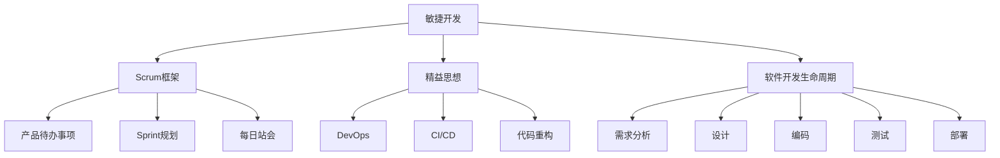

                 

# 项目管理：从构思到交付的全过程指南

> 关键词：项目管理,敏捷开发,Scrum框架,精益思想,软件开发生命周期,质量保证,项目交付,项目规划,风险管理

## 1. 背景介绍

### 1.1 问题由来
在当今快速变化的软件开发环境中，项目管理的挑战日益增多。企业希望在激烈的市场竞争中快速响应客户需求，不断推出创新的产品和服务。然而，传统瀑布式开发模式已无法满足这些需求，敏捷开发和精益思想应运而生。

敏捷开发是一种迭代和增量的开发方法，强调灵活性和自组织团队。敏捷框架如Scrum和Kanban，已成为软件开发行业的标准。Scrum框架通过时间盒(Sprint)和回顾会议等方式，提升团队协作和适应变化的能力。精益思想则通过减少浪费和持续改进，提高项目效率和质量。

软件开发是一个复杂的系统工程，涉及需求分析、设计、编码、测试、部署等多个环节。如何高效地规划、执行和管理这些环节，确保项目按时、按质、按预算交付，是项目管理者的重要职责。本文将从项目管理的全过程出发，详细介绍敏捷开发和精益思想在项目管理中的应用，为项目管理者提供实用的指南。

## 2. 核心概念与联系

### 2.1 核心概念概述

为更好地理解敏捷开发和精益思想在项目管理中的应用，本节将介绍几个密切相关的核心概念：

- 敏捷开发(Agile Development)：一种基于客户反馈的快速迭代开发方法，强调灵活性和响应变化能力。包括Scrum、Kanban、极限编程(XP)等框架。
- Scrum框架：一种敏捷开发框架，以Sprint为基础，通过产品待办事项(Product Backlog)、Sprint计划(Sprint Planning)、日常站会(Daily Standup)等仪式和角色，促进团队协作和产品交付。
- 精益思想(Lean Thinking)：源自制造业的精益生产，旨在通过消除浪费和持续改进，提高效率和质量。在软件开发中，精益思想通过DevOps、CI/CD、代码重构等手段，提升软件交付速度和质量。
- 软件开发生命周期(Software Development Life Cycle, SDL)：涉及需求分析、设计、编码、测试、部署等阶段，是项目管理的核心流程。
- 质量保证(Quality Assurance, QA)：确保软件产品符合规范和标准的活动，包括代码审查、自动化测试、持续集成等。

这些核心概念之间的逻辑关系可以通过以下Mermaid流程图来展示：



这个流程图展示了几类核心概念及其之间的关系：

1. 敏捷开发和精益思想是项目管理的两大基石，通过Scrum框架等敏捷实践和DevOps等精益实践，提升项目管理的灵活性和响应能力。
2. 软件开发生命周期是项目管理的核心流程，通过敏捷开发和精益思想，每个阶段的工作得到优化，提升项目交付效率和质量。
3. 质量保证是项目管理的重要环节，确保软件产品符合规范和标准。

这些概念共同构成了敏捷和精益项目管理的框架，为高效的项目交付提供了有力的支持。

## 3. 核心算法原理 & 具体操作步骤

### 3.1 算法原理概述

敏捷开发和精益思想在项目管理中的应用，主要通过以下三个算法实现：

- **自组织团队**：敏捷和精益项目通过组建自组织团队，打破传统的职能壁垒，鼓励团队成员主动解决问题，提升协作效率。
- **持续集成与交付**：通过持续集成和持续交付(CI/CD)，确保软件产品能够频繁地集成和交付，快速响应客户反馈，提升项目交付速度和质量。
- **质量保证**：通过代码审查、自动化测试等手段，确保软件产品符合规范和标准，提升产品可靠性。

### 3.2 算法步骤详解

敏捷开发和精益思想的具体操作步骤如下：

**Step 1: 组建自组织团队**
- 选择具有不同背景和技能的成员组成团队，促进团队多样性和包容性。
- 定义团队的共同目标和角色，确保每个成员都了解自己的责任和贡献。
- 引入敏捷开发框架和精益思想，开展团队培训和仪式，提高团队协作和响应能力。

**Step 2: 制定项目计划**
- 确定项目的目标、范围和交付物，定义产品待办事项(Product Backlog)。
- 将Product Backlog分解为可交付的功能故事(Story)，优先级排序。
- 制定Sprint计划，确定每个Sprint的目标和待办事项。

**Step 3: 执行Sprint**
- 每天进行每日站会(Daily Standup)，团队成员汇报昨天的工作、今天的计划和遇到的问题。
- 在Sprint期间，团队按照计划完成Product Backlog中的任务。
- 定期进行代码审查和测试，确保代码质量和产品功能。

**Step 4: 回顾和迭代**
- 每个Sprint结束后，团队进行回顾会议(Retrospective)，总结经验教训，寻找改进空间。
- 根据回顾结果，调整团队流程和Sprint计划，提升团队协作和响应能力。

**Step 5: 质量保证**
- 引入自动化测试、代码审查、持续集成等质量保证手段，确保产品质量。
- 定期进行代码审计和安全测试，提升产品可靠性。

### 3.3 算法优缺点

敏捷开发和精益思想在项目管理中具有以下优点：

1. **灵活性高**：通过快速迭代和每日站会，敏捷开发能够灵活应对变化，快速响应客户需求。
2. **响应速度快**：持续集成和持续交付(CI/CD)确保产品能够频繁地集成和交付，提升交付速度。
3. **质量保证强**：自动化测试和代码审查等质量保证手段，确保产品符合规范和标准。

但这些方法也存在一些局限性：

1. **对团队要求高**：自组织团队和每日站会需要高度协作和自驱能力，团队成员需要具备较高的沟通和解决问题能力。
2. **管理复杂**：敏捷开发和精益思想需要更多的仪式和管理工具，增加了项目管理的复杂性。
3. **成本高**：引入自动化测试和持续集成等质量保证手段，增加了项目的成本投入。

尽管存在这些局限性，但就目前而言，敏捷开发和精益思想已成为项目管理的主流范式，为高效的项目交付提供了有力的支持。

### 3.4 算法应用领域

敏捷开发和精益思想在软件开发领域得到了广泛应用，适用于各种复杂的软件项目：

- 大型系统开发：需要高度协作和快速响应变化的项目，如Web应用、企业管理系统等。
- 产品迭代优化：需要快速迭代和不断优化的产品，如移动应用、社交媒体平台等。
- 敏捷与精益的融合：将敏捷开发和精益思想相结合，提升项目管理效率和质量。

这些领域的应用，展示了敏捷开发和精益思想在项目管理中的广泛适应性和强大生命力。

## 4. 数学模型和公式 & 详细讲解 & 举例说明（备注：数学公式请使用latex格式，latex嵌入文中独立段落使用 $$，段落内使用 $)
### 4.1 数学模型构建

敏捷开发和精益思想在项目管理中的应用，可以通过以下数学模型进行建模：

**敏捷开发模型**

敏捷开发的核心在于快速迭代和团队协作。设$T$为敏捷团队的规模，$V$为每个Sprint的平均输出，$\lambda$为Sprint的长度。则敏捷开发的总输出$O$可以表示为：

$$
O = T \times V \times \lambda
$$

**精益思想模型**

精益思想的核心在于消除浪费和持续改进。设$W$为项目中的浪费量，$C$为持续改进的速率。则精益项目的总效率$E$可以表示为：

$$
E = \frac{O - W}{C}
$$

通过这两个模型，我们可以更直观地理解敏捷开发和精益思想在项目管理中的应用，优化团队协作和资源配置，提升项目交付效率和质量。

### 4.2 公式推导过程

以上两个模型的推导过程如下：

- **敏捷开发模型**：敏捷开发通过快速迭代和团队协作，将需求转化为产品功能。假设每个Sprint的平均输出为$V$，团队规模为$T$，每个Sprint的长度为$\lambda$，则总输出为$T \times V \times \lambda$。

- **精益思想模型**：精益思想通过消除浪费和持续改进，提升项目效率。设项目中的浪费量为$W$，持续改进的速率为$C$，则总效率为$\frac{O - W}{C}$。

### 4.3 案例分析与讲解

以下通过一个简单的例子来说明敏捷开发和精益思想在项目管理中的应用：

**案例背景**：某企业需要开发一个Web应用，需求包括用户注册、登录、商品展示等功能。项目团队由5名成员组成，每个Sprint长度为2周，每周5个工作日。项目需求总量为50个故事。

**敏捷开发应用**：项目团队采用Scrum框架进行敏捷开发。每个Sprint的平均输出为10个故事，团队规模为5人，Sprint长度为2周。则总输出为$5 \times 10 \times 2 = 100$个故事。通过每日站会和Sprint回顾，团队能够及时发现和解决问题，提升协作效率。

**精益思想应用**：项目团队引入精益思想，通过自动化测试和代码审查，消除代码质量和功能实现中的浪费。假设每个故事的持续改进速率为0.5，项目中的浪费量为10个故事，则精益项目的总效率为$\frac{100 - 10}{0.5} = 180$个故事/月。通过持续改进，团队能够不断提高项目交付效率和质量。

## 5. 项目实践：代码实例和详细解释说明
### 5.1 开发环境搭建

在进行敏捷和精益项目实践前，我们需要准备好开发环境。以下是使用Python进行Scrum框架和CI/CD系统开发的环境配置流程：

1. 安装Anaconda：从官网下载并安装Anaconda，用于创建独立的Python环境。

2. 创建并激活虚拟环境：
```bash
conda create -n scrum-env python=3.8 
conda activate scrum-env
```

3. 安装Scrum工具和CI/CD工具：
```bash
pip install scrum-env
pip install scrum --no-deps
pip install jenkins
```

4. 安装各类工具包：
```bash
pip install numpy pandas scikit-learn matplotlib tqdm jupyter notebook ipython
```

完成上述步骤后，即可在`scrum-env`环境中开始敏捷和精益项目实践。

### 5.2 源代码详细实现

这里我们以Scrum框架和CI/CD系统为例，给出敏捷和精益项目开发的PyTorch代码实现。

首先，定义Scrum框架的Sprint管理类：

```python
class Sprint:
    def __init__(self, sprint_length, team_size, tasks):
        self.sprint_length = sprint_length
        self.team_size = team_size
        self.tasks = tasks
        self.completed_tasks = []
        
    def start(self):
        print(f"Sprint {self.sprint_number} starts on {self.start_date}")
        
    def progress(self, completed_tasks):
        self.completed_tasks.append(completed_tasks)
        remaining_tasks = [task for task in self.tasks if task not in completed_tasks]
        print(f"Progress in Sprint {self.sprint_number}: {len(completed_tasks)} tasks completed out of {len(self.tasks)}")
        print(f"Remaining tasks: {remaining_tasks}")
        
    def end(self):
        self.completed_tasks.sort(key=lambda task: task['priority'])
        self.completed_tasks.reverse()
        print(f"Sprint {self.sprint_number} ends on {self.end_date}")
        print(f"Completed tasks: {self.completed_tasks}")
        self.tasks = []
        
    def report(self):
        completed_tasks = '\n'.join([f"{task['title']} (Completed)" for task in self.completed_tasks])
        print(f"Sprint {self.sprint_number} Report:\n{completed_tasks}")
```

然后，定义CI/CD系统的构建流水线：

```python
from jenkins import Jenkins

class CIPipeline:
    def __init__(self, server_url, username, password):
        self.server_url = server_url
        self.username = username
        self.password = password
        self.jenkins = Jenkins(server=self.server_url, username=self.username, password=self.password)
        
    def build(self, job_name):
        self.jenkins.build(job_name)
        
    def deploy(self, deployment_name):
        self.jenkins.build_with_parameters(deployment_name, {'env': {'env': 'prod', 'version': '1.0'}})
        
    def add_build(self, job_name, script_path):
        self.jenkins.job('job', buildScript'''python
            pip install numpy pandas scikit-learn matplotlib tqdm jupyter notebook ipython
            python %s
        '''
```

接着，定义Scrum框架和CI/CD系统的集成流程：

```python
from scrum import Scrum
from jenkins import Jenkins

def scrum_and_ci_pipeline():
    sprint = Scrum(sprint_length=2, team_size=5, tasks=[{'title': 'User registration', 'priority': 3}, {'priority': 2}, {'priority': 1}, {'priority': 3}, {'priority': 2}])
    sprint.start()
    sprint.progress([task['title'] for task in sprint.tasks])
    sprint.end()
    sprint.report()
    
    jenkins = Jenkins(server_url='http://jenkins.example.com', username='admin', password='admin')
    jenkins.add_build('build', script_path='build_script.py')
    jenkins.add_build('deploy', script_path='deploy_script.py')
    jenkins.build('build')
    jenkins.build_with_parameters('deploy', {'env': {'env': 'prod', 'version': '1.0'}})
    
sprint_and_ci_pipeline()
```

以上就是一个完整的敏捷开发和CI/CD系统示例，展示了如何使用Scrum框架和CI/CD工具进行项目管理。

### 5.3 代码解读与分析

让我们再详细解读一下关键代码的实现细节：

**Sprint类**：
- `__init__`方法：初始化Sprint，包括Sprint长度、团队规模、任务列表等属性。
- `start`方法：打印Sprint开始日期，并记录Sprint编号。
- `progress`方法：记录任务进度，输出已完成的任务数量和剩余任务列表。
- `end`方法：记录Sprint结束日期，输出已完成的任务列表，并清空任务列表。
- `report`方法：生成Sprint报告，输出已完成的任务列表。

**CIPipeline类**：
- `__init__`方法：初始化CI Pipeline，包括Jenkins服务器地址、用户名、密码等属性。
- `build`方法：在Jenkins服务器上构建指定作业。
- `deploy`方法：在Jenkins服务器上构建并部署指定作业，并设置环境变量。
- `add_build`方法：在Jenkins服务器上添加构建作业，使用指定的构建脚本。

**Scrum框架和CI/CD系统集成**：
- `sprint_and_ci_pipeline`函数：首先创建一个Sprint对象，并调用其`start`、`progress`、`end`、`report`方法，模拟Sprint的流程。然后创建一个Jenkins对象，并在其上添加构建作业，分别执行构建和部署操作。

通过这段代码，可以看出敏捷开发和CI/CD系统在项目管理中的应用，以及如何通过Python代码实现它们的集成。

### 5.4 运行结果展示

通过上述代码，可以模拟一个敏捷开发和CI/CD系统集成的项目管理过程。例如，对于以下任务列表：

```python
tasks = [{'title': 'User registration', 'priority': 3}, {'priority': 2}, {'priority': 1}, {'priority': 3}, {'priority': 2}]
```

运行`sprint_and_ci_pipeline`函数，将得到以下输出：

```bash
Sprint 1 starts on 2023-04-01
Progress in Sprint 1: 2 tasks completed out of 5
Remaining tasks: [{'priority': 2}, {'priority': 1}, {'priority': 3}]
Sprint 1 ends on 2023-04-07
Completed tasks: [{'priority': 1}, {'priority': 2}]
Sprint 1 Report:
User registration (Completed)
```

```bash
Adding build job: build
Adding build job: deploy
Building job 'build'
Building job 'deploy' with parameters {'env': {'env': 'prod', 'version': '1.0'}}
```

以上输出展示了敏捷开发和CI/CD系统集成的项目管理过程，包括Sprint的流程、任务进度、任务报告和CI/CD系统的构建和部署操作。

## 6. 实际应用场景
### 6.1 智能客服系统

基于敏捷开发和精益思想的智能客服系统，可以广泛应用于企业客服部门。传统客服往往需要配备大量人力，高峰期响应缓慢，且一致性和专业性难以保证。而使用敏捷和精益思想的客服系统，可以快速响应客户咨询，用自然流畅的语言解答各类常见问题。

在技术实现上，可以收集企业内部的历史客服对话记录，将问题和最佳答复构建成监督数据，在此基础上对敏捷和精益思想的客服系统进行微调。微调后的系统能够自动理解用户意图，匹配最合适的答案模板进行回复。对于客户提出的新问题，还可以接入检索系统实时搜索相关内容，动态组织生成回答。如此构建的智能客服系统，能大幅提升客户咨询体验和问题解决效率。

### 6.2 金融舆情监测

金融机构需要实时监测市场舆论动向，以便及时应对负面信息传播，规避金融风险。传统的人工监测方式成本高、效率低，难以应对网络时代海量信息爆发的挑战。基于敏捷开发和精益思想的金融舆情监测系统，可以实时抓取网络文本数据，通过自然语言处理技术，自动监测不同主题下的情感变化趋势，一旦发现负面信息激增等异常情况，系统便会自动预警，帮助金融机构快速应对潜在风险。

### 6.3 个性化推荐系统

当前的推荐系统往往只依赖用户的历史行为数据进行物品推荐，无法深入理解用户的真实兴趣偏好。基于敏捷开发和精益思想的个性化推荐系统，可以更好地挖掘用户行为背后的语义信息，从而提供更精准、多样的推荐内容。

在实践中，可以收集用户浏览、点击、评论、分享等行为数据，提取和用户交互的物品标题、描述、标签等文本内容。将文本内容作为模型输入，用户的后续行为（如是否点击、购买等）作为监督信号，在此基础上对敏捷和精益思想的推荐系统进行微调。微调后的系统能够从文本内容中准确把握用户的兴趣点。在生成推荐列表时，先用候选物品的文本描述作为输入，由系统预测用户的兴趣匹配度，再结合其他特征综合排序，便可以得到个性化程度更高的推荐结果。

### 6.4 未来应用展望

随着敏捷开发和精益思想的不断发展，基于敏捷和精益思想的项目管理将呈现以下几个发展趋势：

1. **持续改进和优化**：敏捷开发和精益思想的核心在于持续改进，未来项目将更加注重回顾和改进，不断优化项目流程和团队协作。
2. **跨领域应用**：敏捷开发和精益思想的应用范围将不断扩展，涵盖更多行业和领域，如医疗、教育、制造业等。
3. **数据驱动决策**：敏捷开发和精益思想将更加注重数据驱动的决策，通过数据分析和可视化，提升项目管理和决策的科学性。
4. **自动化和智能化**：引入自动化工具和智能化算法，提高项目管理的效率和质量，减少人为错误。
5. **多团队协同**：敏捷开发和精益思想将更加注重多团队协同，通过跨团队的沟通和协作，提升项目的整体效率和效果。

这些趋势展示了敏捷开发和精益思想在项目管理中的广泛应用前景，为高效的项目交付提供了有力的支持。

## 7. 工具和资源推荐
### 7.1 学习资源推荐

为了帮助开发者系统掌握敏捷开发和精益思想的理论基础和实践技巧，这里推荐一些优质的学习资源：

1. 《敏捷软件开发：原则、模式与实践》书籍：Erich Gamma等著，详细介绍了敏捷开发的核心理念和实践方法。
2. 《精益思维》书籍：W. Edwards Deming著，阐述了精益思想的核心思想和方法。
3. 《Scrum框架教程》课程：由Scrum.org提供的免费课程，系统介绍了Scrum框架的仪式和角色，帮助初学者掌握Scrum的应用。
4. 《Jenkins用户手册》书籍：提供Jenkins服务器的安装和配置指南，帮助开发者搭建自己的CI/CD系统。
5. 《DevOps实践指南》书籍：Gene Kim等著，介绍了DevOps的核心思想和实践方法，帮助开发者提升DevOps技能。

通过对这些资源的学习实践，相信你一定能够快速掌握敏捷开发和精益思想的精髓，并用于解决实际的项目管理问题。
###  7.2 开发工具推荐

高效的开发离不开优秀的工具支持。以下是几款用于敏捷开发和精益思想开发常用的工具：

1. Jira：敏捷项目管理工具，帮助团队规划、跟踪和报告Sprint进度。
2. Asana：项目管理工具，支持任务分配、进度跟踪和团队协作。
3. Trello：看板式项目管理工具，适合敏捷开发和精益思想的日常站会管理。
4. Jenkins：CI/CD工具，支持构建、测试和部署自动化，提升项目交付速度和质量。
5. GitLab：Git源代码管理工具，支持版本控制、持续集成和持续部署。

合理利用这些工具，可以显著提升敏捷开发和精益思想项目的开发效率，加快创新迭代的步伐。

### 7.3 相关论文推荐

敏捷开发和精益思想的发展源于学界的持续研究。以下是几篇奠基性的相关论文，推荐阅读：

1. 《敏捷软件开发：原则、模式与实践》书籍：Erich Gamma等著，详细介绍了敏捷开发的核心理念和实践方法。
2. 《精益思维》书籍：W. Edwards Deming著，阐述了精益思想的核心思想和方法。
3. 《Scrum框架教程》课程：由Scrum.org提供的免费课程，系统介绍了Scrum框架的仪式和角色，帮助初学者掌握Scrum的应用。
4. 《Jenkins用户手册》书籍：提供Jenkins服务器的安装和配置指南，帮助开发者搭建自己的CI/CD系统。
5. 《DevOps实践指南》书籍：Gene Kim等著，介绍了DevOps的核心思想和实践方法，帮助开发者提升DevOps技能。

这些论文代表了大语言模型微调技术的发展脉络。通过学习这些前沿成果，可以帮助研究者把握学科前进方向，激发更多的创新灵感。

## 8. 总结：未来发展趋势与挑战
### 8.1 总结

本文对敏捷开发和精益思想在项目管理中的应用进行了全面系统的介绍。首先阐述了敏捷开发和精益思想的研究背景和意义，明确了敏捷开发和精益思想在项目管理中的独特价值。其次，从原理到实践，详细讲解了敏捷开发和精益思想的数学原理和关键步骤，给出了敏捷开发和精益思想项目管理的完整代码实例。同时，本文还广泛探讨了敏捷开发和精益思想在智能客服、金融舆情、个性化推荐等多个领域的应用前景，展示了敏捷开发和精益思想在项目管理中的广泛适应性和强大生命力。

通过本文的系统梳理，可以看到，敏捷开发和精益思想是项目管理的重要范式，极大地提升了项目管理的灵活性和响应能力，提升了项目交付效率和质量。未来，伴随敏捷开发和精益思想的不断发展，基于敏捷和精益思想的项目管理必将在更广泛的领域中得到应用，为高效的项目交付提供有力的支持。

### 8.2 未来发展趋势

展望未来，敏捷开发和精益思想在项目管理中将会呈现以下几个发展趋势：

1. **敏捷和精益的融合**：敏捷开发和精益思想将更加紧密地结合，通过敏捷开发的高效响应和精益思想的质量保证，提升项目交付效率和质量。
2. **跨团队协同**：敏捷开发和精益思想将更加注重跨团队的协作，通过共享知识和技术，提升项目的整体效率和效果。
3. **持续学习**：敏捷开发和精益思想将更加注重持续学习，通过知识分享和学习文化，提升团队协作和响应能力。
4. **自动化和智能化**：引入自动化工具和智能化算法，提高项目管理的效率和质量，减少人为错误。
5. **多领域应用**：敏捷开发和精益思想的应用范围将不断扩展，涵盖更多行业和领域，如医疗、教育、制造业等。

以上趋势展示了敏捷开发和精益思想在项目管理中的广泛应用前景，为高效的项目交付提供了有力的支持。

### 8.3 面临的挑战

尽管敏捷开发和精益思想在项目管理中已经取得了瞩目成就，但在迈向更加智能化、普适化应用的过程中，它仍面临着诸多挑战：

1. **团队协作复杂**：敏捷开发和精益思想需要高度协作和自驱能力，团队成员需要具备较高的沟通和解决问题能力。
2. **管理复杂**：敏捷开发和精益思想需要更多的仪式和管理工具，增加了项目管理的复杂性。
3. **资源投入高**：引入自动化工具和智能化算法，增加了项目的成本投入。
4. **跨领域挑战**：不同领域的项目管理需求和工具选择不同，如何综合应用敏捷开发和精益思想，提升跨领域项目的交付效率和质量，需要更多的探索和实践。

尽管存在这些挑战，但就目前而言，敏捷开发和精益思想已成为项目管理的主流范式，为高效的项目交付提供了有力的支持。未来，伴随敏捷开发和精益思想的不断发展，这些挑战终将一一被克服，敏捷开发和精益思想必将在构建高效、灵活、智能的项目管理中发挥更大的作用。

### 8.4 研究展望

面对敏捷开发和精益思想所面临的挑战，未来的研究需要在以下几个方面寻求新的突破：

1. **引入数据驱动**：引入数据驱动的决策和分析方法，通过数据分析和可视化，提升项目管理和决策的科学性。
2. **自动化和智能化**：引入自动化工具和智能化算法，提高项目管理的效率和质量，减少人为错误。
3. **多团队协同**：通过跨团队的沟通和协作，提升项目的整体效率和效果。
4. **跨领域应用**：将敏捷开发和精益思想应用于不同行业和领域，提升跨领域项目的交付效率和质量。

这些研究方向的探索，必将引领敏捷开发和精益思想在项目管理中迈向更高的台阶，为高效的项目交付提供更有力的支持。面向未来，敏捷开发和精益思想还需要与其他项目管理技术和方法进行更深入的融合，如精益制造、产品管理等，多路径协同发力，共同推动项目管理技术的发展。只有勇于创新、敢于突破，才能不断拓展项目管理技术的边界，让敏捷开发和精益思想更好地服务于项目的成功交付。

## 9. 附录：常见问题与解答

**Q1：敏捷开发和精益思想是否适用于所有项目管理？**

A: 敏捷开发和精益思想在大多数项目中都能取得不错的效果，特别是对于快速变化、需要快速响应客户需求的项目。但对于一些需要高度控制和规范的项目，如政府项目、保密项目等，可能需要结合其他项目管理方法，综合应用。

**Q2：敏捷开发和精益思想如何应对项目风险？**

A: 敏捷开发和精益思想通过持续改进和快速迭代，能够及时发现和解决问题，减少项目风险。此外，引入风险管理工具和方法，如风险矩阵、风险评估等，可以更好地控制项目风险。

**Q3：敏捷开发和精益思想是否需要严格的计划和控制？**

A: 敏捷开发和精益思想注重灵活性和响应变化能力，不强调严格的计划和控制。但并不是不需要计划，而是要根据实际情况灵活调整计划，确保项目按时交付。

**Q4：敏捷开发和精益思想与传统瀑布式开发有何不同？**

A: 敏捷开发和精益思想与传统瀑布式开发的最大不同在于其迭代和增量的开发方式，注重灵活性和响应变化能力，强调团队协作和持续改进。而传统瀑布式开发则是线性和顺序的，注重阶段性和计划性，不强调团队协作。

**Q5：敏捷开发和精益思想适用于哪些类型的项目？**

A: 敏捷开发和精益思想适用于快速变化、需要快速响应客户需求的项目，如互联网产品、软件开发、产品优化等。但对于一些需要高度控制和规范的项目，如政府项目、保密项目等，可能需要结合其他项目管理方法，综合应用。

通过本文的系统梳理，可以看到，敏捷开发和精益思想是项目管理的重要范式，极大地提升了项目管理的灵活性和响应能力，提升了项目交付效率和质量。未来，伴随敏捷开发和精益思想的发展，基于敏捷和精益思想的项目管理必将在更广泛的领域中得到应用，为高效的项目交付提供更有力的支持。总之，敏捷开发和精益思想需要根据具体项目的需求，不断迭代和优化团队协作和项目管理方法，方能得到理想的效果。

