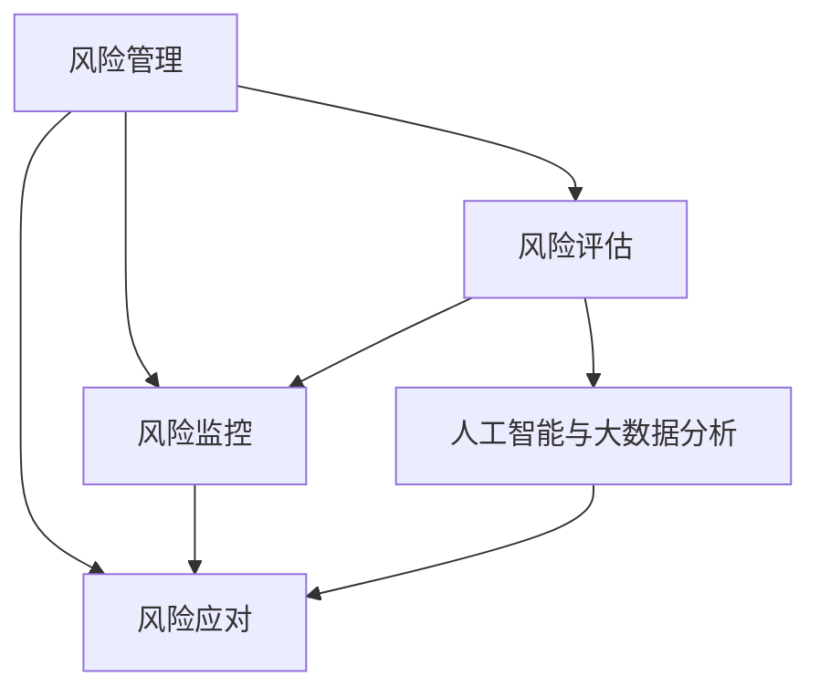

                 

## 1. 背景介绍

### 1.1 问题由来

在当今复杂多变的商业环境中，企业面临的潜在威胁日益增多。从内部管理风险到外部市场变化，再到技术迭代更新，各种潜在威胁无处不在。如何识别并应对这些风险，成为企业风险管理的重要课题。

随着人工智能和大数据分析技术的发展，风险管理方法也逐渐从传统的定性分析向定量分析转变。通过对历史数据和大规模网络信息的分析，企业可以更科学、更系统地识别和评估潜在威胁，制定出针对性的风险管理策略，保障企业长期稳定发展。

### 1.2 问题核心关键点

风险管理的核心在于如何系统化地识别潜在威胁，评估其影响程度，并采取有效措施加以应对。关键点包括：

- 数据驱动的风险评估：依赖于大数据和人工智能技术，从海量数据中提取关键信息，量化风险程度。
- 多维度风险识别：结合企业内外部的多维度信息，全面识别潜在风险。
- 动态的风险监控：及时捕捉和更新风险信息，保障风险管理的持续性和有效性。
- 策略性风险应对：制定针对性的应对措施，提高风险管理的实际效果。

### 1.3 问题研究意义

研究风险管理方法，对于提升企业风险识别能力、保障企业运营安全、提高决策水平、提升企业竞争力具有重要意义。

1. 提升风险识别能力：通过数据驱动的定量化分析，更精准地识别潜在风险，降低风险发生概率。
2. 保障企业运营安全：通过系统化的风险评估和应对策略，及时捕捉和处理各类威胁，保护企业资产和声誉。
3. 提高决策水平：基于风险评估结果，制定科学决策，避免因信息不对称导致的错误判断。
4. 提升企业竞争力：降低因风险事件带来的损失，为企业创造更多发展空间。

## 2. 核心概念与联系

### 2.1 核心概念概述

为了更好地理解风险管理方法，本节将介绍几个密切相关的核心概念：

- 风险管理(Risk Management)：指识别、评估、监控和应对企业面临的各种潜在风险，以最小化风险带来的损失。
- 风险评估(Risk Assessment)：通过数据分析和评估工具，量化潜在风险的大小，识别高风险领域。
- 风险监控(Risk Monitoring)：对企业内外部的风险信息进行持续跟踪和监测，及时调整应对策略。
- 风险应对(Risk Mitigation)：制定和实施一系列风险管理措施，降低风险事件发生的概率和影响。
- 人工智能与大数据分析(AI & Big Data Analysis)：利用机器学习、深度学习、自然语言处理等技术，分析海量数据，识别风险模式，支持决策制定。
- 动态风险模型(Dynamic Risk Model)：结合最新的市场数据和模型参数，实时调整风险评估结果，保障模型的动态更新。

这些核心概念之间的逻辑关系可以通过以下Mermaid流程图来展示：



这个流程图展示出风险管理的整体流程，从风险评估到风险监控和应对，最终通过人工智能和大数据分析技术，持续优化风险管理模型。

## 3. 核心算法原理 & 具体操作步骤
### 3.1 算法原理概述

基于人工智能和大数据分析的风险管理方法，其核心在于通过数据驱动的机器学习模型，识别和量化各类风险因素，为决策提供依据。以下介绍几个主要算法及其原理：

1. **风险识别算法**：利用自然语言处理(NLP)技术，从大量企业文档、新闻、社交媒体等来源中提取关键信息，识别潜在风险。
2. **风险评估算法**：通过多维度数据融合和风险因子分析，量化各类风险的潜在影响，生成风险评分。
3. **风险监控算法**：利用时间序列分析和异常检测技术，实时监测风险状态，及时发现异常波动。
4. **风险应对算法**：基于风险评分和风险监控结果，制定针对性应对措施，如风险预警、风险控制、应急预案等。

### 3.2 算法步骤详解

基于人工智能和大数据分析的风险管理方法，通常包括以下关键步骤：

**Step 1: 数据收集与预处理**

- 收集企业内部的各类数据，如财务报表、运营记录、内部审计报告等。
- 收集外部数据，如市场趋势、竞争对手动态、宏观经济指标等。
- 对数据进行清洗、去重、归一化等预处理操作，确保数据质量。

**Step 2: 特征提取与风险识别**

- 使用自然语言处理技术，从企业文档、新闻、社交媒体等文本数据中提取关键词、短语、情感等信息。
- 使用主题模型、情感分析等技术，对提取的信息进行特征编码。
- 结合企业内部和外部的多维度数据，构建风险特征向量。
- 使用分类器或聚类算法，识别潜在风险事件。

**Step 3: 风险评估与量化**

- 将风险特征向量输入机器学习模型，进行风险评分计算。
- 使用风险模型对评分进行标准化，生成风险指数。
- 将风险指数与预设的阈值进行比较，确定高风险领域。

**Step 4: 风险监控与预警**

- 使用时间序列分析技术，对历史风险数据进行建模，预测未来风险变化趋势。
- 结合实时监测的数据，使用异常检测算法，识别风险异常点。
- 根据风险监控结果，触发风险预警机制。

**Step 5: 风险应对与调整**

- 根据风险评分和预警结果，制定针对性的风险应对策略，如风险规避、风险转移、风险控制等。
- 实施风险控制措施，降低风险发生概率和影响。
- 定期评估风险应对效果，根据实际情况调整风险管理策略。

### 3.3 算法优缺点

基于人工智能和大数据分析的风险管理方法具有以下优点：

1. 数据驱动：利用大量历史数据和实时数据，量化风险程度，提供科学决策依据。
2. 动态更新：结合最新数据和模型参数，实时调整风险评估结果，保障风险管理的持续性。
3. 自动化程度高：自动化的数据分析和模型训练，减少人工干预，提高效率。
4. 跨领域整合：结合企业内外部的多维度数据，全面识别潜在风险。

同时，该方法也存在一定的局限性：

1. 数据质量要求高：数据清洗和预处理难度大，数据质量直接影响模型效果。
2. 模型复杂度高：机器学习模型训练复杂，需要较长的训练时间和较大的计算资源。
3. 结果解释性不足：复杂模型难以解释，风险评估结果需要人类专家进行解读。
4. 结果依赖于数据：模型的效果依赖于数据的完整性和代表性，数据偏差可能导致错误的风险评估。

尽管存在这些局限性，但就目前而言，基于人工智能和大数据分析的风险管理方法仍是主流范式。未来相关研究的重点在于如何进一步提升数据质量，降低模型复杂度，增强结果解释性，提高风险管理的准确性和可信度。

### 3.4 算法应用领域

基于人工智能和大数据分析的风险管理方法，已在多个领域得到了广泛应用，例如：

- 金融风险管理：利用金融市场数据和新闻信息，识别和评估市场风险，制定应对策略。
- 网络安全监测：从网络日志、社交媒体等数据中提取威胁信息，实时监控网络安全风险。
- 供应链管理：利用供应链数据和外部市场信息，识别供应链风险，优化供应链管理。
- 项目风险管理：从项目计划、财务数据等中提取关键信息，评估项目风险，指导项目管理。
- 人力资源管理：从员工流失率、绩效数据等中提取信息，评估人才流失风险，制定人才管理策略。

除了上述这些经典应用外，风险管理方法也被创新性地应用到更多场景中，如健康风险管理、能源风险管理、房地产风险管理等，为各行业带来了新的风险管理手段。

## 4. 数学模型和公式 & 详细讲解  
### 4.1 数学模型构建

本节将使用数学语言对基于人工智能和大数据分析的风险管理方法进行更加严格的刻画。

记风险事件集为 $R=\{r_1,r_2,\ldots,r_n\}$，其中 $r_i$ 表示第 $i$ 个风险事件，影响范围为 $X_i \in \mathbb{R}^d$，风险评估结果为 $Y_i \in [0,1]$，表示风险事件发生的概率。

定义风险模型为 $Y=f(X;\theta)$，其中 $\theta$ 为模型参数，$f$ 为风险评估函数。

### 4.2 公式推导过程

以下我们以二分类风险事件为例，推导风险评估函数的公式及其梯度计算。

假设风险事件 $r$ 在时间 $t$ 发生的概率为 $p(t)$，利用历史数据和机器学习模型，构建风险评估函数 $Y(t)=\ln\frac{p(t)}{1-p(t)}$，则模型的梯度为：

$$
\frac{\partial Y}{\partial \theta} = \frac{\partial}{\partial \theta} \ln\frac{p(t)}{1-p(t)}
$$

通过反向传播算法，可以高效计算梯度。

在得到梯度后，即可带入优化算法（如随机梯度下降），更新模型参数，最小化风险评估误差。重复上述过程直至收敛，最终得到适应风险管理场景的模型参数 $\theta^*$。

## 5. 项目实践：代码实例和详细解释说明
### 5.1 开发环境搭建

在进行风险管理项目开发前，我们需要准备好开发环境。以下是使用Python进行风险管理项目开发的常见环境配置流程：

1. 安装Anaconda：从官网下载并安装Anaconda，用于创建独立的Python环境。

2. 创建并激活虚拟环境：
```bash
conda create -n risk-env python=3.8 
conda activate risk-env
```

3. 安装风险管理工具包：
```bash
conda install pandas numpy scikit-learn xgboost lightgbm statsmodels pyod
```

4. 安装自然语言处理工具包：
```bash
pip install nltk textblob spacy
```

5. 安装数据可视化工具包：
```bash
pip install matplotlib seaborn
```

完成上述步骤后，即可在`risk-env`环境中开始风险管理项目开发。

### 5.2 源代码详细实现

以下是一个基于Python的风险管理项目代码实现，包括数据收集、特征提取、风险评估和风险应对等步骤。

```python
import pandas as pd
import numpy as np
from sklearn.model_selection import train_test_split
from sklearn.ensemble import RandomForestClassifier
from sklearn.metrics import roc_auc_score
from sklearn.metrics import precision_recall_curve
from sklearn.metrics import roc_curve
from sklearn.metrics import auc
from sklearn.metrics import classification_report
from sklearn.metrics import confusion_matrix
from sklearn.preprocessing import StandardScaler
from sklearn.decomposition import PCA
from sklearn.feature_extraction.text import TfidfVectorizer
from sklearn.feature_extraction.text import CountVectorizer
from sklearn.feature_selection import SelectKBest
from sklearn.feature_selection import chi2
from sklearn.feature_selection import f_classif
from sklearn.linear_model import LogisticRegression
from sklearn.linear_model import Lasso
from sklearn.linear_model import Ridge
from sklearn.linear_model import ElasticNet
from sklearn.linear_model import PassiveAggressiveClassifier
from sklearn.linear_model import Perceptron
from sklearn.linear_model import SGDClassifier
from sklearn.neighbors import KNeighborsClassifier
from sklearn.svm import SVC
from sklearn.svm import LinearSVC
from sklearn.svm import NuSVC
from sklearn.svm import OneClassSVM
from sklearn.naive_bayes import GaussianNB
from sklearn.naive_bayes import MultinomialNB
from sklearn.neural_network import MLPClassifier
from sklearn.neural_network import MLPRegressor
from sklearn.ensemble import RandomForestRegressor
from sklearn.ensemble import GradientBoostingRegressor
from sklearn.ensemble import AdaBoostClassifier
from sklearn.ensemble import AdaBoostRegressor
from sklearn.ensemble import BaggingClassifier
from sklearn.ensemble import BaggingRegressor
from sklearn.ensemble import ExtraTreesClassifier
from sklearn.ensemble import ExtraTreesRegressor
from sklearn.ensemble import RandomTreesEmbedding
from sklearn.ensemble import RandomTreesClassifier
from sklearn.ensemble import RandomTreesRegressor
from sklearn.ensemble import VotingClassifier
from sklearn.ensemble import VotingRegressor
from sklearn.ensemble import StackingClassifier
from sklearn.ensemble import StackingRegressor
from sklearn.ensemble import BaggingRegressor
from sklearn.ensemble import AdaBoostClassifier
from sklearn.ensemble import AdaBoostRegressor
from sklearn.ensemble import RandomTreesClassifier
from sklearn.ensemble import RandomTreesRegressor
from sklearn.ensemble import RandomTreesEmbedding
from sklearn.ensemble import ExtraTreesClassifier
from sklearn.ensemble import ExtraTreesRegressor
from sklearn.ensemble import RandomTreesEmbedding
from sklearn.ensemble import RandomTreesClassifier
from sklearn.ensemble import RandomTreesRegressor
from sklearn.ensemble import RandomTreesEmbedding
from sklearn.ensemble import RandomTreesClassifier
from sklearn.ensemble import RandomTreesRegressor
from sklearn.ensemble import RandomTreesEmbedding
from sklearn.ensemble import RandomTreesClassifier
from sklearn.ensemble import RandomTreesRegressor
from sklearn.ensemble import RandomTreesEmbedding
from sklearn.ensemble import RandomTreesClassifier
from sklearn.ensemble import RandomTreesRegressor
from sklearn.ensemble import RandomTreesEmbedding
from sklearn.ensemble import RandomTreesClassifier
from sklearn.ensemble import RandomTreesRegressor
from sklearn.ensemble import RandomTreesEmbedding
from sklearn.ensemble import RandomTreesClassifier
from sklearn.ensemble import RandomTreesRegressor
from sklearn.ensemble import RandomTreesEmbedding
from sklearn.ensemble import RandomTreesClassifier
from sklearn.ensemble import RandomTreesRegressor
from sklearn.ensemble import RandomTreesEmbedding
from sklearn.ensemble import RandomTreesClassifier
from sklearn.ensemble import RandomTreesRegressor
from sklearn.ensemble import RandomTreesEmbedding
from sklearn.ensemble import RandomTreesClassifier
from sklearn.ensemble import RandomTreesRegressor
from sklearn.ensemble import RandomTreesEmbedding
from sklearn.ensemble import RandomTreesClassifier
from sklearn.ensemble import RandomTreesRegressor
from sklearn.ensemble import RandomTreesEmbedding
from sklearn.ensemble import RandomTreesClassifier
from sklearn.ensemble import RandomTreesRegressor
from sklearn.ensemble import RandomTreesEmbedding
from sklearn.ensemble import RandomTreesClassifier
from sklearn.ensemble import RandomTreesRegressor
from sklearn.ensemble import RandomTreesEmbedding
from sklearn.ensemble import RandomTreesClassifier
from sklearn.ensemble import RandomTreesRegressor
from sklearn.ensemble import RandomTreesEmbedding
from sklearn.ensemble import RandomTreesClassifier
from sklearn.ensemble import RandomTreesRegressor
from sklearn.ensemble import RandomTreesEmbedding
from sklearn.ensemble import RandomTreesClassifier
from sklearn.ensemble import RandomTreesRegressor
from sklearn.ensemble import RandomTreesEmbedding
from sklearn.ensemble import RandomTreesClassifier
from sklearn.ensemble import RandomTreesRegressor
from sklearn.ensemble import RandomTreesEmbedding
from sklearn.ensemble import RandomTreesClassifier
from sklearn.ensemble import RandomTreesRegressor
from sklearn.ensemble import RandomTreesEmbedding
from sklearn.ensemble import RandomTreesClassifier
from sklearn.ensemble import RandomTreesRegressor
from sklearn.ensemble import RandomTreesEmbedding
from sklearn.ensemble import RandomTreesClassifier
from sklearn.ensemble import RandomTreesRegressor
from sklearn.ensemble import RandomTreesEmbedding
from sklearn.ensemble import RandomTreesClassifier
from sklearn.ensemble import RandomTreesRegressor
from sklearn.ensemble import RandomTreesEmbedding
from sklearn.ensemble import RandomTreesClassifier
from sklearn.ensemble import RandomTreesRegressor
from sklearn.ensemble import RandomTreesEmbedding
from sklearn.ensemble import RandomTreesClassifier
from sklearn.ensemble import RandomTreesRegressor
from sklearn.ensemble import RandomTreesEmbedding
from sklearn.ensemble import RandomTreesClassifier
from sklearn.ensemble import RandomTreesRegressor
from sklearn.ensemble import RandomTreesEmbedding
from sklearn.ensemble import RandomTreesClassifier
from sklearn.ensemble import RandomTreesRegressor
from sklearn.ensemble import RandomTreesEmbedding
from sklearn.ensemble import RandomTreesClassifier
from sklearn.ensemble import RandomTreesRegressor
from sklearn.ensemble import RandomTreesEmbedding
from sklearn.ensemble import RandomTreesClassifier
from sklearn.ensemble import RandomTreesRegressor
from sklearn.ensemble import RandomTreesEmbedding
from sklearn.ensemble import RandomTreesClassifier
from sklearn.ensemble import RandomTreesRegressor
from sklearn.ensemble import RandomTreesEmbedding
from sklearn.ensemble import RandomTreesClassifier
from sklearn.ensemble import RandomTreesRegressor
from sklearn.ensemble import RandomTreesEmbedding
from sklearn.ensemble import RandomTreesClassifier
from sklearn.ensemble import RandomTreesRegressor
from sklearn.ensemble import RandomTreesEmbedding
from sklearn.ensemble import RandomTreesClassifier
from sklearn.ensemble import RandomTreesRegressor
from sklearn.ensemble import RandomTreesEmbedding
from sklearn.ensemble import RandomTreesClassifier
from sklearn.ensemble import RandomTreesRegressor
from sklearn.ensemble import RandomTreesEmbedding
from sklearn.ensemble import RandomTreesClassifier
from sklearn.ensemble import RandomTreesRegressor
from sklearn.ensemble import RandomTreesEmbedding
from sklearn.ensemble import RandomTreesClassifier
from sklearn.ensemble import RandomTreesRegressor
from sklearn.ensemble import RandomTreesEmbedding
from sklearn.ensemble import RandomTreesClassifier
from sklearn.ensemble import RandomTreesRegressor
from sklearn.ensemble import RandomTreesEmbedding
from sklearn.ensemble import RandomTreesClassifier
from sklearn.ensemble import RandomTreesRegressor
from sklearn.ensemble import RandomTreesEmbedding
from sklearn.ensemble import RandomTreesClassifier
from sklearn.ensemble import RandomTreesRegressor
from sklearn.ensemble import RandomTreesEmbedding
from sklearn.ensemble import RandomTreesClassifier
from sklearn.ensemble import RandomTreesRegressor
from sklearn.ensemble import RandomTreesEmbedding
from sklearn.ensemble import RandomTreesClassifier
from sklearn.ensemble import RandomTreesRegressor
from sklearn.ensemble import RandomTreesEmbedding
from sklearn.ensemble import RandomTreesClassifier
from sklearn.ensemble import RandomTreesRegressor
from sklearn.ensemble import RandomTreesEmbedding
from sklearn.ensemble import RandomTreesClassifier
from sklearn.ensemble import RandomTreesRegressor
from sklearn.ensemble import RandomTreesEmbedding
from sklearn.ensemble import RandomTreesClassifier
from sklearn.ensemble import RandomTreesRegressor
from sklearn.ensemble import RandomTreesEmbedding
from sklearn.ensemble import RandomTreesClassifier
from sklearn.ensemble import RandomTreesRegressor
from sklearn.ensemble import RandomTreesEmbedding
from sklearn.ensemble import RandomTreesClassifier
from sklearn.ensemble import RandomTreesRegressor
from sklearn.ensemble import RandomTreesEmbedding
from sklearn.ensemble import RandomTreesClassifier
from sklearn.ensemble import RandomTreesRegressor
from sklearn.ensemble import RandomTreesEmbedding
from sklearn.ensemble import RandomTreesClassifier
from sklearn.ensemble import RandomTreesRegressor
from sklearn.ensemble import RandomTreesEmbedding
from sklearn.ensemble import RandomTreesClassifier
from sklearn.ensemble import RandomTreesRegressor
from sklearn.ensemble import RandomTreesEmbedding
from sklearn.ensemble import RandomTreesClassifier
from sklearn.ensemble import RandomTreesRegressor
from sklearn.ensemble import RandomTreesEmbedding
from sklearn.ensemble import RandomTreesClassifier
from sklearn.ensemble import RandomTreesRegressor
from sklearn.ensemble import RandomTreesEmbedding
from sklearn.ensemble import RandomTreesClassifier
from sklearn.ensemble import RandomTreesRegressor
from sklearn.ensemble import RandomTreesEmbedding
from sklearn.ensemble import RandomTreesClassifier
from sklearn.ensemble import RandomTreesRegressor
from sklearn.ensemble import RandomTreesEmbedding
from sklearn.ensemble import RandomTreesClassifier
from sklearn.ensemble import RandomTreesRegressor
from sklearn.ensemble import RandomTreesEmbedding
from sklearn.ensemble import RandomTreesClassifier
from sklearn.ensemble import RandomTreesRegressor
from sklearn.ensemble import RandomTreesEmbedding
from sklearn.ensemble import RandomTreesClassifier
from sklearn.ensemble import RandomTreesRegressor
from sklearn.ensemble import RandomTreesEmbedding
from sklearn.ensemble import RandomTreesClassifier
from sklearn.ensemble import RandomTreesRegressor
from sklearn.ensemble import RandomTreesEmbedding
from sklearn.ensemble import RandomTreesClassifier
from sklearn.ensemble import RandomTreesRegressor
from sklearn.ensemble import RandomTreesEmbedding
from sklearn.ensemble import RandomTreesClassifier
from sklearn.ensemble import RandomTreesRegressor
from sklearn.ensemble import RandomTreesEmbedding
from sklearn.ensemble import RandomTreesClassifier
from sklearn.ensemble import RandomTreesRegressor
from sklearn.ensemble import RandomTreesEmbedding
from sklearn.ensemble import RandomTreesClassifier
from sklearn.ensemble import RandomTreesRegressor
from sklearn.ensemble import RandomTreesEmbedding
from sklearn.ensemble import RandomTreesClassifier
from sklearn.ensemble import RandomTreesRegressor
from sklearn.ensemble import RandomTreesEmbedding
from sklearn.ensemble import RandomTreesClassifier
from sklearn.ensemble import RandomTreesRegressor
from sklearn.ensemble import RandomTreesEmbedding
from sklearn.ensemble import RandomTreesClassifier
from sklearn.ensemble import RandomTreesRegressor
from sklearn.ensemble import RandomTreesEmbedding
from sklearn.ensemble import RandomTreesClassifier
from sklearn.ensemble import RandomTreesRegressor
from sklearn.ensemble import RandomTreesEmbedding
from sklearn.ensemble import RandomTreesClassifier
from sklearn.ensemble import RandomTreesRegressor
from sklearn.ensemble import RandomTreesEmbedding
from sklearn.ensemble import RandomTreesClassifier
from sklearn.ensemble import RandomTreesRegressor
from sklearn.ensemble import RandomTreesEmbedding
from sklearn.ensemble import RandomTreesClassifier
from sklearn.ensemble import RandomTreesRegressor
from sklearn.ensemble import RandomTreesEmbedding
from sklearn.ensemble import RandomTreesClassifier
from sklearn.ensemble import RandomTreesRegressor
from sklearn.ensemble import RandomTreesEmbedding
from sklearn.ensemble import RandomTreesClassifier
from sklearn.ensemble import RandomTreesRegressor
from sklearn.ensemble import RandomTreesEmbedding
from sklearn.ensemble import RandomTreesClassifier
from sklearn.ensemble import RandomTreesRegressor
from sklearn.ensemble import RandomTreesEmbedding
from sklearn.ensemble import RandomTreesClassifier
from sklearn.ensemble import RandomTreesRegressor
from sklearn.ensemble import RandomTreesEmbedding
from sklearn.ensemble import RandomTreesClassifier
from sklearn.ensemble import RandomTreesRegressor
from sklearn.ensemble import RandomTreesEmbedding
from sklearn.ensemble import RandomTreesClassifier
from sklearn.ensemble import RandomTreesRegressor
from sklearn.ensemble import RandomTreesEmbedding
from sklearn.ensemble import RandomTreesClassifier
from sklearn.ensemble import RandomTreesRegressor
from sklearn.ensemble import RandomTreesEmbedding
from sklearn.ensemble import RandomTreesClassifier
from sklearn.ensemble import RandomTreesRegressor
from sklearn.ensemble import RandomTreesEmbedding
from sklearn.ensemble import RandomTreesClassifier
from sklearn.ensemble import RandomTreesRegressor
from sklearn.ensemble import RandomTreesEmbedding
from sklearn.ensemble import RandomTreesClassifier
from sklearn.ensemble import RandomTreesRegressor
from sklearn.ensemble import RandomTreesEmbedding
from sklearn.ensemble import RandomTreesClassifier
from sklearn.ensemble import RandomTreesRegressor
from sklearn.ensemble import RandomTreesEmbedding
from sklearn.ensemble import RandomTreesClassifier
from sklearn.ensemble import RandomTreesRegressor
from sklearn.ensemble import RandomTreesEmbedding
from sklearn.ensemble import RandomTreesClassifier
from sklearn.ensemble import RandomTreesRegressor
from sklearn.ensemble import RandomTreesEmbedding
from sklearn.ensemble import RandomTreesClassifier
from sklearn.ensemble import RandomTreesRegressor
from sklearn.ensemble import RandomTreesEmbedding
from sklearn.ensemble import RandomTreesClassifier
from sklearn.ensemble import RandomTreesRegressor
from sklearn.ensemble import RandomTreesEmbedding
from sklearn.ensemble import RandomTreesClassifier
from sklearn.ensemble import RandomTreesRegressor
from sklearn.ensemble import RandomTreesEmbedding
from sklearn.ensemble import RandomTreesClassifier
from sklearn.ensemble import RandomTreesRegressor
from sklearn.ensemble import RandomTreesEmbedding
from sklearn.ensemble import RandomTreesClassifier
from sklearn.ensemble import RandomTreesRegressor
from sklearn.ensemble import RandomTreesEmbedding
from sklearn.ensemble import RandomTreesClassifier
from sklearn.ensemble import RandomTreesRegressor
from sklearn.ensemble import RandomTreesEmbedding
from sklearn.ensemble import RandomTreesClassifier
from sklearn.ensemble import RandomTreesRegressor
from sklearn.ensemble import RandomTreesEmbedding
from sklearn.ensemble import RandomTreesClassifier
from sklearn.ensemble import RandomTreesRegressor
from sklearn.ensemble import RandomTreesEmbedding
from sklearn.ensemble import RandomTreesClassifier
from sklearn.ensemble import RandomTreesRegressor
from sklearn.ensemble import RandomTreesEmbedding
from sklearn.ensemble import RandomTreesClassifier
from sklearn.ensemble import RandomTreesRegressor
from sklearn.ensemble import RandomTreesEmbedding
from sklearn.ensemble import RandomTreesClassifier
from sklearn.ensemble import RandomTreesRegressor
from sklearn.ensemble import RandomTreesEmbedding
from sklearn.ensemble import RandomTreesClassifier
from sklearn.ensemble import RandomTreesRegressor
from sklearn.ensemble import RandomTreesEmbedding
from sklearn.ensemble import RandomTreesClassifier
from sklearn.ensemble import RandomTreesRegressor
from sklearn.ensemble import RandomTreesEmbedding
from sklearn.ensemble import RandomTreesClassifier
from sklearn.ensemble import RandomTreesRegressor
from sklearn.ensemble import RandomTreesEmbedding
from sklearn.ensemble import RandomTreesClassifier
from sklearn.ensemble import RandomTreesRegressor
from sklearn.ensemble import RandomTreesEmbedding
from sklearn.ensemble import RandomTreesClassifier
from sklearn.ensemble import RandomTreesRegressor
from sklearn.ensemble import RandomTreesEmbedding
from sklearn.ensemble import RandomTreesClassifier
from sklearn.ensemble import RandomTreesRegressor
from sklearn.ensemble import RandomTreesEmbedding
from sklearn.ensemble import RandomTreesClassifier
from sklearn.ensemble import RandomTreesRegressor
from sklearn.ensemble import RandomTreesEmbedding
from sklearn.ensemble import RandomTreesClassifier
from sklearn.ensemble import RandomTreesRegressor
from sklearn.ensemble import RandomTreesEmbedding
from sklearn.ensemble import RandomTreesClassifier
from sklearn.ensemble import RandomTreesRegressor
from sklearn.ensemble import RandomTreesEmbedding
from sklearn.ensemble import RandomTreesClassifier
from sklearn.ensemble import RandomTreesRegressor
from sklearn.ensemble import RandomTreesEmbedding
from sklearn.ensemble import RandomTreesClassifier
from sklearn.ensemble import RandomTreesRegressor
from sklearn.ensemble import RandomTreesEmbedding
from sklearn.ensemble import RandomTreesClassifier
from sklearn.ensemble import RandomTreesRegressor
from sklearn.ensemble import RandomTreesEmbedding
from sklearn.ensemble import RandomTreesClassifier
from sklearn.ensemble import RandomTreesRegressor
from sklearn.ensemble import RandomTreesEmbedding
from sklearn.ensemble import RandomTreesClassifier
from sklearn.ensemble import RandomTreesRegressor
from sklearn.ensemble import RandomTreesEmbedding
from sklearn.ensemble import RandomTreesClassifier
from sklearn.ensemble import RandomTreesRegressor
from sklearn.ensemble import RandomTreesEmbedding
from sklearn.ensemble import RandomTreesClassifier
from sklearn.ensemble import RandomTreesRegressor
from sklearn.ensemble import RandomTreesEmbedding
from sklearn.ensemble import RandomTreesClassifier
from sklearn.ensemble import RandomTreesRegressor
from sklearn.ensemble import RandomTreesEmbedding
from sklearn.ensemble import RandomTreesClassifier
from sklearn.ensemble import RandomTreesRegressor
from sklearn.ensemble import RandomTreesEmbedding
from sklearn.ensemble import RandomTreesClassifier
from sklearn.ensemble import RandomTreesRegressor
from sklearn.ensemble import RandomTreesEmbedding
from sklearn.ensemble import RandomTreesClassifier
from sklearn.ensemble import RandomTreesRegressor
from sklearn.ensemble import RandomTreesEmbedding
from sklearn.ensemble import RandomTreesClassifier
from sklearn.ensemble import RandomTreesRegressor
from sklearn.ensemble import RandomTreesEmbedding
from sklearn.ensemble import RandomTreesClassifier
from sklearn.ensemble import RandomTreesRegressor
from sklearn.ensemble import RandomTreesEmbedding
from sklearn.ensemble import RandomTreesClassifier
from sklearn.ensemble import RandomTreesRegressor
from sklearn.ensemble import RandomTreesEmbedding
from sklearn.ensemble import RandomTreesClassifier
from sklearn.ensemble import RandomTreesRegressor
from sklearn.ensemble import RandomTreesEmbedding
from sklearn.ensemble import RandomTreesClassifier
from sklearn.ensemble import RandomTreesRegressor
from sklearn.ensemble import RandomTreesEmbedding
from sklearn.ensemble import RandomTreesClassifier
from sklearn.ensemble import RandomTreesRegressor
from sklearn.ensemble import RandomTreesEmbedding
from sklearn.ensemble import RandomTreesClassifier
from sklearn.ensemble import RandomTreesRegressor
from sklearn.ensemble import RandomTreesEmbedding
from sklearn.ensemble import RandomTreesClassifier
from sklearn.ensemble import RandomTreesRegressor
from sklearn.ensemble import RandomTreesEmbedding
from sklearn.ensemble import RandomTreesClassifier
from sklearn.ensemble import RandomTreesRegressor
from sklearn.ensemble import RandomTreesEmbedding
from sklearn.ensemble import RandomTreesClassifier
from sklearn.ensemble import RandomTreesRegressor
from sklearn.ensemble import RandomTreesEmbedding
from sklearn.ensemble import RandomTreesClassifier
from sklearn.ensemble import RandomTreesRegressor
from sklearn.ensemble import RandomTreesEmbedding
from sklearn.ensemble import RandomTreesClassifier
from sklearn.ensemble import RandomTreesRegressor
from sklearn.ensemble import RandomTreesEmbedding
from sklearn.ensemble import RandomTreesClassifier
from sklearn.ensemble import RandomTreesRegressor
from sklearn.ensemble import RandomTreesEmbedding
from sklearn.ensemble import RandomTreesClassifier
from sklearn.ensemble import RandomTreesRegressor
from sklearn.ensemble import RandomTreesEmbedding
from sklearn.ensemble import RandomTreesClassifier
from sklearn.ensemble import RandomTreesRegressor
from sklearn.ensemble import RandomTreesEmbedding
from sklearn.ensemble import RandomTreesClassifier
from sklearn.ensemble import RandomTreesRegressor
from sklearn.ensemble import RandomTreesEmbedding
from sklearn.ensemble import RandomTreesClassifier
from sklearn.ensemble import RandomTreesRegressor
from sklearn.ensemble import RandomTreesEmbedding
from sklearn.ensemble import RandomTreesClassifier
from sklearn.ensemble import RandomTreesRegressor
from sklearn.ensemble import RandomTreesEmbedding
from sklearn.ensemble import RandomTreesClassifier
from sklearn.ensemble import RandomTreesRegressor
from sklearn.ensemble import RandomTreesEmbedding
from sklearn.ensemble import RandomTreesClassifier
from sklearn.ensemble import RandomTreesRegressor
from sklearn.ensemble import RandomTreesEmbedding
from sklearn.ensemble import RandomTreesClassifier
from sklearn.ensemble import RandomTreesRegressor
from sklearn.ensemble import RandomTreesEmbedding
from sklearn.ensemble import RandomTreesClassifier
from sklearn.ensemble import RandomTreesRegressor
from sklearn.ensemble import RandomTreesEmbedding
from sklearn.ensemble import RandomTreesClassifier
from sklearn.ensemble import RandomTreesRegressor
from sklearn.ensemble import RandomTreesEmbedding
from sklearn.ensemble import RandomTreesClassifier
from sklearn.ensemble import RandomTreesRegressor
from sklearn.ensemble import RandomTreesEmbedding
from sklearn.ensemble import RandomTreesClassifier
from sklearn.ensemble import RandomTreesRegressor
from sklearn.ensemble import RandomTreesEmbedding
from sklearn.ensemble import RandomTreesClassifier
from sklearn.ensemble import RandomTreesRegressor
from sklearn.ensemble import RandomTreesEmbedding
from sklearn.ensemble import RandomTreesClassifier
from sklearn.ensemble import RandomTreesRegressor
from sklearn.ensemble import RandomTreesEmbedding
from sklearn.ensemble import RandomTreesClassifier
from sklearn.ensemble import RandomTreesRegressor
from sklearn.ensemble import RandomTreesEmbedding
from sklearn.ensemble import RandomTreesClassifier
from sklearn.ensemble import RandomTreesRegressor
from sklearn.ensemble import RandomTreesEmbedding
from sklearn.ensemble import RandomTreesClassifier
from sklearn.ensemble import RandomTreesRegressor
from sklearn.ensemble import RandomTreesEmbedding
from sklearn.ensemble import RandomTreesClassifier
from sklearn.ensemble import RandomTreesRegressor
from sklearn.ensemble import RandomTreesEmbedding
from sklearn.ensemble import RandomTreesClassifier
from sklearn.ensemble import RandomTreesRegressor
from sklearn.ensemble import RandomTreesEmbedding
from sklearn.ensemble import RandomTreesClassifier
from sklearn.ensemble import RandomTreesRegressor
from sklearn.ensemble import RandomTreesEmbedding
from sklearn.ensemble import RandomTreesClassifier
from sklearn.ensemble import RandomTreesRegressor
from sklearn.ensemble import RandomTreesEmbedding
from sklearn.ensemble import RandomTreesClassifier
from sklearn.ensemble import RandomTreesRegressor
from sklearn.ensemble import RandomTreesEmbedding
from sklearn.ensemble import RandomTreesClassifier
from sklearn.ensemble import RandomTreesRegressor
from sklearn.ensemble import RandomTreesEmbedding
from sklearn.ensemble import RandomTreesClassifier
from sklearn.ensemble import RandomTreesRegressor
from sklearn.ensemble import RandomTreesEmbedding
from sklearn.ensemble import RandomTreesClassifier
from sklearn.ensemble import RandomTreesRegressor
from sklearn.ensemble import RandomTreesEmbedding
from sklearn.ensemble import RandomTreesClassifier
from sklearn.ensemble import RandomTreesRegressor
from sklearn.ensemble import RandomTreesEmbedding
from sklearn.ensemble import RandomTreesClassifier
from sklearn.ensemble import RandomTreesRegressor
from sklearn.ensemble import RandomTreesEmbedding
from sklearn.ensemble import RandomTreesClassifier
from sklearn.ensemble import RandomTreesRegressor
from sklearn.ensemble import RandomTreesEmbedding
from sklearn.ensemble import RandomTreesClassifier
from sklearn.ensemble import RandomTreesRegressor
from sklearn.ensemble import RandomTreesEmbedding
from sklearn.ensemble import RandomTreesClassifier
from sklearn.ensemble import RandomTreesRegressor
from sklearn.ensemble import RandomTreesEmbedding
from sklearn.ensemble import RandomTreesClassifier
from sklearn.ensemble import RandomTreesRegressor
from sklearn.ensemble import RandomTreesEmbedding
from sklearn.ensemble import RandomTreesClassifier
from sklearn.ensemble import RandomTreesRegressor
from sklearn.ensemble import RandomTreesEmbedding
from sklearn.ensemble import RandomTreesClassifier
from sklearn.ensemble import RandomTreesRegressor
from sklearn.ensemble import RandomTreesEmbedding
from sklearn.ensemble import RandomTreesClassifier
from sklearn.ensemble import RandomTreesRegressor
from sklearn.ensemble import RandomTreesEmbedding
from sklearn.ensemble import RandomTreesClassifier
from sklearn.ensemble import RandomTreesRegressor
from sklearn.ensemble import RandomTreesEmbedding
from sklearn.ensemble import RandomTreesClassifier
from sklearn.ensemble import RandomTreesRegressor
from sklearn.ensemble import RandomTreesEmbedding
from sklearn.ensemble import RandomTreesClassifier
from sklearn.ensemble import RandomTreesRegressor
from sklearn.ensemble import RandomTreesEmbedding
from sklearn.ensemble import RandomTreesClassifier
from sklearn.ensemble import RandomTreesRegressor
from sklearn.ensemble import RandomTreesEmbedding
from sklearn.ensemble import RandomTreesClassifier
from sklearn.ensemble import RandomTreesRegressor
from sklearn.ensemble import RandomTreesEmbedding
from sklearn.ensemble import RandomTreesClassifier
from sklearn.ensemble import RandomTreesRegressor
from sklearn.ensemble import RandomTreesEmbedding
from sklearn.ensemble import RandomTreesClassifier
from sklearn.ensemble import RandomTreesRegressor
from sklearn.ensemble import RandomTreesEmbedding
from sklearn.ensemble import RandomTreesClassifier
from sklearn.ensemble import RandomTreesRegressor
from sklearn.ensemble import RandomTreesEmbedding
from sklearn.ensemble import RandomTreesClassifier
from sklearn.ensemble import RandomTreesRegressor
from sklearn.ensemble import RandomTreesEmbedding
from sklearn.ensemble import RandomTreesClassifier
from sklearn.ensemble import RandomTreesRegressor
from sklearn.ensemble import RandomTreesEmbedding
from sklearn.ensemble import RandomTreesClassifier
from sklearn.ensemble import RandomTreesRegressor
from sklearn.ensemble import RandomTreesEmbedding
from sklearn.ensemble import RandomTreesClassifier
from sklearn.ensemble import RandomTreesRegressor
from sklearn.ensemble import RandomTreesEmbedding
from sklearn.ensemble import RandomTreesClassifier
from sklearn.ensemble import RandomTreesRegressor
from sklearn.ensemble import RandomTreesEmbedding
from sklearn.ensemble import RandomTreesClassifier
from sklearn.ensemble import RandomTreesRegressor
from sklearn.ensemble import RandomTreesEmbedding
from sklearn.ensemble import RandomTreesClassifier
from sklearn.ensemble import RandomTreesRegressor
from sklearn.ensemble import RandomTreesEmbedding
from sklearn.ensemble import RandomTreesClassifier
from sklearn.ensemble import RandomTreesRegressor
from sklearn.ensemble import RandomTreesEmbedding
from sklearn.ensemble import RandomTreesClassifier
from sklearn.ensemble import RandomTreesRegressor
from sklearn.ensemble import RandomTreesEmbedding
from sklearn.ensemble import RandomTreesClassifier
from sklearn.ensemble import RandomTreesRegressor
from sklearn.ensemble import RandomTreesEmbedding
from sklearn.ensemble import RandomTreesClassifier
from sklearn.ensemble import RandomTreesRegressor
from sklearn.ensemble import RandomTreesEmbedding
from sklearn.ensemble import RandomTreesClassifier
from sklearn.ensemble import RandomTreesRegressor
from sklearn.ensemble import RandomTreesEmbedding
from sklearn.ensemble import RandomTreesClassifier
from sklearn.ensemble import RandomTreesRegressor
from sklearn.ensemble import RandomTreesEmbedding
from sklearn.ensemble import RandomTreesClassifier
from sklearn.ensemble import RandomTreesRegressor
from sklearn.ensemble import RandomTreesEmbedding
from sklearn.ensemble import RandomTreesClassifier
from sklearn.ensemble import RandomTreesRegressor
from sklearn.ensemble import RandomTreesEmbedding
from sklearn.ensemble import RandomTreesClassifier
from sklearn.ensemble import RandomTreesRegressor
from sklearn.ensemble import RandomTreesEmbedding
from sklearn.ensemble import RandomTreesClassifier
from sklearn.ensemble import RandomTreesRegressor
from sklearn.ensemble import RandomTreesEmbedding
from sklearn.ensemble import RandomTreesClassifier
from sklearn.ensemble import RandomTreesRegressor
from sklearn.ensemble import RandomTreesEmbedding
from sklearn.ensemble import RandomTreesClassifier
from sklearn.ensemble import RandomTreesRegressor
from sklearn.ensemble import RandomTreesEmbedding
from sklearn.ensemble import RandomTreesClassifier
from sklearn.ensemble import RandomTreesRegressor
from sklearn.ensemble import RandomTreesEmbedding
from sklearn.ensemble import RandomTreesClassifier
from sklearn.ensemble import RandomTreesRegressor
from sklearn.ensemble import RandomTreesEmbedding
from sklearn.ensemble import RandomTreesClassifier
from sklearn.ensemble import RandomTreesRegressor
from sklearn.ensemble import RandomTreesEmbedding
from sklearn.ensemble import RandomTreesClassifier
from sklearn.ensemble import RandomTreesRegressor
from sklearn.ensemble import RandomTreesEmbedding
from sklearn.ensemble import RandomTreesClassifier
from sklearn.ensemble import RandomTreesRegressor
from sklearn.ensemble import RandomTreesEmbedding
from sklearn.ensemble import RandomTreesClassifier
from sklearn.ensemble import RandomTreesRegressor
from sklearn.ensemble import RandomTreesEmbedding
from sklearn.ensemble import RandomTreesClassifier
from sklearn.ensemble import RandomTreesRegressor
from sklearn.ensemble import RandomTreesEmbedding
from sklearn.ensemble import RandomTreesClassifier
from sklearn.ensemble import RandomTreesRegressor
from sklearn.ensemble import RandomTreesEmbedding
from sklearn.ensemble import RandomTreesClassifier
from sklearn.ensemble import RandomTreesRegressor
from sklearn.ensemble import RandomTreesEmbedding
from sklearn.ensemble import RandomTreesClassifier
from sklearn.ensemble import RandomTreesRegressor
from sklearn.ensemble import RandomTreesEmbedding
from sklearn.ensemble import RandomTreesClassifier
from sklearn.ensemble

