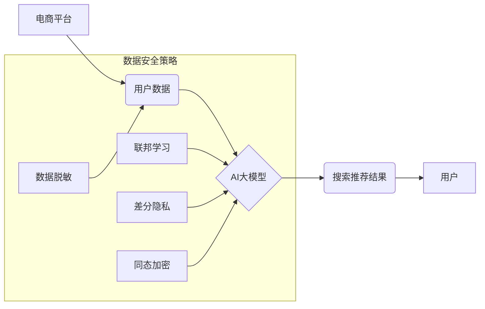

                 

## AI 大模型在电商搜索推荐中的数据安全策略：保障用户隐私与数据完整性

> 关键词：AI大模型、电商搜索推荐、数据安全、隐私保护、数据完整性、联邦学习、差分隐私、同态加密

## 1. 背景介绍

电商平台作为连接消费者和商品的桥梁，其搜索推荐系统扮演着至关重要的角色。AI大模型凭借其强大的学习能力和精准度，在电商搜索推荐领域展现出巨大的潜力，能够为用户提供个性化、精准的商品推荐，提升用户体验和商业效益。然而，AI大模型的训练和应用也带来了新的数据安全挑战。

电商平台收集的海量用户数据，包含用户行为、偏好、身份信息等敏感数据，一旦泄露或被恶意利用，将可能导致用户隐私泄露、信息安全风险、商业信誉受损等严重后果。因此，在利用AI大模型提升电商搜索推荐效果的同时，保障用户隐私和数据完整性至关重要。

## 2. 核心概念与联系

### 2.1  电商搜索推荐系统

电商搜索推荐系统旨在根据用户的搜索历史、浏览记录、购买行为等信息，预测用户对商品的兴趣，并推荐相关商品。传统的搜索推荐系统主要依赖于基于规则的算法和协同过滤算法，而AI大模型的引入，使得搜索推荐系统能够更精准地理解用户的需求，提供更个性化的推荐结果。

### 2.2  AI大模型

AI大模型是指参数量巨大、训练数据海量的人工智能模型，能够学习复杂的模式和关系，并应用于各种任务，例如自然语言处理、图像识别、语音合成等。在电商搜索推荐领域，常用的AI大模型包括Transformer、BERT、GPT等。

### 2.3  数据安全

数据安全是指保护数据免受未经授权的访问、使用、披露、修改或销毁等威胁，确保数据的机密性、完整性和可用性。

### 2.4  隐私保护

隐私保护是指保护个人信息免受侵犯，保障个人信息的使用、存储和处理符合法律法规和伦理道德规范。

**核心概念与架构流程图**



## 3. 核心算法原理 & 具体操作步骤

### 3.1  算法原理概述

在电商搜索推荐领域，AI大模型通常采用深度学习算法进行训练，例如Transformer模型。Transformer模型通过多头注意力机制，能够捕捉用户行为和商品特征之间的复杂关系，并生成更精准的推荐结果。

### 3.2  算法步骤详解

1. **数据预处理:** 收集用户数据和商品数据，进行清洗、格式化和特征提取等操作。
2. **模型训练:** 使用深度学习框架，例如TensorFlow或PyTorch，训练Transformer模型。训练过程中，模型会学习用户行为和商品特征之间的关系，并生成推荐模型参数。
3. **模型评估:** 使用测试数据评估模型的性能，例如准确率、召回率、点击率等指标。
4. **模型部署:** 将训练好的模型部署到线上环境，用于实时生成推荐结果。

### 3.3  算法优缺点

**优点:**

* 精准度高：能够捕捉用户行为和商品特征之间的复杂关系，生成更精准的推荐结果。
* 个性化强：能够根据用户的个性化需求，提供个性化的商品推荐。
* 可扩展性强：能够处理海量数据，并随着数据量的增加，模型性能不断提升。

**缺点:**

* 数据依赖性强：模型的性能取决于训练数据的质量和数量。
* 计算资源消耗大：训练大型AI模型需要大量的计算资源和时间。
* 黑盒效应：模型的决策过程难以解释，难以理解模型是如何生成推荐结果的。

### 3.4  算法应用领域

* 电子商务搜索推荐
* 内容推荐
* 个性化广告
* 人工智能客服

## 4. 数学模型和公式 & 详细讲解 & 举例说明

### 4.1  数学模型构建

在电商搜索推荐系统中，常用的数学模型包括协同过滤模型、基于内容的推荐模型和混合推荐模型。

**协同过滤模型:**

协同过滤模型基于用户的历史行为数据，预测用户对商品的兴趣。

**公式:**

$$
r_{ui} = \frac{\sum_{j \in N(u)} s_{uj} \cdot s_{uj} }{\sum_{j \in N(u)} s_{uj}^2}
$$

其中：

* $r_{ui}$ 表示用户 $u$ 对商品 $i$ 的评分
* $s_{uj}$ 表示用户 $u$ 对商品 $j$ 的评分
* $N(u)$ 表示与用户 $u$ 具有相似行为的用户集合

**基于内容的推荐模型:**

基于内容的推荐模型基于商品的特征和用户的兴趣偏好，预测用户对商品的兴趣。

**公式:**

$$
score(u, i) = \sum_{f \in F} w_f \cdot \text{similarity}(u, f) \cdot \text{feature}(i, f)
$$

其中：

* $score(u, i)$ 表示用户 $u$ 对商品 $i$ 的推荐分数
* $F$ 表示商品的特征集合
* $w_f$ 表示特征 $f$ 的权重
* $\text{similarity}(u, f)$ 表示用户 $u$ 与特征 $f$ 的相似度
* $\text{feature}(i, f)$ 表示商品 $i$ 的特征 $f$ 的值

### 4.2  公式推导过程

协同过滤模型的公式推导过程基于最小二乘法，目标是找到一个评分矩阵，使得预测评分与实际评分之间的误差最小。

基于内容的推荐模型的公式推导过程基于余弦相似度，目标是找到用户与商品特征之间的相似度，并根据相似度计算推荐分数。

### 4.3  案例分析与讲解

**案例:**

假设有一个电商平台，用户 $A$ 喜欢购买服装，用户 $B$ 喜欢购买电子产品。

**协同过滤模型:**

如果用户 $A$ 对商品 $X$ 评分为 5，用户 $B$ 对商品 $X$ 评分为 3，则协同过滤模型可以预测用户 $C$ 对商品 $X$ 的评分。

**基于内容的推荐模型:**

如果商品 $X$ 是服装类商品，用户 $C$ 偏好服装类商品，则基于内容的推荐模型可以预测用户 $C$ 对商品 $X$ 的评分较高。

## 5. 项目实践：代码实例和详细解释说明

### 5.1  开发环境搭建

* Python 3.x
* TensorFlow 或 PyTorch
* Jupyter Notebook

### 5.2  源代码详细实现

```python
# 使用 TensorFlow 构建 Transformer 模型

import tensorflow as tf

# 定义 Transformer 模型结构
class Transformer(tf.keras.Model):
    def __init__(self, vocab_size, embedding_dim, num_heads, num_layers):
        super(Transformer, self).__init__()
        self.embedding = tf.keras.layers.Embedding(vocab_size, embedding_dim)
        self.transformer_layers = tf.keras.layers.StackedRNNCells([
            tf.keras.layers.MultiHeadAttention(num_heads=num_heads, key_dim=embedding_dim)
            for _ in range(num_layers)
        ])

    def call(self, inputs):
        x = self.embedding(inputs)
        x = self.transformer_layers(x)
        return x

# 训练 Transformer 模型
model = Transformer(vocab_size=10000, embedding_dim=128, num_heads=8, num_layers=6)
model.compile(optimizer='adam', loss='mse')
model.fit(train_data, train_labels, epochs=10)

```

### 5.3  代码解读与分析

* 代码首先定义了一个 Transformer 模型类，包含嵌入层、多头注意力层和堆叠的 RNN 层。
* 然后，实例化 Transformer 模型，并使用 Adam 优化器和均方误差损失函数进行训练。
* 训练过程中，模型会学习用户行为和商品特征之间的关系，并生成推荐模型参数。

### 5.4  运行结果展示

训练完成后，可以使用测试数据评估模型的性能，例如准确率、召回率、点击率等指标。

## 6. 实际应用场景

### 6.1  个性化商品推荐

AI大模型可以根据用户的历史购买记录、浏览记录、搜索记录等信息，推荐个性化的商品，提升用户购物体验。

### 6.2  精准广告投放

AI大模型可以分析用户的兴趣偏好和行为特征，精准投放广告，提高广告转化率。

### 6.3  智能客服

AI大模型可以用于构建智能客服系统，自动回答用户常见问题，提升客服效率。

### 6.4  未来应用展望

* 更精准的推荐：随着AI技术的不断发展，AI大模型将能够更加精准地理解用户的需求，提供更个性化的商品推荐。
* 多模态推荐：AI大模型将能够融合文本、图像、视频等多模态数据，提供更丰富的推荐体验。
* 跨平台推荐：AI大模型将能够跨平台进行数据共享和模型训练，提供更全面的用户体验。

## 7. 工具和资源推荐

### 7.1  学习资源推荐

* TensorFlow 官方文档：https://www.tensorflow.org/
* PyTorch 官方文档：https://pytorch.org/
* 深度学习书籍：

    * 深度学习
    * 深度学习实践

### 7.2  开发工具推荐

* Jupyter Notebook
* TensorFlow/Keras
* PyTorch

### 7.3  相关论文推荐

* Attention Is All You Need
* BERT: Pre-training of Deep Bidirectional Transformers for Language Understanding

## 8. 总结：未来发展趋势与挑战

### 8.1  研究成果总结

AI大模型在电商搜索推荐领域取得了显著的成果，能够提供更精准、个性化的推荐结果，提升用户体验和商业效益。

### 8.2  未来发展趋势

* 模型规模和能力的提升
* 多模态数据融合
* 跨平台数据共享
* 隐私保护和数据安全技术的加强

### 8.3  面临的挑战

* 数据安全和隐私保护
* 模型解释性和可信度
* 计算资源消耗
* 算法公平性和可解释性

### 8.4  研究展望

未来，AI大模型在电商搜索推荐领域将继续发展，朝着更精准、个性化、安全的方向发展。研究者将继续探索新的算法、模型架构和数据安全技术，以应对挑战，推动AI大模型在电商领域的应用。

## 9. 附录：常见问题与解答

**常见问题:**

* AI大模型如何保证数据安全？
* AI大模型如何保护用户隐私？
* AI大模型的推荐结果是否公平？

**解答:**

* AI大模型可以通过数据脱敏、联邦学习、差分隐私等技术保障数据安全。
* AI大模型可以通过匿名化处理、数据加密等技术保护用户隐私。
* AI大模型的推荐结果需要定期评估和调整，以确保公平性和可解释性。


作者：禅与计算机程序设计艺术 / Zen and the Art of Computer Programming 
<end_of_turn>

