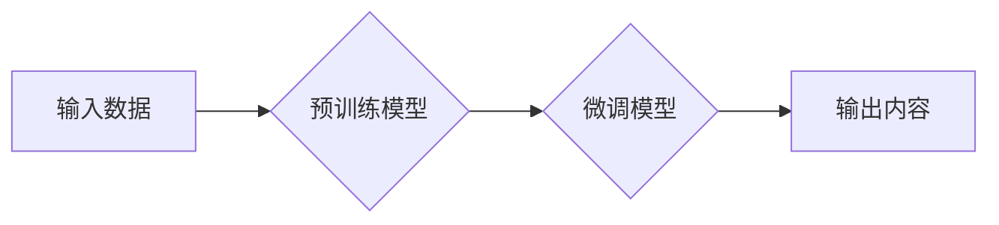

                 

## AIGC未来发展趋势预测

> 关键词：AIGC, 文本生成, 图像生成, 多模态, 伦理, 安全, 监管

## 1. 背景介绍

近年来，人工智能（AI）技术取得了飞速发展，特别是生成式人工智能（AIGC）的兴起，为人们的生活和工作带来了革命性的改变。AIGC是指能够根据输入的文本、图像、音频等数据生成新的文本、图像、音频等内容的AI模型。

AIGC技术的核心是深度学习算法，特别是Transformer模型的出现，使得AIGC模型在文本生成、图像生成等领域取得了突破性进展。例如，OpenAI的GPT-3、DALL-E 2、Google的LaMDA、Imagen等模型都展现了强大的生成能力，能够创作出逼真的图像、流畅的文本、自然的对话等。

AIGC技术的应用场景日益广泛，涵盖了内容创作、教育培训、科学研究、艺术设计等多个领域。它可以帮助人们更高效地创作内容，提高工作效率，激发创造力，并为人们的生活带来更多可能性。

## 2. 核心概念与联系

### 2.1  AIGC的核心概念

AIGC的核心概念包括：

* **生成式模型:**  能够根据输入数据生成新数据的模型，例如文本生成模型、图像生成模型等。
* **深度学习:**  一种模仿人类大脑学习机制的机器学习方法，在AIGC领域中发挥着至关重要的作用。
* **Transformer模型:**  一种新型的神经网络架构，能够有效处理序列数据，在自然语言处理和图像生成领域取得了显著成果。
* **数据驱动:**  AIGC模型的训练和性能依赖于海量数据的支持。

### 2.2  AIGC的联系

AIGC技术与其他AI技术密切相关，例如：

* **自然语言处理（NLP）:**  AIGC模型通常基于NLP技术，能够理解和生成人类语言。
* **计算机视觉（CV）:**  图像生成模型依赖于CV技术，能够识别和理解图像内容。
* **机器学习（ML）:**  AIGC模型是机器学习的一种应用，需要通过训练数据学习生成规则。

**Mermaid 流程图**



## 3. 核心算法原理 & 具体操作步骤

### 3.1  算法原理概述

AIGC的核心算法原理是基于深度学习的生成式模型，主要包括以下几个方面：

* **编码器-解码器架构:**  将输入数据编码成一个隐藏表示，然后解码成输出内容。
* **注意力机制:**  允许模型关注输入数据中的重要部分，提高生成内容的质量。
* **循环神经网络（RNN）:**  能够处理序列数据，例如文本和语音。
* **变分自编码器（VAE）:**  能够学习数据的潜在表示，用于生成新的数据。

### 3.2  算法步骤详解

AIGC模型的训练和生成过程可以概括为以下步骤：

1. **数据收集和预处理:**  收集大量相关数据，并进行清洗、格式化等预处理操作。
2. **模型选择和训练:**  选择合适的生成式模型，并使用训练数据进行训练，学习生成规则。
3. **模型评估和优化:**  使用测试数据评估模型性能，并根据评估结果进行模型优化。
4. **内容生成:**  将输入数据输入到训练好的模型中，模型根据学习到的规则生成新的内容。

### 3.3  算法优缺点

**优点:**

* **生成能力强:**  能够生成高质量、逼真的文本、图像、音频等内容。
* **应用场景广泛:**  在内容创作、教育培训、科学研究等多个领域都有应用潜力。
* **提高效率:**  可以自动化完成内容创作等任务，提高工作效率。

**缺点:**

* **数据依赖:**  模型性能依赖于海量数据的支持，数据质量直接影响生成内容的质量。
* **伦理风险:**  可能被用于生成虚假信息、恶意内容等，需要加强伦理监管。
* **计算资源消耗:**  训练大型AIGC模型需要大量的计算资源，成本较高。

### 3.4  算法应用领域

AIGC技术在以下领域具有广泛的应用前景：

* **内容创作:**  自动生成新闻报道、小说、诗歌、剧本等内容。
* **教育培训:**  生成个性化学习内容、模拟真实场景的教学案例。
* **科学研究:**  辅助科学家进行数据分析、模型构建、实验设计等工作。
* **艺术设计:**  生成艺术作品、设计产品、创作音乐等。
* **客服服务:**  提供智能客服机器人，自动回复用户咨询。

## 4. 数学模型和公式 & 详细讲解 & 举例说明

### 4.1  数学模型构建

AIGC模型通常基于深度学习框架，其数学模型主要包括以下几个部分：

* **损失函数:**  用于衡量模型预测结果与真实值的差距，例如交叉熵损失函数、均方误差损失函数等。
* **优化算法:**  用于更新模型参数，例如梯度下降算法、Adam算法等。
* **激活函数:**  用于引入非线性，提高模型的表达能力，例如ReLU函数、Sigmoid函数等。

### 4.2  公式推导过程

例如，在文本生成任务中，常用的损失函数是交叉熵损失函数，其公式如下：

$$
L = -\sum_{i=1}^{N} y_i \log(\hat{y}_i)
$$

其中：

* $L$ 是损失函数值。
* $N$ 是文本长度。
* $y_i$ 是真实标签。
* $\hat{y}_i$ 是模型预测的概率。

### 4.3  案例分析与讲解

假设我们训练一个文本生成模型，目标是生成一段关于“猫”的描述。

训练数据包括大量关于猫的文本描述，模型通过学习这些数据，学习到猫的特征和描述方式。

在生成新文本时，模型会根据输入的提示词（例如“一只可爱的”）生成一系列词，并根据交叉熵损失函数的计算结果，选择最符合真实描述的词语组合。

最终生成的文本可能如下：

“一只可爱的猫咪，毛茸茸的，喜欢吃鱼。”

## 5. 项目实践：代码实例和详细解释说明

### 5.1  开发环境搭建

AIGC模型的开发环境通常需要以下软件和工具：

* **Python:**  AIGC模型开发的主要编程语言。
* **深度学习框架:**  例如TensorFlow、PyTorch等，用于构建和训练模型。
* **GPU:**  用于加速模型训练，可以显著提高训练效率。

### 5.2  源代码详细实现

以下是一个简单的文本生成模型的代码示例，使用PyTorch框架实现：

```python
import torch
import torch.nn as nn

class TextGenerator(nn.Module):
    def __init__(self, vocab_size, embedding_dim, hidden_dim):
        super(TextGenerator, self).__init__()
        self.embedding = nn.Embedding(vocab_size, embedding_dim)
        self.rnn = nn.RNN(embedding_dim, hidden_dim)
        self.fc = nn.Linear(hidden_dim, vocab_size)

    def forward(self, x):
        embedded = self.embedding(x)
        output, hidden = self.rnn(embedded)
        output = self.fc(output)
        return output

# 模型参数
vocab_size = 10000
embedding_dim = 128
hidden_dim = 256

# 实例化模型
model = TextGenerator(vocab_size, embedding_dim, hidden_dim)

# 训练模型
# ...

# 生成文本
# ...
```

### 5.3  代码解读与分析

* **模型结构:**  该模型采用编码器-解码器架构，其中编码器部分使用RNN网络处理输入文本序列，解码器部分使用全连接层生成输出文本序列。
* **参数设置:**  模型参数包括词汇大小、嵌入维度、隐藏层维度等，这些参数需要根据具体任务和数据集进行调整。
* **训练过程:**  模型训练需要使用训练数据，并通过反向传播算法更新模型参数，降低损失函数值。
* **文本生成:**  在生成文本时，需要提供一个初始提示词，模型会根据提示词和训练到的知识生成后续文本序列。

### 5.4  运行结果展示

运行该代码后，可以生成一段关于“猫”的文本描述，例如：

“一只可爱的猫咪，毛茸茸的，喜欢吃鱼。”

## 6. 实际应用场景

### 6.1  内容创作

AIGC可以用于自动生成各种类型的文本内容，例如：

* **新闻报道:**  根据事件数据自动生成新闻报道，提高新闻发布效率。
* **小说、诗歌:**  根据特定主题和风格生成创意文本，辅助作家创作。
* **广告文案:**  根据目标客户和产品特点生成吸引人的广告文案。

### 6.2  教育培训

AIGC可以用于个性化学习内容，例如：

* **生成个性化学习计划:**  根据学生的学习进度和能力生成个性化的学习计划。
* **生成互动式学习内容:**  生成模拟真实场景的教学案例，提高学生的学习兴趣和参与度。
* **提供智能辅导:**  根据学生的学习问题提供智能化的辅导和解答。

### 6.3  科学研究

AIGC可以辅助科学家进行数据分析、模型构建、实验设计等工作，例如：

* **数据分析:**  自动分析大量实验数据，发现潜在的规律和趋势。
* **模型构建:**  根据实验数据构建科学模型，预测实验结果。
* **实验设计:**  根据模型预测结果，设计更有效的实验方案。

### 6.4  未来应用展望

AIGC技术的应用场景还在不断扩展，未来可能应用于以下领域：

* **医疗保健:**  辅助医生诊断疾病、制定治疗方案。
* **金融服务:**  自动分析金融数据、识别欺诈行为。
* **法律服务:**  自动分析法律文件、提供法律建议。

## 7. 工具和资源推荐

### 7.1  学习资源推荐

* **书籍:**  《深度学习》、《自然语言处理》等。
* **在线课程:**  Coursera、edX等平台上的深度学习、自然语言处理课程。
* **博客和论坛:**  AI相关的博客和论坛，例如Towards Data Science、Reddit等。

### 7.2  开发工具推荐

* **深度学习框架:**  TensorFlow、PyTorch、Keras等。
* **文本处理工具:**  NLTK、spaCy等。
* **图像处理工具:**  OpenCV、Pillow等。

### 7.3  相关论文推荐

* **Attention Is All You Need:**  Transformer模型的开创性论文。
* **BERT: Pre-training of Deep Bidirectional Transformers for Language Understanding:**  BERT模型的论文。
* **DALL-E 2: Hierarchical Text-Conditional Image Generation with CLIP Latents:**  DALL-E 2模型的论文。

## 8. 总结：未来发展趋势与挑战

### 8.1  研究成果总结

近年来，AIGC技术取得了显著进展，模型生成能力不断提升，应用场景也越来越广泛。

### 8.2  未来发展趋势

* **多模态生成:**  融合文本、图像、音频等多种模态数据，生成更丰富、更具创意的内容。
* **个性化生成:**  根据用户的喜好、需求生成个性化的内容，提供更精准的服务。
* **可解释性增强:**  提高AIGC模型的透明度和可解释性，增强用户对模型生成的信任度。

### 8.3  面临的挑战

* **数据安全和隐私:**  AIGC模型训练需要大量数据，如何保护数据安全和隐私是一个重要挑战。
* **伦理风险:**  AIGC模型可能被用于生成虚假信息、恶意内容等，需要加强伦理监管。
* **公平性和偏见:**  AIGC模型的训练数据可能存在偏见，导致模型生成的输出存在公平性问题。

### 8.4  研究展望

未来，AIGC技术将继续朝着更智能、更安全、更可解释的方向发展，并将在更多领域发挥重要作用。

## 9. 附录：常见问题与解答

### 9.1  AIGC模型的训练需要多少数据？

AIGC模型的训练数据量取决于模型复杂度和任务难度，一般来说，需要大量的文本数据才能训练出高质量的模型。

### 9.2  AIGC模型的生成结果是否真实可靠？

AIGC模型生成的文本、图像等内容虽然逼真，但并不代表真实可靠，需要根据具体情况进行判断。

### 9.3  如何避免AIGC模型生成虚假信息？

需要加强AIGC模型的伦理监管，并开发出能够识别和过滤虚假信息的算法。

### 9.4  AIGC技术对人类工作有什么影响？

AIGC技术可以自动化完成一些重复性工作，提高工作效率，但也可能导致部分工作岗位被取代。

### 9.5  AIGC技术的发展前景如何？

AIGC技术发展前景广阔，未来将应用于更多领域，改变人们的生活和工作方式。


作者：禅与计算机程序设计艺术 / Zen and the Art of Computer Programming<end_of_turn>

