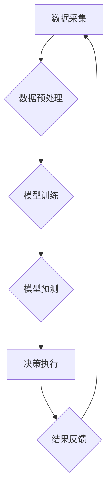

                 

## AI与人类计算：打造可持续发展的城市交通与基础设施建设规划与管理

> 关键词：人工智能、城市交通、基础设施建设、可持续发展、人类计算、优化算法、机器学习、数据分析、预测模型

## 1. 背景介绍

随着全球人口的持续增长和城市化的加速推进，城市交通拥堵、基础设施老化、资源消耗过快等问题日益突出，严重影响着城市的可持续发展。传统交通规划和基础设施建设模式难以有效应对这些挑战，亟需引入新的技术手段和理念来推动城市交通和基础设施的转型升级。

人工智能（AI）作为一门新兴技术，凭借其强大的数据处理、学习和决策能力，为解决城市交通和基础设施建设面临的难题提供了新的思路和解决方案。AI技术能够通过对海量交通数据和基础设施运行数据的分析，识别出行模式、预测交通流量、优化交通信号控制、智能调度公共交通、评估基础设施风险等，从而提高城市交通效率、降低碳排放、提升基础设施运营水平。

## 2. 核心概念与联系

**2.1 人类计算与AI计算**

人类计算是指人类利用自身的认知能力、经验和判断力来解决问题和进行决策的过程。AI计算是指利用人工智能算法和模型，通过对数据的分析和学习，模拟人类的认知能力，自动完成任务和决策的过程。

**2.2 AI与城市交通与基础设施建设的融合**

AI技术与城市交通和基础设施建设的融合，可以从以下几个方面体现：

* **数据驱动决策:** AI可以对海量交通数据和基础设施运行数据进行分析，挖掘其中的规律和趋势，为城市交通规划和基础设施建设提供数据支撑。
* **智能化运营:** AI可以实现交通信号灯的智能控制、公共交通的智能调度、基础设施的智能监测和维护，提高城市交通效率和基础设施运营水平。
* **个性化服务:** AI可以根据用户的出行需求和喜好，提供个性化的交通出行方案和基础设施服务。
* **可持续发展:** AI可以帮助城市优化交通流量，减少碳排放，提高资源利用效率，促进城市的可持续发展。

**2.3 核心架构**



## 3. 核心算法原理 & 具体操作步骤

**3.1 算法原理概述**

在城市交通和基础设施建设领域，常用的AI算法包括：

* **机器学习:** 通过训练模型，从数据中学习规律，进行预测和决策。
* **深度学习:** 利用多层神经网络，对复杂数据进行更深入的学习和分析。
* **强化学习:** 通过试错学习，优化策略，实现目标。

**3.2 算法步骤详解**

以机器学习为例，其基本步骤如下：

1. **数据采集:** 收集相关数据，例如交通流量数据、基础设施运行数据、天气数据等。
2. **数据预处理:** 对数据进行清洗、转换、特征提取等处理，使其适合模型训练。
3. **模型选择:** 根据具体任务选择合适的机器学习模型，例如线性回归、逻辑回归、决策树、支持向量机等。
4. **模型训练:** 利用训练数据，训练模型参数，使模型能够学习数据中的规律。
5. **模型评估:** 利用测试数据，评估模型的性能，例如准确率、召回率、F1-score等。
6. **模型部署:** 将训练好的模型部署到实际应用场景中，用于预测和决策。

**3.3 算法优缺点**

* **优点:** 能够自动学习数据规律，提高预测精度，自动化程度高。
* **缺点:** 需要大量数据进行训练，对数据质量要求高，解释性较差。

**3.4 算法应用领域**

* **交通流量预测:** 预测未来交通流量，优化交通信号控制、道路规划等。
* **公共交通调度:** 智能调度公交车、地铁等公共交通，提高运营效率。
* **基础设施风险评估:** 评估基础设施的风险，及时进行维护和修复。
* **城市规划:** 辅助城市规划，优化城市布局和交通网络。

## 4. 数学模型和公式 & 详细讲解 & 举例说明

**4.1 数学模型构建**

在城市交通和基础设施建设领域，常用的数学模型包括：

* **交通流量模型:** 描述交通流量的生成、流向和变化规律。
* **基础设施寿命模型:** 描述基础设施的劣化过程和寿命预测。
* **成本效益模型:** 评估不同方案的成本和效益，选择最优方案。

**4.2 公式推导过程**

以交通流量模型为例，常用的模型是微分方程模型，其基本形式如下：

$$
\frac{dQ}{dt} = S - D
$$

其中：

* $Q$ 表示交通流量
* $t$ 表示时间
* $S$ 表示交通流量的生成率
* $D$ 表示交通流量的消耗率

**4.3 案例分析与讲解**

假设城市A的交通流量模型为：

$$
\frac{dQ}{dt} = 1000 - 0.5Q
$$

其中，$Q$ 表示单位时间内通过某个路段的车辆数。

通过解微分方程，可以得到交通流量随时间的变化规律。例如，如果初始流量为0，则交通流量随时间变化的曲线为：

$$
Q(t) = 2000(1 - e^{-0.5t})
$$

该公式表明，交通流量会随着时间逐渐增加，最终趋于稳定值2000辆/小时。

## 5. 项目实践：代码实例和详细解释说明

**5.1 开发环境搭建**

* 操作系统: Ubuntu 20.04 LTS
* Python 版本: 3.8.10
* 必要的库: pandas, numpy, scikit-learn, matplotlib

**5.2 源代码详细实现**

```python
import pandas as pd
from sklearn.linear_model import LinearRegression

# 数据加载
data = pd.read_csv('traffic_data.csv')

# 数据预处理
X = data[['hour', 'weekday']]
y = data['traffic_volume']

# 模型训练
model = LinearRegression()
model.fit(X, y)

# 模型预测
new_data = pd.DataFrame({'hour': [10], 'weekday': [1]})
predicted_volume = model.predict(new_data)

# 结果展示
print(f'预测的交通流量为: {predicted_volume[0]}')
```

**5.3 代码解读与分析**

* 代码首先加载交通数据，并进行数据预处理，将时间和星期作为特征，交通流量作为目标变量。
* 然后，使用线性回归模型进行模型训练，将训练好的模型用于预测新的交通流量。
* 最后，将预测结果打印出来。

**5.4 运行结果展示**

运行代码后，会输出预测的交通流量值。

## 6. 实际应用场景

**6.1 交通流量预测与优化**

AI技术可以用于预测城市交通流量，为交通信号控制、道路规划、公共交通调度等提供数据支持，从而提高交通效率，减少拥堵。

**6.2 基础设施风险评估与维护**

AI可以分析基础设施运行数据，识别潜在风险，并预测基础设施的寿命，帮助城市及时进行维护和修复，延长基础设施使用寿命。

**6.3 城市规划与发展**

AI可以辅助城市规划，优化城市布局和交通网络，促进城市的可持续发展。

**6.4 未来应用展望**

随着AI技术的不断发展，其在城市交通和基础设施建设领域的应用将更加广泛和深入，例如：

* **无人驾驶交通:** AI可以实现无人驾驶汽车的自动驾驶，提高交通安全性和效率。
* **智能交通管理:** AI可以实现智能交通管理系统，实时监控交通状况，并根据需要进行动态调整。
* **智慧城市建设:** AI可以作为智慧城市建设的重要支撑，促进城市智能化发展。

## 7. 工具和资源推荐

**7.1 学习资源推荐**

* **在线课程:** Coursera, edX, Udacity 等平台提供丰富的AI课程。
* **书籍:** 《深度学习》、《机器学习实战》等书籍。
* **开源项目:** TensorFlow, PyTorch 等开源项目。

**7.2 开发工具推荐**

* **Python:** 作为AI开发的主要语言，Python拥有丰富的库和工具。
* **Jupyter Notebook:** 用于代码编写、数据分析和可视化。
* **云计算平台:** AWS, Azure, GCP 等云计算平台提供AI开发所需的资源和服务。

**7.3 相关论文推荐**

* **交通流量预测:** "Deep Learning for Traffic Flow Prediction"
* **基础设施风险评估:** "Machine Learning for Infrastructure Risk Assessment"
* **城市规划:** "AI-Powered Urban Planning: A Review"

## 8. 总结：未来发展趋势与挑战

**8.1 研究成果总结**

AI技术在城市交通和基础设施建设领域取得了显著成果，例如交通流量预测、基础设施风险评估、城市规划等方面都取得了突破。

**8.2 未来发展趋势**

* **模型更加复杂:** 深度学习模型将更加复杂，能够处理更复杂的数据，进行更精准的预测。
* **数据更加丰富:** 城市数据将更加丰富，包括交通数据、基础设施数据、环境数据等，为AI模型提供更全面的数据支持。
* **应用更加广泛:** AI技术将应用于更多城市交通和基础设施建设领域，例如无人驾驶交通、智能交通管理等。

**8.3 面临的挑战**

* **数据质量:** AI模型的性能依赖于数据质量，如何获取高质量的数据仍然是一个挑战。
* **模型解释性:** 许多AI模型的决策过程难以解释，如何提高模型的解释性仍然是一个研究方向。
* **伦理问题:** AI技术应用需要考虑伦理问题，例如数据隐私、算法偏见等。

**8.4 研究展望**

未来，需要继续加强AI技术在城市交通和基础设施建设领域的应用研究，解决数据质量、模型解释性和伦理问题，推动AI技术更好地服务于城市可持续发展。

## 9. 附录：常见问题与解答

**9.1 如何选择合适的AI模型？**

选择合适的AI模型需要根据具体任务和数据特点进行选择。例如，对于预测连续数值的交通流量，可以使用线性回归、支持向量回归等模型；对于分类任务，可以使用决策树、随机森林等模型。

**9.2 如何评估AI模型的性能？**

常用的AI模型性能评估指标包括准确率、召回率、F1-score、AUC等。选择合适的评估指标需要根据具体任务和数据特点进行选择。

**9.3 如何解决AI模型的过拟合问题？**

过拟合是指AI模型对训练数据过拟合，导致在测试数据上的性能下降。解决过拟合问题的方法包括：

* 减少模型复杂度
* 增加训练数据量
* 使用正则化技术
* 使用交叉验证技术


作者：禅与计算机程序设计艺术 / Zen and the Art of Computer Programming 
<end_of_turn>

