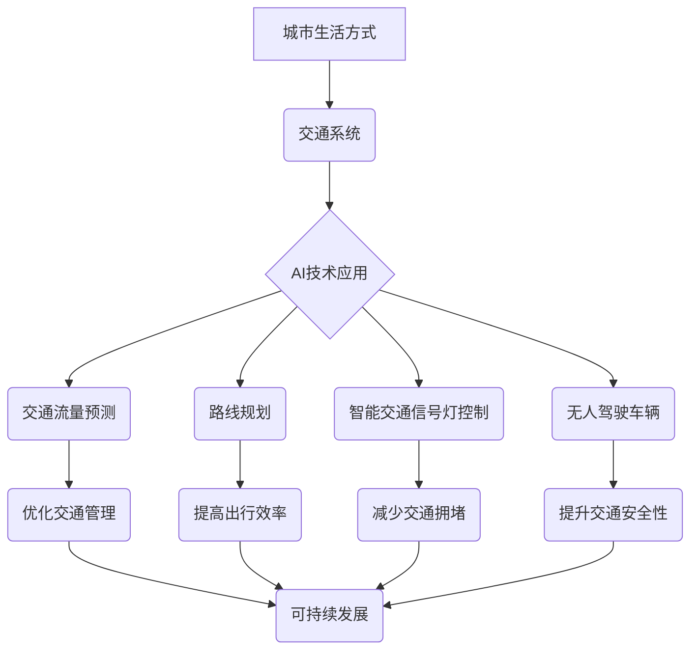

                 

## AI与人类计算：打造可持续发展的城市生活方式与交通系统规划

> 关键词：人工智能、城市规划、交通系统、可持续发展、人类计算、机器学习、优化算法、数据分析、预测模型

## 1. 背景介绍

随着全球人口的持续增长和城市化的加速推进，城市面临着日益严峻的挑战，其中交通拥堵、资源消耗、环境污染等问题尤为突出。传统城市规划和交通管理模式难以有效应对这些挑战，迫切需要引入新的技术和理念来构建更加智能、高效、可持续的城市生活方式。

人工智能（AI）作为一门新兴技术，凭借其强大的数据处理、分析和预测能力，为城市规划和交通管理提供了全新的解决方案。AI技术能够帮助我们更好地理解城市运行规律，优化资源配置，提高交通效率，并促进城市的可持续发展。

## 2. 核心概念与联系

**2.1 人类计算与人工智能**

人类计算是指人类利用自身的认知能力和经验进行计算和决策的过程。传统城市规划和交通管理主要依赖于人类计算，但随着城市规模和复杂度的不断增加，人类计算的效率和准确性受到限制。

人工智能，特别是机器学习和深度学习，能够模拟人类的学习和推理能力，从海量数据中提取规律，并进行预测和决策。AI技术可以辅助人类进行城市规划和交通管理，提高效率和准确性。

**2.2 城市生活方式与交通系统**

城市生活方式是指城市居民在日常生活中所经历的各种活动、行为和体验。交通系统是城市生活方式的重要组成部分，它直接影响着居民的出行效率、生活质量和城市的可持续发展。

AI技术可以应用于各个环节，从交通流量预测、路线规划、智能交通信号灯控制到无人驾驶车辆，全面提升城市交通系统的效率和安全性。

**2.3 可持续发展与城市规划**

可持续发展是指满足当前需求，而不损害后代满足其自身需求的能力。城市规划需要考虑经济、社会和环境的平衡发展，以实现城市的可持续发展目标。

AI技术可以帮助我们优化城市资源配置，减少交通拥堵和污染，提高城市能源效率，从而促进城市的可持续发展。

**2.4 核心概念架构**



## 3. 核心算法原理 & 具体操作步骤

**3.1 算法原理概述**

在城市规划和交通系统规划中，常用的AI算法包括：

* **机器学习算法:** 用于从历史数据中学习模式，预测未来交通流量、出行需求等。常见的机器学习算法包括线性回归、逻辑回归、决策树、支持向量机、神经网络等。
* **优化算法:** 用于寻找最优的交通路线、信号灯控制策略等，以提高交通效率和安全性。常见的优化算法包括遗传算法、模拟退火算法、粒子群算法等。

**3.2 算法步骤详解**

以交通流量预测为例，其具体操作步骤如下：

1. **数据收集:** 收集历史交通流量数据、天气数据、时间数据等相关信息。
2. **数据预处理:** 对收集到的数据进行清洗、转换、特征工程等处理，使其适合机器学习算法的训练。
3. **模型选择:** 根据预测任务的特点选择合适的机器学习算法，例如线性回归、神经网络等。
4. **模型训练:** 使用训练数据训练选择的机器学习模型，调整模型参数，使其能够准确预测未来交通流量。
5. **模型评估:** 使用测试数据评估模型的预测精度，并进行模型调优。
6. **模型部署:** 将训练好的模型部署到实际应用环境中，实时预测交通流量，并为交通管理提供决策支持。

**3.3 算法优缺点**

* **优点:**

    * 能够从海量数据中提取规律，预测未来交通流量等。
    * 能够优化交通管理策略，提高交通效率和安全性。
    * 能够促进城市的可持续发展。

* **缺点:**

    * 需要大量的数据进行训练，数据质量直接影响模型精度。
    * 算法模型的复杂度较高，需要专业的技术人员进行开发和维护。
    * 算法模型的解释性较差，难以理解模型的决策过程。

**3.4 算法应用领域**

* 交通流量预测
* 出行路线规划
* 智能交通信号灯控制
* 无人驾驶车辆
* 城市规划和管理
* 公共交通调度

## 4. 数学模型和公式 & 详细讲解 & 举例说明

**4.1 数学模型构建**

交通流量预测模型通常采用时间序列分析方法，将交通流量视为一个随时间变化的函数。常用的数学模型包括：

* **ARIMA模型:** 自回归移动平均模型，用于预测时间序列数据，其核心思想是利用历史数据中的自相关性和偏自相关性来预测未来值。
* **SARIMA模型:** 季节性ARIMA模型，用于预测具有季节性特征的时间序列数据。
* **神经网络模型:** 能够学习复杂的时间序列模式，预测未来交通流量。

**4.2 公式推导过程**

ARIMA模型的公式推导过程较为复杂，这里仅列出其基本公式：

$$y_t = c + \phi_1 y_{t-1} + \phi_2 y_{t-2} + ... + \phi_p y_{t-p} + \theta_1 \epsilon_{t-1} + \theta_2 \epsilon_{t-2} + ... + \theta_q \epsilon_{t-q} + \epsilon_t$$

其中：

* $y_t$ 表示时间t的交通流量
* $c$ 表示截距项
* $\phi_i$ 表示自回归系数
* $p$ 表示自回归阶数
* $\theta_i$ 表示移动平均系数
* $q$ 表示移动平均阶数
* $\epsilon_t$ 表示随机误差项

**4.3 案例分析与讲解**

假设我们想要预测某条道路的交通流量，可以使用ARIMA模型进行预测。首先，我们需要收集该道路的历史交通流量数据，并进行数据预处理。然后，我们可以使用ARIMA模型的公式进行参数估计，得到模型的最佳参数值。最后，我们可以使用训练好的模型预测未来交通流量。

## 5. 项目实践：代码实例和详细解释说明

**5.1 开发环境搭建**

* 操作系统：Windows/Linux/macOS
* Python版本：3.6+
* 必要的库：pandas, numpy, scikit-learn, matplotlib

**5.2 源代码详细实现**

```python
import pandas as pd
from sklearn.model_selection import train_test_split
from sklearn.linear_model import LinearRegression
from sklearn.metrics import mean_squared_error

# 数据加载
data = pd.read_csv('traffic_data.csv')

# 数据预处理
# ...

# 特征选择
X = data[['hour', 'weekday', 'weather']]
y = data['traffic_volume']

# 数据分割
X_train, X_test, y_train, y_test = train_test_split(X, y, test_size=0.2, random_state=42)

# 模型训练
model = LinearRegression()
model.fit(X_train, y_train)

# 模型预测
y_pred = model.predict(X_test)

# 模型评估
mse = mean_squared_error(y_test, y_pred)
print('Mean Squared Error:', mse)

# ...
```

**5.3 代码解读与分析**

* 代码首先加载交通流量数据，并进行必要的预处理，例如缺失值处理、数据归一化等。
* 然后，代码选择合适的特征作为模型输入，并将数据分割为训练集和测试集。
* 使用线性回归模型进行训练，并使用测试集评估模型的性能。
* 最后，代码输出模型的评估指标，例如均方误差。

**5.4 运行结果展示**

运行结果展示了模型的预测精度，例如均方误差值。

## 6. 实际应用场景

**6.1 交通流量预测**

AI技术可以用于预测未来交通流量，帮助交通管理部门优化交通信号灯控制策略、调整道路通行规则，从而缓解交通拥堵。

**6.2 出行路线规划**

AI技术可以根据实时交通流量数据，为用户提供最优的出行路线，节省出行时间和燃油消耗。

**6.3 智能交通信号灯控制**

AI技术可以根据实时交通流量情况，动态调整交通信号灯的绿灯时间，提高交通流量的通行效率。

**6.4 无人驾驶车辆**

AI技术是无人驾驶车辆的核心技术，可以帮助车辆感知周围环境、做出决策、安全行驶。

**6.5 城市规划和管理**

AI技术可以帮助城市规划部门分析城市人口分布、交通流量、资源消耗等数据，制定更加科学合理的城市规划方案。

**6.6 未来应用展望**

随着AI技术的不断发展，其在城市规划和交通系统规划中的应用场景将会更加广泛，例如：

* 更精准的交通流量预测
* 更智能的出行路线规划
* 更高效的交通信号灯控制
* 更安全的无人驾驶车辆
* 更可持续的城市发展

## 7. 工具和资源推荐

**7.1 学习资源推荐**

* **书籍:**
    * 《深度学习》
    * 《机器学习实战》
    * 《Python机器学习》
* **在线课程:**
    * Coursera
    * edX
    * Udacity

**7.2 开发工具推荐**

* **Python:** 
    * Jupyter Notebook
    * PyCharm
* **数据分析工具:**
    * pandas
    * NumPy
    * Scikit-learn
* **可视化工具:**
    * Matplotlib
    * Seaborn

**7.3 相关论文推荐**

* **交通流量预测:**
    * "Traffic Flow Prediction Using Deep Learning"
    * "A Hybrid Approach for Traffic Flow Prediction"
* **出行路线规划:**
    * "A Reinforcement Learning Approach to Route Planning"
    * "Deep Reinforcement Learning for Traffic Routing"
* **智能交通信号灯控制:**
    * "Adaptive Traffic Signal Control Using Machine Learning"
    * "Deep Learning for Traffic Signal Optimization"

## 8. 总结：未来发展趋势与挑战

**8.1 研究成果总结**

AI技术在城市规划和交通系统规划领域取得了显著的成果，例如：

* 交通流量预测精度显著提高
* 出行路线规划更加智能高效
* 交通信号灯控制更加智能化
* 无人驾驶车辆技术不断成熟

**8.2 未来发展趋势**

* **更精准的预测模型:** 
    * 利用更先进的机器学习算法和深度学习模型，提高交通流量预测的精度和准确性。
* **更智能的交通管理系统:** 
    * 利用AI技术构建更加智能的交通管理系统，实现交通流量的实时监控、动态调整和智能控制。
* **更安全的出行环境:** 
    * 利用AI技术开发更加安全的无人驾驶车辆，提高道路交通安全。
* **更可持续的城市发展:** 
    * 利用AI技术优化城市资源配置，减少交通拥堵和污染，促进城市的可持续发展。

**8.3 面临的挑战**

* **数据质量问题:** AI模型的性能直接依赖于数据质量，而交通数据往往存在噪声、缺失值等问题，需要进行有效的处理和清洗。
* **算法模型的解释性:** 许多AI算法模型的决策过程难以解释，这使得其应用在一些关键领域存在风险。
* **伦理和安全问题:** AI技术在交通领域的应用可能引发一些伦理和安全问题，例如数据隐私、算法偏见、无人驾驶车辆的责任等，需要进行深入研究和探讨。

**8.4 研究展望**

未来，AI技术在城市规划和交通系统规划领域将继续发挥重要作用，我们需要不断探索新的算法模型、开发更强大的计算平台，并解决数据质量、算法解释性和伦理安全等挑战，才能真正实现AI技术在城市发展中的价值。

## 9. 附录：常见问题与解答

**9.1 如何选择合适的AI算法模型？**

选择合适的AI算法模型需要根据具体的应用场景和数据特点进行选择。例如，对于时间序列数据，可以使用ARIMA模型或神经网络模型进行预测；对于分类问题，可以使用决策树、支持向量机或神经网络模型进行分类。

**9.2 如何处理交通数据中的噪声和缺失值？**

可以采用多种方法处理交通数据中的噪声和缺失值，例如：

* **数据清洗:** 移除明显错误的数据点，例如异常值。
* **数据填充:** 使用平均值、中位数或其他插值方法填充缺失值。
* **数据降维:** 使用主成分分析等方法降低数据维度，减少噪声的影响。

**9.3 如何评估AI模型的性能？**

常用的AI模型性能评估指标包括：

* **均方误差 (MSE):** 用于回归问题的评估指标，衡量预测值与真实值的平均平方差。
* **平均绝对误差 (MAE):** 用于回归问题的评估指标，衡量预测值与真实值的平均绝对差。
* **准确率 (Accuracy):** 用于分类问题的评估指标，衡量预测正确的样本比例。
* **召回率 (Recall):** 用于分类问题的评估指标，衡量模型对正样本的识别能力。
* **F1-score:** 用于分类问题的评估指标，综合考虑了准确率和召回率。


作者：禅与计算机程序设计艺术 / Zen and the Art of Computer Programming 
<end_of_turn>

