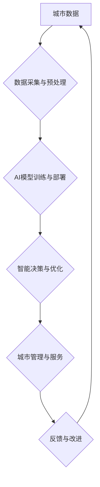

                 

## AI与人类计算：打造可持续发展的城市生活模式

> 关键词：人工智能、城市计算、可持续发展、数据驱动、智能优化、人类计算、协同智能

## 1. 背景介绍

全球人口持续增长和城市化进程加速，城市面临着日益严峻的挑战，包括资源短缺、环境污染、交通拥堵、公共服务压力等。传统城市管理模式难以有效应对这些挑战，迫切需要革新性的解决方案。人工智能（AI）作为一种新兴技术，凭借其强大的数据处理、分析和决策能力，为打造可持续发展的城市生活模式提供了新的机遇。

城市计算是指利用大数据、云计算、物联网等技术，对城市运行状态进行实时监测、分析和优化，以提高城市管理效率、提升居民生活品质。AI与城市计算的结合，将赋予城市更强的智能化和自适应能力，实现城市资源的优化配置、环境的智能监管、交通的智能调度、公共服务的智能化提供等。

## 2. 核心概念与联系

**2.1 城市计算与AI的融合**

城市计算的核心是收集、分析和利用城市数据，而AI技术能够对海量城市数据进行高效的处理和分析，挖掘其中的隐藏规律和价值。AI算法可以帮助城市管理者识别城市运行中的问题，预测未来趋势，并制定相应的解决方案。

**2.2 人类计算与AI协同**

人类计算是指人类利用其认知能力、经验和创造力进行计算和决策。AI技术可以辅助人类进行计算和分析，减轻人类的工作负担，释放人类的创造力和决策能力。人类和AI的协同，能够形成一个更加高效、智能的城市管理体系。

**2.3  核心概念架构**



## 3. 核心算法原理 & 具体操作步骤

**3.1 算法原理概述**

城市计算与AI的融合主要依赖于以下核心算法：

* **机器学习（ML）：** 用于从数据中学习模式和规律，并进行预测和分类。例如，可以利用机器学习算法预测交通流量、识别违章停车、优化能源消耗等。
* **深度学习（DL）：** 一种更高级的机器学习算法，能够处理更复杂的数据，例如图像、语音、文本等。例如，可以利用深度学习算法识别城市景观、分析交通事故原因、理解居民需求等。
* **强化学习（RL）：** 用于训练智能体在特定环境中做出最佳决策。例如，可以利用强化学习算法优化交通信号灯控制、智能化管理城市绿地等。

**3.2 算法步骤详解**

以机器学习算法为例，其基本步骤如下：

1. **数据收集与预处理：** 收集城市相关数据，并进行清洗、转换、特征提取等预处理工作。
2. **模型选择：** 根据具体应用场景选择合适的机器学习算法模型，例如线性回归、逻辑回归、决策树、支持向量机等。
3. **模型训练：** 利用训练数据对模型进行训练，调整模型参数，使其能够准确地预测或分类。
4. **模型评估：** 利用测试数据对模型进行评估，评估模型的准确率、召回率、F1-score等指标。
5. **模型部署：** 将训练好的模型部署到实际应用场景中，用于进行预测或分类。

**3.3 算法优缺点**

* **优点：** 能够自动学习数据模式，提高预测和分类精度；能够处理海量数据，发现隐藏规律；能够不断优化和改进。
* **缺点：** 需要大量的数据进行训练；对数据质量要求高；模型解释性较差；容易受到数据偏差的影响。

**3.4 算法应用领域**

* **交通管理：** 交通流量预测、拥堵路段识别、交通信号灯优化、智能导航等。
* **环境监测：** 空气质量监测、水质监测、噪声污染监测、环境风险预警等。
* **公共服务：** 公共资源调度、垃圾分类、医疗服务、教育服务等。
* **城市安全：** 犯罪预测、安防监控、应急预案制定等。

## 4. 数学模型和公式 & 详细讲解 & 举例说明

**4.1 数学模型构建**

城市计算与AI的融合涉及到多种数学模型，例如：

* **线性回归模型：** 用于预测连续变量，例如城市人口增长率、交通流量等。
* **逻辑回归模型：** 用于预测分类变量，例如违章停车、交通事故发生等。
* **决策树模型：** 用于分类和预测，能够处理非线性关系，例如城市居民满意度预测等。
* **神经网络模型：** 用于处理复杂数据，例如图像识别、语音识别等。

**4.2 公式推导过程**

以线性回归模型为例，其目标是找到一条直线，使得预测值与实际值之间的误差最小。

线性回归模型的公式如下：

$$y = mx + c$$

其中：

* $y$ 是预测值
* $x$ 是输入变量
* $m$ 是斜率
* $c$ 是截距

模型参数 $m$ 和 $c$ 通过最小化误差函数来确定。常用的误差函数是均方误差（MSE）：

$$MSE = \frac{1}{n} \sum_{i=1}^{n} (y_i - \hat{y}_i)^2$$

其中：

* $n$ 是样本数量
* $y_i$ 是实际值
* $\hat{y}_i$ 是预测值

通过梯度下降算法，可以迭代更新 $m$ 和 $c$ 的值，使得 MSE 最小化。

**4.3 案例分析与讲解**

利用线性回归模型预测城市人口增长率。假设我们收集了过去 10 年的城市人口数据，并将其作为训练数据。通过训练模型，我们可以得到一个预测公式，例如：

$$y = 0.02x + 1000000$$

其中：

* $y$ 是预测的人口数
* $x$ 是年份

该公式表示，城市人口每年增长率为 2%，基础人口为 100 万。

## 5. 项目实践：代码实例和详细解释说明

**5.1 开发环境搭建**

* 操作系统：Linux 或 Windows
* Python 版本：3.6 或以上
* 必要的库：pandas、numpy、scikit-learn

**5.2 源代码详细实现**

```python
import pandas as pd
from sklearn.linear_model import LinearRegression

# 加载数据
data = pd.read_csv('city_population.csv')

# 准备数据
X = data[['Year']]
y = data['Population']

# 创建线性回归模型
model = LinearRegression()

# 训练模型
model.fit(X, y)

# 预测未来人口
future_year = 2025
future_population = model.predict([[future_year]])

# 打印结果
print(f'预测人口：{future_population[0]}')
```

**5.3 代码解读与分析**

* 首先，我们使用 pandas 库加载城市人口数据。
* 然后，我们将年份作为输入变量 X，人口数作为输出变量 y。
* 创建一个线性回归模型，并使用 fit() 方法训练模型。
* 训练完成后，我们可以使用 predict() 方法预测未来人口。

**5.4 运行结果展示**

运行代码后，会输出预测的未来人口数。

## 6. 实际应用场景

**6.1 交通管理**

* **智能交通信号灯控制：** 利用 AI 算法分析实时交通流量，动态调整信号灯时长，优化交通流量，减少拥堵。
* **智能导航系统：** 基于实时交通数据，提供最优路线规划，避免拥堵路段，提高出行效率。
* **自动驾驶汽车：** 利用 AI 算法感知周围环境，自动驾驶汽车能够安全、高效地行驶。

**6.2 环境监测**

* **空气质量监测：** 利用传感器收集空气质量数据，AI 算法分析数据，预测空气污染趋势，发布预警信息。
* **水质监测：** 利用传感器收集水质数据，AI 算法分析数据，监测水质变化，及时发现污染源。
* **噪声污染监测：** 利用传感器收集噪声数据，AI 算法分析数据，识别噪声源，制定噪声控制措施。

**6.3 公共服务**

* **智能垃圾分类：** 利用计算机视觉技术，识别垃圾类型，实现智能垃圾分类，提高垃圾处理效率。
* **医疗服务：** 利用 AI 算法分析患者数据，辅助医生诊断疾病，提高医疗服务质量。
* **教育服务：** 利用 AI 算法个性化推荐学习资源，提高学习效率。

**6.4 未来应用展望**

* **城市大脑：** 建立一个集数据分析、决策支持、智能控制于一体的城市大脑，实现城市全生命周期管理。
* **智慧社区：** 利用 AI 技术打造智慧社区，提供更加便捷、舒适、安全的居住环境。
* **可持续发展：** 利用 AI 技术优化城市资源配置，减少环境污染，促进城市可持续发展。

## 7. 工具和资源推荐

**7.1 学习资源推荐**

* **在线课程：** Coursera、edX、Udacity 等平台提供丰富的 AI 课程。
* **书籍：** 《深度学习》、《机器学习实战》等书籍。
* **开源项目：** TensorFlow、PyTorch 等开源项目。

**7.2 开发工具推荐**

* **Python：** 广泛应用于 AI 开发，拥有丰富的库和工具。
* **Jupyter Notebook：** 用于编写和执行 Python 代码，方便进行数据分析和模型训练。
* **TensorFlow、PyTorch：** 深度学习框架，用于构建和训练深度学习模型。

**7.3 相关论文推荐**

* **《Attention Is All You Need》:** 介绍了 Transformer 模型，在自然语言处理领域取得了突破性进展。
* **《ImageNet Classification with Deep Convolutional Neural Networks》:** 介绍了 AlexNet 模型，在图像识别领域取得了里程碑式的成果。
* **《Deep Reinforcement Learning》:** 介绍了强化学习算法，在机器人控制、游戏 AI 等领域取得了成功应用。

## 8. 总结：未来发展趋势与挑战

**8.1 研究成果总结**

近年来，AI 技术在城市计算领域取得了显著进展，例如交通管理、环境监测、公共服务等方面都取得了突破性成果。

**8.2 未来发展趋势**

* **边缘计算：** 将 AI 计算能力部署到边缘设备，实现更快速、更低延迟的决策。
* **联邦学习：** 在不共享原始数据的情况下，联合训练 AI 模型，保护数据隐私。
* **跨模态学习：** 融合不同模态数据，例如图像、文本、语音等，构建更智能的城市模型。

**8.3 面临的挑战**

* **数据质量：** 城市数据往往存在不完整、不准确、格式不统一等问题，需要进行有效的数据清洗和预处理。
* **算法解释性：** 许多 AI 算法的决策过程难以解释，缺乏透明度，难以获得公众信任。
* **伦理问题：** AI 技术的应用可能带来伦理问题，例如数据隐私、算法偏见等，需要进行深入的伦理思考和规范。

**8.4 研究展望**

未来，AI 与城市计算的融合将继续深入发展，为打造更加智能、可持续的城市生活模式提供强大的技术支撑。需要加强基础研究，解决算法解释性、伦理问题等挑战，推动 AI 技术的健康发展。

## 9. 附录：常见问题与解答

**9.1 如何获取城市数据？**

城市数据可以从政府开放数据平台、传感器网络、商业数据提供商等渠道获取。

**9.2 如何选择合适的 AI 算法？**

选择合适的 AI 算法需要根据具体应用场景和数据特点进行分析。

**9.3 如何评估 AI 模型的性能？**

常用的评估指标包括准确率、召回率、F1-score、AUC 等。

**9.4 如何解决 AI 算法的解释性问题？**

可以使用可解释 AI 技术，例如 LIME、SHAP 等，解释 AI 模型的决策过程。


作者：禅与计算机程序设计艺术 / Zen and the Art of Computer Programming 
<end_of_turn>

