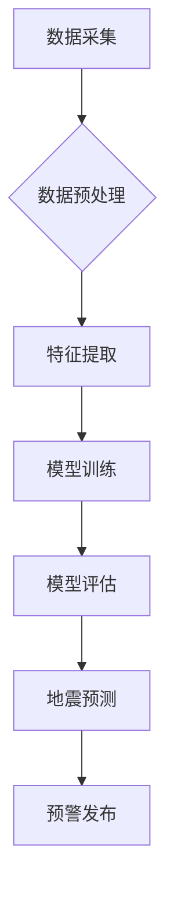

                 

## AI在地震预测中的应用：减少灾害损失

> 关键词：地震预测、人工智能、机器学习、深度学习、数据分析、灾害减灾、时间序列分析、神经网络

## 1. 背景介绍

地震是地球上最具破坏性的自然灾害之一，每年造成巨大的人员伤亡和财产损失。传统的地震预测方法主要依赖于地质学和地震学知识，但由于地震的复杂性和随机性，这些方法的准确性和可靠性有限。近年来，人工智能（AI）技术的发展为地震预测带来了新的希望。AI算法能够从海量地震数据中识别复杂的模式和趋势，从而提高地震预测的准确性和及时性。

## 2. 核心概念与联系

### 2.1  地震预测的挑战

地震预测是一个极其复杂的科学问题，面临着诸多挑战：

* **地震的随机性:** 地震发生的时间、地点和强度难以预测。
* **数据稀缺性:**  地震数据相对稀缺，且分布不均匀。
* **复杂性:** 地震的成因和机制极其复杂，涉及多种因素的相互作用。

### 2.2  AI技术在地震预测中的应用

AI技术能够克服传统地震预测方法的局限性，为地震预测提供新的思路和方法：

* **数据挖掘:** AI算法能够从海量地震数据中挖掘出隐藏的模式和趋势，识别地震前兆。
* **模式识别:** AI算法能够识别地震活动中的异常模式，例如地壳变形、地震波异常等。
* **预测建模:** AI算法能够建立地震预测模型，预测地震的发生时间、地点和强度。

### 2.3  AI技术架构

AI技术在地震预测中的应用通常采用以下架构：



## 3. 核心算法原理 & 具体操作步骤

### 3.1  算法原理概述

在AI地震预测中，常用的算法包括：

* **机器学习算法:**  例如支持向量机（SVM）、随机森林、梯度提升树等，能够从历史地震数据中学习地震发生的规律，并预测未来地震的发生概率。
* **深度学习算法:** 例如卷积神经网络（CNN）、循环神经网络（RNN）等，能够学习地震波形、地壳变形等复杂数据中的特征，提高地震预测的准确性。

### 3.2  算法步骤详解

以机器学习算法为例，其具体操作步骤如下：

1. **数据采集:** 收集历史地震数据、地壳变形数据、地震波数据等。
2. **数据预处理:** 对数据进行清洗、格式化、归一化等处理，使其适合机器学习算法的训练。
3. **特征提取:** 从原始数据中提取特征，例如地震震级、震源深度、时间间隔等，这些特征能够反映地震的本质属性。
4. **模型训练:** 使用机器学习算法对训练数据进行训练，学习地震发生的规律。
5. **模型评估:** 使用测试数据对训练好的模型进行评估，评估模型的预测准确率、召回率等指标。
6. **地震预测:** 将训练好的模型应用于新的地震数据，预测未来地震的发生概率。

### 3.3  算法优缺点

**优点:**

* 能够从海量数据中识别复杂模式，提高预测准确性。
* 能够不断学习和改进，随着数据量的增加，预测精度不断提高。

**缺点:**

* 需要大量的训练数据，且数据质量对模型性能有重要影响。
* 算法的解释性较差，难以理解模型的预测结果。

### 3.4  算法应用领域

* **地震预警:**  预测地震发生的时间和地点，为灾害减灾提供预警信息。
* **地震风险评估:**  评估不同地区的地震风险，为城市规划和基础设施建设提供参考。
* **地震灾害模拟:**  模拟地震灾害的发生过程，评估灾害的潜在影响。

## 4. 数学模型和公式 & 详细讲解 & 举例说明

### 4.1  数学模型构建

地震预测模型通常基于时间序列分析，将地震活动视为一个时间序列，并使用数学模型来描述该序列的规律。常用的数学模型包括：

* **ARIMA模型:** 自回归移动平均模型，用于描述时间序列的趋势和季节性变化。
* **SARIMA模型:** 季节性ARIMA模型，用于描述具有季节性特征的时间序列。
* **神经网络模型:**  能够学习复杂的时间序列模式，并进行预测。

### 4.2  公式推导过程

ARIMA模型的公式推导过程如下：

* **自回归部分:**  $y_t = c + \phi_1 y_{t-1} + \phi_2 y_{t-2} + ... + \phi_p y_{t-p} + \epsilon_t$

* **移动平均部分:**  $y_t = c + \theta_1 \epsilon_{t-1} + \theta_2 \epsilon_{t-2} + ... + \theta_q \epsilon_{t-q} + \epsilon_t$

其中：

* $y_t$ 是时间序列在时间 $t$ 的值。
* $c$ 是截距项。
* $\phi_i$ 是自回归系数。
* $\theta_i$ 是移动平均系数。
* $p$ 是自回归阶数。
* $q$ 是移动平均阶数。
* $\epsilon_t$ 是随机误差项。

### 4.3  案例分析与讲解

假设我们有一个地震发生频率的时间序列数据，我们可以使用ARIMA模型来预测未来地震的发生频率。首先，我们需要确定ARIMA模型的阶数 $p$ 和 $q$，可以使用信息准则或交叉验证等方法进行选择。然后，我们可以使用历史数据训练ARIMA模型，并使用训练好的模型预测未来地震的发生频率。

## 5. 项目实践：代码实例和详细解释说明

### 5.1  开发环境搭建

* **操作系统:**  Linux、Windows、macOS
* **编程语言:** Python
* **机器学习库:** scikit-learn、TensorFlow、PyTorch
* **数据处理库:** pandas、NumPy

### 5.2  源代码详细实现

```python
# 导入必要的库
import pandas as pd
from sklearn.model_selection import train_test_split
from sklearn.linear_model import LinearRegression

# 加载地震数据
data = pd.read_csv('earthquake_data.csv')

# 选择特征和目标变量
features = ['magnitude', 'depth', 'latitude', 'longitude']
target = 'frequency'

# 将数据分割为训练集和测试集
X_train, X_test, y_train, y_test = train_test_split(data[features], data[target], test_size=0.2)

# 创建线性回归模型
model = LinearRegression()

# 训练模型
model.fit(X_train, y_train)

# 预测测试集数据
y_pred = model.predict(X_test)

# 评估模型性能
from sklearn.metrics import mean_squared_error
mse = mean_squared_error(y_test, y_pred)
print(f'Mean Squared Error: {mse}')
```

### 5.3  代码解读与分析

* 代码首先导入必要的库，包括 pandas 用于数据处理、scikit-learn 用于机器学习算法。
* 然后，加载地震数据并选择特征和目标变量。
* 使用 train_test_split 函数将数据分割为训练集和测试集。
* 创建线性回归模型并使用训练集进行训练。
* 使用训练好的模型预测测试集数据，并使用 mean_squared_error 函数评估模型性能。

### 5.4  运行结果展示

运行代码后，会输出测试集数据的预测结果和均方误差值。均方误差值越小，模型的预测精度越高。

## 6. 实际应用场景

### 6.1  地震预警系统

AI技术可以用于构建地震预警系统，提前预警地震发生，为人们提供逃生时间。

### 6.2  灾害减灾规划

AI技术可以用于评估不同地区的地震风险，为灾害减灾规划提供参考。

### 6.3  基础设施建设

AI技术可以用于评估地震对基础设施的影响，为基础设施建设提供参考。

### 6.4  未来应用展望

* **更精准的预测:**  随着数据量的增加和算法的改进，地震预测的精度将进一步提高。
* **更早的预警:**  AI技术将能够识别更早期的地震前兆，提供更长的预警时间。
* **个性化预警:**  AI技术将能够根据用户的地理位置、建筑类型等信息，提供个性化的预警信息。

## 7. 工具和资源推荐

### 7.1  学习资源推荐

* **书籍:**
    * "Earthquake Prediction: Methods and Applications" by John R. Evans
    * "Artificial Intelligence: A Modern Approach" by Stuart Russell and Peter Norvig
* **在线课程:**
    * Coursera: Machine Learning
    * edX: Artificial Intelligence

### 7.2  开发工具推荐

* **Python:**  Python 是机器学习和深度学习的常用编程语言。
* **scikit-learn:**  scikit-learn 是 Python 的一个机器学习库，提供各种机器学习算法。
* **TensorFlow:**  TensorFlow 是 Google 开发的深度学习框架。
* **PyTorch:**  PyTorch 是 Facebook 开发的深度学习框架。

### 7.3  相关论文推荐

* "Earthquake Prediction Using Machine Learning" by A. Kumar et al.
* "Deep Learning for Earthquake Early Warning" by Y. Wang et al.

## 8. 总结：未来发展趋势与挑战

### 8.1  研究成果总结

AI技术在地震预测领域取得了显著进展，能够从海量地震数据中识别复杂模式，提高地震预测的准确性和及时性。

### 8.2  未来发展趋势

* **更精准的预测:**  随着数据量的增加和算法的改进，地震预测的精度将进一步提高。
* **更早的预警:**  AI技术将能够识别更早期的地震前兆，提供更长的预警时间。
* **个性化预警:**  AI技术将能够根据用户的地理位置、建筑类型等信息，提供个性化的预警信息。

### 8.3  面临的挑战

* **数据稀缺性:**  地震数据相对稀缺，且分布不均匀。
* **算法解释性:**  许多AI算法的解释性较差，难以理解模型的预测结果。
* **模型可靠性:**  AI模型的可靠性需要进一步验证，确保其在实际应用中能够提供准确的预测结果。

### 8.4  研究展望

未来，需要继续加强地震数据收集和共享，开发更精准、更可靠的AI地震预测模型，并将其应用于实际的灾害减灾工作中。


## 9. 附录：常见问题与解答

* **Q: AI地震预测的准确率有多高？**

A: 目前AI地震预测的准确率仍然有限，但随着数据量的增加和算法的改进，其准确率将不断提高。

* **Q: AI地震预测可以提前多久预警地震？**

A: 目前AI地震预测能够提前几分钟到几小时预警地震，但具体预警时间取决于地震的类型和强度。

* **Q: AI地震预测是否能够完全避免地震灾害？**

A: 目前AI地震预测无法完全避免地震灾害，但它能够为人们提供预警信息，帮助他们采取措施减少灾害损失。


作者：禅与计算机程序设计艺术 / Zen and the Art of Computer Programming 
<end_of_turn>

