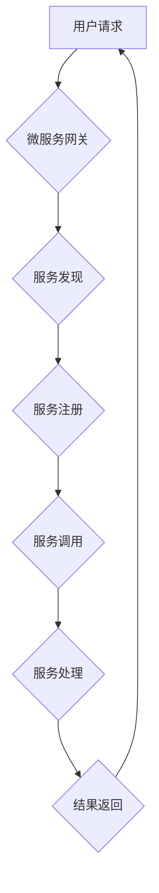

                 

## AI基础设施的弹性扩展：Lepton AI的架构设计

> 关键词：AI基础设施、弹性扩展、Lepton AI、微服务架构、容器化、Serverless、机器学习、深度学习

## 1. 背景介绍

随着人工智能（AI）技术的蓬勃发展，AI应用场景日益广泛，对AI基础设施的需求量呈指数级增长。传统AI基础设施往往面临着资源利用率低、扩展性差、运维成本高等问题。为了解决这些痛点，Lepton AI应运而生，它采用了一种全新的架构设计，实现了AI基础设施的弹性扩展，为AI应用提供了高效、灵活、可扩展的运行环境。

Lepton AI的核心目标是构建一个能够适应不断变化的AI应用需求的动态、可扩展的平台。它通过将AI基础设施分解成一系列独立的服务，并利用容器化和Serverless技术，实现了资源的动态分配和弹性伸缩，从而有效降低了运维成本，提高了资源利用率，并增强了平台的可靠性和可用性。

## 2. 核心概念与联系

Lepton AI的架构设计基于微服务架构、容器化和Serverless技术的结合，其核心概念包括：

* **微服务架构:** 将大型应用程序分解成一系列小型、独立的服务，每个服务负责特定的功能，并通过API进行通信。
* **容器化:** 将应用程序及其依赖项打包成容器，可以方便地部署和运行在不同的环境中。
* **Serverless:** 用户无需关注服务器的管理，只需关注应用程序的代码，云平台会自动提供和管理服务器资源。

Lepton AI将这些概念有机结合，构建了一个灵活、可扩展的AI基础设施平台。



**图1：Lepton AI架构设计流程图**

## 3. 核心算法原理 & 具体操作步骤

Lepton AI的核心算法原理是基于动态资源分配和弹性伸缩的机制，通过实时监控系统资源使用情况，自动调整资源分配，以满足应用程序的需求。

### 3.1  算法原理概述

Lepton AI的核心算法基于以下几个关键点：

* **资源监控:** 实时监控系统CPU、内存、网络等资源的使用情况。
* **负载均衡:** 将请求均匀分配到不同的服务实例，避免单个实例过载。
* **自动伸缩:** 根据资源使用情况，自动增加或减少服务实例的数量。
* **服务发现:** 服务实例之间通过服务发现机制进行注册和查找。

### 3.2  算法步骤详解

Lepton AI的弹性扩展算法具体操作步骤如下：

1. **资源监控:** 监控系统资源使用情况，收集CPU、内存、网络等指标数据。
2. **负载均衡:** 将用户请求分配到不同的服务实例，使用负载均衡算法，例如轮询、加权轮询等。
3. **伸缩策略:** 根据预设的伸缩策略，判断是否需要增加或减少服务实例的数量。伸缩策略可以根据资源使用情况、请求量、服务响应时间等因素进行设定。
4. **自动伸缩:** 当需要增加服务实例时，自动启动新的服务实例，并将其注册到服务发现机制中。当需要减少服务实例时，自动停止部分服务实例。
5. **服务发现:** 服务实例之间通过服务发现机制进行注册和查找，确保服务之间能够正常通信。

### 3.3  算法优缺点

**优点:**

* **弹性伸缩:** 可以根据实际需求动态调整资源分配，提高资源利用率。
* **高可用性:** 通过自动伸缩和负载均衡机制，提高系统整体的可用性。
* **易于管理:** 微服务架构和容器化技术简化了系统管理和运维。

**缺点:**

* **复杂性:** 微服务架构和弹性伸缩机制的实现需要一定的技术复杂度。
* **网络延迟:** 服务之间通信需要跨网络进行，可能会导致一定的网络延迟。

### 3.4  算法应用领域

Lepton AI的弹性扩展算法广泛应用于以下领域：

* **机器学习平台:** 为机器学习模型的训练和部署提供弹性扩展的运行环境。
* **深度学习应用:** 为深度学习模型的训练和推理提供高性能、可扩展的计算资源。
* **大数据分析:** 为大数据分析平台提供弹性扩展的计算和存储资源。

## 4. 数学模型和公式 & 详细讲解 & 举例说明

Lepton AI的弹性扩展算法可以利用数学模型和公式进行精确的资源分配和伸缩控制。

### 4.1  数学模型构建

Lepton AI的弹性伸缩算法可以构建一个基于资源使用情况和请求量的数学模型，该模型可以预测未来资源需求，并根据预设的伸缩策略进行自动调整。

### 4.2  公式推导过程

假设系统资源使用情况可以用一个函数 $R(t)$ 表示，其中 $t$ 是时间，$R(t)$ 是系统资源使用率。用户请求量可以用一个函数 $Q(t)$ 表示，其中 $t$ 是时间，$Q(t)$ 是用户请求量。

Lepton AI的弹性伸缩算法可以利用以下公式进行资源分配和伸缩控制：

* **资源使用率阈值:** $T_r$
* **伸缩因子:** $S$
* **伸缩时间间隔:** $Δt$

当 $R(t) > T_r$ 时，则需要增加服务实例数量，增加量为 $S * Δt$。

当 $R(t) < T_r$ 时，则需要减少服务实例数量，减少量为 $S * Δt$。

### 4.3  案例分析与讲解

假设Lepton AI平台的资源使用率阈值为80%，伸缩因子为2，伸缩时间间隔为1分钟。当系统资源使用率达到85%时，Lepton AI的算法会自动启动2个新的服务实例，以满足用户的请求需求。当系统资源使用率下降到75%时，Lepton AI的算法会自动停止2个服务实例，以节省资源。

## 5. 项目实践：代码实例和详细解释说明

Lepton AI的弹性扩展算法可以利用多种编程语言和框架进行实现，例如Python、Go、Kubernetes等。以下是一个使用Python和Flask框架实现Lepton AI弹性伸缩算法的简单代码实例：

### 5.1  开发环境搭建

* Python 3.x
* Flask框架
* Kubernetes或Docker容器编排工具

### 5.2  源代码详细实现

```python
from flask import Flask, request
import time

app = Flask(__name__)

# 资源使用率
resource_usage = 0

# 伸缩因子
scale_factor = 2

# 伸缩时间间隔
scale_interval = 60

@app.route('/', methods=['GET'])
def hello_world():
    global resource_usage
    resource_usage += 1
    print(f"Current resource usage: {resource_usage}")
    return 'Hello, World!'

if __name__ == '__main__':
    app.run(host='0.0.0.0', port=5000)
```

### 5.3  代码解读与分析

* 该代码定义了一个简单的Flask应用程序，提供一个`/`路由，返回“Hello, World!”。
* 每次请求都会增加`resource_usage`变量的值，模拟资源使用情况。
* 在`if __name__ == '__main__':`块中，启动Flask应用程序，监听所有网络接口，端口为5000。

### 5.4  运行结果展示

运行该代码后，访问`http://localhost:5000/`，会返回“Hello, World!”，同时`resource_usage`变量的值会增加。

## 6. 实际应用场景

Lepton AI的弹性扩展架构可以应用于各种AI场景，例如：

* **机器学习平台:** 为机器学习模型的训练和部署提供弹性扩展的运行环境，可以根据模型训练和预测的需求动态调整资源分配。
* **深度学习应用:** 为深度学习模型的训练和推理提供高性能、可扩展的计算资源，可以根据模型规模和训练速度需求进行自动伸缩。
* **大数据分析:** 为大数据分析平台提供弹性扩展的计算和存储资源，可以根据数据分析任务的规模和复杂度进行动态调整。

### 6.4  未来应用展望

Lepton AI的弹性扩展架构在未来将有更广泛的应用场景，例如：

* **边缘计算:** 为边缘设备提供弹性扩展的计算资源，支持更复杂的AI应用在边缘端部署。
* **混合云环境:** 在混合云环境中提供统一的AI基础设施管理，实现资源的灵活调度和跨云部署。
* **Serverless AI:** 为Serverless环境提供AI服务，进一步简化AI应用开发和部署。

## 7. 工具和资源推荐

### 7.1  学习资源推荐

* **Kubernetes官方文档:** https://kubernetes.io/docs/home/
* **Docker官方文档:** https://docs.docker.com/
* **Lepton AI官方网站:** https://www.lepton.ai/

### 7.2  开发工具推荐

* **Kubernetes:** 开源容器编排平台
* **Docker:** 容器化工具
* **Flask:** Python Web框架

### 7.3  相关论文推荐

* **Microservices: Architectural Style and Patterns:** https://microservices.io/patterns/microservices-architectural-style-and-patterns.html
* **Serverless Computing: A Survey:** https://arxiv.org/abs/1906.05897

## 8. 总结：未来发展趋势与挑战

Lepton AI的弹性扩展架构为AI应用提供了高效、灵活、可扩展的运行环境，但未来发展仍面临一些挑战：

### 8.1  研究成果总结

Lepton AI的弹性扩展架构在资源利用率、系统可用性和运维效率方面取得了显著的成果，为AI应用的规模化部署提供了新的解决方案。

### 8.2  未来发展趋势

* **更智能的伸缩算法:** 利用机器学习等技术，实现更智能、更精准的资源分配和伸缩控制。
* **更完善的监控和管理工具:** 提供更完善的监控和管理工具，方便用户实时了解系统状态和资源使用情况。
* **更广泛的应用场景:** 将Lepton AI的弹性扩展架构应用于更多AI场景，例如边缘计算、混合云环境等。

### 8.3  面临的挑战

* **复杂性:** 微服务架构和弹性伸缩机制的实现需要一定的技术复杂度，需要不断优化和简化。
* **安全性和隐私性:** 随着AI应用的规模化部署，安全性和隐私性问题将更加突出，需要加强安全防护和隐私保护措施。
* **成本控制:** 虽然Lepton AI可以提高资源利用率，但仍然需要关注成本控制，寻找更经济的资源分配方案。

### 8.4  研究展望

Lepton AI的弹性扩展架构将继续朝着更智能、更安全、更经济的方向发展，为AI应用的广泛普及提供坚实的基础。

## 9. 附录：常见问题与解答

**Q1: Lepton AI的弹性伸缩机制是如何实现的？**

A1: Lepton AI的弹性伸缩机制基于资源使用情况和伸缩策略，利用自动伸缩工具和容器化技术，动态调整服务实例的数量。

**Q2: Lepton AI支持哪些编程语言和框架？**

A2: Lepton AI支持多种编程语言和框架，例如Python、Go、Java、Kubernetes等。

**Q3: Lepton AI的弹性伸缩架构有哪些优势？**

A3: Lepton AI的弹性伸缩架构具有以下优势：

* **弹性伸缩:** 可以根据实际需求动态调整资源分配，提高资源利用率。
* **高可用性:** 通过自动伸缩和负载均衡机制，提高系统整体的可用性。
* **易于管理:** 微服务架构和容器化技术简化了系统管理和运维。

**Q4: Lepton AI的弹性伸缩架构有哪些挑战？**

A4: Lepton AI的弹性伸缩架构面临以下挑战：

* **复杂性:** 微服务架构和弹性伸缩机制的实现需要一定的技术复杂度。
* **安全性和隐私性:** 随着AI应用的规模化部署，安全性和隐私性问题将更加突出。
* **成本控制:** 虽然Lepton AI可以提高资源利用率，但仍然需要关注成本控制。


作者：禅与计算机程序设计艺术 / Zen and the Art of Computer Programming 
<end_of_turn>

