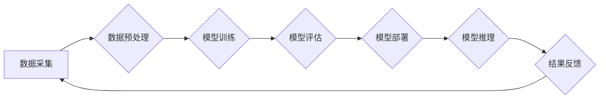

                 

## AI基础设施的未来：Lepton AI的发展愿景

> 关键词：AI基础设施、Lepton AI、分布式计算、模型训练、数据处理、可扩展性、高效性、开源

### 1. 背景介绍

人工智能（AI）正以惊人的速度发展，其应用领域不断扩展，从自动驾驶到医疗诊断，再到金融分析，AI正在深刻地改变着我们的生活。然而，推动AI发展的关键基础设施——AI基础设施，仍然面临着诸多挑战。传统的基础设施架构难以满足AI训练和推理的巨大计算需求，同时，数据处理、模型部署和管理等环节也存在瓶颈。

Lepton AI 应运而生，旨在构建下一代AI基础设施，为AI的蓬勃发展提供坚实的基础。Lepton AI 致力于打造一个高效、可扩展、开源的平台，让每个人都能轻松地构建、训练和部署AI模型。

### 2. 核心概念与联系

Lepton AI 的核心概念是将分布式计算与模型训练紧密结合，通过构建一个灵活、可定制的平台，实现高效的资源利用和模型训练加速。

**Lepton AI 架构**

**核心概念:**

* **分布式计算:** Lepton AI 利用分布式计算技术，将模型训练任务分解成多个子任务，并分别在多个节点上进行并行计算，大幅提高训练速度。
* **模型微服务化:** Lepton AI 将模型拆分成独立的服务，每个服务负责特定的任务，可以灵活组合和部署，实现模型的复用和扩展。
* **自动化部署:** Lepton AI 提供自动化部署工具，简化模型部署流程，降低部署门槛。
* **可扩展性:** Lepton AI 的架构设计具有高度可扩展性，可以根据实际需求灵活调整资源配置，满足不同规模的模型训练和推理需求。

### 3. 核心算法原理 & 具体操作步骤

Lepton AI 基于深度学习算法，并结合了分布式训练和模型微服务化等技术，实现高效的模型训练和推理。

#### 3.1  算法原理概述

Lepton AI 主要采用以下深度学习算法：

* **卷积神经网络 (CNN):** 用于图像识别、物体检测等视觉任务。
* **循环神经网络 (RNN):** 用于自然语言处理、语音识别等序列数据处理任务。
* **Transformer:** 用于自然语言理解、机器翻译等复杂文本处理任务。

这些算法通过多层神经网络结构，学习数据中的特征表示，并进行预测或分类。

#### 3.2  算法步骤详解

Lepton AI 的模型训练流程主要包括以下步骤：

1. **数据预处理:** 收集和清洗数据，并将其转换为模型可识别的格式。
2. **模型构建:** 根据任务需求选择合适的深度学习算法，并构建模型架构。
3. **模型训练:** 将数据输入模型，并通过反向传播算法进行参数更新，优化模型性能。
4. **模型评估:** 使用测试数据评估模型的性能，并根据评估结果进行模型调优。
5. **模型部署:** 将训练好的模型部署到生产环境，用于实际应用。

#### 3.3  算法优缺点

**优点:**

* 高精度: 深度学习算法能够学习数据中的复杂模式，实现高精度预测和分类。
* 可扩展性: 分布式训练技术可以有效提高训练速度，并支持大规模模型训练。
* 通用性: 深度学习算法可以应用于多种任务，例如图像识别、自然语言处理、语音识别等。

**缺点:**

* 数据依赖: 深度学习算法需要大量数据进行训练，否则性能会下降。
* 计算资源消耗: 深度学习模型训练需要大量的计算资源，成本较高。
* 黑盒效应: 深度学习模型的决策过程难以解释，缺乏透明度。

#### 3.4  算法应用领域

Lepton AI 的核心算法广泛应用于以下领域:

* **计算机视觉:** 图像识别、物体检测、图像分割、人脸识别等。
* **自然语言处理:** 文本分类、情感分析、机器翻译、对话系统等。
* **语音识别:** 语音转文本、语音助手等。
* **推荐系统:** 商品推荐、内容推荐等。
* **医疗诊断:** 病情预测、疾病诊断等。

### 4. 数学模型和公式 & 详细讲解 & 举例说明

Lepton AI 的核心算法基于数学模型和公式，通过优化这些模型的参数，实现模型的训练和预测。

#### 4.1  数学模型构建

Lepton AI 使用神经网络作为其核心数学模型，神经网络由多个层组成，每层包含多个神经元。每个神经元接收来自上一层的输入信号，并通过激活函数进行处理，输出到下一层。

#### 4.2  公式推导过程

Lepton AI 的训练过程基于梯度下降算法，该算法通过不断调整模型参数，最小化模型预测误差。

**损失函数:**

$$L = \frac{1}{N} \sum_{i=1}^{N} (y_i - \hat{y}_i)^2$$

其中:

* $L$ 是损失函数
* $N$ 是样本数量
* $y_i$ 是真实标签
* $\hat{y}_i$ 是模型预测值

**梯度下降算法:**

$$\theta = \theta - \alpha \nabla L$$

其中:

* $\theta$ 是模型参数
* $\alpha$ 是学习率
* $\nabla L$ 是损失函数的梯度

#### 4.3  案例分析与讲解

例如，在图像分类任务中，Lepton AI 使用 CNN 模型，将图像输入到网络中，经过多个卷积层和池化层处理，提取图像特征，最后通过全连接层进行分类。

损失函数可以是交叉熵损失函数，用于衡量模型预测结果与真实标签之间的差异。梯度下降算法用于更新模型参数，最小化损失函数值。

### 5. 项目实践：代码实例和详细解释说明

Lepton AI 提供了丰富的开源代码和工具，方便开发者进行项目实践。

#### 5.1  开发环境搭建

Lepton AI 支持多种开发环境，例如 Linux、macOS 和 Windows。开发者需要安装 Python、CUDA 和必要的库，例如 TensorFlow 或 PyTorch。

#### 5.2  源代码详细实现

Lepton AI 的源代码主要包含以下部分:

* **数据处理模块:** 用于数据预处理、数据加载和数据增强。
* **模型训练模块:** 用于模型构建、模型训练和模型评估。
* **模型部署模块:** 用于模型部署和模型推理。

#### 5.3  代码解读与分析

Lepton AI 的代码结构清晰，注释详细，方便开发者理解和修改。

#### 5.4  运行结果展示

开发者可以通过运行 Lepton AI 的代码示例，观察模型的训练过程和预测结果。

### 6. 实际应用场景

Lepton AI 的应用场景广泛，例如:

* **图像识别:** 用于自动驾驶、安防监控、医疗诊断等领域。
* **自然语言处理:** 用于聊天机器人、机器翻译、文本摘要等领域。
* **语音识别:** 用于语音助手、语音搜索、语音转文本等领域。

#### 6.4  未来应用展望

Lepton AI 将继续推动 AI 基础设施的发展，并应用于更多领域，例如:

* **个性化推荐:** 为用户提供个性化的商品、内容和服务推荐。
* **智能客服:** 提供智能化的客服服务，提高客户体验。
* **科学研究:** 用于加速科学研究，例如药物研发、材料科学等。

### 7. 工具和资源推荐

#### 7.1  学习资源推荐

* **Lepton AI 官方文档:** https://lepton.ai/docs/
* **深度学习教程:** https://www.deeplearning.ai/
* **TensorFlow 官方网站:** https://www.tensorflow.org/

#### 7.2  开发工具推荐

* **Python:** https://www.python.org/
* **CUDA:** https://developer.nvidia.com/cuda-downloads
* **TensorFlow:** https://www.tensorflow.org/
* **PyTorch:** https://pytorch.org/

#### 7.3  相关论文推荐

* **Attention Is All You Need:** https://arxiv.org/abs/1706.03762
* **Deep Residual Learning for Image Recognition:** https://arxiv.org/abs/1512.03385
* **BERT: Pre-training of Deep Bidirectional Transformers for Language Understanding:** https://arxiv.org/abs/1810.04805

### 8. 总结：未来发展趋势与挑战

Lepton AI 致力于构建下一代 AI 基础设施，为 AI 的发展提供坚实的基础。未来，Lepton AI 将继续关注以下几个方面:

#### 8.1  研究成果总结

Lepton AI 的核心技术已经取得了显著的成果，例如:

* **高效的分布式训练算法:** 能够大幅提高模型训练速度。
* **灵活的模型微服务化架构:** 能够满足不同规模和类型的模型训练需求。
* **开源的平台和工具:** 降低了 AI 开发的门槛，促进了 AI 的普及。

#### 8.2  未来发展趋势

Lepton AI 将继续朝着以下方向发展:

* **更强大的计算能力:** 探索新的计算架构和硬件加速技术，提升模型训练效率。
* **更智能的模型设计:** 研究更先进的深度学习算法，提高模型的精度和泛化能力。
* **更广泛的应用场景:** 将 Lepton AI 应用于更多领域，例如医疗、教育、金融等。

#### 8.3  面临的挑战

Lepton AI 也面临着一些挑战:

* **数据安全和隐私:** 如何保护训练数据和模型的安全性，是需要认真考虑的问题。
* **模型可解释性:** 深度学习模型的决策过程难以解释，如何提高模型的可解释性，是未来研究的重要方向。
* **人才短缺:** AI 领域人才需求量大，如何培养更多 AI 人才，是需要共同努力的方向。

#### 8.4  研究展望

Lepton AI 将继续投入研发，致力于构建更强大、更智能、更安全的 AI 基础设施，为 AI 的发展贡献力量。

### 9. 附录：常见问题与解答

**Q1: Lepton AI 是开源的吗？**

A1: 是的，Lepton AI 是开源的，开发者可以自由使用、修改和分发 Lepton AI 的代码和工具。

**Q2: Lepton AI 支持哪些深度学习框架？**

A2: Lepton AI 支持 TensorFlow 和 PyTorch 等主流深度学习框架。

**Q3: Lepton AI 的硬件要求是什么？**

A3: Lepton AI 支持多种硬件平台，例如 CPU、GPU 和 TPU。

**Q4: Lepton AI 的文档在哪里？**

A4: Lepton AI 的官方文档地址是 https://lepton.ai/docs/。

作者：禅与计算机程序设计艺术 / Zen and the Art of Computer Programming 
<end_of_turn>

