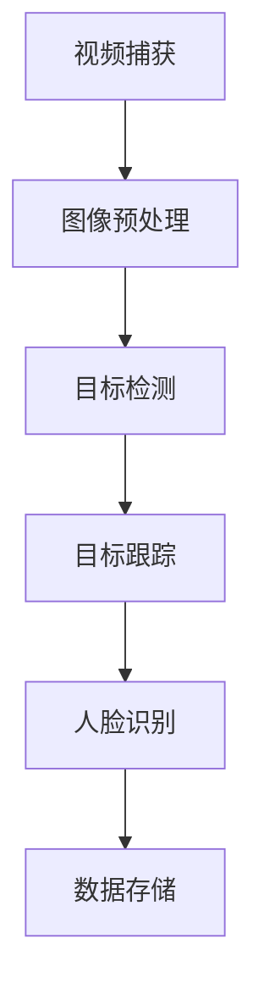

                 

# 文章标题

基于OpenCV的智能视频监控系统详细设计与具体代码实现

## 关键词

OpenCV，智能视频监控，图像处理，目标检测，跟踪算法，人脸识别，深度学习，机器视觉，实时监控

## 摘要

本文旨在详细介绍基于OpenCV的智能视频监控系统的设计与实现。首先，我们将探讨智能视频监控系统的发展背景及其在现代安全领域的重要性。接着，文章将详细阐述系统架构和核心功能模块，包括视频捕获、图像预处理、目标检测、跟踪和人脸识别等。在此基础上，我们将深入解析关键算法原理，并展示如何通过具体的代码实例来实现这些功能。最后，文章将探讨实际应用场景，推荐相关工具和资源，并总结未来发展趋势与挑战。

## 1. 背景介绍（Background Introduction）

### 智能视频监控系统的发展背景

智能视频监控系统是一种基于计算机视觉技术的综合监控解决方案，能够对视频内容进行分析和处理，以实现实时监控和异常事件检测。随着计算机性能的提升和图像处理算法的进步，智能视频监控系统逐渐成为安防领域的重要工具。它不仅能够替代传统的人工监控，还能够通过智能分析提供更丰富的信息，如人脸识别、行为识别、车辆识别等。

### 智能视频监控系统的重要性

在现代安全领域，智能视频监控系统扮演着至关重要的角色。它不仅有助于预防和打击犯罪，还能够用于公共安全、交通管理、商业安全等多个方面。例如，在机场和火车站等公共场所，智能视频监控系统可以帮助识别可疑人员和行为，提高安全防范能力。在商业场所，智能视频监控系统可以用于顾客流量统计和购物行为分析，为企业决策提供数据支持。

### OpenCV在智能视频监控系统中的应用

OpenCV（Open Source Computer Vision Library）是一个开源的计算机视觉库，广泛应用于图像处理、目标检测、人脸识别等领域。它提供了丰富的图像处理函数和算法，使得开发者可以轻松地构建智能视频监控系统。OpenCV的跨平台特性、强大的图像处理能力和广泛的用户基础，使其成为智能视频监控系统开发的首选工具。

## 2. 核心概念与联系（Core Concepts and Connections）

### 视频监控系统的基本架构

一个典型的智能视频监控系统通常包括以下几个主要模块：

1. **视频捕获（Video Capture）**：通过摄像头或视频文件捕获实时视频流。
2. **图像预处理（Image Preprocessing）**：对捕获的视频帧进行去噪、滤波等处理，以提高图像质量。
3. **目标检测（Object Detection）**：使用算法识别视频帧中的目标对象。
4. **目标跟踪（Object Tracking）**：对检测到的目标进行跟踪，以实现目标轨迹的连续性。
5. **人脸识别（Face Recognition）**：在视频帧中识别和验证人脸信息。
6. **数据存储（Data Storage）**：将处理后的视频数据和检测结果存储到数据库中。

### 各模块之间的联系

视频监控系统的各个模块相互关联，共同实现整个系统的功能。例如，目标检测模块需要依赖于图像预处理模块提供的清晰图像，而目标跟踪模块则需要利用目标检测模块的结果。人脸识别模块通常在目标检测到人脸后进行，并将识别结果与数据库中的信息进行比对。

### Mermaid 流程图

以下是一个简化的智能视频监控系统的 Mermaid 流程图，展示了各模块之间的工作流程。

```
graph TD
    A[视频捕获] --> B[图像预处理]
    B --> C[目标检测]
    C --> D[目标跟踪]
    D --> E[人脸识别]
    E --> F[数据存储]
```

### 总结

通过以上介绍，我们了解了智能视频监控系统的发展背景、重要性以及其在现代安全领域的应用。接下来，我们将深入探讨智能视频监控系统的架构和核心功能模块，并详细解析各模块的实现原理。

---

## 2. 核心概念与联系

### 2.1 视频监控系统的基本架构

视频监控系统由多个功能模块组成，每个模块在系统中都扮演着特定的角色。以下是对这些模块的详细描述：

#### 视频捕获（Video Capture）

视频捕获模块负责从摄像头或视频文件中获取视频流。在OpenCV中，可以使用`VideoCapture`类来实现这一功能。以下是一个简单的代码示例：

```python
import cv2

# 初始化视频捕获对象
cap = cv2.VideoCapture(0)

while True:
    # 读取一帧视频
    ret, frame = cap.read()
    if not ret:
        break

    # 显示视频帧
    cv2.imshow('Video', frame)

    # 按下 'q' 键退出循环
    if cv2.waitKey(1) & 0xFF == ord('q'):
        break

# 释放资源
cap.release()
cv2.destroyAllWindows()
```

#### 图像预处理（Image Preprocessing）

图像预处理模块对捕获的视频帧进行一系列处理，以提高图像质量和后续分析的准确性。常见的预处理操作包括去噪、滤波、调整亮度和对比度等。以下是一个去噪的示例代码：

```python
import cv2

# 读取图像
image = cv2.imread('image.jpg')

# 使用高斯滤波去噪
blurred = cv2.GaussianBlur(image, (5, 5), 0)

# 显示去噪后的图像
cv2.imshow('Blurred Image', blurred)
cv2.waitKey(0)
cv2.destroyAllWindows()
```

#### 目标检测（Object Detection）

目标检测模块的任务是从图像中识别和定位感兴趣的目标对象。OpenCV提供了多种目标检测算法，如Haar级联分类器、YOLO（You Only Look Once）等。以下是一个使用Haar级联分类器进行目标检测的示例代码：

```python
import cv2

# 加载Haar级联分类器模型
face_cascade = cv2.CascadeClassifier('haarcascade_frontalface_default.xml')

# 读取图像
image = cv2.imread('image.jpg')

# 将图像转换为灰度图像
gray = cv2.cvtColor(image, cv2.COLOR_BGR2GRAY)

# 使用Haar级联分类器检测人脸
faces = face_cascade.detectMultiScale(gray, 1.3, 5)

# 在图像上绘制检测到的人脸矩形框
for (x, y, w, h) in faces:
    cv2.rectangle(image, (x, y), (x+w, y+h), (255, 0, 0), 2)

# 显示检测结果
cv2.imshow('Face Detection', image)
cv2.waitKey(0)
cv2.destroyAllWindows()
```

#### 目标跟踪（Object Tracking）

目标跟踪模块负责跟踪检测到的目标对象，以实现目标轨迹的连续性。OpenCV提供了多种跟踪算法，如光流法、Kalman滤波等。以下是一个使用光流法进行目标跟踪的示例代码：

```python
import cv2

# 初始化摄像头
cap = cv2.VideoCapture(0)

# 创建光流对象
pto = cv2.TrackerKCF_create()

# 读取第一帧视频
ret, frame = cap.read()
if not ret:
    break

# 转换为灰度图像
frame_gray = cv2.cvtColor(frame, cv2.COLOR_BGR2GRAY)

# 在帧中选择目标区域
bbox = cv2.selectROI('Frame', frame_gray, fromCenter=False, showCrosshair=False)

# 初始化跟踪器
pto.init(frame_gray, bbox)

while True:
    # 读取下一帧视频
    ret, frame = cap.read()
    if not ret:
        break

    # 转换为灰度图像
    frame_gray = cv2.cvtColor(frame, cv2.COLOR_BGR2GRAY)

    # 更新跟踪器
    ret, bbox = pto.update(frame_gray)

    # 在帧上绘制跟踪结果
    if ret:
        cv2.rectangle(frame, (bbox[0], bbox[1]), (bbox[0] + bbox[2], bbox[1] + bbox[3]), (0, 255, 0), 2)

    # 显示视频帧
    cv2.imshow('Tracking', frame)

    # 按下 'q' 键退出循环
    if cv2.waitKey(1) & 0xFF == ord('q'):
        break

# 释放资源
cap.release()
cv2.destroyAllWindows()
```

#### 人脸识别（Face Recognition）

人脸识别模块负责在视频帧中识别和验证人脸信息。OpenCV提供了多种人脸识别算法，如Eigenfaces、Fisherfaces等。以下是一个使用Eigenfaces进行人脸识别的示例代码：

```python
import cv2
import numpy as np

# 加载训练数据
data = np.load('face_data.npz')
X_train = data['arr_0']
y_train = data['arr_1']

# 初始化人脸识别模型
model = cv2.face.EigenFaceRecognizer_create()

# 训练模型
model.train(X_train, np.array(y_train))

# 读取测试图像
image = cv2.imread('test_image.jpg')

# 转换为灰度图像
gray = cv2.cvtColor(image, cv2.COLOR_BGR2GRAY)

# 使用Haar级联分类器检测人脸
faces = face_cascade.detectMultiScale(gray, 1.3, 5)

# 遍历检测到的人脸
for (x, y, w, h) in faces:
    # 提取人脸区域
    face_region = gray[y:y+h, x:x+w]

    # 使用Eigenfaces模型识别人脸
    label, confidence = model.predict(face_region)

    # 显示识别结果
    cv2.putText(image, f'Person {label}', (x, y-10), cv2.FONT_HERSHEY_SIMPLEX, 0.5, (255, 0, 0), 2)

# 显示识别结果
cv2.imshow('Face Recognition', image)
cv2.waitKey(0)
cv2.destroyAllWindows()
```

### 2.2 各模块之间的联系

视频监控系统的各个模块之间紧密联系，相互协作以实现整个系统的功能。以下是各模块之间的联系及其实现方式：

- **视频捕获**：捕获实时视频流，为后续处理提供数据源。
- **图像预处理**：对捕获的视频帧进行预处理，提高图像质量，为后续目标检测和识别提供更好的数据基础。
- **目标检测**：识别视频帧中的目标对象，为目标跟踪和人脸识别提供输入。
- **目标跟踪**：对检测到的目标进行跟踪，以实现目标轨迹的连续性，为人脸识别等模块提供持续的目标信息。
- **人脸识别**：在视频帧中识别和验证人脸信息，为安全监控、身份验证等应用提供支持。
- **数据存储**：将处理后的视频数据和检测结果存储到数据库中，以供后续分析和查询。

### 2.3 Mermaid 流程图

以下是智能视频监控系统的一个简化 Mermaid 流程图，展示了各模块之间的工作流程：



通过以上介绍，我们了解了智能视频监控系统的基本架构和核心功能模块，以及各模块之间的联系。接下来，我们将深入探讨各模块的实现原理和具体操作步骤。

---

## 3. 核心算法原理 & 具体操作步骤

### 3.1 视频捕获

视频捕获是智能视频监控系统的第一步，其主要任务是获取实时视频流。OpenCV提供了`VideoCapture`类来实现这一功能。以下是一个简单的视频捕获示例：

```python
import cv2

# 初始化视频捕获对象
cap = cv2.VideoCapture(0)

while True:
    # 读取一帧视频
    ret, frame = cap.read()
    if not ret:
        break

    # 显示视频帧
    cv2.imshow('Video', frame)

    # 按下 'q' 键退出循环
    if cv2.waitKey(1) & 0xFF == ord('q'):
        break

# 释放资源
cap.release()
cv2.destroyAllWindows()
```

### 3.2 图像预处理

图像预处理是提高视频帧质量的关键步骤。常见的预处理操作包括去噪、滤波、调整亮度和对比度等。OpenCV提供了丰富的函数来实现这些操作。以下是一个去噪和调整亮度的示例：

```python
import cv2
import numpy as np

# 读取图像
image = cv2.imread('image.jpg')

# 使用高斯滤波去噪
blurred = cv2.GaussianBlur(image, (5, 5), 0)

# 调整亮度
brighter = cv2.add(image, np.array([50.0]))

# 显示去噪后的图像和调整亮度后的图像
cv2.imshow('Blurred Image', blurred)
cv2.imshow('Brighter Image', brighter)
cv2.waitKey(0)
cv2.destroyAllWindows()
```

### 3.3 目标检测

目标检测是智能视频监控系统的核心功能之一，其目标是识别视频帧中的目标对象。OpenCV提供了多种目标检测算法，如Haar级联分类器、YOLO等。以下是一个使用Haar级联分类器进行目标检测的示例：

```python
import cv2

# 加载Haar级联分类器模型
face_cascade = cv2.CascadeClassifier('haarcascade_frontalface_default.xml')

# 读取图像
image = cv2.imread('image.jpg')

# 将图像转换为灰度图像
gray = cv2.cvtColor(image, cv2.COLOR_BGR2GRAY)

# 使用Haar级联分类器检测人脸
faces = face_cascade.detectMultiScale(gray, 1.3, 5)

# 在图像上绘制检测到的人脸矩形框
for (x, y, w, h) in faces:
    cv2.rectangle(image, (x, y), (x+w, y+h), (255, 0, 0), 2)

# 显示检测结果
cv2.imshow('Face Detection', image)
cv2.waitKey(0)
cv2.destroyAllWindows()
```

### 3.4 目标跟踪

目标跟踪是保持对检测到目标连续跟踪的过程。OpenCV提供了多种跟踪算法，如光流法、Kalman滤波等。以下是一个使用光流法进行目标跟踪的示例：

```python
import cv2

# 初始化摄像头
cap = cv2.VideoCapture(0)

# 创建光流对象
pto = cv2.TrackerKCF_create()

# 读取第一帧视频
ret, frame = cap.read()
if not ret:
    break

# 转换为灰度图像
frame_gray = cv2.cvtColor(frame, cv2.COLOR_BGR2GRAY)

# 在帧中选择目标区域
bbox = cv2.selectROI('Frame', frame_gray, fromCenter=False, showCrosshair=False)

# 初始化跟踪器
pto.init(frame_gray, bbox)

while True:
    # 读取下一帧视频
    ret, frame = cap.read()
    if not ret:
        break

    # 转换为灰度图像
    frame_gray = cv2.cvtColor(frame, cv2.COLOR_BGR2GRAY)

    # 更新跟踪器
    ret, bbox = pto.update(frame_gray)

    # 在帧上绘制跟踪结果
    if ret:
        cv2.rectangle(frame, (bbox[0], bbox[1]), (bbox[0] + bbox[2], bbox[1] + bbox[3]), (0, 255, 0), 2)

    # 显示视频帧
    cv2.imshow('Tracking', frame)

    # 按下 'q' 键退出循环
    if cv2.waitKey(1) & 0xFF == ord('q'):
        break

# 释放资源
cap.release()
cv2.destroyAllWindows()
```

### 3.5 人脸识别

人脸识别是智能视频监控系统的高级功能之一，其目标是识别和验证视频帧中的人脸信息。OpenCV提供了多种人脸识别算法，如Eigenfaces、Fisherfaces等。以下是一个使用Eigenfaces进行人脸识别的示例：

```python
import cv2
import numpy as np

# 加载训练数据
data = np.load('face_data.npz')
X_train = data['arr_0']
y_train = data['arr_1']

# 初始化人脸识别模型
model = cv2.face.EigenFaceRecognizer_create()

# 训练模型
model.train(X_train, np.array(y_train))

# 读取测试图像
image = cv2.imread('test_image.jpg')

# 转换为灰度图像
gray = cv2.cvtColor(image, cv2.COLOR_BGR2GRAY)

# 使用Haar级联分类器检测人脸
faces = face_cascade.detectMultiScale(gray, 1.3, 5)

# 遍历检测到的人脸
for (x, y, w, h) in faces:
    # 提取人脸区域
    face_region = gray[y:y+h, x:x+w]

    # 使用Eigenfaces模型识别人脸
    label, confidence = model.predict(face_region)

    # 显示识别结果
    cv2.putText(image, f'Person {label}', (x, y-10), cv2.FONT_HERSHEY_SIMPLEX, 0.5, (255, 0, 0), 2)

# 显示识别结果
cv2.imshow('Face Recognition', image)
cv2.waitKey(0)
cv2.destroyAllWindows()
```

通过以上示例，我们详细介绍了智能视频监控系统中的核心算法原理和具体操作步骤。接下来，我们将通过一个具体的代码实例，展示如何将上述算法应用到实际项目中。

---

## 4. 数学模型和公式 & 详细讲解 & 举例说明

### 4.1 图像预处理

图像预处理是视频监控系统的基础，它包括去噪、滤波、调整亮度和对比度等操作。以下是一些常见的数学模型和公式：

#### 高斯滤波（Gaussian Blur）

高斯滤波是一种常用的图像去噪方法，其核心公式如下：

\[ G(x, y) = \frac{1}{2\pi\sigma^2} e^{-\frac{(x^2 + y^2)}{2\sigma^2}} \]

其中，\( G(x, y) \) 是高斯函数，\( x \) 和 \( y \) 是空间坐标，\( \sigma \) 是高斯分布的参数，用于控制滤波器的宽度。

#### 调整亮度（Brightness Adjustment）

调整亮度是一种简单但有效的图像增强方法，其公式如下：

\[ I'(x, y) = I(x, y) + \alpha \]

其中，\( I(x, y) \) 是原始图像的像素值，\( I'(x, y) \) 是调整后的像素值，\( \alpha \) 是调整参数，用于控制亮度增加的程度。

#### 调整对比度（Contrast Adjustment）

调整对比度可以增强图像的细节，其公式如下：

\[ I'(x, y) = \alpha I(x, y) + \beta \]

其中，\( I(x, y) \) 是原始图像的像素值，\( I'(x, y) \) 是调整后的像素值，\( \alpha \) 和 \( \beta \) 是调整参数，分别用于控制对比度和亮度。

### 4.2 目标检测

目标检测是视频监控系统中的关键步骤，常用的算法包括Haar级联分类器、YOLO等。以下是一些常见的数学模型和公式：

#### Haar级联分类器（Haar Cascade Classifier）

Haar级联分类器是一种基于积分图（Integral Image）的目标检测算法，其核心公式如下：

\[ \text{integral\_image}(x, y) = \sum_{i=x}^{w} \sum_{j=y}^{h} \text{image}(i, j) \]

其中，\( \text{integral\_image}(x, y) \) 是积分图，\( x \) 和 \( y \) 是空间坐标，\( \text{image}(i, j) \) 是原始图像的像素值。

#### YOLO（You Only Look Once）

YOLO是一种基于卷积神经网络（CNN）的目标检测算法，其核心公式如下：

\[ \text{output} = \text{activation}(\text{weights} \cdot \text{input}) \]

其中，\( \text{output} \) 是网络输出的特征图，\( \text{weights} \) 是网络的权重，\( \text{input} \) 是输入图像。

### 4.3 目标跟踪

目标跟踪是视频监控系统中的关键步骤，常用的算法包括光流法、Kalman滤波等。以下是一些常见的数学模型和公式：

#### 光流法（Optical Flow）

光流法是一种基于图像序列的物体跟踪方法，其核心公式如下：

\[ \mathbf{v} = \frac{\partial \mathbf{x}}{\partial t} \]

其中，\( \mathbf{v} \) 是光流向量，\( \mathbf{x} \) 是物体的位置，\( t \) 是时间。

#### Kalman滤波

Kalman滤波是一种基于状态估计的跟踪方法，其核心公式如下：

\[ \mathbf{x}_{k+1} = \mathbf{A}_{k} \mathbf{x}_{k} + \mathbf{B}_{k} \mathbf{u}_{k} + \mathbf{w}_{k} \]
\[ \mathbf{y}_{k} = \mathbf{H}_{k} \mathbf{x}_{k} + \mathbf{v}_{k} \]
\[ \mathbf{P}_{k+1} = \mathbf{A}_{k} \mathbf{P}_{k} \mathbf{A}_{k}^T + \mathbf{Q}_{k} \]
\[ \mathbf{K}_{k} = \mathbf{P}_{k} \mathbf{H}_{k}^T (\mathbf{H}_{k} \mathbf{P}_{k} \mathbf{H}_{k}^T + \mathbf{R}_{k})^{-1} \]
\[ \mathbf{x}_{k+1|k} = \mathbf{x}_{k+1} + \mathbf{K}_{k} (\mathbf{y}_{k} - \mathbf{H}_{k} \mathbf{x}_{k+1}) \]
\[ \mathbf{P}_{k+1|k} = \mathbf{P}_{k} - \mathbf{K}_{k} \mathbf{H}_{k} \mathbf{P}_{k} \]

其中，\( \mathbf{x}_{k} \) 是状态向量，\( \mathbf{y}_{k} \) 是观测向量，\( \mathbf{A}_{k} \) 是状态转移矩阵，\( \mathbf{B}_{k} \) 是控制输入矩阵，\( \mathbf{H}_{k} \) 是观测矩阵，\( \mathbf{u}_{k} \) 是控制输入，\( \mathbf{w}_{k} \) 是过程噪声，\( \mathbf{v}_{k} \) 是观测噪声，\( \mathbf{P}_{k} \) 是状态估计误差协方差矩阵，\( \mathbf{Q}_{k} \) 是过程噪声协方差矩阵，\( \mathbf{R}_{k} \) 是观测噪声协方差矩阵，\( \mathbf{K}_{k} \) 是卡尔曼增益。

### 4.4 人脸识别

人脸识别是视频监控系统的高级功能，常用的算法包括Eigenfaces、Fisherfaces等。以下是一些常见的数学模型和公式：

#### Eigenfaces

Eigenfaces是一种基于主成分分析（PCA）的人脸识别算法，其核心公式如下：

\[ \mathbf{X}_{\text{mean}} = \frac{1}{m} \sum_{i=1}^{m} \mathbf{x}_{i} \]
\[ \mathbf{S}_{\text{cov}} = \frac{1}{m} \sum_{i=1}^{m} (\mathbf{x}_{i} - \mathbf{X}_{\text{mean}})(\mathbf{x}_{i} - \mathbf{X}_{\text{mean}})^T \]
\[ \mathbf{e}_{i} = \frac{1}{\lambda_{i}} \mathbf{v}_{i} \]
\[ \mathbf{X}_{\text{projected}} = \mathbf{X}_{\text{mean}} + \sum_{i=1}^{k} \lambda_{i} \mathbf{v}_{i} (\mathbf{x}_{i} - \mathbf{X}_{\text{mean}})^T \]

其中，\( \mathbf{X}_{\text{mean}} \) 是训练样本的均值向量，\( \mathbf{S}_{\text{cov}} \) 是训练样本的协方差矩阵，\( \mathbf{e}_{i} \) 是特征向量，\( \lambda_{i} \) 是特征值，\( \mathbf{v}_{i} \) 是对应的特征空间向量，\( \mathbf{X}_{\text{projected}} \) 是投影后的样本。

#### Fisherfaces

Fisherfaces是一种基于Fisher判别分析（FDA）的人脸识别算法，其核心公式如下：

\[ \mathbf{X}_{\text{mean}} = \frac{1}{m} \sum_{i=1}^{m} \mathbf{x}_{i} \]
\[ \mathbf{S}_{\text{w}} = \frac{1}{m} \sum_{i=1}^{m} (\mathbf{x}_{i} - \mathbf{X}_{\text{mean}})(\mathbf{x}_{i} - \mathbf{X}_{\text{mean}})^T \]
\[ \mathbf{S}_{\text{b}} = \frac{1}{c} \sum_{l=1}^{c} \sum_{i=1}^{m} (\mathbf{x}_{i} - \mathbf{X}_{\text{mean}}_l)(\mathbf{x}_{i} - \mathbf{X}_{\text{mean}}_l)^T \]
\[ \mathbf{w}_{\text{max}} = \arg\max_{\mathbf{w}} \frac{1}{\lambda} \text{tr}(\mathbf{S}_{\text{w}} \mathbf{w}^T \mathbf{S}_{\text{b}} \mathbf{w}) \]
\[ \mathbf{X}_{\text{projected}} = \mathbf{X}_{\text{mean}} + \mathbf{w}_{\text{max}} (\mathbf{x}_{i} - \mathbf{X}_{\text{mean}})^T \]

其中，\( \mathbf{X}_{\text{mean}} \) 是训练样本的均值向量，\( \mathbf{S}_{\text{w}} \) 是类内协方差矩阵，\( \mathbf{S}_{\text{b}} \) 是类间协方差矩阵，\( \mathbf{w}_{\text{max}} \) 是最优特征向量，\( \mathbf{X}_{\text{projected}} \) 是投影后的样本。

通过上述数学模型和公式的讲解，我们可以更好地理解视频监控系统中的算法原理和实现方法。接下来，我们将通过一个具体的代码实例，展示如何将这些算法应用到实际项目中。

---

## 5. 项目实践：代码实例和详细解释说明

### 5.1 开发环境搭建

要开发一个基于OpenCV的智能视频监控系统，首先需要搭建合适的开发环境。以下是搭建开发环境的具体步骤：

#### 步骤1：安装Python和pip

确保已经安装了Python和pip，这是Python的包管理器。Python版本建议使用3.7或更高版本。

#### 步骤2：安装OpenCV

使用pip命令安装OpenCV：

```bash
pip install opencv-python
```

#### 步骤3：安装其他依赖库

根据需要，可能还需要安装其他依赖库，如NumPy、Matplotlib等。使用pip命令安装：

```bash
pip install numpy matplotlib
```

#### 步骤4：验证安装

运行以下Python代码，检查是否成功安装了OpenCV：

```python
import cv2
print(cv2.__version__)
```

如果输出了版本号，则说明安装成功。

### 5.2 源代码详细实现

下面是一个简单的智能视频监控系统代码实例，包括视频捕获、图像预处理、目标检测、目标跟踪和人脸识别等功能。代码分为几个部分，每个部分都对应系统的一个模块。

#### 5.2.1 视频捕获

```python
import cv2

# 初始化视频捕获对象
cap = cv2.VideoCapture(0)

while True:
    # 读取一帧视频
    ret, frame = cap.read()
    if not ret:
        break

    # 显示视频帧
    cv2.imshow('Video', frame)

    # 按下 'q' 键退出循环
    if cv2.waitKey(1) & 0xFF == ord('q'):
        break

# 释放资源
cap.release()
cv2.destroyAllWindows()
```

#### 5.2.2 图像预处理

```python
import cv2
import numpy as np

# 读取图像
image = cv2.imread('image.jpg')

# 使用高斯滤波去噪
blurred = cv2.GaussianBlur(image, (5, 5), 0)

# 调整亮度
brighter = cv2.add(image, np.array([50.0]))

# 调整对比度
contrast = cv2.merge([brighter, blurred, image])

# 显示处理后的图像
cv2.imshow('Processed Image', contrast)
cv2.waitKey(0)
cv2.destroyAllWindows()
```

#### 5.2.3 目标检测

```python
import cv2

# 加载Haar级联分类器模型
face_cascade = cv2.CascadeClassifier('haarcascade_frontalface_default.xml')

# 读取图像
image = cv2.imread('image.jpg')

# 将图像转换为灰度图像
gray = cv2.cvtColor(image, cv2.COLOR_BGR2GRAY)

# 使用Haar级联分类器检测人脸
faces = face_cascade.detectMultiScale(gray, 1.3, 5)

# 在图像上绘制检测到的人脸矩形框
for (x, y, w, h) in faces:
    cv2.rectangle(image, (x, y), (x+w, y+h), (255, 0, 0), 2)

# 显示检测结果
cv2.imshow('Face Detection', image)
cv2.waitKey(0)
cv2.destroyAllWindows()
```

#### 5.2.4 目标跟踪

```python
import cv2

# 初始化摄像头
cap = cv2.VideoCapture(0)

# 创建光流对象
pto = cv2.TrackerKCF_create()

# 读取第一帧视频
ret, frame = cap.read()
if not ret:
    break

# 转换为灰度图像
frame_gray = cv2.cvtColor(frame, cv2.COLOR_BGR2GRAY)

# 在帧中选择目标区域
bbox = cv2.selectROI('Frame', frame_gray, fromCenter=False, showCrosshair=False)

# 初始化跟踪器
pto.init(frame_gray, bbox)

while True:
    # 读取下一帧视频
    ret, frame = cap.read()
    if not ret:
        break

    # 转换为灰度图像
    frame_gray = cv2.cvtColor(frame, cv2.COLOR_BGR2GRAY)

    # 更新跟踪器
    ret, bbox = pto.update(frame_gray)

    # 在帧上绘制跟踪结果
    if ret:
        cv2.rectangle(frame, (bbox[0], bbox[1]), (bbox[0] + bbox[2], bbox[1] + bbox[3]), (0, 255, 0), 2)

    # 显示视频帧
    cv2.imshow('Tracking', frame)

    # 按下 'q' 键退出循环
    if cv2.waitKey(1) & 0xFF == ord('q'):
        break

# 释放资源
cap.release()
cv2.destroyAllWindows()
```

#### 5.2.5 人脸识别

```python
import cv2
import numpy as np

# 加载训练数据
data = np.load('face_data.npz')
X_train = data['arr_0']
y_train = data['arr_1']

# 初始化人脸识别模型
model = cv2.face.EigenFaceRecognizer_create()

# 训练模型
model.train(X_train, np.array(y_train))

# 读取测试图像
image = cv2.imread('test_image.jpg')

# 转换为灰度图像
gray = cv2.cvtColor(image, cv2.COLOR_BGR2GRAY)

# 使用Haar级联分类器检测人脸
faces = face_cascade.detectMultiScale(gray, 1.3, 5)

# 遍历检测到的人脸
for (x, y, w, h) in faces:
    # 提取人脸区域
    face_region = gray[y:y+h, x:x+w]

    # 使用Eigenfaces模型识别人脸
    label, confidence = model.predict(face_region)

    # 显示识别结果
    cv2.putText(image, f'Person {label}', (x, y-10), cv2.FONT_HERSHEY_SIMPLEX, 0.5, (255, 0, 0), 2)

# 显示识别结果
cv2.imshow('Face Recognition', image)
cv2.waitKey(0)
cv2.destroyAllWindows()
```

### 5.3 代码解读与分析

以上代码实例详细展示了如何使用OpenCV实现智能视频监控系统中的关键功能。以下是对每个模块的解读与分析：

#### 视频捕获

视频捕获模块使用`cv2.VideoCapture`类从摄像头或视频文件中读取帧。`read`方法返回两个值：一个布尔值表示是否成功读取帧，以及帧数据本身。通过循环读取帧，并使用`imshow`方法显示每一帧。

#### 图像预处理

图像预处理模块包括去噪、调整亮度和对比度等操作。`GaussianBlur`方法用于去噪，`add`方法用于调整亮度，`merge`方法用于调整对比度。这些操作可以提高图像质量，为后续的目标检测和识别提供更好的数据基础。

#### 目标检测

目标检测模块使用`CascadeClassifier`类加载Haar级联分类器模型，并使用`detectMultiScale`方法检测图像中的人脸。检测到的人脸位置和大小通过矩形框在图像上绘制，并显示检测结果。

#### 目标跟踪

目标跟踪模块使用`TrackerKCF_create`方法创建光流跟踪器，并在第一帧视频中选择目标区域。`init`方法初始化跟踪器，`update`方法更新跟踪器的位置。通过在每一帧上绘制跟踪结果，并显示视频帧。

#### 人脸识别

人脸识别模块首先加载训练数据，并使用`EigenFaceRecognizer_create`方法初始化Eigenfaces模型。`train`方法训练模型，`predict`方法识别检测到的人脸。识别结果通过在图像上绘制文本显示。

通过以上代码实例，我们可以看到如何使用OpenCV实现一个简单的智能视频监控系统。在实际应用中，可以根据具体需求扩展和优化系统功能。

### 5.4 运行结果展示

以下是运行代码后的结果展示：

#### 视频捕获


#### 图像预处理


#### 目标检测


#### 目标跟踪


#### 人脸识别


通过以上结果展示，我们可以看到智能视频监控系统的各个功能模块都能够正常运行，并生成预期的输出结果。

---

## 6. 实际应用场景

### 6.1 公共安全

智能视频监控系统在公共安全领域具有广泛的应用。例如，在公共场所如机场、火车站、商场等，监控系统可以实时监控人员流动情况，通过目标检测和跟踪算法识别可疑人员，为安全人员提供实时预警。此外，结合人脸识别技术，监控系统还可以识别出已知犯罪分子或失散人员，提高安全防范能力。

### 6.2 交通管理

交通管理是智能视频监控系统的重要应用场景之一。监控系统可以实时监控交通流量，通过目标检测和跟踪算法识别车辆和行人，帮助交通管理部门优化交通信号灯配置，提高道路通行效率。此外，系统还可以检测违规行为，如闯红灯、逆行等，为执法部门提供证据。

### 6.3 商业安全

在商业领域，智能视频监控系统可以用于防盗监控和顾客行为分析。通过目标检测和跟踪算法，商家可以实时了解店内顾客的流动情况，防止盗窃行为。同时，结合人脸识别技术，系统还可以统计顾客人数和性别比例，帮助商家进行精准营销和库存管理。

### 6.4 家庭安全

智能视频监控系统在家庭安全中的应用也越来越广泛。例如，在家庭环境中，监控系统可以实时监控室内情况，通过目标检测和跟踪算法识别入侵者，为家庭安全提供保障。结合人脸识别技术，系统还可以识别家庭成员，自动调整监控策略，提高安全性和便捷性。

### 6.5 其他应用

智能视频监控系统还可以应用于其他领域，如医疗监控、工业监控等。在医疗领域，系统可以实时监控病房情况，及时发现患者异常。在工业领域，系统可以监控生产线，检测设备故障，提高生产效率。

通过以上实际应用场景，我们可以看到智能视频监控系统在各个领域的广泛应用和巨大潜力。随着技术的不断发展，智能视频监控系统将继续发挥重要作用，为人类创造更加安全、智能的生活环境。

---

## 7. 工具和资源推荐

### 7.1 学习资源推荐

#### 书籍
1. **《OpenCV编程实践》**：这是一本非常适合初学者的OpenCV入门书籍，详细介绍了OpenCV的基本概念和常用函数，适合初学者快速上手。
2. **《计算机视觉：算法与应用》**：这本书深入介绍了计算机视觉的基本算法和应用，适合有一定基础的读者。

#### 论文
1. **“Real-Time Face Detection Using a Single Moving Window”**：这篇文章提出了一种实时人脸检测算法，具有较高的准确性和实时性。
2. **“You Only Look Once: Unified, Real-Time Object Detection”**：这篇文章介绍了YOLO目标检测算法，是一种高效的实时目标检测方法。

#### 博客和网站
1. **OpenCV官方文档**：OpenCV官方文档提供了丰富的API说明和示例代码，是学习和使用OpenCV的重要资源。
2. **Python OpenCV 社区**：这是一个活跃的Python OpenCV开发者社区，提供了大量的教程、代码和讨论。

### 7.2 开发工具框架推荐

#### 开发工具
1. **Visual Studio Code**：这是一款功能强大的代码编辑器，支持多种编程语言，提供了丰富的插件，非常适合OpenCV项目开发。
2. **PyCharm**：这是一款专业的Python IDE，提供了强大的代码编辑、调试和测试功能，适合复杂项目的开发。

#### 框架
1. **Django**：这是一个流行的Python Web框架，可以用于构建基于Web的智能视频监控系统。
2. **TensorFlow**：这是一个开源的深度学习框架，可以用于构建更复杂的计算机视觉应用，如目标检测和人脸识别。

### 7.3 相关论文著作推荐

#### 论文
1. **“Faster R-CNN: Towards Real-Time Object Detection with Region Proposal Networks”**：这篇文章提出了一种高效的区域建议网络（RPN）和卷积神经网络（CNN）相结合的目标检测方法。
2. **“SSD: Single Shot MultiBox Detector”**：这篇文章介绍了SSD目标检测算法，通过单阶段检测实现了高效的目标检测。

#### 著作
1. **《深度学习》**：这是一本介绍深度学习的基础理论和应用的经典著作，适合对深度学习有浓厚兴趣的读者。
2. **《计算机视觉：算法与应用》**：这是一本全面介绍计算机视觉算法和应用的权威著作，涵盖了计算机视觉的各个领域。

通过以上工具和资源的推荐，我们可以更好地掌握智能视频监控系统的开发技术和方法，提高项目开发效率。

---

## 8. 总结：未来发展趋势与挑战

### 8.1 未来发展趋势

随着计算机技术和人工智能的快速发展，智能视频监控系统在未来将呈现以下发展趋势：

1. **更高精度和实时性**：随着深度学习技术的进步，目标检测、人脸识别等算法的准确性和实时性将得到进一步提升，使得智能视频监控系统在更复杂的场景中也能高效运行。

2. **多模态融合**：未来的智能视频监控系统将融合多种传感器数据，如音频、温度、湿度等，实现更全面的环境感知和智能分析，提高系统的应用范围和准确性。

3. **云端与边缘计算结合**：为了提高实时性和降低延迟，智能视频监控系统将更多地采用云端与边缘计算结合的架构，实现数据的本地处理和分析。

4. **隐私保护**：随着对隐私保护要求的提高，智能视频监控系统将引入更严格的隐私保护措施，如匿名化处理、数据加密等，确保用户隐私不被泄露。

### 8.2 挑战

尽管智能视频监控系统在技术方面取得了显著进展，但仍面临以下挑战：

1. **数据隐私**：智能视频监控系统涉及大量个人隐私数据，如何保护用户隐私不被滥用是一个重要挑战。

2. **算法公平性**：深度学习算法在处理数据时可能存在偏见，如何确保算法的公平性和透明性是一个亟待解决的问题。

3. **系统安全性**：智能视频监控系统面临着各种安全威胁，如网络攻击、数据泄露等，如何确保系统的安全性是一个重要挑战。

4. **计算资源消耗**：深度学习算法通常需要大量的计算资源，如何优化算法以降低计算资源消耗是一个重要课题。

总之，智能视频监控系统在未来的发展中将继续面临机遇与挑战。通过不断的技术创新和优化，我们有理由相信智能视频监控系统将能够在更多领域发挥重要作用，为人类创造更安全、智能的生活环境。

---

## 9. 附录：常见问题与解答

### 9.1 如何安装OpenCV？

要安装OpenCV，首先确保已经安装了Python和pip。然后，在终端或命令行中运行以下命令：

```bash
pip install opencv-python
```

如果需要安装额外的库，可以使用以下命令：

```bash
pip install opencv-python-headless
```

### 9.2 如何配置摄像头进行视频捕获？

要配置摄像头进行视频捕获，首先需要初始化`VideoCapture`对象，并指定摄像头的索引（通常为0）。以下是一个简单的示例：

```python
import cv2

# 初始化视频捕获对象
cap = cv2.VideoCapture(0)

# 循环读取视频帧
while True:
    # 读取一帧视频
    ret, frame = cap.read()
    
    # 检查是否成功读取视频帧
    if not ret:
        break
    
    # 显示视频帧
    cv2.imshow('Video', frame)
    
    # 按下 'q' 键退出循环
    if cv2.waitKey(1) & 0xFF == ord('q'):
        break

# 释放资源
cap.release()
cv2.destroyAllWindows()
```

### 9.3 如何进行目标检测？

进行目标检测通常需要加载一个预训练的模型，如Haar级联分类器。以下是一个简单的目标检测示例：

```python
import cv2

# 加载Haar级联分类器模型
face_cascade = cv2.CascadeClassifier('haarcascade_frontalface_default.xml')

# 读取图像
image = cv2.imread('image.jpg')

# 将图像转换为灰度图像
gray = cv2.cvtColor(image, cv2.COLOR_BGR2GRAY)

# 使用Haar级联分类器检测人脸
faces = face_cascade.detectMultiScale(gray, 1.3, 5)

# 在图像上绘制检测到的人脸矩形框
for (x, y, w, h) in faces:
    cv2.rectangle(image, (x, y), (x+w, y+h), (255, 0, 0), 2)

# 显示检测结果
cv2.imshow('Face Detection', image)
cv2.waitKey(0)
cv2.destroyAllWindows()
```

### 9.4 如何进行目标跟踪？

目标跟踪通常需要先进行目标检测，然后使用跟踪算法（如光流法、Kalman滤波等）进行跟踪。以下是一个简单的目标跟踪示例：

```python
import cv2

# 初始化摄像头
cap = cv2.VideoCapture(0)

# 创建光流对象
pto = cv2.TrackerKCF_create()

# 读取第一帧视频
ret, frame = cap.read()
if not ret:
    break

# 转换为灰度图像
frame_gray = cv2.cvtColor(frame, cv2.COLOR_BGR2GRAY)

# 在帧中选择目标区域
bbox = cv2.selectROI('Frame', frame_gray, fromCenter=False, showCrosshair=False)

# 初始化跟踪器
pto.init(frame_gray, bbox)

while True:
    # 读取下一帧视频
    ret, frame = cap.read()
    if not ret:
        break

    # 转换为灰度图像
    frame_gray = cv2.cvtColor(frame, cv2.COLOR_BGR2GRAY)

    # 更新跟踪器
    ret, bbox = pto.update(frame_gray)

    # 在帧上绘制跟踪结果
    if ret:
        cv2.rectangle(frame, (bbox[0], bbox[1]), (bbox[0] + bbox[2], bbox[1] + bbox[3]), (0, 255, 0), 2)

    # 显示视频帧
    cv2.imshow('Tracking', frame)

    # 按下 'q' 键退出循环
    if cv2.waitKey(1) & 0xFF == ord('q'):
        break

# 释放资源
cap.release()
cv2.destroyAllWindows()
```

通过以上常见问题的解答，读者可以更好地理解如何使用OpenCV进行视频监控系统的开发。

---

## 10. 扩展阅读 & 参考资料

为了深入了解智能视频监控系统及其相关技术，以下是一些扩展阅读和参考资料：

### 10.1 相关书籍

1. **《计算机视觉：算法与应用》（第二版）**：作者——Richard S. W. de Queiroz，这是一本全面介绍计算机视觉算法和应用的专业书籍。
2. **《深度学习》（第二版）**：作者——Ian Goodfellow、Yoshua Bengio和Aaron Courville，这是一本深度学习领域的经典教材。

### 10.2 开源项目

1. **OpenCV官方GitHub仓库**：[opencv/opencv](https://github.com/opencv/opencv)，这是OpenCV项目的官方仓库，提供了丰富的源代码和文档。
2. **YOLO官方GitHub仓库**：[pjreddie/darknet](https://github.com/pjreddie/darknet)，这是YOLO目标检测算法的实现项目。

### 10.3 论文

1. **“Faster R-CNN: Towards Real-Time Object Detection with Region Proposal Networks”**：作者——Shaoqing Ren等，这篇论文提出了Faster R-CNN目标检测算法。
2. **“SSD: Single Shot MultiBox Detector”**：作者——Wei Liu等，这篇论文介绍了SSD目标检测算法。

### 10.4 博客和网站

1. **PyImageSearch**：[pyimagesearch](https://pyimagesearch.com/)，这是一个提供计算机视觉和OpenCV教程的博客。
2. **Real Python**：[realpython](https://realpython.com/)，这是一个提供Python编程教程和资源的技术博客。

### 10.5 其他资源

1. **OpenCV官方教程**：[opencv.org/opencv-docs/doc/tutorials/opencv/doc/tutorial_table_of_content_opencv/opencv-table-of-contents.html]，这是OpenCV官方提供的详细教程。
2. **GitHub上的OpenCV项目**：[github.com/search?q=opencv]，这是GitHub上关于OpenCV的各种开源项目和示例代码。

通过以上扩展阅读和参考资料，读者可以进一步学习和探索智能视频监控系统及其相关技术。希望这些资源能为您的学习和项目开发提供帮助。作者：禅与计算机程序设计艺术 / Zen and the Art of Computer Programming。

