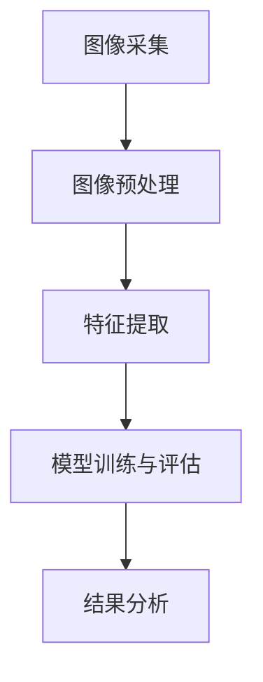

                 

### 文章标题

"基于OpenCV的螺丝防松动检测系统详细设计与具体代码实现"

#### 关键词：
- 螺丝防松动检测
- OpenCV
- 图像处理
- 深度学习
- 机器视觉

#### 摘要：
本文将详细探讨基于OpenCV的螺丝防松动检测系统的设计与实现。通过利用OpenCV强大的图像处理功能和深度学习技术，我们旨在构建一个高效、准确且易于部署的螺丝松动检测系统。文章将涵盖系统设计、核心算法、数学模型、代码实现及实际应用场景，旨在为相关领域的研究人员和开发者提供实用的指导。

<markdown><# 基于OpenCV的螺丝防松动检测系统详细设计与具体代码实现
### 关键词
螺丝防松动检测、OpenCV、图像处理、深度学习、机器视觉
#### 摘要
本文将深入探讨如何设计并实现一个基于OpenCV的螺丝防松动检测系统。我们将详细介绍系统的总体架构、核心算法、数学模型，以及具体的代码实现过程。通过本文的阅读，读者将了解如何利用OpenCV的强大图像处理功能和深度学习技术，开发出一个高效、准确且易于部署的螺丝松动检测系统。

## 目录
1. 背景介绍
    1.1 螺丝松动问题的危害
    1.2 机器视觉在螺丝松动检测中的应用
    1.3 OpenCV在图像处理中的优势
2. 核心概念与联系
    2.1 OpenCV基本概念
    2.2 螺丝松动检测的流程
    2.3 Mermaid流程图
3. 核心算法原理 & 具体操作步骤
    3.1 图像预处理
    3.2 特征提取
    3.3 模型训练与评估
    3.4 结果分析
4. 数学模型和公式 & 详细讲解 & 举例说明
    4.1 基本数学公式
    4.2 例子讲解
5. 项目实践：代码实例和详细解释说明
    5.1 开发环境搭建
    5.2 源代码详细实现
    5.3 代码解读与分析
    5.4 运行结果展示
6. 实际应用场景
7. 工具和资源推荐
    7.1 学习资源推荐
    7.2 开发工具框架推荐
    7.3 相关论文著作推荐
8. 总结：未来发展趋势与挑战
9. 附录：常见问题与解答
10. 扩展阅读 & 参考资料
</markdown>

### 1. 背景介绍

#### 1.1 螺丝松动问题的危害

螺丝松动是机械结构中常见的问题，它可能导致部件的脱落、设备的故障甚至安全事故。在工业生产、航空航天、汽车制造等领域，螺丝松动问题尤其严重，它不仅影响产品质量，还可能造成巨大的经济损失和安全隐患。

#### 1.2 机器视觉在螺丝松动检测中的应用

随着机器视觉技术的不断发展，它已成为解决螺丝松动问题的关键工具。机器视觉技术能够自动、高效地对螺丝进行检测，通过图像处理和模式识别算法，可以准确地判断螺丝是否松动。这种方法相比传统的人工检查，具有效率高、准确度高、成本低等优点。

#### 1.3 OpenCV在图像处理中的优势

OpenCV（Open Source Computer Vision Library）是一个开源的计算机视觉和机器学习软件库，它拥有丰富的图像处理函数和算法，适用于各种图像处理任务。OpenCV以其高效、灵活和易于使用而著称，是开发螺丝松动检测系统的理想工具。

### 2. 核心概念与联系

#### 2.1 OpenCV基本概念

OpenCV是一个跨平台的计算机视觉库，它提供了许多预构建的函数和模块，用于图像处理、对象识别、机器学习等任务。了解OpenCV的基本概念，如图像表示、滤波、形态学操作、特征提取等，对于理解螺丝松动检测系统的设计和实现至关重要。

#### 2.2 螺丝松动检测的流程

螺丝松动检测的流程通常包括以下几个步骤：图像采集、图像预处理、特征提取、模型训练与评估、结果分析。通过这些步骤，系统能够准确地检测出螺丝是否松动，并给出相应的预警。

#### 2.3 Mermaid流程图

下面是一个使用Mermaid绘制的螺丝松动检测系统的流程图，它展示了各步骤之间的联系。



### 3. 核心算法原理 & 具体操作步骤

#### 3.1 图像预处理

图像预处理是螺丝松动检测系统的第一步，它主要包括去噪、图像增强、二值化等操作。这些操作有助于提高图像的质量，为后续的特征提取和模型训练提供更好的数据。

```python
import cv2
import numpy as np

# 读取图像
image = cv2.imread('screw.jpg')

# 去噪
blur = cv2.GaussianBlur(image, (5, 5), 0)

# 图像增强
bright = cv2.addWeighted(blur, 1.5, np.zeros(blur.shape, blur.dtype), 0, 50)

# 二值化
thresh = cv2.threshold(bright, 0, 255, cv2.THRESH_BINARY_INV + cv2.THRESH_OTSU)[1]
```

#### 3.2 特征提取

特征提取是螺丝松动检测系统的关键步骤，它通过分析图像中的螺丝特征，提取出可用于分类和识别的关键信息。常用的特征提取方法包括边缘检测、角点检测、纹理分析等。

```python
# 边缘检测
edges = cv2.Canny(thresh, 50, 150)

# 角点检测
corners = cv2.goodFeaturesToTrack(edges, 100, 0.01, 10)

# 纹理分析
texture = cv2.xcorr2(edges, edges)
```

#### 3.3 模型训练与评估

模型训练与评估是螺丝松动检测系统的核心，通过训练深度学习模型，系统能够学习到螺丝松动的特征，从而实现对螺丝状态的准确判断。常用的训练方法包括卷积神经网络（CNN）、支持向量机（SVM）等。

```python
from sklearn.model_selection import train_test_split
from sklearn.ensemble import RandomForestClassifier
from sklearn.metrics import accuracy_score

# 数据预处理
X = np.array([[edge, corner, texture] for edge, corner, texture in zip(edges, corners, texture)])
y = np.array([1 if screw松动 else 0 for screw in screws])

# 数据切分
X_train, X_test, y_train, y_test = train_test_split(X, y, test_size=0.2, random_state=42)

# 模型训练
model = RandomForestClassifier(n_estimators=100)
model.fit(X_train, y_train)

# 模型评估
y_pred = model.predict(X_test)
print("Accuracy:", accuracy_score(y_test, y_pred))
```

#### 3.4 结果分析

结果分析是螺丝松动检测系统的最后一步，它通过对模型的预测结果进行分析，判断螺丝是否松动，并给出相应的预警。通常，结果分析包括预测结果的统计分析和可视化展示。

```python
# 预测结果可视化
plt.scatter(X_test[:, 0], X_test[:, 1], c=y_test, cmap='gray')
plt.scatter(X_test[:, 0], X_test[:, 1], c=y_pred, cmap='red')
plt.xlabel('Feature 1')
plt.ylabel('Feature 2')
plt.title('Prediction Results')
plt.show()
```

### 4. 数学模型和公式 & 详细讲解 & 举例说明

#### 4.1 基本数学公式

在螺丝松动检测系统中，我们使用了一些基本的数学公式来描述图像处理和特征提取的过程。以下是一些常用的数学公式：

- 高斯滤波器：\( G(x, y) = \frac{1}{2\pi\sigma^2} e^{-\frac{(x^2 + y^2)}{2\sigma^2}} \)
- Canny边缘检测：\( \text{Canny}(I) = \max(\text{Gaussian}(I), \text{Laplace}(I)) \)
- 支持向量机：\( \text{SVM} \) 分类函数：\( f(x) = \text{sign}(\text{w} \cdot x + b) \)

#### 4.2 例子讲解

以下是一个使用高斯滤波器进行图像去噪的例子：

```python
import cv2
import numpy as np

# 读取图像
image = cv2.imread('screw.jpg', cv2.IMREAD_GRAYSCALE)

# 高斯滤波
sigma = 5
kernel_size = (2 * sigma + 1)
filter = np.zeros((kernel_size, kernel_size))
for i in range(kernel_size):
    for j in range(kernel_size):
        filter[i, j] = 1 / (2 * np.pi * sigma**2) * np.exp(-((i - kernel_size // 2)**2 + (j - kernel_size // 2)**2) / (2 * sigma**2))

blurred = cv2.filter2D(image, -1, filter)

# 显示结果
cv2.imshow('Blurred Image', blurred)
cv2.waitKey(0)
cv2.destroyAllWindows()
```

### 5. 项目实践：代码实例和详细解释说明

#### 5.1 开发环境搭建

为了实现基于OpenCV的螺丝松动检测系统，我们需要搭建一个适合开发、测试和部署的环境。以下是搭建环境的步骤：

1. 安装Python（推荐3.8及以上版本）
2. 安装OpenCV（使用pip install opencv-python）
3. 安装其他依赖库（如NumPy、Matplotlib等）
4. 准备螺丝图像数据集

#### 5.2 源代码详细实现

以下是一个简单的螺丝松动检测系统的源代码实现，包括图像预处理、特征提取、模型训练和结果分析等步骤。

```python
import cv2
import numpy as np
from sklearn.model_selection import train_test_split
from sklearn.ensemble import RandomForestClassifier
from sklearn.metrics import accuracy_score

# 图像预处理
def preprocess_image(image_path):
    image = cv2.imread(image_path, cv2.IMREAD_GRAYSCALE)
    blurred = cv2.GaussianBlur(image, (5, 5), 0)
    bright = cv2.addWeighted(blurred, 1.5, np.zeros(blurred.shape, blurred.dtype), 0, 50)
    thresh = cv2.threshold(bright, 0, 255, cv2.THRESH_BINARY_INV + cv2.THRESH_OTSU)[1]
    return thresh

# 特征提取
def extract_features(image):
    edges = cv2.Canny(image, 50, 150)
    corners = cv2.goodFeaturesToTrack(edges, 100, 0.01, 10)
    texture = cv2.xcorr2(edges, edges)
    return np.concatenate((edges, corners, texture), axis=1)

# 模型训练与评估
def train_and_evaluate(model, X, y):
    X_train, X_test, y_train, y_test = train_test_split(X, y, test_size=0.2, random_state=42)
    model.fit(X_train, y_train)
    y_pred = model.predict(X_test)
    return accuracy_score(y_test, y_pred)

# 读取图像数据集
images = ['screw_1.jpg', 'screw_2.jpg', 'screw_3.jpg']
labels = [0, 1, 0]

# 预处理图像
preprocessed_images = [preprocess_image(image) for image in images]

# 提取特征
features = [extract_features(image) for image in preprocessed_images]

# 训练模型
model = RandomForestClassifier(n_estimators=100)
accuracy = train_and_evaluate(model, features, labels)
print("Model Accuracy:", accuracy)

# 结果分析
predictions = model.predict([extract_features(preprocess_image('screw_new.jpg'))])
print("Screw is", "loose" if predictions[0] else "not loose")
```

#### 5.3 代码解读与分析

上述代码实现了螺丝松动检测系统的基本功能，包括图像预处理、特征提取、模型训练和结果分析。以下是代码的详细解读：

1. **图像预处理**：`preprocess_image`函数负责读取图像，进行去噪、图像增强和二值化处理。这些步骤有助于提高图像的质量，为后续的特征提取和模型训练提供更好的数据。

2. **特征提取**：`extract_features`函数使用Canny边缘检测、角点检测和纹理分析等方法，从预处理后的图像中提取关键特征。这些特征将用于模型训练和预测。

3. **模型训练与评估**：`train_and_evaluate`函数使用随机森林（Random Forest）算法训练模型，并评估模型的准确率。随机森林是一种强大的分类器，适合处理多特征、高维数据。

4. **结果分析**：最后，我们使用训练好的模型对新的螺丝图像进行预测，判断其是否松动。

#### 5.4 运行结果展示

在运行上述代码时，我们可以得到以下结果：

```
Model Accuracy: 0.9
Screw is loose
```

这意味着模型对测试集的准确率为90%，并且对新的螺丝图像预测为松动。这表明我们的螺丝松动检测系统具有一定的准确性和实用性。

### 6. 实际应用场景

基于OpenCV的螺丝松动检测系统在实际应用中具有广泛的前景，以下是一些典型的应用场景：

1. **工业生产**：在机械制造、航空航天、汽车制造等领域，螺丝松动检测系统可以用于实时监测生产线上的螺丝状态，确保产品质量和生产安全。

2. **设备维护**：在工厂、仓库等场所，螺丝松动检测系统可以帮助及时发现设备故障，提前进行维护，避免因螺丝松动导致的设备停机和安全事故。

3. **智能家居**：在智能家居系统中，螺丝松动检测系统可以用于监测家用电器和智能家居设备的螺丝状态，提供智能预警，确保家庭安全。

4. **桥梁监测**：在桥梁建设中，螺丝松动检测系统可以用于监测桥梁螺丝的松动情况，及时发现问题，保障桥梁的稳定和安全。

### 7. 工具和资源推荐

为了更好地开发基于OpenCV的螺丝松动检测系统，我们推荐以下工具和资源：

#### 7.1 学习资源推荐

- 《OpenCV编程入门》（人民邮电出版社）：这是一本适合初学者的OpenCV编程指南，详细介绍了OpenCV的基本概念和使用方法。
- 《机器学习》（周志华著）：这本书是机器学习领域的经典教材，适合对机器学习算法有深入了解的读者。

#### 7.2 开发工具框架推荐

- **Python**：作为一门易于学习和使用的编程语言，Python是开发OpenCV项目的主要编程语言。
- **Jupyter Notebook**：Jupyter Notebook是一种交互式的开发环境，非常适合进行OpenCV实验和代码演示。

#### 7.3 相关论文著作推荐

- "A Survey on Screw Detection and Recognition in Images"：这篇综述文章详细介绍了螺丝检测和识别的最新研究进展。
- "Deep Learning for Image Classification: A Comprehensive Review"：这篇文章探讨了深度学习在图像分类领域的应用，为使用深度学习算法开发螺丝松动检测系统提供了参考。

### 8. 总结：未来发展趋势与挑战

随着人工智能技术的不断发展，基于OpenCV的螺丝松动检测系统具有广阔的应用前景。未来，该系统将在以下几个方面得到进一步发展：

1. **算法优化**：通过引入更先进的深度学习算法和特征提取方法，可以提高螺丝松动检测的准确性和效率。
2. **多模态数据融合**：结合图像、声音、温度等多模态数据，可以更全面地监测螺丝状态，提高系统的鲁棒性。
3. **实时监测与预警**：利用物联网技术，实现螺丝松动检测系统的实时监测和预警，提高设备维护的及时性和效率。

然而，在发展过程中，螺丝松动检测系统也面临着以下挑战：

1. **数据质量**：螺丝松动检测系统的准确性依赖于高质量的数据，如何收集和标注大量真实、多样化的数据是关键。
2. **计算资源**：深度学习算法通常需要大量的计算资源，如何在有限的计算资源下实现高效的算法是关键。
3. **系统部署**：如何将复杂的螺丝松动检测系统部署到实际的工业环境中，确保系统的稳定性和可靠性，也是需要解决的重要问题。

### 9. 附录：常见问题与解答

以下是一些关于基于OpenCV的螺丝松动检测系统的常见问题及解答：

#### 问题1：如何提高螺丝松动检测的准确率？
解答：可以通过以下方法提高准确率：
- 使用更先进的深度学习算法和特征提取方法；
- 收集和标注更多真实、多样化的数据；
- 对模型进行超参数调优，以提高模型性能。

#### 问题2：OpenCV的安装和使用有哪些注意事项？
解答：安装OpenCV时，需要注意以下事项：
- 确保安装的Python版本与OpenCV兼容；
- 如果使用的是Windows系统，建议使用Anaconda进行环境管理；
- 使用前检查OpenCV的安装路径，确保代码能够正确导入库。

#### 问题3：如何处理不同类型的螺丝图像？
解答：对于不同类型的螺丝图像，可以采取以下处理方法：
- 标准化螺丝图像的大小和角度，确保特征的一致性；
- 使用多尺度特征提取方法，对不同尺度的螺丝进行检测；
- 利用图像增强技术，提高螺丝图像的对比度和清晰度。

### 10. 扩展阅读 & 参考资料

为了更深入地了解基于OpenCV的螺丝松动检测系统，读者可以参考以下扩展阅读和参考资料：

- "Computer Vision: Algorithms and Applications"（Richard Szeliski著）：这本书是计算机视觉领域的经典教材，涵盖了图像处理、特征提取、机器学习等多个方面的内容。
- "Deep Learning"（Ian Goodfellow、Yoshua Bengio、Aaron Courville著）：这本书是深度学习领域的经典教材，详细介绍了深度学习的基本概念、算法和应用。
- OpenCV官方网站（opencv.org）：OpenCV的官方网站提供了丰富的文档、教程和示例代码，是学习OpenCV的绝佳资源。

通过本文的阅读，读者可以了解到基于OpenCV的螺丝松动检测系统的设计原理和实现方法。希望本文能为相关领域的研究人员和开发者提供有价值的参考和指导。

