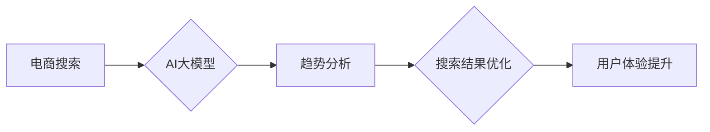

                 

## AI大模型在电商搜索结果趋势分析中的应用

> 关键词：电商搜索、AI大模型、趋势分析、自然语言处理、推荐系统、用户行为分析、机器学习

## 1. 背景介绍

随着电商行业的蓬勃发展，用户搜索行为日益复杂，搜索结果的精准度和用户体验成为电商平台竞争的关键因素。传统的基于关键词匹配的搜索算法难以满足用户多样化的需求，无法有效捕捉用户搜索意图背后的深层含义。

近年来，深度学习技术取得了突破性进展，特别是 Transformer 架构的出现，为自然语言处理（NLP）领域带来了革命性的变化。基于 Transformer 的大语言模型（LLM）展现出强大的文本理解和生成能力，能够从海量文本数据中学习用户搜索行为的复杂模式，并预测未来搜索趋势。

## 2. 核心概念与联系

### 2.1  电商搜索

电商搜索是指用户在电商平台上输入关键词或短语，平台根据用户输入并结合自身算法，从商品库中检索出与用户需求相匹配的商品，并以列表形式展示给用户。

### 2.2  AI大模型

AI大模型是指在海量数据上训练的深度学习模型，拥有强大的泛化能力和学习能力。它们能够理解和生成人类语言，并完成各种复杂的任务，例如文本分类、机器翻译、问答系统等。

### 2.3  趋势分析

趋势分析是指通过对历史数据进行分析，预测未来某个事件或现象的发展方向。在电商搜索领域，趋势分析可以帮助平台了解用户搜索行为的变化趋势，预测未来热门商品和用户需求。

**核心概念与联系流程图**



## 3. 核心算法原理 & 具体操作步骤

### 3.1  算法原理概述

AI大模型在电商搜索结果趋势分析中的应用主要基于以下核心算法：

* **自然语言处理（NLP）:**  用于理解用户搜索词语的含义，提取关键词和语义信息。
* **机器学习（ML）:**  用于从历史搜索数据中学习用户搜索行为的模式，并预测未来搜索趋势。
* **推荐系统:**  根据用户搜索历史、浏览记录和购买行为，推荐相关商品和搜索结果。

### 3.2  算法步骤详解

1. **数据收集与预处理:** 收集用户搜索历史数据、商品信息、用户行为数据等，并进行清洗、格式化和特征提取。
2. **模型训练:** 使用 NLP 和 ML 算法训练 AI 大模型，使其能够理解用户搜索意图和预测未来搜索趋势。
3. **趋势预测:** 将最新用户搜索数据输入到训练好的 AI 大模型中，预测未来热门商品和搜索关键词。
4. **搜索结果优化:** 根据趋势预测结果，优化搜索结果排序和展示，提高用户搜索体验。
5. **效果评估:**  通过监控用户点击率、转化率等指标，评估 AI 大模型在趋势分析和搜索结果优化方面的效果。

### 3.3  算法优缺点

**优点:**

* 能够捕捉用户搜索行为的复杂模式，预测未来搜索趋势。
* 提升搜索结果的精准度和用户体验。
* 帮助电商平台了解用户需求，制定更有效的营销策略。

**缺点:**

* 需要海量数据进行训练，训练成本较高。
* 模型训练和部署需要专业技术人员。
* 模型的预测结果可能存在一定的误差。

### 3.4  算法应用领域

* **电商搜索结果优化:** 预测热门商品和搜索关键词，优化搜索结果排序和展示。
* **商品推荐:** 根据用户搜索历史和行为数据，推荐相关商品。
* **内容推荐:**  根据用户兴趣和阅读习惯，推荐相关内容。
* **市场趋势分析:**  预测市场需求变化趋势，帮助企业制定产品策略。

## 4. 数学模型和公式 & 详细讲解 & 举例说明

### 4.1  数学模型构建

在电商搜索结果趋势分析中，常用的数学模型包括：

* **词袋模型 (Bag-of-Words):** 将文本表示为词频向量，忽略词序信息。
* **TF-IDF 模型:**  计算每个词在文档中的重要性，并根据词在整个语料库中的频率进行加权。
* **Word2Vec 模型:**  将词语映射到低维向量空间，捕捉词语之间的语义关系。
* **BERT 模型:**  基于 Transformer 架构的预训练语言模型，能够理解上下文信息，提高文本理解能力。

### 4.2  公式推导过程

**TF-IDF 公式:**

$$TF-IDF(t, d) = TF(t, d) \times IDF(t)$$

其中：

* $TF(t, d)$ 表示词语 $t$ 在文档 $d$ 中的词频。
* $IDF(t)$ 表示词语 $t$ 在整个语料库中的逆向文档频率。

$$TF(t, d) = \frac{f(t, d)}{\sum_{i=1}^{N} f(i, d)}$$

$$IDF(t) = log \frac{N}{df(t)}$$

其中：

* $f(t, d)$ 表示词语 $t$ 在文档 $d$ 中出现的次数。
* $N$ 表示语料库中文档总数。
* $df(t)$ 表示词语 $t$ 在语料库中出现的文档总数。

**举例说明:**

假设有一个文档 $d$ 包含词语 "电商" 出现了 3 次，语料库中包含 1000 个文档，词语 "电商" 在语料库中出现了 100 个文档。

则：

$$TF(电商, d) = \frac{3}{10} = 0.3$$

$$IDF(电商) = log \frac{1000}{100} = log 10 = 1$$

$$TF-IDF(电商, d) = 0.3 \times 1 = 0.3$$

### 4.3  案例分析与讲解

通过对历史搜索数据进行 TF-IDF 分析，可以发现 "智能手机" 和 "电商平台" 是近期热门搜索词语，表明用户对智能手机和电商平台的需求正在增长。

## 5. 项目实践：代码实例和详细解释说明

### 5.1  开发环境搭建

* Python 3.7+
* TensorFlow 2.0+
* PyTorch 1.0+
* NLTK
* Scikit-learn

### 5.2  源代码详细实现

```python
# 导入必要的库
import nltk
from sklearn.feature_extraction.text import TfidfVectorizer

# 下载 NLTK 数据集
nltk.download('punkt')

# 定义训练数据
train_data = [
    "智能手机",
    "电商平台",
    "手机游戏",
    "在线购物",
    "电子产品"
]

# 使用 TF-IDF 模型进行特征提取
vectorizer = TfidfVectorizer()
tfidf_matrix = vectorizer.fit_transform(train_data)

# 打印 TF-IDF 矩阵
print(tfidf_matrix.toarray())
```

### 5.3  代码解读与分析

* 首先，导入必要的库，并下载 NLTK 数据集。
* 然后，定义训练数据，包含一些常见的电商搜索词语。
* 使用 `TfidfVectorizer` 类进行 TF-IDF 特征提取，将文本数据转换为词频向量。
* 最后，打印 TF-IDF 矩阵，展示每个词语在语料库中的重要性。

### 5.4  运行结果展示

运行上述代码，会输出一个 TF-IDF 矩阵，其中每个元素代表一个词语在语料库中的重要性。

## 6. 实际应用场景

### 6.1  电商平台搜索结果优化

AI 大模型可以帮助电商平台优化搜索结果，提高用户搜索体验。例如，可以根据用户搜索历史和行为数据，推荐相关商品和搜索结果，并根据趋势预测结果，调整商品排序和展示。

### 6.2  个性化商品推荐

AI 大模型可以根据用户的兴趣爱好和购买历史，个性化推荐商品，提高用户转化率。例如，可以根据用户的浏览记录和购买行为，推荐用户可能感兴趣的商品，并根据用户的评分和评论，推荐用户可能喜欢的商品。

### 6.3  市场趋势分析

AI 大模型可以分析海量用户搜索数据，预测未来市场趋势，帮助企业制定产品策略。例如，可以分析用户搜索词语的变化趋势，预测未来热门商品和市场需求。

### 6.4  未来应用展望

随着 AI 技术的不断发展，AI 大模型在电商搜索结果趋势分析中的应用将更加广泛和深入。例如，可以利用更先进的 NLP 和 ML 算法，提高模型的预测精度和准确性。还可以结合其他技术，例如图像识别和语音识别，实现更全面的用户体验。

## 7. 工具和资源推荐

### 7.1  学习资源推荐

* **斯坦福大学 NLP课程:** https://web.stanford.edu/class/cs224n/
* **深度学习 Specialization:** https://www.deeplearning.ai/
* **Hugging Face Transformers:** https://huggingface.co/transformers/

### 7.2  开发工具推荐

* **TensorFlow:** https://www.tensorflow.org/
* **PyTorch:** https://pytorch.org/
* **SpaCy:** https://spacy.io/

### 7.3  相关论文推荐

* **BERT: Pre-training of Deep Bidirectional Transformers for Language Understanding:** https://arxiv.org/abs/1810.04805
* **Attention Is All You Need:** https://arxiv.org/abs/1706.03762

## 8. 总结：未来发展趋势与挑战

### 8.1  研究成果总结

AI 大模型在电商搜索结果趋势分析领域取得了显著成果，能够有效提升搜索结果的精准度和用户体验。

### 8.2  未来发展趋势

* **模型性能提升:**  研究更先进的 NLP 和 ML 算法，提高模型的预测精度和准确性。
* **多模态融合:**  结合图像识别、语音识别等技术，实现更全面的用户体验。
* **个性化定制:**  根据用户的个性化需求，定制化搜索结果和推荐商品。

### 8.3  面临的挑战

* **数据质量:**  模型训练需要海量高质量数据，数据质量直接影响模型性能。
* **模型解释性:**  AI 大模型的决策过程往往难以解释，缺乏透明度。
* **伦理问题:**  AI 大模型可能存在偏见和歧视问题，需要关注伦理道德问题。

### 8.4  研究展望

未来，AI 大模型在电商搜索结果趋势分析领域将继续发展，并应用于更广泛的场景。研究人员将继续探索更先进的算法和技术，解决模型面临的挑战，并推动 AI 技术的健康发展。

## 9. 附录：常见问题与解答

**Q1: AI 大模型的训练成本很高吗？**

A1:  是的，训练大型 AI 模型需要大量的计算资源和时间，成本较高。

**Q2: AI 大模型的预测结果是否准确？**

A2:  AI 大模型的预测结果取决于模型的训练数据和算法的复杂度。一般来说，训练数据越多，模型越复杂，预测结果越准确。

**Q3: 如何评估 AI 大模型的性能？**

A3:  常用的评估指标包括准确率、召回率、F1-score 等。

**作者：禅与计算机程序设计艺术 / Zen and the Art of Computer Programming**<end_of_turn>

