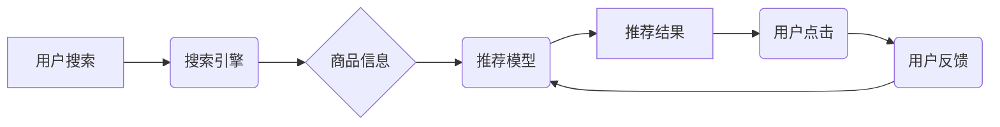

                 

## AI大模型视角下电商搜索推荐的技术创新知识沉淀方法

> 关键词：电商搜索推荐、AI大模型、知识沉淀、推荐算法、深度学习、自然语言处理、用户画像、个性化推荐

## 1. 背景介绍

电商平台作为现代商业的重要组成部分，搜索推荐系统扮演着至关重要的角色。用户在海量商品中寻找所需产品，搜索推荐系统能够根据用户的搜索意图和历史行为，精准推荐相关商品，提升用户体验，促进交易转化。

传统的电商搜索推荐系统主要依赖于基于规则的算法和协同过滤算法，这些算法虽然有效，但存在一些局限性：

* **规则难以覆盖复杂场景：** 规则需要人工设计，难以覆盖所有可能的场景和用户需求。
* **数据稀疏性问题：** 协同过滤算法依赖于用户行为数据，当用户行为数据稀疏时，推荐效果会下降。
* **缺乏个性化：** 传统算法难以捕捉用户的细微需求和偏好，推荐结果缺乏个性化。

近年来，随着深度学习技术的快速发展，AI大模型在电商搜索推荐领域展现出巨大的潜力。AI大模型能够学习海量数据中的复杂模式和关系，提供更精准、个性化的推荐结果。

## 2. 核心概念与联系

**2.1 核心概念**

* **AI大模型:** 指规模庞大、训练数据海量、具备强大泛化能力的深度学习模型。
* **电商搜索推荐:** 指根据用户搜索词和历史行为，推荐相关商品的系统。
* **知识沉淀:** 指将经验、知识和技能转化为可复用的形式，以便在未来应用和传播。

**2.2 架构关系**



**2.3 联系分析**

AI大模型可以用于构建更智能的电商搜索推荐系统，其核心在于将用户搜索信息、商品信息和用户行为数据进行融合，构建完整的用户画像，并利用深度学习算法学习用户偏好和商品特征之间的关系，从而实现精准的商品推荐。

知识沉淀在AI大模型驱动的电商搜索推荐系统中至关重要，它可以帮助我们：

* **提升模型训练效率:** 将已有的知识和经验融入模型训练中，可以加速模型训练速度，提高模型性能。
* **增强模型泛化能力:** 通过知识沉淀，可以帮助模型更好地理解用户需求和商品特征，提高模型在不同场景下的泛化能力。
* **促进模型可解释性:** 将知识沉淀与模型训练过程相结合，可以提高模型的可解释性，帮助我们更好地理解模型的决策过程。

## 3. 核心算法原理 & 具体操作步骤

**3.1 算法原理概述**

在AI大模型视角下，电商搜索推荐系统通常采用基于深度学习的推荐算法，例如：

* **协同过滤模型:** 基于用户-商品交互数据，预测用户对商品的评分或购买意愿。
* **内容推荐模型:** 基于商品的特征信息，推荐与用户兴趣相符的商品。
* **混合推荐模型:** 将协同过滤模型和内容推荐模型相结合，利用两种模型的优势，提高推荐效果。

**3.2 算法步骤详解**

以协同过滤模型为例，其具体操作步骤如下：

1. **数据预处理:** 收集用户-商品交互数据，并进行清洗、去重、格式转换等操作。
2. **特征提取:** 从用户-商品交互数据中提取用户特征和商品特征，例如用户年龄、性别、购买历史等，以及商品类别、价格、属性等。
3. **模型训练:** 利用深度学习算法，训练协同过滤模型，学习用户-商品交互关系。
4. **推荐结果生成:** 根据用户的特征和模型的预测结果，生成推荐商品列表。
5. **结果评估:** 利用指标如准确率、召回率、NDCG等，评估推荐结果的质量。

**3.3 算法优缺点**

* **优点:** 能够捕捉用户隐性偏好，推荐效果较好。
* **缺点:** 数据稀疏性问题，难以处理新用户和新商品。

**3.4 算法应用领域**

协同过滤模型广泛应用于电商推荐、电影推荐、音乐推荐等领域。

## 4. 数学模型和公式 & 详细讲解 & 举例说明

**4.1 数学模型构建**

协同过滤模型的核心是预测用户对商品的评分或购买意愿。可以使用矩阵分解模型来实现这一目标。

假设用户集合为U，商品集合为I，用户-商品交互矩阵为R，其中R(u,i)表示用户u对商品i的评分或购买行为。

矩阵分解模型将用户-商品交互矩阵分解为两个低维矩阵：用户特征矩阵P和商品特征矩阵Q。

**4.2 公式推导过程**

$$R(u,i) \approx P(u) \cdot Q(i)$$

其中，P(u)是用户u的特征向量，Q(i)是商品i的特征向量。

模型的目标是最小化预测评分与实际评分之间的误差。可以使用均方误差作为损失函数。

$$Loss = \frac{1}{2} \sum_{u \in U, i \in I} (R(u,i) - P(u) \cdot Q(i))^2$$

**4.3 案例分析与讲解**

假设有一个用户-商品交互矩阵，其中R(u,i)表示用户u对商品i的评分。

可以使用矩阵分解模型将这个矩阵分解为两个低维矩阵，例如用户特征矩阵P和商品特征矩阵Q。

通过训练模型，可以得到用户和商品的特征向量。

然后，可以利用这些特征向量来预测用户对新商品的评分。

## 5. 项目实践：代码实例和详细解释说明

**5.1 开发环境搭建**

* Python 3.6+
* TensorFlow/PyTorch
* Jupyter Notebook

**5.2 源代码详细实现**

```python
import tensorflow as tf

# 定义模型
class RecommenderModel(tf.keras.Model):
    def __init__(self, num_users, num_items, embedding_dim):
        super(RecommenderModel, self).__init__()
        self.user_embedding = tf.keras.layers.Embedding(num_users, embedding_dim)
        self.item_embedding = tf.keras.layers.Embedding(num_items, embedding_dim)

    def call(self, user_ids, item_ids):
        user_embeddings = self.user_embedding(user_ids)
        item_embeddings = self.item_embedding(item_ids)
        return tf.reduce_sum(user_embeddings * item_embeddings, axis=1)

# 训练模型
model = RecommenderModel(num_users=1000, num_items=10000, embedding_dim=64)
model.compile(optimizer='adam', loss='mse')
model.fit(user_ids, item_ids, epochs=10)

# 生成推荐结果
user_id = 123
item_embeddings = model.item_embedding(tf.constant([0, 1, 2, 3]))
scores = tf.reduce_sum(model.user_embedding(tf.constant([user_id])) * item_embeddings, axis=1)
top_k_items = tf.argsort(scores)[-5:][::-1]
```

**5.3 代码解读与分析**

* 代码定义了一个简单的协同过滤模型，使用Embedding层来学习用户和商品的特征向量。
* 模型使用均方误差作为损失函数，使用Adam优化器进行训练。
* 训练完成后，可以使用模型预测用户对新商品的评分，并根据评分排序生成推荐结果。

**5.4 运行结果展示**

运行代码后，可以得到用户对特定商品的评分预测结果，并根据评分排序生成推荐商品列表。

## 6. 实际应用场景

AI大模型驱动的电商搜索推荐系统已在各大电商平台广泛应用，例如：

* **个性化商品推荐:** 根据用户的浏览历史、购买记录、兴趣偏好等信息，推荐个性化的商品。
* **搜索结果排序:** 根据用户的搜索词和历史行为，对搜索结果进行排序，提升用户体验。
* **新品推荐:** 利用AI大模型学习新品的特征信息，推荐新上市的商品。
* **跨界推荐:** 根据用户的兴趣爱好，推荐跨界商品，例如推荐喜欢运动的用户购买运动服饰和运动鞋。

**6.4 未来应用展望**

未来，AI大模型驱动的电商搜索推荐系统将朝着以下方向发展：

* **更精准的推荐:** 利用更先进的深度学习算法和更丰富的用户数据，实现更精准的商品推荐。
* **更个性化的推荐:** 结合用户画像、行为分析、情感识别等技术，提供更个性化的推荐服务。
* **更智能的交互:** 利用自然语言处理技术，实现更智能的商品搜索和推荐交互。
* **更丰富的场景应用:** 将AI大模型应用于更多电商场景，例如商品分类、价格预测、库存管理等。

## 7. 工具和资源推荐

**7.1 学习资源推荐**

* **书籍:**
    * 深度学习
    * 自然语言处理
    * 推荐系统
* **在线课程:**
    * Coursera
    * edX
    * Udacity

**7.2 开发工具推荐**

* **Python:** 
* **TensorFlow/PyTorch:** 深度学习框架
* **Scikit-learn:** 机器学习库
* **Jupyter Notebook:** 数据分析和可视化工具

**7.3 相关论文推荐**

* **Collaborative Filtering for Implicit Feedback Datasets**
* **Deep Learning for Recommender Systems**
* **Neural Collaborative Filtering**

## 8. 总结：未来发展趋势与挑战

**8.1 研究成果总结**

AI大模型在电商搜索推荐领域取得了显著成果，能够提供更精准、个性化的推荐服务，提升用户体验和商业价值。

**8.2 未来发展趋势**

未来，AI大模型驱动的电商搜索推荐系统将朝着更精准、个性化、智能化、场景化方向发展。

**8.3 面临的挑战**

* **数据稀疏性问题:** 
* **模型可解释性问题:** 
* **公平性与隐私问题:**

**8.4 研究展望**

未来研究方向包括：

* **开发更有效的算法:** 
* **解决数据稀疏性问题:** 
* **提升模型可解释性:** 
* **保障公平性与隐私:**

## 9. 附录：常见问题与解答

* **Q1: 如何处理数据稀疏性问题？**

* **A1:** 可以使用以下方法处理数据稀疏性问题：
    * **矩阵分解:** 将用户-商品交互矩阵分解为两个低维矩阵，学习用户和商品的隐性特征。
    * **迁移学习:** 利用其他领域的数据进行预训练，迁移到电商推荐任务中。
    * **多模态学习:** 结合文本、图像、视频等多模态数据，丰富用户和商品的特征信息。

* **Q2: 如何提升模型可解释性？**

* **A2:** 可以使用以下方法提升模型可解释性：
    * **注意力机制:** 
    * **LIME:** 
    * **SHAP:**

* **Q3: 如何保障公平性与隐私？**

* **A3:** 可以使用以下方法保障公平性与隐私：
    * **公平性算法:** 
    * **差分隐私:** 
    * **联邦学习:**


作者：禅与计算机程序设计艺术 / Zen and the Art of Computer Programming 
<end_of_turn>

