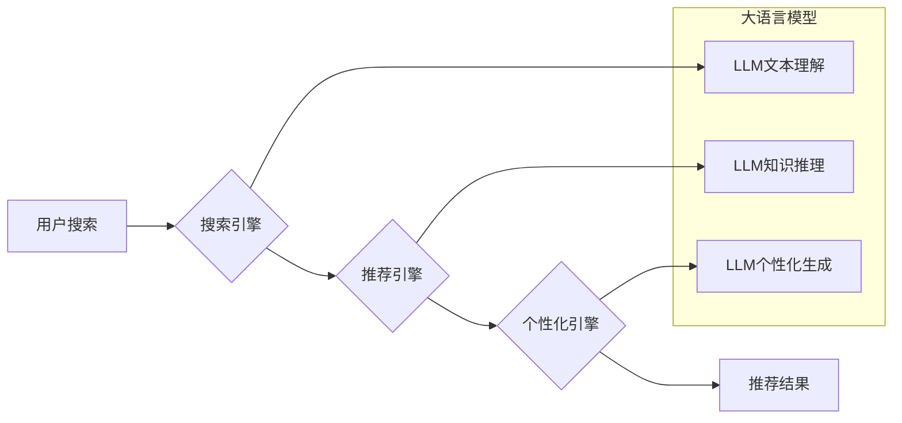

                 

## AI大模型重构电商搜索推荐的业务形态

> 关键词：电商搜索、推荐系统、大语言模型、Transformer、知识图谱、个性化推荐、业务形态重构

### 1. 背景介绍

电商行业竞争日益激烈，用户需求日益多元化，传统的搜索推荐系统已难以满足用户对个性化、精准、智能化体验的需求。随着大语言模型（LLM）技术的快速发展，其强大的文本理解、生成和推理能力为电商搜索推荐带来了新的机遇。

传统的电商搜索推荐系统主要依赖于基于规则的匹配、协同过滤和内容过滤等算法，这些算法存在着以下问题：

* **缺乏语义理解能力:** 难以理解用户搜索意图的深层含义，导致推荐结果不精准。
* **数据孤岛问题:** 各个模块数据分散，难以形成统一的知识体系，导致推荐结果缺乏关联性和深度。
* **个性化程度低:** 推荐结果缺乏针对性，难以满足不同用户个性化的需求。

大语言模型的出现为解决这些问题提供了新的思路。LLM能够通过学习海量文本数据，掌握丰富的语言知识和语义理解能力，从而实现更精准、更智能的搜索推荐。

### 2. 核心概念与联系

#### 2.1  大语言模型 (LLM)

大语言模型是一种基于Transformer架构的深度学习模型，通过训练海量文本数据，学习语言的语法、语义和上下文关系。LLM能够理解和生成人类语言，并具备强大的文本处理能力，例如文本分类、问答、摘要、翻译等。

#### 2.2  电商搜索推荐系统

电商搜索推荐系统是帮助用户快速找到所需商品的系统，它通常由以下几个模块组成：

* **搜索引擎:** 处理用户搜索词，并返回相关商品列表。
* **推荐引擎:** 根据用户行为、商品信息等数据，推荐用户可能感兴趣的商品。
* **个性化引擎:** 根据用户画像和偏好，个性化推荐商品。

#### 2.3  知识图谱 (KG)

知识图谱是一种结构化的知识表示形式，它将实体和关系以图的形式表示，能够存储和推理丰富的知识。知识图谱可以帮助电商搜索推荐系统理解商品之间的关系，提供更精准的推荐结果。

**核心概念与架构流程图**



### 3. 核心算法原理 & 具体操作步骤

#### 3.1  算法原理概述

LLM在电商搜索推荐系统中的应用主要基于以下算法原理：

* **文本嵌入:** 将文本转换为向量表示，以便模型进行计算和比较。
* **语义相似度计算:** 计算文本之间的语义相似度，例如使用余弦相似度或点积相似度。
* **知识图谱推理:** 利用知识图谱中的关系和规则，进行商品之间的关联推理。
* **个性化模型训练:** 根据用户行为数据，训练个性化推荐模型，生成针对用户的推荐结果。

#### 3.2  算法步骤详解

1. **数据预处理:** 收集用户搜索词、商品信息、用户行为数据等，并进行清洗、格式化和转换。
2. **文本嵌入:** 使用预训练的LLM模型，将文本数据转换为向量表示。
3. **语义相似度计算:** 计算用户搜索词与商品标题、描述等文本之间的语义相似度。
4. **知识图谱推理:** 利用知识图谱中的关系和规则，进行商品之间的关联推理，例如根据用户搜索的“运动鞋”，推荐相关的“运动服”、“运动袜”等商品。
5. **个性化模型训练:** 使用用户行为数据，训练个性化推荐模型，例如使用协同过滤算法或深度学习模型。
6. **推荐结果生成:** 根据用户搜索词、语义相似度、知识图谱推理和个性化模型预测，生成推荐结果列表。

#### 3.3  算法优缺点

**优点:**

* **语义理解能力强:** 能够理解用户搜索意图的深层含义，提高推荐结果的精准度。
* **个性化程度高:** 可以根据用户画像和偏好，提供个性化的推荐结果。
* **关联性强:** 利用知识图谱，能够推荐相关商品，提升用户体验。

**缺点:**

* **计算资源需求高:** 训练和部署LLM模型需要大量的计算资源。
* **数据依赖性强:** LLM模型的性能依赖于训练数据的质量和数量。
* **可解释性低:** LLM模型的决策过程较为复杂，难以解释推荐结果背后的逻辑。

#### 3.4  算法应用领域

LLM在电商搜索推荐系统中的应用领域广泛，例如：

* **商品搜索:** 理解用户搜索词的意图，提供更精准的商品搜索结果。
* **个性化推荐:** 根据用户行为和偏好，推荐个性化的商品列表。
* **商品描述生成:** 利用LLM生成商品描述，提高商品的吸引力。
* **客户服务:** 利用LLM构建智能客服系统，自动回答用户问题。

### 4. 数学模型和公式 & 详细讲解 & 举例说明

#### 4.1  数学模型构建

LLM的训练目标通常是最大化模型输出的概率，即预测目标文本的概率。可以使用交叉熵损失函数来衡量模型的预测误差。

#### 4.2  公式推导过程

**交叉熵损失函数:**

$$
H(p, q) = - \sum_{i=1}^{n} p(i) \log q(i)
$$

其中：

* $p(i)$ 是真实标签的概率分布。
* $q(i)$ 是模型预测的概率分布。

**目标函数:**

$$
L = H(p, q) + \lambda R(w)
$$

其中：

* $L$ 是损失函数。
* $\lambda$ 是正则化参数。
* $R(w)$ 是模型参数 $w$ 的正则化项，例如L2正则化。

#### 4.3  案例分析与讲解

假设用户搜索了“运动鞋”，模型需要预测相关的商品列表。可以使用语义相似度计算来衡量用户搜索词与商品标题、描述之间的相似度。例如，可以使用余弦相似度来计算两个向量的夹角，夹角越小，相似度越高。

**余弦相似度公式:**

$$
\text{cosine}(A, B) = \frac{A \cdot B}{||A|| ||B||}
$$

其中：

* $A$ 和 $B$ 是两个向量。
* $A \cdot B$ 是两个向量的点积。
* $||A||$ 和 $||B||$ 是两个向量的模长。

通过计算商品标题、描述与用户搜索词的余弦相似度，可以筛选出与用户搜索意图最相关的商品，并将其推荐给用户。

### 5. 项目实践：代码实例和详细解释说明

#### 5.1  开发环境搭建

* Python 3.7+
* PyTorch 或 TensorFlow
* CUDA 和 cuDNN (可选)

#### 5.2  源代码详细实现

```python
# 导入必要的库
import torch
from transformers import AutoTokenizer, AutoModel

# 加载预训练的LLM模型和词典
tokenizer = AutoTokenizer.from_pretrained("bert-base-uncased")
model = AutoModel.from_pretrained("bert-base-uncased")

# 定义用户搜索词
query = "运动鞋"

# 将用户搜索词转换为向量表示
input_ids = tokenizer.encode(query, add_special_tokens=True)
input_ids = torch.tensor([input_ids])

# 将向量表示输入到LLM模型中
outputs = model(input_ids)

# 从LLM模型的输出中提取语义向量
embedding = outputs.last_hidden_state[:, 0, :]

# ... (后续代码用于计算商品与用户搜索词的语义相似度，并生成推荐结果)
```

#### 5.3  代码解读与分析

* 代码首先导入必要的库，并加载预训练的LLM模型和词典。
* 然后，将用户搜索词转换为向量表示，并将其输入到LLM模型中。
* LLM模型会将用户搜索词转换为语义向量，该向量包含了用户搜索词的语义信息。
* 后续代码可以利用语义向量计算商品与用户搜索词的相似度，并生成推荐结果。

#### 5.4  运行结果展示

运行上述代码后，会输出用户搜索词的语义向量，以及与该向量相似度最高的商品列表。

### 6. 实际应用场景

#### 6.1  电商搜索场景

LLM可以帮助电商平台提升商品搜索的精准度和用户体验。例如，可以理解用户搜索词的隐含含义，推荐更相关的商品；可以根据用户历史搜索记录和购买行为，个性化推荐商品。

#### 6.2  商品推荐场景

LLM可以帮助电商平台提供更精准、更个性化的商品推荐。例如，可以根据用户的兴趣爱好、购买历史、浏览记录等数据，推荐用户可能感兴趣的商品；可以根据用户的年龄、性别、地理位置等信息，提供更精准的地域化推荐。

#### 6.3  内容生成场景

LLM可以帮助电商平台生成更吸引用户的商品描述、广告文案等内容。例如，可以根据商品的属性和特点，自动生成商品描述；可以根据用户的兴趣爱好，生成个性化的广告文案。

#### 6.4  未来应用展望

随着LLM技术的不断发展，其在电商搜索推荐领域的应用场景将更加广泛。例如，可以利用LLM构建更智能的客服系统，自动回答用户问题；可以利用LLM进行商品分类和标签识别，提高商品管理效率；可以利用LLM进行市场调研和趋势分析，帮助电商平台制定更精准的营销策略。

### 7. 工具和资源推荐

#### 7.1  学习资源推荐

* **论文:**
    * BERT: Pre-training of Deep Bidirectional Transformers for Language Understanding
    * GPT-3: Language Models are Few-Shot Learners
* **博客:**
    * The Illustrated Transformer
    * Hugging Face Blog
* **在线课程:**
    * Deep Learning Specialization (Coursera)
    * Natural Language Processing with Deep Learning (Udacity)

#### 7.2  开发工具推荐

* **Hugging Face Transformers:** 一个开源的LLM库，提供预训练模型和工具。
* **TensorFlow:** 一个开源的深度学习框架。
* **PyTorch:** 另一个开源的深度学习框架。

#### 7.3  相关论文推荐

* **BERT for Question Answering:** https://arxiv.org/abs/1810.04805
* **XLNet: Generalized Autoregressive Pretraining for Language Understanding:** https://arxiv.org/abs/1906.08237
* **T5: Text-to-Text Transfer Transformer:** https://arxiv.org/abs/1910.10683

### 8. 总结：未来发展趋势与挑战

#### 8.1  研究成果总结

LLM在电商搜索推荐领域的应用取得了显著成果，例如提高了推荐精准度、个性化程度和用户体验。

#### 8.2  未来发展趋势

* **模型规模和性能提升:** 未来LLM模型的规模和性能将继续提升，能够理解更复杂的语言和知识，提供更精准的推荐结果。
* **多模态融合:** LLM将与其他模态数据，例如图像、视频、音频等融合，提供更全面的用户体验。
* **可解释性增强:** 研究者将致力于提高LLM模型的可解释性，帮助用户理解推荐结果背后的逻辑。

#### 8.3  面临的挑战

* **数据安全和隐私保护:** LLM模型的训练需要大量数据，如何保证数据安全和用户隐私是一个重要的挑战。
* **模型部署成本:** 训练和部署大型LLM模型需要大量的计算资源，成本较高。
* **伦理问题:** LLM模型可能会产生偏见或歧视性结果，需要关注其伦理问题。

#### 8.4  研究展望

未来，LLM在电商搜索推荐领域的应用将更加广泛和深入，将推动电商行业的发展和创新。


### 9. 附录：常见问题与解答

* **Q1: LLM模型的训练需要多少数据？**

A1: LLM模型的训练需要海量文本数据，通常需要数十亿甚至数千亿个单词。

* **Q2: 如何评估LLM模型的性能？**

A2: 可以使用各种指标来评估LLM模型的性能，例如准确率、召回率、F1-score等。

* **Q3: 如何部署LLM模型？**

A3: 可以使用云平台或本地服务器部署LLM模型。

* **Q4: LLM模型的训练成本高吗？**

A4: 训练大型LLM模型的成本较高，需要大量的计算资源和时间。

* **Q5: LLM模型的安全性如何保证？**

A5: 需要采取措施保证LLM模型的安全性，例如数据加密、模型安全评估等。


作者：禅与计算机程序设计艺术 / Zen and the Art of Computer Programming 
<end_of_turn>

