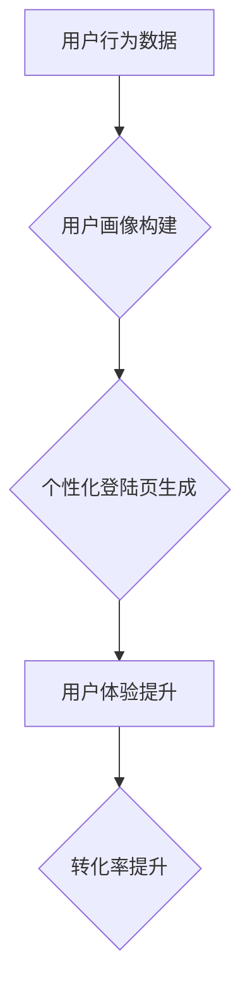

                 

## AI如何优化电商平台的个性化登陆页

> 关键词：电商平台、个性化登陆页、人工智能、推荐系统、用户画像、机器学习、深度学习、A/B测试

## 1. 背景介绍

在当今竞争激烈的电商市场，用户体验至关重要。电商平台需要不断探索新的方式来吸引和留住用户。个性化登陆页作为用户首次接触平台的窗口，其优化对提升用户粘性和转化率具有重要意义。传统的登陆页往往千篇一律，无法满足用户个性化的需求。而人工智能技术的应用为个性化登陆页的优化提供了强大的工具。

## 2. 核心概念与联系

### 2.1 个性化登陆页

个性化登陆页是指根据用户的行为、偏好、历史记录等信息，动态生成定制化的登陆页面，以提供更符合用户需求的内容和体验。

### 2.2 人工智能

人工智能 (AI) 是一门致力于模拟人类智能的学科，涵盖了机器学习、深度学习、自然语言处理等多个领域。AI 技术可以帮助电商平台分析海量用户数据，识别用户画像，并根据用户特征生成个性化的登陆页内容。

### 2.3 推荐系统

推荐系统是基于用户行为和偏好，推荐用户感兴趣的内容或商品的系统。个性化登陆页可以利用推荐系统，推荐用户可能感兴趣的商品、活动或品牌，引导用户进一步浏览和购买。

**核心概念与联系流程图:**



## 3. 核心算法原理 & 具体操作步骤

### 3.1 算法原理概述

个性化登陆页的优化主要依赖于机器学习算法，例如协同过滤、内容过滤和混合推荐算法。这些算法可以根据用户的历史行为、偏好和属性，预测用户对特定内容的兴趣，并推荐相应的商品或信息。

### 3.2 算法步骤详解

1. **数据收集:** 收集用户行为数据，包括浏览历史、购买记录、评价信息、购物车内容等。
2. **数据预处理:** 对收集到的数据进行清洗、转换和特征提取，以便于算法训练。
3. **模型训练:** 选择合适的机器学习算法，并利用预处理后的数据进行模型训练。
4. **模型评估:** 使用测试数据评估模型的性能，并根据评估结果进行模型调优。
5. **个性化推荐:** 将训练好的模型应用于新的用户数据，生成个性化的登陆页推荐内容。

### 3.3 算法优缺点

**优点:**

* **个性化推荐:** 可以根据用户的实际需求提供更精准的推荐，提升用户体验。
* **数据驱动:** 基于用户行为数据进行决策，避免主观臆断，提高推荐准确率。
* **持续优化:** 可以不断收集用户反馈，对模型进行迭代优化，提升推荐效果。

**缺点:**

* **数据依赖:** 需要大量高质量的用户数据进行训练，否则模型效果难以保证。
* **算法复杂:** 训练和维护机器学习模型需要一定的技术门槛。
* **冷启动问题:** 对新用户或新商品的推荐效果可能较差。

### 3.4 算法应用领域

个性化登陆页的优化算法广泛应用于电商平台、社交媒体、新闻资讯等领域，可以用于推荐商品、内容、服务等，提升用户体验和转化率。

## 4. 数学模型和公式 & 详细讲解 & 举例说明

### 4.1 数学模型构建

协同过滤算法是一种常用的推荐算法，其核心思想是基于用户的相似度或商品的相似度进行推荐。

**用户-物品交互矩阵:**

用户-物品交互矩阵是一个二维矩阵，其中每一行代表一个用户，每一列代表一个商品，矩阵元素表示用户对商品的评分或交互行为。

**用户相似度计算:**

可以使用余弦相似度或皮尔逊相关系数等方法计算用户之间的相似度。

**商品相似度计算:**

可以使用余弦相似度或Jaccard系数等方法计算商品之间的相似度。

### 4.2 公式推导过程

**余弦相似度:**

$$
\text{相似度} = \frac{\mathbf{u} \cdot \mathbf{v}}{\|\mathbf{u}\| \|\mathbf{v}\|}
$$

其中：

* $\mathbf{u}$ 和 $\mathbf{v}$ 是两个用户的向量表示。
* $\mathbf{u} \cdot \mathbf{v}$ 是两个向量的点积。
* $\|\mathbf{u}\|$ 和 $\|\mathbf{v}\|$ 是两个向量的模长。

**皮尔逊相关系数:**

$$
\text{相关系数} = \frac{\sum_{i=1}^{n}(u_i - \bar{u})(v_i - \bar{v})}{\sqrt{\sum_{i=1}^{n}(u_i - \bar{u})^2} \sqrt{\sum_{i=1}^{n}(v_i - \bar{v})^2}}
$$

其中：

* $u_i$ 和 $v_i$ 是两个用户对第 $i$ 个商品的评分。
* $\bar{u}$ 和 $\bar{v}$ 是两个用户的平均评分。

### 4.3 案例分析与讲解

假设有两个用户 A 和 B，他们对以下三个商品的评分如下：

| 商品 | 用户 A | 用户 B |
|---|---|---|
| 商品 1 | 5 | 4 |
| 商品 2 | 3 | 5 |
| 商品 3 | 4 | 3 |

我们可以使用余弦相似度计算用户 A 和 B 的相似度：

$$
\text{相似度} = \frac{(5 \times 4) + (3 \times 5) + (4 \times 3)}{\sqrt{5^2 + 3^2 + 4^2} \sqrt{4^2 + 5^2 + 3^2}} = \frac{20 + 15 + 12}{\sqrt{50} \sqrt{50}} = \frac{47}{50} = 0.94
$$

结果表明，用户 A 和 B 的相似度较高，可以认为他们是相似的用户。

## 5. 项目实践：代码实例和详细解释说明

### 5.1 开发环境搭建

* Python 3.x
* TensorFlow 或 PyTorch
* Jupyter Notebook 或 VS Code

### 5.2 源代码详细实现

```python
# 导入必要的库
import pandas as pd
from sklearn.metrics.pairwise import cosine_similarity

# 加载用户-物品交互数据
data = pd.read_csv('user_item_interaction.csv')

# 构建用户-物品交互矩阵
user_item_matrix = data.pivot_table(index='user_id', columns='item_id', values='rating')

# 计算用户相似度
user_similarity = cosine_similarity(user_item_matrix)

# 获取用户 A 的相似用户
user_A_id = 1
similar_users = user_similarity[user_A_id].argsort()[:-6:-1]  # 排序并获取前 5 个相似用户

# 推荐商品
recommended_items = []
for similar_user in similar_users:
    # 获取相似用户喜欢的商品
    similar_user_items = user_item_matrix.loc[similar_user].index[user_item_matrix.loc[similar_user] > 3]
    # 推荐用户 A 尚未购买的商品
    for item in similar_user_items:
        if user_item_matrix.loc[user_A_id, item] == 0:
            recommended_items.append(item)

# 打印推荐结果
print(f'推荐给用户 {user_A_id} 的商品：{recommended_items}')
```

### 5.3 代码解读与分析

* 代码首先导入必要的库，并加载用户-物品交互数据。
* 然后构建用户-物品交互矩阵，并使用余弦相似度计算用户之间的相似度。
* 获取用户 A 的相似用户，并根据相似用户的喜好推荐用户 A 尚未购买的商品。

### 5.4 运行结果展示

运行代码后，将输出用户 A 尚未购买但可能感兴趣的商品列表。

## 6. 实际应用场景

个性化登陆页的优化在电商平台的实际应用场景中具有广泛的应用价值。

### 6.1 商品推荐

根据用户的浏览历史、购买记录等信息，推荐用户可能感兴趣的商品，提升商品曝光率和转化率。

### 6.2 活动推广

根据用户的兴趣爱好和消费习惯，推荐相关的促销活动和优惠信息，引导用户参与活动，提升用户粘性和销售额。

### 6.3 内容推荐

根据用户的阅读偏好和浏览历史，推荐相关的文章、视频、图文等内容，提升用户阅读体验和平台活跃度。

### 6.4 个性化营销

根据用户的画像信息，进行精准的营销推广，提升营销效果和用户转化率。

## 7. 工具和资源推荐

### 7.1 学习资源推荐

* **书籍:**
    * 《推荐系统实践》
    * 《机器学习》
* **在线课程:**
    * Coursera: Machine Learning
    * edX: Artificial Intelligence

### 7.2 开发工具推荐

* **Python:** TensorFlow, PyTorch, Scikit-learn
* **数据可视化工具:** Tableau, Power BI

### 7.3 相关论文推荐

* **协同过滤算法:**
    * "Collaborative Filtering for Implicit Feedback Datasets"
    * "Matrix Factorization Techniques for Recommender Systems"
* **深度学习推荐系统:**
    * "Deep Learning for Recommender Systems"
    * "Neural Collaborative Filtering"

## 8. 总结：未来发展趋势与挑战

### 8.1 研究成果总结

个性化登陆页的优化利用人工智能技术，可以有效提升用户体验和转化率。协同过滤算法和深度学习推荐系统是常用的推荐算法，可以根据用户的行为和偏好进行精准的推荐。

### 8.2 未来发展趋势

* **更精准的个性化推荐:** 利用更先进的机器学习算法和深度学习模型，实现更精准的个性化推荐。
* **多模态数据融合:** 将文本、图像、视频等多模态数据融合到推荐系统中，提升推荐效果。
* **实时个性化推荐:** 利用实时数据流，实现对用户行为的实时分析和个性化推荐。
* **解释性推荐:** 提升推荐系统的可解释性，让用户了解推荐结果背后的逻辑。

### 8.3 面临的挑战

* **数据隐私保护:** 个性化推荐需要大量用户数据，如何保护用户隐私是一个重要的挑战。
* **算法公平性:** 避免推荐算法产生偏见，确保推荐结果公平公正。
* **冷启动问题:** 如何对新用户和新商品进行有效的推荐，是一个需要解决的难题。

### 8.4 研究展望

未来，个性化登陆页的优化将朝着更精准、更智能、更可解释的方向发展，为用户提供更个性化、更丰富的体验。


## 9. 附录：常见问题与解答

**Q1: 如何收集用户数据？**

**A1:** 可以通过用户注册、登录、浏览历史、购买记录、评价信息等方式收集用户数据。

**Q2: 如何处理用户数据隐私？**

**A2:** 需要遵循数据隐私保护法规，采取匿名化、加密等技术保护用户隐私。

**Q3: 如何评估个性化登陆页的效果？**

**A3:** 可以通过用户停留时间、点击率、转化率等指标评估个性化登陆页的效果。

**Q4: 如何应对冷启动问题？**

**A4:** 可以利用用户画像、商品属性等信息进行推荐，并不断收集用户反馈，对模型进行迭代优化。


作者：禅与计算机程序设计艺术 / Zen and the Art of Computer Programming 
<end_of_turn>

